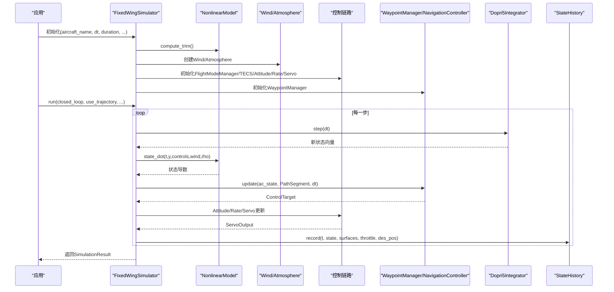
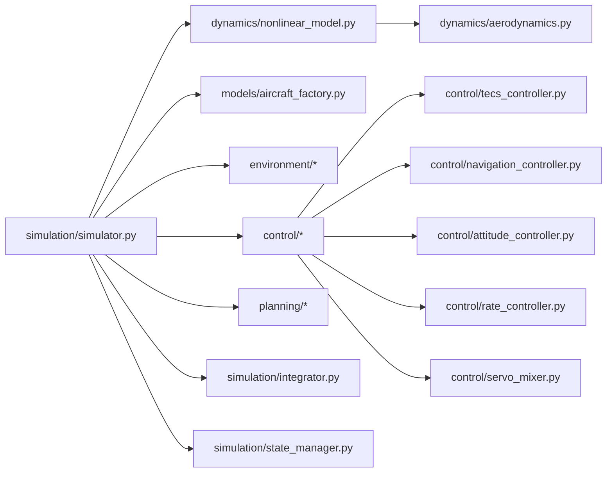

# API参考

<cite>
**本文引用的文件**
- [setup.py](file://setup.py)
- [requirements.txt](file://requirements.txt)
- [README.md](file://README.md)
- [src/simulation/__init__.py](file://src/simulation/__init__.py)
- [src/simulation/simulator.py](file://src/simulation/simulator.py)
- [src/simulation/integrator.py](file://src/simulation/integrator.py)
- [src/simulation/state_manager.py](file://src/simulation/state_manager.py)
- [src/models/__init__.py](file://src/models/__init__.py)
- [src/models/aircraft_factory.py](file://src/models/aircraft_factory.py)
- [src/models/aircraft_database.py](file://src/models/aircraft_database.py)
- [src/dynamics/__init__.py](file://src/dynamics/__init__.py)
- [src/dynamics/nonlinear_model.py](file://src/dynamics/nonlinear_model.py)
- [src/dynamics/linear_model.py](file://src/dynamics/linear_model.py)
- [src/dynamics/aerodynamics.py](file://src/dynamics/aerodynamics.py)
- [src/control/__init__.py](file://src/control/__init__.py)
- [src/planning/__init__.py](file://src/planning/__init__.py)
- [src/environment/__init__.py](file://src/environment/__init__.py)
- [src/utils/__init__.py](file://src/utils/__init__.py)
- [src/visualization/__init__.py](file://src/visualization/__init__.py)
</cite>

## 目录
1. [简介](#简介)
2. [项目结构](#项目结构)
3. [核心组件](#核心组件)
4. [架构总览](#架构总览)
5. [详细组件分析](#详细组件分析)
6. [依赖关系分析](#依赖关系分析)
7. [性能与使用限制](#性能与使用限制)
8. [故障排查指南](#故障排查指南)
9. [结论](#结论)
10. [附录：版本与变更历史](#附录版本与变更历史)

## 简介
本API参考面向FixedWingSimulator仿真平台，系统梳理了simulation、models、dynamics、control、planning、environment、visualization、utils等子模块的公共接口与类定义，覆盖构造函数、方法签名、参数说明、返回值类型、错误处理与使用建议，并通过类图与时序图展示模块间协作关系。同时提供性能特征、版本兼容性与变更历史说明，帮助开发者快速集成与扩展。

## 项目结构
项目采用按功能域分层的包组织方式，核心入口位于src/下各子模块，通过各模块的__init__.py统一导出公共API，便于上层应用按需导入。

```mermaid
graph TB
subgraph "仿真引擎"
SIM["simulation/simulator.py<br/>FixedWingSimulator"]
INT["simulation/integrator.py<br/>Dopri5Integrator/RK45Integrator"]
STM["simulation/state_manager.py<br/>AircraftSimState/StateHistory"]
end
subgraph "模型与数据库"
ADB["models/aircraft_database.py<br/>get_aircraft_params/list_aircraft/aircraft_info"]
AF["models/aircraft_factory.py<br/>AircraftFactory/AircraftConfig"]
end
subgraph "动力学"
NL["dynamics/nonlinear_model.py<br/>NonlinearModel/Controls/TrimResult"]
LM["dynamics/linear_model.py<br/>LinearModel/LinearAnalysisResult"]
AD["dynamics/aerodynamics.py<br/>compute_aero_forces/AeroForces"]
end
subgraph "控制"
FM["control/flight_mode_manager.py<br/>FlightMode/FlightModeManager/AircraftState/ControlTarget"]
NC["control/navigation_controller.py<br/>NavigationController/PathSegment"]
AC["control/attitude_controller.py<br/>AttitudeController"]
RC["control/rate_controller.py<br/>RateController"]
SM["control/servo_mixer.py<br/>ServoMixer/ServoOutput"]
AP["control/ardupilot_compat.py<br/>ArdupilotParams"]
TC["control/tecs_controller.py<br/>TECSController/TECSState"]
PC["control/pid_controller.py<br/>PIDController"]
end
subgraph "规划"
TRAJ["planning/trajectory_base.py<br/>AbstractTrajectory/TrajectoryState"]
MINJ["planning/minimum_jerk.py<br/>MinimumJerkTrajectory"]
MINS["planning/minimum_snap.py<br/>MinimumSnapTrajectory/minimum_snap_coeffs"]
WPM["planning/waypoint_manager.py<br/>WaypointManager"]
end
subgraph "环境"
ATM["environment/atmosphere_model.py<br/>compute_density/compute_pressure/compute_temperature/compute_speed_of_sound/atmosphere"]
WIND["environment/wind_model.py<br/>Wind"]
AERO["environment/aerodynamic_forces.py<br/>compute_wind_drag_forces"]
end
subgraph "可视化"
PLOT["visualization/plotter.py<br/>FixedWingPlotter"]
ANIM["visualization/animator.py<br/>FixedWingAnimator"]
DASH["visualization/dashboard.py<br/>FixedWingDashboard"]
end
subgraph "工具"
CFG["utils/config_loader.py<br/>ConfigLoader"]
LOG["utils/logger.py<br/>Logger"]
MATH["utils/math_utils.py<br/>math_utils"]
end
SIM --> AF
SIM --> NL
SIM --> ATM
SIM --> WIND
SIM --> FM
SIM --> NC
SIM --> AC
SIM --> RC
SIM --> SM
SIM --> WPM
SIM --> INT
SIM --> STM
NL --> AD
LM --> ADB
AF --> ADB
NC --> TRAJ
WPM --> TRAJ
WPM --> MINJ
WPM --> MINS
PLOT --> STM
ANIM --> STM
```

**图表来源**
- [src/simulation/simulator.py](file://src/simulation/simulator.py#L115-L642)
- [src/simulation/integrator.py](file://src/simulation/integrator.py#L17-L108)
- [src/simulation/state_manager.py](file://src/simulation/state_manager.py#L16-L193)
- [src/models/aircraft_factory.py](file://src/models/aircraft_factory.py#L39-L136)
- [src/models/aircraft_database.py](file://src/models/aircraft_database.py#L29-L183)
- [src/dynamics/nonlinear_model.py](file://src/dynamics/nonlinear_model.py#L104-L386)
- [src/dynamics/linear_model.py](file://src/dynamics/linear_model.py#L107-L319)
- [src/dynamics/aerodynamics.py](file://src/dynamics/aerodynamics.py#L35-L148)
- [src/planning/waypoint_manager.py](file://src/planning/waypoint_manager.py)
- [src/planning/trajectory_base.py](file://src/planning/trajectory_base.py)
- [src/planning/minimum_jerk.py](file://src/planning/minimum_jerk.py)
- [src/planning/minimum_snap.py](file://src/planning/minimum_snap.py)
- [src/environment/atmosphere_model.py](file://src/environment/atmosphere_model.py)
- [src/environment/wind_model.py](file://src/environment/wind_model.py)
- [src/visualization/plotter.py](file://src/visualization/plotter.py)
- [src/visualization/animator.py](file://src/visualization/animator.py)
- [src/visualization/dashboard.py](file://src/visualization/dashboard.py)

**章节来源**
- [src/simulation/__init__.py](file://src/simulation/__init__.py#L1-L12)
- [src/models/__init__.py](file://src/models/__init__.py#L1-L15)
- [src/dynamics/__init__.py](file://src/dynamics/__init__.py#L1-L22)
- [src/control/__init__.py](file://src/control/__init__.py#L1-L24)
- [src/planning/__init__.py](file://src/planning/__init__.py#L1-L14)
- [src/environment/__init__.py](file://src/environment/__init__.py#L1-L16)
- [src/visualization/__init__.py](file://src/visualization/__init__.py#L1-L8)

## 核心组件
本节概述主要公共API与类，后续章节将逐模块展开。

- simulation
  - FixedWingSimulator：主仿真器，负责编排模型、环境、控制、规划、积分器与状态管理；提供run、run_linear_analysis、init_step、step等公共方法。
  - SimulationResult：一次完整仿真的结果容器，提供summary与visualize等便捷方法。
  - Dopri5Integrator、RK45Integrator：数值积分器，分别用于实时步进与批量求解。
  - AircraftSimState、StateHistory：仿真状态数据结构与高效历史记录缓冲。

- models
  - AircraftFactory、AircraftConfig：从数据库加载并合并参数，支持YAML与字典覆盖。
  - get_aircraft_params、list_aircraft、aircraft_info：参数查询与信息汇总。

- dynamics
  - NonlinearModel：6自由度非线性动力学，提供compute_trim、state_dot、simulate等。
  - LinearModel：4自由度纵向线性化模型，提供build、analyze_modes、simulate、run_analysis等。
  - compute_aero_forces、AeroForces：气动计算与力矩容器。
  - 坐标变换工具：dcm_from_euler、body_to_ned、ned_to_body、euler_rates、wind_to_body_frame、airspeed_vector。

- control
  - FlightMode、FlightModeManager、AircraftState、ControlTarget：飞行模式与目标生成。
  - NavigationController、PathSegment：导航控制器与航段表示。
  - AttitudeController、RateController、ServoMixer、ServoOutput：姿态、角率与舵面混合控制。
  - TECSController、TECSState：总能量交叉控制系统。
  - PIDController：通用PID控制器。
  - ArdupilotParams：ArduPilot参数兼容层。

- planning
  - AbstractTrajectory、TrajectoryState：轨迹抽象与状态。
  - MinimumSnapTrajectory、minimum_snap_coeffs：最小Snap轨迹与系数。
  - MinimumJerkTrajectory：最小Jerk轨迹。
  - WaypointManager：航点管理器。

- environment
  - compute_density、compute_pressure、compute_temperature、compute_speed_of_sound、atmosphere：标准大气模型。
  - Wind：风场模型。
  - compute_wind_drag_forces：风阻计算。

- visualization
  - FixedWingPlotter、FixedWingAnimator、FixedWingDashboard：绘图、动画与仪表盘。

- utils
  - ConfigLoader、Logger（占位）、math_utils（占位）：配置加载与数学工具。

**章节来源**
- [src/simulation/simulator.py](file://src/simulation/simulator.py#L59-L642)
- [src/simulation/integrator.py](file://src/simulation/integrator.py#L17-L108)
- [src/simulation/state_manager.py](file://src/simulation/state_manager.py#L16-L193)
- [src/models/aircraft_factory.py](file://src/models/aircraft_factory.py#L39-L136)
- [src/models/aircraft_database.py](file://src/models/aircraft_database.py#L143-L183)
- [src/dynamics/nonlinear_model.py](file://src/dynamics/nonlinear_model.py#L104-L386)
- [src/dynamics/linear_model.py](file://src/dynamics/linear_model.py#L107-L319)
- [src/dynamics/aerodynamics.py](file://src/dynamics/aerodynamics.py#L35-L148)
- [src/control/__init__.py](file://src/control/__init__.py#L1-L24)
- [src/planning/__init__.py](file://src/planning/__init__.py#L1-L14)
- [src/environment/__init__.py](file://src/environment/__init__.py#L1-L16)
- [src/visualization/__init__.py](file://src/visualization/__init__.py#L1-L8)

## 架构总览
下图展示了FixedWingSimulator的高层架构与模块交互流程，重点体现主仿真器如何串联各子系统。

**图表来源**
- [src/simulation/simulator.py](file://src/simulation/simulator.py#L239-L567)
- [src/simulation/integrator.py](file://src/simulation/integrator.py#L50-L71)
- [src/dynamics/nonlinear_model.py](file://src/dynamics/nonlinear_model.py#L160-L255)
- [src/environment/wind_model.py](file://src/environment/wind_model.py)
- [src/environment/atmosphere_model.py](file://src/environment/atmosphere_model.py)
- [src/simulation/state_manager.py](file://src/simulation/state_manager.py#L124-L174)

## 详细组件分析

### simulation模块
- FixedWingSimulator
  - 构造函数
    - 参数
      - aircraft_name: 字符串，飞机型号键，默认"TB2"
      - config_dir: 字符串，配置目录路径，默认自动定位到config
      - dt: 浮点数，仿真步长(秒)
      - duration: 浮点数，总仿真时长(秒)
      - initial_mode: 字符串或枚举，初始飞行模式，默认"AUTO"
      - wind_type: 字符串，风类型，取值'NONE'|'FIXED'|'SINE'|'RANDOMSINE'
      - traj_type: 字符串，轨迹类型，取值'minimum_snap'|'minimum_jerk'
    - 行为
      - 加载配置、创建飞机参数、初始化风场、ArduPilot参数、控制层级、导航控制器、轨迹管理器、非线性动力学模型
      - 校验输入并抛出异常
  - 公共方法
    - run(closed_loop=True, use_trajectory=True, wp_switch_dist=60.0, loop_circuit=False) -> SimulationResult
      - 运行完整闭环/开环仿真，支持轨迹跟踪或航点顺序飞越
      - 异常：积分失败时抛出运行时错误
    - run_linear_analysis(pulses=None, duration=None) -> LinearAnalysisResult
      - 执行4自由度线性开环分析（向后兼容）
    - init_step() -> AircraftSimState
      - 初始化步进式仿真，返回初始状态
    - step(dt=None) -> AircraftSimState
      - 步进仿真一步，需先调用init_step
  - 使用示例
    - 基本闭环仿真：传入轨迹配置与航点，调用run(closed_loop=True)
    - 单步仿真：先init_step，再循环调用step
    - 线性分析：调用run_linear_analysis进行纵向模态分析
  - 最佳实践
    - 在调用run前确保已设置WaypointManager的航点或加载轨迹
    - 合理设置dt与duration，避免过大的时间步导致积分不稳定
    - 开环分析时注意pulses参数格式与单位
  - 错误处理
    - 飞机名称不在数据库时抛出值错误
    - 积分失败时抛出运行时错误并中断当前步
- SimulationResult
  - summary() -> 字符串：生成简要统计摘要
  - visualize(show=True) -> 空：尝试导入可视化模块并绘制结果
- 数值积分器
  - Dopri5Integrator
    - step(dt) -> ndarray：单步推进，失败抛出运行时错误
    - 属性：t、y、reset(y0,t0)
  - RK45Integrator
    - integrate(f,y0,t_span,t_eval,max_step) -> scipy OdeResult：批量求解
- 状态管理
  - AircraftSimState
    - from_array(arr) -> AircraftSimState：从12维数组构建
    - to_array() -> ndarray：导出12维数组
    - 属性：pos_ned、vel_body、omega、euler
  - StateHistory
    - record(t,state,elevator,aileron,rudder,throttle,des_pos) -> 空：记录一步数据
    - trim() -> 空：裁剪未使用尾部
    - to_dict()/to_csv(path) -> 字典/空：导出历史

**章节来源**
- [src/simulation/simulator.py](file://src/simulation/simulator.py#L130-L642)
- [src/simulation/integrator.py](file://src/simulation/integrator.py#L17-L108)
- [src/simulation/state_manager.py](file://src/simulation/state_manager.py#L16-L193)

### models模块
- AircraftConfig
  - 字段：name、aero_params
  - summary() -> 字符串：输出质量、机翼面积、展长、巡航速度等摘要
- AircraftFactory
  - create(name, yaml_overrides=None, param_overrides=None) -> AircraftConfig
    - 从数据库获取参数，应用YAML与字典覆盖
  - from_yaml(config_path) -> AircraftConfig：从aircraft.yaml创建
  - export_ardupilot_params(name, output_path, control_yaml=None) -> 空：导出ArduPilot参数文件
- aircraft_database
  - get_aircraft_params(name) -> Dict：返回参数并注入派生字段(U0、rho、q_bar)
  - list_aircraft() -> List[str]：列出可用机型
  - aircraft_info(name) -> str：人类可读的机型信息

**章节来源**
- [src/models/aircraft_factory.py](file://src/models/aircraft_factory.py#L15-L136)
- [src/models/aircraft_database.py](file://src/models/aircraft_database.py#L143-L183)

### dynamics模块
- NonlinearModel
  - compute_trim() -> TrimResult：求解平飞配平(α_trim, δe_trim, U0)
  - state_dot(t,state,controls,wind_body=None,rho=1.225) -> ndarray：计算12维状态导数
  - simulate(pulses,duration,n_points,wind_func) -> NonlinearSimResult：开环脉冲响应
  - make_ode_func(get_controls,get_wind=None,get_rho=None) -> callable：返回dopri5兼容函数
- LinearModel
  - build() -> (A,B,U0)：构建4自由度纵向线性化状态空间
  - analyze_modes(A=None) -> List[ModeResult]：特征值分解识别短周期、滑翔、阻尼模式
  - simulate(pulses,duration,n_points,A=None,B=None) -> (t,y,de)：时间域仿真
  - run_analysis(pulses,duration,uav_name) -> LinearAnalysisResult：完整分析管线
- Aerodynamics
  - compute_aero_forces(u,v,w,p,q,r,de,da,dr,params,wind_body=None,rho=1.225) -> AeroForces
  - AeroForces：包含X,Y,Z,L,M,N与无量纲系数等属性

**章节来源**
- [src/dynamics/nonlinear_model.py](file://src/dynamics/nonlinear_model.py#L104-L386)
- [src/dynamics/linear_model.py](file://src/dynamics/linear_model.py#L107-L319)
- [src/dynamics/aerodynamics.py](file://src/dynamics/aerodynamics.py#L35-L148)

### control模块
- FlightMode、FlightModeManager、AircraftState、ControlTarget：飞行模式与目标生成
- NavigationController、PathSegment：导航控制器与航段表示
- AttitudeController、RateController、ServoMixer、ServoOutput：姿态、角率与舵面混合控制
- TECSController、TECSState：总能量交叉控制系统
- PIDController：通用PID控制器
- ArdupilotParams：ArduPilot参数兼容层

**章节来源**
- [src/control/__init__.py](file://src/control/__init__.py#L1-L24)

### planning模块
- AbstractTrajectory、TrajectoryState：轨迹抽象与状态
- MinimumSnapTrajectory、minimum_snap_coeffs：最小Snap轨迹与系数
- MinimumJerkTrajectory：最小Jerk轨迹
- WaypointManager：航点管理器

**章节来源**
- [src/planning/__init__.py](file://src/planning/__init__.py#L1-L14)

### environment模块
- compute_density、compute_pressure、compute_temperature、compute_speed_of_sound、atmosphere：标准大气模型
- Wind：风场模型
- compute_wind_drag_forces：风阻计算

**章节来源**
- [src/environment/__init__.py](file://src/environment/__init__.py#L1-L16)

### visualization模块
- FixedWingPlotter、FixedWingAnimator、FixedWingDashboard：绘图、动画与仪表盘

**章节来源**
- [src/visualization/__init__.py](file://src/visualization/__init__.py#L1-L8)

### utils模块
- ConfigLoader、Logger（占位）、math_utils（占位）：配置加载与数学工具

**章节来源**
- [src/utils/__init__.py](file://src/utils/__init__.py#L1-L1)

## 依赖关系分析
- 内聚与耦合
  - FixedWingSimulator对各子系统存在高内聚的编排耦合，但通过清晰的接口（如make_ode_func、state_dot）降低直接耦合
  - 控制层与动力学层通过Controls与ServoOutput解耦
  - 规划层与控制层通过ControlTarget解耦
- 外部依赖
  - NumPy、SciPy、Matplotlib、Plotly、PyYAML、Pandas
- 循环依赖
  - 未发现直接循环导入；模块间通过函数/类接口传递数据

**图表来源**
- [src/simulation/simulator.py](file://src/simulation/simulator.py#L33-L51)
- [src/dynamics/nonlinear_model.py](file://src/dynamics/nonlinear_model.py#L27-L28)
- [src/dynamics/aerodynamics.py](file://src/dynamics/aerodynamics.py#L13-L13)

**章节来源**
- [src/simulation/simulator.py](file://src/simulation/simulator.py#L33-L51)

## 性能与使用限制
- 数值积分
  - Dopri5Integrator：自适应步长的dopri5求解器，适合实时步进；步长过大可能导致误差累积
  - RK45Integrator：solve_ivp(RK45)，适合离线分析与批量求解
- 计算复杂度
  - 非线性6自由度ODE每步涉及气动力矩计算与矩阵运算，复杂度约O(1)
  - 线性4自由度模态分析基于特征值分解，复杂度约O(1)（固定维度）
- 内存与历史记录
  - StateHistory预分配数组，record后调用trim裁剪尾部，避免内存浪费
- 使用限制
  - 风模型与大气模型为简化实现，不适用于极端天气场景
  - 控制参数默认值来自ArduPilot兼容层，建议结合实际硬件校准

[本节为通用性能讨论，无需“章节来源”]

## 故障排查指南
- 常见错误
  - 飞机名称无效：检查aircraft_database中的AIRCRAFT_NAMES
  - 积分失败：检查dt是否过大、风场/密度函数是否异常
  - 航点为空：在run前确保WaypointManager已添加航点或加载轨迹
- 定位建议
  - 在FixedWingSimulator.run中捕获RuntimeError并打印时间戳
  - 使用StateHistory.to_csv导出数据以离线分析
  - 对LinearModel.run_analysis输出modes摘要核对稳定性

**章节来源**
- [src/simulation/simulator.py](file://src/simulation/simulator.py#L558-L562)
- [src/simulation/state_manager.py](file://src/simulation/state_manager.py#L182-L193)

## 结论
FixedWingSimulator提供了从模型、动力学到控制、规划、环境与可视化的完整固定翼无人机仿真框架。其API设计强调模块解耦与可扩展性，适合教学演示、算法验证与工程原型开发。建议在实际部署中结合硬件参数校准与更精细的环境模型以提升仿真精度。

[本节为总结，无需“章节来源”]

## 附录：版本与变更历史
- 版本
  - 包版本：1.0.0（参见setup.py）
- 依赖
  - Python >= 3.10
  - NumPy >= 1.24, SciPy >= 1.11, Matplotlib >= 3.7, Plotly >= 5.18, PyYAML >= 6.0, Pandas >= 2.0
- 变更要点
  - run_linear_analysis提供向后兼容的4自由度线性分析
  - TECS参数从YAML动态加载并支持默认值覆盖
  - WaypointManager支持minimum_snap与minimum_jerk两种轨迹类型

**章节来源**
- [setup.py](file://setup.py#L1-L23)
- [requirements.txt](file://requirements.txt#L1-L8)