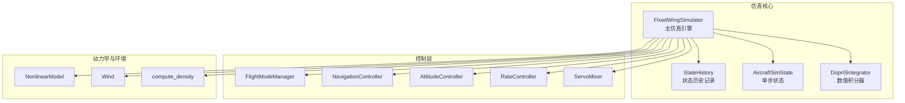
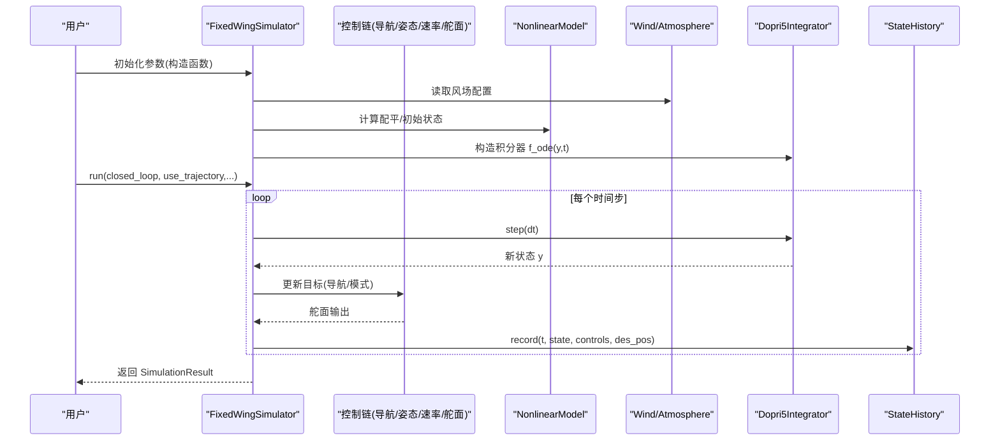
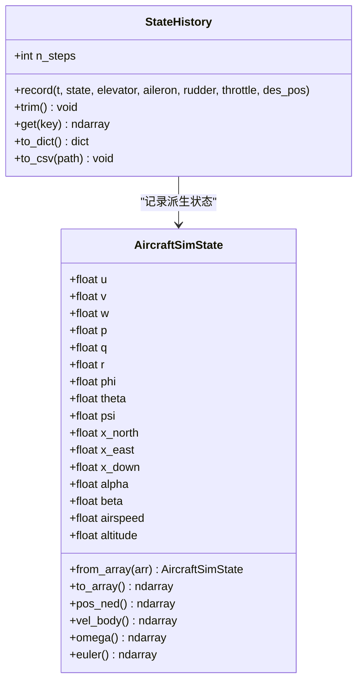
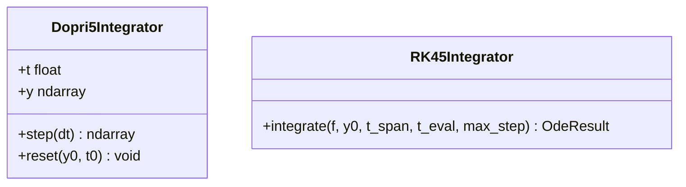
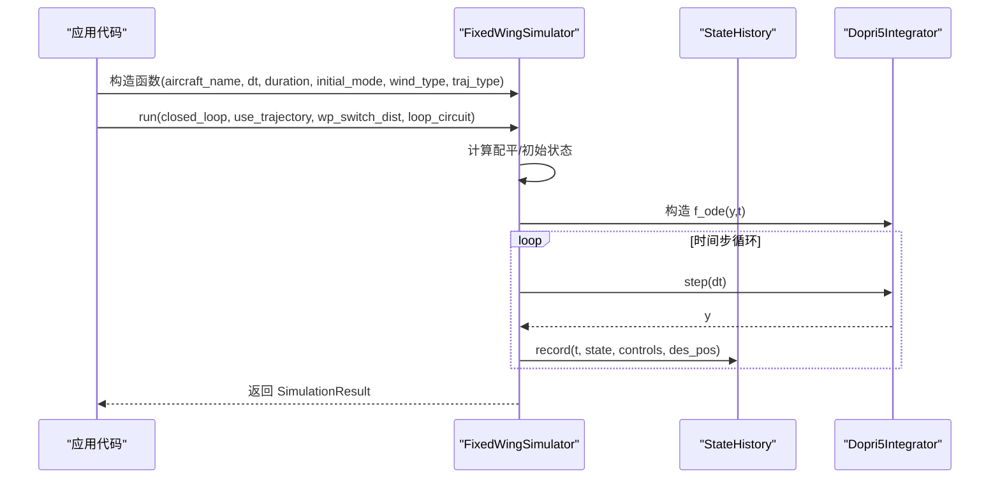
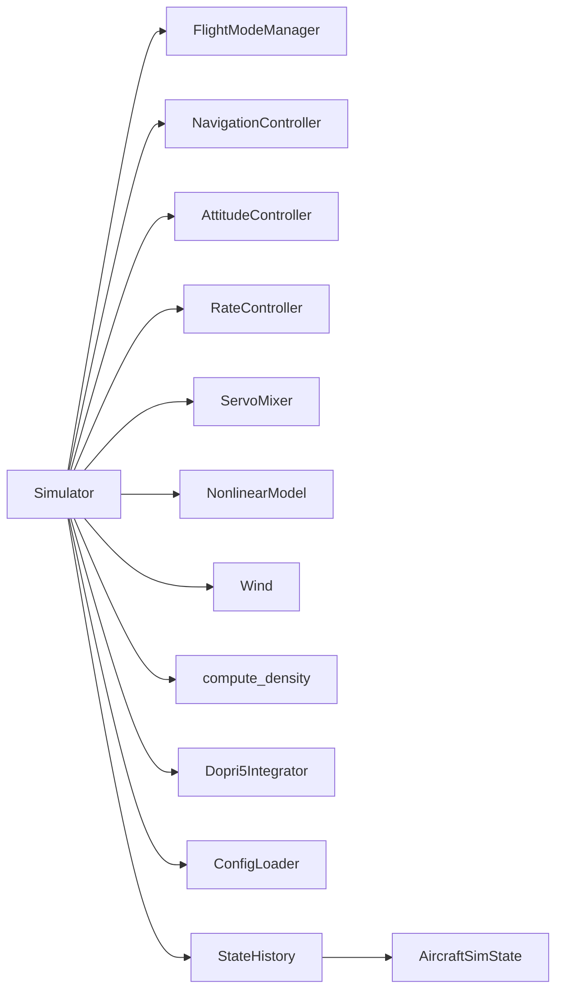

# 仿真API

<cite>
**本文引用的文件列表**
- [src/simulation/simulator.py](file://src/simulation/simulator.py)
- [src/simulation/state_manager.py](file://src/simulation/state_manager.py)
- [src/simulation/integrator.py](file://src/simulation/integrator.py)
- [src/utils/config_loader.py](file://src/utils/config_loader.py)
- [config/simulation.yaml](file://config/simulation.yaml)
- [config/control_params.yaml](file://config/control_params.yaml)
- [src/models/aircraft_database.py](file://src/models/aircraft_database.py)
- [examples/example_1_linear_response.py](file://examples/example_1_linear_response.py)
- [examples/example_2_nonlinear_dynamics.py](file://examples/example_2_nonlinear_dynamics.py)
- [tests/test_integration.py](file://tests/test_integration.py)
- [main.py](file://main.py)
</cite>

## 目录
1. [简介](#简介)
2. [项目结构](#项目结构)
3. [核心组件](#核心组件)
4. [架构总览](#架构总览)
5. [详细组件分析](#详细组件分析)
6. [依赖关系分析](#依赖关系分析)
7. [性能与数值稳定性](#性能与数值稳定性)
8. [故障排查指南](#故障排查指南)
9. [结论](#结论)
10. [附录：最佳实践与常见用法](#附录最佳实践与常见用法)

## 简介
本文件为 FixedWingSimulator 仿真模块的详细 API 参考，聚焦于 Simulator 类的核心接口、状态管理与数值积分器配置，并对状态记录机制、控制链路、轨迹规划与环境建模进行系统化说明。文档同时给出仿真运行的完整 API 调用流程、参数与返回值说明，以及仿真参数配置的最佳实践与常见使用模式。

## 项目结构
仿真模块位于 src/simulation 下，核心文件包括：
- simulator.py：主仿真引擎，封装控制链、轨迹管理、环境与动力学模块，提供 run/run_linear_analysis/init_step/step 等对外 API。
- state_manager.py：定义 AircraftSimState 与 StateHistory，负责状态容器与历史记录。
- integrator.py：封装数值积分器，提供 Dopri5Integrator（实时步进）与 RK45Integrator（批处理）两类实现。
- utils/config_loader.py：统一加载与合并 YAML 配置，支持 aircraft、simulation、control、trajectory 四类配置。
- config/：包含 simulation.yaml、control_params.yaml 等默认配置示例。
- examples/ 与 tests/：展示典型使用方式与集成测试，验证数值稳定性和 API 行为。

图表来源
- [src/simulation/simulator.py](file://src/simulation/simulator.py#L115-L642)
- [src/simulation/state_manager.py](file://src/simulation/state_manager.py#L16-L193)
- [src/simulation/integrator.py](file://src/simulation/integrator.py#L17-L108)

章节来源
- [src/simulation/simulator.py](file://src/simulation/simulator.py#L1-L642)
- [src/simulation/state_manager.py](file://src/simulation/state_manager.py#L1-L193)
- [src/simulation/integrator.py](file://src/simulation/integrator.py#L1-L108)

## 核心组件
- FixedWingSimulator：主仿真类，负责装配控制链、环境与动力学模块，提供 run()/run_linear_analysis()/init_step()/step() 等公共接口。
- AircraftSimState：12 维状态容器（体坐标速度、角速率、欧拉角、NED 位置），并派生空速、攻角、侧滑角与海拔。
- StateHistory：预分配的历史缓冲区，高效记录仿真过程中的状态与控制量。
- Dopri5Integrator：基于 scipy 的 Dormand-Prince 5(4) 自适应步长积分器，支持单步推进。
- RK45Integrator：基于 solve_ivp 的批处理积分器，适合离线分析。
- ConfigLoader：统一加载与合并配置，支持 aircraft、simulation、control、trajectory 四类配置。

章节来源
- [src/simulation/simulator.py](file://src/simulation/simulator.py#L115-L642)
- [src/simulation/state_manager.py](file://src/simulation/state_manager.py#L16-L193)
- [src/simulation/integrator.py](file://src/simulation/integrator.py#L17-L108)
- [src/utils/config_loader.py](file://src/utils/config_loader.py#L59-L82)

## 架构总览
下图展示了仿真主循环中各模块之间的交互关系与数据流。

图表来源
- [src/simulation/simulator.py](file://src/simulation/simulator.py#L239-L567)
- [src/simulation/integrator.py](file://src/simulation/integrator.py#L50-L71)
- [src/simulation/state_manager.py](file://src/simulation/state_manager.py#L124-L180)

## 详细组件分析

### Simulator 类 API 参考
- 构造函数参数
  - aircraft_name: 字符串，可选值来自飞机数据库；默认 "TB2"。
  - config_dir: 字符串，配置目录路径，默认使用项目内 config 目录。
  - dt: 浮点数，仿真步长（秒），默认 0.01。
  - duration: 浮点数，总仿真时长（秒），默认 30.0。
  - initial_mode: 字符串或枚举，初始飞行模式，如 "AUTO"/"STABILIZE"/"FBW_B" 等。
  - wind_type: 字符串，风模型类型，"NONE"|"FIXED"|"SINE"|"RANDOMSINE"。
  - traj_type: 字符串，轨迹类型，"minimum_snap" 或 "minimum_jerk" 等。
- 关键方法
  - run(closed_loop=True, use_trajectory=True, wp_switch_dist=60.0, loop_circuit=False) -> SimulationResult
    - 功能：执行完整闭环/开环仿真，支持轨迹跟踪或简单航路点顺序飞越。
    - 参数说明：closed_loop 决定是否启用 ArduPilot 控制链；use_trajectory 控制是否构建多项式轨迹；wp_switch_dist 为航路点切换阈值；loop_circuit 控制重复飞越。
    - 返回：包含历史记录、配平结果、机型名与闭环标记的 SimulationResult。
  - run_linear_analysis(pulses=None, duration=None) -> LinearAnalysisResult
    - 功能：运行 4-DOF 线性开环分析（向后兼容）。
    - 返回：线性分析结果对象。
  - init_step() -> AircraftSimState
    - 功能：初始化步进仿真，返回初始状态。
  - step(dt=None) -> AircraftSimState
    - 功能：推进一步，返回新状态；需先调用 init_step()。
- 异常与错误处理
  - 未正确初始化即调用 step() 将抛出运行时异常。
  - 积分失败会抛出运行时异常并中断仿真。

章节来源
- [src/simulation/simulator.py](file://src/simulation/simulator.py#L130-L139)
- [src/simulation/simulator.py](file://src/simulation/simulator.py#L239-L567)
- [src/simulation/simulator.py](file://src/simulation/simulator.py#L571-L596)
- [src/simulation/simulator.py](file://src/simulation/simulator.py#L602-L641)

### 状态管理：AircraftSimState 与 StateHistory
- AircraftSimState
  - 字段：u/v/w（体坐标速度）、p/q/r（角速率）、phi/theta/psi（欧拉角）、x_north/x_east/x_down（NED 位置）。
  - 派生字段：alpha（攻角）、beta（侧滑角）、airspeed、altitude。
  - 方法：from_array()、to_array()、属性访问 pos_ned/vel_body/omega/euler。
- StateHistory
  - 预分配键集合：时间 t 与上述全部状态变量，以及控制面与期望位置 des_north/des_east/des_down。
  - 方法：record()、trim()、get()、to_dict()、to_csv()。
  - trim() 用于裁剪尾部未使用的缓冲区，避免内存浪费。

图表来源
- [src/simulation/state_manager.py](file://src/simulation/state_manager.py#L16-L193)

章节来源
- [src/simulation/state_manager.py](file://src/simulation/state_manager.py#L16-L193)

### 数值积分器：Dopri5Integrator 与 RK45Integrator
- Dopri5Integrator
  - 包装 scipy.integrate.ode 的 dopri5 求解器，支持自适应步长但暴露单步推进接口。
  - 关键方法：step(dt)、reset(y0, t0)、属性 t/y。
  - 容差：rtol/atol 默认 1e-6。
- RK45Integrator
  - 使用 solve_ivp 的 RK45 批处理求解器，适合离线分析。
  - 关键方法：integrate(f, y0, t_span, t_eval=None, max_step=0.1)。

图表来源
- [src/simulation/integrator.py](file://src/simulation/integrator.py#L17-L108)

章节来源
- [src/simulation/integrator.py](file://src/simulation/integrator.py#L17-L108)

### 风场与环境配置
- 风模型 Wind 支持 NONE/FIXED/SINE/RANDOMSINE。
- 大气密度 compute_density(海拔) 用于动态计算气动参数。
- 配置优先级：构造函数参数 > simulation.yaml > 默认值。

章节来源
- [src/simulation/simulator.py](file://src/simulation/simulator.py#L159-L163)
- [src/simulation/simulator.py](file://src/simulation/simulator.py#L336-L337)
- [src/utils/config_loader.py](file://src/utils/config_loader.py#L59-L82)
- [config/simulation.yaml](file://config/simulation.yaml#L22-L25)

### 控制链与飞行模式
- FlightModeManager：根据初始模式与目标设定（巡航空速/高度）驱动控制链。
- NavigationController：L1 导航与 TECS 总能量控制，支持多种 TECS 参数。
- AttitudeController/RateController/ServoMixer：姿态/角速率控制与舵面混合。
- 飞行模式：MANUAL、STABILIZE、FBW_A、FBW_B、AUTO、LOITER、RTH。

章节来源
- [src/simulation/simulator.py](file://src/simulation/simulator.py#L174-L216)
- [config/control_params.yaml](file://config/control_params.yaml#L1-L45)

### 仿真运行流程（API 调用序列）
以下序列图展示从初始化到完成的完整调用流程。

图表来源
- [src/simulation/simulator.py](file://src/simulation/simulator.py#L239-L567)
- [src/simulation/state_manager.py](file://src/simulation/state_manager.py#L124-L180)
- [src/simulation/integrator.py](file://src/simulation/integrator.py#L50-L71)

## 依赖关系分析
- Simulator 依赖
  - 控制链：FlightModeManager、NavigationController、AttitudeController、RateController、ServoMixer。
  - 动力学：NonlinearModel。
  - 环境：Wind、compute_density。
  - 数值：Dopri5Integrator。
  - 配置：ConfigLoader。
- 数据结构耦合
  - AircraftSimState 与 StateHistory 通过 record() 接口耦合，确保派生量一致性。
  - 控制链输出经 ServoMixer 转换为控制输入，再注入到 ODE 函数。

图表来源
- [src/simulation/simulator.py](file://src/simulation/simulator.py#L33-L51)
- [src/simulation/state_manager.py](file://src/simulation/state_manager.py#L16-L193)

章节来源
- [src/simulation/simulator.py](file://src/simulation/simulator.py#L33-L51)
- [src/simulation/state_manager.py](file://src/simulation/state_manager.py#L16-L193)

## 性能与数值稳定性
- 积分器选择
  - 实时闭环仿真建议使用 Dopri5Integrator，具备自适应步长与稳定的单步推进能力。
  - 离线分析可使用 RK45Integrator，一次性求解并返回完整历史。
- 容差设置
  - 默认 rtol/atol=1e-6；在需要更高精度或更稳定时可适当收紧。
- 步长与稳定性
  - dt 过大可能导致数值不稳定；建议结合控制带宽与风场复杂度调整。
- 历史记录优化
  - StateHistory 预分配数组并在 trim() 中裁剪，避免动态扩容带来的性能损耗。
- 风场与密度
  - Wind 与 compute_density 在每步动态更新，注意其计算成本与稳定性。

章节来源
- [src/simulation/integrator.py](file://src/simulation/integrator.py#L33-L71)
- [src/simulation/state_manager.py](file://src/simulation/state_manager.py#L117-L174)
- [src/simulation/simulator.py](file://src/simulation/simulator.py#L336-L337)

## 故障排查指南
- 积分失败
  - 症状：step() 抛出运行时异常，提示积分失败。
  - 排查：检查 dt 是否过大、风场/密度是否异常、控制输出是否饱和。
- 未初始化调用 step()
  - 症状：RuntimeError 提示需先调用 init_step()。
  - 解决：在首次 step() 前调用 init_step()。
- 数值发散
  - 症状：高度/空速/角度出现非有限值或异常增长。
  - 排查：检查初始条件、配平计算、控制参数与轨迹约束。
- 配置不一致
  - 症状：仿真行为与预期不符。
  - 排查：确认 simulation.yaml 与 control_params.yaml 的合并逻辑与优先级。

章节来源
- [src/simulation/simulator.py](file://src/simulation/simulator.py#L558-L562)
- [src/simulation/simulator.py](file://src/simulation/simulator.py#L636-L638)
- [tests/test_integration.py](file://tests/test_integration.py#L41-L58)

## 结论
FixedWingSimulator 通过清晰的模块划分与稳健的数值实现，提供了从线性分析到非线性闭环仿真的完整能力。AircraftSimState 与 StateHistory 的设计保证了状态一致性与高效记录；Dopri5Integrator 与 RK45Integrator 分别满足实时与离线场景的需求。配合 ConfigLoader 的配置合并机制与丰富的示例/测试用例，用户可以快速搭建并验证不同飞行模式与任务场景下的仿真流程。

## 附录：最佳实践与常见用法

### 配置最佳实践
- 使用 simulation.yaml 管理 dt、duration、wind_type、rtol/atol 等全局参数。
- 使用 control_params.yaml 调整 TECS、PID 参数与限幅，确保闭环稳定。
- 通过 ConfigLoader 加载配置，避免硬编码参数。

章节来源
- [config/simulation.yaml](file://config/simulation.yaml#L1-L30)
- [config/control_params.yaml](file://config/control_params.yaml#L1-L45)
- [src/utils/config_loader.py](file://src/utils/config_loader.py#L59-L82)

### 常见使用模式
- 开环线性分析：调用 run_linear_analysis() 获取短周期/长周期模态。
- 闭环稳定保持：STABILIZE 模式下仅姿态/速率控制，适合验证控制器。
- 航路点跟踪：AUTO 模式下构建轨迹并由 TECS/L1 控制器跟踪。
- 步进仿真：init_step()/step() 适合与外部 UI/框架集成。

章节来源
- [examples/example_1_linear_response.py](file://examples/example_1_linear_response.py#L126-L164)
- [examples/example_2_nonlinear_dynamics.py](file://examples/example_2_nonlinear_dynamics.py#L123-L160)
- [tests/test_integration.py](file://tests/test_integration.py#L267-L343)

### API 调用流程（步骤化）
- 初始化：构造 FixedWingSimulator，设置 dt/duration/initial_mode/wind_type/traj_type。
- 可选：添加航路点（WaypointManager）或加载 trajectory.yaml。
- 运行：调用 run() 或 run_linear_analysis()。
- 数据访问：通过 SimulationResult.history.to_dict()/to_csv() 获取数据。
- 可视化：调用 SimulationResult.visualize() 或使用 plotter/animator。

章节来源
- [src/simulation/simulator.py](file://src/simulation/simulator.py#L239-L567)
- [src/simulation/state_manager.py](file://src/simulation/state_manager.py#L179-L193)
- [src/simulation/simulator.py](file://src/simulation/simulator.py#L92-L109)