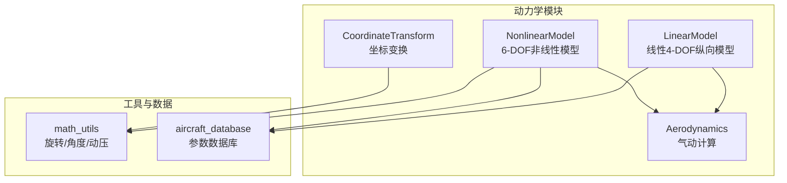
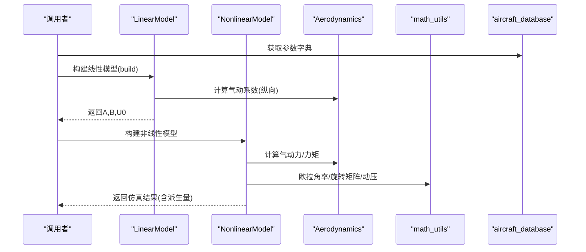
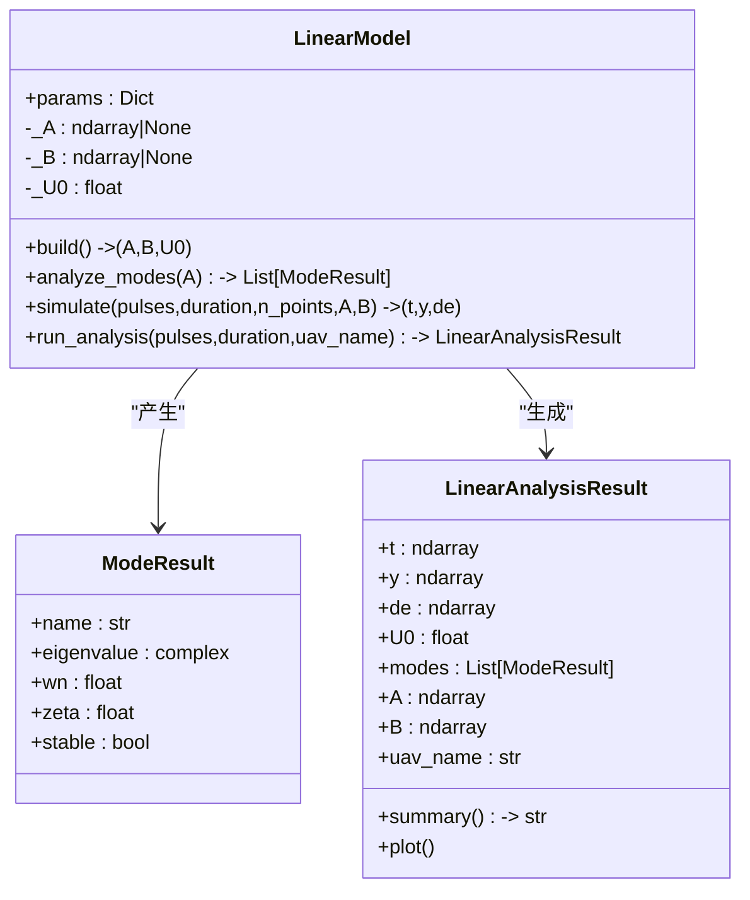
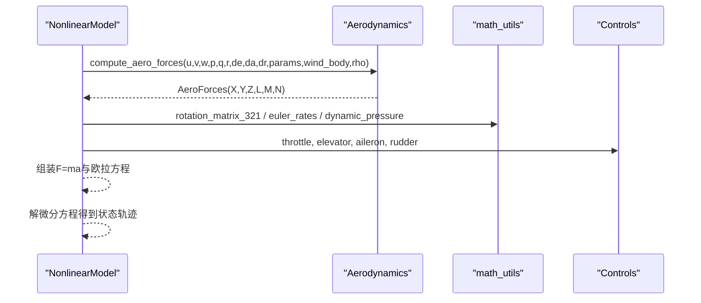
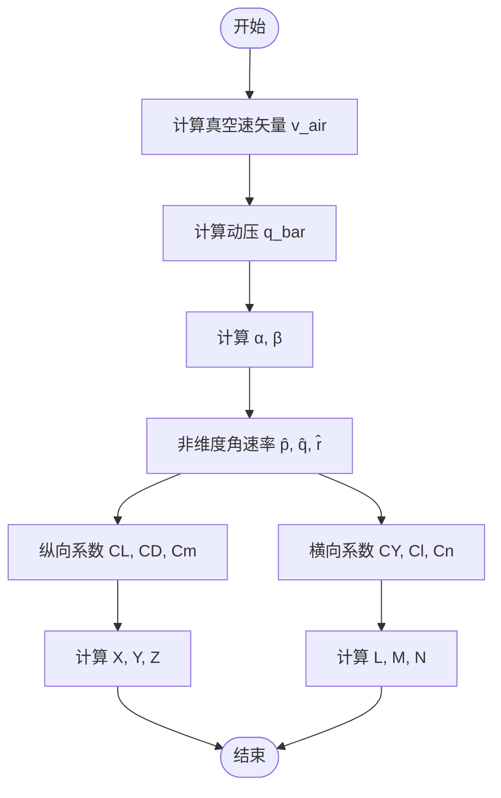
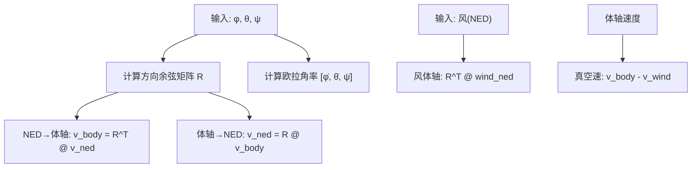
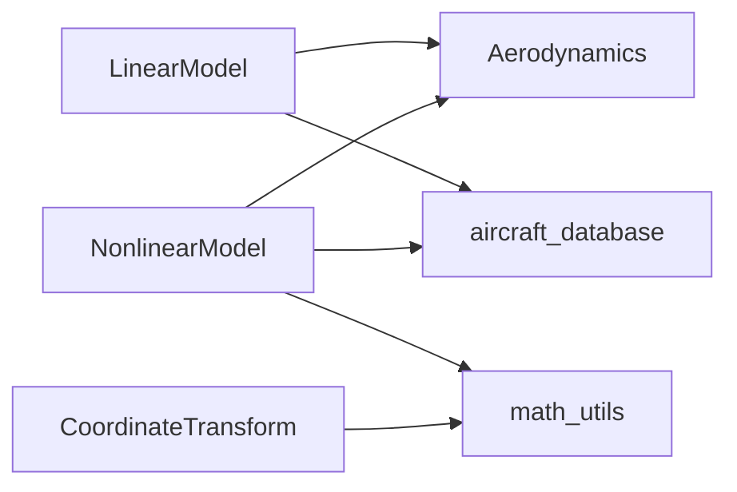

# 动力学API

<cite>
**本文引用的文件列表**
- [linear_model.py](file://src/dynamics/linear_model.py)
- [nonlinear_model.py](file://src/dynamics/nonlinear_model.py)
- [aerodynamics.py](file://src/dynamics/aerodynamics.py)
- [coordinate_transform.py](file://src/dynamics/coordinate_transform.py)
- [math_utils.py](file://src/utils/math_utils.py)
- [aircraft_database.py](file://src/models/aircraft_database.py)
- [test_dynamics.py](file://tests/test_dynamics.py)
- [example_1_linear_response.py](file://examples/example_1_linear_response.py)
</cite>

## 目录
1. [简介](#简介)
2. [项目结构](#项目结构)
3. [核心组件](#核心组件)
4. [架构总览](#架构总览)
5. [详细组件分析](#详细组件分析)
6. [依赖关系分析](#依赖关系分析)
7. [性能与数值特性](#性能与数值特性)
8. [故障排查指南](#故障排查指南)
9. [结论](#结论)

## 简介
本文件为 FixedWingSimulator 动力学模块的API参考文档，聚焦以下目标：
- LinearModel 与 NonlinearModel 的数学模型接口：状态转移方程、雅可比（A/B）矩阵构建、模态分析与稳定性判定。
- Aerodynamics 的气动计算接口：升力、阻力、侧向力及滚转/俯仰/偏航力矩的计算流程与参数含义。
- CoordinateTransform 的坐标变换接口：机体坐标系、地理坐标系（NED）、速度坐标系之间的转换方法。
- 动力学参数的物理意义、单位、数值精度与计算效率考量。

## 项目结构
动力学相关代码位于 src/dynamics 下，配合 utils/math_utils 提供旋转矩阵、欧拉角率、攻角/侧滑角、动压等基础运算；参数数据库位于 src/models/aircraft_database.py，提供多型无人机的标准气动与惯性参数。

图表来源
- [linear_model.py](file://src/dynamics/linear_model.py#L107-L319)
- [nonlinear_model.py](file://src/dynamics/nonlinear_model.py#L104-L386)
- [aerodynamics.py](file://src/dynamics/aerodynamics.py#L35-L148)
- [coordinate_transform.py](file://src/dynamics/coordinate_transform.py#L29-L70)
- [math_utils.py](file://src/utils/math_utils.py#L43-L124)
- [aircraft_database.py](file://src/models/aircraft_database.py#L143-L166)

章节来源
- [linear_model.py](file://src/dynamics/linear_model.py#L1-L319)
- [nonlinear_model.py](file://src/dynamics/nonlinear_model.py#L1-L386)
- [aerodynamics.py](file://src/dynamics/aerodynamics.py#L1-L148)
- [coordinate_transform.py](file://src/dynamics/coordinate_transform.py#L1-L70)
- [math_utils.py](file://src/utils/math_utils.py#L1-L124)
- [aircraft_database.py](file://src/models/aircraft_database.py#L1-L183)

## 核心组件
- LinearModel：4自由度纵向线性化状态空间模型，支持A/B矩阵构建、模态分析（短周期、阻尼振荡、收敛模式）与脉冲响应仿真。
- NonlinearModel：6自由度非线性方程，提供配平解算、状态导数计算、ODE求解与派生量统计。
- Aerodynamics：基于风轴到体轴变换的气动力/力矩计算，支持纵向与横向方向系数叠加。
- CoordinateTransform：提供方向余弦矩阵、NED与体轴互转、欧拉角率、风速体轴转换与真空速矢量。

章节来源
- [linear_model.py](file://src/dynamics/linear_model.py#L107-L319)
- [nonlinear_model.py](file://src/dynamics/nonlinear_model.py#L104-L386)
- [aerodynamics.py](file://src/dynamics/aerodynamics.py#L35-L148)
- [coordinate_transform.py](file://src/dynamics/coordinate_transform.py#L29-L70)

## 架构总览
下图展示动力学模块内部组件交互与数据流。

图表来源
- [linear_model.py](file://src/dynamics/linear_model.py#L129-L200)
- [nonlinear_model.py](file://src/dynamics/nonlinear_model.py#L160-L255)
- [aerodynamics.py](file://src/dynamics/aerodynamics.py#L35-L148)
- [math_utils.py](file://src/utils/math_utils.py#L43-L124)
- [aircraft_database.py](file://src/models/aircraft_database.py#L143-L166)

## 详细组件分析

### LinearModel（线性4-DOF纵向模型）
- 状态变量与控制输入
  - 状态：[u_p, α, q, θ]，其中 u_p 为前向速度扰动（归一化，Δu/U0），α 为攻角扰动（rad），q 为俯仰角速率（rad/s），θ 为俯仰角扰动（rad）。
  - 输入：[δ_T, δ_e]，其中 δ_T 为油门扰动（无量纲），δ_e 为升降舵偏角（rad）。
- 数学模型
  - 状态空间：ẏ = A·y + B·u，A为(4,4)，B为(4,2)。
  - A/B由气动导数与质量/惯性参数推导得到，涉及非维化质量/惯性系数与稳定性导数（CXu、CXa、CZu、CZa、Cmα、Cmq等）。
- 模态分析
  - 对A进行特征值分解，识别短周期（高自然频率）与长周期（Phugoid，低自然频率）模式，并据此给出阻尼比ζ与稳定性判断。
- 仿真
  - 支持对升降舵阶跃/脉冲输入的时域仿真，返回时间序列与对应输入历史。

图表来源
- [linear_model.py](file://src/dynamics/linear_model.py#L107-L319)

章节来源
- [linear_model.py](file://src/dynamics/linear_model.py#L107-L319)
- [test_dynamics.py](file://tests/test_dynamics.py#L201-L255)

### NonlinearModel（6-DOF非线性模型）
- 状态变量（NED框架）
  - 速度：[u, v, w]（体轴速度，m/s）
  - 角速率：[p, q, r]（rad/s）
  - 欧拉角：[φ, θ, ψ]（rad）
  - 位置：[x_N, x_E, x_D]（m，NED向下为正）
- 方程构成
  - 平移：u̇/v̇/ẇ 由气动力、推力与重力在体轴方向的合力除以质量得到。
  - 旋转：基于惯性张量与耦合项的欧拉方程，计算ṗ/q̇/ṙ。
  - 角率：通过欧拉角率公式将体轴角速率映射到欧拉角变化率。
  - 位置：体轴速度经方向余弦矩阵映射至NED。
- 控制输入
  - Controls：elevator（rad）、aileron（rad）、rudder（rad）、throttle（0–1）。
- 配平
  - 在水平、机翼水平条件下求解（α_trim, δe_trim），使升力平衡重力且俯仰力矩为零。
- 仿真
  - 提供 make_ode_func 与 simulate 接口，支持风场与密度随高度变化的场景。

图表来源
- [nonlinear_model.py](file://src/dynamics/nonlinear_model.py#L160-L255)
- [aerodynamics.py](file://src/dynamics/aerodynamics.py#L35-L148)
- [math_utils.py](file://src/utils/math_utils.py#L43-L124)

章节来源
- [nonlinear_model.py](file://src/dynamics/nonlinear_model.py#L104-L386)
- [test_dynamics.py](file://tests/test_dynamics.py#L261-L335)

### Aerodynamics（气动计算）
- 输入
  - 体轴速度与角速率：[u, v, w, p, q, r]
  - 表面偏角：[δe, δa, δr]
  - 参数字典：包含机翼面积S、平均气动弦长c、翼展b、稳定性导数等。
  - 可选风：风在体轴方向（m/s），用于修正真实空速。
  - 空气密度ρ（kg/m³）。
- 角度与动压
  - 真空速矢量：v_air = v_body − v_wind
  - 动压：q_bar = 0.5·ρ·V²
  - 攻角α、侧滑角β
- 系数计算
  - 纵向：CL、CD、Cm（含α、q̂、δe贡献）
  - 横向：CY、Cl、Cn（含β、p̂、r̂、δa、δr贡献）
- 力与力矩
  - 力：X、Y、Z（体轴）
  - 力矩：L、M、N（体轴）

图表来源
- [aerodynamics.py](file://src/dynamics/aerodynamics.py#L35-L148)

章节来源
- [aerodynamics.py](file://src/dynamics/aerodynamics.py#L19-L148)
- [test_dynamics.py](file://tests/test_dynamics.py#L127-L195)

### CoordinateTransform（坐标变换）
- 主要功能
  - 方向余弦矩阵：从欧拉角构造体到NED的旋转矩阵。
  - NED↔体轴互转：提供向量级转换。
  - 欧拉角率：将体轴角速率映射为欧拉角变化率。
  - 风速体轴转换：将NED风速转换为体轴风速。
  - 真空速矢量：v_air = v_body − v_wind。
- 使用约定
  - 3-2-1欧拉角顺序（φ, θ, ψ），NED坐标系（向下为正）。

图表来源
- [coordinate_transform.py](file://src/dynamics/coordinate_transform.py#L29-L70)
- [math_utils.py](file://src/utils/math_utils.py#L43-L124)

章节来源
- [coordinate_transform.py](file://src/dynamics/coordinate_transform.py#L1-L70)
- [math_utils.py](file://src/utils/math_utils.py#L43-L124)
- [test_dynamics.py](file://tests/test_dynamics.py#L67-L122)

## 依赖关系分析
- LinearModel 依赖 Aerodynamics（纵向系数）与常数（重力、空气密度、声速）。
- NonlinearModel 依赖 Aerodynamics（气动力/力矩）、math_utils（旋转矩阵、欧拉角率、动压）以及参数数据库提供的几何与气动导数。
- CoordinateTransform 依赖 math_utils 的旋转与角度工具。
- 测试与示例验证了各模块的正确性与一致性。

图表来源
- [linear_model.py](file://src/dynamics/linear_model.py#L18-L27)
- [nonlinear_model.py](file://src/dynamics/nonlinear_model.py#L27-L28)
- [aerodynamics.py](file://src/dynamics/aerodynamics.py#L11-L13)
- [coordinate_transform.py](file://src/dynamics/coordinate_transform.py#L10-L16)
- [aircraft_database.py](file://src/models/aircraft_database.py#L14-L20)

章节来源
- [linear_model.py](file://src/dynamics/linear_model.py#L18-L27)
- [nonlinear_model.py](file://src/dynamics/nonlinear_model.py#L27-L28)
- [aerodynamics.py](file://src/dynamics/aerodynamics.py#L11-L13)
- [coordinate_transform.py](file://src/dynamics/coordinate_transform.py#L10-L16)
- [aircraft_database.py](file://src/models/aircraft_database.py#L14-L20)

## 性能与数值特性
- 数值稳定性
  - 空速在接近零时采用最小阈值保护（如动态压力与侧滑角中对V的夹紧），避免除零或反三角函数域错误。
  - 欧拉角率在θ接近±90°时引入小量ε以避免奇异。
- 计算复杂度
  - Aerodynamics：O(1) 单次调用，主要为多项式与三角函数计算。
  - LinearModel：A/B矩阵一次性构建，后续模态分析与仿真均为线性代数操作。
  - NonlinearModel：每步需计算气动、推力、重力与惯性耦合项，整体为O(1)但包含多次三角函数与矩阵乘法。
- 精度与积分
  - 非线性仿真默认使用高精度求解器，相对/绝对容差设置较小；可通过参数调整步长与容差。
- 单位与物理常数
  - 长度：米；时间：秒；速度：m/s；角：弧度；力：牛顿；力矩：牛·米；密度：kg/m³；压力：Pa。
  - 常数：重力加速度 g = 9.80665 m/s²；海平面空气密度 ρ0 = 1.225 kg/m³；气体常数 R = 287.05 J/(kg·K)；绝热指数 γ = 1.4；声速按标准大气计算。

章节来源
- [aerodynamics.py](file://src/dynamics/aerodynamics.py#L76-L83)
- [math_utils.py](file://src/utils/math_utils.py#L87-L100)
- [nonlinear_model.py](file://src/dynamics/nonlinear_model.py#L348-L351)
- [linear_model.py](file://src/dynamics/linear_model.py#L23-L27)

## 故障排查指南
- 线性模型
  - 若 build 后 A/B 形状不正确，检查参数字典是否包含所需气动导数与几何参数。
  - analyze_modes 返回不稳定模式：检查导数符号与飞行马赫数是否合理。
- 非线性模型
  - compute_trim 不收敛：尝试更合理的初始猜测或放宽容差；确认气动导数与质量匹配。
  - state_dot 输出异常：检查风场与密度回调是否正确传入，确保风体轴转换无误。
- 气动计算
  - 动压与力过小：确认空速非零或已启用最小夹紧；检查ρ与V。
  - 力/力矩符号异常：核对攻角定义与表面偏角正方向（例如升降舵正向定义）。
- 坐标变换
  - NED↔体轴互转误差大：检查欧拉角范围与方向余弦矩阵正交性。
  - 欧拉角率奇异：避免在θ接近±90°附近长时间运行或使用数值保护。

章节来源
- [test_dynamics.py](file://tests/test_dynamics.py#L67-L122)
- [test_dynamics.py](file://tests/test_dynamics.py#L127-L195)
- [test_dynamics.py](file://tests/test_dynamics.py#L201-L335)

## 结论
本动力学API提供了从线性到非线性的完整固定翼飞机运动学与气动计算能力，参数与接口设计清晰，具备良好的可扩展性与工程可用性。建议在实际应用中：
- 明确参数来源与单位一致性；
- 在关键场景（如配平、模态分析）进行回归测试；
- 结合示例脚本与测试用例快速集成与验证。