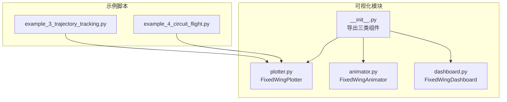
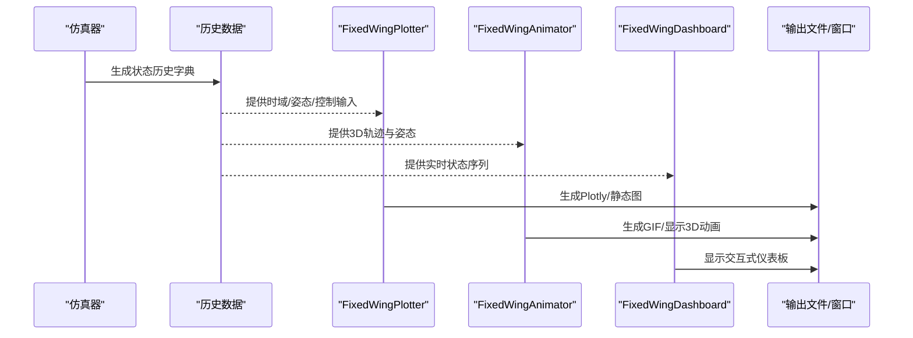
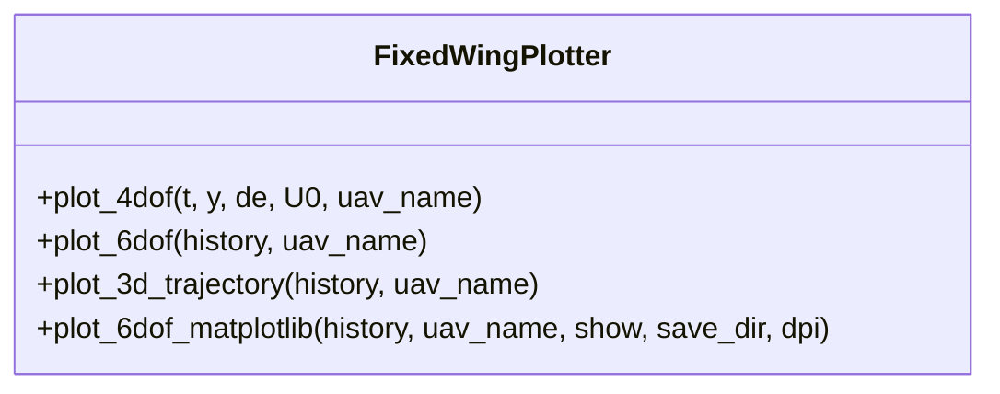
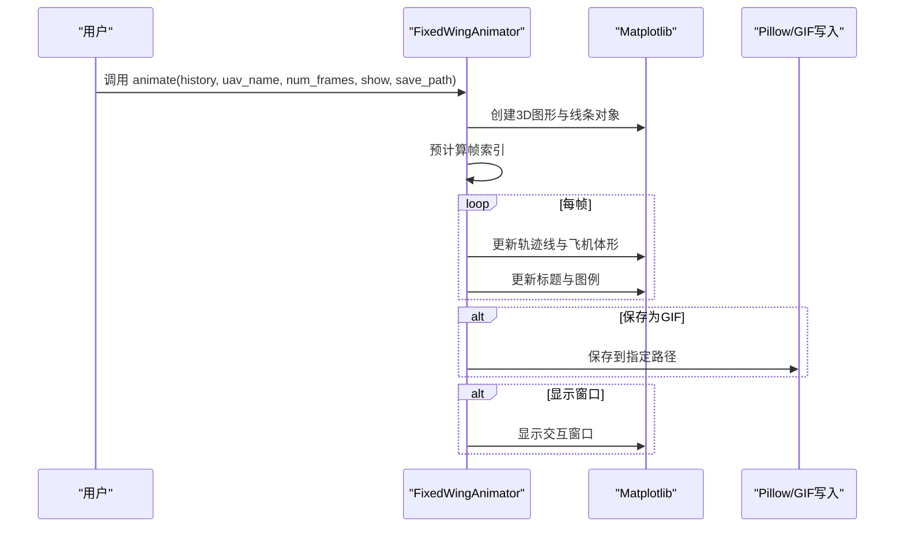
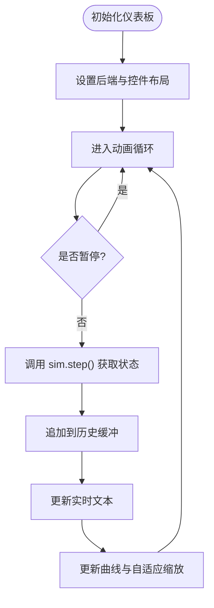
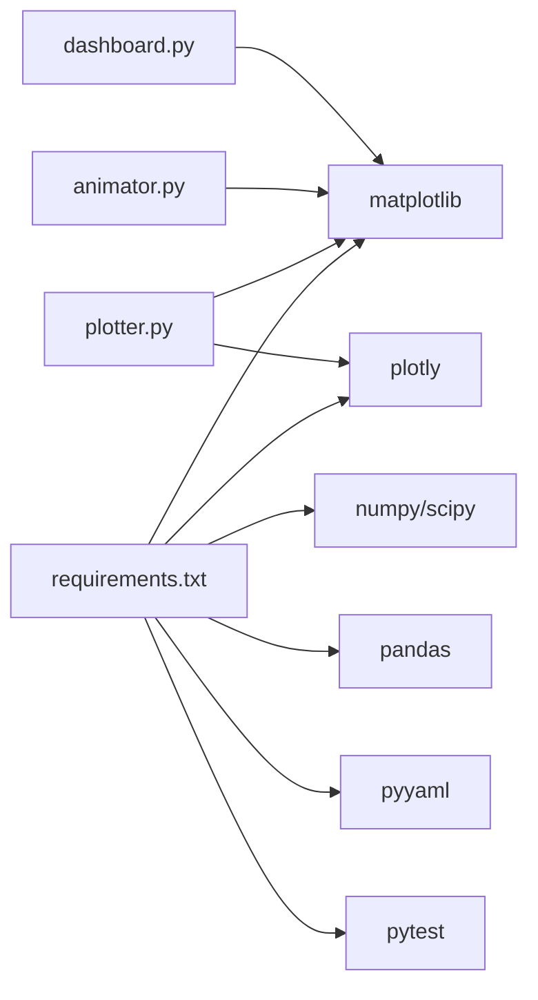

# 可视化API

<cite>
**本文引用的文件**
- [src/visualization/plotter.py](file://src/visualization/plotter.py)
- [src/visualization/animator.py](file://src/visualization/animator.py)
- [src/visualization/dashboard.py](file://src/visualization/dashboard.py)
- [src/visualization/__init__.py](file://src/visualization/__init__.py)
- [examples/example_3_trajectory_tracking.py](file://examples/example_3_trajectory_tracking.py)
- [examples/example_4_circuit_flight.py](file://examples/example_4_circuit_flight.py)
- [requirements.txt](file://requirements.txt)
</cite>

## 目录
1. [简介](#简介)
2. [项目结构](#项目结构)
3. [核心组件](#核心组件)
4. [架构总览](#架构总览)
5. [详细组件分析](#详细组件分析)
6. [依赖分析](#依赖分析)
7. [性能考虑](#性能考虑)
8. [故障排查指南](#故障排查指南)
9. [结论](#结论)
10. [附录](#附录)

## 简介
本文件为 FixedWingSimulator 可视化模块的详细 API 参考，聚焦以下三个核心类：
- Plotter：提供 2D/3D 图表绘制能力，支持时域曲线、6-DOF 历史图、3D 轨迹图，并兼容 Matplotlib 静态图与 Plotly 交互图。
- Animator：基于 Matplotlib 的 3D 实时轨迹动画，支持保存 GIF 动画、帧步进控制与飞机体形几何渲染。
- Dashboard：交互式实时仪表板，集成飞行模式选择、PID 参数调节、暂停/恢复/重启、实时数值读出与动态曲线更新。

文档同时覆盖：
- 可视化输出格式与质量设置（分辨率、后端、保存路径）
- 图表定制化与批量输出流程
- 如何构建专业级仿真结果展示方案

## 项目结构
可视化相关代码位于 src/visualization 目录，对外通过 __init__.py 暴露统一入口。

**图表来源**
- [src/visualization/plotter.py](file://src/visualization/plotter.py#L1-L244)
- [src/visualization/animator.py](file://src/visualization/animator.py#L1-L150)
- [src/visualization/dashboard.py](file://src/visualization/dashboard.py#L1-L167)
- [src/visualization/__init__.py](file://src/visualization/__init__.py#L1-L8)
- [examples/example_3_trajectory_tracking.py](file://examples/example_3_trajectory_tracking.py#L1-L194)
- [examples/example_4_circuit_flight.py](file://examples/example_4_circuit_flight.py#L1-L275)

**章节来源**
- [src/visualization/__init__.py](file://src/visualization/__init__.py#L1-L8)

## 核心组件
- FixedWingPlotter：提供 Plotly 交互图与 Matplotlib 静态图两类输出，覆盖 4-DOF/6-DOF 时域响应、3D 轨迹图等。
- FixedWingAnimator：3D 实时动画，按步进更新飞机体形与轨迹，可保存为 GIF。
- FixedWingDashboard：Matplotlib 交互式仪表板，实时显示高度/空速曲线与状态文本，支持模式切换与控制。

**章节来源**
- [src/visualization/plotter.py](file://src/visualization/plotter.py#L19-L244)
- [src/visualization/animator.py](file://src/visualization/animator.py#L14-L150)
- [src/visualization/dashboard.py](file://src/visualization/dashboard.py#L28-L167)

## 架构总览
可视化模块与仿真器协同工作：仿真器产生历史数据，可视化模块消费数据生成图表或动画；示例脚本演示了批量输出与静态图保存流程。

**图表来源**
- [src/visualization/plotter.py](file://src/visualization/plotter.py#L19-L244)
- [src/visualization/animator.py](file://src/visualization/animator.py#L25-L150)
- [src/visualization/dashboard.py](file://src/visualization/dashboard.py#L59-L111)

## 详细组件分析

### Plotter 组件（图表绘制）
- 支持两类输出：
  - Plotly 交互图：用于 Web UI 或 Jupyter 环境，便于缩放、标注与交互。
  - Matplotlib 静态图：适合批量导出 PNG，非交互式批处理。
- 主要方法与用途：
  - plot_4dof(t, y, de, U0, uav_name)：4 自由度纵向响应与时域曲线，返回 Plotly Figure。
  - plot_6dof(history, uav_name)：6 自由度全量历史图，返回 Plotly Figure。
  - plot_3d_trajectory(history, uav_name)：3D NED 轨迹图，支持显示期望轨迹与起点标记。
  - plot_6dof_matplotlib(history, uav_name, show, save_dir, dpi)：Matplotlib 静态图批量输出，自动保存三类图（位置速度、姿态角率、控制输入），支持 DPI 设置与关闭 GUI。
- 数据要求：
  - history 字典需包含时间 t 与各状态通道（如 x_north、x_east、altitude、phi、theta、psi、u、v、w、p、q、r、elevator、aileron、rudder、throttle、alpha、airspeed）。
  - 若存在 des_north 等期望轨迹字段，将叠加显示期望轨迹。
- 输出格式与质量：
  - Plotly：交互式 HTML/JS 图，适合网页嵌入。
  - Matplotlib：PNG，可通过 dpi 控制分辨率；示例脚本中默认 150。
- 批量输出建议：
  - 使用 Matplotlib Agg 后端在无 GUI 环境下批量保存；示例脚本展示了目录创建、保存与关闭句柄的流程。

**图表来源**
- [src/visualization/plotter.py](file://src/visualization/plotter.py#L19-L244)

**章节来源**
- [src/visualization/plotter.py](file://src/visualization/plotter.py#L23-L111)
- [src/visualization/plotter.py](file://src/visualization/plotter.py#L161-L244)
- [examples/example_3_trajectory_tracking.py](file://examples/example_3_trajectory_tracking.py#L111-L190)
- [examples/example_4_circuit_flight.py](file://examples/example_4_circuit_flight.py#L139-L246)

### Animator 组件（动画生成）
- 功能特性：
  - 3D 实时轨迹动画，使用 Matplotlib FuncAnimation。
  - 飞机体形采用简单几何（机身、机翼、水平尾翼），随姿态旋转显示。
  - 支持显示期望轨迹、航路点、实时状态信息。
  - 支持保存为 GIF 文件，帧率约 25fps。
- 关键参数：
  - history：StateHistory.to_dict() 输出。
  - uav_name：显示名称。
  - num_frames：动画步进间隔（每 N 步更新一次）。
  - show：是否显示交互窗口。
  - save_path：GIF 保存路径。
- 性能与体验：
  - 自动预计算帧索引，避免每帧重复计算。
  - 初始自动设定坐标轴范围，保证动画稳定。
  - 可通过 num_frames 调整动画流畅度与数据密度。

**图表来源**
- [src/visualization/animator.py](file://src/visualization/animator.py#L25-L150)

**章节来源**
- [src/visualization/animator.py](file://src/visualization/animator.py#L25-L150)

### Dashboard 组件（交互式仪表板）
- 功能特性：
  - 实时曲线：高度与空速随时间变化。
  - 实时文本：当前时间、高度、空速、姿态角、航向与飞行模式。
  - 控件：暂停/恢复、重启按钮；飞行模式单选框。
  - 集成仿真器：通过 sim.step() 获取增量状态，动态刷新。
- 使用方式：
  - 初始化时传入仿真器实例，内部使用 TkAgg 后端确保交互。
  - run() 方法启动动画循环，每步调用 sim.step() 并更新历史缓冲与图形。
- 注意事项：
  - 依赖 matplotlib widgets，若缺少将抛出 ImportError。
  - 历史缓冲为列表，随时间增长；可清空重置。

**图表来源**
- [src/visualization/dashboard.py](file://src/visualization/dashboard.py#L59-L111)

**章节来源**
- [src/visualization/dashboard.py](file://src/visualization/dashboard.py#L28-L167)

## 依赖分析
- Python 包依赖：
  - numpy、scipy：数值计算基础。
  - matplotlib：2D/3D 图形与动画、GUI 交互。
  - plotly：Plotly 交互图（Web UI）。
  - pandas、pyyaml、pytest：数据处理与测试（见 requirements.txt）。
- 可视化模块对 matplotlib 的使用：
  - Plotter：Plotly 与 Matplotlib 两种路径；Matplotlib 静态图用于批量导出。
  - Animator：FuncAnimation 与 3D Axes。
  - Dashboard：widgets 控件与动画循环。
- 示例脚本对可视化模块的使用：
  - example_3_trajectory_tracking.py：批量保存静态图与 CSV。
  - example_4_circuit_flight.py：批量保存多种静态图与 CSV。

**图表来源**
- [requirements.txt](file://requirements.txt#L1-L8)
- [src/visualization/plotter.py](file://src/visualization/plotter.py#L1-L244)
- [src/visualization/animator.py](file://src/visualization/animator.py#L1-L150)
- [src/visualization/dashboard.py](file://src/visualization/dashboard.py#L1-L167)

**章节来源**
- [requirements.txt](file://requirements.txt#L1-L8)

## 性能考虑
- 动画帧步进：num_frames 越大，更新频率越低，内存与 CPU 占用越小；建议根据仿真步长与显示需求折中设置。
- Matplotlib 后端选择：
  - Agg：无 GUI，适合批量导出，避免窗口开销。
  - TkAgg：交互式仪表板必备。
- DPI 与图像尺寸：静态图 DPI 越高，文件越大，加载越慢；建议在清晰度与体积间平衡。
- 数据缓冲：仪表板的历史缓冲随时间增长，长时间运行需关注内存占用；可在重启时清空。

[本节为通用指导，不直接分析具体文件]

## 故障排查指南
- 缺少 matplotlib：Dashboard 初始化会抛出 ImportError，请安装 matplotlib。
- 无法保存图像：plot_6dof_matplotlib 在保存失败时会打印警告并继续；检查 save_dir 权限与磁盘空间。
- 仪表板无响应：确认已使用 TkAgg 后端；若系统无 GUI 环境，建议改用 Agg 后端或仅使用 Plotter/Animator 的非交互模式。
- 动画卡顿：增大 num_frames 或降低 interval；检查系统资源占用。

**章节来源**
- [src/visualization/dashboard.py](file://src/visualization/dashboard.py#L42-L43)
- [src/visualization/plotter.py](file://src/visualization/plotter.py#L191-L194)

## 结论
可视化模块提供了从静态图表到实时动画再到交互仪表板的完整链路，既适用于离线批量分析，也适用于在线监控与演示。通过合理选择后端、参数与输出格式，可以构建专业且高效的仿真结果展示方案。

[本节为总结性内容，不直接分析具体文件]

## 附录

### API 一览与使用要点
- Plotter
  - plot_4dof：快速查看纵向响应与时域曲线。
  - plot_6dof：全面展示 6-DOF 历史。
  - plot_3d_trajectory：3D NED 轨迹，支持期望轨迹对比。
  - plot_6dof_matplotlib：批量导出 PNG，支持 DPI 与保存目录。
- Animator
  - animate：3D 实时动画，支持 GIF 保存与帧步进。
- Dashboard
  - run：交互式仪表板，支持模式切换与暂停/重启。

**章节来源**
- [src/visualization/plotter.py](file://src/visualization/plotter.py#L23-L111)
- [src/visualization/plotter.py](file://src/visualization/plotter.py#L161-L244)
- [src/visualization/animator.py](file://src/visualization/animator.py#L25-L150)
- [src/visualization/dashboard.py](file://src/visualization/dashboard.py#L59-L111)

### 批量输出与定制化流程
- 批量输出
  - 使用 Matplotlib Agg 后端，遍历仿真结果历史，调用 plot_6dof_matplotlib 或自行绘制子图并保存。
  - 示例脚本展示了目录创建、保存与关闭句柄的流程。
- 定制化
  - Plotly：可调整颜色、线宽、图例、标题与布局；适合网页嵌入。
  - Matplotlib：可自定义子图布局、网格、标签与图例；适合论文/报告配图。
  - 动画：可调整 num_frames、interval、体形几何与颜色；适合演示视频。

**章节来源**
- [examples/example_3_trajectory_tracking.py](file://examples/example_3_trajectory_tracking.py#L52-L64)
- [examples/example_3_trajectory_tracking.py](file://examples/example_3_trajectory_tracking.py#L111-L190)
- [examples/example_4_circuit_flight.py](file://examples/example_4_circuit_flight.py#L61-L74)
- [examples/example_4_circuit_flight.py](file://examples/example_4_circuit_flight.py#L195-L246)