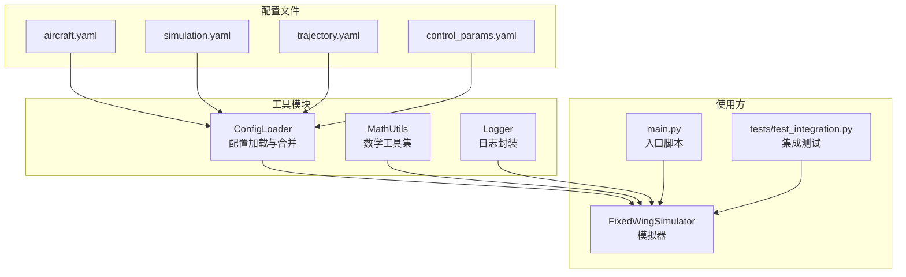
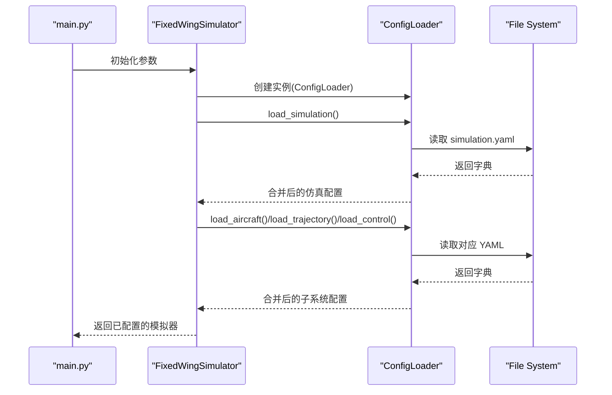
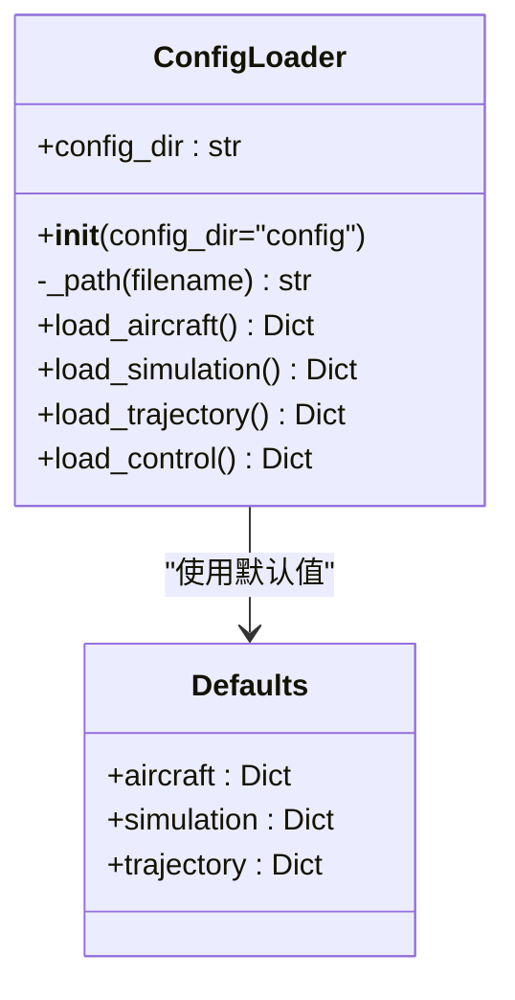
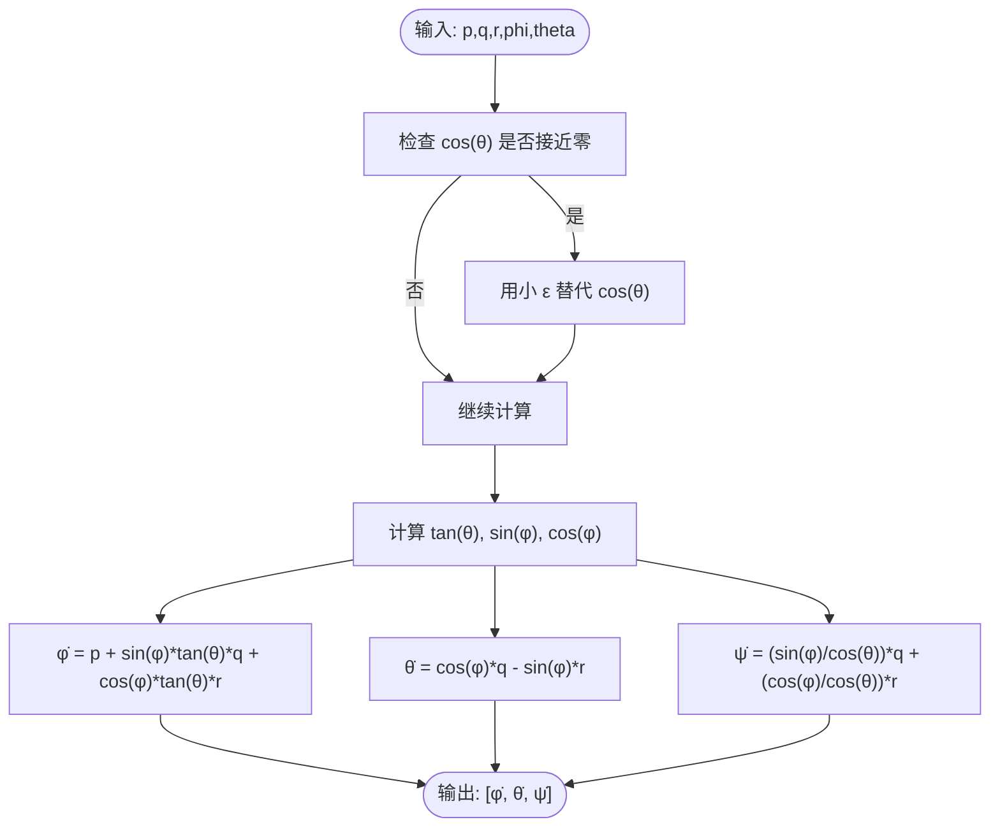
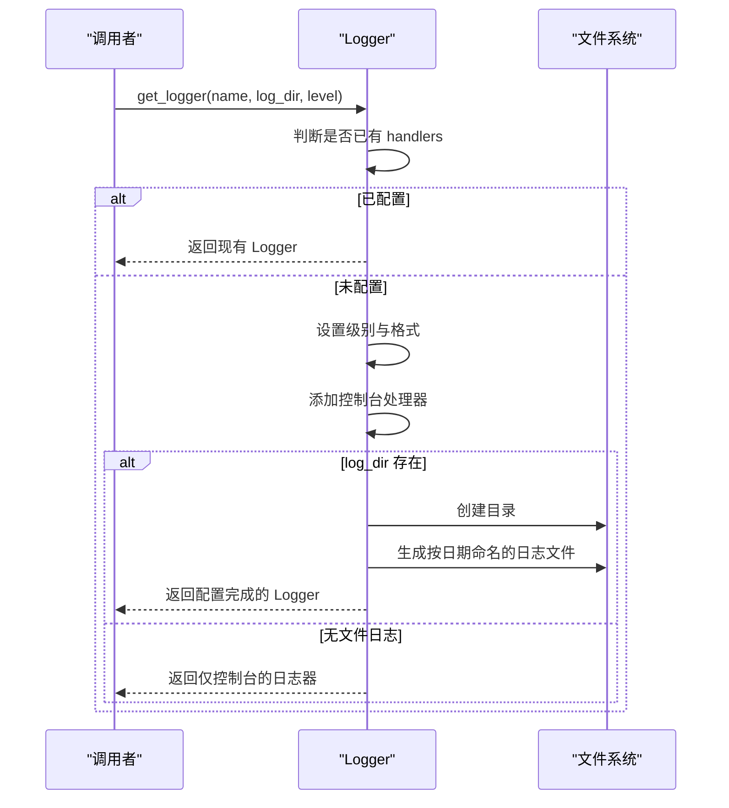
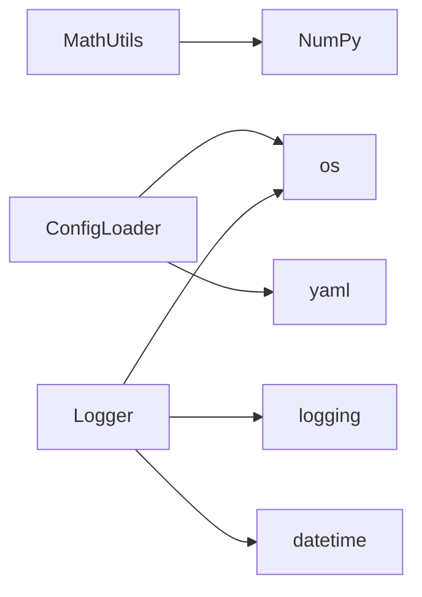

# 工具API

<cite>
**本文引用的文件**
- [src/utils/config_loader.py](file://src/utils/config_loader.py)
- [src/utils/math_utils.py](file://src/utils/math_utils.py)
- [src/utils/logger.py](file://src/utils/logger.py)
- [config/aircraft.yaml](file://config/aircraft.yaml)
- [config/simulation.yaml](file://config/simulation.yaml)
- [config/trajectory.yaml](file://config/trajectory.yaml)
- [config/control_params.yaml](file://config/control_params.yaml)
- [src/simulation/simulator.py](file://src/simulation/simulator.py)
- [main.py](file://main.py)
- [tests/test_integration.py](file://tests/test_integration.py)
</cite>

## 目录
1. [简介](#简介)
2. [项目结构](#项目结构)
3. [核心组件](#核心组件)
4. [架构总览](#架构总览)
5. [详细组件分析](#详细组件分析)
6. [依赖关系分析](#依赖关系分析)
7. [性能考量](#性能考量)
8. [故障排查指南](#故障排查指南)
9. [结论](#结论)
10. [附录](#附录)

## 简介
本文件为 FixedWingSimulator 工具模块的完整 API 参考文档，覆盖以下工具：
- ConfigLoader：配置文件加载与合并，支持 YAML 解析、默认值注入与深度合并。
- MathUtils：数学工具集，包含角度处理、旋转矩阵、欧拉角率转换、气动辅助函数等。
- Logger：日志记录封装，支持控制台与可选文件输出、格式化与级别控制。

文档同时提供使用示例、性能特征、错误处理与最佳实践，并展示如何在其他模块中正确集成这些工具。

## 项目结构
工具模块位于 src/utils 下，分别提供配置加载、数学工具与日志记录能力；配置文件位于 config/ 目录，供 ConfigLoader 读取与合并。

图表来源
- [src/utils/config_loader.py](file://src/utils/config_loader.py#L59-L81)
- [src/utils/math_utils.py](file://src/utils/math_utils.py#L1-L124)
- [src/utils/logger.py](file://src/utils/logger.py#L10-L43)
- [config/aircraft.yaml](file://config/aircraft.yaml#L1-L13)
- [config/simulation.yaml](file://config/simulation.yaml#L1-L30)
- [config/trajectory.yaml](file://config/trajectory.yaml#L1-L23)
- [config/control_params.yaml](file://config/control_params.yaml#L1-L45)
- [src/simulation/simulator.py](file://src/simulation/simulator.py#L130-L157)
- [main.py](file://main.py#L98-L141)
- [tests/test_integration.py](file://tests/test_integration.py#L63-L95)

章节来源
- [src/utils/config_loader.py](file://src/utils/config_loader.py#L1-L82)
- [src/utils/math_utils.py](file://src/utils/math_utils.py#L1-L124)
- [src/utils/logger.py](file://src/utils/logger.py#L1-L44)

## 核心组件
- ConfigLoader：负责从 config 目录加载并合并各类 YAML 配置，提供默认值注入与深度合并策略，确保用户覆盖与系统默认协同工作。
- MathUtils：提供角度归一、饱和、单位转换、旋转矩阵、坐标变换、欧拉角率转换以及气动相关函数，全部基于 NumPy 实现。
- Logger：提供统一的日志记录接口，自动配置控制台处理器与可选文件处理器，支持自定义日志目录与级别。

章节来源
- [src/utils/config_loader.py](file://src/utils/config_loader.py#L59-L81)
- [src/utils/math_utils.py](file://src/utils/math_utils.py#L13-L124)
- [src/utils/logger.py](file://src/utils/logger.py#L10-L43)

## 架构总览
下图展示了工具模块与使用方之间的交互关系，以及配置文件的来源。

图表来源
- [src/simulation/simulator.py](file://src/simulation/simulator.py#L130-L157)
- [src/utils/config_loader.py](file://src/utils/config_loader.py#L68-L81)
- [config/simulation.yaml](file://config/simulation.yaml#L1-L30)

## 详细组件分析

### ConfigLoader 组件分析
- 职责
  - 加载并合并各子系统的 YAML 配置。
  - 提供默认配置字典，用于未显式指定的键。
  - 使用深度合并策略，保证嵌套字典的递归覆盖。
- 关键接口
  - load_aircraft()：合并 aircraft.yaml 与默认飞机配置。
  - load_simulation()：合并 simulation.yaml 与默认仿真配置。
  - load_trajectory()：合并 trajectory.yaml 与默认轨迹配置。
  - load_control()：直接返回 control_params.yaml 的原始字典（无默认注入）。
- 默认值与合并策略
  - 默认值集中于 _DEFAULTS，按子系统分组。
  - _deep_merge 递归合并用户覆盖与默认值，避免浅拷贝导致的副作用。
- 错误处理
  - 当配置文件不存在或无法解析时，_load_yaml 返回空字典，确保流程不中断。
  - 用户可通过传入自定义 config_dir 覆盖默认路径。

图表来源
- [src/utils/config_loader.py](file://src/utils/config_loader.py#L59-L81)
- [src/utils/config_loader.py](file://src/utils/config_loader.py#L10-L37)

章节来源
- [src/utils/config_loader.py](file://src/utils/config_loader.py#L40-L81)
- [config/aircraft.yaml](file://config/aircraft.yaml#L1-L13)
- [config/simulation.yaml](file://config/simulation.yaml#L1-L30)
- [config/trajectory.yaml](file://config/trajectory.yaml#L1-L23)
- [config/control_params.yaml](file://config/control_params.yaml#L1-L45)

使用示例与最佳实践
- 在模拟器初始化时传入 config_dir，若未提供则自动定位到项目根目录下的 config。
- 使用 load_simulation() 获取仿真配置后，再根据需要调用其他 load_* 方法。
- 若仅需控制参数，可直接调用 load_control() 并自行处理默认值注入。

性能特征
- YAML 解析与深度合并均为 O(N) 级别（N 为配置项数量），开销极低。
- 文件 IO 为顺序读取，建议将 config 目录放置在本地磁盘以减少延迟。

错误处理
- 文件不存在时返回空字典，不会抛出异常。
- 建议在上层逻辑中对返回的配置进行必要字段校验与类型检查。

### MathUtils 组件分析
- 角度与单位
  - wrap_angle(angle_rad)：将弧度角归一到 [-π, π]。
  - wrap_angle_deg(angle_deg)：将角度归一到 [-180, 180]。
  - deg2rad、rad2deg：向量化角度转换，输入为数组或标量。
  - saturate(value, vmin, vmax)：数值饱和钳位。
- 旋转与坐标变换
  - rotation_matrix_321(phi, theta, psi)：3-2-1 欧拉角方向余弦矩阵（Body→NED）。
  - body_to_ned(v_body, phi, theta, psi)：向量从机体系变换到 NED。
  - ned_to_body(v_ned, phi, theta, psi)：向量从 NED 变换到机体系。
  - euler_rates(p, q, r, phi, theta)：由机体角速率求欧拉角导数，含奇点保护。
- 气动辅助
  - angle_of_attack(u, w)：攻角 α = atan2(w, u)。
  - sideslip_angle(v, airspeed)：侧滑角 β = arcsin(v / V)，对无效风速进行数值保护。
  - dynamic_pressure(rho, airspeed)：动压 qbar = 0.5 * ρ * V^2。

图表来源
- [src/utils/math_utils.py](file://src/utils/math_utils.py#L79-L100)

章节来源
- [src/utils/math_utils.py](file://src/utils/math_utils.py#L13-L124)

使用示例与最佳实践
- 在姿态更新后，优先使用 euler_rates 将机体角速率转换为欧拉角导数，注意奇点保护已在内部处理。
- 进行坐标变换时，先确认当前姿态角 φ, θ, ψ 的有效性，再调用 body_to_ned 或 ned_to_body。
- 计算气动参数前，确保风速与空速非负，必要时使用 saturate 进行钳位。

性能特征
- 所有函数基于 NumPy 向量化实现，适合批量数据处理。
- 角度归一与饱和操作为 O(1)；旋转矩阵乘法为 O(1)；欧拉角率转换为 O(1)。

错误处理
- euler_rates 内部通过小 ε 处理 cos(θ) 接近零的情况，避免数值不稳定。
- sideslip_angle 对无效风速进行数值保护，防止 arcsin 输入越界。

### Logger 组件分析
- 功能
  - 返回命名日志器，自动配置控制台处理器。
  - 可选启用文件处理器，按日期生成日志文件，默认保存在 logs/ 目录。
  - 支持自定义日志级别与格式。
- 关键接口
  - get_logger(name, log_dir="logs", level=logging.INFO)：获取日志器实例。
- 错误处理
  - 若日志器已存在处理器，则直接返回，避免重复配置。
  - 文件路径不存在时自动创建目录。

图表来源
- [src/utils/logger.py](file://src/utils/logger.py#L10-L43)

章节来源
- [src/utils/logger.py](file://src/utils/logger.py#L10-L43)

使用示例与最佳实践
- 在模块顶部调用 get_logger(__name__) 获取日志器，便于区分来源。
- 生产环境建议开启文件日志，便于问题追踪与审计。
- 日志级别可根据场景调整，如调试阶段使用 DEBUG，生产使用 INFO。

性能特征
- 日志写入主要受磁盘 IO 影响，建议在高频日志场景中考虑异步写入或采样策略。

错误处理
- 目录创建失败会抛出 OSError，应在上层捕获并降级为仅控制台输出。

## 依赖关系分析
- ConfigLoader 依赖
  - os：拼接文件路径。
  - yaml：安全解析 YAML。
  - typing：类型提示。
- MathUtils 依赖
  - numpy：所有数学运算。
- Logger 依赖
  - logging：标准库日志框架。
  - os、datetime：文件路径与日期格式化。

图表来源
- [src/utils/math_utils.py](file://src/utils/math_utils.py#L6)
- [src/utils/config_loader.py](file://src/utils/config_loader.py#L5-L7)
- [src/utils/logger.py](file://src/utils/logger.py#L5-L7)

章节来源
- [src/utils/math_utils.py](file://src/utils/math_utils.py#L1-L124)
- [src/utils/config_loader.py](file://src/utils/config_loader.py#L1-L82)
- [src/utils/logger.py](file://src/utils/logger.py#L1-L44)

## 性能考量
- ConfigLoader
  - YAML 解析与深度合并为轻量级操作，通常在毫秒级完成。
  - 建议在应用启动时一次性加载配置，避免重复 IO。
- MathUtils
  - NumPy 向量化操作在大批量数据上具有显著优势，单次调用开销极低。
  - 角度归一与饱和操作为常数时间复杂度。
- Logger
  - 控制台输出几乎无额外开销；文件写入受磁盘性能影响。
  - 建议在高频日志场景中采用缓冲或异步策略。

[本节为通用性能讨论，无需特定文件来源]

## 故障排查指南
- 配置文件加载问题
  - 症状：配置为空或缺失字段。
  - 排查：确认 config 目录路径正确，文件权限可读；检查 YAML 语法。
  - 处理：确保 ConfigLoader 使用绝对路径，必要时在上层进行字段校验。
- 数值不稳定
  - 症状：欧拉角率计算出现 NaN 或 Inf。
  - 排查：检查 θ 是否接近 ±90°；确认输入角速度与姿态角范围合理。
  - 处理：使用 wrap_angle/wrap_angle_deg 规范化角度；在调用 euler_rates 前进行边界检查。
- 日志输出异常
  - 症状：日志文件未生成或权限不足。
  - 排查：确认 log_dir 可写；检查磁盘空间。
  - 处理：捕获 OSError 并回退到仅控制台输出。

章节来源
- [src/utils/config_loader.py](file://src/utils/config_loader.py#L40-L45)
- [src/utils/math_utils.py](file://src/utils/math_utils.py#L79-L100)
- [src/utils/logger.py](file://src/utils/logger.py#L35-L42)

## 结论
本工具模块提供了稳定、高效的配置加载、数学计算与日志记录能力，满足固定翼无人机仿真的需求。通过合理的默认值注入、深度合并与数值保护，确保了配置与计算的鲁棒性；通过统一的日志接口，便于开发与运维。建议在实际工程中结合自身场景对配置与日志策略进行定制化扩展。

[本节为总结性内容，无需特定文件来源]

## 附录

### 使用示例（基于仓库中的真实用法）
- 在主程序中通过命令行参数驱动模拟器初始化，同时传入 config_dir。
- 在模拟器内部使用 ConfigLoader 加载仿真配置，并据此初始化系统状态。
- 在测试中通过固定 CONFIG_DIR 路径，验证不同配置组合下的稳定性。

章节来源
- [main.py](file://main.py#L98-L141)
- [src/simulation/simulator.py](file://src/simulation/simulator.py#L130-L157)
- [tests/test_integration.py](file://tests/test_integration.py#L63-L95)

### 配置文件字段概览
- aircraft.yaml
  - aircraft_name：飞机名称。
  - overrides：可选参数覆盖（质量、机翼面积等）。
- simulation.yaml
  - dt、duration：仿真步长与总时长。
  - integrator、rtol、atol：数值积分器与容差。
  - initial_position、initial_heading_deg：初始条件。
  - initial_mode：初始飞行模式。
  - wind_type、wind_speed、wind_direction_deg：风场配置。
  - log_enabled、log_dir：日志开关与目录。
- trajectory.yaml
  - type：轨迹类型（最小加加速度、最小加速度等）。
  - average_speed：平均速度。
  - yaw_mode：偏航控制模式。
  - waypoints：航路点列表。
  - loop：是否循环。
- control_params.yaml
  - 各轴 PID 参数、限幅、TECS 参数等。

章节来源
- [config/aircraft.yaml](file://config/aircraft.yaml#L1-L13)
- [config/simulation.yaml](file://config/simulation.yaml#L1-L30)
- [config/trajectory.yaml](file://config/trajectory.yaml#L1-L23)
- [config/control_params.yaml](file://config/control_params.yaml#L1-L45)