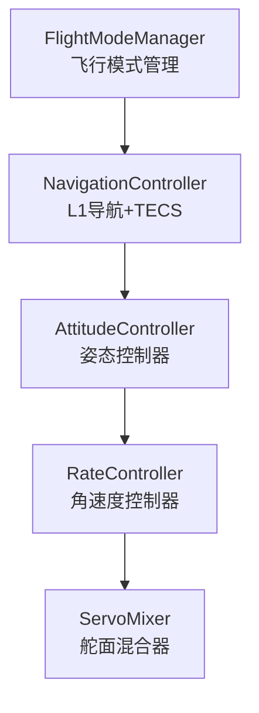
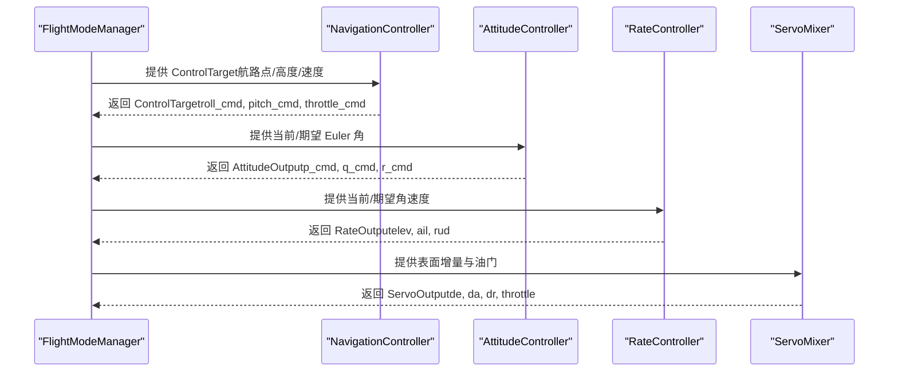
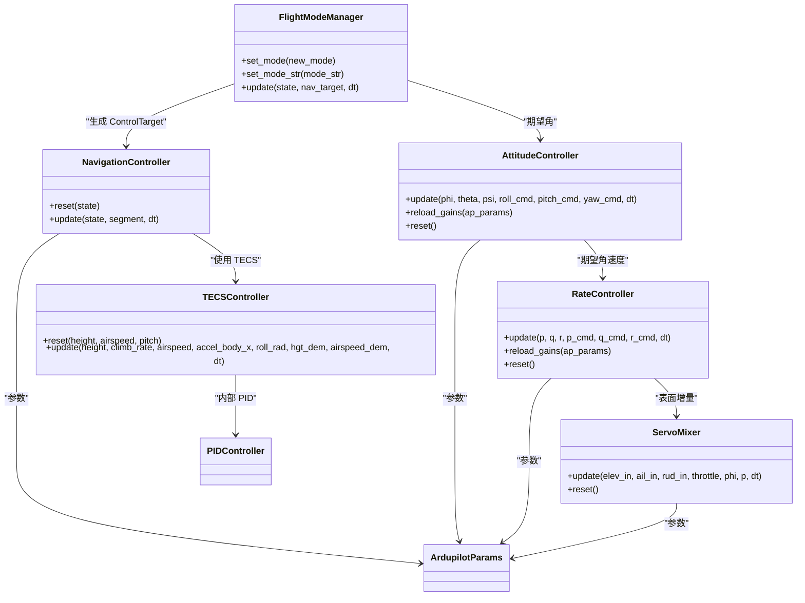

# 控制API

<cite>
**本文档引用的文件**
- [flight_mode_manager.py](file://src/control/flight_mode_manager.py)
- [navigation_controller.py](file://src/control/navigation_controller.py)
- [attitude_controller.py](file://src/control/attitude_controller.py)
- [rate_controller.py](file://src/control/rate_controller.py)
- [tecs_controller.py](file://src/control/tecs_controller.py)
- [servo_mixer.py](file://src/control/servo_mixer.py)
- [ardupilot_compat.py](file://src/control/ardupilot_compat.py)
- [pid_controller.py](file://src/control/pid_controller.py)
- [control_params.yaml](file://config/control_params.yaml)
- [example_6_ardupilot_parameters.py](file://examples/example_6_ardupilot_parameters.py)
- [test_control.py](file://tests/test_control.py)
- [__init__.py](file://src/control/__init__.py)
</cite>

## 目录
1. [简介](#简介)
2. [项目结构](#项目结构)
3. [核心组件](#核心组件)
4. [架构总览](#架构总览)
5. [详细组件分析](#详细组件分析)
6. [依赖关系分析](#依赖关系分析)
7. [性能考虑](#性能考虑)
8. [故障排查指南](#故障排查指南)
9. [结论](#结论)
10. [附录](#附录)

## 简介
本文件为 FixedWingSimulator 控制系统模块的全面 API 参考，覆盖飞行模式管理、导航控制、姿态与角速度控制、总能量控制（TECS）、舵面混合与执行输出等关键子系统。文档重点说明：
- FlightModeManager 的飞行模式切换接口与状态管理方法
- NavigationController 的导航控制算法接口（位置/速度控制）
- AttitudeController 与 RateController 的姿态/角速度控制接口
- TECSController 的总能量控制接口与参数配置
- ServoMixer 的舵面混合算法与控制输出接口
- ArduPilot 兼容参数映射与配置方法
- 参数调节指南与性能优化建议

## 项目结构
控制模块采用五层控制架构（ArduPilot 风格），自外向内依次为：
- 模式层：FlightModeManager
- 导航层：NavigationController（L1 + TECS）
- 姿态层：AttitudeController（角度环）
- 角速度层：RateController（角速度环 + SAS）
- 执行层：ServoMixer（舵面混合与限幅）

图表来源
- [flight_mode_manager.py](file://src/control/flight_mode_manager.py#L115-L298)
- [navigation_controller.py](file://src/control/navigation_controller.py#L45-L202)
- [attitude_controller.py](file://src/control/attitude_controller.py#L33-L134)
- [rate_controller.py](file://src/control/rate_controller.py#L32-L109)
- [servo_mixer.py](file://src/control/servo_mixer.py#L54-L153)

章节来源
- [__init__.py](file://src/control/__init__.py#L1-L24)

## 核心组件
- FlightModeManager：负责飞行模式选择与切换，生成 ControlTarget（期望姿态/角速度/速度/高度/油门等），支持手动、稳定、FBW、自动、盘旋、返航等模式。
- NavigationController：实现 L1 横向导航律与 TECS 高度/空速控制，输出 roll/pitch/油门命令。
- AttitudeController：将期望 Euler 角转换为期望角速度命令（roll/pitch/yaw）。
- RateController：角速度环（SAS），对 p/q/r 的误差进行 PID 控制，输出表面增量。
- ServoMixer：最终执行器分配，应用幅度/速率限制、协调转弯补偿、输出归一化。
- TECSController：总能量控制，耦合高度与速度控制，避免传统解耦 PID 的油门/积分饱和问题。
- ArdupilotParams：ArduPilot 兼容参数容器，支持 YAML 加载/保存与参数校验。
- PIDController：通用 PID 控制器，具备抗饱和与可选微分低通。

章节来源
- [flight_mode_manager.py](file://src/control/flight_mode_manager.py#L115-L298)
- [navigation_controller.py](file://src/control/navigation_controller.py#L45-L202)
- [attitude_controller.py](file://src/control/attitude_controller.py#L33-L134)
- [rate_controller.py](file://src/control/rate_controller.py#L32-L109)
- [servo_mixer.py](file://src/control/servo_mixer.py#L54-L153)
- [tecs_controller.py](file://src/control/tecs_controller.py#L50-L647)
- [ardupilot_compat.py](file://src/control/ardupilot_compat.py#L17-L130)
- [pid_controller.py](file://src/control/pid_controller.py#L17-L117)

## 架构总览
控制链路从模式层到执行层的调用序列如下：

图表来源
- [flight_mode_manager.py](file://src/control/flight_mode_manager.py#L173-L212)
- [navigation_controller.py](file://src/control/navigation_controller.py#L134-L202)
- [attitude_controller.py](file://src/control/attitude_controller.py#L81-L122)
- [rate_controller.py](file://src/control/rate_controller.py#L68-L98)
- [servo_mixer.py](file://src/control/servo_mixer.py#L80-L149)

## 详细组件分析

### FlightModeManager（飞行模式管理）
- 主要职责
  - 维护当前/上一模式，记录 HOME 位置与默认巡航参数
  - 在每个控制步长根据当前模式计算 ControlTarget
  - 支持模式切换与过渡逻辑（如进入盘旋时捕获中心点）
- 关键接口
  - set_mode(new_mode)：切换飞行模式
  - set_mode_str(mode_str)：按字符串切换
  - update(state, nav_target=None, dt=0.1)：主更新函数，返回 ControlTarget
- 模式行为要点
  - MANUAL：直通手动输入，绕过姿态/角速度回路
  - STABILIZE：机翼水平保持，使用导航层提供的 pitch/油门
  - FBW_A：保持当前滚转角，维持高度
  - FBW_B：保持高度与空速，使用导航层提供的 pitch/油门
  - AUTO/LOITER/RTH：使用导航层提供的目标，LOITER 记录中心点，RTH 返回 HOME
- 数据结构
  - AircraftState：NED 位置/速度、欧拉角/角速度、空速/高度
  - ControlTarget：期望 roll/pitch/yaw、期望角速度（可选）、空速/高度、直接控制输入、油门、是否直通

章节来源
- [flight_mode_manager.py](file://src/control/flight_mode_manager.py#L28-L114)
- [flight_mode_manager.py](file://src/control/flight_mode_manager.py#L115-L298)

### NavigationController（导航控制）
- 主要职责
  - L1 横向导航律：根据路径段与当前位置计算期望 roll
  - TECS 高度/空速控制：根据目标高度与空速计算期望 pitch 与油门
- 关键接口
  - __init__(l1_period, l1_damping, max_roll, cruise_speed, cruise_alt, tecs_kwargs...)
  - reset(state=None)：重置 TECS 积分与滤波器
  - update(state, segment, dt)：返回 ControlTarget
- 参数映射（ArduPilot）
  - NAVL1_PERIOD ↔ l1_period
  - NAVL1_DAMPING ↔ l1_damping
  - TECS_* 参数映射见 TECSController 参数表
- 算法要点
  - L1：使用 u/v 体轴速度投影得到地速方向，避免侧滑影响
  - TECS：估计爬升率与空速，耦合高度与速度，避免积分饱和

章节来源
- [navigation_controller.py](file://src/control/navigation_controller.py#L45-L202)

### AttitudeController（姿态控制）
- 主要职责
  - 将期望 Euler 角转换为期望角速度命令
  - 使用 PID 控制（仅 P，无 D），分别限制 roll/pitch/yaw 的输出
- 关键接口
  - update(phi, theta, psi, roll_cmd, pitch_cmd, yaw_cmd, dt=None) → AttitudeOutput
  - reload_gains(ap_params)：热加载 ArduPilot 参数
  - reset()：重置所有 PID 积分器
- 参数映射（ArduPilot）
  - PTCH_P（俯仰 P）
  - ROLL_P（横滚 P）
  - YAW_RATE_P/I/D/FF：在 RateController 中使用（姿态层 pass-through）

章节来源
- [attitude_controller.py](file://src/control/attitude_controller.py#L33-L134)

### RateController（角速度控制）
- 主要职责
  - 角速度环（SAS），对 p/q/r 误差进行 PID 控制
  - 提供前馈补偿（PTCH_RATE_FF/ROLL_RATE_FF/YAW_RATE_FF）
- 关键接口
  - update(p, q, r, p_cmd, q_cmd, r_cmd, dt=None) → RateOutput
  - reload_gains(ap_params)：热加载 ArduPilot 参数
  - reset()：重置所有 PID 积分器
- 参数映射（ArduPilot）
  - PTCH_RATE_P/I/D/FF
  - ROLL_RATE_P/I/D/FF
  - YAW_RATE_P/I/FF

章节来源
- [rate_controller.py](file://src/control/rate_controller.py#L32-L109)

### TECSController（总能量控制）
- 主要职责
  - 耦合高度与速度控制，避免传统解耦 PID 的油门/积分饱和
  - 通过油门控制总比能量，通过俯仰角控制比能量分配比（SEB）
- 关键接口
  - __init__(max_climb_rate, min_sink_rate, max_sink_rate, time_const, thr_damp, ptch_damp, integ_gain, spd_weight, roll_comp, hgt_dem_tconst, thr_min/max, pitch_min/max, airspeed_min/max, airspeed_cruise, ...)
  - reset(height, airspeed, pitch)
  - update(height, climb_rate, airspeed, accel_body_x, roll_rad, hgt_dem, airspeed_dem, dt) → TECSState
- 参数映射（ArduPilot）
  - TECS_CLMB_MAX, TECS_SINK_MIN, TECS_SINK_MAX, TECS_TIME_CONST, TECS_THR_DAMP, TECS_PTCH_DAMP, TECS_INTEG_GAIN, TECS_SPDWEIGHT, TECS_RLL2THR, TECS_PITCH_MIN/Max, TECS_THR_CRUISE, TECS_HDEM_TCONST
- 算法要点
  - 速度与高度需求均受速率限制和平滑处理
  - 欠速保护与不可达下沉检测
  - 坡度补偿：转弯时诱导阻力增大，增加油门前馈

章节来源
- [tecs_controller.py](file://src/control/tecs_controller.py#L50-L647)

### ServoMixer（舵面混合）
- 主要职责
  - 将表面增量与油门组合为最终执行命令
  - 应用幅度/速率限制、协调转弯补偿、输出归一化
- 关键接口
  - update(elev_in, ail_in, rud_in, throttle, phi, p, dt=None) → ServoOutput
  - reset()：重置上一时刻输出
- 输出结构
  - ServoOutput：elevator/aileron/rudder ∈ [-1,1]，throttle ∈ [0,1]
  - to_radians(elev_max_rad, ail_max_rad, rud_max_rad)：转换为实际弧度

章节来源
- [servo_mixer.py](file://src/control/servo_mixer.py#L54-L153)

### ArduPilot 兼容参数映射与配置
- ArdupilotParams 字段
  - 姿态/角速度：PTCH_P, PTCH_RATE_P/I/D/FF, ROLL_P, ROLL_RATE_P/I/D/FF, YAW_RATE_P/I/FF
  - 限制：LIM_PITCH_MAX/MIN, LIM_ROLL_CD, THR_MAX/MIN
  - 导航：NAVL1_PERIOD, NAVL1_DAMPING
  - 速度/高度：AIRSPEED_CRUISE, ALT_HOLD_RTL
  - TECS：TECS_CLMB_MAX, TECS_SINK_MIN, TECS_SINK_MAX, TECS_TIME_CONST, TECS_THR_DAMP, TECS_PTCH_DAMP, TECS_INTEG_GAIN, TECS_SPDWEIGHT, TECS_RLL2THR, TECS_PITCH_MIN/Max, TECS_THR_CRUISE, TECS_HDEM_TCONST
- 配置方法
  - from_yaml(path)：从 YAML 加载
  - to_yaml(path)：导出到 YAML
  - validate()：基本范围检查与警告
  - LIM_ROLL_DEG 属性：将 centidegrees 转换为度

章节来源
- [ardupilot_compat.py](file://src/control/ardupilot_compat.py#L17-L130)
- [control_params.yaml](file://config/control_params.yaml#L1-L45)

## 依赖关系分析

图表来源
- [flight_mode_manager.py](file://src/control/flight_mode_manager.py#L115-L298)
- [navigation_controller.py](file://src/control/navigation_controller.py#L45-L202)
- [attitude_controller.py](file://src/control/attitude_controller.py#L33-L134)
- [rate_controller.py](file://src/control/rate_controller.py#L32-L109)
- [servo_mixer.py](file://src/control/servo_mixer.py#L54-L153)
- [tecs_controller.py](file://src/control/tecs_controller.py#L50-L647)
- [ardupilot_compat.py](file://src/control/ardupilot_compat.py#L17-L130)
- [pid_controller.py](file://src/control/pid_controller.py#L17-L117)

## 性能考虑
- 参数调节建议
  - 导航层（L1）：提高 NAVL1_DAMPING 可抑制振荡；增大 NAVL1_PERIOD 会增大前瞻距离，适合较慢响应平台
  - TECS：增大 TECS_TIME_CONST 与 TECS_PTCH_DAMP 可提升稳定性；合理设置 TECS_SPDWEIGHT 平衡高度/速度优先级
  - 姿态/角速度：PTCH_P/ROLL_P 增大可加快响应但易引振荡；PTCH_RATE_P/I/D/FF 需协同调节
  - 限幅：LIM_PITCH_MAX/MIN 与 LIM_ROLL_CD 决定最大物理偏转，THR_MIN/MAX 限制油门范围
- 性能优化
  - 使用 reset() 在模式切换后重置积分器与滤波器
  - 通过 reload_gains() 热加载参数，避免重启
  - 合理设置 dt，保证 PID 采样一致性
  - 协调转弯补偿与速率限制，避免执行器饱和与抖动

## 故障排查指南
- 常见问题与定位
  - 模式切换异常：检查 FlightModeManager 的 set_mode 与 update 流程，确认 HOME 与 LOITER 中心点初始化
  - 导航不收敛：检查 L1 参数与 TECS 目标高度/空速平滑，确认 climb_rate 估计正确
  - 姿态/角速度振荡：降低 PTCH_P/ROLL_P 或增大 PTCH_RATE_D/ROLL_RATE_D，检查 FF 是否过大
  - 执行器饱和：检查 LIM_* 与 THR_* 限幅，适当降低速率限制
  - TECS 油门持续饱和：检查 TECS_THR_DAMP/INTEG_GAIN，必要时降低 TECS_INTEG_GAIN
- 单元测试参考
  - PIDController：比例/积分/微分、抗饱和、复位、前馈
  - ArdupilotParams：默认值、属性转换、from_dict、validate、to_dict
  - AttitudeController：零误差输出、限幅、符号约定
  - RateController：零误差输出、限幅、复位
  - ServoMixer：限幅、to_radians、协调转弯

章节来源
- [test_control.py](file://tests/test_control.py#L61-L371)

## 结论
本控制模块以 ArduPilot 兼容参数为核心，构建了从模式管理到执行输出的完整闭环控制链路。通过 TECS 的能量耦合控制与 L1 导航律，系统在不同飞行模式下实现了稳定、可控的路径跟踪与高度/速度调节。配合参数热加载与单元测试验证，便于在仿真与实飞场景中快速迭代与优化。

## 附录

### 参数调节流程（示例）
- 加载参数：ArdupilotParams.from_yaml(path)
- 修改参数：ap.PTCH_P = 新值
- 热加载：att_ctrl.reload_gains(ap)
- 导出参数：ap.to_yaml(path)
- 导出 ArduPilot .param 文件：AircraftFactory.export_ardupilot_params(...)

章节来源
- [example_6_ardupilot_parameters.py](file://examples/example_6_ardupilot_parameters.py#L23-L69)
- [ardupilot_compat.py](file://src/control/ardupilot_compat.py#L74-L98)