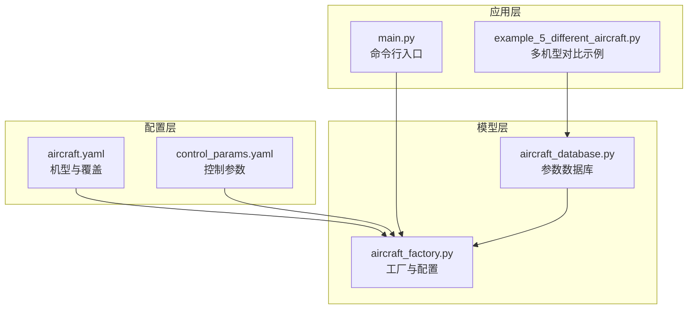
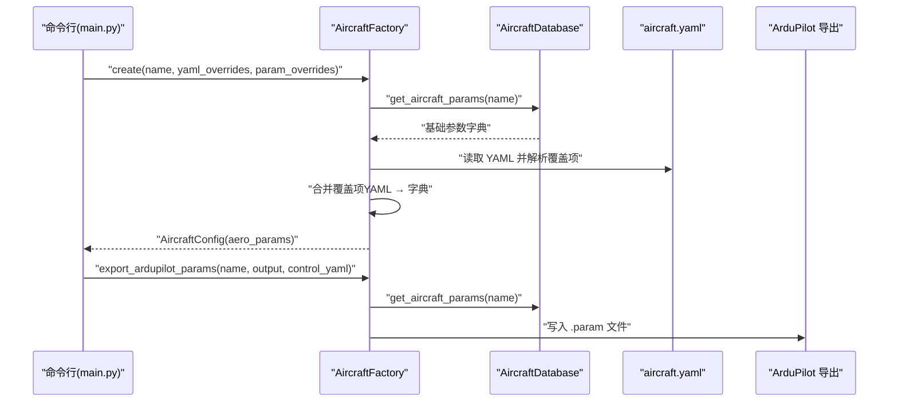
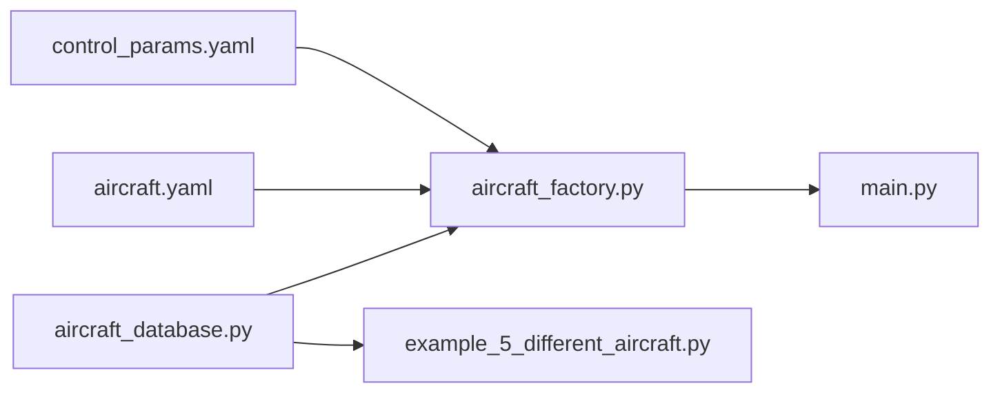

# 模型API

<cite>
**本文引用的文件**
- [aircraft_database.py](file://src/models/aircraft_database.py)
- [aircraft_factory.py](file://src/models/aircraft_factory.py)
- [aircraft.yaml](file://config/aircraft.yaml)
- [control_params.yaml](file://config/control_params.yaml)
- [__init__.py（models包）](file://src/models/__init__.py)
- [example_5_different_aircraft.py](file://examples/example_5_different_aircraft.py)
- [main.py](file://main.py)
</cite>

## 目录
1. [简介](#简介)
2. [项目结构](#项目结构)
3. [核心组件](#核心组件)
4. [架构总览](#架构总览)
5. [详细组件分析](#详细组件分析)
6. [依赖关系分析](#依赖关系分析)
7. [性能考量](#性能考量)
8. [故障排查指南](#故障排查指南)
9. [结论](#结论)
10. [附录](#附录)

## 简介
本文件为 FixedWingSimulator 的模型层 API 参考文档，重点覆盖以下内容：
- AircraftDatabase 的飞机参数存储与查询接口：包括参数获取、列表查询、信息摘要等。
- AircraftFactory 的工厂模式实现：如何通过工厂创建不同类型的飞机配置实例，支持从数据库加载、YAML 覆盖以及 ArduPilot 参数导出。
- 飞机配置参数的数据结构定义与验证规则：字段命名、取值范围、派生参数注入策略。
- 参数标准化格式与扩展机制：如何添加新飞机配置与自定义参数。
- 使用示例与最佳实践：结合示例脚本与命令行入口展示典型用法。

## 项目结构
模型层位于 src/models 目录，包含参数数据库与工厂两个核心模块；配置文件位于 config 目录，用于选择机型与覆盖默认参数；示例脚本演示了如何批量比较不同机型的线性特性。

图表来源
- [aircraft_database.py](file://src/models/aircraft_database.py#L1-L183)
- [aircraft_factory.py](file://src/models/aircraft_factory.py#L1-L136)
- [aircraft.yaml](file://config/aircraft.yaml#L1-L13)
- [control_params.yaml](file://config/control_params.yaml#L1-L45)
- [main.py](file://main.py#L1-L145)
- [example_5_different_aircraft.py](file://examples/example_5_different_aircraft.py#L1-L65)

章节来源
- [aircraft_database.py](file://src/models/aircraft_database.py#L1-L183)
- [aircraft_factory.py](file://src/models/aircraft_factory.py#L1-L136)
- [aircraft.yaml](file://config/aircraft.yaml#L1-L13)
- [control_params.yaml](file://config/control_params.yaml#L1-L45)
- [main.py](file://main.py#L1-L145)
- [example_5_different_aircraft.py](file://examples/example_5_different_aircraft.py#L1-L65)

## 核心组件
- 参数数据库（AircraftDatabase）
  - 提供静态参数字典与派生参数注入逻辑，支持按名称查询完整参数集、列出所有可用机型、生成人类可读的机型摘要。
- 工厂（AircraftFactory）
  - 提供三种创建路径：直接从数据库创建、从 YAML 文件创建、导出 ArduPilot 参数文件。
  - 支持参数覆盖：优先级为 YAML 覆盖 → 字典覆盖 → 数据库默认值。
  - 输出统一的 AircraftConfig 结构，便于后续仿真或控制模块消费。

章节来源
- [aircraft_database.py](file://src/models/aircraft_database.py#L143-L183)
- [aircraft_factory.py](file://src/models/aircraft_factory.py#L39-L136)
- [__init__.py（models包）](file://src/models/__init__.py#L1-L15)

## 架构总览
模型层采用“数据库 + 工厂”的分层设计：
- 数据库负责参数存储与派生参数注入。
- 工厂负责参数合并、校验与输出标准化配置对象。
- 配置文件提供外部覆盖与导出能力。
- 应用层通过命令行或示例脚本调用工厂创建配置并驱动仿真。

图表来源
- [aircraft_factory.py](file://src/models/aircraft_factory.py#L42-L136)
- [aircraft_database.py](file://src/models/aircraft_database.py#L143-L166)
- [aircraft.yaml](file://config/aircraft.yaml#L1-L13)

章节来源
- [aircraft_factory.py](file://src/models/aircraft_factory.py#L39-L136)
- [aircraft_database.py](file://src/models/aircraft_database.py#L143-L183)
- [main.py](file://main.py#L98-L141)

## 详细组件分析

### AircraftDatabase（参数数据库）
职责与接口
- 查询接口
  - get_aircraft_params(name): 返回指定机型的完整参数字典，并注入派生参数（如 U0、rho、q_bar）。
  - list_aircraft(): 返回数据库中所有可用机型名称列表。
  - aircraft_info(name): 返回人类可读的机型摘要字符串。
- 内部数据
  - _DB: 静态参数字典，键为机型名，值为参数字典。
  - AIRCRAFT_NAMES: 机型名列表的便捷索引。
- 派生参数注入
  - 基于常量与输入参数计算 U0、rho、q_bar，并写回参数字典。

参数字段与类型
- 识别信息：name（字符串）、company（字符串）、country（字符串）
- 几何与惯性：mass（浮点）、S（机翼面积）、c（平均弦长）、b（翼展）、Ixx/Iyy/Izz/ixz（惯性张量元素）
- 飞行状态：Mach（马赫数）
- 纵向气动：CL_0、CL_alpha、CL_q、CL_deltae、CL_u、CD_0、CD_alpha、CD_q、CD_deltae、CD_u、Cm_0、Cm_alpha、Cm_q、Cm_deltae、Cm_u
- 侧向气动：CYb、CYp、CYr、CYda、CYdr、Clb、Clp、Clr、Clda、Cldr、Cnb、Cnp、Cnr、Cnda、Cndr
- 派生参数：U0（飞行速度）、rho（空气密度）、q_bar（动态压强）

验证与错误处理
- 当请求不存在的机型时抛出 KeyError，并提示可用机型列表。
- 列表查询与信息摘要不涉及参数校验，仅返回现有数据。

复杂度与性能
- 参数查询为 O(1)，列表与信息摘要为 O(n)（n 为参数数量），整体开销极低。

章节来源
- [aircraft_database.py](file://src/models/aircraft_database.py#L29-L133)
- [aircraft_database.py](file://src/models/aircraft_database.py#L143-L183)

### AircraftFactory（工厂）
职责与接口
- create(name, yaml_overrides=None, param_overrides=None)
  - 从数据库加载参数，应用 YAML 覆盖与字典覆盖，返回 AircraftConfig。
- from_yaml(config_path)
  - 从 YAML 文件读取 aircraft_name 与 overrides，委托 create 完成构建。
- export_ardupilot_params(name, output_path, control_yaml=None)
  - 将机型物理参数与控制参数导出为 ArduPilot .param 文件，支持控制参数叠加。

AircraftConfig 数据结构
- name: 机型名（来自数据库）
- aero_params: 合并后的参数字典（包含派生参数）

覆盖优先级与合并策略
- YAML 覆盖：读取 YAML 中的 overrides 或顶层键，仅对存在于数据库中的键进行更新。
- 字典覆盖：最高优先级，覆盖 YAML 中的同名键。
- 未覆盖键保持数据库默认值。

ArduPilot 导出映射
- 物理参数映射：MASS、WING_AREA、WING_SPAN、MEAN_CHORD、IYY、IXX、IZZ、AIRSPEED_CRUISE
- 控制参数映射：从 control_params.yaml 中读取数值型键值对，写入同一文件

章节来源
- [aircraft_factory.py](file://src/models/aircraft_factory.py#L39-L136)

### 飞机参数数据结构与验证规则
数据结构定义
- 参数字典键集合由数据库静态定义，包含识别、几何、惯性、飞行状态、气动系数等类别。
- 派生参数在查询时自动注入，确保下游动力学模块可直接使用。

验证规则
- 机型存在性：查询前必须确认 name 在 AIRCRAFT_NAMES 中。
- 覆盖键有效性：YAML 与字典覆盖仅对数据库中存在的键生效。
- 类型约束：导出到 ArduPilot 时，控制参数要求数值类型（int/float）。

扩展机制
- 新增机型：在数据库字典中添加新的键值对，遵循现有键命名规范。
- 自定义参数：通过 YAML 或字典覆盖新增数据库中未定义的键（需下游模块支持）。

章节来源
- [aircraft_database.py](file://src/models/aircraft_database.py#L29-L133)
- [aircraft_factory.py](file://src/models/aircraft_factory.py#L63-L74)
- [aircraft.yaml](file://config/aircraft.yaml#L1-L13)
- [control_params.yaml](file://config/control_params.yaml#L1-L45)

### 使用流程与示例

#### 从数据库获取参数
- 步骤
  - 调用 get_aircraft_params(name) 获取参数字典。
  - 工厂会自动注入派生参数（U0、rho、q_bar）。
- 示例参考
  - 多机型线性分析示例展示了如何遍历所有机型并运行分析。

章节来源
- [aircraft_database.py](file://src/models/aircraft_database.py#L143-L166)
- [example_5_different_aircraft.py](file://examples/example_5_different_aircraft.py#L24-L33)

#### 通过工厂创建配置
- 直接创建
  - 调用 create(name, yaml_overrides, param_overrides)。
- 从 YAML 创建
  - 调用 from_yaml(config_path)，内部解析 aircraft_name 与 overrides。
- 导出 ArduPilot 参数
  - 调用 export_ardupilot_params(name, output_path, control_yaml)。

章节来源
- [aircraft_factory.py](file://src/models/aircraft_factory.py#L42-L93)
- [aircraft_factory.py](file://src/models/aircraft_factory.py#L95-L136)
- [aircraft.yaml](file://config/aircraft.yaml#L1-L13)
- [control_params.yaml](file://config/control_params.yaml#L1-L45)

#### 添加新飞机配置与自定义参数
- 新增机型
  - 在数据库字典中添加新的键值对，键为机型名，值为参数字典。
- 自定义参数
  - 通过 YAML 或字典覆盖新增数据库中未定义的键（需下游模块支持）。
- 验证与测试
  - 使用 aircraft_info(name) 生成摘要，检查关键参数是否正确。

章节来源
- [aircraft_database.py](file://src/models/aircraft_database.py#L29-L133)
- [aircraft_factory.py](file://src/models/aircraft_factory.py#L63-L74)
- [aircraft_database.py](file://src/models/aircraft_database.py#L174-L182)

## 依赖关系分析

图表来源
- [aircraft_database.py](file://src/models/aircraft_database.py#L1-L183)
- [aircraft_factory.py](file://src/models/aircraft_factory.py#L1-L136)
- [aircraft.yaml](file://config/aircraft.yaml#L1-L13)
- [control_params.yaml](file://config/control_params.yaml#L1-L45)
- [main.py](file://main.py#L1-L145)
- [example_5_different_aircraft.py](file://examples/example_5_different_aircraft.py#L1-L65)

章节来源
- [__init__.py（models包）](file://src/models/__init__.py#L1-L15)
- [aircraft_factory.py](file://src/models/aircraft_factory.py#L12-L12)
- [aircraft_database.py](file://src/models/aircraft_database.py#L1-L20)

## 性能考量
- 参数查询为哈希表查找，时间复杂度 O(1)。
- 派生参数注入为常数次算术运算，开销极低。
- YAML 解析与覆盖合并为 O(k)（k 为覆盖键数量），通常远小于参数总数。
- 建议
  - 在批量场景下复用已构建的 AircraftConfig，避免重复解析 YAML。
  - 控制参数导出仅写入数值型键值，确保文件体积与解析效率。

## 故障排查指南
常见问题与解决建议
- 无法找到机型
  - 现象：KeyError 提示机型不存在。
  - 排查：确认 name 是否在 AIRCRAFT_NAMES 中；使用 list_aircraft() 查看可用机型。
- YAML 覆盖无效
  - 现象：覆盖键未生效。
  - 排查：确认覆盖键存在于数据库参数字典中；检查 YAML 文件格式与键名拼写。
- ArduPilot 导出为空或缺少控制参数
  - 现象：导出文件缺少控制参数。
  - 排查：确认 control_params.yaml 存在且包含数值型键值；检查文件路径与权限。

章节来源
- [aircraft_database.py](file://src/models/aircraft_database.py#L153-L156)
- [aircraft_factory.py](file://src/models/aircraft_factory.py#L63-L74)
- [aircraft_factory.py](file://src/models/aircraft_factory.py#L123-L127)

## 结论
AircraftDatabase 与 AircraftFactory 构成了模型层的核心：前者提供标准化的参数存储与派生参数注入，后者提供灵活的参数合并与导出能力。通过 YAML 覆盖与字典覆盖，用户可以快速定制不同机型的仿真参数，并将结果导出到 ArduPilot 生态系统。该设计既保证了易用性，又具备良好的扩展性与可维护性。

## 附录

### API 一览（概要）
- AircraftDatabase
  - get_aircraft_params(name): 获取完整参数字典（含派生参数）
  - list_aircraft(): 获取可用机型列表
  - aircraft_info(name): 获取人类可读摘要
- AircraftFactory
  - create(name, yaml_overrides=None, param_overrides=None): 创建配置
  - from_yaml(config_path): 从 YAML 创建配置
  - export_ardupilot_params(name, output_path, control_yaml=None): 导出 ArduPilot 参数

章节来源
- [aircraft_database.py](file://src/models/aircraft_database.py#L143-L183)
- [aircraft_factory.py](file://src/models/aircraft_factory.py#L42-L136)