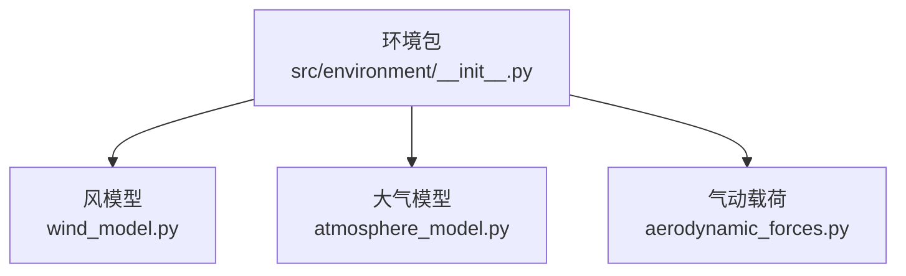
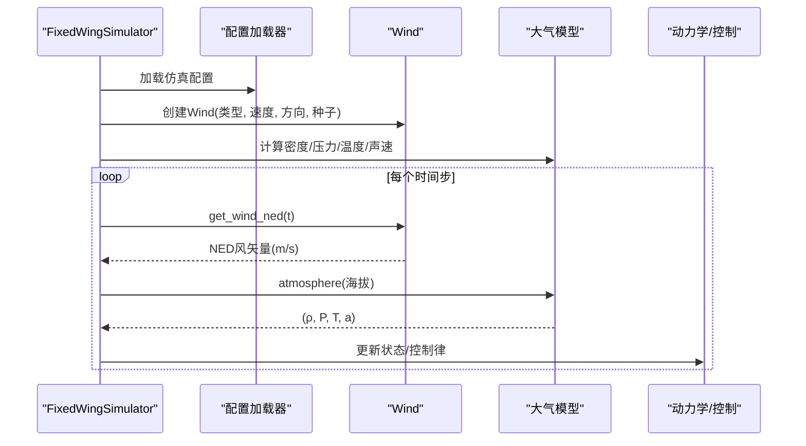
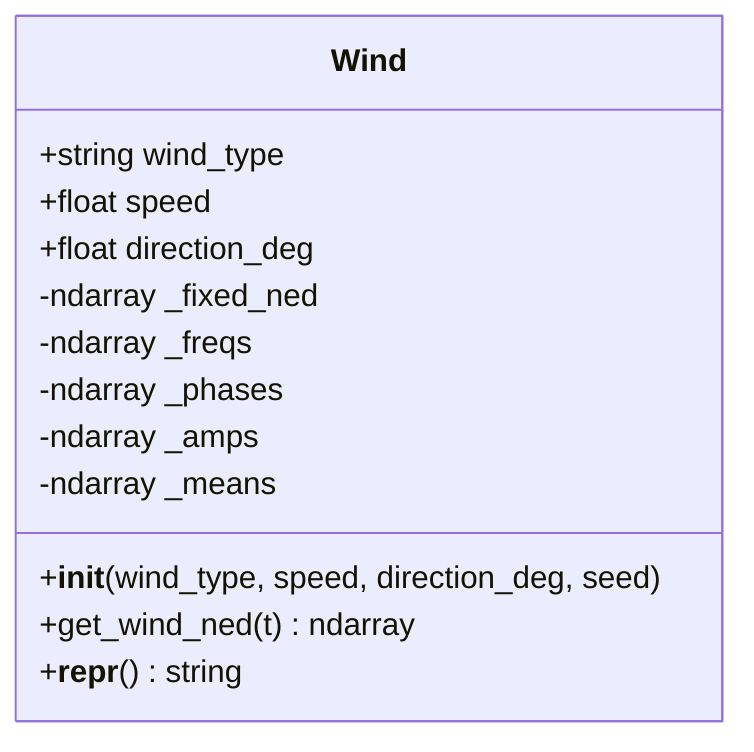
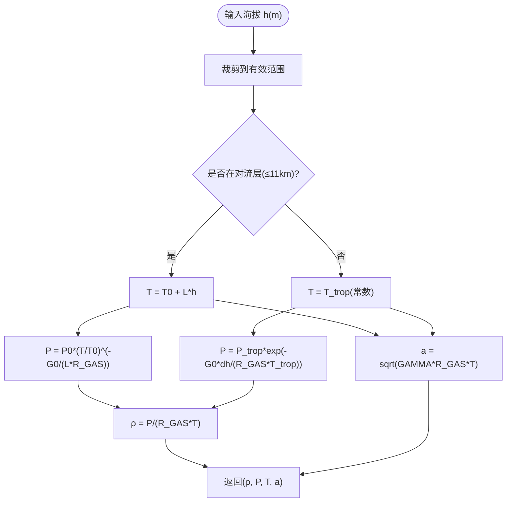
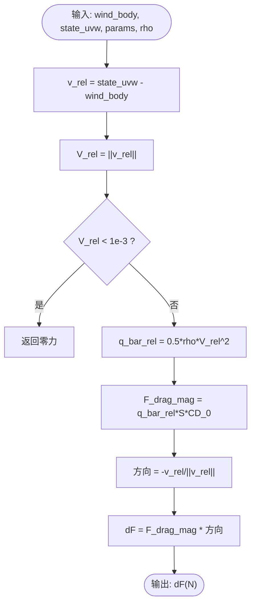
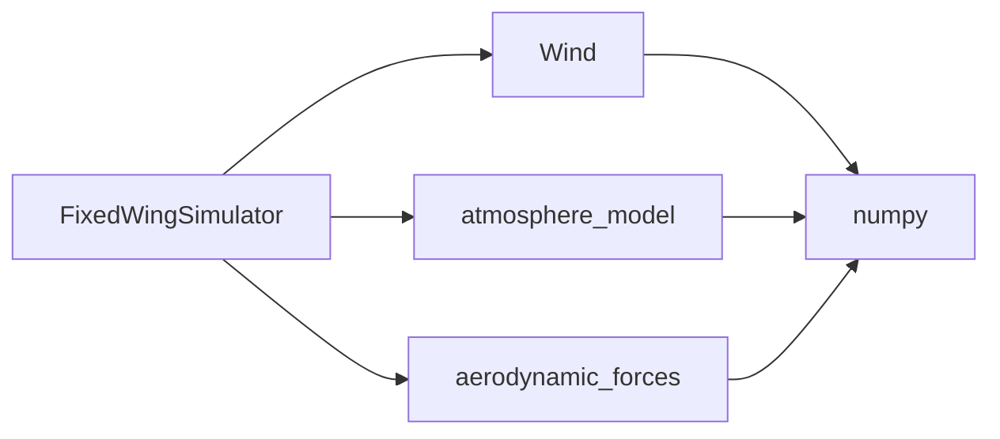

# 环境API

<cite>
**本文引用的文件**
- [src/environment/__init__.py](file://src/environment/__init__.py)
- [src/environment/wind_model.py](file://src/environment/wind_model.py)
- [src/environment/atmosphere_model.py](file://src/environment/atmosphere_model.py)
- [src/environment/aerodynamic_forces.py](file://src/environment/aerodynamic_forces.py)
- [src/simulation/simulator.py](file://src/simulation/simulator.py)
- [config/simulation.yaml](file://config/simulation.yaml)
- [config/aircraft.yaml](file://config/aircraft.yaml)
- [src/utils/config_loader.py](file://src/utils/config_loader.py)
- [src/models/aircraft_database.py](file://src/models/aircraft_database.py)
- [examples/example_4_wind_resistance.py](file://examples/example_4_wind_resistance.py)
- [tests/test_integration.py](file://tests/test_integration.py)
</cite>

## 目录
1. [简介](#简介)
2. [项目结构](#项目结构)
3. [核心组件](#核心组件)
4. [架构总览](#架构总览)
5. [详细组件分析](#详细组件分析)
6. [依赖关系分析](#依赖关系分析)
7. [性能考量](#性能考量)
8. [故障排查指南](#故障排查指南)
9. [结论](#结论)
10. [附录](#附录)

## 简介
本文件为FixedWingSimulator环境模块的完整API参考文档，聚焦以下三个核心接口：
- 风场建模接口：Wind类，支持无风、常值风、正弦叠加风以及随机正弦风（类湍流）四种模式，提供NED坐标系下的风矢量随时间的计算能力。
- 大气模型接口：基于国际标准大气（ISA）模型，提供温度、压力、密度与声速的计算，覆盖对流层至下平流层范围。
- 气动载荷接口：compute_wind_drag_forces函数，用于计算相对风引起的附加体坐标系气动阻力增量，便于扰动/灵敏度分析。

同时，文档给出环境参数的物理意义与单位说明，讨论建模精度与计算复杂度，并展示如何通过配置文件与构造参数设置不同的环境场景与边界条件。

## 项目结构
环境模块位于src/environment目录，对外通过src/environment/__init__.py统一导出，供仿真引擎在初始化时加载。

图表来源
- [src/environment/__init__.py](file://src/environment/__init__.py#L1-L16)
- [src/environment/wind_model.py](file://src/environment/wind_model.py#L1-L113)
- [src/environment/atmosphere_model.py](file://src/environment/atmosphere_model.py#L1-L77)
- [src/environment/aerodynamic_forces.py](file://src/environment/aerodynamic_forces.py#L1-L54)

章节来源
- [src/environment/__init__.py](file://src/environment/__init__.py#L1-L16)

## 核心组件
- Wind类：提供风类型选择、风速与风向（来自方向）设置、随机种子控制；核心方法为get_wind_ned(t)，返回NED坐标系下的风速度矢量（m/s）。
- 大气函数族：compute_temperature、compute_pressure、compute_density、compute_speed_of_sound、atmosphere，均以海拔高度为输入，返回对应大气参数。
- 气动载荷函数：compute_wind_drag_forces，输入相对风与当前空速、机翼面积与零升阻力系数、空气密度，输出体坐标系下的附加阻力增量（N）。

章节来源
- [src/environment/wind_model.py](file://src/environment/wind_model.py#L18-L113)
- [src/environment/atmosphere_model.py](file://src/environment/atmosphere_model.py#L24-L77)
- [src/environment/aerodynamic_forces.py](file://src/environment/aerodynamic_forces.py#L13-L54)

## 架构总览
环境模块在仿真引擎中的集成路径如下：FixedWingSimulator在初始化阶段读取配置，构建Wind实例并调用其get_wind_ned(t)获取风矢量；同时在每个时间步根据当前海拔高度调用atmosphere或相关函数获取密度、压力等参数；在需要时调用compute_wind_drag_forces计算由相对风引起的附加气动力增量。

图表来源
- [src/simulation/simulator.py](file://src/simulation/simulator.py#L130-L200)
- [src/environment/wind_model.py](file://src/environment/wind_model.py#L76-L109)
- [src/environment/atmosphere_model.py](file://src/environment/atmosphere_model.py#L61-L77)

## 详细组件分析

### Wind类（风场建模）
- 支持风类型
  - NONE：无风，返回零矢量。
  - FIXED：常值风，按给定速度与“来自方向”计算NED单位矢量并乘以速度。
  - SINE：正弦叠加风，每轴叠加3个不同频率与相位的正弦分量，振幅平均分配。
  - RANDOMSINE：随机正弦风，每轴叠加3个随机振幅与随机均值的正弦分量，模拟类湍流。
- 输入参数
  - wind_type：字符串，必须为NONE、FIXED、SINE、RANDOMSINE之一。
  - speed：标量，m/s，用于FIXED/SINE/RANDOMSINE的特征速度。
  - direction_deg：标量，度，风“来自方向”，0°=北，90°=东，采用气象约定。
  - seed：整数，随机数生成器种子，确保可复现性。
- 输出
  - get_wind_ned(t)：返回NED坐标系风速度矢量[u_north, v_east, v_down]（m/s）。
- 关键实现要点
  - 使用NED坐标系（北、东、下），风“来自方向”意味着风朝向“该方向+180°”。
  - 对于SINE/RANDOMSINE，预生成每轴3个频率（0.1–0.5 Hz）、相位与振幅（或均值），保证低频扰动特性。
  - 返回值为副本，避免外部修改内部状态。

图表来源
- [src/environment/wind_model.py](file://src/environment/wind_model.py#L18-L113)

章节来源
- [src/environment/wind_model.py](file://src/environment/wind_model.py#L18-L113)

### 大气模型（ISA）
- 物理范围：对流层（0–11 km）与下平流层（11–20 km）。
- 基础常数：重力加速度、气体常数、比热比、海平面标准温度/压力/密度、对流层温度递减率、对流层顶高度与温度。
- 函数定义
  - compute_temperature(altitude_m)：返回温度（K）。
  - compute_pressure(altitude_m)：返回压力（Pa）。
  - compute_density(altitude_m)：返回密度（kg/m³）。
  - compute_speed_of_sound(altitude_m)：返回声速（m/s）。
  - atmosphere(altitude_m)：一次性返回(ρ, P, T, a)。
- 数值范围保护：温度函数对输入进行裁剪，确保在合理范围内（例如-500 m到80 km）。

图表来源
- [src/environment/atmosphere_model.py](file://src/environment/atmosphere_model.py#L24-L77)

章节来源
- [src/environment/atmosphere_model.py](file://src/environment/atmosphere_model.py#L1-L77)

### 气动载荷（相对风附加阻力）
- 功能：计算相对风引起的附加体坐标系气动阻力增量ΔF，用于扰动/灵敏度分析。
- 输入
  - wind_body：体坐标系风速度（m/s）。
  - state_uvw：体坐标系飞行器速度（m/s）。
  - params：包含机翼面积S（m²）与零升阻力系数CD_0的字典。
  - rho：空气密度（kg/m³），默认取海平面值。
- 输出
  - dF：体坐标系附加阻力增量（N）。
- 计算流程
  - 计算相对速度v_rel = state_uvw - wind_body，若相对速度过小则返回零力。
  - 计算动态压力q_bar_rel = 0.5*rho*|v_rel|²。
  - 计算阻力大小F_drag_mag = q_bar_rel*S*CD_0。
  - 将阻力沿相对速度反方向归一化后返回。

图表来源
- [src/environment/aerodynamic_forces.py](file://src/environment/aerodynamic_forces.py#L13-L54)

章节来源
- [src/environment/aerodynamic_forces.py](file://src/environment/aerodynamic_forces.py#L1-L54)

## 依赖关系分析
- Wind类依赖numpy进行数组运算与随机数生成。
- 大气模型函数相互独立，atmosphere内部调用compute_temperature与compute_pressure以复用计算结果。
- compute_wind_drag_forces依赖numpy进行向量运算与范数计算。
- FixedWingSimulator在初始化时导入Wind与compute_density，并在运行循环中按需调用上述接口。

图表来源
- [src/simulation/simulator.py](file://src/simulation/simulator.py#L38-L40)
- [src/environment/wind_model.py](file://src/environment/wind_model.py#L14-L15)
- [src/environment/atmosphere_model.py](file://src/environment/atmosphere_model.py#L8-L9)
- [src/environment/aerodynamic_forces.py](file://src/environment/aerodynamic_forces.py#L9-L10)

章节来源
- [src/simulation/simulator.py](file://src/simulation/simulator.py#L38-L52)

## 性能考量
- Wind.get_wind_ned：每次调用执行常数次三角函数与加法，时间复杂度O(1)，空间开销极小，适合高频调用。
- 大气模型：各函数均为纯数学计算，O(1)复杂度；atmosphere一次返回四个参数，避免重复计算。
- compute_wind_drag_forces：涉及一次范数计算与标量乘法，O(1)；在控制回路中建议缓存相对速度与密度以减少重复计算。
- 内存占用：Wind类在初始化时预分配固定尺寸的数组（3轴×3谐波），内存开销与风类型相关但恒定。

[本节不直接分析具体文件，无需章节来源]

## 故障排查指南
- 风类型非法
  - 症状：初始化Wind时报错，提示未知风类型。
  - 排查：确认wind_type为NONE、FIXED、SINE、RANDOMSINE之一。
  - 参考：[src/environment/wind_model.py](file://src/environment/wind_model.py#L39-L42)
- 风参数越界
  - 症状：仿真数值发散或异常。
  - 排查：检查wind_speed与wind_direction_deg是否合理；SINE/RANDOMSINE的频率与振幅由随机生成，可通过调整seed复现问题。
  - 参考：[src/environment/wind_model.py](file://src/environment/wind_model.py#L58-L71)
- 大气参数异常
  - 症状：密度/压力/温度/声速计算结果异常。
  - 排查：确认海拔输入在有效范围内；ISA模型仅覆盖对流层至下平流层。
  - 参考：[src/environment/atmosphere_model.py](file://src/environment/atmosphere_model.py#L30-L34)
- 相对风过小导致力为零
  - 症状：附加阻力始终为零。
  - 排查：检查state_uvw与wind_body是否接近相等；必要时提高仿真分辨率或扰动幅度。
  - 参考：[src/environment/aerodynamic_forces.py](file://src/environment/aerodynamic_forces.py#L42-L43)
- 配置未生效
  - 症状：wind_type未按预期工作。
  - 排查：确认传入FixedWingSimulator的wind_type参数优先级高于配置文件；或检查config/simulation.yaml中的wind_type、wind_speed、wind_direction_deg。
  - 参考：[src/simulation/simulator.py](file://src/simulation/simulator.py#L159-L163)，[config/simulation.yaml](file://config/simulation.yaml#L22-L26)

章节来源
- [src/environment/wind_model.py](file://src/environment/wind_model.py#L39-L42)
- [src/environment/atmosphere_model.py](file://src/environment/atmosphere_model.py#L30-L34)
- [src/environment/aerodynamic_forces.py](file://src/environment/aerodynamic_forces.py#L42-L43)
- [src/simulation/simulator.py](file://src/simulation/simulator.py#L159-L163)
- [config/simulation.yaml](file://config/simulation.yaml#L22-L26)

## 结论
环境模块提供了简洁高效的风场与大气建模接口，配合气动载荷增量计算，能够满足固定翼无人机仿真中对风扰动与大气参数的建模需求。Wind类支持多种风模式，ISA模型覆盖常用飞行高度范围，compute_wind_drag_forces适用于线性化与扰动分析。通过配置文件与构造参数，用户可以灵活地设置不同的环境场景与边界条件。

[本节不直接分析具体文件，无需章节来源]

## 附录

### 环境参数物理意义与单位
- 风参数
  - wind_type：风模式类型（NONE/FIXED/SINE/RANDOMSINE）。
  - speed：风速（m/s），用于FIXED/SINE/RANDOMSINE的特征速度。
  - direction_deg：风“来自方向”（度），0°=北，90°=东，气象约定。
  - seed：随机种子（整数），用于SINE/RANDOMSINE的可复现性。
- 大气参数
  - 海拔高度：m（正向上）。
  - 温度：K（开尔文）。
  - 压力：Pa（帕斯卡）。
  - 密度：kg/m³。
  - 声速：m/s。
- 气动载荷
  - 机翼面积S：m²。
  - 零升阻力系数CD_0：无量纲。
  - 空气密度ρ：kg/m³。
  - 附加阻力增量dF：N。

章节来源
- [src/environment/wind_model.py](file://src/environment/wind_model.py#L22-L28)
- [src/environment/atmosphere_model.py](file://src/environment/atmosphere_model.py#L24-L58)
- [src/environment/aerodynamic_forces.py](file://src/environment/aerodynamic_forces.py#L28-L38)

### 配置与使用示例
- 配置文件
  - config/simulation.yaml提供wind_type、wind_speed、wind_direction_deg等默认项，可被FixedWingSimulator构造参数覆盖。
  - 参考：[config/simulation.yaml](file://config/simulation.yaml#L22-L26)
- 代码示例
  - 示例脚本展示了使用RANDOMSINE风模式与FBW_B飞行模式的仿真流程。
  - 参考：[examples/example_4_wind_resistance.py](file://examples/example_4_wind_resistance.py#L20-L36)
- 单元测试
  - 测试覆盖了不同风模式下的稳定性验证与API一致性。
  - 参考：[tests/test_integration.py](file://tests/test_integration.py#L125-L134)

章节来源
- [config/simulation.yaml](file://config/simulation.yaml#L22-L26)
- [examples/example_4_wind_resistance.py](file://examples/example_4_wind_resistance.py#L20-L36)
- [tests/test_integration.py](file://tests/test_integration.py#L125-L134)

### 环境建模精度与复杂度
- Wind.get_wind_ned：O(1)时间复杂度，内存占用恒定，适合实时仿真。
- 大气模型：O(1)时间复杂度，ISA模型在对流层与下平流层内具有较高精度，超出范围需谨慎外推。
- compute_wind_drag_forces：O(1)时间复杂度，建议在高频控制回路中缓存中间变量以降低开销。

章节来源
- [src/environment/wind_model.py](file://src/environment/wind_model.py#L76-L109)
- [src/environment/atmosphere_model.py](file://src/environment/atmosphere_model.py#L24-L77)
- [src/environment/aerodynamic_forces.py](file://src/environment/aerodynamic_forces.py#L13-L54)