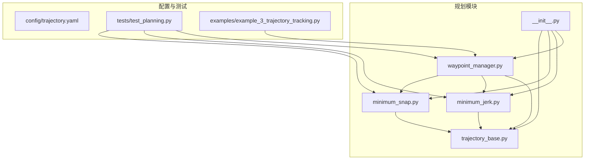
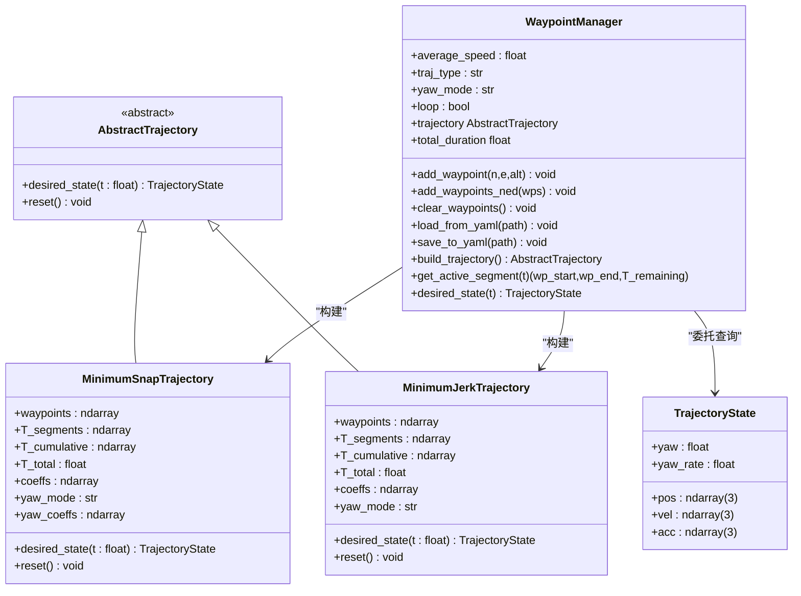
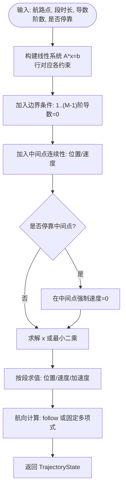
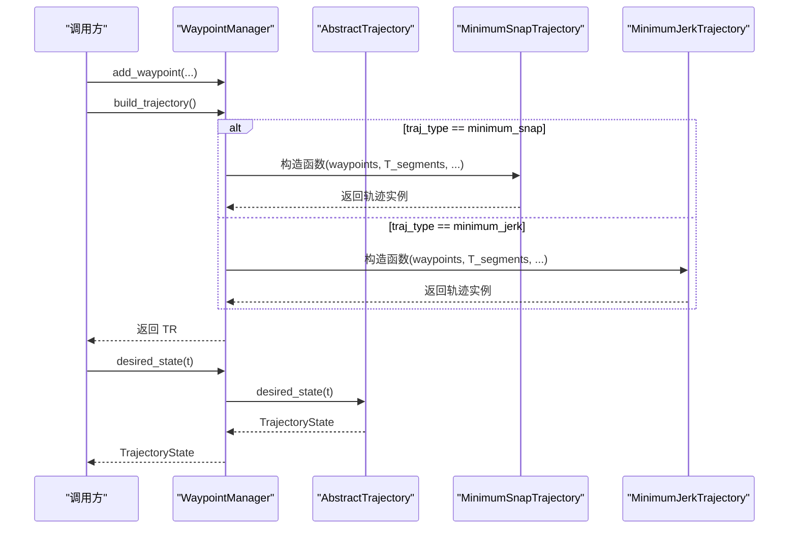
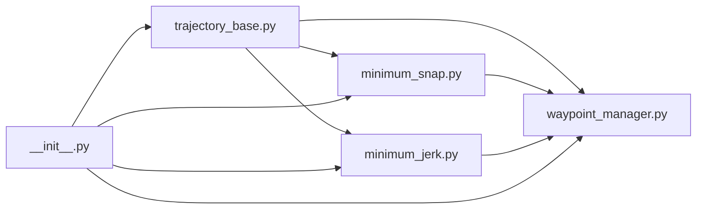

# 规划API

<cite>
**本文引用的文件**
- [src/planning/trajectory_base.py](file://src/planning/trajectory_base.py)
- [src/planning/minimum_snap.py](file://src/planning/minimum_snap.py)
- [src/planning/minimum_jerk.py](file://src/planning/minimum_jerk.py)
- [src/planning/waypoint_manager.py](file://src/planning/waypoint_manager.py)
- [src/planning/__init__.py](file://src/planning/__init__.py)
- [config/trajectory.yaml](file://config/trajectory.yaml)
- [tests/test_planning.py](file://tests/test_planning.py)
- [examples/example_3_trajectory_tracking.py](file://examples/example_3_trajectory_tracking.py)
</cite>

## 目录
1. [简介](#简介)
2. [项目结构](#项目结构)
3. [核心组件](#核心组件)
4. [架构总览](#架构总览)
5. [详细组件分析](#详细组件分析)
6. [依赖关系分析](#依赖关系分析)
7. [性能与数值稳定性](#性能与数值稳定性)
8. [故障排查指南](#故障排查指南)
9. [结论](#结论)
10. [附录：API参考速查](#附录api参考速查)

## 简介
本文件为 FixedWingSimulator 的规划模块提供详细的API参考文档，覆盖以下主题：
- MinimumSnap 和 MinimumJerk 轨迹规划算法的接口与使用方式
- TrajectoryBase 的轨迹基类接口与通用方法
- WaypointManager 的航路点管理接口（添加、删除、修改、路径规划）
- 数学模型与算法实现要点（多项式分段构造、边界与连续性约束）
- 轨迹质量评估指标与参数调节建议
- 不同飞行任务下的算法选择策略

## 项目结构
规划模块位于 src/planning，包含如下关键文件：
- trajectory_base.py：定义轨迹状态数据结构与抽象轨迹接口
- minimum_snap.py：最小Snap轨迹（4阶导数最小）实现
- minimum_jerk.py：最小Jerk轨迹（3阶导数最小）实现
- waypoint_manager.py：航路点管理器与轨迹工厂
- __init__.py：对外导出的公共API
- config/trajectory.yaml：轨迹配置示例
- tests/test_planning.py：单元测试，验证算法正确性与边界条件
- examples/example_3_trajectory_tracking.py：端到端示例，演示在仿真中使用最小Snap轨迹

图表来源
- [src/planning/trajectory_base.py](file://src/planning/trajectory_base.py#L1-L47)
- [src/planning/minimum_snap.py](file://src/planning/minimum_snap.py#L1-L253)
- [src/planning/minimum_jerk.py](file://src/planning/minimum_jerk.py#L1-L71)
- [src/planning/waypoint_manager.py](file://src/planning/waypoint_manager.py#L1-L208)
- [src/planning/__init__.py](file://src/planning/__init__.py#L1-L14)
- [config/trajectory.yaml](file://config/trajectory.yaml#L1-L23)
- [tests/test_planning.py](file://tests/test_planning.py#L1-L328)
- [examples/example_3_trajectory_tracking.py](file://examples/example_3_trajectory_tracking.py#L1-L194)

章节来源
- [src/planning/trajectory_base.py](file://src/planning/trajectory_base.py#L1-L47)
- [src/planning/minimum_snap.py](file://src/planning/minimum_snap.py#L1-L253)
- [src/planning/minimum_jerk.py](file://src/planning/minimum_jerk.py#L1-L71)
- [src/planning/waypoint_manager.py](file://src/planning/waypoint_manager.py#L1-L208)
- [src/planning/__init__.py](file://src/planning/__init__.py#L1-L14)
- [config/trajectory.yaml](file://config/trajectory.yaml#L1-L23)
- [tests/test_planning.py](file://tests/test_planning.py#L1-L328)
- [examples/example_3_trajectory_tracking.py](file://examples/example_3_trajectory_tracking.py#L1-L194)

## 核心组件
- TrajectoryState：描述某一时刻的期望轨迹状态，包含位置、速度、加速度以及偏航角与偏航率
- AbstractTrajectory：抽象轨迹接口，要求实现 desired_state(t) 方法
- MinimumSnapTrajectory：基于分段多项式的最小Snap轨迹，支持可选的航向模式与中间点停靠
- MinimumJerkTrajectory：基于分段多项式的最小Jerk轨迹，复用最小Snap系数求解器
- WaypointManager：航路点管理器，负责航路点的增删改、加载/保存、轨迹构建与当前段查询

章节来源
- [src/planning/trajectory_base.py](file://src/planning/trajectory_base.py#L16-L47)
- [src/planning/minimum_snap.py](file://src/planning/minimum_snap.py#L166-L253)
- [src/planning/minimum_jerk.py](file://src/planning/minimum_jerk.py#L17-L71)
- [src/planning/waypoint_manager.py](file://src/planning/waypoint_manager.py#L20-L208)

## 架构总览
规划模块采用“基类接口 + 具体实现 + 工厂管理”的分层设计：
- 基类接口统一了轨迹状态查询
- 最小Snap/最小Jerk实现共享同一系数求解器，仅差异化的导数阶数与航向处理
- WaypointManager 提供航路点生命周期管理与轨迹对象缓存

图表来源
- [src/planning/trajectory_base.py](file://src/planning/trajectory_base.py#L16-L47)
- [src/planning/minimum_snap.py](file://src/planning/minimum_snap.py#L166-L253)
- [src/planning/minimum_jerk.py](file://src/planning/minimum_jerk.py#L17-L71)
- [src/planning/waypoint_manager.py](file://src/planning/waypoint_manager.py#L20-L208)

## 详细组件分析

### TrajectoryBase 接口与数据结构
- TrajectoryState：包含三维位置、速度、加速度，以及偏航角与偏航率
- AbstractTrajectory：定义 desired_state(t) 抽象方法；提供 reset 可选重置逻辑

章节来源
- [src/planning/trajectory_base.py](file://src/planning/trajectory_base.py#L16-L47)

### MinimumSnap 轨迹规划
- 数学模型：每个空间维度（N、E、D、Yaw）在每一段使用度为 2M-1 的多项式，M=4 对应最小Snap（4阶导数最小）
- 约束条件：
  - 每段起点/终点位置约束
  - 起点/终点前 deriv_order-1 阶导数为零（边界条件）
  - 中间航路点处位置与速度连续（更高阶导数在Snap中不强制）
  - 可选在中间航路点处强制速度为零（stop_at_waypoints）
- 关键函数与类：
  - minimum_snap_coeffs：求解多项式系数矩阵系统
  - _get_poly_cc/_eval_poly：多项式及其导数系数与求值工具
  - MinimumSnapTrajectory：轨迹对象，提供 desired_state 查询与航向模式处理

图表来源
- [src/planning/minimum_snap.py](file://src/planning/minimum_snap.py#L47-L142)
- [src/planning/minimum_snap.py](file://src/planning/minimum_snap.py#L145-L164)
- [src/planning/minimum_snap.py](file://src/planning/minimum_snap.py#L166-L253)

章节来源
- [src/planning/minimum_snap.py](file://src/planning/minimum_snap.py#L1-L253)

### MinimumJerk 轨迹规划
- 数学模型：deriv_order=3，每段为5阶多项式，复用最小Snap的系数求解器
- 约束条件：与MinimumSnap一致，但导数阶数不同，导致自由度与平滑性差异
- 关键类：MinimumJerkTrajectory，接口与MinimumSnap一致

章节来源
- [src/planning/minimum_jerk.py](file://src/planning/minimum_jerk.py#L1-L71)

### WaypointManager 航路点管理
- 功能：
  - 添加单个/批量航路点（内部转换为NED坐标）
  - 清空航路点
  - 从YAML加载/保存航路点配置
  - 构建轨迹对象（缓存），支持 minimum_snap / minimum_jerk
  - 获取当前活动段与剩余时间
  - 直接委托 desired_state 查询
- 参数：
  - average_speed：用于估算段时长
  - traj_type：轨迹类型
  - yaw_mode：航向模式
  - loop：是否闭环

图表来源
- [src/planning/waypoint_manager.py](file://src/planning/waypoint_manager.py#L127-L160)
- [src/planning/minimum_snap.py](file://src/planning/minimum_snap.py#L166-L253)
- [src/planning/minimum_jerk.py](file://src/planning/minimum_jerk.py#L17-L71)

章节来源
- [src/planning/waypoint_manager.py](file://src/planning/waypoint_manager.py#L1-L208)

## 依赖关系分析
- 最小Snap/最小Jerk均依赖 TrajectoryBase 的接口与数据结构
- WaypointManager 同时依赖两种具体轨迹实现与 TrajectoryBase
- __init__.py 统一导出公共API

图表来源
- [src/planning/trajectory_base.py](file://src/planning/trajectory_base.py#L1-L47)
- [src/planning/minimum_snap.py](file://src/planning/minimum_snap.py#L1-L253)
- [src/planning/minimum_jerk.py](file://src/planning/minimum_jerk.py#L1-L71)
- [src/planning/waypoint_manager.py](file://src/planning/waypoint_manager.py#L1-L208)
- [src/planning/__init__.py](file://src/planning/__init__.py#L1-L14)

章节来源
- [src/planning/__init__.py](file://src/planning/__init__.py#L1-L14)

## 性能与数值稳定性
- 多项式系数求解依赖线性系统 A*x=b，当段时长过大或条件数很大时可能出现病态系统。代码内置了条件数检查与最小二乘回退机制
- 分段多项式在边界处保持位置与速度连续，加速度可能不连续（取决于导数阶数）
- 平滑性与控制品质权衡：
  - MinimumSnap：对高阶导数更严格，通常具有更低的“Snap”（四阶导数平方积分）指标，适合需要更高平滑性的任务
  - MinimumJerk：对三阶导数（Jerk）最小化，自由度更大，适合对Jerk敏感的任务
- 航向模式：
  - yaw_follow：沿速度方向自动对齐，适合一般跟踪
  - fixed：使用独立的Yaw多项式，适合需要精确航向的任务
  - zero：不更新航向

章节来源
- [src/planning/minimum_snap.py](file://src/planning/minimum_snap.py#L132-L142)
- [tests/test_planning.py](file://tests/test_planning.py#L224-L246)

## 故障排查指南
- 构建轨迹时报错“至少需要两个航路点”
  - 现象：build_trajectory 抛出异常
  - 处理：确保至少添加两个航路点后再构建
- 航路点坐标单位问题
  - 现象：航路点以正上方高度输入，内部转换为NED负值
  - 处理：确认输入为正上方高度，内部会转换为NED向下坐标
- 轨迹查询越界
  - 现象：查询 t<0 或 t>T_total 时行为
  - 处理：desired_state 内部已做裁剪，返回起止状态
- 轨迹不连续或抖动
  - 现象：边界处加速度/航向突变
  - 处理：检查段时长是否过短；必要时提高 average_speed 以增大段时长；或切换到MinimumSnap以增强平滑性
- 航向未更新
  - 现象：yaw_mode 为非 follow 且速度较小
  - 处理：确认 yaw_mode 设置；或提高平均速度以满足阈值

章节来源
- [src/planning/waypoint_manager.py](file://src/planning/waypoint_manager.py#L139-L140)
- [src/planning/waypoint_manager.py](file://src/planning/waypoint_manager.py#L58-L61)
- [src/planning/minimum_snap.py](file://src/planning/minimum_snap.py#L227-L249)
- [src/planning/minimum_jerk.py](file://src/planning/minimum_jerk.py#L50-L67)

## 结论
- MinimumSnap/MinimumJerk 提供了统一的分段多项式轨迹框架，通过调整导数阶数在平滑性与自由度之间取得平衡
- WaypointManager 将航路点管理与轨迹构建解耦，便于在仿真与实际应用中灵活切换轨迹类型与参数
- 在工程实践中，建议先以 MinimumSnap 作为默认方案，若对Jerk敏感或需要更多自由度再考虑 MinimumJerk

## 附录：API参考速查

### TrajectoryBase
- 类型：TrajectoryState
  - 字段：pos(3)、vel(3)、acc(3)、yaw、yaw_rate
- 接口：AbstractTrajectory
  - 方法：desired_state(t: float) -> TrajectoryState
  - 方法：reset() -> None（可选）

章节来源
- [src/planning/trajectory_base.py](file://src/planning/trajectory_base.py#L16-L47)

### MinimumSnapTrajectory
- 构造参数
  - waypoints: (n, 3) NED 航路点
  - T_segments: (n-1,) 段时长；若为 None，则按 average_speed 估算
  - average_speed: m/s
  - yaw_mode: "yaw_follow" | "zero" | "fixed"
  - yaw_waypoints: (n,) 固定航向（当 yaw_mode="fixed"）
  - stop_at_waypoints: bool，是否在中间航路点强制速度为零
- 方法
  - desired_state(t: float) -> TrajectoryState
  - reset() -> None

章节来源
- [src/planning/minimum_snap.py](file://src/planning/minimum_snap.py#L181-L253)

### MinimumJerkTrajectory
- 构造参数
  - waypoints: (n, 3)
  - T_segments: (n-1,) 段时长；若为 None，则按 average_speed 估算
  - average_speed: m/s
  - yaw_mode: "yaw_follow" | "zero"
  - stop_at_waypoints: bool
- 方法
  - desired_state(t: float) -> TrajectoryState
  - reset() -> None

章节来源
- [src/planning/minimum_jerk.py](file://src/planning/minimum_jerk.py#L24-L71)

### WaypointManager
- 构造参数
  - average_speed: float
  - traj_type: "minimum_snap" | "minimum_jerk"
  - yaw_mode: "yaw_follow" | "zero" | "fixed"
  - loop: bool
- 方法
  - add_waypoint(north: float, east: float, alt_m: float) -> None
  - add_waypoints_ned(wps: (n, 3)) -> None
  - clear_waypoints() -> None
  - load_from_yaml(path: str) -> None
  - save_to_yaml(path: str) -> None
  - build_trajectory() -> AbstractTrajectory
  - trajectory -> AbstractTrajectory（属性，按需构建）
  - total_duration -> float（属性）
  - get_active_segment(t: float) -> (wp_start, wp_end, T_remaining)
  - desired_state(t: float) -> TrajectoryState

章节来源
- [src/planning/waypoint_manager.py](file://src/planning/waypoint_manager.py#L35-L208)

### 配置文件 trajectory.yaml
- 字段
  - type: "minimum_snap" | "minimum_jerk" | "minimum_accel" | "minimum_vel" | "hover"
  - average_speed: float
  - yaw_mode: "none" | "yaw_follow" | "yaw_waypoint_interp" | "zero"
  - waypoints: 列表，每项为 [north_m, east_m, alt_m]（alt 为正上方高度）
  - loop: bool

章节来源
- [config/trajectory.yaml](file://config/trajectory.yaml#L1-L23)

### 使用示例（端到端）
- 示例脚本展示了如何在仿真中使用 WaypointManager 与最小Snap轨迹进行闭环跟踪

章节来源
- [examples/example_3_trajectory_tracking.py](file://examples/example_3_trajectory_tracking.py#L72-L98)