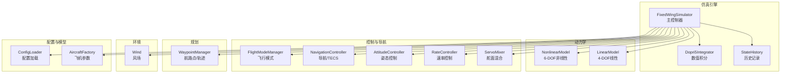
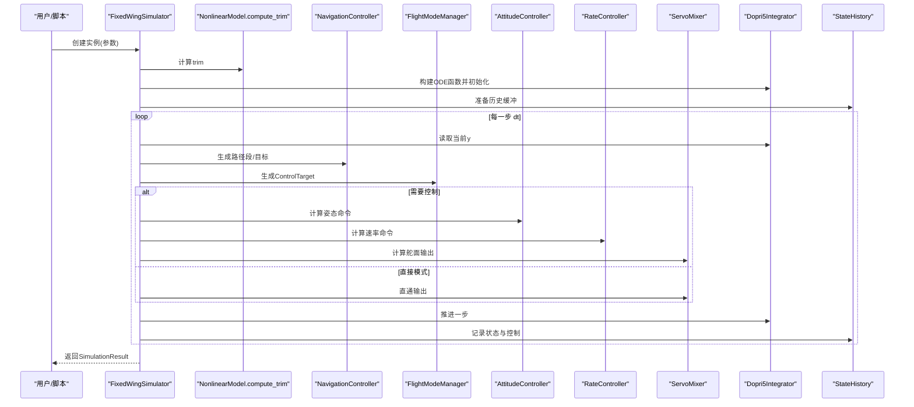
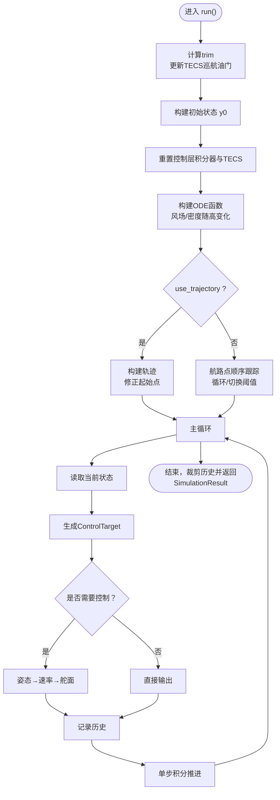
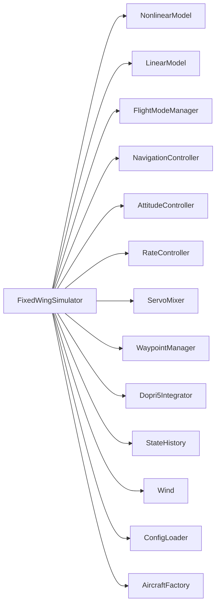

# 仿真主控制器

<cite>
**本文引用的文件**
- [src/simulation/simulator.py](file://src/simulation/simulator.py)
- [src/simulation/state_manager.py](file://src/simulation/state_manager.py)
- [src/simulation/integrator.py](file://src/simulation/integrator.py)
- [src/dynamics/linear_model.py](file://src/dynamics/linear_model.py)
- [src/dynamics/nonlinear_model.py](file://src/dynamics/nonlinear_model.py)
- [src/models/aircraft_factory.py](file://src/models/aircraft_factory.py)
- [src/utils/config_loader.py](file://src/utils/config_loader.py)
- [src/control/flight_mode_manager.py](file://src/control/flight_mode_manager.py)
- [src/planning/waypoint_manager.py](file://src/planning/waypoint_manager.py)
- [config/simulation.yaml](file://config/simulation.yaml)
- [config/control_params.yaml](file://config/control_params.yaml)
- [examples/example_1_linear_response.py](file://examples/example_1_linear_response.py)
- [examples/example_2_nonlinear_dynamics.py](file://examples/example_2_nonlinear_dynamics.py)
- [main.py](file://main.py)
</cite>

## 目录
1. [简介](#简介)
2. [项目结构](#项目结构)
3. [核心组件](#核心组件)
4. [架构总览](#架构总览)
5. [详细组件分析](#详细组件分析)
6. [依赖关系分析](#依赖关系分析)
7. [性能考虑](#性能考虑)
8. [故障排查指南](#故障排查指南)
9. [结论](#结论)
10. [附录](#附录)

## 简介
本文件面向FixedWingSimulator的仿真主控制器，系统化阐述其设计架构与核心功能，重点覆盖以下方面：
- 仿真初始化流程：从配置加载、飞机参数装配、环境风场设定到控制层与导航层的初始化
- 主仿真循环执行逻辑：从状态初始化、轨迹/航路点管理、控制链路计算到数值积分推进
- 仿真模式切换机制：飞行模式管理器对不同模式（如AUTO、FBW_B、STABILIZE等）的处理
- run()方法完整执行流程：从trim计算、初始状态构建、轨迹/航路点准备，到每步控制计算、历史记录与结果封装
- run_linear_analysis()方法：线性4-DOF开环分析的用途与应用场景
- step-by-step API：init_step()/step()的集成目的与使用方法
- 仿真参数配置：时间步长、仿真时长、初始模式、风场类型等参数的作用与设置建议
- 结果容器SimulationResult的使用与数据访问接口

## 项目结构
FixedWingSimulator采用模块化分层设计，核心位于src/simulation中，围绕FixedWingSimulator主控制器组织各子系统：
- models：飞机参数工厂与数据库
- dynamics：非线性6-DOF与线性4-DOF模型
- environment：风场与大气密度模型（在仿真中按需使用）
- control：飞行模式管理、导航控制器、姿态/速率控制器、舵面混合器、TECS等
- planning：航路点管理与轨迹生成（最小Snap/Jerk）
- simulation：仿真器、状态管理、数值积分器
- utils：配置加载、日志、数学工具
- visualization：绘图与动画（可选）

图表来源
- [src/simulation/simulator.py](file://src/simulation/simulator.py#L115-L642)
- [src/simulation/integrator.py](file://src/simulation/integrator.py#L17-L108)
- [src/simulation/state_manager.py](file://src/simulation/state_manager.py#L95-L193)
- [src/dynamics/nonlinear_model.py](file://src/dynamics/nonlinear_model.py#L104-L386)
- [src/dynamics/linear_model.py](file://src/dynamics/linear_model.py#L107-L319)
- [src/control/flight_mode_manager.py](file://src/control/flight_mode_manager.py#L115-L298)
- [src/planning/waypoint_manager.py](file://src/planning/waypoint_manager.py#L20-L208)
- [src/utils/config_loader.py](file://src/utils/config_loader.py#L59-L82)
- [src/models/aircraft_factory.py](file://src/models/aircraft_factory.py#L39-L136)

章节来源
- [src/simulation/simulator.py](file://src/simulation/simulator.py#L1-L642)
- [src/simulation/integrator.py](file://src/simulation/integrator.py#L1-L108)
- [src/simulation/state_manager.py](file://src/simulation/state_manager.py#L1-L193)
- [src/dynamics/nonlinear_model.py](file://src/dynamics/nonlinear_model.py#L1-L386)
- [src/dynamics/linear_model.py](file://src/dynamics/linear_model.py#L1-L319)
- [src/control/flight_mode_manager.py](file://src/control/flight_mode_manager.py#L1-L298)
- [src/planning/waypoint_manager.py](file://src/planning/waypoint_manager.py#L1-L208)
- [src/utils/config_loader.py](file://src/utils/config_loader.py#L1-L82)
- [src/models/aircraft_factory.py](file://src/models/aircraft_factory.py#L1-L136)

## 核心组件
- FixedWingSimulator：主控制器，负责组装各子系统、驱动主仿真循环、管理仿真模式与结果封装
- SimulationResult：仿真结果容器，封装StateHistory与trim信息，并提供摘要与可视化接口
- AircraftSimState/StateHistory：状态容器与高效历史缓冲区，支持导出字典与CSV
- Dopri5Integrator：基于DOP853的单步积分器，满足实时主循环需求
- NonlinearModel/LinearModel：6-DOF非线性与4-DOF线性模型，前者用于闭环仿真，后者用于线性分析
- FlightModeManager：飞行模式管理，统一输出ControlTarget供控制链使用
- WaypointManager：航路点管理与轨迹生成（Minimum Snap/Jerk），支持循环模式
- ConfigLoader/AircraftFactory：配置与飞机参数加载、合并与校验
- Wind：风场模型，支持无风、固定风、正弦风、随机正弦风

章节来源
- [src/simulation/simulator.py](file://src/simulation/simulator.py#L59-L114)
- [src/simulation/state_manager.py](file://src/simulation/state_manager.py#L16-L94)
- [src/simulation/integrator.py](file://src/simulation/integrator.py#L17-L71)
- [src/dynamics/nonlinear_model.py](file://src/dynamics/nonlinear_model.py#L104-L127)
- [src/dynamics/linear_model.py](file://src/dynamics/linear_model.py#L107-L139)
- [src/control/flight_mode_manager.py](file://src/control/flight_mode_manager.py#L115-L178)
- [src/planning/waypoint_manager.py](file://src/planning/waypoint_manager.py#L20-L62)
- [src/utils/config_loader.py](file://src/utils/config_loader.py#L59-L82)
- [src/models/aircraft_factory.py](file://src/models/aircraft_factory.py#L39-L75)

## 架构总览
FixedWingSimulator作为顶层编排者，负责：
- 初始化配置与飞机参数
- 构建控制层（导航/TECS、姿态、速率、舵面混合）
- 初始化轨迹/航路点管理
- 计算trim并构建初始状态
- 在主循环中：
  - 读取当前状态
  - 依据模式与目标生成ControlTarget
  - 通过控制链路计算舵面输出
  - 将控制量转换为动力学输入
  - 使用DOPRI5积分器推进一步
  - 记录历史
- 循环直至达到仿真时长，返回SimulationResult

图表来源
- [src/simulation/simulator.py](file://src/simulation/simulator.py#L239-L567)
- [src/dynamics/nonlinear_model.py](file://src/dynamics/nonlinear_model.py#L160-L255)
- [src/control/flight_mode_manager.py](file://src/control/flight_mode_manager.py#L173-L211)
- [src/simulation/integrator.py](file://src/simulation/integrator.py#L50-L71)
- [src/simulation/state_manager.py](file://src/simulation/state_manager.py#L124-L174)

## 详细组件分析

### FixedWingSimulator类与主仿真循环
- 初始化阶段
  - 配置目录解析与默认配置合并
  - 飞机参数加载与校验
  - 环境风场初始化
  - 控制参数（ArduPilot风格）加载与校验
  - 控制层初始化：导航/TECS、姿态、速率、舵面混合
  - 航路点/轨迹管理器初始化
  - 动力学模型（非线性6-DOF）初始化
- 主循环（run）
  - 计算trim并自动更新TECS巡航油门
  - 构建初始状态向量（基于trim）
  - 重置控制层积分器与TECS状态
  - 构建ODE函数（带风场与密度随高度变化）
  - 轨迹/航路点准备：
    - use_trajectory=True：构建或复用轨迹，确保起始点与实际初始位置一致
    - use_trajectory=False：简单航路点顺序跟踪，支持循环与切换距离阈值
  - 主循环：
    - 读取当前状态并转换为AircraftState
    - 计算ControlTarget（模式管理器）
    - 若需要控制：姿态→速率→舵面，否则直接输出
    - 将舵面输出转换为动力学输入（含trim偏置）
    - 记录历史
    - 单步积分推进
  - 收尾：裁剪历史数组，返回SimulationResult
- 线性分析（run_linear_analysis）
  - 基于LinearModel进行4-DOF开环脉冲响应分析
  - 默认脉冲与持续时间可自定义
- 步进API（init_step/step）
  - init_step：完成trim与ODE函数构建，返回初始状态
  - step：推进一步并返回新状态，适合外部UI/交互式集成

图表来源
- [src/simulation/simulator.py](file://src/simulation/simulator.py#L239-L567)
- [src/dynamics/nonlinear_model.py](file://src/dynamics/nonlinear_model.py#L160-L255)
- [src/simulation/integrator.py](file://src/simulation/integrator.py#L50-L71)
- [src/simulation/state_manager.py](file://src/simulation/state_manager.py#L124-L174)

章节来源
- [src/simulation/simulator.py](file://src/simulation/simulator.py#L130-L567)
- [src/dynamics/nonlinear_model.py](file://src/dynamics/nonlinear_model.py#L132-L255)
- [src/simulation/integrator.py](file://src/simulation/integrator.py#L17-L71)
- [src/simulation/state_manager.py](file://src/simulation/state_manager.py#L95-L174)

### SimulationResult：结果容器与数据访问
- 字段
  - history：StateHistory对象，包含完整仿真历史
  - trim：TrimResult，包含trim速度与角度
  - uav_name：飞机名称
  - closed_loop：是否为闭环运行
- 方法
  - summary()：生成简洁摘要字符串
  - visualize(show)：调用绘图与动画模块进行可视化（可选）
- 数据访问
  - history.to_dict()：导出完整历史字典
  - history.get(key)/history["key"]：按键访问数组
  - history.to_csv(path)：导出CSV文件

章节来源
- [src/simulation/simulator.py](file://src/simulation/simulator.py#L59-L114)
- [src/simulation/state_manager.py](file://src/simulation/state_manager.py#L176-L193)

### 飞行模式管理与控制链
- FlightModeManager
  - 支持模式：MANUAL、STABILIZE、FBW_A、FBW_B、AUTO、LOITER、RTH
  - update(state, nav_target, dt)：根据当前模式生成ControlTarget
  - 提供直接通道（is_direct）与参数化目标（airspeed/altitude）
- 控制链
  - NavigationController（TECS + L1）：生成航路点/高度/空速目标
  - AttitudeController：姿态角命令到速率命令
  - RateController：速率命令到舵面增量
  - ServoMixer：将控制量映射到舵面输出并叠加trim偏置

章节来源
- [src/control/flight_mode_manager.py](file://src/control/flight_mode_manager.py#L115-L298)
- [src/simulation/simulator.py](file://src/simulation/simulator.py#L190-L216)

### 航路点与轨迹
- WaypointManager
  - 添加/清空/保存/加载航路点
  - 支持Minimum Snap与Minimum Jerk轨迹
  - 提供活动航段查询与期望状态
- 使用建议
  - run()前必须显式添加航路点或加载轨迹配置
  - 单航路点时可合成虚拟航段以启用TECS高度保持

章节来源
- [src/planning/waypoint_manager.py](file://src/planning/waypoint_manager.py#L20-L208)
- [src/simulation/simulator.py](file://src/simulation/simulator.py#L376-L408)

### 数值积分器
- Dopri5Integrator
  - 基于DOP853（dopri5）的单步积分器，支持自适应步长
  - 提供step(dt)推进与y/t属性访问
- RK45Integrator
  - 批处理solve_ivp（RK45），用于线性/离线分析

章节来源
- [src/simulation/integrator.py](file://src/simulation/integrator.py#L17-L108)

### 线性分析（run_linear_analysis）
- 作用
  - 基于LinearModel构建4-DOF纵向线性模型
  - 对给定脉冲（如升降舵阶跃）进行开环时域仿真
  - 输出模态分析（短周期、长周期、阻尼比等）
- 应用场景
  - 飞行包线与稳定性评估
  - 控制律设计与参数调节的参考
  - 与闭环仿真对比验证

章节来源
- [src/simulation/simulator.py](file://src/simulation/simulator.py#L571-L596)
- [src/dynamics/linear_model.py](file://src/dynamics/linear_model.py#L107-L319)

### 步进API（init_step/step）
- init_step()
  - 计算trim并构建ODE函数
  - 返回初始AircraftSimState
- step(dt=None)
  - 推进一步并返回新状态
  - 适用于外部UI/交互式控制
- 注意
  - 必须先调用init_step()再调用step()

章节来源
- [src/simulation/simulator.py](file://src/simulation/simulator.py#L602-L642)

## 依赖关系分析
- 组件耦合
  - FixedWingSimulator对各子系统有强依赖，但通过清晰接口解耦
  - 控制链与模式管理器相互协作，通过ControlTarget传递目标
  - 轨迹与航路点管理器与导航控制器配合
- 外部依赖
  - NumPy用于数值计算
  - SciPy用于积分求解
  - YAML用于配置加载
- 潜在风险
  - 风场/密度模型与动力学耦合需注意数值稳定性
  - TECS与航路点切换的时序可能影响瞬态响应

图表来源
- [src/simulation/simulator.py](file://src/simulation/simulator.py#L33-L51)
- [src/simulation/state_manager.py](file://src/simulation/state_manager.py#L95-L115)
- [src/simulation/integrator.py](file://src/simulation/integrator.py#L17-L47)

章节来源
- [src/simulation/simulator.py](file://src/simulation/simulator.py#L33-L51)

## 性能考虑
- 时间步长与积分器
  - dt越小精度越高但计算量越大；默认0.01s平衡了实时性与精度
  - DOPRI5自适应步长在保证精度的同时提升效率
- 内存与历史记录
  - StateHistory预分配数组，避免频繁扩容
  - 运行结束后trim裁剪尾部未使用空间
- 控制层积分器
  - 各控制回路在初始化时重置，有助于稳定起步
- 风场与密度
  - 密度随高度变化计算增加少量开销，建议在需要真实环境时开启

## 故障排查指南
- 积分失败
  - 症状：抛出RuntimeError并打印错误信息
  - 排查：检查初始条件、控制输入是否过大、风场/密度模型是否异常
- 风场/密度不一致
  - 症状：仿真发散或异常抖动
  - 排查：确认风场类型与方向、密度模型参数
- 航路点不足
  - 症状：轨迹构建报错或行为异常
  - 排查：至少提供两个航路点；单点时由内部合成虚拟航段
- 模式切换抖动
  - 症状：航路点切换导致瞬态过大致使轨迹偏差
  - 排查：调整wp_switch_dist与循环模式参数

章节来源
- [src/simulation/simulator.py](file://src/simulation/simulator.py#L558-L562)
- [src/planning/waypoint_manager.py](file://src/planning/waypoint_manager.py#L139-L140)

## 结论
FixedWingSimulator以模块化架构实现了从配置加载到闭环仿真的完整流水线，具备：
- 清晰的主循环与控制链路
- 完整的飞行模式与航路点/轨迹管理
- 线性与时域分析能力
- 高效的历史记录与结果封装
在工程实践中，建议结合示例脚本与配置文件进行参数调试，逐步扩展到复杂任务（如编队、避障、多机协同）。

## 附录

### 仿真参数配置选项详解
- 时间步长（dt）
  - 作用：仿真主循环步长，决定实时性与精度
  - 设置建议：默认0.01s；若追求更高精度可减小，但需权衡性能
  - 来源：simulation.yaml与构造函数参数
- 仿真时长（duration）
  - 作用：总仿真时长
  - 设置建议：根据任务需求与资源限制设定
- 初始模式（initial_mode）
  - 作用：启动时的飞行模式
  - 可选：MANUAL、STABILIZE、FBW_A、FBW_B、AUTO、LOITER、RTH
- 风场类型（wind_type）
  - 作用：风场模型类型
  - 可选：NONE、FIXED、SINE、RANDOMSINE
- 轨迹类型（traj_type）
  - 作用：轨迹生成算法
  - 可选：minimum_snap、minimum_jerk
- 控制参数（control_params.yaml）
  - 包括：空速、滚转/俯仰/偏航PID参数、TECS参数、限幅等
  - 建议：结合具体机型与任务调整，避免过大增益导致振荡

章节来源
- [config/simulation.yaml](file://config/simulation.yaml#L3-L29)
- [config/control_params.yaml](file://config/control_params.yaml#L1-L45)
- [src/simulation/simulator.py](file://src/simulation/simulator.py#L130-L146)

### 使用示例与最佳实践
- 示例脚本
  - 线性分析与闭环对比：example_1_linear_response.py
  - 非线性6-DOF与闭环对比：example_2_nonlinear_dynamics.py
- 命令行入口
  - main.py提供便捷的命令行接口，支持分析模式与可视化开关

章节来源
- [examples/example_1_linear_response.py](file://examples/example_1_linear_response.py#L1-L206)
- [examples/example_2_nonlinear_dynamics.py](file://examples/example_2_nonlinear_dynamics.py#L1-L215)
- [main.py](file://main.py#L32-L145)