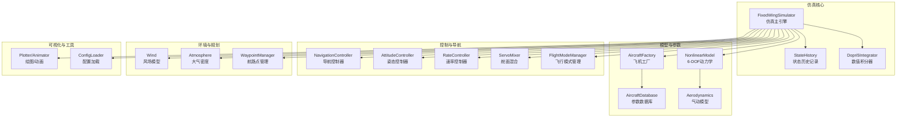
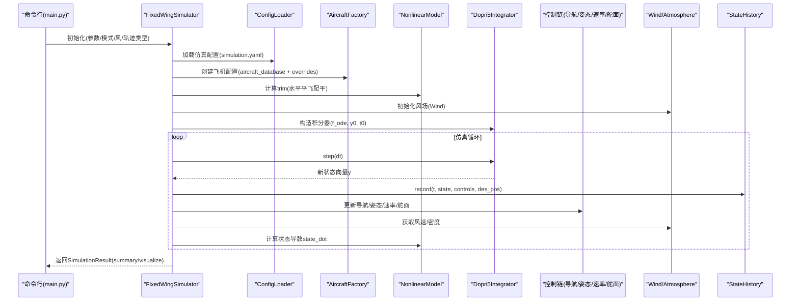
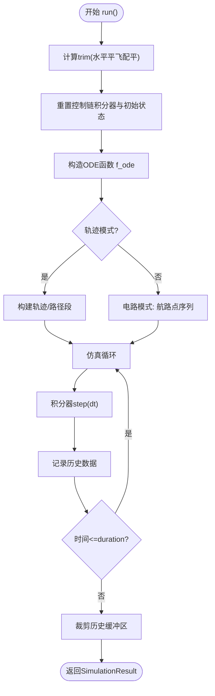
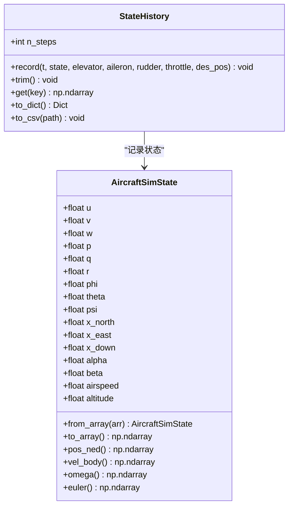
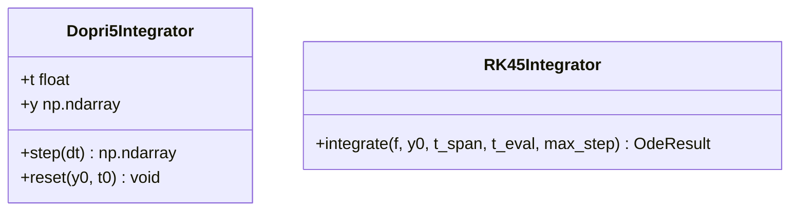
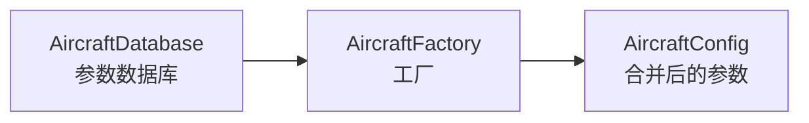
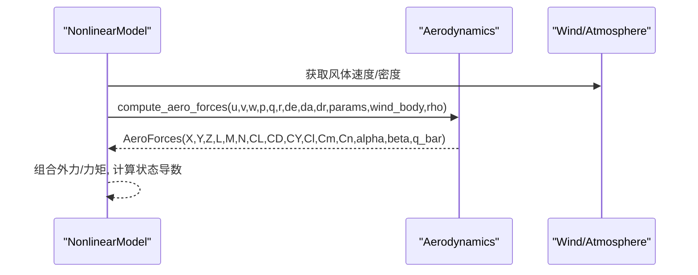
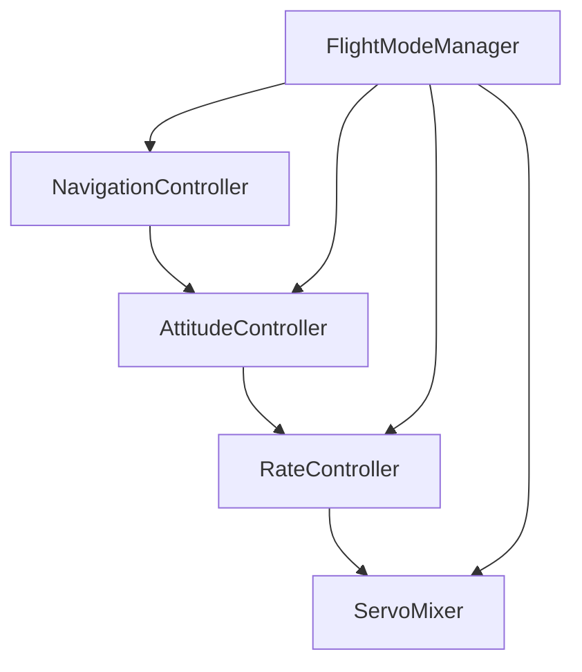
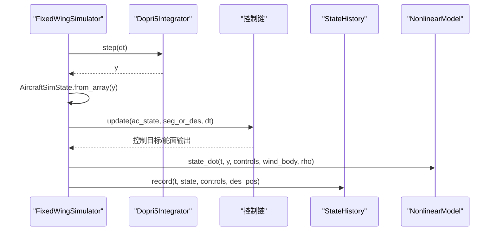
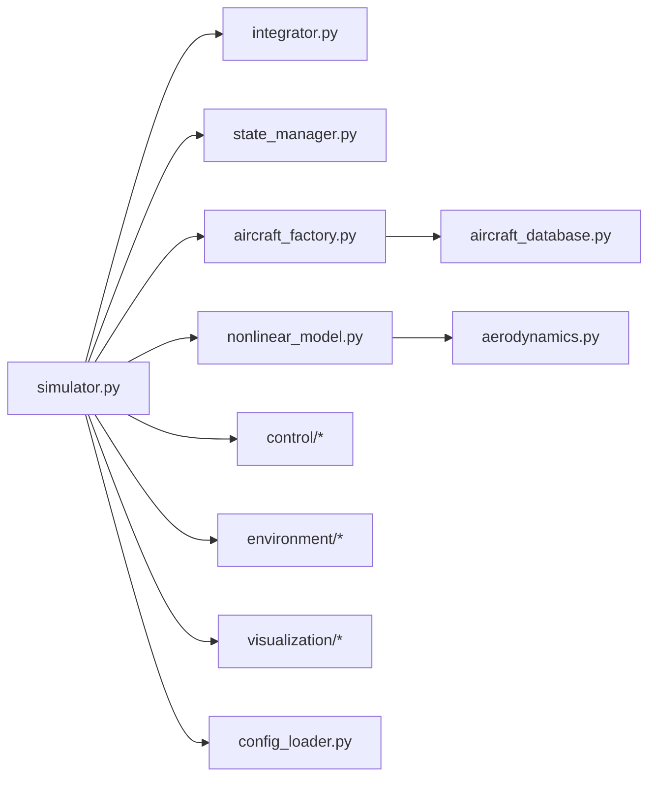

# 仿真引擎

<cite>
**本文引用的文件列表**
- [src/simulation/simulator.py](file://src/simulation/simulator.py)
- [src/simulation/state_manager.py](file://src/simulation/state_manager.py)
- [src/simulation/integrator.py](file://src/simulation/integrator.py)
- [src/models/aircraft_factory.py](file://src/models/aircraft_factory.py)
- [src/models/aircraft_database.py](file://src/models/aircraft_database.py)
- [src/dynamics/nonlinear_model.py](file://src/dynamics/nonlinear_model.py)
- [src/dynamics/aerodynamics.py](file://src/dynamics/aerodynamics.py)
- [src/utils/config_loader.py](file://src/utils/config_loader.py)
- [config/simulation.yaml](file://config/simulation.yaml)
- [config/control_params.yaml](file://config/control_params.yaml)
- [main.py](file://main.py)
- [examples/example_1_linear_response.py](file://examples/example_1_linear_response.py)
- [examples/example_2_nonlinear_dynamics.py](file://examples/example_2_nonlinear_dynamics.py)
</cite>

## 目录
1. [简介](#简介)
2. [项目结构](#项目结构)
3. [核心组件](#核心组件)
4. [架构总览](#架构总览)
5. [详细组件分析](#详细组件分析)
6. [依赖关系分析](#依赖关系分析)
7. [性能考量](#性能考量)
8. [故障排查指南](#故障排查指南)
9. [结论](#结论)
10. [附录：仿真参数与配置](#附录仿真参数与配置)

## 简介
本技术文档围绕 FixedWingSimulator 的仿真引擎展开，系统阐述 Simulator 类的设计架构与核心功能，覆盖仿真初始化、时间步进、状态管理、数值积分器、控制链路、环境建模与轨迹规划等模块。文档重点解释：
- 状态管理器如何跟踪与存储仿真过程中的全部状态信息（位置、速度、姿态、控制输入等）。
- 数值积分器的实现原理与选择（Dopri5 与 RK45），以及在实时闭环与离线分析中的不同应用。
- 仿真循环的执行流程，从初始状态计算、控制目标生成、控制律计算到状态推进与历史记录。
- 仿真参数配置项（时间步长、仿真时长、积分精度、风场、飞行模式等）。
- 性能优化建议与调试技巧，帮助用户在保证精度的前提下提升仿真效率与稳定性。

## 项目结构
项目采用模块化组织，按领域划分仿真子系统：
- simulation：仿真主引擎、状态管理、数值积分器
- models：飞机参数数据库与工厂
- dynamics：非线性6-DOF动力学、气动模型
- control：ArduPilot兼容控制链（导航、姿态、速率、舵面混合、TECS）
- environment：风场与大气密度模型
- planning：轨迹规划（最小加加速度/加速度/摇摆等）
- visualization：绘图与动画
- utils：配置加载、数学工具、日志
- config：仿真、控制、轨迹、飞机参数配置
- examples：使用示例脚本
- main.py：命令行入口

图表来源
- [src/simulation/simulator.py](file://src/simulation/simulator.py#L115-L642)
- [src/simulation/state_manager.py](file://src/simulation/state_manager.py#L95-L193)
- [src/simulation/integrator.py](file://src/simulation/integrator.py#L17-L108)
- [src/models/aircraft_factory.py](file://src/models/aircraft_factory.py#L39-L136)
- [src/models/aircraft_database.py](file://src/models/aircraft_database.py#L29-L183)
- [src/dynamics/nonlinear_model.py](file://src/dynamics/nonlinear_model.py#L104-L200)
- [src/dynamics/aerodynamics.py](file://src/dynamics/aerodynamics.py#L35-L148)
- [src/utils/config_loader.py](file://src/utils/config_loader.py#L59-L82)

章节来源
- [src/simulation/simulator.py](file://src/simulation/simulator.py#L1-L642)
- [src/simulation/state_manager.py](file://src/simulation/state_manager.py#L1-L193)
- [src/simulation/integrator.py](file://src/simulation/integrator.py#L1-L108)
- [src/models/aircraft_factory.py](file://src/models/aircraft_factory.py#L1-L136)
- [src/models/aircraft_database.py](file://src/models/aircraft_database.py#L1-L183)
- [src/dynamics/nonlinear_model.py](file://src/dynamics/nonlinear_model.py#L1-L200)
- [src/dynamics/aerodynamics.py](file://src/dynamics/aerodynamics.py#L1-L148)
- [src/utils/config_loader.py](file://src/utils/config_loader.py#L1-L82)

## 核心组件
- 固定翼仿真主引擎 FixedWingSimulator：负责装配各子系统、构建闭环控制链、推进仿真循环、记录历史数据与返回结果。
- 状态管理 StateHistory：高效预分配数组，记录仿真全过程的状态与控制输入，并支持导出 CSV。
- 数值积分器 Dopri5Integrator：基于 scipy 的自适应步长 Dormand-Prince 4(5) 方法，提供单步推进能力，适合实时闭环仿真。
- 飞机参数系统：AircraftFactory 与 AircraftDatabase 提供参数合并与校验，确保仿真输入一致性。
- 动力学与气动：NonlinearModel 提供6-DOF状态导数；compute_aero_forces 计算气动力与力矩。
- 控制链：NavigationController、AttitudeController、RateController、ServoMixer、FlightModeManager 构成ArduPilot兼容的五层控制链。
- 环境与规划：Wind、Atmosphere、WaypointManager 提供风场、密度与轨迹规划。

章节来源
- [src/simulation/simulator.py](file://src/simulation/simulator.py#L115-L642)
- [src/simulation/state_manager.py](file://src/simulation/state_manager.py#L95-L193)
- [src/simulation/integrator.py](file://src/simulation/integrator.py#L17-L108)
- [src/models/aircraft_factory.py](file://src/models/aircraft_factory.py#L39-L136)
- [src/models/aircraft_database.py](file://src/models/aircraft_database.py#L143-L183)
- [src/dynamics/nonlinear_model.py](file://src/dynamics/nonlinear_model.py#L104-L200)
- [src/dynamics/aerodynamics.py](file://src/dynamics/aerodynamics.py#L35-L148)

## 架构总览
仿真引擎以 FixedWingSimulator 为核心，串联参数、环境、控制、规划与动力学模块。运行时序如下：

图表来源
- [main.py](file://main.py#L98-L145)
- [src/simulation/simulator.py](file://src/simulation/simulator.py#L239-L567)
- [src/simulation/integrator.py](file://src/simulation/integrator.py#L50-L71)
- [src/simulation/state_manager.py](file://src/simulation/state_manager.py#L124-L174)
- [src/dynamics/nonlinear_model.py](file://src/dynamics/nonlinear_model.py#L160-L182)
- [src/utils/config_loader.py](file://src/utils/config_loader.py#L75-L77)

## 详细组件分析

### Simulator 类设计与仿真流程
- 初始化阶段
  - 读取配置目录与仿真配置（时间步长、持续时间、积分器、风场、初始模式等）。
  - 创建飞机配置（AircraftFactory + AircraftDatabase），合并 YAML 覆盖项。
  - 初始化风场、控制参数（ArduPilot兼容）、飞行模式管理器、导航/姿态/速率/舵面控制器、航路点管理器。
  - 计算 trim（水平平飞配平），用于初始状态与TECS巡航油门自动校准。
- 仿真循环
  - 构造 ODE 函数 f_ode，将控制输入封装为可变对象，以便在每次步进时更新。
  - 根据是否启用轨迹或电路模式，准备目标路径段与切换逻辑。
  - 在每个时间步：
    - 读取当前状态，转换为 AircraftState 供控制链使用。
    - 计算控制目标（导航/模式管理），通过控制链生成舵面输出。
    - 将舵面输出转换为实际控制增量（考虑配平偏置），推进积分器。
    - 记录历史数据（状态、控制输入、期望位置）。
  - 循环结束时裁剪未使用的缓冲区并返回 SimulationResult。
- 结果输出
  - 提供 summary 与 visualize（绘图/动画）方法，便于快速评估仿真结果。

图表来源
- [src/simulation/simulator.py](file://src/simulation/simulator.py#L239-L567)
- [src/simulation/state_manager.py](file://src/simulation/state_manager.py#L170-L174)

章节来源
- [src/simulation/simulator.py](file://src/simulation/simulator.py#L115-L642)

### 状态管理器：AircraftSimState 与 StateHistory
- AircraftSimState
  - 定义12维状态向量（u, v, w, p, q, r, φ, θ, ψ, x_N, x_E, x_D），并派生空速、攻角、侧滑角、海拔等。
  - 提供 from_array / to_array 与常用属性访问器（位置、速度、角速度、欧拉角）。
- StateHistory
  - 预分配固定长度数组，记录时间戳、状态、控制输入与期望位置。
  - 支持 trim() 裁剪尾部未用空间，to_dict()/to_csv() 导出数据。

图表来源
- [src/simulation/state_manager.py](file://src/simulation/state_manager.py#L16-L93)
- [src/simulation/state_manager.py](file://src/simulation/state_manager.py#L95-L193)

章节来源
- [src/simulation/state_manager.py](file://src/simulation/state_manager.py#L1-L193)

### 数值积分器：Dopri5 与 RK45
- Dopri5Integrator
  - 基于 scipy.integrate.ode 的 dopri5 方案，支持自适应步长与单步推进接口。
  - 提供 step(dt)、t/y 属性与 reset(y0, t0)。
- RK45Integrator
  - 基于 scipy.integrate.solve_ivp 的批处理求解器，适用于离线分析与批量轨迹求解。

图表来源
- [src/simulation/integrator.py](file://src/simulation/integrator.py#L17-L108)

章节来源
- [src/simulation/integrator.py](file://src/simulation/integrator.py#L1-L108)

### 飞机参数系统：AircraftFactory 与 AircraftDatabase
- AircraftDatabase 提供标准飞机参数集（TB2、Predator 等），注入派生参数（U0、ρ、q_bar）。
- AircraftFactory 合并数据库参数与 YAML/字典覆盖项，生成统一的 AircraftConfig。

图表来源
- [src/models/aircraft_database.py](file://src/models/aircraft_database.py#L143-L166)
- [src/models/aircraft_factory.py](file://src/models/aircraft_factory.py#L42-L74)

章节来源
- [src/models/aircraft_database.py](file://src/models/aircraft_database.py#L1-L183)
- [src/models/aircraft_factory.py](file://src/models/aircraft_factory.py#L1-L136)

### 动力学与气动：NonlinearModel 与 Aerodynamics
- NonlinearModel
  - compute_trim()：求解水平平飞配平（α_trim, δe_trim）。
  - state_dot()：计算12维状态导数，调用 aerodynamics.compute_aero_forces。
- Aerodynamics
  - compute_aero_forces()：根据速度、角速率、控制面偏角与风场计算气动力与力矩，支持无风/有风场景。

图表来源
- [src/dynamics/nonlinear_model.py](file://src/dynamics/nonlinear_model.py#L160-L182)
- [src/dynamics/aerodynamics.py](file://src/dynamics/aerodynamics.py#L35-L148)

章节来源
- [src/dynamics/nonlinear_model.py](file://src/dynamics/nonlinear_model.py#L104-L200)
- [src/dynamics/aerodynamics.py](file://src/dynamics/aerodynamics.py#L1-L148)

### 控制链：导航、姿态、速率与舵面混合
- NavigationController：基于 L1 规律与 TECS 的高度/速度/能量控制，支持路径段跟踪与航路点序列。
- AttitudeController：姿态角/角速率控制，生成速率指令。
- RateController：角速率控制，生成舵面指令。
- ServoMixer：将速率指令映射为舵面偏角与油门，考虑配平偏置与限幅。
- FlightModeManager：根据飞行模式（AUTO/STABILIZE/FBW等）切换控制目标与直接输入。

图表来源
- [src/simulation/simulator.py](file://src/simulation/simulator.py#L190-L216)
- [src/simulation/simulator.py](file://src/simulation/simulator.py#L499-L528)

章节来源
- [src/simulation/simulator.py](file://src/simulation/simulator.py#L174-L216)

### 仿真循环执行流程（代码级）
以下序列图展示 run() 中一次完整时间步的调用链与数据流：

图表来源
- [src/simulation/simulator.py](file://src/simulation/simulator.py#L411-L567)
- [src/simulation/integrator.py](file://src/simulation/integrator.py#L50-L56)
- [src/simulation/state_manager.py](file://src/simulation/state_manager.py#L124-L168)
- [src/dynamics/nonlinear_model.py](file://src/dynamics/nonlinear_model.py#L160-L182)

## 依赖关系分析
- 模块耦合
  - Simulator 作为编排者，依赖 ConfigLoader、AircraftFactory、NonlinearModel、Wind、Atmosphere、WaypointManager、控制链与可视化模块。
  - NonlinearModel 依赖 Aerodynamics 与数学工具；Aerodynamics 依赖数学工具计算攻角/侧滑角与动压。
  - 控制链内部相互依赖，但对外仅暴露 update 接口。
- 外部依赖
  - scipy.integrate（ode/solve_ivp）、numpy、matplotlib（可视化）、yaml（配置）。
- 潜在循环依赖
  - 通过模块导入顺序与接口抽象避免循环依赖；例如 Simulator 仅通过接口与控制链交互。

图表来源
- [src/simulation/simulator.py](file://src/simulation/simulator.py#L33-L51)
- [src/dynamics/nonlinear_model.py](file://src/dynamics/nonlinear_model.py#L27-L28)
- [src/dynamics/aerodynamics.py](file://src/dynamics/aerodynamics.py#L13-L13)

章节来源
- [src/simulation/simulator.py](file://src/simulation/simulator.py#L1-L642)
- [src/dynamics/nonlinear_model.py](file://src/dynamics/nonlinear_model.py#L1-L200)
- [src/dynamics/aerodynamics.py](file://src/dynamics/aerodynamics.py#L1-L148)

## 性能考量
- 积分器选择
  - 实时闭环仿真推荐使用 Dopri5（自适应步长 + 单步推进），保证稳定与可控的步进。
  - 离线分析与批量轨迹求解可使用 RK45（solve_ivp），便于一次性获取完整历史。
- 时间步长与容差
  - dt 与 rtol/atol 影响精度与速度，建议在满足精度前提下适当增大 dt 以提高效率。
- 状态记录开销
  - StateHistory 使用预分配数组，记录频率应与可视化/保存需求平衡。
- 控制链计算
  - 控制器中存在积分器与限幅，注意避免高频抖动；可通过参数调节抑制振荡。
- 风场与密度
  - 风场与密度随高度变化，建议在长时间仿真中合理采样或缓存。

[本节为通用指导，无需特定文件来源]

## 故障排查指南
- 积分失败
  - 症状：抛出 RuntimeError 或提示积分失败。
  - 排查：检查控制输入是否过大导致非物理响应；调整 dt 或 rtol/atol；确认风场与密度设置。
  - 参考：Dopri5Integrator.step() 的错误处理。
- 配平不稳
  - 症状：起飞阶段出现大幅姿态扰动。
  - 排查：确认 trim 计算正确；检查 TECS 初始高度/空速与初始状态一致；必要时手动微调 cruise throttle。
- 风场异常
  - 症状：仿真结果与预期不符。
  - 排查：核对 wind_type、wind_speed、wind_direction_deg；确认 NED/ENU 坐标约定。
- 配置缺失
  - 症状：控制参数未生效或默认值覆盖。
  - 排查：确认 control_params.yaml 存在且键名正确；使用 ConfigLoader 加载优先级。

章节来源
- [src/simulation/integrator.py](file://src/simulation/integrator.py#L54-L55)
- [src/simulation/simulator.py](file://src/simulation/simulator.py#L295-L299)
- [config/simulation.yaml](file://config/simulation.yaml#L22-L25)
- [src/utils/config_loader.py](file://src/utils/config_loader.py#L75-L77)

## 结论
FixedWingSimulator 的仿真引擎以模块化设计实现了从参数、环境、控制到动力学的完整闭环仿真。通过 AircraftSimState 与 StateHistory 的高效状态管理、Dopri5/RK45 的灵活数值积分、ArduPilot 兼容的控制链与轨迹规划，用户可在保证精度的同时进行高效率的仿真与分析。建议在工程实践中结合具体任务选择合适的积分器与参数，并利用示例脚本与命令行入口快速验证与调试。

[本节为总结，无需特定文件来源]

## 附录：仿真参数与配置
- 仿真配置（simulation.yaml）
  - dt：仿真时间步长（秒）
  - duration：总仿真时长（秒）
  - integrator：积分器类型（dopri5/rk45）
  - rtol/atol：相对/绝对容差
  - initial_position：初始位置（NED）
  - initial_heading_deg：初始航向（度）
  - initial_mode：初始飞行模式（AUTO/STABILIZE/FBW等）
  - wind_type/wind_speed/wind_direction_deg：风场类型与参数
  - log_enabled/log_dir：日志开关与目录
- 控制参数（control_params.yaml）
  - ALT_HOLD_RTL、AIRSPEED_CRUISE、AIRSPEED_MIN/MAX
  - NAVL1_PERIOD/NAVL1_DAMPING、LIM_ROLL_DEG
  - PTCH/ROLL/YAW_RATE PID 参数
  - TECS 各项参数（爬升/下沉最大速率、时间常数、阻尼、积分增益、坡度转油门补偿、油门上下限等）
- 命令行入口（main.py）
  - 支持指定飞机、模式、时长、步长、风场、轨迹类型、分析模式（4DOF/6DOF）、禁用可视化等。

章节来源
- [config/simulation.yaml](file://config/simulation.yaml#L1-L30)
- [config/control_params.yaml](file://config/control_params.yaml#L1-L45)
- [src/utils/config_loader.py](file://src/utils/config_loader.py#L59-L82)
- [main.py](file://main.py#L32-L95)