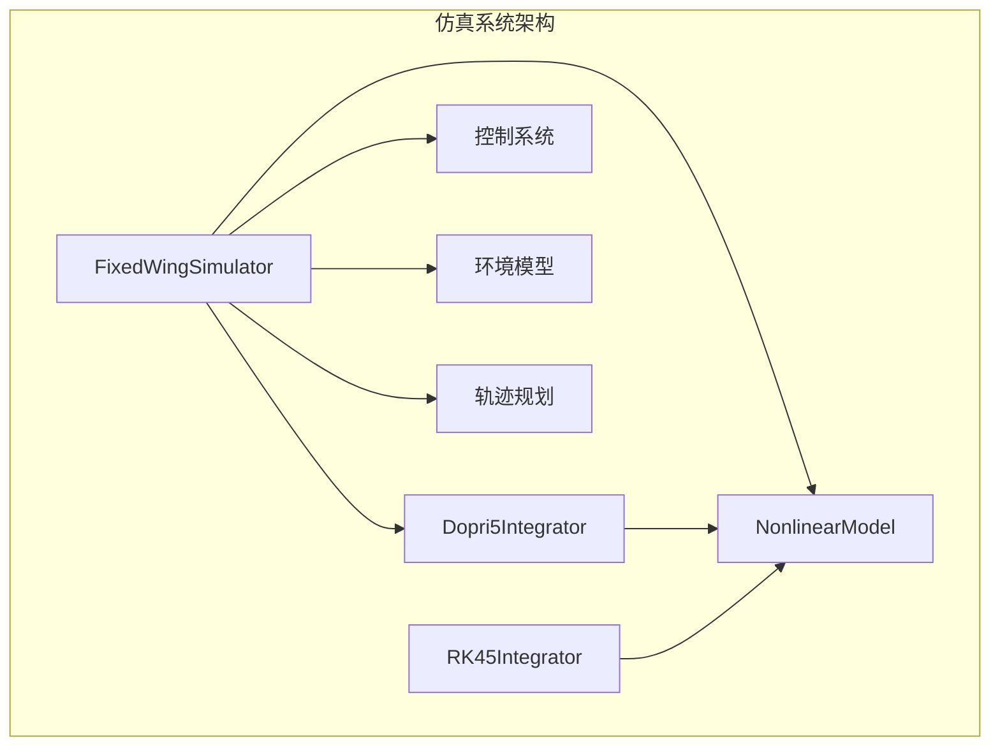
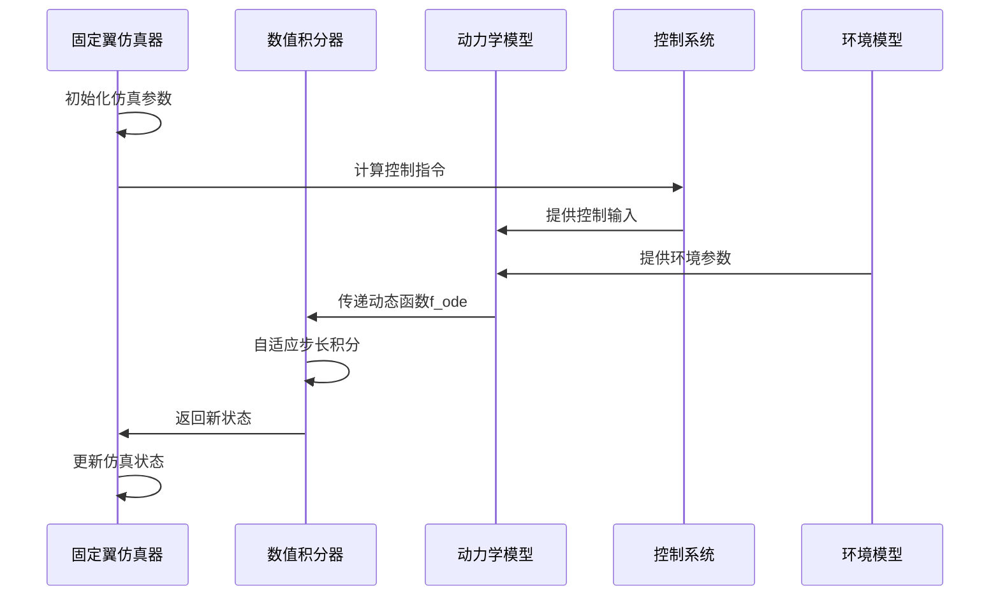
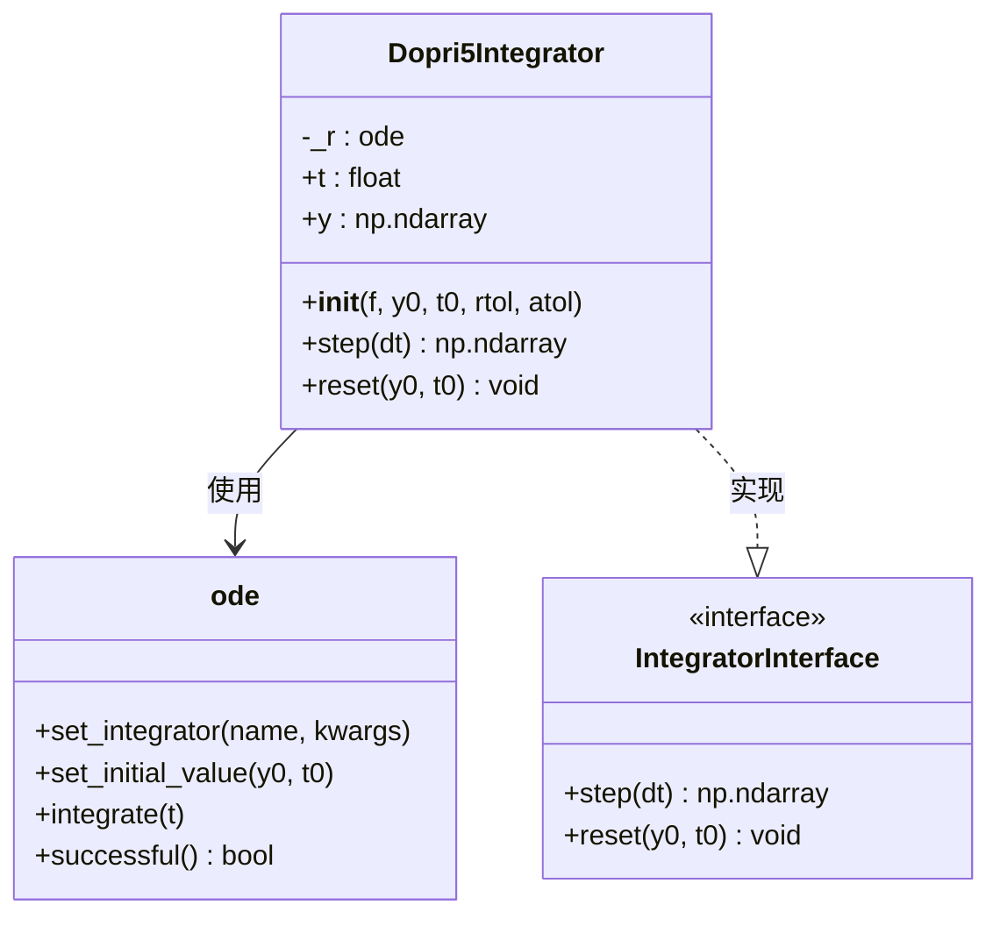
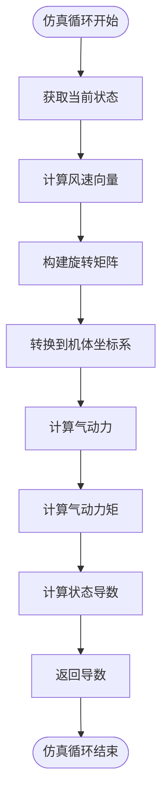
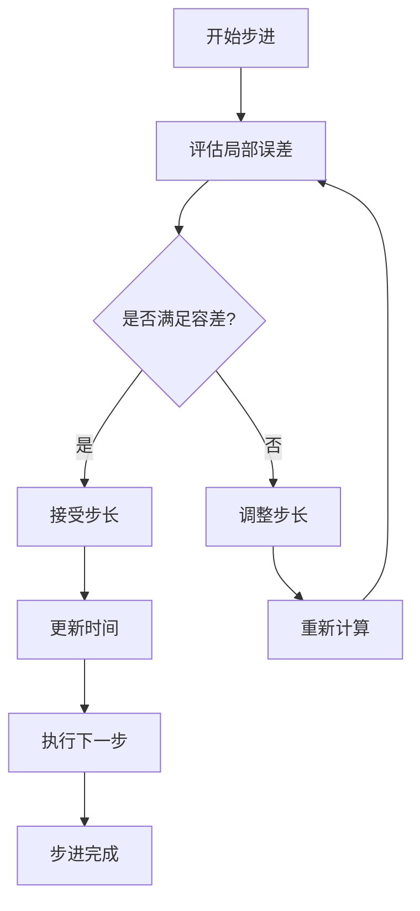
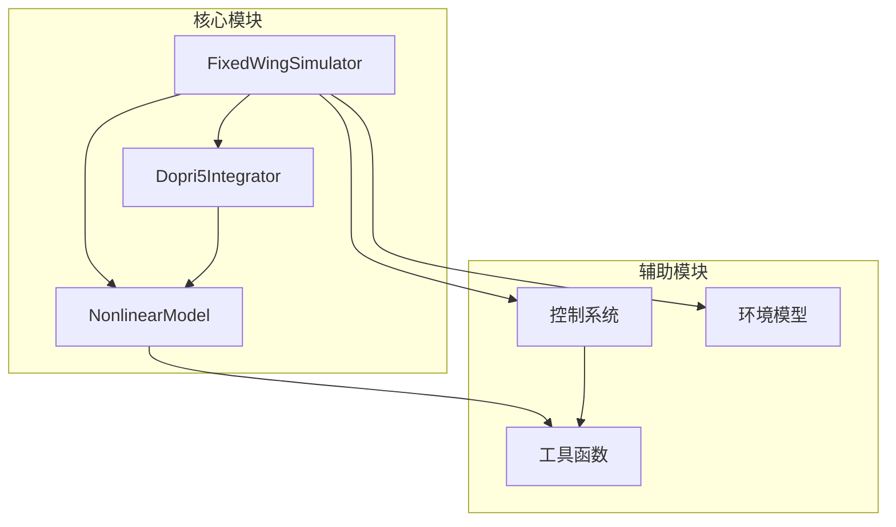
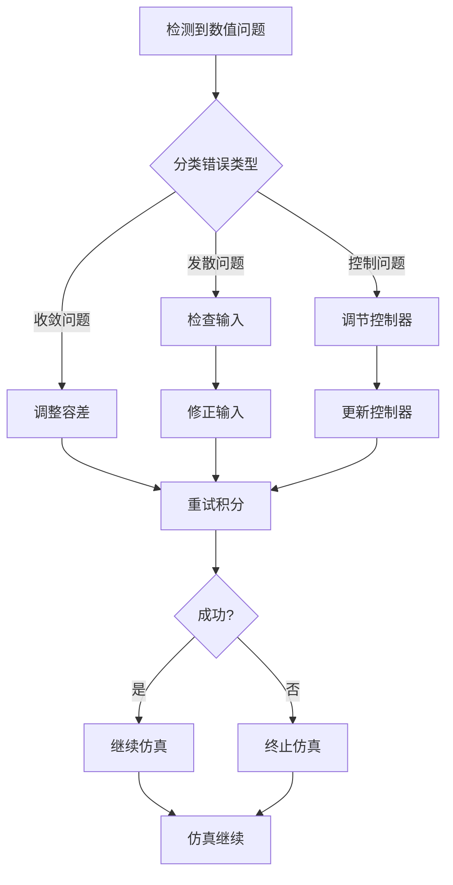

# 数值积分器

<cite>
**本文档引用的文件**
- [integrator.py](file://src/simulation/integrator.py)
- [simulator.py](file://src/simulation/simulator.py)
- [nonlinear_model.py](file://src/dynamics/nonlinear_model.py)
- [test_integration.py](file://tests/test_integration.py)
- [simulation.yaml](file://config/simulation.yaml)
- [config_loader.py](file://src/utils/config_loader.py)
- [example_1_linear_response.py](file://examples/example_1_linear_response.py)
- [example_2_nonlinear_dynamics.py](file://examples/example_2_nonlinear_dynamics.py)
</cite>

## 目录
1. [简介](#简介)
2. [项目结构](#项目结构)
3. [核心组件](#核心组件)
4. [架构概览](#架构概览)
5. [详细组件分析](#详细组件分析)
6. [依赖关系分析](#依赖关系分析)
7. [性能考虑](#性能考虑)
8. [故障排除指南](#故障排除指南)
9. [结论](#结论)

## 简介

FixedWingSimulator项目中的数值积分器是整个仿真系统的核心组件之一，负责求解固定翼飞机的动力学微分方程。本文档深入分析Dopri5Integrator类的实现原理、使用方法以及与动力学模型的集成方式，特别关注龙格-库塔5阶积分算法的数学原理和数值稳定性考虑。

该积分器基于SciPy的dopri5求解器，提供了实时步进式积分能力，支持自适应步长控制，同时保持单步API的简洁性。这种设计使得仿真系统能够在实时控制循环中高效运行，同时保证数值精度。

## 项目结构

FixedWingSimulator采用模块化架构，数值积分器位于simulation子系统中，与动力学模型、控制系统、环境模型等模块协同工作：

**图表来源**
- [simulator.py](file://src/simulation/simulator.py#L115-L642)
- [integrator.py](file://src/simulation/integrator.py#L17-L108)

**章节来源**
- [simulator.py](file://src/simulation/simulator.py#L1-L642)
- [integrator.py](file://src/simulation/integrator.py#L1-L108)

## 核心组件

### Dopri5Integrator类

Dopri5Integrator是本项目中最关键的数值积分器，基于SciPy的dopri5求解器实现了龙格-库塔4(5)积分算法。该类提供了以下核心功能：

- **实时步进式积分**：支持按固定时间步长推进仿真
- **自适应步长控制**：根据相对和绝对容差自动调整步长
- **错误检测机制**：提供完整的数值稳定性检查
- **状态管理**：维护当前时间和状态向量

### RK45Integrator类

作为批处理模式的替代选择，RK45Integrator使用solve_ivp进行离线分析，适用于需要完整时间历史数据的场景。

**章节来源**
- [integrator.py](file://src/simulation/integrator.py#L17-L108)

## 架构概览

数值积分器在整个仿真系统中的作用至关重要，它连接了动力学模型和控制系统：

**图表来源**
- [simulator.py](file://src/simulation/simulator.py#L329-L338)
- [simulator.py](file://src/simulation/simulator.py#L558-L562)

**章节来源**
- [simulator.py](file://src/simulation/simulator.py#L329-L338)
- [simulator.py](file://src/simulation/simulator.py#L558-L562)

## 详细组件分析

### Dopri5Integrator实现原理

#### 数学基础

Dopri5Integrator基于经典的Dormand-Prince 4(5)阶Runge-Kutta方法，这是一种自适应步长的多阶段积分算法。其数学原理包括：

1. **四阶和五阶公式**：同时提供四阶和五阶精度估计
2. **局部截断误差估计**：通过比较四阶和五阶结果估计误差
3. **步长自适应调整**：根据误差估计动态调整步长大小

#### 关键实现特性

**图表来源**
- [integrator.py](file://src/simulation/integrator.py#L17-L71)

#### 参数配置

Dopri5Integrator的关键配置参数：

| 参数 | 类型 | 默认值 | 描述 |
|------|------|--------|------|
| f | Callable | 必需 | 动态函数 f(t, y) → dy/dt |
| y0 | ndarray | 必需 | 初始状态向量 |
| t0 | float | 0.0 | 初始时间 |
| rtol | float | 1e-6 | 相对容差 |
| atol | float | 1e-6 | 绝对容差 |

**章节来源**
- [integrator.py](file://src/simulation/integrator.py#L33-L47)

### 与动力学模型的集成

#### 动态函数f_ode的设计

在FixedWingSimulator中，Dopri5Integrator通过动态函数f_ode接收控制输入和环境参数：

**图表来源**
- [simulator.py](file://src/simulation/simulator.py#L329-L338)

#### 状态向量定义

固定翼飞机的12维状态向量（NED坐标系）：

| 状态变量 | 描述 | 单位 |
|----------|------|------|
| y[0] | 机体坐标系u速度 | m/s |
| y[1] | 机体坐标系v速度 | m/s |
| y[2] | 机体坐标系w速度 | m/s |
| y[3] | 机体坐标系滚转角速度 | rad/s |
| y[4] | 机体坐标系俯仰角速度 | rad/s |
| y[5] | 机体坐标系偏航角速度 | rad/s |
| y[6] | 滚转角φ | rad |
| y[7] | 俯仰角θ | rad |
| y[8] | 偏航角ψ | rad |
| y[9] | 北向位置 | m |
| y[10] | 东向位置 | m |
| y[11] | 下向位置 | m |

**章节来源**
- [simulator.py](file://src/simulation/simulator.py#L329-L338)
- [nonlinear_model.py](file://src/dynamics/nonlinear_model.py#L4-L17)

### 积分步长控制机制

#### 自适应步长调整

Dopri5Integrator的自适应步长控制基于以下策略：

1. **误差估计**：使用四阶和五阶公式的差异估计局部截断误差
2. **容差控制**：根据相对容差(rtol)和绝对容差(atol)确定允许误差
3. **步长更新**：使用经验公式调整下一步长大小

#### 步长控制算法

**图表来源**
- [integrator.py](file://src/simulation/integrator.py#L50-L56)

**章节来源**
- [integrator.py](file://src/simulation/integrator.py#L50-L56)

### 配置选项和性能优化

#### 容差设置

根据仿真需求，可以调整以下容差参数：

| 容差类型 | 典型范围 | 性能影响 | 精度影响 |
|----------|----------|----------|----------|
| rtol | 1e-9 - 1e-3 | 中等 | 高 |
| atol | 1e-9 - 1e-3 | 中等 | 高 |

#### 性能优化建议

1. **步长预估**：对于刚性系统，适当降低容差以提高稳定性
2. **状态约束**：在控制循环中及时更新控制输入，避免大步长导致的数值不稳定
3. **内存管理**：合理设置nsteps参数，平衡内存使用和计算效率

**章节来源**
- [simulation.yaml](file://config/simulation.yaml#L10-L12)
- [config_loader.py](file://src/utils/config_loader.py#L19-L20)

## 依赖关系分析

### 组件间耦合关系

**图表来源**
- [simulator.py](file://src/simulation/simulator.py#L49-L50)
- [integrator.py](file://src/simulation/integrator.py#L14)

### 外部依赖

- **SciPy ode求解器**：提供dopri5算法实现
- **NumPy数组操作**：高效的数值计算支持
- **类型注解**：确保代码的可读性和类型安全

**章节来源**
- [integrator.py](file://src/simulation/integrator.py#L12-L14)
- [simulator.py](file://src/simulation/simulator.py#L49-L50)

## 性能考虑

### 计算复杂度分析

Dopri5Integrator的时间复杂度主要取决于：
- **每步计算**：O(n) 级别的状态导数计算
- **自适应控制**：通常需要2-3次函数评估
- **整体复杂度**：O(N·n)，其中N为总步数

### 内存使用优化

1. **状态向量复用**：使用y.copy()避免不必要的内存分配
2. **临时变量管理**：及时释放中间计算结果
3. **批量处理**：在可能的情况下合并计算操作

### 实时性能要求

在实时控制应用中，需要：
- **确定性延迟**：确保积分步骤在固定时间内完成
- **异常恢复**：快速检测和处理数值异常
- **资源监控**：实时跟踪CPU和内存使用情况

## 故障排除指南

### 常见错误类型

#### 数值不收敛

**症状**：积分失败异常，时间步长过大或过小

**解决方案**：
1. 调整容差参数（rtol/atol）
2. 检查控制输入的合理性
3. 验证环境参数的有效性

#### 状态发散

**症状**：状态变量出现非物理值（负速度、超大角度）

**解决方案**：
1. 减小时间步长
2. 添加状态约束
3. 检查气动模型参数

#### 控制系统不稳定

**症状**：控制系统输出振荡或饱和

**解决方案**：
1. 调整控制器增益
2. 检查传感器噪声
3. 验证执行器限制

### 异常处理策略

**图表来源**
- [simulator.py](file://src/simulation/simulator.py#L558-L562)

**章节来源**
- [simulator.py](file://src/simulation/simulator.py#L558-L562)

## 结论

FixedWingSimulator的数值积分器设计体现了现代飞行仿真系统的最佳实践。Dopri5Integrator通过结合自适应步长控制和实时步进式API，为固定翼飞机仿真提供了高效、稳定的数值求解方案。

该积分器的主要优势包括：
- **高精度**：基于4(5)阶Runge-Kutta方法，提供良好的数值精度
- **自适应性**：能够根据系统特性自动调整步长
- **实时性**：适合在线控制应用的实时仿真需求
- **稳定性**：通过合理的容差设置和错误处理机制保证数值稳定

在实际应用中，用户应根据具体的仿真需求调整容差参数，并在控制循环中合理处理积分器的状态，以获得最佳的仿真效果和性能表现。