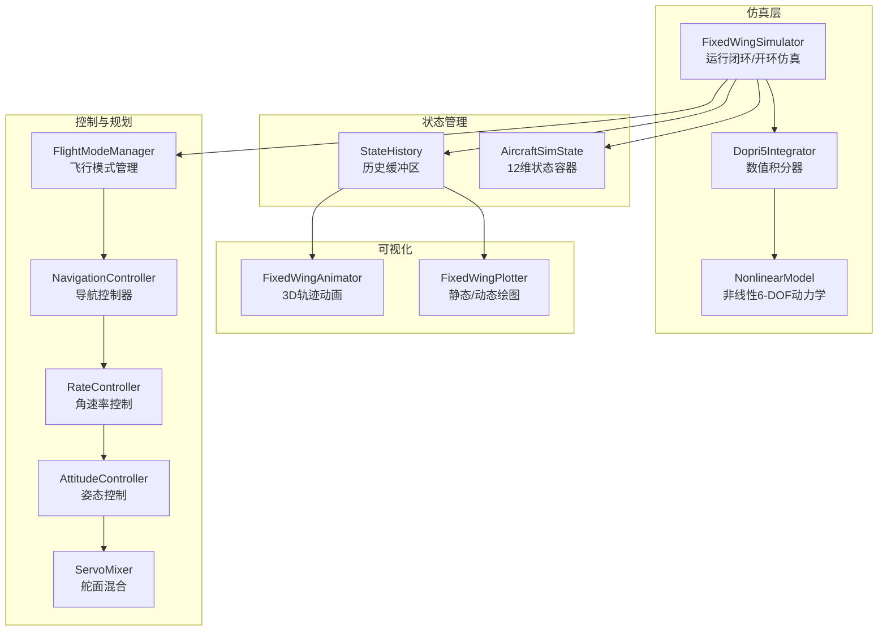
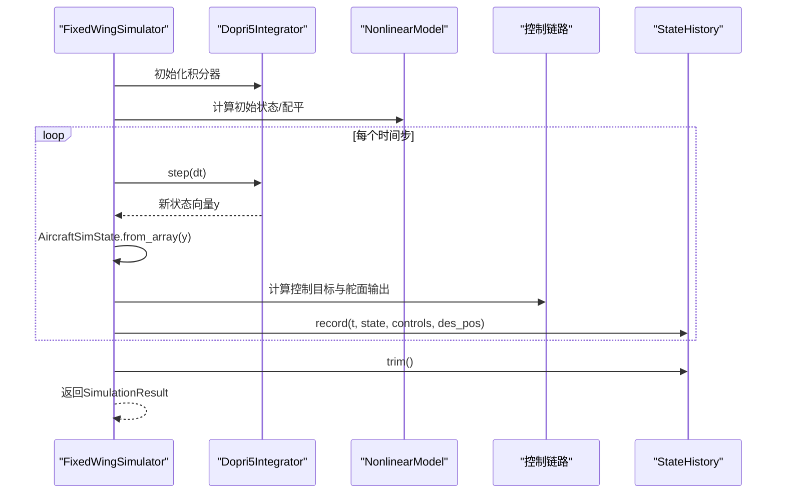
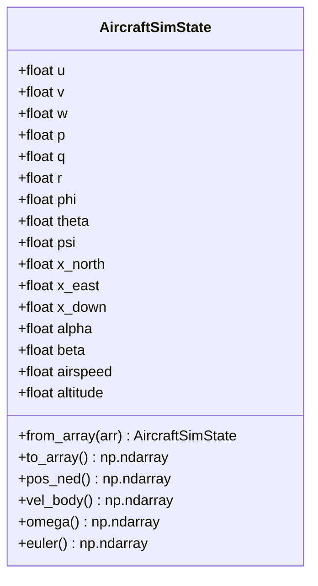
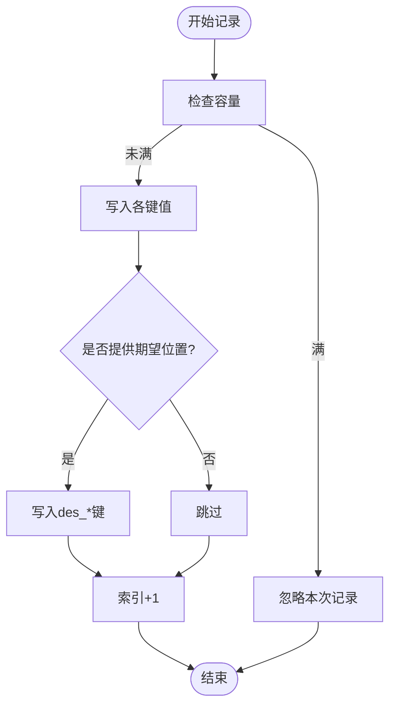
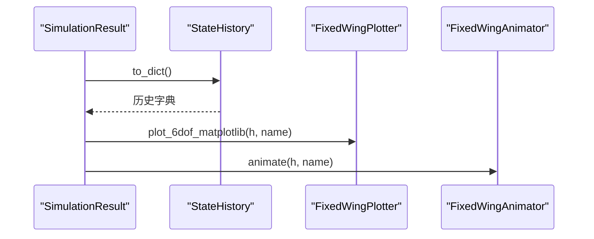
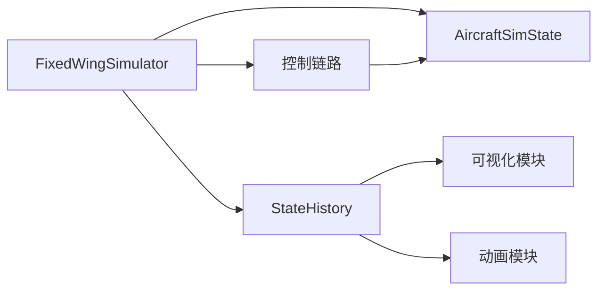

# 状态管理系统

<cite>
**本文引用的文件列表**
- [state_manager.py](file://src/simulation/state_manager.py)
- [simulator.py](file://src/simulation/simulator.py)
- [plotter.py](file://src/visualization/plotter.py)
- [animator.py](file://src/visualization/animator.py)
- [test_integration.py](file://tests/test_integration.py)
- [example_1_linear_response.py](file://examples/example_1_linear_response.py)
- [example_2_nonlinear_dynamics.py](file://examples/example_2_nonlinear_dynamics.py)
- [main.py](file://main.py)
</cite>

## 目录
1. [简介](#简介)
2. [项目结构](#项目结构)
3. [核心组件](#核心组件)
4. [架构总览](#架构总览)
5. [详细组件分析](#详细组件分析)
6. [依赖关系分析](#依赖关系分析)
7. [性能考量](#性能考量)
8. [故障排查指南](#故障排查指南)
9. [结论](#结论)
10. [附录](#附录)

## 简介
本文件面向FixedWingSimulator的状态管理系统，聚焦于AircraftSimState与StateHistory两个核心类的设计理念与实现细节。内容涵盖：
- 状态变量的组织结构：12维状态向量（速度、角速率、姿态、位置）的物理意义与布局
- StateHistory的高效存储与管理：预分配数组、内存优化策略、数据访问模式
- 状态记录机制：record()方法的实现与数据格式
- 状态数据的读取与转换：to_dict()、to_csv()等实用接口
- 可视化与分析：基于历史数据的绘图与动画能力
- 与其他模块的数据交换接口：控制链路、轨迹规划、环境建模等

## 项目结构
状态管理系统位于src/simulation目录下，与仿真引擎、控制链路、可视化模块协同工作。关键交互如下：
- FixedWingSimulator在运行过程中生成AircraftSimState，并通过StateHistory进行高效记录
- 可视化模块通过StateHistory.to_dict()获取历史数据，绘制时序图与3D轨迹动画
- 测试用例验证状态序列的正确性与一致性

图表来源
- [simulator.py](file://src/simulation/simulator.py#L239-L567)
- [state_manager.py](file://src/simulation/state_manager.py#L16-L193)
- [plotter.py](file://src/visualization/plotter.py#L68-L154)
- [animator.py](file://src/visualization/animator.py#L25-L149)

章节来源
- [simulator.py](file://src/simulation/simulator.py#L1-L642)
- [state_manager.py](file://src/simulation/state_manager.py#L1-L193)

## 核心组件
本节对AircraftSimState与StateHistory进行深入剖析，解释其设计目标、字段含义、转换接口与使用方式。

- AircraftSimState
  - 作用：封装完整的12维仿真状态（含导出量），用于连接动力学、控制与可视化模块
  - 关键字段与物理意义
    - 机体坐标速度：u、v、w（m/s）
    - 机体坐标角速率：p、q、r（rad/s）
    - 欧拉角：phi、theta、psi（rad）
    - NED位置：x_north、x_east、x_down（m）
    - 导出量：alpha（攻角）、beta（侧滑角）、airspeed、altitude
  - 转换接口
    - from_array：从12维数组构建状态对象
    - to_array：导出12维数组
    - 属性访问：vel_body、omega、euler、pos_ned

- StateHistory
  - 作用：在仿真期间以预分配NumPy数组高效记录状态与控制量
  - 关键字段与键集合
    - STATE_KEYS：包含时间、12维状态、导出量、控制面输出、期望位置等
  - 记录接口
    - record：写入单步数据；支持可选的期望位置
    - trim：裁剪未使用的尾部，释放内存
    - get：按键名返回已记录片段
    - to_dict：返回字典形式的历史数据副本
    - to_csv：导出为CSV文件

章节来源
- [state_manager.py](file://src/simulation/state_manager.py#L16-L93)
- [state_manager.py](file://src/simulation/state_manager.py#L95-L193)

## 架构总览
状态管理贯穿仿真主循环，形成“状态生成—记录—消费”的闭环：
- 固定步长推进：每一步由数值积分器更新状态，生成AircraftSimState
- 控制链路计算：根据当前状态与目标生成舵面指令
- 历史记录：将状态与控制量写入StateHistory
- 结果封装：SimulationResult提供摘要与可视化入口

图表来源
- [simulator.py](file://src/simulation/simulator.py#L239-L567)
- [state_manager.py](file://src/simulation/state_manager.py#L124-L168)

## 详细组件分析

### AircraftSimState 设计与实现
- 数据结构与布局
  - 严格遵循非线性动力学ODE的12维状态顺序：[u, v, w, p, q, r, phi, theta, psi, x_N, x_E, x_D]
  - 导出量在构造时由基础状态推导，确保一致性
- 字段与属性
  - 速度与角速率：提供快速访问的NumPy数组
  - 姿态：欧拉角三元组
  - 位置：NED三元组（向下为负）
  - 导出量：攻角、侧滑角、空速、海拔
- 转换与派生
  - from_array：从数组重建状态，同时计算导出量
  - to_array：按固定顺序导出12维数组
  - 属性：vel_body、omega、euler、pos_ned便于模块间传递

图表来源
- [state_manager.py](file://src/simulation/state_manager.py#L16-L93)

章节来源
- [state_manager.py](file://src/simulation/state_manager.py#L16-L93)

### StateHistory 高效存储与管理
- 预分配策略
  - 在初始化时按预期步数创建所有键的零填充数组，避免运行时重复分配
  - 使用内部索引跟踪已写入位置，防止越界
- 记录流程
  - record：写入时间、12维状态、导出量、控制面输出、期望位置（可选）
  - 当超出容量时静默忽略，保证稳定性
- 内存优化
  - trim：裁剪未使用的尾部，释放多余内存
  - to_dict：返回浅拷贝的切片，避免外部修改影响内部数组
- 数据访问与导出
  - get：按键名返回当前已记录片段
  - to_dict：返回完整字典副本
  - to_csv：按STATE_KEYS顺序写出CSV文件

图表来源
- [state_manager.py](file://src/simulation/state_manager.py#L124-L168)

章节来源
- [state_manager.py](file://src/simulation/state_manager.py#L95-L193)

### 状态记录机制与数据格式
- 记录时机
  - run()主循环中每步结束后调用record()，写入当前时刻的状态与控制量
  - des_pos可选，用于记录期望轨迹点或航路点
- 数据格式
  - 时间戳：标量
  - 状态：12维数组（u, v, w, p, q, r, phi, theta, psi, x_north, x_east, x_down）
  - 导出量：alpha、beta、airspeed、altitude
  - 控制面：elevator、aileron、rudder、throttle
  - 期望位置：des_north、des_east、des_down（可选）

章节来源
- [simulator.py](file://src/simulation/simulator.py#L542-L555)
- [state_manager.py](file://src/simulation/state_manager.py#L104-L115)

### 状态数据读取与转换
- to_dict：返回包含所有键的NumPy数组副本，便于后续分析与绘图
- to_csv：将历史数据保存为CSV，便于离线分析与工具链集成
- get：按键名快速提取某列数据
- 示例用法
  - 在示例脚本中，直接调用history.to_dict()获取字典，再进行统计与绘图
  - 使用history.to_csv()保存完整历史

章节来源
- [state_manager.py](file://src/simulation/state_manager.py#L176-L193)
- [example_1_linear_response.py](file://examples/example_1_linear_response.py#L144-L163)
- [example_2_nonlinear_dynamics.py](file://examples/example_2_nonlinear_dynamics.py#L139-L159)

### 可视化与分析接口
- 固定翼绘图器
  - plot_6dof：绘制6-DOF时序图（速度、角速率、姿态、控制面、导出量）
  - plot_3d_trajectory：绘制3D NED轨迹，支持显示期望轨迹
- 固定翼动画器
  - animate：基于历史数据生成3D轨迹动画，展示飞机姿态随时间演化
- 与状态管理的对接
  - 可视化模块直接消费StateHistory.to_dict()返回的字典
  - 支持显示期望轨迹（当存在des_*键时）

图表来源
- [simulator.py](file://src/simulation/simulator.py#L92-L109)
- [plotter.py](file://src/visualization/plotter.py#L68-L154)
- [animator.py](file://src/visualization/animator.py#L25-L149)

章节来源
- [simulator.py](file://src/simulation/simulator.py#L92-L109)
- [plotter.py](file://src/visualization/plotter.py#L68-L154)
- [animator.py](file://src/visualization/animator.py#L25-L149)

## 依赖关系分析
- 组件耦合
  - FixedWingSimulator强依赖AircraftSimState与StateHistory，负责状态生成与记录
  - 控制链路依赖AircraftSimState提供的实时状态
  - 可视化模块依赖StateHistory.to_dict()提供的统一数据接口
- 外部依赖
  - NumPy用于高性能数组操作
  - Matplotlib/Plotly用于可视化
- 潜在风险
  - 容量不足：record在满载时会忽略，需确保n_steps足够
  - 数据一致性：导出量由基础状态推导，需保证输入数组顺序正确

图表来源
- [simulator.py](file://src/simulation/simulator.py#L239-L567)
- [state_manager.py](file://src/simulation/state_manager.py#L16-L193)

章节来源
- [simulator.py](file://src/simulation/simulator.py#L1-L642)
- [state_manager.py](file://src/simulation/state_manager.py#L1-L193)

## 性能考量
- 内存效率
  - 预分配数组避免频繁内存重分配，降低GC压力
  - trim裁剪未使用尾部，减少内存占用
- 计算效率
  - NumPy向量化操作，避免Python循环
  - 导出量在from_array中一次性计算，避免重复计算
- I/O效率
  - to_csv按行顺序写入，适合批量处理
- 建议
  - 合理估算n_steps，避免多次扩容
  - 对大时长仿真，优先使用to_dict后进行批处理分析

[本节为通用性能建议，不直接分析具体文件]

## 故障排查指南
- 症状：记录被忽略（容量不足）
  - 现象：history._idx未增长或最终长度小于预期
  - 排查：确认n_steps是否足够覆盖仿真步数
  - 解决：增大n_steps或启用自动调整
- 症状：导出量异常
  - 现象：airspeed为极小值、alpha/beta异常
  - 排查：检查from_array输入顺序与数值范围
  - 解决：确保输入数组严格按[u, v, w, p, q, r, phi, theta, psi, x_N, x_E, x_D]排列
- 症状：可视化无期望轨迹
  - 现象：3D轨迹图缺少红色虚线轨迹
  - 排查：确认record时是否传入des_pos
  - 解决：在record中提供期望位置
- 症状：to_csv失败
  - 现象：路径不存在或权限不足
  - 排查：确认路径存在且有写权限
  - 解决：提前创建目录或使用绝对路径

章节来源
- [state_manager.py](file://src/simulation/state_manager.py#L124-L168)
- [state_manager.py](file://src/simulation/state_manager.py#L182-L193)
- [test_integration.py](file://tests/test_integration.py#L349-L390)

## 结论
AircraftSimState与StateHistory共同构成了FixedWingSimulator高效、一致且易用的状态管理基础设施：
- AircraftSimState以严格的12维布局与导出量计算，确保状态完整性与跨模块兼容性
- StateHistory通过预分配与裁剪策略，在保证性能的同时提供灵活的数据访问与导出能力
- 与控制链路、轨迹规划、可视化模块的无缝对接，使得状态数据能够被广泛复用，支撑从仿真到分析的全链路需求

[本节为总结性内容，不直接分析具体文件]

## 附录

### 状态变量与物理意义对照表
- 机体坐标速度：u（前进）、v（横滚方向）、w（垂直）
- 机体坐标角速率：p（滚转速率）、q（俯仰速率）、r（偏航速率）
- 欧拉角：phi（滚转）、theta（俯仰）、psi（偏航）
- NED位置：x_north（北向）、x_east（东向）、x_down（向下为正）
- 导出量：alpha（攻角）、beta（侧滑角）、airspeed（空速）、altitude（海拔）

章节来源
- [state_manager.py](file://src/simulation/state_manager.py#L16-L93)

### 使用示例与最佳实践
- 示例脚本展示了如何调用history.to_dict()与history.to_csv()进行数据分析与可视化
- 建议在仿真前估算n_steps，避免记录被忽略
- 在record中提供des_pos可增强轨迹对比能力

章节来源
- [example_1_linear_response.py](file://examples/example_1_linear_response.py#L144-L163)
- [example_2_nonlinear_dynamics.py](file://examples/example_2_nonlinear_dynamics.py#L139-L159)
- [main.py](file://main.py#L98-L141)