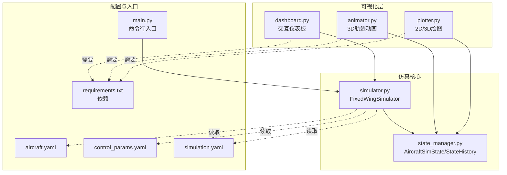
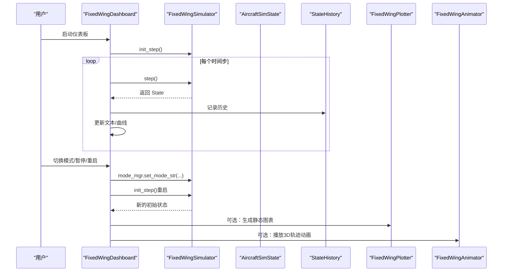
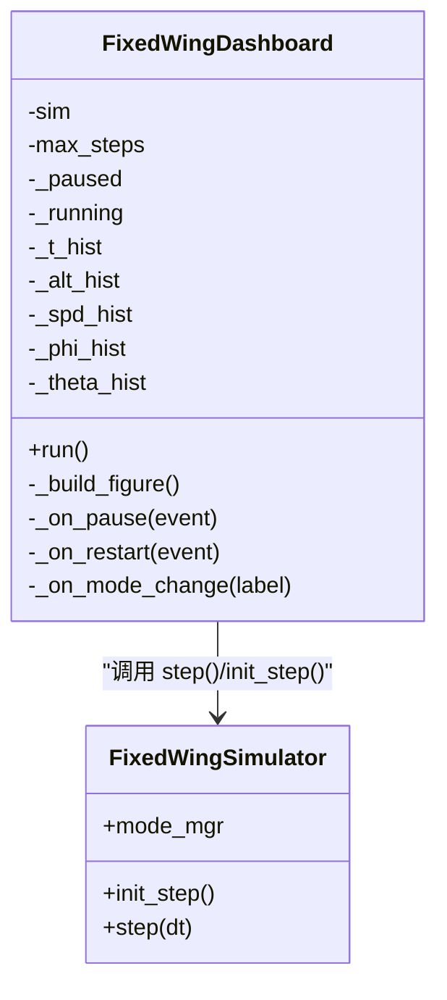
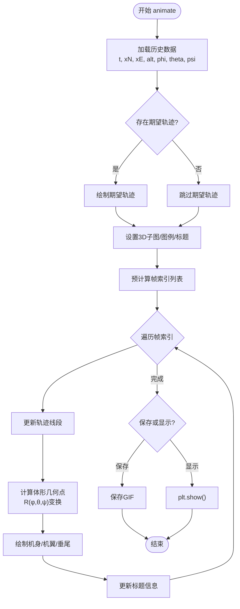
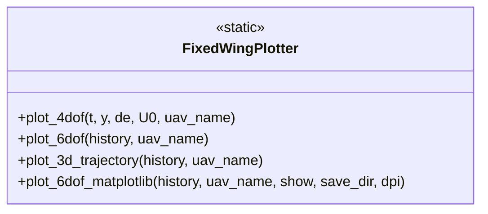
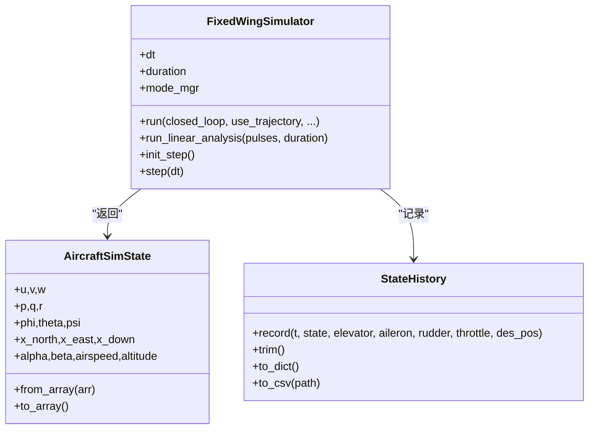
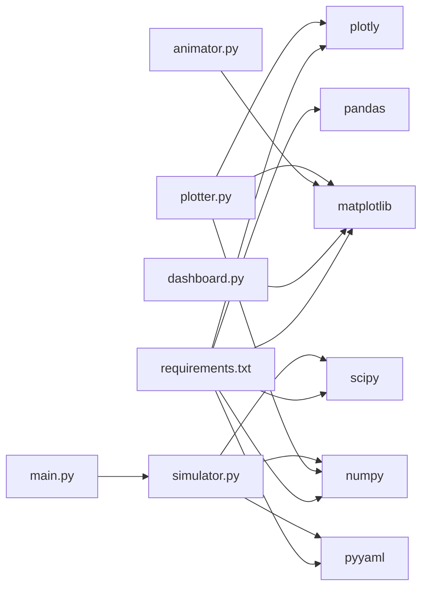

# 交互仪表板

<cite>
**本文引用的文件**
- [dashboard.py](file://src/visualization/dashboard.py)
- [animator.py](file://src/visualization/animator.py)
- [plotter.py](file://src/visualization/plotter.py)
- [simulator.py](file://src/simulation/simulator.py)
- [state_manager.py](file://src/simulation/state_manager.py)
- [main.py](file://main.py)
- [requirements.txt](file://requirements.txt)
- [aircraft.yaml](file://config/aircraft.yaml)
- [control_params.yaml](file://config/control_params.yaml)
- [simulation.yaml](file://config/simulation.yaml)
- [example_1_linear_response.py](file://examples/example_1_linear_response.py)
- [example_2_nonlinear_dynamics.py](file://examples/example_2_nonlinear_dynamics.py)
</cite>

## 目录
1. [简介](#简介)
2. [项目结构](#项目结构)
3. [核心组件](#核心组件)
4. [架构总览](#架构总览)
5. [详细组件分析](#详细组件分析)
6. [依赖关系分析](#依赖关系分析)
7. [性能考虑](#性能考虑)
8. [故障排除指南](#故障排除指南)
9. [结论](#结论)
10. [附录](#附录)

## 简介
本文件为 FixedWingSimulator 的交互仪表板系统提供全面技术文档。该系统通过实时可视化与交互控件，帮助用户观察固定翼飞行器仿真状态、切换飞行模式、暂停/重启仿真，并支持历史轨迹的三维动画播放。仪表板采用 Matplotlib 实现桌面端实时交互，同时提供 Plotly 图表用于静态结果展示与 Web 集成准备。

## 项目结构
仪表板相关代码集中在 visualization 子模块中，与仿真引擎、状态管理、配置文件协同工作：
- 交互仪表板：src/visualization/dashboard.py
- 三维轨迹动画：src/visualization/animator.py
- 2D/3D 结果绘图（Matplotlib/Plotly）：src/visualization/plotter.py
- 仿真主引擎与状态容器：src/simulation/simulator.py、src/simulation/state_manager.py
- 启动入口与命令行参数：main.py
- 依赖与配置：requirements.txt、config/*.yaml
- 示例脚本：examples/*.py

**图表来源**
- [dashboard.py](file://src/visualization/dashboard.py#L1-L167)
- [animator.py](file://src/visualization/animator.py#L1-L150)
- [plotter.py](file://src/visualization/plotter.py#L1-L244)
- [simulator.py](file://src/simulation/simulator.py#L1-L642)
- [state_manager.py](file://src/simulation/state_manager.py#L1-L193)
- [main.py](file://main.py#L1-L145)
- [requirements.txt](file://requirements.txt#L1-L8)
- [aircraft.yaml](file://config/aircraft.yaml#L1-L13)
- [control_params.yaml](file://config/control_params.yaml#L1-L45)
- [simulation.yaml](file://config/simulation.yaml#L1-L30)

**章节来源**
- [dashboard.py](file://src/visualization/dashboard.py#L1-L167)
- [animator.py](file://src/visualization/animator.py#L1-L150)
- [plotter.py](file://src/visualization/plotter.py#L1-L244)
- [simulator.py](file://src/simulation/simulator.py#L1-L642)
- [state_manager.py](file://src/simulation/state_manager.py#L1-L193)
- [main.py](file://main.py#L1-L145)
- [requirements.txt](file://requirements.txt#L1-L8)
- [aircraft.yaml](file://config/aircraft.yaml#L1-L13)
- [control_params.yaml](file://config/control_params.yaml#L1-L45)
- [simulation.yaml](file://config/simulation.yaml#L1-L30)

## 核心组件
- 交互仪表板 FixedWingDashboard
  - 提供飞行模式选择、按钮控件、数值状态读出、实时曲线更新
  - 通过 step() 接口驱动仿真步进，使用 FuncAnimation 实时刷新
- 三维轨迹动画 FixedWingAnimator
  - 基于 Matplotlib 3D 绘制实际轨迹、期望轨迹与飞机体形
  - 支持保存为 GIF 或直接显示
- 2D/3D 结果绘图 FixedWingPlotter
  - Plotly 版本：生成可嵌入 Web 的交互式图表
  - Matplotlib 版本：生成静态图表（项目-2风格）
- 仿真引擎 FixedWingSimulator
  - 提供 init_step()/step() 步进接口，便于仪表板集成
  - 管理飞行模式、控制链路、轨迹规划、环境风场等
- 状态容器 AircraftSimState/StateHistory
  - 定义 12 维状态与导出派生量，记录完整仿真历史

**章节来源**
- [dashboard.py](file://src/visualization/dashboard.py#L28-L167)
- [animator.py](file://src/visualization/animator.py#L14-L150)
- [plotter.py](file://src/visualization/plotter.py#L19-L244)
- [simulator.py](file://src/simulation/simulator.py#L115-L642)
- [state_manager.py](file://src/simulation/state_manager.py#L16-L193)

## 架构总览
仪表板系统围绕 FixedWingSimulator 的步进接口构建，形成“仿真引擎—可视化层”的清晰分层：
- 仿真层：FixedWingSimulator 负责物理模型、控制链路、轨迹与环境
- 状态层：AircraftSimState/StateHistory 提供统一的状态与历史记录
- 可视化层：Dashboard（Matplotlib）、Plotter（Plotly/Matplotlib）、Animator（Matplotlib 3D）

**图表来源**
- [dashboard.py](file://src/visualization/dashboard.py#L59-L110)
- [simulator.py](file://src/simulation/simulator.py#L602-L642)
- [state_manager.py](file://src/simulation/state_manager.py#L95-L193)
- [plotter.py](file://src/visualization/plotter.py#L161-L244)
- [animator.py](file://src/visualization/animator.py#L25-L150)

## 详细组件分析

### 交互仪表板 FixedWingDashboard
- 功能特性
  - 飞行模式选择：RadioButtons 支持 MANUAL、STABILIZE、FBW_A、FBW_B、AUTO、LOITER、RTH
  - 控件：Pause/Resume、Restart 按钮
  - 实时数值读出：时间、高度、空速、姿态角、当前模式
  - 实时曲线：高度、空速随时间变化
- 数据流与刷新机制
  - 使用 Matplotlib 后端 TkAgg，确保交互式窗口
  - 通过 FuncAnimation 回调每步调用 _update，内部调用 sim.step() 获取最新状态
  - 将新数据追加到历史缓冲区，并更新文本框与折线图
  - 自动 relim/autoscale_view 并 draw_idle，避免阻塞 UI
- 用户交互处理
  - Pause/Resume：切换内部暂停标志并更新按钮标签
  - Restart：清空历史、重新初始化仿真、重置暂停状态
  - 模式切换：调用 sim.mode_mgr.set_mode_str(label) 应用新模式

**图表来源**
- [dashboard.py](file://src/visualization/dashboard.py#L28-L167)
- [simulator.py](file://src/simulation/simulator.py#L602-L642)

**章节来源**
- [dashboard.py](file://src/visualization/dashboard.py#L41-L167)
- [simulator.py](file://src/simulation/simulator.py#L602-L642)

### 三维轨迹动画 FixedWingAnimator
- 功能特性
  - 绘制实际轨迹（蓝色实线）与期望轨迹（红色虚线）
  - 显示飞机体形（机身、机翼、垂尾），基于体坐标系几何与旋转矩阵变换
  - 支持按步长抽帧（num_frames）控制动画速率
  - 可保存为 GIF 或直接显示
- 数据输入
  - 接收 StateHistory.to_dict() 输出的历史字典
  - 从历史中提取 t、x_north、x_east、altitude、姿态角与期望轨迹
- 渲染流程
  - 初始化 3D 子图与图例
  - 预计算帧索引列表，逐帧更新轨迹与飞机体形
  - 旋转矩阵将体坐标点转换为 NED 坐标系并绘制

**图表来源**
- [animator.py](file://src/visualization/animator.py#L25-L150)

**章节来源**
- [animator.py](file://src/visualization/animator.py#L14-L150)

### 2D/3D 结果绘图 FixedWingPlotter
- Plotly 版本（Web 集成友好）
  - plot_4dof：纵向四自由度状态与升降舵输入
  - plot_6dof：全六自由度状态序列
  - plot_3d_trajectory：3D NED 轨迹（含起点与期望轨迹）
- Matplotlib 版本（项目-2 风格）
  - plot_6dof_matplotlib：位置/速度、姿态/角速率、控制输入三组图
  - 支持保存 PNG 与非交互关闭窗口

**图表来源**
- [plotter.py](file://src/visualization/plotter.py#L19-L244)

**章节来源**
- [plotter.py](file://src/visualization/plotter.py#L19-L244)

### 仿真引擎与状态管理
- FixedWingSimulator
  - 提供 run()（闭环/开环）、run_linear_analysis()、init_step()/step() 步进接口
  - 管理飞行模式、导航控制器、姿态/速率控制器、舵面混合器、轨迹管理、风场与大气
- AircraftSimState/StateHistory
  - AircraftSimState：12 维状态与导出派生量（空速、攻角、侧滑角、高度）
  - StateHistory：预分配数组高效记录历史，支持裁剪与导出 CSV

**图表来源**
- [simulator.py](file://src/simulation/simulator.py#L115-L642)
- [state_manager.py](file://src/simulation/state_manager.py#L16-L193)

**章节来源**
- [simulator.py](file://src/simulation/simulator.py#L115-L642)
- [state_manager.py](file://src/simulation/state_manager.py#L16-L193)

## 依赖关系分析
- 外部依赖
  - numpy、scipy：数值计算与积分
  - matplotlib：桌面端交互与动画
  - plotly：Web 集成的交互式图表
  - pyyaml、pandas：配置与数据处理
- 内部耦合
  - dashboard 依赖 matplotlib 与 simulator 的 step 接口
  - animator/plotter 依赖 state_manager 的历史字典输出
  - main.py 作为入口，解析参数并调用 simulator.run()

**图表来源**
- [requirements.txt](file://requirements.txt#L1-L8)
- [dashboard.py](file://src/visualization/dashboard.py#L18-L25)
- [animator.py](file://src/visualization/animator.py#L44-L46)
- [plotter.py](file://src/visualization/plotter.py#L39-L40)
- [simulator.py](file://src/simulation/simulator.py#L19-L52)
- [main.py](file://main.py#L21-L28)

**章节来源**
- [requirements.txt](file://requirements.txt#L1-L8)
- [dashboard.py](file://src/visualization/dashboard.py#L18-L25)
- [animator.py](file://src/visualization/animator.py#L44-L46)
- [plotter.py](file://src/visualization/plotter.py#L39-L40)
- [simulator.py](file://src/simulation/simulator.py#L19-L52)
- [main.py](file://main.py#L21-L28)

## 性能考虑
- 交互刷新
  - FuncAnimation 间隔由仿真步长决定，避免过快导致 UI 卡顿
  - draw_idle 仅在必要时重绘，relim/autoscale_view 仅在更新后触发
- 历史缓冲
  - dashboard 使用列表增长策略，适合短时交互；若长时间运行，建议限制最大长度或切换为循环缓冲
- 动画帧率
  - animator 默认每帧约 40ms，可根据硬件性能调整 num_frames 以平衡流畅度与计算负载
- 内存占用
  - StateHistory 预分配数组，结束后 trim 截断未使用尾部，避免内存浪费
- 非交互渲染
  - Matplotlib 静态图可使用 Agg 后端，避免 GUI 开销

[本节为通用性能建议，不直接分析具体文件]

## 故障排除指南
- 缺少 Matplotlib
  - 症状：ImportError 提示缺少 matplotlib
  - 处理：安装 requirements.txt 中的依赖
- 仪表板无法启动
  - 症状：窗口无响应或立即退出
  - 排查：确认已调用 sim.init_step() 再进入 run()；检查 dt 与 duration 设置是否合理
- 动画无法显示
  - 症状：调用 animate() 后无窗口或报错
  - 排查：确保历史字典包含所需键（t、x_north、x_east、altitude、姿态角等）
- 模式切换无效
  - 症状：点击 RadioButtons 无变化
  - 排查：确认传入字符串与 FlightMode 枚举一致；检查 mode_mgr.set_mode_str 的调用路径
- 数据溢出或 NaN
  - 症状：曲线异常或崩溃
  - 排查：检查 wind、atmosphere、控制参数是否合理；适当减小 dt 或限制控制输出

**章节来源**
- [dashboard.py](file://src/visualization/dashboard.py#L42-L43)
- [animator.py](file://src/visualization/animator.py#L25-L46)
- [simulator.py](file://src/simulation/simulator.py#L602-L642)

## 结论
交互仪表板系统以 FixedWingSimulator 的步进接口为核心，结合 Matplotlib 与 Plotly，实现了桌面端实时交互与 Web 集成的双重能力。通过清晰的分层设计与模块化组件，用户可以直观地监控仿真状态、切换飞行模式、暂停/重启仿真，并生成静态或动态可视化结果。配合合理的性能优化与故障排查策略，系统能够在保证稳定性的同时提供良好的交互体验。

[本节为总结性内容，不直接分析具体文件]

## 附录

### 部署与集成指南
- 启动交互仪表板
  - 在项目根目录执行命令行入口，随后实例化 FixedWingSimulator 并创建 FixedWingDashboard，最后调用 run()
  - 也可参考示例脚本中的非交互渲染方式，使用 Agg 后端保存图片
- API 接口与使用方法
  - 步进接口：sim.init_step() 初始化，随后循环调用 sim.step() 获取状态
  - 模式切换：dashboard 的 RadioButtons 事件回调会调用 sim.mode_mgr.set_mode_str(label)
  - 历史记录：通过 StateHistory.to_dict() 导出字典，供 plotter/animator 使用
- 与其他系统的连接策略
  - Plotly 图表可直接嵌入 Web UI（如 Reflex），实现远程可视化
  - Matplotlib 静态图可用于报告生成与批处理分析
  - 通过配置文件（aircraft.yaml、control_params.yaml、simulation.yaml）统一参数管理

**章节来源**
- [main.py](file://main.py#L98-L145)
- [dashboard.py](file://src/visualization/dashboard.py#L59-L167)
- [simulator.py](file://src/simulation/simulator.py#L602-L642)
- [plotter.py](file://src/visualization/plotter.py#L161-L244)
- [aircraft.yaml](file://config/aircraft.yaml#L1-L13)
- [control_params.yaml](file://config/control_params.yaml#L1-L45)
- [simulation.yaml](file://config/simulation.yaml#L1-L30)

### 用户体验优化建议
- 仪表板布局
  - 保持关键信息（时间、高度、空速、姿态角）在可视中心区域
  - 曲线图采用自适应缩放，避免频繁跳变导致阅读困难
- 交互响应
  - 按钮与模式切换应即时反馈，暂停/恢复按钮状态与文字保持一致
  - 动画播放时提供帧率控制或抽帧参数，兼顾流畅度与性能
- 可视化一致性
  - 颜色主题与字体大小在不同图表间保持一致
  - 3D 动画视角与比例尺固定，便于对比分析

[本节为通用优化建议，不直接分析具体文件]