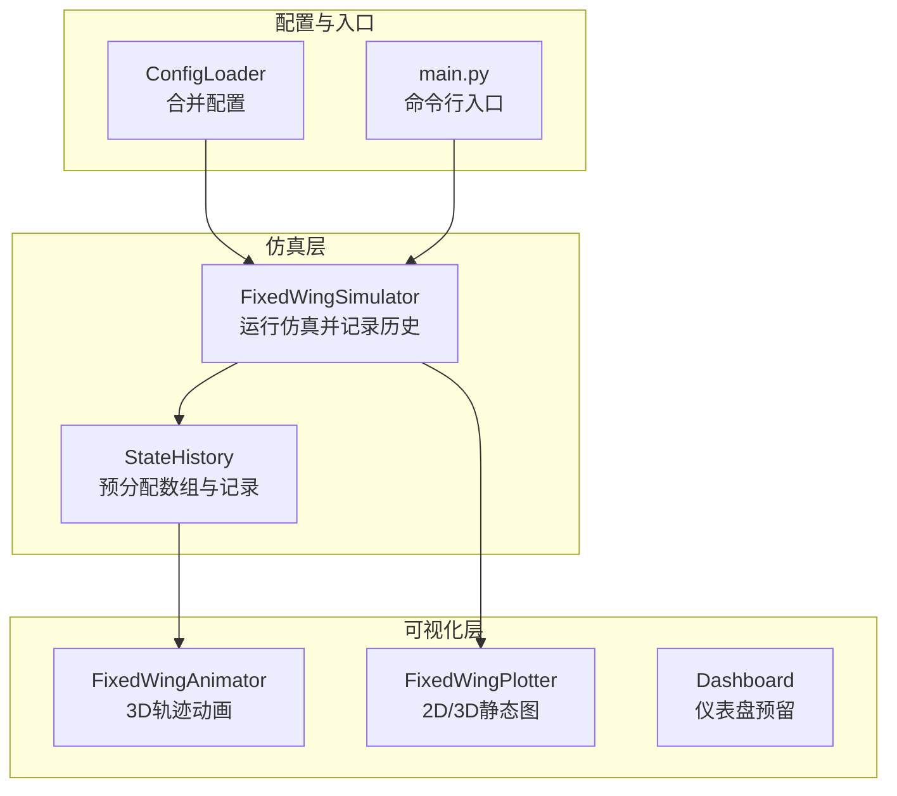
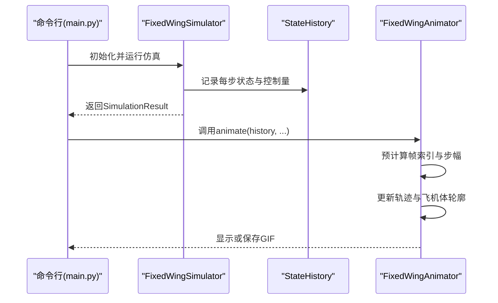
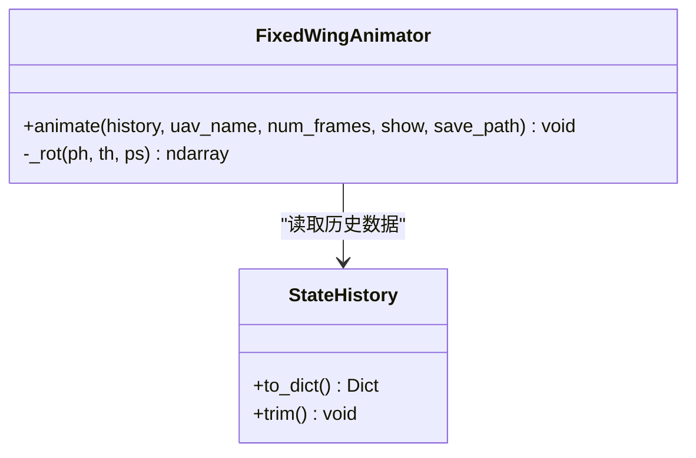
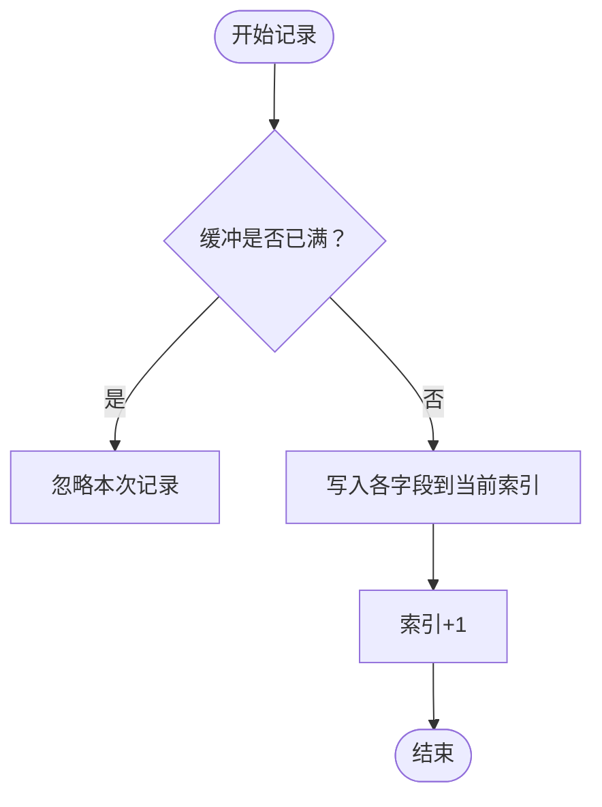
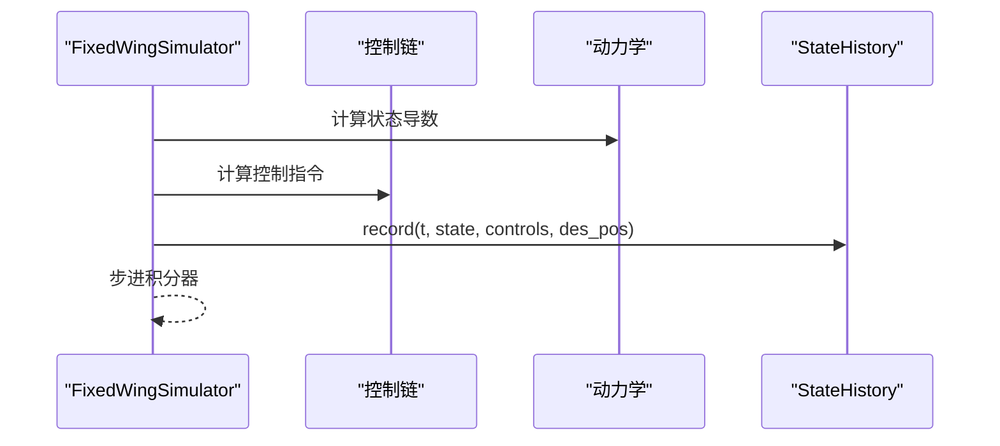
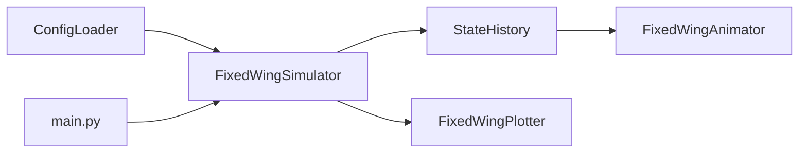

# 动画生成系统

<cite>
**本文引用的文件**
- [src/visualization/animator.py](file://src/visualization/animator.py)
- [src/visualization/plotter.py](file://src/visualization/plotter.py)
- [src/visualization/__init__.py](file://src/visualization/__init__.py)
- [src/simulation/simulator.py](file://src/simulation/simulator.py)
- [src/simulation/state_manager.py](file://src/simulation/state_manager.py)
- [src/planning/trajectory_base.py](file://src/planning/trajectory_base.py)
- [src/utils/config_loader.py](file://src/utils/config_loader.py)
- [config/simulation.yaml](file://config/simulation.yaml)
- [config/aircraft.yaml](file://config/aircraft.yaml)
- [config/trajectory.yaml](file://config/trajectory.yaml)
- [main.py](file://main.py)
- [examples/example_1_linear_response.py](file://examples/example_1_linear_response.py)
</cite>

## 目录
1. [简介](#简介)
2. [项目结构](#项目结构)
3. [核心组件](#核心组件)
4. [架构总览](#架构总览)
5. [详细组件分析](#详细组件分析)
6. [依赖关系分析](#依赖关系分析)
7. [性能考虑](#性能考虑)
8. [故障排查指南](#故障排查指南)
9. [结论](#结论)
10. [附录](#附录)

## 简介
本文件面向FixedWingSimulator的动画生成系统，聚焦于3D轨迹动画的实现原理与工程实践，涵盖以下主题：
- 帧缓冲与时间轴控制：通过预计算帧索引与步幅（stride）实现高效播放与保存。
- 渲染优化策略：采用Matplotlib的FuncAnimation与非blitting更新路径，结合静态目标轨迹与动态飞机体轮廓绘制。
- 3D场景构建：基于NED坐标系与321欧拉角序列进行旋转矩阵构建，完成机体重心到机体系再到绘图坐标系的变换。
- 动画参数配置：帧率、步幅、显示/保存开关、输出格式（GIF）等。
- 数据来源与工作流：从仿真历史数据（StateHistory）中提取状态向量，驱动动画更新。
- 性能优化与内存管理：预分配数组、按需裁剪、非交互后关闭图形句柄释放内存。
- 与其他可视化组件的集成：与Plotter、Dashboard的协同使用。

## 项目结构
动画生成系统位于visualization包内，核心类为FixedWingAnimator；其输入来源于仿真引擎的StateHistory，后者由FixedWingSimulator在运行过程中记录。

图表来源
- [src/simulation/simulator.py](file://src/simulation/simulator.py#L239-L567)
- [src/simulation/state_manager.py](file://src/simulation/state_manager.py#L95-L193)
- [src/visualization/animator.py](file://src/visualization/animator.py#L14-L150)
- [src/visualization/plotter.py](file://src/visualization/plotter.py#L19-L244)
- [src/utils/config_loader.py](file://src/utils/config_loader.py#L59-L82)
- [main.py](file://main.py#L98-L145)

章节来源
- [src/visualization/animator.py](file://src/visualization/animator.py#L14-L150)
- [src/simulation/state_manager.py](file://src/simulation/state_manager.py#L95-L193)
- [src/simulation/simulator.py](file://src/simulation/simulator.py#L239-L567)
- [src/utils/config_loader.py](file://src/utils/config_loader.py#L59-L82)
- [config/simulation.yaml](file://config/simulation.yaml#L1-L30)

## 核心组件
- FixedWingAnimator：基于Matplotlib的3D轨迹动画器，支持实时显示与GIF保存，绘制实际轨迹、期望轨迹、航点与飞机体轮廓。
- StateHistory：预分配NumPy数组，高效记录仿真状态与控制量，提供裁剪与导出接口。
- FixedWingSimulator：主仿真引擎，负责控制链、动力学、环境与轨迹规划，最终产出历史数据供可视化使用。
- FixedWingPlotter：提供Plotly与Matplotlib双栈的静态图绘制能力，作为动画之外的补充。
- ConfigLoader：统一加载与合并各子系统配置（仿真、轨迹、飞机参数）。

章节来源
- [src/visualization/animator.py](file://src/visualization/animator.py#L14-L150)
- [src/simulation/state_manager.py](file://src/simulation/state_manager.py#L95-L193)
- [src/simulation/simulator.py](file://src/simulation/simulator.py#L115-L642)
- [src/visualization/plotter.py](file://src/visualization/plotter.py#L19-L244)
- [src/utils/config_loader.py](file://src/utils/config_loader.py#L59-L82)

## 架构总览
动画生成系统围绕“历史数据 → 动画器 → 视频/图像”的流水线展开。下图展示了从仿真到动画的关键调用链：

图表来源
- [main.py](file://main.py#L98-L145)
- [src/simulation/simulator.py](file://src/simulation/simulator.py#L239-L567)
- [src/simulation/state_manager.py](file://src/simulation/state_manager.py#L124-L174)
- [src/visualization/animator.py](file://src/visualization/animator.py#L25-L150)

## 详细组件分析

### FixedWingAnimator：3D轨迹动画器
- 输入：StateHistory.to_dict()返回的状态字典，包含时间、位置、姿态、空速、控制面等。
- 关键特性：
  - 时间轴控制：通过num_frames（步幅）与frame_indices实现降采样播放，兼顾流畅度与性能。
  - 帧缓冲与更新：使用trace_line与三条机体线段（机身、机翼、水平尾翼），在update函数中按当前帧索引更新。
  - 坐标系转换：采用321欧拉角序列构建旋转矩阵，将机体系几何映射到绘图坐标系（E-N-Up）。
  - 目标轨迹与航点：若存在期望轨迹则静态绘制；航点以散点形式叠加。
  - 输出：可选择显示窗口或保存为GIF（pillow writer，fps=25）。

图表来源
- [src/visualization/animator.py](file://src/visualization/animator.py#L14-L150)
- [src/simulation/state_manager.py](file://src/simulation/state_manager.py#L179-L181)

章节来源
- [src/visualization/animator.py](file://src/visualization/animator.py#L25-L150)

### StateHistory：历史数据容器与帧缓冲
- 预分配策略：构造时一次性分配所有字段的固定长度数组，避免频繁扩容。
- 记录接口：record按索引顺序写入，支持控制量与期望位置。
- 裁剪接口：trim移除未使用的尾部，节省内存。
- 导出接口：to_dict返回当前已写入部分的副本，便于动画器消费。

图表来源
- [src/simulation/state_manager.py](file://src/simulation/state_manager.py#L124-L174)

章节来源
- [src/simulation/state_manager.py](file://src/simulation/state_manager.py#L95-L193)

### FixedWingSimulator：仿真与历史采集
- 运行模式：支持闭环（ArduPilot控制链）与开环（4-DOF线性分析或纯动力学）。
- 历史采集：在每个时间步将状态与控制量写入StateHistory。
- 可视化集成：SimulationResult提供visualize方法，串联Plotter与Animator。

图表来源
- [src/simulation/simulator.py](file://src/simulation/simulator.py#L329-L567)

章节来源
- [src/simulation/simulator.py](file://src/simulation/simulator.py#L115-L642)

### FixedWingPlotter：静态图与3D轨迹
- Plotly与Matplotlib双栈：支持Web端与本地脚本两种输出。
- 3D轨迹图：以Plotly绘制3D轨迹，支持起始点标记与期望轨迹叠加。
- 6DOF时域图：按通道分图展示速度、姿态、控制输入等。

章节来源
- [src/visualization/plotter.py](file://src/visualization/plotter.py#L19-L244)

### 配置系统与参数
- ConfigLoader：合并默认配置与用户YAML，提供aircraft、simulation、trajectory三类配置。
- simulation.yaml：dt、duration、风场、初始条件、日志等。
- trajectory.yaml：轨迹类型、平均速度、航点列表、循环模式等。
- aircraft.yaml：机型名称与可选覆盖项。

章节来源
- [src/utils/config_loader.py](file://src/utils/config_loader.py#L59-L82)
- [config/simulation.yaml](file://config/simulation.yaml#L1-L30)
- [config/trajectory.yaml](file://config/trajectory.yaml#L1-L23)
- [config/aircraft.yaml](file://config/aircraft.yaml#L1-L13)

## 依赖关系分析
- 动画器依赖StateHistory提供的字典数据；仿真器在运行时填充该数据。
- ConfigLoader贯穿仿真初始化，决定dt、风场、轨迹类型等。
- main.py作为入口，根据命令行参数调度仿真与可视化。

图表来源
- [src/utils/config_loader.py](file://src/utils/config_loader.py#L59-L82)
- [src/simulation/simulator.py](file://src/simulation/simulator.py#L130-L152)
- [src/simulation/state_manager.py](file://src/simulation/state_manager.py#L117-L122)
- [src/visualization/animator.py](file://src/visualization/animator.py#L48-L54)
- [main.py](file://main.py#L114-L122)

章节来源
- [src/utils/config_loader.py](file://src/utils/config_loader.py#L59-L82)
- [src/simulation/simulator.py](file://src/simulation/simulator.py#L130-L152)
- [src/simulation/state_manager.py](file://src/simulation/state_manager.py#L117-L122)
- [src/visualization/animator.py](file://src/visualization/animator.py#L48-L54)
- [main.py](file://main.py#L114-L122)

## 性能考虑
- 帧缓冲与降采样
  - 使用num_frames（步幅）与frame_indices预计算帧索引，避免每帧都处理全部数据，显著降低更新开销。
  - 动画器内部以interval=40ms（约25fps）驱动，兼顾流畅度与CPU/GPU占用。
- 预分配数组
  - StateHistory在构造时一次性分配所有字段的数组，record阶段避免动态扩容，减少内存碎片与拷贝。
- 非交互式渲染
  - 在批量任务中使用非GUI后端（如Agg），并在非交互模式下关闭图形句柄以释放内存。
- 仅更新必要元素
  - 仅更新轨迹线段与飞机体轮廓，不启用blitting，简化逻辑；对于大规模数据可考虑进一步优化。
- 内存裁剪
  - 运行结束后调用trim裁剪未使用尾部，减小内存占用。

章节来源
- [src/visualization/animator.py](file://src/visualization/animator.py#L104-L142)
- [src/simulation/state_manager.py](file://src/simulation/state_manager.py#L124-L174)
- [examples/example_1_linear_response.py](file://examples/example_1_linear_response.py#L25-L28)

## 故障排查指南
- 动画无法显示或保存
  - 确认已安装pillow以支持GIF保存；检查save_path权限与路径是否存在。
  - 若在无GUI环境中运行，确保使用非交互后端并禁用显示。
- 帧率过低或卡顿
  - 提高num_frames（增大步幅）或降低interval（提高帧率），但需权衡性能。
- 坐标系异常或飞机体方向错误
  - 检查姿态数据（phi/theta/psi）与旋转矩阵构建逻辑；确认NED与绘图坐标系映射一致。
- 期望轨迹未显示
  - 确认历史字典中存在des_north等字段且非全零；检查轨迹是否在仿真中被正确生成。
- 内存占用过高
  - 使用StateHistory.trim裁剪；在非交互模式下及时关闭图形句柄；适当增大num_frames降低更新频率。

章节来源
- [src/visualization/animator.py](file://src/visualization/animator.py#L144-L149)
- [src/simulation/state_manager.py](file://src/simulation/state_manager.py#L170-L174)
- [examples/example_1_linear_response.py](file://examples/example_1_linear_response.py#L25-L28)

## 结论
FixedWingSimulator的动画生成系统以StateHistory为核心数据源，通过FixedWingAnimator实现高效的3D轨迹动画。系统采用预分配数组与帧降采样策略，在保证可视化质量的同时兼顾性能与内存效率。配合ConfigLoader与main.py，用户可以灵活配置仿真与动画参数，并将结果用于报告与演示。

## 附录

### 动画参数配置清单
- 帧率与步幅
  - interval：动画刷新间隔（毫秒），影响视觉帧率。
  - num_frames：帧步幅，控制每帧更新对应的历史步数。
- 显示与保存
  - show：是否弹出显示窗口。
  - save_path：GIF保存路径（需pillow支持）。
- 坐标系与几何
  - 机体重心几何：机身、机翼、水平尾翼的局部坐标定义。
  - 姿态到旋转矩阵：321欧拉角序列构建旋转矩阵，完成机体系到NED再映射到绘图坐标系。

章节来源
- [src/visualization/animator.py](file://src/visualization/animator.py#L25-L150)

### 工作流程与使用示例
- 命令行运行
  - 通过main.py传入aircraft、mode、duration、dt、wind、traj等参数启动仿真与可视化。
- 代码级调用
  - 运行FixedWingSimulator得到SimulationResult，调用visualize自动打开Plotter与Animator。
  - 或直接调用FixedWingAnimator.animate传入history字典，控制显示与保存。

章节来源
- [main.py](file://main.py#L98-L145)
- [src/simulation/simulator.py](file://src/simulation/simulator.py#L92-L109)
- [examples/example_1_linear_response.py](file://examples/example_1_linear_response.py#L132-L144)