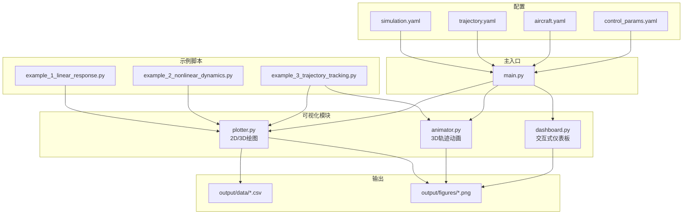
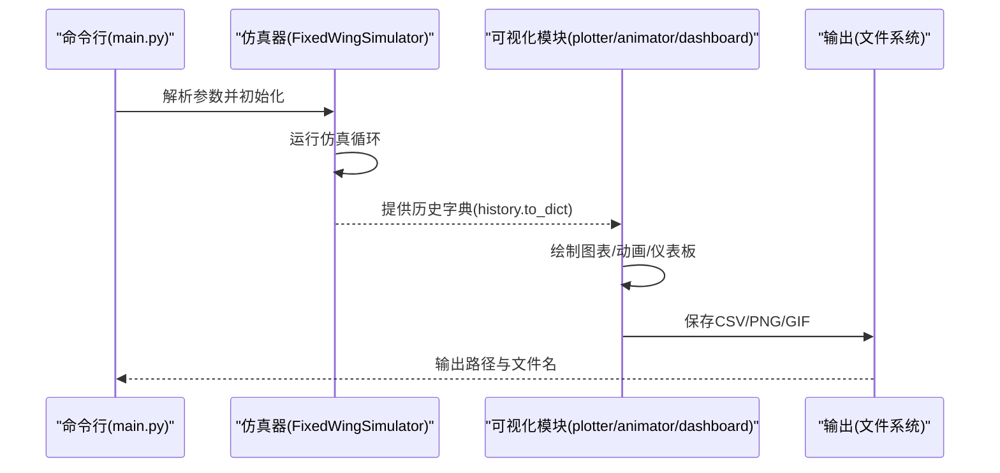
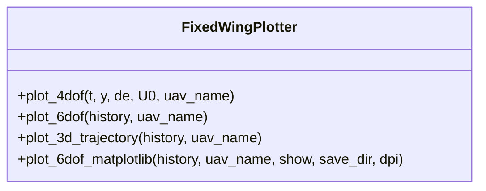
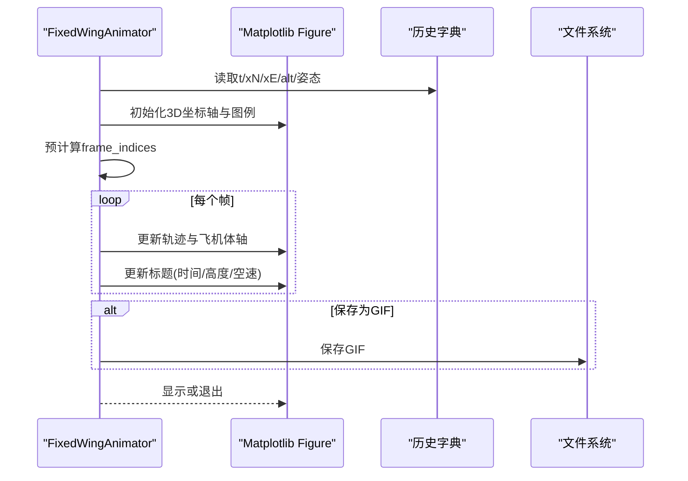
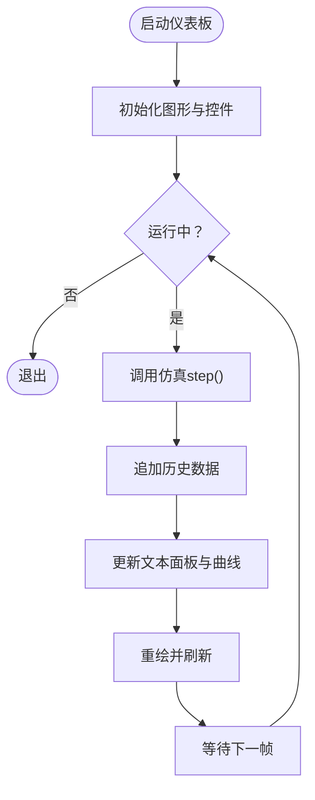
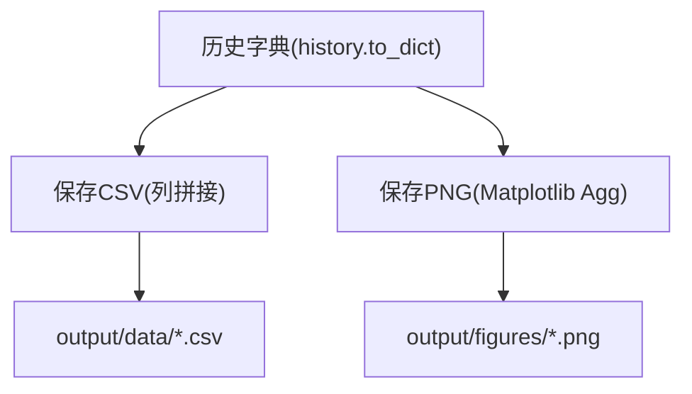
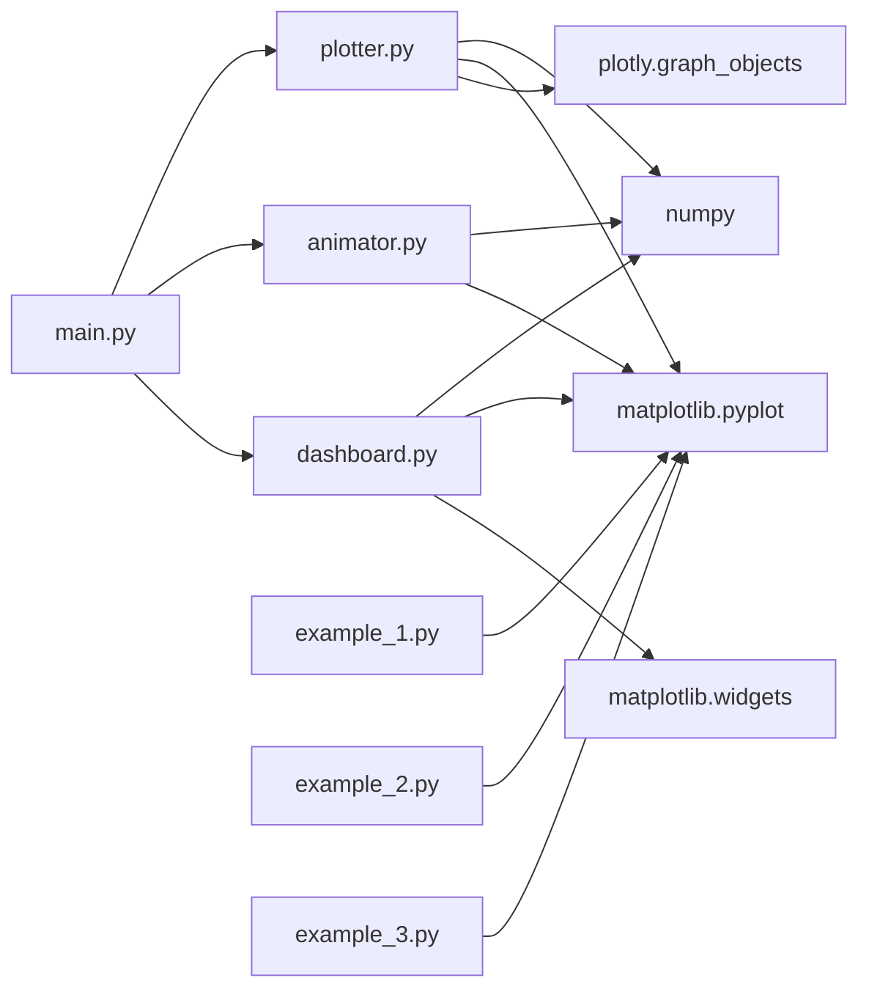

# 可视化与输出

<cite>
**本文引用的文件**
- [src/visualization/__init__.py](file://src/visualization/__init__.py)
- [src/visualization/plotter.py](file://src/visualization/plotter.py)
- [src/visualization/animator.py](file://src/visualization/animator.py)
- [src/visualization/dashboard.py](file://src/visualization/dashboard.py)
- [examples/example_1_linear_response.py](file://examples/example_1_linear_response.py)
- [examples/example_2_nonlinear_dynamics.py](file://examples/example_2_nonlinear_dynamics.py)
- [examples/example_3_trajectory_tracking.py](file://examples/example_3_trajectory_tracking.py)
- [main.py](file://main.py)
- [config/simulation.yaml](file://config/simulation.yaml)
- [config/trajectory.yaml](file://config/trajectory.yaml)
- [config/aircraft.yaml](file://config/aircraft.yaml)
- [config/control_params.yaml](file://config/control_params.yaml)
- [output/data/example1_TB2_linear_openloop.csv](file://output/data/example1_TB2_linear_openloop.csv)
</cite>

## 目录
1. [简介](#简介)
2. [项目结构](#项目结构)
3. [核心组件](#核心组件)
4. [架构总览](#架构总览)
5. [详细组件分析](#详细组件分析)
6. [依赖关系分析](#依赖关系分析)
7. [性能考虑](#性能考虑)
8. [故障排查指南](#故障排查指南)
9. [结论](#结论)
10. [附录](#附录)

## 简介
本文件面向FixedWingSimulator的可视化与输出系统，系统性梳理了图表绘制工具、动画生成、交互式仪表板、仿真结果存储与导出、配置与自定义方法、性能优化策略以及输出文件的组织与命名规范。目标是帮助用户快速掌握从静态图表到实时动画、从批量导出到交互式调试的完整工作流。

## 项目结构
可视化与输出相关代码集中在src/visualization目录，配合examples中的示例脚本演示如何保存CSV与图像；主入口main.py支持命令行运行并可选择禁用可视化；配置文件位于config目录，用于统一管理仿真参数、轨迹规划与控制参数。

**图表来源**
- [src/visualization/plotter.py](file://src/visualization/plotter.py#L1-L244)
- [src/visualization/animator.py](file://src/visualization/animator.py#L1-L150)
- [src/visualization/dashboard.py](file://src/visualization/dashboard.py#L1-L167)
- [examples/example_1_linear_response.py](file://examples/example_1_linear_response.py#L1-L206)
- [examples/example_2_nonlinear_dynamics.py](file://examples/example_2_nonlinear_dynamics.py#L1-L215)
- [examples/example_3_trajectory_tracking.py](file://examples/example_3_trajectory_tracking.py#L1-L194)
- [main.py](file://main.py#L1-L145)
- [config/simulation.yaml](file://config/simulation.yaml#L1-L30)
- [config/trajectory.yaml](file://config/trajectory.yaml#L1-L23)
- [config/aircraft.yaml](file://config/aircraft.yaml#L1-L13)
- [config/control_params.yaml](file://config/control_params.yaml#L1-L45)

**章节来源**
- [src/visualization/__init__.py](file://src/visualization/__init__.py#L1-L8)
- [main.py](file://main.py#L1-L145)

## 核心组件
- 图表绘制器：提供Plotly与Matplotlib双栈接口，支持4-DOF/6-DOF时域响应、3D轨迹图、多子图布局与标注。
- 动画器：基于Matplotlib FuncAnimation生成3D轨迹动画，支持GIF保存与实时播放。
- 仪表板：集成飞行模式切换、PID参数调节、暂停/重启、实时数值读出与历史曲线更新。
- 示例脚本：演示非交互后端、CSV与PNG导出、多场景对比图与3D轨迹可视化。
- 主入口：命令行参数驱动仿真运行与可视化开关，便于批处理与自动化。

**章节来源**
- [src/visualization/plotter.py](file://src/visualization/plotter.py#L1-L244)
- [src/visualization/animator.py](file://src/visualization/animator.py#L1-L150)
- [src/visualization/dashboard.py](file://src/visualization/dashboard.py#L1-L167)
- [examples/example_1_linear_response.py](file://examples/example_1_linear_response.py#L1-L206)
- [examples/example_2_nonlinear_dynamics.py](file://examples/example_2_nonlinear_dynamics.py#L1-L215)
- [examples/example_3_trajectory_tracking.py](file://examples/example_3_trajectory_tracking.py#L1-L194)
- [main.py](file://main.py#L1-L145)

## 架构总览
可视化与输出系统围绕“历史数据字典”展开：仿真结果以字典形式提供，图表绘制器直接消费该字典生成Plotly/Matplotlib图形；动画器基于同一字典进行3D轨迹与飞机体轴的动态绘制；仪表板通过与仿真器的步进接口增量更新历史并刷新界面；示例脚本在非交互后端下批量导出CSV与PNG；主入口负责参数解析与可视化开关。

**图表来源**
- [main.py](file://main.py#L98-L141)
- [src/visualization/plotter.py](file://src/visualization/plotter.py#L68-L111)
- [src/visualization/animator.py](file://src/visualization/animator.py#L25-L150)
- [src/visualization/dashboard.py](file://src/visualization/dashboard.py#L59-L110)

## 详细组件分析

### 图表绘制工具（Plotter）
- Plotly接口
  - 4-DOF时域响应：纵向状态与升降舵输入的子图布局，标题、单位与图例清晰。
  - 6-DOF全量时域：按通道自动排列子图，适合长序列分析。
  - 3D轨迹：NED坐标系下的轨迹线与起点标记，支持叠加期望轨迹。
- Matplotlib接口（示例脚本风格）
  - 三类典型图：位置/速度、姿态/角速率、控制输入，每类一张图，子图网格整齐。
  - 支持保存为PNG（可指定分辨率），并关闭窗口释放内存。
- 多子图与标注
  - 使用make_subplots或subplot网格，统一设置标题、坐标轴标签与网格。
  - 通过字典键名映射通道，避免硬编码，便于扩展新通道。

**图表来源**
- [src/visualization/plotter.py](file://src/visualization/plotter.py#L19-L244)

**章节来源**
- [src/visualization/plotter.py](file://src/visualization/plotter.py#L22-L244)
- [examples/example_1_linear_response.py](file://examples/example_1_linear_response.py#L168-L202)
- [examples/example_2_nonlinear_dynamics.py](file://examples/example_2_nonlinear_dynamics.py#L164-L211)
- [examples/example_3_trajectory_tracking.py](file://examples/example_3_trajectory_tracking.py#L111-L190)

### 动画生成器（Animator）
- 功能要点
  - 3D轨迹随时间增长，实际轨迹蓝色实线，期望轨迹红色虚线。
  - 飞机体轴采用简单几何（机身、机翼、尾翼）并按姿态矩阵旋转。
  - 支持stride采样（num_frames）降低渲染压力，支持GIF保存。
- 关键流程
  - 预计算帧索引，逐帧更新轨迹与飞机体轴。
  - 自动缩放坐标轴，标题显示时间、高度与空速。
  - 通过FuncAnimation驱动，可直接显示或保存为GIF。

**图表来源**
- [src/visualization/animator.py](file://src/visualization/animator.py#L25-L150)

**章节来源**
- [src/visualization/animator.py](file://src/visualization/animator.py#L25-L150)
- [examples/example_3_trajectory_tracking.py](file://examples/example_3_trajectory_tracking.py#L162-L190)

### 交互式仪表板（Dashboard）
- 功能要点
  - 实时显示高度与空速曲线，自动缩放。
  - 数值面板显示当前状态（时间、高度、空速、姿态角、航向、飞行模式）。
  - 控件：暂停/继续、重启、飞行模式单选按钮。
- 运行机制
  - 使用交互式后端，定时触发仿真步进与绘图更新。
  - 历史缓冲采用列表，转换为NumPy数组进行绘图。
  - 错误捕获与停止逻辑，保证稳定性。

**图表来源**
- [src/visualization/dashboard.py](file://src/visualization/dashboard.py#L59-L110)

**章节来源**
- [src/visualization/dashboard.py](file://src/visualization/dashboard.py#L28-L167)

### 仿真结果存储与导出
- CSV导出
  - 示例脚本通过内置to_csv方法保存完整历史，字段覆盖23通道。
  - 手工导出时使用列拼接与逗号分隔，保留表头与注释前缀。
- 图像导出
  - Matplotlib后端Agg无GUI渲染，适合批处理与CI。
  - Plotly图可直接保存为HTML或PNG（需额外配置），示例脚本主要使用Matplotlib PNG。
- 输出目录与命名
  - output/data与output/figures分别存放CSV与PNG。
  - 文件名包含示例编号、机型与任务特征，便于检索与归档。

**图表来源**
- [examples/example_1_linear_response.py](file://examples/example_1_linear_response.py#L112-L123)
- [examples/example_2_nonlinear_dynamics.py](file://examples/example_2_nonlinear_dynamics.py#L110-L120)
- [examples/example_3_trajectory_tracking.py](file://examples/example_3_trajectory_tracking.py#L103-L110)

**章节来源**
- [examples/example_1_linear_response.py](file://examples/example_1_linear_response.py#L1-L206)
- [examples/example_2_nonlinear_dynamics.py](file://examples/example_2_nonlinear_dynamics.py#L1-L215)
- [examples/example_3_trajectory_tracking.py](file://examples/example_3_trajectory_tracking.py#L1-L194)
- [output/data/example1_TB2_linear_openloop.csv](file://output/data/example1_TB2_linear_openloop.csv#L1-L200)

### 可视化配置与自定义
- 配置文件
  - simulation.yaml：仿真步长、时长、初始条件、风场与日志开关。
  - trajectory.yaml：轨迹类型、平均速度、偏航模式、航路点与循环。
  - aircraft.yaml：机型名称与可选参数覆盖。
  - control_params.yaml：PID与TECS参数，影响仿真动态与可视化曲线形态。
- 自定义建议
  - 在plotter中新增通道时，保持字典键名一致，便于复用现有绘图函数。
  - 动画器可通过调整num_frames与interval平衡流畅度与性能。
  - 仪表板可扩展更多参数滑条与模式按钮，注意更新历史与重绘。

**章节来源**
- [config/simulation.yaml](file://config/simulation.yaml#L1-L30)
- [config/trajectory.yaml](file://config/trajectory.yaml#L1-L23)
- [config/aircraft.yaml](file://config/aircraft.yaml#L1-L13)
- [config/control_params.yaml](file://config/control_params.yaml#L1-L45)

## 依赖关系分析
- 可视化模块依赖NumPy与Matplotlib/Plotly；仪表板额外依赖matplotlib.widgets。
- 示例脚本依赖Matplotlib后端Agg与Numpy保存。
- 主入口依赖仿真器与配置加载，支持命令行禁用可视化以便批处理。

**图表来源**
- [src/visualization/plotter.py](file://src/visualization/plotter.py#L11-L12)
- [src/visualization/animator.py](file://src/visualization/animator.py#L10-L11)
- [src/visualization/dashboard.py](file://src/visualization/dashboard.py#L15-L25)
- [examples/example_1_linear_response.py](file://examples/example_1_linear_response.py#L25-L28)
- [examples/example_2_nonlinear_dynamics.py](file://examples/example_2_nonlinear_dynamics.py#L25-L28)
- [examples/example_3_trajectory_tracking.py](file://examples/example_3_trajectory_tracking.py#L27-L30)
- [main.py](file://main.py#L28-L29)

**章节来源**
- [src/visualization/plotter.py](file://src/visualization/plotter.py#L1-L244)
- [src/visualization/animator.py](file://src/visualization/animator.py#L1-L150)
- [src/visualization/dashboard.py](file://src/visualization/dashboard.py#L1-L167)
- [examples/example_1_linear_response.py](file://examples/example_1_linear_response.py#L1-L206)
- [examples/example_2_nonlinear_dynamics.py](file://examples/example_2_nonlinear_dynamics.py#L1-L215)
- [examples/example_3_trajectory_tracking.py](file://examples/example_3_trajectory_tracking.py#L1-L194)
- [main.py](file://main.py#L1-L145)

## 性能考虑
- 渲染优化
  - 动画器使用stride（num_frames）与非blitting模式，兼顾兼容性与性能；若对性能敏感，可改为blitting并减少更新对象数量。
  - Matplotlib后端Agg适合批处理，避免GUI开销；交互模式下建议限制刷新频率（interval）。
- 数据规模
  - 大时间序列建议分段导出或降采样；仪表板可仅显示最近N秒的历史。
  - 将历史缓冲从Python列表转为环形缓冲（如collections.deque）可降低内存峰值。
- I/O吞吐
  - 批量导出时合并写入，避免频繁fsync；PNG压缩参数可调以平衡质量与体积。
- 计算与通信
  - 仪表板与仿真器解耦，通过步进接口增量更新，避免阻塞主线程。

[本节为通用指导，无需列出具体文件来源]

## 故障排查指南
- 仪表板报错
  - 若导入matplotlib失败，会抛出ImportError；请安装matplotlib与tkinter后端。
  - 步进异常时会打印错误并停止，检查仿真器状态与输入参数。
- 导出失败
  - Matplotlib保存PNG可能因权限或路径问题失败；确认输出目录存在且有写权限。
  - CSV保存失败时检查列数与数据形状一致性。
- 动画卡顿
  - 减少num_frames或提高interval；确保未启用高负载的实时渲染特性。

**章节来源**
- [src/visualization/dashboard.py](file://src/visualization/dashboard.py#L42-L43)
- [src/visualization/dashboard.py](file://src/visualization/dashboard.py#L74-L77)
- [src/visualization/animator.py](file://src/visualization/animator.py#L144-L146)

## 结论
可视化与输出系统提供了从静态图表到实时动画、从交互式调试到批量导出的完整能力。通过统一的历史字典接口与可插拔的绘图后端，用户可以灵活组合不同可视化方案，并借助配置文件与示例脚本快速落地各类应用场景。建议在大规模数据与高帧率场景下优先采用批处理导出与降采样策略，以获得最佳性能与可维护性。

[本节为总结性内容，无需列出具体文件来源]

## 附录

### 命令行与可视化开关
- main.py支持禁用可视化（--no-plot），便于批处理与CI流水线。
- 通过--analysis可直接运行线性/开环分析并可视化。

**章节来源**
- [main.py](file://main.py#L81-L84)
- [main.py](file://main.py#L124-L140)

### 输出文件组织与命名规范
- CSV：保存完整历史，字段包含时间与所有状态/控制通道。
- PNG：按示例脚本命名，包含示例编号、机型与任务特征。
- 目录：output/data与output/figures分别存放CSV与PNG。

**章节来源**
- [examples/example_1_linear_response.py](file://examples/example_1_linear_response.py#L12-L17)
- [examples/example_2_nonlinear_dynamics.py](file://examples/example_2_nonlinear_dynamics.py#L12-L17)
- [examples/example_3_trajectory_tracking.py](file://examples/example_3_trajectory_tracking.py#L12-L19)
- [output/data/example1_TB2_linear_openloop.csv](file://output/data/example1_TB2_linear_openloop.csv#L1-L200)