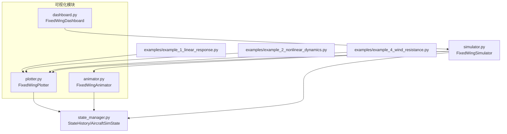
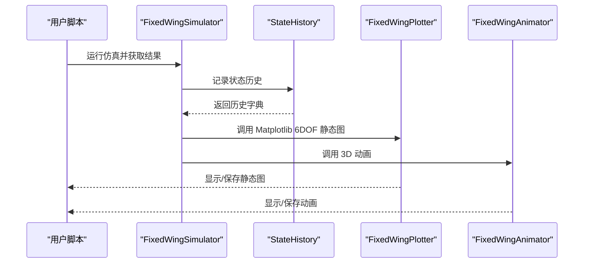
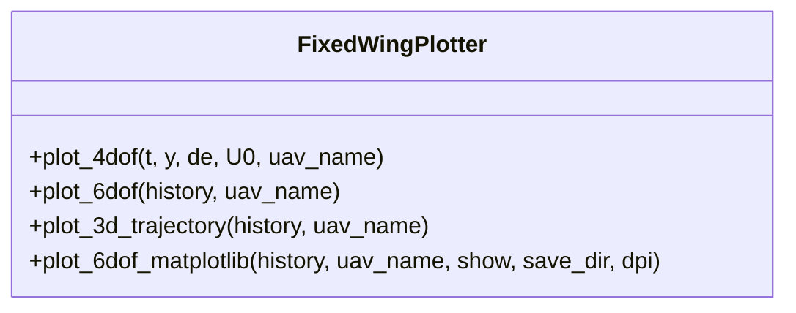
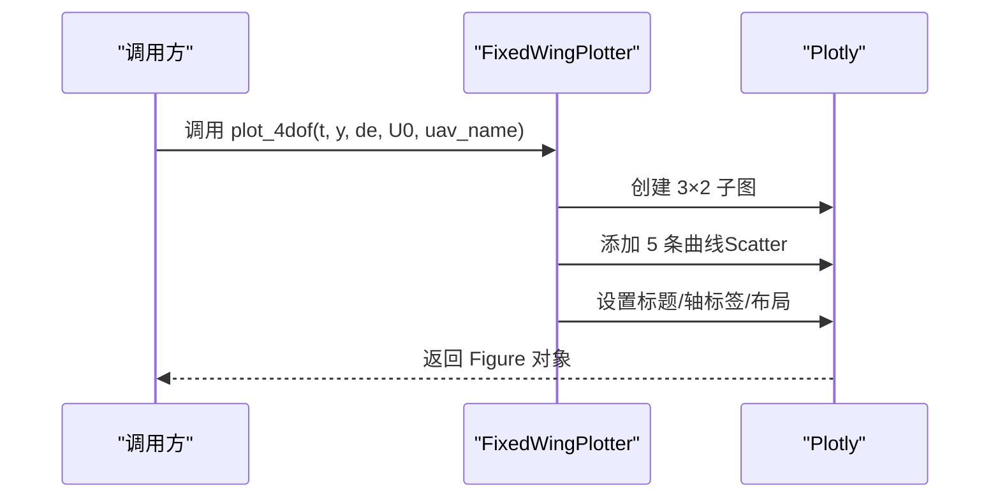
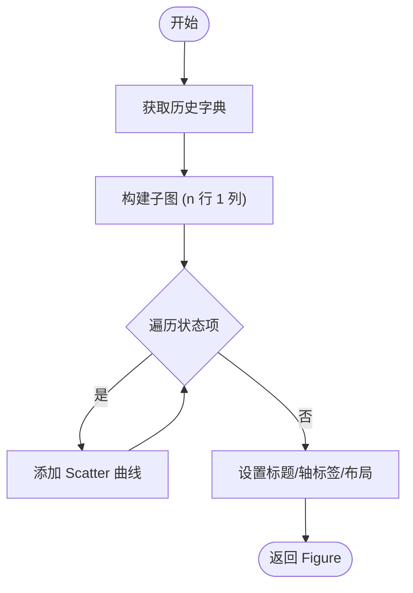
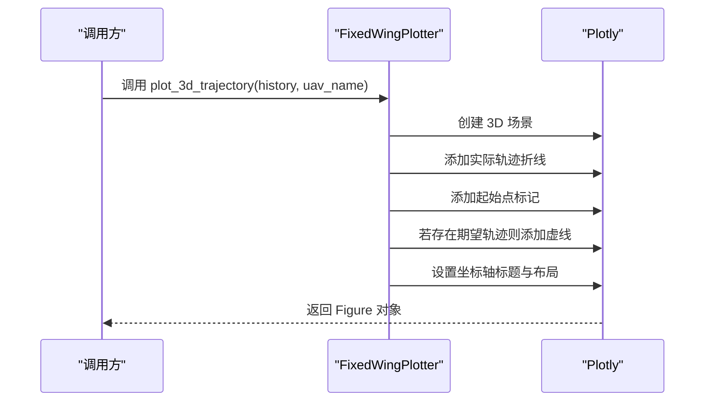
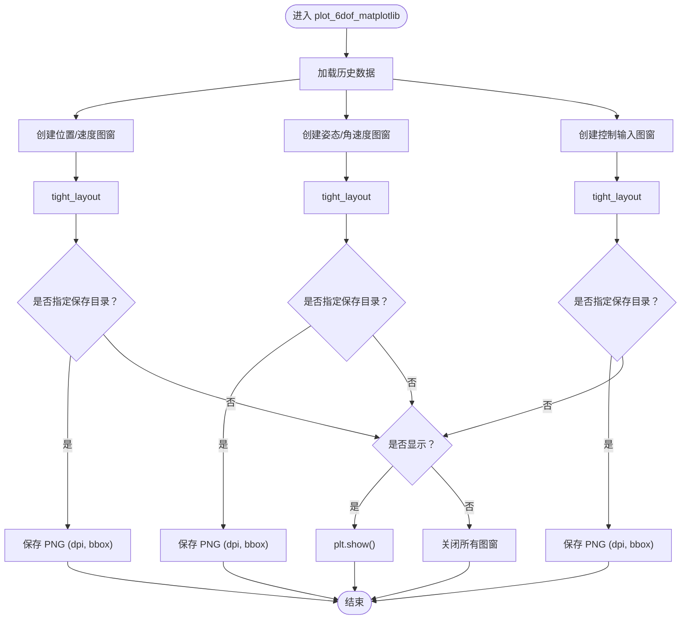
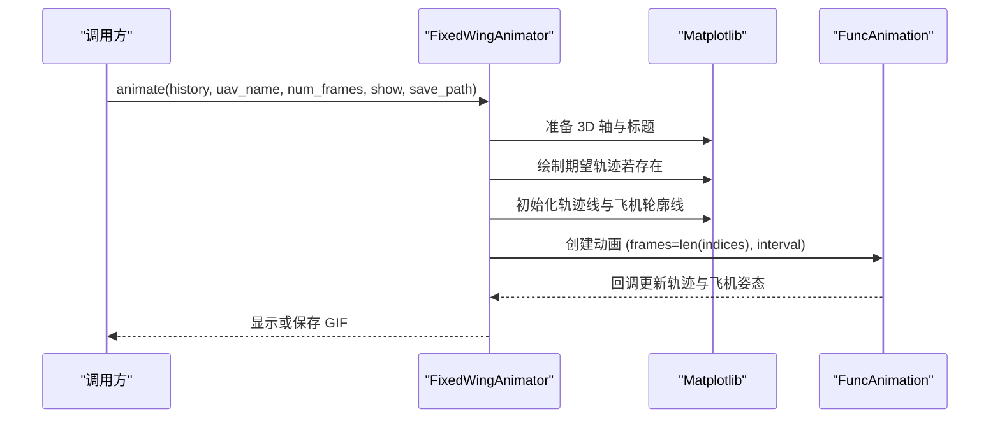
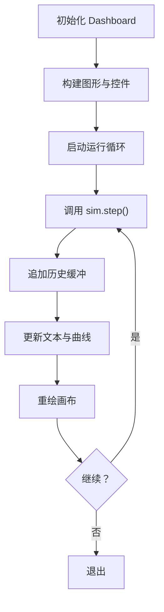
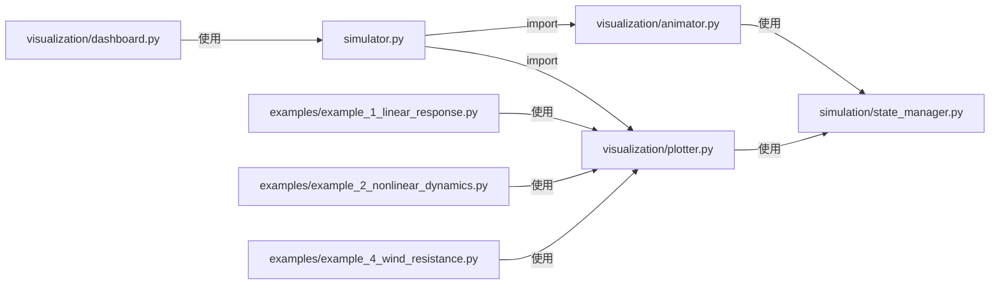

# 图表绘制工具

<cite>
**本文引用的文件**
- [src/visualization/plotter.py](file://src/visualization/plotter.py)
- [src/visualization/animator.py](file://src/visualization/animator.py)
- [src/visualization/dashboard.py](file://src/visualization/dashboard.py)
- [src/simulation/state_manager.py](file://src/simulation/state_manager.py)
- [src/simulation/simulator.py](file://src/simulation/simulator.py)
- [examples/example_1_linear_response.py](file://examples/example_1_linear_response.py)
- [examples/example_2_nonlinear_dynamics.py](file://examples/example_2_nonlinear_dynamics.py)
- [examples/example_4_wind_resistance.py](file://examples/example_4_wind_resistance.py)
- [src/visualization/__init__.py](file://src/visualization/__init__.py)
</cite>

## 目录
1. [简介](#简介)
2. [项目结构](#项目结构)
3. [核心组件](#核心组件)
4. [架构总览](#架构总览)
5. [详细组件分析](#详细组件分析)
6. [依赖关系分析](#依赖关系分析)
7. [性能与可扩展性](#性能与可扩展性)
8. [故障排查指南](#故障排查指南)
9. [结论](#结论)
10. [附录：使用示例与最佳实践](#附录使用示例与最佳实践)

## 简介
本文件面向 FixedWingSimulator 的图表绘制工具，系统化阐述 FixedWingPlotter 类的实现原理与使用方法，覆盖以下主题：
- Plotly 与 Matplotlib 两种绘图后端的差异与适用场景
- 4DOF 与 6DOF 状态响应图的绘制方法（纵向运动、姿态角、角速度、控制输入等）
- 3D 轨迹图的实现原理（NED 坐标系、轨迹线与起始点标记）
- Matplotlib 静态图表的使用指南（多子图布局、图像保存、分辨率设置等）
- 实际示例路径与最佳实践建议，帮助用户按需选择合适的绘图方式

## 项目结构
可视化相关模块位于 src/visualization，核心文件如下：
- plotter.py：提供 Plotly 与 Matplotlib 双后端的 2D/3D 图表生成器
- animator.py：基于 Matplotlib 的 3D 实时轨迹动画
- dashboard.py：交互式 Matplotlib 仪表盘（实时读数、控件）
- state_manager.py：仿真状态容器与历史记录结构，为绘图提供数据来源
- simulator.py：仿真主控制器，集成可视化调用
- examples 下的示例脚本展示了不同场景下的绘图用法

**图表来源**
- [src/visualization/plotter.py](file://src/visualization/plotter.py#L1-L244)
- [src/visualization/animator.py](file://src/visualization/animator.py#L1-L150)
- [src/visualization/dashboard.py](file://src/visualization/dashboard.py#L1-L167)
- [src/simulation/state_manager.py](file://src/simulation/state_manager.py#L1-L193)
- [src/simulation/simulator.py](file://src/simulation/simulator.py#L90-L110)
- [examples/example_1_linear_response.py](file://examples/example_1_linear_response.py#L1-L206)
- [examples/example_2_nonlinear_dynamics.py](file://examples/example_2_nonlinear_dynamics.py#L1-L215)
- [examples/example_4_wind_resistance.py](file://examples/example_4_wind_resistance.py#L1-L52)

**章节来源**
- [src/visualization/plotter.py](file://src/visualization/plotter.py#L1-L244)
- [src/visualization/animator.py](file://src/visualization/animator.py#L1-L150)
- [src/visualization/dashboard.py](file://src/visualization/dashboard.py#L1-L167)
- [src/simulation/state_manager.py](file://src/simulation/state_manager.py#L1-L193)
- [src/simulation/simulator.py](file://src/simulation/simulator.py#L90-L110)
- [examples/example_1_linear_response.py](file://examples/example_1_linear_response.py#L1-L206)
- [examples/example_2_nonlinear_dynamics.py](file://examples/example_2_nonlinear_dynamics.py#L1-L215)
- [examples/example_4_wind_resistance.py](file://examples/example_4_wind_resistance.py#L1-L52)

## 核心组件
- FixedWingPlotter：提供两类图表能力
  - Plotly 图表：用于 Web UI 或交互式展示（如 Reflex）
  - Matplotlib 图表：用于离线静态图（项目-2 风格）
- FixedWingAnimator：基于 Matplotlib FuncAnimation 的 3D 实时轨迹动画
- FixedWingDashboard：Matplotlib 交互式仪表盘，支持飞行模式切换、控件与实时读数
- StateHistory：高效的历史缓冲区，导出字典供绘图使用
- FixedWingSimulator.visualize：统一入口，串联 Matplotlib 静态图与 3D 动画

**章节来源**
- [src/visualization/plotter.py](file://src/visualization/plotter.py#L19-L244)
- [src/visualization/animator.py](file://src/visualization/animator.py#L14-L150)
- [src/visualization/dashboard.py](file://src/visualization/dashboard.py#L28-L167)
- [src/simulation/state_manager.py](file://src/simulation/state_manager.py#L95-L193)
- [src/simulation/simulator.py](file://src/simulation/simulator.py#L92-L109)

## 架构总览
下图展示从仿真到可视化的调用链路与数据流。

**图表来源**
- [src/simulation/simulator.py](file://src/simulation/simulator.py#L92-L109)
- [src/simulation/state_manager.py](file://src/simulation/state_manager.py#L179-L193)
- [src/visualization/plotter.py](file://src/visualization/plotter.py#L161-L244)
- [src/visualization/animator.py](file://src/visualization/animator.py#L25-L150)

## 详细组件分析

### FixedWingPlotter 组件分析
FixedWingPlotter 提供两类图表：
- Plotly 子图：4DOF 纵向响应、6DOF 全量响应、3D 轨迹（NED）
- Matplotlib 静态图：三张窗口（位置/速度、姿态/角速度、控制输入）

**图表来源**
- [src/visualization/plotter.py](file://src/visualization/plotter.py#L19-L244)

#### Plotly 4DOF 纵向响应图
- 输入：时间向量、状态数组（纵向）与升降舵输入
- 输出：包含 4 个子图的 Plotly Figure（前向速度扰动、攻角、俯仰速率、俯仰角、升降舵输入）
- 特点：适合 Web 展示，交互性强，标题与尺寸固定

**图表来源**
- [src/visualization/plotter.py](file://src/visualization/plotter.py#L22-L65)

**章节来源**
- [src/visualization/plotter.py](file://src/visualization/plotter.py#L22-L65)

#### Plotly 6DOF 全量响应图
- 输入：StateHistory.to_dict() 返回的完整历史字典
- 输出：按行排列的多子图，每行对应一个状态或控制量
- 特点：自动遍历状态列表，动态高度自适应，适合对比分析

**图表来源**
- [src/visualization/plotter.py](file://src/visualization/plotter.py#L68-L111)

**章节来源**
- [src/visualization/plotter.py](file://src/visualization/plotter.py#L68-L111)

#### Plotly 3D 轨迹图（NED 坐标系）
- 输入：历史字典（x_north/x_east/altitude；可选 des_north/des_east/des_down）
- 输出：3D 折线（实线：实际轨迹；圆点：起始点；虚线：期望轨迹）
- 特点：NED 坐标系（北/东/高），支持显示期望轨迹

**图表来源**
- [src/visualization/plotter.py](file://src/visualization/plotter.py#L114-L154)

**章节来源**
- [src/visualization/plotter.py](file://src/visualization/plotter.py#L114-L154)

#### Matplotlib 静态图（项目-2 风格）
- 三张图窗：
  - 位置与速度（北/东/高、u/v/w）
  - 姿态与角速度（φ/θ/ψ、p/q/r）
  - 控制输入（升降舵、副翼、方向舵、油门）
- 支持非交互保存（Agg 后端）、分辨率设置、自动布局与网格

**图表来源**
- [src/visualization/plotter.py](file://src/visualization/plotter.py#L161-L244)

**章节来源**
- [src/visualization/plotter.py](file://src/visualization/plotter.py#L161-L244)

### FixedWingAnimator 组件分析
- 使用 Matplotlib FuncAnimation 实时更新 3D 轨迹
- 支持固定翼体轮廓（机身、机翼、尾翼）随姿态旋转
- 可选保存为 GIF，支持步进间隔与帧跨度

**图表来源**
- [src/visualization/animator.py](file://src/visualization/animator.py#L25-L150)

**章节来源**
- [src/visualization/animator.py](file://src/visualization/animator.py#L14-L150)

### FixedWingDashboard 组件分析
- 提供交互式仪表盘（FlightMode 选择、PID 参数滑块、暂停/重启按钮）
- 使用 FuncAnimation 实时刷新高度与空速曲线
- 集成 FixedWingSimulator 的增量步进

**图表来源**
- [src/visualization/dashboard.py](file://src/visualization/dashboard.py#L59-L111)

**章节来源**
- [src/visualization/dashboard.py](file://src/visualization/dashboard.py#L28-L167)

## 依赖关系分析
- FixedWingSimulator 在可视化入口中导入并调用 plotter 与 animator
- plotter/animator/dashboard 均依赖 StateHistory.to_dict() 提供的数据结构
- 示例脚本演示了在不同场景下对静态图与简单曲线图的使用

**图表来源**
- [src/simulation/simulator.py](file://src/simulation/simulator.py#L92-L109)
- [src/visualization/plotter.py](file://src/visualization/plotter.py#L1-L244)
- [src/visualization/animator.py](file://src/visualization/animator.py#L1-L150)
- [src/visualization/dashboard.py](file://src/visualization/dashboard.py#L1-L167)
- [src/simulation/state_manager.py](file://src/simulation/state_manager.py#L179-L193)
- [examples/example_1_linear_response.py](file://examples/example_1_linear_response.py#L1-L206)
- [examples/example_2_nonlinear_dynamics.py](file://examples/example_2_nonlinear_dynamics.py#L1-L215)
- [examples/example_4_wind_resistance.py](file://examples/example_4_wind_resistance.py#L1-L52)

**章节来源**
- [src/simulation/simulator.py](file://src/simulation/simulator.py#L92-L109)
- [src/visualization/plotter.py](file://src/visualization/plotter.py#L1-L244)
- [src/visualization/animator.py](file://src/visualization/animator.py#L1-L150)
- [src/visualization/dashboard.py](file://src/visualization/dashboard.py#L1-L167)
- [src/simulation/state_manager.py](file://src/simulation/state_manager.py#L179-L193)
- [examples/example_1_linear_response.py](file://examples/example_1_linear_response.py#L1-L206)
- [examples/example_2_nonlinear_dynamics.py](file://examples/example_2_nonlinear_dynamics.py#L1-L215)
- [examples/example_4_wind_resistance.py](file://examples/example_4_wind_resistance.py#L1-L52)

## 性能与可扩展性
- 数据结构
  - StateHistory 使用预分配的 NumPy 数组，避免频繁内存分配，适合长时程仿真
  - to_dict() 返回浅拷贝切片，便于绘图模块安全访问
- 绘图性能
  - Matplotlib 静态图采用一次性绘制与 tight_layout，适合批量保存
  - Animator 使用 FuncAnimation，通过帧跨度（num_frames）降低更新频率
- 可扩展性
  - plot_6dof 支持任意状态/控制量组合，仅需扩展状态键集合
  - 3D 轨迹图可扩展为多目标/多轨迹对比

**章节来源**
- [src/simulation/state_manager.py](file://src/simulation/state_manager.py#L95-L193)
- [src/visualization/animator.py](file://src/visualization/animator.py#L25-L150)
- [src/visualization/plotter.py](file://src/visualization/plotter.py#L68-L111)

## 故障排查指南
- Matplotlib 非交互保存失败
  - 现象：保存 PNG 报错或被忽略
  - 排查：确认 save_dir 存在且有写权限；检查 DPI 与 bbox_inches 设置
  - 参考路径：[保存逻辑](file://src/visualization/plotter.py#L186-L195)
- 3D 动画无输出或黑屏
  - 现象：未显示或保存失败
  - 排查：确保安装 Pillow/GIF 支持；检查后端（TkAgg 或非交互后端）；验证历史数据完整性
  - 参考路径：[动画保存与显示](file://src/visualization/animator.py#L144-L150)
- Plotly 图形不显示
  - 现象：Web 环境中未渲染
  - 排查：确认已导入 plotly.graph_objects；检查 Jupyter/浏览器环境支持
  - 参考路径：[Plotly 导入与使用](file://src/visualization/plotter.py#L39-L40)
- 历史数据键缺失
  - 现象：绘图报错或列数不匹配
  - 排查：确认 StateHistory.to_dict() 包含所需键；参考测试用例断言
  - 参考路径：[历史键定义](file://src/simulation/state_manager.py#L104-L115)，[测试断言](file://tests/test_integration.py#L377-L390)

**章节来源**
- [src/visualization/plotter.py](file://src/visualization/plotter.py#L186-L195)
- [src/visualization/animator.py](file://src/visualization/animator.py#L144-L150)
- [src/simulation/state_manager.py](file://src/simulation/state_manager.py#L104-L115)
- [tests/test_integration.py](file://tests/test_integration.py#L377-L390)

## 结论
FixedWingPlotter 以统一接口同时支持 Plotly 与 Matplotlib 两大生态，既能满足 Web 交互式展示，也能胜任离线静态图与动画需求。配合 StateHistory 的高效数据结构与 Simulator 的可视化入口，用户可以快速完成从仿真到可视化的闭环流程。建议：
- Web/仪表板：优先使用 Plotly 图表
- 批处理/论文图表：使用 Matplotlib 静态图
- 实时演示/教学：使用 Animator 动画
- 交互调试：使用 Dashboard

## 附录：使用示例与最佳实践

### Plotly 与 Matplotlib 的差异与适用场景
- Plotly
  - 优点：交互强、Web 友好、自动缩放与图例
  - 适用：在线报告、Web UI、演示
  - 参考：[Plotly 子图与 3D](file://src/visualization/plotter.py#L22-L154)
- Matplotlib
  - 优点：稳定、可控、易于批量保存
  - 适用：论文图表、自动化报告、批处理
  - 参考：[静态图保存与 DPI](file://src/visualization/plotter.py#L186-L195)

**章节来源**
- [src/visualization/plotter.py](file://src/visualization/plotter.py#L22-L154)
- [src/visualization/plotter.py](file://src/visualization/plotter.py#L186-L195)

### 4DOF 与 6DOF 状态响应图绘制方法
- 4DOF（纵向）
  - 输入：t、y（纵向状态向量）、de（升降舵）、U0（参考空速）
  - 输出：5 条曲线（前向速度扰动、攻角、俯仰速率、俯仰角、升降舵）
  - 参考：[4DOF 绘图](file://src/visualization/plotter.py#L22-L65)
- 6DOF（全量）
  - 输入：history（StateHistory.to_dict）
  - 输出：按状态逐行绘制的子图，自动适配高度
  - 参考：[6DOF 绘图](file://src/visualization/plotter.py#L68-L111)

**章节来源**
- [src/visualization/plotter.py](file://src/visualization/plotter.py#L22-L111)

### 3D 轨迹图实现原理（NED 坐标系）
- 坐标系：x_East（X）、x_North（Y）、altitude（Z）
- 实线：实际轨迹；圆点：起始点；虚线：期望轨迹（若存在）
- 参考：[3D 轨迹](file://src/visualization/plotter.py#L114-L154)

**章节来源**
- [src/visualization/plotter.py](file://src/visualization/plotter.py#L114-L154)

### Matplotlib 静态图表使用指南
- 多子图布局：使用 subplots(2,3) 或 subplots(1,4) 等
- 图像保存：设置 save_dir 与 dpi，使用 bbox_inches="tight"
- 非交互：使用 matplotlib.use("Agg")，关闭显示窗口
- 参考：[静态图实现](file://src/visualization/plotter.py#L161-L244)

**章节来源**
- [src/visualization/plotter.py](file://src/visualization/plotter.py#L161-L244)

### 实际代码示例与最佳实践
- 示例脚本
  - 线性模型开环 vs 闭环对比：[示例1](file://examples/example_1_linear_response.py#L1-L206)
  - 非线性模型开环 vs 闭环对比：[示例2](file://examples/example_2_nonlinear_dynamics.py#L1-L215)
  - 风阻扰动下的高度与空速：[示例4](file://examples/example_4_wind_resistance.py#L1-L52)
- 最佳实践
  - 批处理保存：先设置非交互后端，再批量保存 PNG
  - 交互演示：使用 Plotly 或 Dashboard，便于实时调整
  - 数据一致性：始终使用 StateHistory.to_dict() 作为绘图输入源
  - 参考：[Simulator 可视化入口](file://src/simulation/simulator.py#L92-L109)

**章节来源**
- [examples/example_1_linear_response.py](file://examples/example_1_linear_response.py#L1-L206)
- [examples/example_2_nonlinear_dynamics.py](file://examples/example_2_nonlinear_dynamics.py#L1-L215)
- [examples/example_4_wind_resistance.py](file://examples/example_4_wind_resistance.py#L1-L52)
- [src/simulation/simulator.py](file://src/simulation/simulator.py#L92-L109)