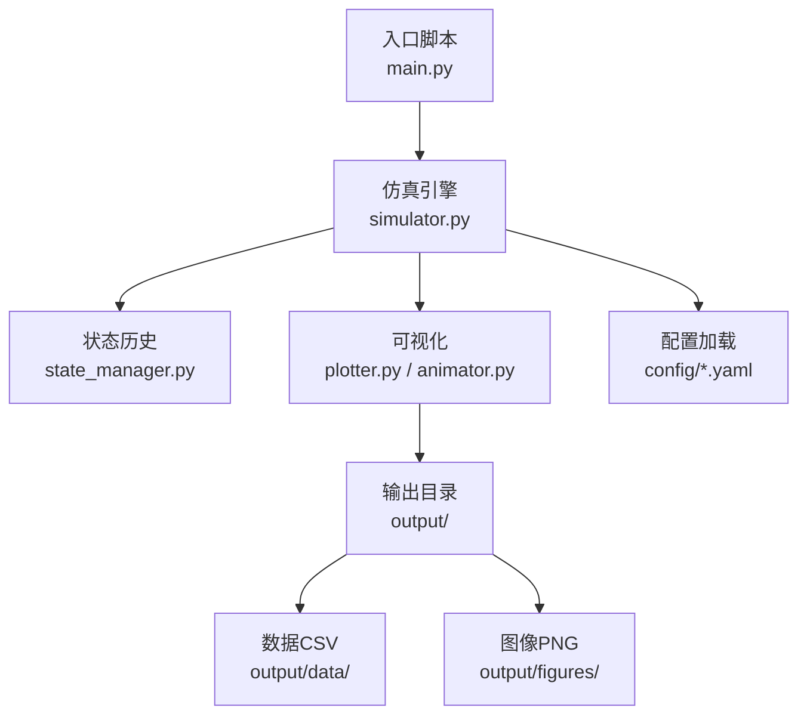
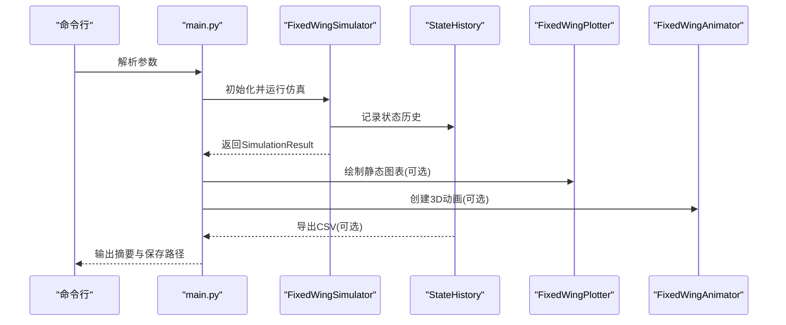
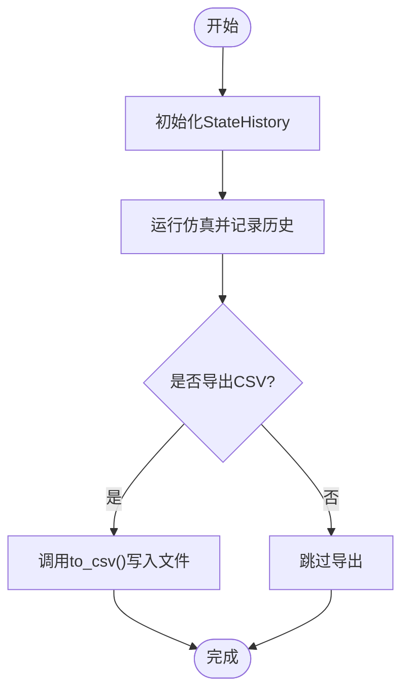
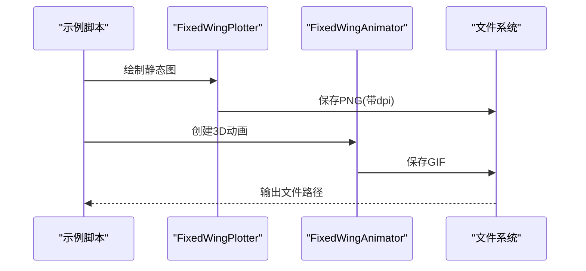
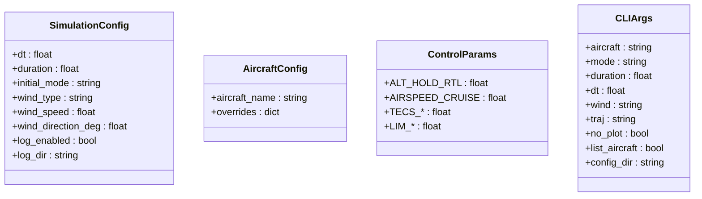
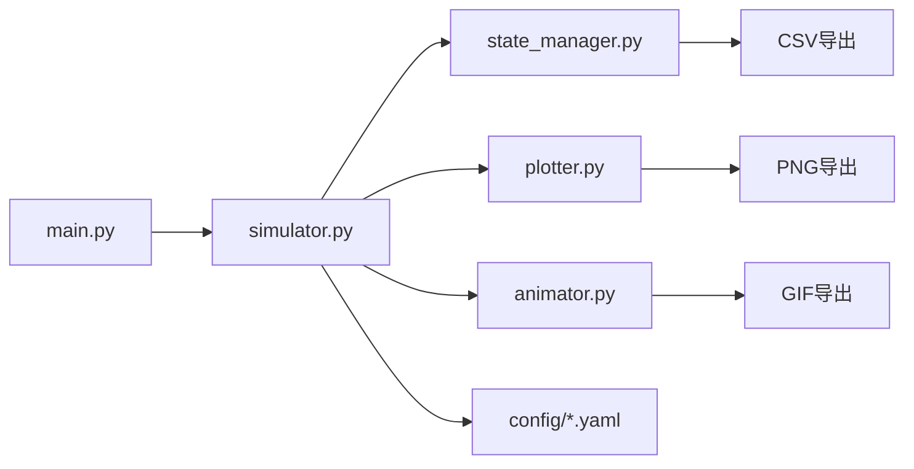

# 结果导出与文件管理

<cite>
**本文档引用的文件**
- [main.py](file://main.py)
- [simulator.py](file://src/simulation/simulator.py)
- [state_manager.py](file://src/simulation/state_manager.py)
- [plotter.py](file://src/visualization/plotter.py)
- [animator.py](file://src/visualization/animator.py)
- [logger.py](file://src/utils/logger.py)
- [simulation.yaml](file://config/simulation.yaml)
- [aircraft.yaml](file://config/aircraft.yaml)
- [control_params.yaml](file://config/control_params.yaml)
- [example_1_linear_response.py](file://examples/example_1_linear_response.py)
- [example_2_nonlinear_dynamics.py](file://examples/example_2_nonlinear_dynamics.py)
- [example3_TB2_trajectory.csv](file://output/data/example3_TB2_trajectory.csv)
- [example4_TB2_circuit.csv](file://output/data/example4_TB2_circuit.csv)
- [example4_TB2_altitude_throttle.png](file://output/figures/example4_TB2_altitude_throttle.png)
</cite>

## 目录
1. [简介](#简介)
2. [项目结构](#项目结构)
3. [核心组件](#核心组件)
4. [架构总览](#架构总览)
5. [详细组件分析](#详细组件分析)
6. [依赖关系分析](#依赖关系分析)
7. [性能考虑](#性能考虑)
8. [故障排除指南](#故障排除指南)
9. [结论](#结论)
10. [附录](#附录)

## 简介
本文件面向FixedWingSimulator的“结果导出与文件管理”主题，系统化阐述仿真结果的存储格式、导出方法、输出组织结构与命名规范、配置项与批量处理能力、文件管理最佳实践、二次处理流程以及大文件与性能优化建议。文档基于仓库现有实现进行归纳总结，并提供可操作的改进建议与可视化图示。

## 项目结构
项目采用模块化分层设计：入口脚本负责参数解析与运行调度；仿真引擎封装状态历史记录与导出；可视化模块提供图表与动画保存；配置文件集中管理仿真参数与环境设置；示例脚本展示CSV与PNG的自动保存流程；输出目录按数据与图表两类组织。

**图表来源**
- [main.py](file://main.py#L98-L141)
- [simulator.py](file://src/simulation/simulator.py#L239-L567)
- [state_manager.py](file://src/simulation/state_manager.py#L95-L193)
- [plotter.py](file://src/visualization/plotter.py#L161-L244)
- [animator.py](file://src/visualization/animator.py#L25-L150)

**章节来源**
- [main.py](file://main.py#L1-L145)
- [simulation.yaml](file://config/simulation.yaml#L1-L30)
- [aircraft.yaml](file://config/aircraft.yaml#L1-L13)
- [control_params.yaml](file://config/control_params.yaml#L1-L45)

## 核心组件
- 仿真结果容器与导出
  - SimulationResult：封装StateHistory与摘要信息，提供可视化接口。
  - StateHistory：高效预分配数组记录仿真历史，支持CSV导出。
- 可视化与动画
  - FixedWingPlotter：Matplotlib/Plotly双栈绘图，支持多子图与时序响应。
  - FixedWingAnimator：3D轨迹动画，支持GIF保存。
- 日志与配置
  - logger：统一日志输出，支持文件落盘。
  - simulation.yaml、aircraft.yaml、control_params.yaml：仿真、飞机与控制参数集中配置。

**章节来源**
- [simulator.py](file://src/simulation/simulator.py#L59-L109)
- [state_manager.py](file://src/simulation/state_manager.py#L95-L193)
- [plotter.py](file://src/visualization/plotter.py#L161-L244)
- [animator.py](file://src/visualization/animator.py#L25-L150)
- [logger.py](file://src/utils/logger.py#L10-L44)

## 架构总览
下图展示了从入口到结果导出的关键流程：命令行参数驱动仿真引擎，引擎在运行过程中记录状态历史，最终通过可视化模块保存图表与动画，并由StateHistory导出CSV数据。

**图表来源**
- [main.py](file://main.py#L98-L141)
- [simulator.py](file://src/simulation/simulator.py#L239-L567)
- [state_manager.py](file://src/simulation/state_manager.py#L179-L193)
- [plotter.py](file://src/visualization/plotter.py#L161-L244)
- [animator.py](file://src/visualization/animator.py#L25-L150)

## 详细组件分析

### 数据导出与CSV格式
- 导出接口
  - StateHistory.to_csv(path)：将历史记录写入CSV，列顺序遵循STATE_KEYS定义。
  - 示例脚本中使用to_csv或自定义np.savetxt保存不同场景的CSV文件。
- 文件命名规范
  - 命名模式：exampleN_<机型>_<任务描述>.csv
  - 示例：example3_TB2_trajectory.csv、example4_TB2_circuit.csv
- 列字段
  - 时间序列与状态变量：t、u、v、w、p、q、r、phi、theta、psi、x_north、x_east、x_down、alpha、beta、airspeed、altitude
  - 控制输入：elevator、aileron、rudder、throttle
  - 目标位置：des_north、des_east、des_down
- 批量处理
  - 示例脚本演示了批量生成CSV与PNG的流程，便于批量化运行与对比分析。

**图表来源**
- [state_manager.py](file://src/simulation/state_manager.py#L179-L193)
- [example_1_linear_response.py](file://examples/example_1_linear_response.py#L112-L123)
- [example_2_nonlinear_dynamics.py](file://examples/example_2_nonlinear_dynamics.py#L110-L120)

**章节来源**
- [state_manager.py](file://src/simulation/state_manager.py#L95-L193)
- [example_1_linear_response.py](file://examples/example_1_linear_response.py#L112-L123)
- [example_2_nonlinear_dynamics.py](file://examples/example_2_nonlinear_dynamics.py#L110-L120)

### 图像文件导出与命名规范
- 导出方式
  - Matplotlib绘图：通过plotter.py的Matplotlib接口保存PNG，支持dpi设置与布局优化。
  - 动画导出：animator.py支持将3D轨迹动画保存为GIF。
- 文件命名规范
  - 命名模式：exampleN_<机型>_<任务描述>.png 或 .gif
  - 示例：example4_TB2_altitude_throttle.png、example4_TB2_circuit_2d.png
- 分辨率与质量
  - 支持dpi参数调整（示例脚本默认150），可通过配置文件或调用参数控制。

**图表来源**
- [plotter.py](file://src/visualization/plotter.py#L161-L244)
- [animator.py](file://src/visualization/animator.py#L25-L150)
- [example_1_linear_response.py](file://examples/example_1_linear_response.py#L202-L202)
- [example_2_nonlinear_dynamics.py](file://examples/example_2_nonlinear_dynamics.py#L211-L211)

**章节来源**
- [plotter.py](file://src/visualization/plotter.py#L161-L244)
- [animator.py](file://src/visualization/animator.py#L25-L150)
- [example_1_linear_response.py](file://examples/example_1_linear_response.py#L202-L202)
- [example_2_nonlinear_dynamics.py](file://examples/example_2_nonlinear_dynamics.py#L211-L211)

### 输出目录组织与分类管理
- 目录结构
  - output/data：存放CSV数据文件
  - output/figures：存放PNG/GIF图像文件
- 分类策略
  - 按任务类型与机型分类，便于检索与对比分析
  - 建议在项目根目录新增README说明目录用途与命名约定

**章节来源**
- [example_1_linear_response.py](file://examples/example_1_linear_response.py#L42-L46)
- [example_2_nonlinear_dynamics.py](file://examples/example_2_nonlinear_dynamics.py#L42-L46)

### 配置选项与参数控制
- 仿真配置
  - simulation.yaml：dt、duration、初始姿态、风场类型与强度、日志开关与目录等
- 飞机配置
  - aircraft.yaml：机型选择与参数覆盖
- 控制参数
  - control_params.yaml：飞控PID、TECS、限幅等参数
- 命令行参数
  - main.py：支持机型、飞行模式、时长、步长、风场、轨迹类型、禁用绘图、列出机型等

**图表来源**
- [simulation.yaml](file://config/simulation.yaml#L1-L30)
- [aircraft.yaml](file://config/aircraft.yaml#L1-L13)
- [control_params.yaml](file://config/control_params.yaml#L1-L45)
- [main.py](file://main.py#L32-L95)

**章节来源**
- [simulation.yaml](file://config/simulation.yaml#L1-L30)
- [aircraft.yaml](file://config/aircraft.yaml#L1-L13)
- [control_params.yaml](file://config/control_params.yaml#L1-L45)
- [main.py](file://main.py#L32-L95)

### 文件管理最佳实践
- 存储空间优化
  - 合理设置dt与duration，避免冗余采样
  - 使用to_csv时仅导出必要列，减少文件体积
- 备份策略
  - 建议定期归档output目录，区分“临时结果”与“正式报告”
- 版本控制
  - 将配置文件纳入版本控制，将输出文件排除或单独管理
- 命名一致性
  - 强制使用统一命名模板，便于自动化脚本处理

[本节为通用实践建议，不直接分析具体文件]

### 二次处理与报告生成
- 数据导入
  - CSV可直接用pandas等工具读取，列名与顺序与STATE_KEYS一致
- 图表重建
  - 可复用plotter.py中的绘图逻辑，或基于Matplotlib独立绘制
- 报告生成
  - 基于SimulationResult.summary()与CSV数据，结合图表，形成对比分析报告

**章节来源**
- [state_manager.py](file://src/simulation/state_manager.py#L179-L193)
- [simulator.py](file://src/simulation/simulator.py#L78-L90)

## 依赖关系分析
- 组件耦合
  - main.py依赖simulator.py；simulator.py依赖state_manager.py与可视化模块；可视化模块依赖Matplotlib/Plotly；配置文件被simulator.py加载。
- 关键依赖链
  - CLI → FixedWingSimulator → StateHistory → CSV导出
  - CLI → FixedWingSimulator → 可视化模块 → 图像/GIF导出

**图表来源**
- [main.py](file://main.py#L98-L141)
- [simulator.py](file://src/simulation/simulator.py#L239-L567)
- [state_manager.py](file://src/simulation/state_manager.py#L95-L193)
- [plotter.py](file://src/visualization/plotter.py#L161-L244)
- [animator.py](file://src/visualization/animator.py#L25-L150)

**章节来源**
- [main.py](file://main.py#L98-L141)
- [simulator.py](file://src/simulation/simulator.py#L239-L567)

## 性能考虑
- 内存与I/O
  - StateHistory采用预分配数组，减少动态扩容开销；导出CSV前trim去除尾部空位，降低文件大小。
- 可视化性能
  - Matplotlib后端可切换为非GUI模式（如Agg）用于批量导出；动画保存时可调整num_frames与dpi以平衡质量与体积。
- 大文件处理
  - 建议分段导出或抽稀采样；对长时间仿真，优先导出关键阶段或统计摘要。

**章节来源**
- [state_manager.py](file://src/simulation/state_manager.py#L170-L174)
- [plotter.py](file://src/visualization/plotter.py#L161-L195)
- [animator.py](file://src/visualization/animator.py#L25-L43)

## 故障排除指南
- 导出失败
  - 检查目标目录权限与磁盘空间；确认路径存在且可写。
- 图像保存异常
  - 若后端无GUI环境，需使用非交互式后端（如Agg）；确保dpi与布局参数合理。
- 日志定位
  - 使用logger模块输出运行日志，定位错误发生的时间点与模块。

**章节来源**
- [logger.py](file://src/utils/logger.py#L10-L44)
- [plotter.py](file://src/visualization/plotter.py#L186-L195)

## 结论
本项目已具备完善的CSV与图像导出能力，配合清晰的目录结构与命名规范，能够满足日常仿真结果的批量管理与二次处理需求。建议在现有基础上补充配置化导出参数、自动化批处理脚本与版本化输出管理，以进一步提升大规模仿真的可维护性与可追溯性。

## 附录
- 输出示例文件
  - CSV：example3_TB2_trajectory.csv、example4_TB2_circuit.csv
  - PNG：example4_TB2_altitude_throttle.png
- 示例脚本参考
  - example_1_linear_response.py、example_2_nonlinear_dynamics.py

**章节来源**
- [example3_TB2_trajectory.csv](file://output/data/example3_TB2_trajectory.csv)
- [example4_TB2_circuit.csv](file://output/data/example4_TB2_circuit.csv)
- [example4_TB2_altitude_throttle.png](file://output/figures/example4_TB2_altitude_throttle.png)
- [example_1_linear_response.py](file://examples/example_1_linear_response.py#L1-L206)
- [example_2_nonlinear_dynamics.py](file://examples/example_2_nonlinear_dynamics.py#L1-L215)