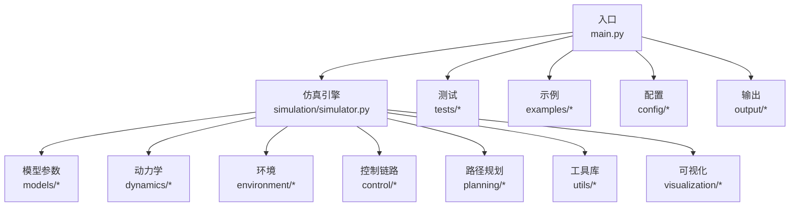
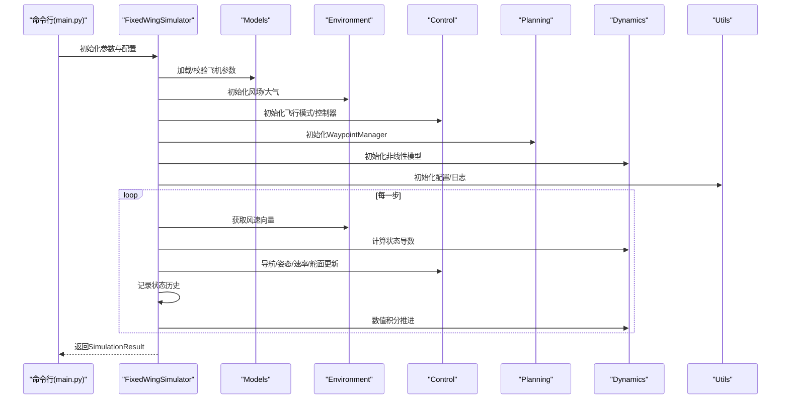
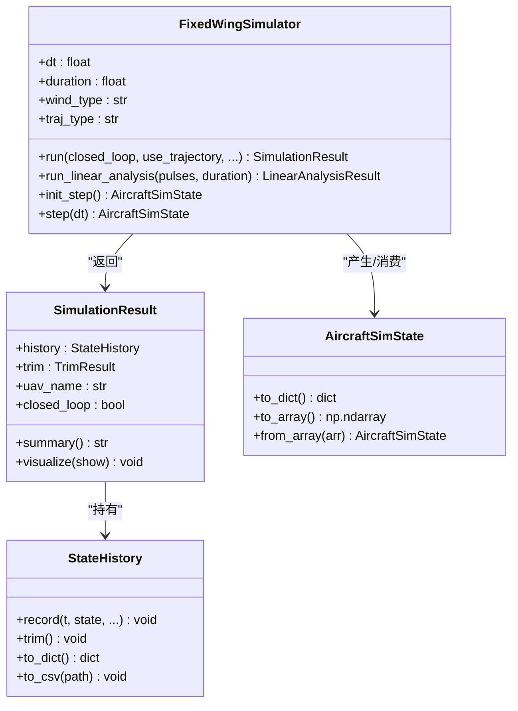
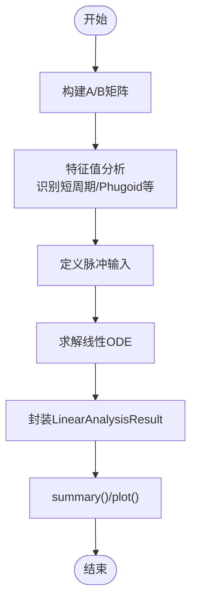
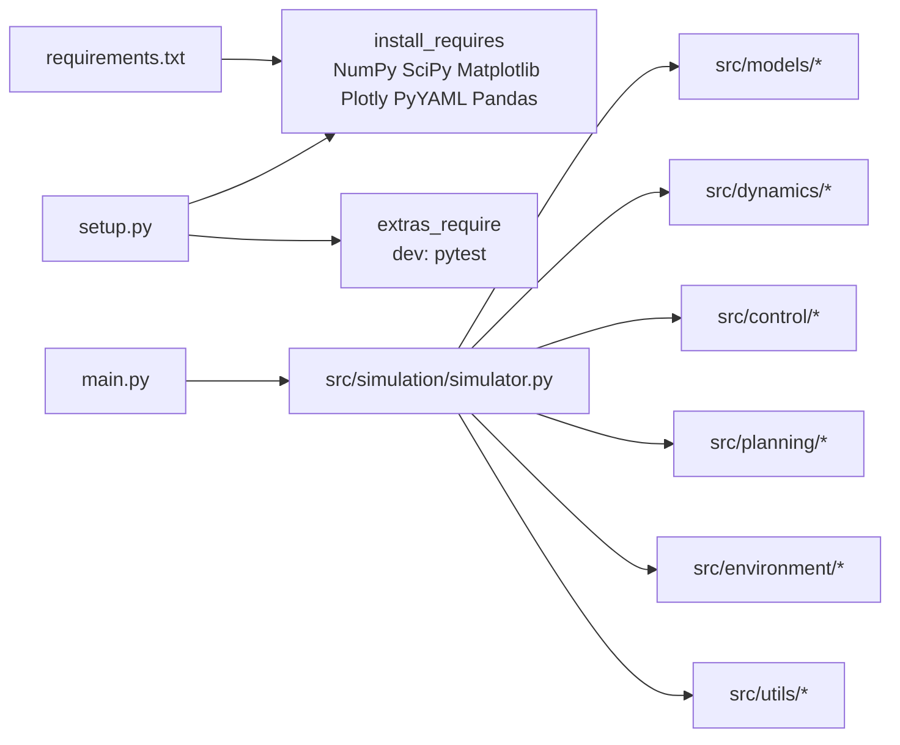

# 代码规范与结构

<cite>
**本文引用的文件**
- [setup.py](file://setup.py)
- [requirements.txt](file://requirements.txt)
- [main.py](file://main.py)
- [src/simulation/simulator.py](file://src/simulation/simulator.py)
- [src/models/aircraft_database.py](file://src/models/aircraft_database.py)
- [src/control/attitude_controller.py](file://src/control/attitude_controller.py)
- [src/dynamics/linear_model.py](file://src/dynamics/linear_model.py)
- [src/planning/waypoint_manager.py](file://src/planning/waypoint_manager.py)
- [src/environment/wind_model.py](file://src/environment/wind_model.py)
- [src/utils/math_utils.py](file://src/utils/math_utils.py)
- [src/utils/logger.py](file://src/utils/logger.py)
- [tests/test_integration.py](file://tests/test_integration.py)
- [examples/example_1_linear_response.py](file://examples/example_1_linear_response.py)
</cite>

## 目录
1. [引言](#引言)
2. [项目结构](#项目结构)
3. [核心组件](#核心组件)
4. [架构总览](#架构总览)
5. [详细组件分析](#详细组件分析)
6. [依赖分析](#依赖分析)
7. [性能考虑](#性能考虑)
8. [故障排查指南](#故障排查指南)
9. [结论](#结论)
10. [附录：代码规范与最佳实践](#附录代码规范与最佳实践)

## 引言
本文件面向FixedWingSimulator项目，系统化梳理其模块组织原则、包结构设计、模块命名约定、文件组织方式，并解释各子包（如simulation、dynamics、control、models等）的功能定位与相互关系。同时提供代码注释规范、变量命名规则、常量定义规范、导入顺序、代码风格指南、异常处理模式、错误信息格式与日志记录规范，并给出代码审查检查清单与最佳实践建议。

## 项目结构
项目采用“按功能域分层”的包结构，顶层入口为main.py，核心逻辑集中在src/下，测试位于tests/，示例位于examples/，配置位于config/，输出结果保存在output/。

- 包结构与职责
  - src/simulation：仿真引擎与状态管理，负责集成器、状态历史、主仿真循环与结果封装。
  - src/dynamics：动力学模型，包含线性与非线性6自由度模型、坐标变换与气动计算。
  - src/control：控制链路，ArduPilot兼容的飞行模式管理、导航控制器、姿态/速率控制器、舵面混合器与TECS控制器。
  - src/planning：路径规划与轨迹生成，WaypointManager与多种轨迹类型（最小Snap/最小Jerk等）。
  - src/environment：环境建模，风场、大气密度等。
  - src/models：飞机参数数据库与工厂，提供参数注入与派生字段。
  - src/utils：通用工具库，数学工具、配置加载、日志封装。
  - src/visualization：可视化组件（绘图与动画），由仿真结果驱动。
  - tests：集成测试，覆盖端到端稳定性、数值收敛与API一致性。
  - examples：示例脚本，演示典型用法与数据导出。
  - config：运行时配置（仿真、控制参数、轨迹等）。
  - output：运行输出（数据CSV与图像PNG）。

图表来源
- [main.py](file://main.py#L1-L145)
- [src/simulation/simulator.py](file://src/simulation/simulator.py#L1-L642)

章节来源
- [main.py](file://main.py#L1-L145)
- [setup.py](file://setup.py#L1-L23)

## 核心组件
- FixedWingSimulator：主仿真器，编排模型、环境、控制、规划、仿真与可视化；支持闭环/开环、线性分析与步进接口。
- AircraftFactory/AircraftConfig：从数据库创建并注入派生参数。
- LinearModel/NonlinearModel：线性4自由度与非线性6自由度动力学模型。
- FlightModeManager/NavigationController/AttitudeController/RateController/ServoMixer/TECS：ArduPilot兼容的五层控制链。
- WaypointManager：航路点管理与轨迹构建。
- Wind/Atmosphere：风场与大气密度模型。
- MathUtils/Logger：数学工具与日志封装。
- SimulationResult/StateHistory/AircraftSimState：结果容器与状态历史记录。

章节来源
- [src/simulation/simulator.py](file://src/simulation/simulator.py#L1-L642)
- [src/models/aircraft_database.py](file://src/models/aircraft_database.py#L1-L183)
- [src/dynamics/linear_model.py](file://src/dynamics/linear_model.py#L1-L319)
- [src/planning/waypoint_manager.py](file://src/planning/waypoint_manager.py#L1-L208)
- [src/environment/wind_model.py](file://src/environment/wind_model.py#L1-L113)
- [src/utils/math_utils.py](file://src/utils/math_utils.py#L1-L124)
- [src/utils/logger.py](file://src/utils/logger.py#L1-L44)

## 架构总览
FixedWingSimulator采用“主控-子系统”架构：主控模块负责初始化、参数加载、控制链路与仿真循环；各子系统通过明确接口交互，耦合度低、内聚性强。控制链路遵循ArduPilot层级：导航（Waypoint/轨迹）→ 航迹保持（L1）→ TECS高度/能量控制 → 姿态/速率控制 → 舵面混合。

图表来源
- [main.py](file://main.py#L98-L145)
- [src/simulation/simulator.py](file://src/simulation/simulator.py#L239-L567)

## 详细组件分析

### 仿真引擎（simulation/simulator.py）
- 设计理念
  - 单一职责：编排所有子系统，提供run/run_linear_analysis/init_step/step等公共接口。
  - 可插拔：控制参数来自ArduPilot兼容参数集，可热加载；轨迹类型可切换。
  - 稳定性：内置数值积分器与状态裁剪，异常捕获与早停。
- 关键流程
  - 参数加载：配置目录解析、控制参数校验、风场初始化。
  - 控制链初始化：飞行模式管理、导航控制器（含TECS）、姿态/速率控制器、舵面混合器。
  - 仿真循环：根据是否使用轨迹或航路点序列，计算目标状态，经控制链生成舵面指令，推进ODE求解。
  - 结果封装：返回SimulationResult，包含历史、修剪结果与摘要方法。
- 数据结构
  - SimulationResult：封装StateHistory与trim结果，提供summary/visualize。
  - AircraftSimState/StateHistory：状态向量与历史记录，支持to_dict/to_csv等导出。

图表来源
- [src/simulation/simulator.py](file://src/simulation/simulator.py#L59-L128)

章节来源
- [src/simulation/simulator.py](file://src/simulation/simulator.py#L1-L642)

### 飞机参数数据库（models/aircraft_database.py）
- 设计理念
  - 完整保留原始项目参数字典结构，扩展ArduPilot所需派生字段（如U0、rho、q_bar）。
  - 提供安全访问器与信息汇总，便于上层直接查询。
- 关键点
  - 常量定义：重力、海平面密度、气体常数、比热比、声速。
  - 参数注入：在获取参数后注入派生值，确保动力学模块可用。
  - 列表与枚举：AIRCRAFT_NAMES用于命令行与运行时选择。

章节来源
- [src/models/aircraft_database.py](file://src/models/aircraft_database.py#L1-L183)

### 线性动力学模型（dynamics/linear_model.py）
- 设计理念
  - 4自由度纵向线性化状态空间，支持特征值模态分析与脉冲响应仿真。
  - 输出LinearAnalysisResult，包含时间历程、模态列表与快速绘图接口。
- 关键流程
  - build：构造A/B矩阵与参考速度U0。
  - analyze_modes：特征值分解，识别短周期、长周期（Phugoid）等模式。
  - simulate：求解线性系统响应，支持多脉冲输入。
  - run_analysis：完整管线封装。

图表来源
- [src/dynamics/linear_model.py](file://src/dynamics/linear_model.py#L107-L319)

章节来源
- [src/dynamics/linear_model.py](file://src/dynamics/linear_model.py#L1-L319)

### 控制链（control/*）
- 姿态控制器（AttitudeController）
  - 三轴独立PID，分别对应ROLL_P、PTCH_P，无D项；输出期望角速度。
  - 支持角度误差归一化与限幅。
- 飞行模式管理（FlightModeManager）
  - 统一管理飞行模式（MANUAL、STABILIZE、FBW_A、FBW_B、AUTO、LOITER、RTH），转换时重置控制器积分。
- 导航控制器（NavigationController）
  - L1航迹跟踪与TECS能量/高度控制结合，支持航路点序列与轨迹跟踪两种模式。
- 舵面混合（ServoMixer）
  - 将控制输出映射为舵面偏角（含配平修正）。

章节来源
- [src/control/attitude_controller.py](file://src/control/attitude_controller.py#L1-L134)

### 路径规划（planning/waypoint_manager.py）
- 功能
  - 航路点增删改查、从YAML加载/保存、轨迹构建与缓存、活动航段查询。
  - 支持minimum_snap与minimum_jerk两类轨迹，支持回环与航向模式。
- 设计要点
  - 内部统一NED坐标系存储，外部Altitude正向上与NED向下转换。
  - 缓存策略：航路点变更即失效缓存，首次调用再构建轨迹。

章节来源
- [src/planning/waypoint_manager.py](file://src/planning/waypoint_manager.py#L1-L208)

### 环境建模（environment/*）
- 风场（Wind）
  - 支持NONE/FIXED/SINE/RANDOMSINE四种类型；固定风向为FROM方向（与气象一致）。
  - 提前计算NED单位向量，提高实时采样效率。
- 大气密度（atmosphere_model）
  - 通过utils.math_utils.compute_density提供密度随海拔变化。

章节来源
- [src/environment/wind_model.py](file://src/environment/wind_model.py#L1-L113)
- [src/utils/math_utils.py](file://src/utils/math_utils.py#L121-L124)

### 工具库（utils/*）
- 数学工具（math_utils）
  - 角度归一化、饱和、旋转矩阵、欧拉角率转换、AOA/侧滑角、动态压强等。
- 日志（logger）
  - 统一日志器工厂，支持控制台与文件输出，自动按日期创建日志文件。

章节来源
- [src/utils/math_utils.py](file://src/utils/math_utils.py#L1-L124)
- [src/utils/logger.py](file://src/utils/logger.py#L1-L44)

### 示例与测试
- 示例脚本（examples/*）
  - 展示线性分析与闭环对比、轨迹生成与可视化、数据导出等典型用法。
- 集成测试（tests/test_integration.py）
  - 覆盖开环/闭环稳定性、轨迹跟踪、线性分析兼容性、步进API一致性与状态历史完整性。

章节来源
- [examples/example_1_linear_response.py](file://examples/example_1_linear_response.py#L1-L206)
- [tests/test_integration.py](file://tests/test_integration.py#L1-L391)

## 依赖分析
- 运行时依赖
  - NumPy、SciPy、Matplotlib、Plotly、PyYAML、Pandas。
- 开发依赖
  - pytest（dev extras）。
- 包发现与安装
  - 使用setuptools在src目录下自动发现包，Python版本要求>=3.10。

图表来源
- [setup.py](file://setup.py#L1-L23)
- [requirements.txt](file://requirements.txt#L1-L8)
- [main.py](file://main.py#L25-L31)

章节来源
- [setup.py](file://setup.py#L1-L23)
- [requirements.txt](file://requirements.txt#L1-L8)

## 性能考虑
- 数值积分
  - 使用Dopri5Integrator进行自适应步长积分，建议合理设置dt与duration，避免过小步长导致计算开销过大。
- 状态记录
  - StateHistory预分配数组长度，减少内存重分配；记录频率与dt匹配。
- 控制链
  - PID控制器与饱和器在高频更新场景中应避免频繁重算，必要时缓存中间结果。
- 可视化
  - 批处理运行时建议禁用GUI窗口，使用非交互式后端（如Agg）保存图片，降低I/O与渲染成本。
- 线性分析
  - 特征值分析与矩阵求解为O(n^3)，建议在调试阶段使用较小duration与简化参数集。

## 故障排查指南
- 常见问题
  - 飞行器发散：检查初始模式、风场设置、轨迹航路点高度与起始位置一致性；确认TECS巡航油门已自动校准。
  - 控制器不生效：确认飞行模式处于闭环且未进入直连模式；检查控制参数YAML是否存在且有效。
  - 轨迹构建失败：至少需要两个航路点；若启用回环，首末航路点需近似重合。
  - 线性分析异常：确认参数数据库中飞机名称正确，派生字段已注入。
- 排查步骤
  - 启用日志：使用utils.logger获取详细时间戳与模块级信息。
  - 逐步缩小：先运行开环trim-hold验证动力学稳定性，再逐步加入控制与轨迹。
  - 对比验证：使用示例脚本对比开环与闭环响应，定位控制链环节。
- 错误处理模式
  - 主仿真器在积分过程中捕获RuntimeError并打印时间戳后停止，避免静默崩溃。
  - 参数校验：Unknown aircraft、Unknown wind type、Invalid trajectory type等均抛出明确异常。

章节来源
- [src/simulation/simulator.py](file://src/simulation/simulator.py#L558-L567)
- [src/environment/wind_model.py](file://src/environment/wind_model.py#L39-L42)
- [src/planning/waypoint_manager.py](file://src/planning/waypoint_manager.py#L139-L141)
- [src/utils/logger.py](file://src/utils/logger.py#L10-L44)

## 结论
本项目以清晰的模块边界与ArduPilot兼容的控制链为核心，实现了从线性分析到6自由度非线性仿真、从航路点到轨迹的全栈能力。通过严格的参数注入、日志与测试体系，保证了工程可用性与可维护性。建议在后续迭代中进一步完善单元测试覆盖率、文档字符串补充与静态检查工具集成。

## 附录：代码规范与最佳实践

### 模块组织与命名约定
- 包结构
  - 按功能域划分：simulation、dynamics、control、planning、environment、models、utils、visualization。
  - 子包内部以功能命名文件，如linear_model.py、nonlinear_model.py、attitude_controller.py等。
- 文件命名
  - 使用蛇形命名（snake_case），避免驼峰或帕斯卡命名混用。
  - 测试文件以test_前缀，示例文件以example_前缀。
- 导入顺序
  - 标准库 → 第三方库 → 项目内相对导入（同级或兄弟包），每组之间以空行分隔。
  - 同组内按字母序排列，避免未使用的导入。

章节来源
- [src/simulation/simulator.py](file://src/simulation/simulator.py#L33-L52)
- [src/control/attitude_controller.py](file://src/control/attitude_controller.py#L15-L22)

### 注释与文档规范
- 模块文档字符串
  - 每个模块顶部添加简洁描述，说明用途、支持的模式与主要接口。
- 类与函数文档字符串
  - 使用Google/NumPy风格，包含：简述、参数（类型与含义）、返回值、异常。
  - 对于复杂算法或关键公式，提供参考文献或注释链接。
- 示例与用法
  - 在示例脚本中展示典型调用路径与输出文件命名，便于复现。

章节来源
- [src/simulation/simulator.py](file://src/simulation/simulator.py#L1-L16)
- [src/dynamics/linear_model.py](file://src/dynamics/linear_model.py#L1-L16)
- [examples/example_1_linear_response.py](file://examples/example_1_linear_response.py#L1-L20)

### 变量与常量命名
- 变量
  - 使用语义化小写蛇形命名，如dt、duration、wind_type、ctrl_target。
  - 矩阵/向量使用全小写，必要时加维度后缀（如A、B、y、de）。
- 常量
  - 全大写蛇形命名，如MAX_ROLL_RATE、G、RHO0；物理常量集中定义于模块顶部。
- 类型提示
  - 函数签名与类属性均提供类型注解，保持一致性。

章节来源
- [src/control/attitude_controller.py](file://src/control/attitude_controller.py#L45-L48)
- [src/models/aircraft_database.py](file://src/models/aircraft_database.py#L14-L27)

### 代码风格指南
- 缩进与行宽
  - 使用4空格缩进；单行不超过100字符，必要时换行并缩进。
- 空行
  - 函数/类之间留两空行；逻辑分组内留一空行；注释前留一空行。
- 字符串与注释
  - 文档字符串使用三引号；行内注释与代码至少2空格间隔。
- 异常与返回
  - 明确抛出具体异常类型；函数尽早返回，避免深层嵌套。

章节来源
- [src/utils/logger.py](file://src/utils/logger.py#L25-L28)

### 异常处理与错误信息
- 异常类型
  - 参数非法：ValueError/KeyError；文件缺失：FileNotFoundError；未实现：NotImplementedError。
- 错误信息格式
  - 包含上下文（参数名、取值范围、可用选项），示例：Unknown aircraft、Unknown wind type。
- 日志记录
  - 使用logger记录关键事件与错误；控制台与文件双通道输出，时间戳精确到秒。

章节来源
- [src/environment/wind_model.py](file://src/environment/wind_model.py#L39-L42)
- [src/utils/logger.py](file://src/utils/logger.py#L10-L44)

### 代码审查检查清单
- 结构与职责
  - 是否遵循单一职责？模块边界是否清晰？
  - 是否存在循环依赖或跨包强耦合？
- 接口与契约
  - 类型注解是否完整？默认参数是否合理？
  - 公共方法是否具备前置条件检查与异常声明？
- 稳定性与健壮性
  - 是否处理数值不稳定与奇异情况（如角度奇异、除零）？
  - 是否有超限保护与饱和处理？
- 可测试性
  - 是否提供最小可运行示例与断言点？
  - 集成测试是否覆盖关键路径与边界条件？
- 文档与可维护性
  - 是否有充分的模块/函数文档字符串？
  - 是否遵循导入顺序与命名约定？

### 最佳实践建议
- 分层设计
  - 控制链与动力学解耦，通过明确接口传递状态与目标。
- 配置优先
  - 将可调参数集中于YAML，避免硬编码；提供默认值与校验。
- 可观测性
  - 为关键模块增加日志级别区分；导出关键中间变量以便调试。
- 性能优化
  - 预计算与缓存（如风场固定向量、轨迹缓存）；避免在主循环中重复昂贵操作。
- 可移植性
  - 严格使用NumPy数组与向量化运算；避免平台相关依赖。