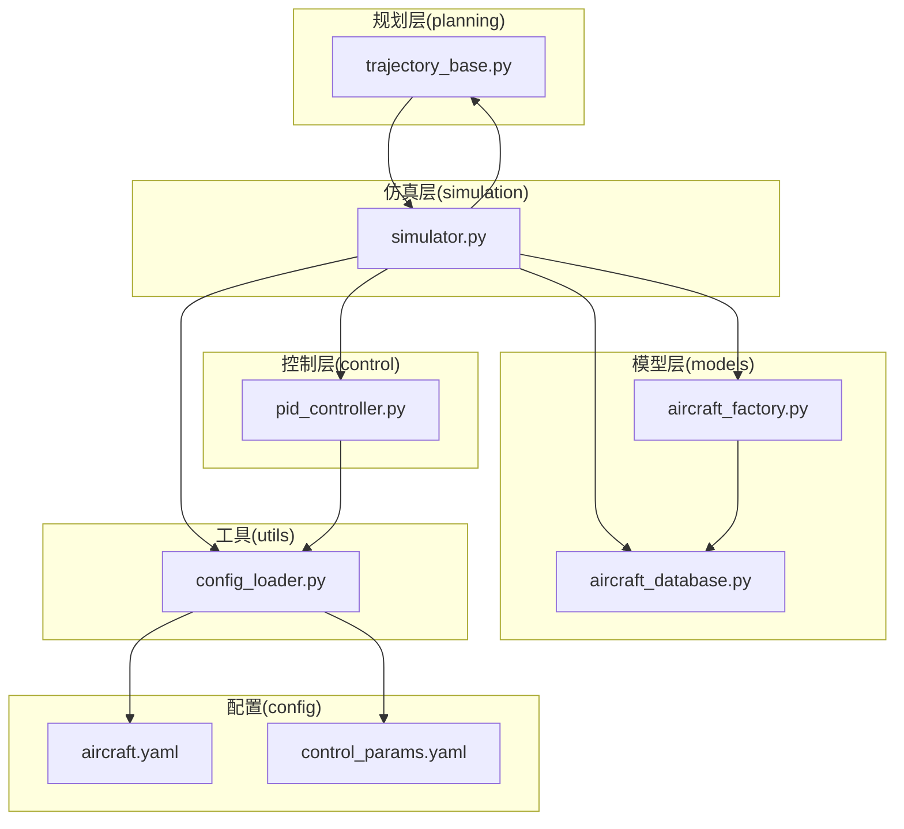
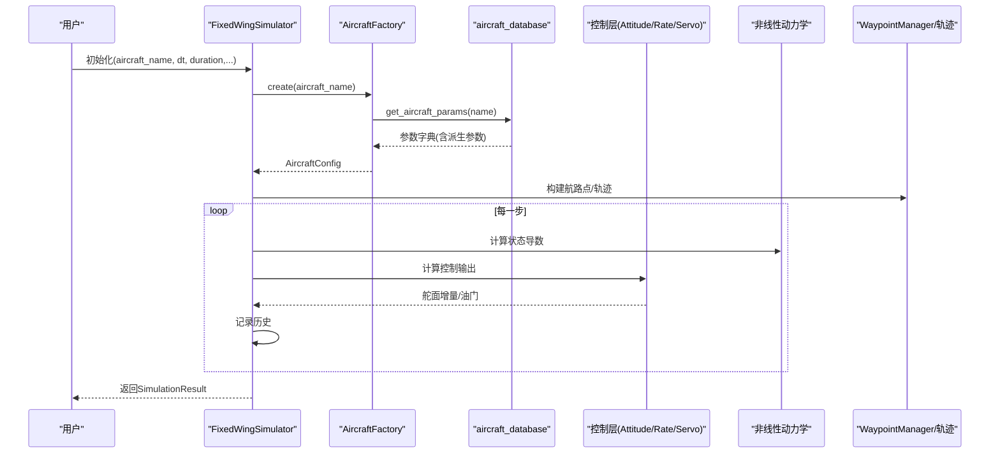
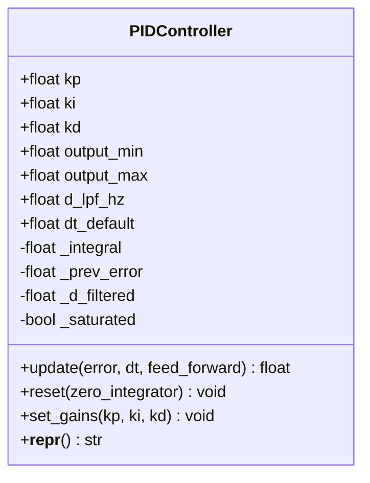
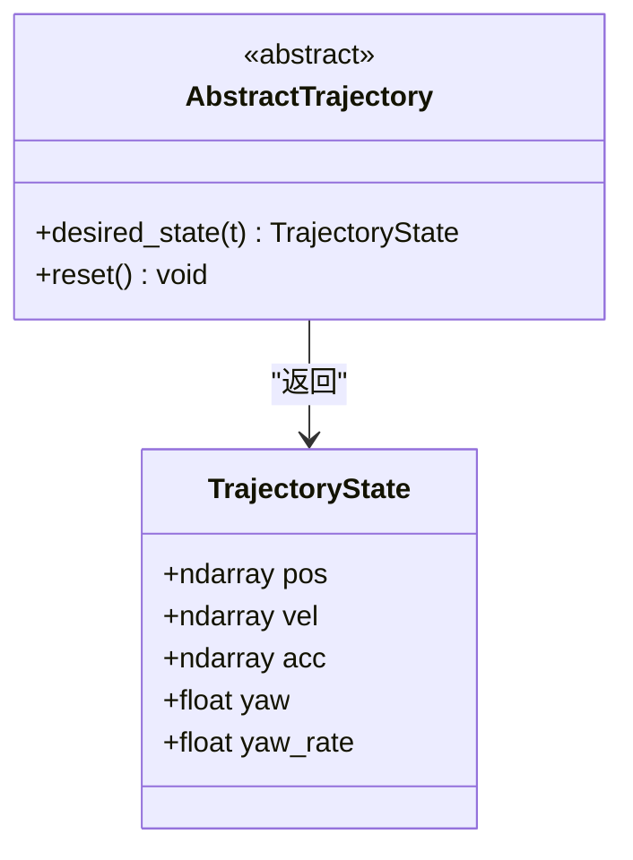
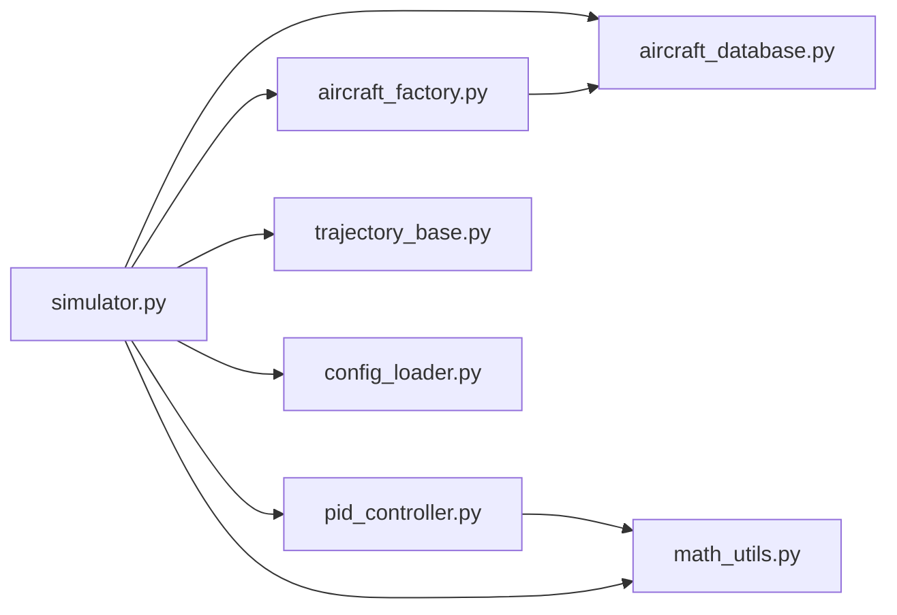

# 功能扩展指南

<cite>
**本文引用的文件**
- [aircraft_database.py](file://src/models/aircraft_database.py)
- [aircraft_factory.py](file://src/models/aircraft_factory.py)
- [pid_controller.py](file://src/control/pid_controller.py)
- [trajectory_base.py](file://src/planning/trajectory_base.py)
- [simulator.py](file://src/simulation/simulator.py)
- [config_loader.py](file://src/utils/config_loader.py)
- [aircraft.yaml](file://config/aircraft.yaml)
- [control_params.yaml](file://config/control_params.yaml)
- [test_control.py](file://tests/test_control.py)
- [test_planning.py](file://tests/test_planning.py)
- [example_1_linear_response.py](file://examples/example_1_linear_response.py)
- [example_5_different_aircraft.py](file://examples/example_5_different_aircraft.py)
</cite>

## 目录
1. [简介](#简介)
2. [项目结构](#项目结构)
3. [核心组件](#核心组件)
4. [架构总览](#架构总览)
5. [详细组件分析](#详细组件分析)
6. [依赖关系分析](#依赖关系分析)
7. [性能考量](#性能考量)
8. [故障排查指南](#故障排查指南)
9. [结论](#结论)
10. [附录](#附录)

## 简介
本指南面向需要在 FixedWingSimulator 中进行功能扩展的开发者，系统讲解如何：
- 向 aircraft_database 添加新的飞机配置，包括参数定义、工厂模式使用与配置验证机制
- 扩展控制算法（以 PIDController 为例），说明接口定义、参数配置与输出格式
- 扩展轨迹规划算法（以 AbstractTrajectory 为例），说明继承基类、实现必要接口与参数配置
- 完整的新模块集成流程：从接口设计到测试验证
- 在不破坏现有代码的前提下扩展现有功能，包括向后兼容性与 API 设计原则
- 提供可直接参考的扩展示例与最佳实践

## 项目结构
项目采用分层模块化组织，核心目录与职责如下：
- src/models：飞机参数数据库与工厂，负责参数加载、合并与导出
- src/control：控制层（ArduPilot 兼容的五层控制链）
- src/planning：轨迹规划与航路点管理
- src/simulation：仿真引擎与状态管理
- src/utils：通用工具（配置加载、数学工具等）
- config：配置文件（aircraft.yaml、control_params.yaml 等）
- tests：单元测试
- examples：使用示例脚本

图表来源
- [simulator.py](file://src/simulation/simulator.py#L130-L230)
- [aircraft_database.py](file://src/models/aircraft_database.py#L29-L133)
- [aircraft_factory.py](file://src/models/aircraft_factory.py#L39-L92)
- [pid_controller.py](file://src/control/pid_controller.py#L17-L117)
- [trajectory_base.py](file://src/planning/trajectory_base.py#L26-L47)
- [config_loader.py](file://src/utils/config_loader.py#L59-L82)

章节来源
- [simulator.py](file://src/simulation/simulator.py#L115-L230)
- [aircraft_database.py](file://src/models/aircraft_database.py#L29-L133)
- [aircraft_factory.py](file://src/models/aircraft_factory.py#L39-L92)
- [config_loader.py](file://src/utils/config_loader.py#L59-L82)

## 核心组件
- 飞机参数数据库与工厂
  - 数据库提供标准参数字典，并注入派生参数（如 U0、rho、q_bar）
  - 工厂支持从数据库读取、YAML 覆盖与字典覆盖，最终生成 AircraftConfig
- 控制层
  - PIDController 提供带抗饱和的离散 PID，支持微分低通滤波与前馈
  - ArduPilot 兼容参数加载与校验
- 规划层
  - AbstractTrajectory 定义统一接口 desired_state(t) → TrajectoryState
  - WaypointManager 负责航路点管理与轨迹构建
- 仿真引擎
  - FixedWingSimulator 组织各模块，支持闭环与开环运行

章节来源
- [aircraft_database.py](file://src/models/aircraft_database.py#L143-L183)
- [aircraft_factory.py](file://src/models/aircraft_factory.py#L39-L92)
- [pid_controller.py](file://src/control/pid_controller.py#L17-L117)
- [trajectory_base.py](file://src/planning/trajectory_base.py#L26-L47)
- [simulator.py](file://src/simulation/simulator.py#L115-L230)

## 架构总览
下图展示了从配置到仿真运行的关键交互路径。

图表来源
- [simulator.py](file://src/simulation/simulator.py#L130-L230)
- [aircraft_factory.py](file://src/models/aircraft_factory.py#L42-L74)
- [aircraft_database.py](file://src/models/aircraft_database.py#L143-L166)

章节来源
- [simulator.py](file://src/simulation/simulator.py#L239-L567)

## 详细组件分析

### 一、扩展飞机配置：向 aircraft_database 添加新机型
目标：在不破坏现有接口的前提下新增飞机参数，并通过工厂正确加载与覆盖。

步骤与要点
- 在数据库中新增条目
  - 使用与现有条目相同的键集合，确保类型一致
  - 必须包含质量、机翼面积、平均气动弦长、翼展、惯性矩等几何与气动参数
  - 可选加入 Mach 数，用于派生 U0、rho、q_bar
- 注入派生参数
  - get_aircraft_params 会自动注入 U0、rho、q_bar，确保动力学模块可用
- 工厂加载与覆盖
  - 支持 YAML 覆盖（overrides 键）与字典覆盖（param_overrides）
  - 字典覆盖优先级最高
- 配置文件与导出
  - aircraft.yaml 指定 aircraft_name；可通过 overrides 覆盖默认值
  - 工厂提供 export_ardupilot_params 导出 ArduPilot 参数文件

扩展示例（路径指引）
- 新增参数：参考现有条目键名与数值范围，添加到数据库字典中
  - 文件路径：[aircraft_database.py](file://src/models/aircraft_database.py#L29-L133)
- 注入派生参数逻辑
  - 文件路径：[aircraft_database.py](file://src/models/aircraft_database.py#L143-L166)
- 工厂创建与覆盖
  - 文件路径：[aircraft_factory.py](file://src/models/aircraft_factory.py#L42-L74)
- 配置文件示例
  - 文件路径：[aircraft.yaml](file://config/aircraft.yaml#L1-L13)
- ArduPilot 参数导出
  - 文件路径：[aircraft_factory.py](file://src/models/aircraft_factory.py#L95-L136)

最佳实践
- 保持参数命名与类型与现有条目一致，避免破坏下游模块假设
- 通过 tests 验证 get_aircraft_params 的返回完整性
- 使用 export_ardupilot_params 生成 .param 文件，便于硬件在环测试

章节来源
- [aircraft_database.py](file://src/models/aircraft_database.py#L143-L183)
- [aircraft_factory.py](file://src/models/aircraft_factory.py#L42-L92)
- [aircraft.yaml](file://config/aircraft.yaml#L1-L13)

### 二、扩展控制算法：以 PIDController 为例
目标：基于现有 PIDController 接口扩展新的控制类，保持输出格式与参数配置一致。

接口与参数
- 关键参数
  - kp、ki、kd：比例、积分、微分增益
  - output_min、output_max：输出饱和限幅
  - d_lpf_hz：微分低通滤波截止频率
  - dt：默认采样周期
- 方法
  - update(error, dt=None, feed_forward=0.0)：计算输出
  - reset(zero_integrator=True)：重置控制器状态
  - set_gains(kp=None, ki=None, kd=None)：动态调整增益
  - __repr__()：调试信息

输出格式
- 输出为标量（或按需扩展为向量），经 saturate 处理后返回
- 内部维护积分项、前一时刻误差、滤波后的微分项与饱和标志

扩展示例（路径指引）
- 类定义与更新逻辑
  - 文件路径：[pid_controller.py](file://src/control/pid_controller.py#L17-L117)
- 测试用例（行为约束）
  - 文件路径：[test_control.py](file://tests/test_control.py#L61-L148)

扩展建议
- 保持 update 返回值与 saturate 行为一致，避免上游模块适配成本
- 若需多变量控制，建议封装为向量输出并提供 to_radians 等转换方法
- 通过 reset 与 set_gains 实现模式切换与在线调节

图表来源
- [pid_controller.py](file://src/control/pid_controller.py#L17-L117)

章节来源
- [pid_controller.py](file://src/control/pid_controller.py#L17-L117)
- [test_control.py](file://tests/test_control.py#L61-L148)

### 三、扩展轨迹规划算法：以 AbstractTrajectory 为例
目标：实现新的轨迹类，遵循 AbstractTrajectory 接口，满足 desired_state(t) 返回 TrajectoryState。

接口定义
- 抽象方法
  - desired_state(t: float) -> TrajectoryState
- 可选方法
  - reset()：重置内部状态（如分段索引）

数据结构
- TrajectoryState 包含位置、速度、加速度（三维）、偏航角与偏航速率

扩展示例（路径指引）
- 抽象基类与数据结构
  - 文件路径：[trajectory_base.py](file://src/planning/trajectory_base.py#L16-L47)
- 测试用例（行为约束）
  - 文件路径：[test_planning.py](file://tests/test_planning.py#L122-L186)

扩展建议
- 在 desired_state 中处理边界条件（t<0 与 t>T_total）并返回 clamped 状态
- 确保位置、速度、加速度均为三维数组，偏航与偏航率标量
- 如需航向控制，可在 yaw_mode 下实现跟随/固定偏航策略

图表来源
- [trajectory_base.py](file://src/planning/trajectory_base.py#L16-L47)

章节来源
- [trajectory_base.py](file://src/planning/trajectory_base.py#L26-L47)
- [test_planning.py](file://tests/test_planning.py#L122-L186)

### 四、新模块集成的完整流程
从接口设计到测试验证的全流程

阶段一：接口设计与数据结构
- 明确输入输出类型（如 TrajectoryState、ServoOutput 等）
- 保证与现有模块的耦合点清晰（例如 update 接口、reset 语义）

阶段二：实现与配置加载
- 将新模块纳入包导出（如在 __init__.py 中暴露）
- 通过 ConfigLoader 或工厂类加载配置（如 control_params.yaml）

阶段三：在仿真引擎中集成
- 在 FixedWingSimulator 中初始化新模块实例
- 在主循环中调用 update 并接入状态反馈

阶段四：测试与验证
- 编写单元测试覆盖关键行为（如边界条件、连续性、稳定性）
- 使用示例脚本验证端到端流程

扩展示例（路径指引）
- 包导出（控制/规划）
  - 文件路径：[control/__init__.py](file://src/control/__init__.py#L1-L24)
  - 文件路径：[planning/__init__.py](file://src/planning/__init__.py#L1-L14)
- 配置加载
  - 文件路径：[config_loader.py](file://src/utils/config_loader.py#L59-L82)
- 仿真引擎集成
  - 文件路径：[simulator.py](file://src/simulation/simulator.py#L173-L230)
- 示例脚本
  - 文件路径：[example_1_linear_response.py](file://examples/example_1_linear_response.py#L132-L164)
  - 文件路径：[example_5_different_aircraft.py](file://examples/example_5_different_aircraft.py#L24-L33)

章节来源
- [config_loader.py](file://src/utils/config_loader.py#L59-L82)
- [simulator.py](file://src/simulation/simulator.py#L173-L230)
- [example_1_linear_response.py](file://examples/example_1_linear_response.py#L132-L164)
- [example_5_different_aircraft.py](file://examples/example_5_different_aircraft.py#L24-L33)

### 五、扩展现有功能而不破坏现有代码
向后兼容性与 API 设计原则
- 保持公共接口稳定
  - 不要删除或重命名已有方法与字段
  - 为新增参数提供合理默认值
- 渐进式变更
  - 通过配置文件与工厂覆盖实现“热插拔”式扩展
  - 逐步替换旧实现，保留过渡期的兼容入口
- 明确错误与异常
  - 对未知键、越界参数抛出明确异常
  - 在工厂与配置加载处集中处理校验逻辑

扩展示例（路径指引）
- 参数校验与默认值
  - 文件路径：[config_loader.py](file://src/utils/config_loader.py#L10-L37)
- 工厂覆盖与导出
  - 文件路径：[aircraft_factory.py](file://src/models/aircraft_factory.py#L42-L92)
- 控制参数校验
  - 文件路径：[test_control.py](file://tests/test_control.py#L154-L195)

章节来源
- [config_loader.py](file://src/utils/config_loader.py#L10-L37)
- [aircraft_factory.py](file://src/models/aircraft_factory.py#L42-L92)
- [test_control.py](file://tests/test_control.py#L154-L195)

## 依赖关系分析
模块间依赖关系如下：

图表来源
- [simulator.py](file://src/simulation/simulator.py#L33-L52)
- [aircraft_factory.py](file://src/models/aircraft_factory.py#L12-L12)
- [pid_controller.py](file://src/control/pid_controller.py#L14-L14)

章节来源
- [simulator.py](file://src/simulation/simulator.py#L33-L52)
- [aircraft_factory.py](file://src/models/aircraft_factory.py#L12-L12)
- [pid_controller.py](file://src/control/pid_controller.py#L14-L14)

## 性能考量
- 控制器采样周期与积分器
  - dt 过小会导致数值噪声放大，过大影响控制精度
  - 建议在仿真与硬件在环之间统一 dt
- 抗饱和与滤波
  - PID 的抗饱和策略可有效防止积分风up
  - 微分低通滤波有助于抑制高频噪声
- 轨迹连续性
  - 最小急动率/加速度轨迹在分段边界处保证速度与加速度连续，有利于平滑控制输入

[本节为通用指导，无需列出具体文件来源]

## 故障排查指南
常见问题与定位方法
- 飞机参数缺失或越界
  - 现象：初始化失败或运行时报错
  - 排查：检查 aircraft_database 中是否包含所需键；确认工厂覆盖是否生效
  - 参考文件：[aircraft_database.py](file://src/models/aircraft_database.py#L143-L166)，[aircraft_factory.py](file://src/models/aircraft_factory.py#L42-L74)
- 控制参数无效
  - 现象：控制器输出异常或饱和
  - 排查：核对 control_params.yaml；使用测试用例验证参数有效性
  - 参考文件：[control_params.yaml](file://config/control_params.yaml#L1-L45)，[test_control.py](file://tests/test_control.py#L154-L195)
- 轨迹查询越界
  - 现象：desired_state(t) 返回异常状态
  - 排查：确认 t 的边界处理与分段索引逻辑
  - 参考文件：[trajectory_base.py](file://src/planning/trajectory_base.py#L26-L47)，[test_planning.py](file://tests/test_planning.py#L160-L172)
- 仿真步进错误
  - 现象：积分器报错导致仿真中断
  - 排查：检查外部控制输入是否越界；查看 wind/density 计算是否异常
  - 参考文件：[simulator.py](file://src/simulation/simulator.py#L558-L562)

章节来源
- [aircraft_database.py](file://src/models/aircraft_database.py#L143-L166)
- [aircraft_factory.py](file://src/models/aircraft_factory.py#L42-L74)
- [control_params.yaml](file://config/control_params.yaml#L1-L45)
- [test_control.py](file://tests/test_control.py#L154-L195)
- [trajectory_base.py](file://src/planning/trajectory_base.py#L26-L47)
- [test_planning.py](file://tests/test_planning.py#L160-L172)
- [simulator.py](file://src/simulation/simulator.py#L558-L562)

## 结论
通过本指南，您可以在不破坏现有代码的前提下：
- 以工厂模式与配置文件无缝扩展飞机参数
- 以 PIDController 为模板扩展新的控制算法，保持接口与输出格式一致
- 以 AbstractTrajectory 为基类扩展新的轨迹规划算法，满足统一接口与连续性要求
- 通过测试与示例脚本完成从设计到验证的全生命周期集成

[本节为总结，无需列出具体文件来源]

## 附录
- 示例脚本参考
  - 线性响应与闭环对比：[example_1_linear_response.py](file://examples/example_1_linear_response.py#L132-L164)
  - 多机型对比：[example_5_different_aircraft.py](file://examples/example_5_different_aircraft.py#L24-L33)
- 配置文件参考
  - 飞机配置：[aircraft.yaml](file://config/aircraft.yaml#L1-L13)
  - 控制参数：[control_params.yaml](file://config/control_params.yaml#L1-L45)

[本节为补充材料，无需列出具体文件来源]