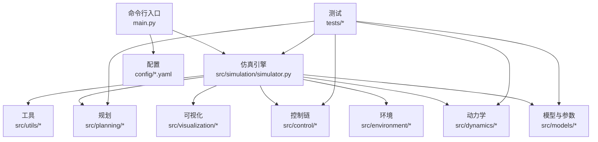
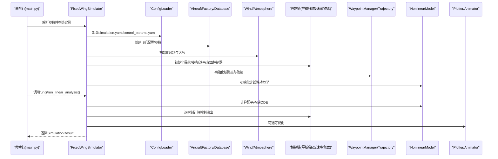
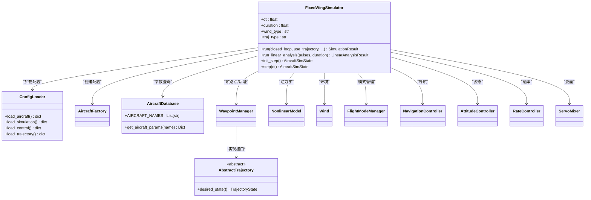
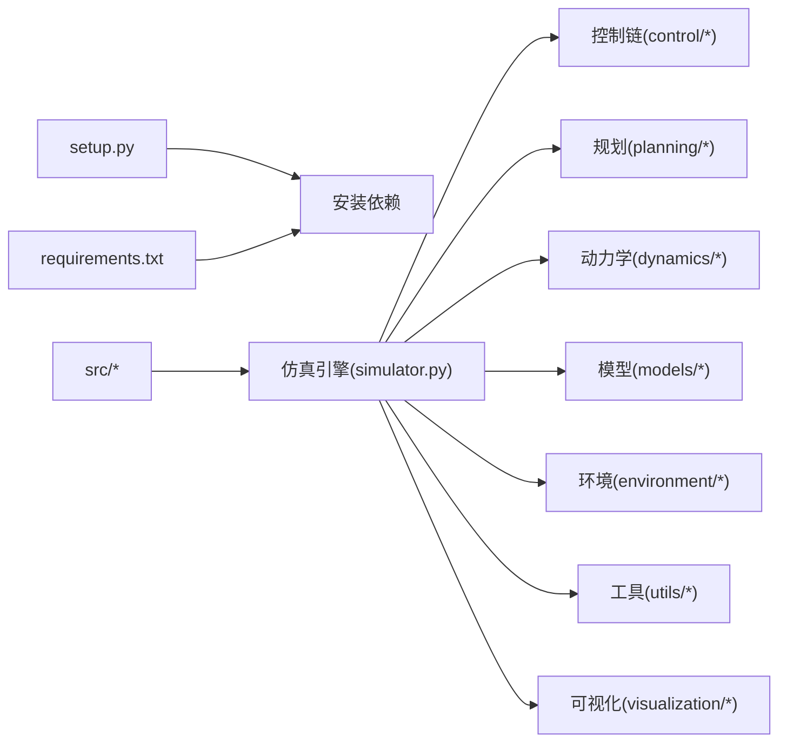

# 开发指南

<cite>
**本文引用的文件**   
- [setup.py](file://setup.py)
- [requirements.txt](file://requirements.txt)
- [README.md](file://README.md)
- [main.py](file://main.py)
- [src/simulation/simulator.py](file://src/simulation/simulator.py)
- [src/models/aircraft_database.py](file://src/models/aircraft_database.py)
- [src/control/attitude_controller.py](file://src/control/attitude_controller.py)
- [src/planning/trajectory_base.py](file://src/planning/trajectory_base.py)
- [src/utils/config_loader.py](file://src/utils/config_loader.py)
- [tests/test_control.py](file://tests/test_control.py)
- [tests/test_dynamics.py](file://tests/test_dynamics.py)
- [config/aircraft.yaml](file://config/aircraft.yaml)
- [config/control_params.yaml](file://config/control_params.yaml)
- [config/simulation.yaml](file://config/simulation.yaml)
</cite>

## 目录
1. [简介](#简介)
2. [项目结构](#项目结构)
3. [核心组件](#核心组件)
4. [架构总览](#架构总览)
5. [详细组件分析](#详细组件分析)
6. [依赖关系分析](#依赖关系分析)
7. [性能与数值稳定性](#性能与数值稳定性)
8. [调试与故障排查](#调试与故障排查)
9. [测试框架与实践](#测试框架与实践)
10. [扩展开发指南](#扩展开发指南)
11. [贡献流程与PR规范](#贡献流程与pr规范)
12. [持续集成与自动化测试](#持续集成与自动化测试)
13. [开发环境与IDE配置建议](#开发环境与ide配置建议)
14. [版本发布与兼容性策略](#版本发布与兼容性策略)
15. [结语](#结语)

## 简介
本指南面向FixedWingSimulator项目的开发者，系统阐述代码结构、模块组织原则、命名与注释规范、测试体系、扩展方法、调试与性能分析、贡献流程、CI/CD与自动化测试、开发环境与IDE配置，以及版本发布与向后兼容策略。目标是帮助新老成员快速上手并高质量地迭代仿真平台。

## 项目结构
项目采用按领域分层的模块化组织：入口脚本负责参数解析与运行调度；核心引擎在simulation子包中编排各子系统；models提供飞机参数数据库与工厂；dynamics实现线性/非线性气动与动力学；environment封装风场与大气模型；control实现五层ArduPilot风格控制链；planning提供轨迹接口与管理器；visualization支持绘图与动画；utils提供通用工具；tests覆盖关键模块的行为验证；config提供可插拔的YAML配置。

图表来源
- [main.py](file://main.py#L1-L145)
- [src/simulation/simulator.py](file://src/simulation/simulator.py#L1-L642)

章节来源
- [main.py](file://main.py#L1-L145)
- [src/simulation/simulator.py](file://src/simulation/simulator.py#L1-L642)

## 核心组件
- 固定翼仿真器：统一编排模型、动力学、环境、控制、规划、状态记录与可视化，支持闭环与开环两种运行模式，并提供线性分析能力。
- 飞机参数数据库：内置多型飞机参数，提供派生字段注入与查询接口。
- 控制链：五层ArduPilot风格控制（导航→姿态→速率→舵面混合→执行），支持多种飞行模式。
- 规划与轨迹：抽象轨迹接口与多项式轨迹族，支持航路点序列与轨迹跟踪。
- 配置加载：YAML配置合并与默认值注入，支持分模块加载。
- 测试：覆盖控制、动力学、集成等模块的关键行为与边界条件。

章节来源
- [src/simulation/simulator.py](file://src/simulation/simulator.py#L115-L642)
- [src/models/aircraft_database.py](file://src/models/aircraft_database.py#L1-L183)
- [src/control/attitude_controller.py](file://src/control/attitude_controller.py#L1-L134)
- [src/planning/trajectory_base.py](file://src/planning/trajectory_base.py#L1-L47)
- [src/utils/config_loader.py](file://src/utils/config_loader.py#L1-L82)

## 架构总览
下图展示从命令行到仿真引擎、再到各子系统的调用关系与数据流。

图表来源
- [main.py](file://main.py#L98-L145)
- [src/simulation/simulator.py](file://src/simulation/simulator.py#L130-L567)
- [src/utils/config_loader.py](file://src/utils/config_loader.py#L59-L82)

章节来源
- [main.py](file://main.py#L1-L145)
- [src/simulation/simulator.py](file://src/simulation/simulator.py#L1-L642)

## 详细组件分析

### 仿真引擎（FixedWingSimulator）
- 职责：装配并驱动整个仿真流水线，支持闭环实时步进与线性开环分析；自动更新TECS巡航油门以匹配配平；支持航路点序列与多项式轨迹两种导航模式。
- 关键流程：初始化→配平计算→状态历史记录→控制链迭代→动力学积分→结果汇总与可视化。
- 设计要点：通过ConfigLoader集中加载配置；通过AircraftFactory/AircraftDatabase提供参数；通过WaypointManager与AbstractTrajectory实现轨迹抽象；通过Dopri5Integrator进行数值积分。

图表来源
- [src/simulation/simulator.py](file://src/simulation/simulator.py#L115-L642)
- [src/utils/config_loader.py](file://src/utils/config_loader.py#L59-L82)
- [src/models/aircraft_database.py](file://src/models/aircraft_database.py#L135-L183)
- [src/planning/trajectory_base.py](file://src/planning/trajectory_base.py#L26-L47)

章节来源
- [src/simulation/simulator.py](file://src/simulation/simulator.py#L115-L642)

### 飞机参数数据库
- 提供7型固定翼无人机的标准气动与惯性参数，以及由参数推导出的动态压力等派生项；提供名称列表与信息摘要函数；支持参数覆盖机制。
- 设计要点：保持与历史TypedDict一致的键名，确保替换兼容；在查询时注入派生字段，避免重复计算。

章节来源
- [src/models/aircraft_database.py](file://src/models/aircraft_database.py#L1-L183)

### 控制链（姿态控制器）
- 实现三轴独立PID控制器，分别处理滚转、俯仰、偏航；滚转与俯仰采用P控制，偏航无外环；输出限幅与角度包裹处理；支持热重载参数与复位。
- 设计要点：与ArduPilot Plane参数命名对齐；输出为期望角速度；限幅防止过度饱和。

章节来源
- [src/control/attitude_controller.py](file://src/control/attitude_controller.py#L1-L134)

### 规划与轨迹（抽象接口）
- 定义轨迹状态与抽象轨迹接口；WaypointManager负责航路点管理与轨迹生成；具体轨迹类型（如最小Snap/最小Jerk）在对应模块中实现。
- 设计要点：统一desired_state接口；TrajectoryState包含位置、速度、加速度与航向信息。

章节来源
- [src/planning/trajectory_base.py](file://src/planning/trajectory_base.py#L1-L47)

### 配置加载（ConfigLoader）
- 支持分模块加载YAML配置，提供默认值与递归深合并策略；用于仿真、控制、轨迹等子系统。
- 设计要点：默认值集中管理；允许用户覆盖；路径拼接与容错处理。

章节来源
- [src/utils/config_loader.py](file://src/utils/config_loader.py#L1-L82)
- [config/aircraft.yaml](file://config/aircraft.yaml#L1-L13)
- [config/control_params.yaml](file://config/control_params.yaml#L1-L45)
- [config/simulation.yaml](file://config/simulation.yaml#L1-L30)

## 依赖关系分析
- 包与安装：setup.py声明主包目录与依赖；requirements.txt定义运行期依赖；tests/dev依赖通过extras_require提供。
- 运行时依赖：numpy、scipy、matplotlib、plotly、pyyaml、pandas；Python版本要求>=3.10。
- 模块内依赖：仿真引擎聚合各子系统；控制链依赖ArduPilot参数；规划依赖轨迹抽象；配置加载贯穿全局。

图表来源
- [setup.py](file://setup.py#L1-L23)
- [requirements.txt](file://requirements.txt#L1-L8)
- [src/simulation/simulator.py](file://src/simulation/simulator.py#L33-L52)

章节来源
- [setup.py](file://setup.py#L1-L23)
- [requirements.txt](file://requirements.txt#L1-L8)

## 性能与数值稳定性
- 数值积分：默认使用DOPRI5（自适应步长）；可通过配置切换；rtol/atol控制精度。
- 风场与大气：风模型与密度随高度变化；注意风速与方向对轨迹跟踪的影响。
- 控制限幅：姿态/速率/舵面均有限幅与抗积分饱和策略；TECS参数平滑响应，抑制振荡。
- 线性分析：4-DOF线性模型用于稳定性分析与脉冲响应；与6-DOF非线性对比验证。

章节来源
- [src/simulation/simulator.py](file://src/simulation/simulator.py#L239-L567)
- [config/simulation.yaml](file://config/simulation.yaml#L1-L30)
- [config/control_params.yaml](file://config/control_params.yaml#L30-L45)

## 调试与故障排查
- 常见问题定位
  - 集成错误：检查初始状态与控制输入是否合理；确认风场与密度计算；观察历史记录中的异常突变。
  - 配平不收敛：核对气动参数与质量/面积比；调整TECS参数或手动修正配平油门。
  - 轨迹跟踪偏差：检查航路点高度一致性；确认轨迹类型与平均速度设置；关注航段切换阈值。
  - 可视化缺失：确认matplotlib/plotly可用；检查输出目录权限。
- 调试技巧
  - 使用run_linear_analysis进行线性系统验证；
  - 在关键模块插入日志或临时打印；
  - 将wind_type设为NONE排除扰流影响；
  - 缩短duration与增大dt进行快速回归。

章节来源
- [src/simulation/simulator.py](file://src/simulation/simulator.py#L558-L567)
- [config/simulation.yaml](file://config/simulation.yaml#L22-L25)

## 测试框架与实践
- 测试框架：pytest；tests目录按模块划分；每个测试文件覆盖相应子系统。
- 覆盖范围
  - 控制模块：PID、Ardupilot参数、姿态/速率/舵面控制器输出与限幅。
  - 动力学模块：坐标变换、气动函数、线性/非线性模型、配平与状态导数。
- 测试规范
  - 使用fixture提供默认参数与控制器实例；
  - 验证边界条件（零误差、饱和、抗积分饱和、角度包裹）；
  - 使用近似断言处理浮点误差；
  - 保持测试可重复与最小化外部依赖。
- 运行方式
  - 在项目根目录执行pytest；或使用pip安装dev依赖后运行。

章节来源
- [tests/test_control.py](file://tests/test_control.py#L1-L371)
- [tests/test_dynamics.py](file://tests/test_dynamics.py#L1-L336)

## 扩展开发指南
- 新增飞机配置
  - 在aircraft_database中添加参数字典；确保几何、气动、惯性参数齐全；必要时提供ardupilot_defaults。
  - 通过AircraftFactory创建实例；在仿真中选择新机型。
- 实现新的控制算法
  - 在control子包新增模块；遵循现有接口（如update返回结构体）；在FlightModeManager或NavigationController中接入。
  - 保持与ArduPilot参数命名一致，便于配置迁移。
- 开发新的轨迹规划方法
  - 继承AbstractTrajectory并实现desired_state；在WaypointManager中注册或替换轨迹类型。
  - 注意TrajectoryState的维度与单位一致性。
- 修改配置
  - 在simulation.yaml中调整dt/积分器/风场；在control_params.yaml中调参；在aircraft.yaml中选择/覆盖参数。

章节来源
- [src/models/aircraft_database.py](file://src/models/aircraft_database.py#L29-L133)
- [src/planning/trajectory_base.py](file://src/planning/trajectory_base.py#L26-L47)
- [src/utils/config_loader.py](file://src/utils/config_loader.py#L68-L81)
- [config/aircraft.yaml](file://config/aircraft.yaml#L1-L13)
- [config/control_params.yaml](file://config/control_params.yaml#L1-L45)
- [config/simulation.yaml](file://config/simulation.yaml#L1-L30)

## 贡献流程与PR规范
- 分支策略
  - 主分支保护；功能开发在feature分支；修复在hotfix分支。
- 提交流程
  - 更新对应tests；确保通过pytest；在README补充使用示例（如有）；提交前运行格式化与静态检查。
- PR要求
  - 清晰描述变更内容与动机；拆分小而完整的提交；附带测试用例；避免破坏既有API（必要时标注弃用）。
- 文档与注释
  - 类与公共方法需有中文文档字符串；复杂逻辑补充注释；变量命名清晰且与参数文件键名一致。

## 持续集成与自动化测试
- 建议在CI中执行
  - 安装依赖（pip install -e .[dev]）；
  - 运行pytest并生成覆盖率报告；
  - 校验关键示例脚本可运行。
- 配置要点
  - Python版本与依赖锁定策略；
  - 并行测试与超时设置；
  - 失败即停与日志收集。

## 开发环境与IDE配置建议
- Python版本：>=3.10
- 推荐IDE：VSCode或PyCharm
  - 启用Python解释器指向虚拟环境；
  - 配置pytest为默认测试运行器；
  - 安装flake8/black/isort等格式化插件；
  - 设置工作区编码为UTF-8。
- 项目导入
  - 将src加入Python路径；在IDE中识别为源码包；
  - 配置别名映射以便从项目根运行main.py。

## 版本发布与兼容性策略
- 版本号：遵循语义化版本；重大变更提升主版本；功能新增提升次版本；修复补丁提升修订版本。
- 兼容性
  - 配置文件键名尽量保持稳定；必要时提供迁移脚本；
  - 控制参数命名与ArduPilot保持一致，便于用户迁移；
  - 保留向后兼容的API（如run_linear_analysis），并在变更时标注弃用。
- 发布流程
  - 合并至release分支；更新CHANGELOG；打标签并发布；同步更新README与示例。

## 结语
本指南提供了从架构理解、模块职责、测试实践到扩展与发布的完整开发手册。请在贡献过程中遵循本文规范，共同维护高质量的仿真平台。