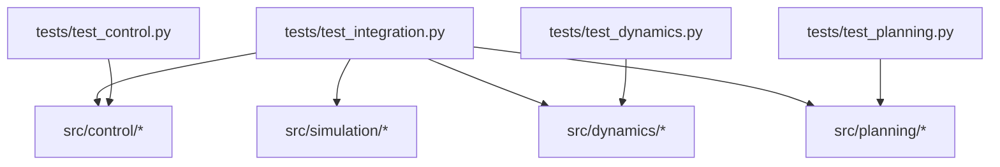
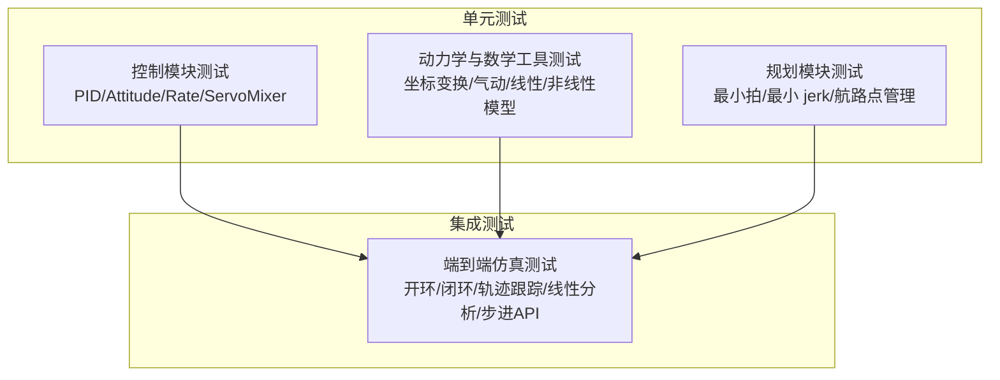
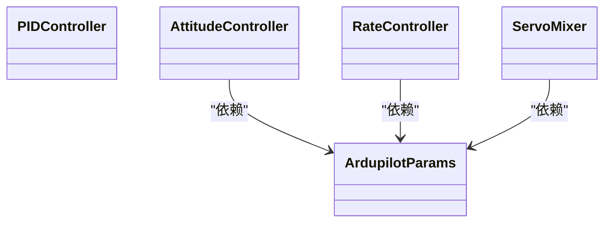
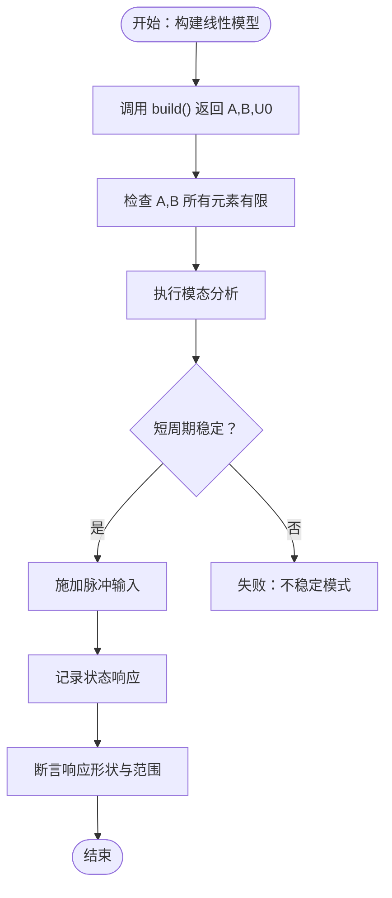
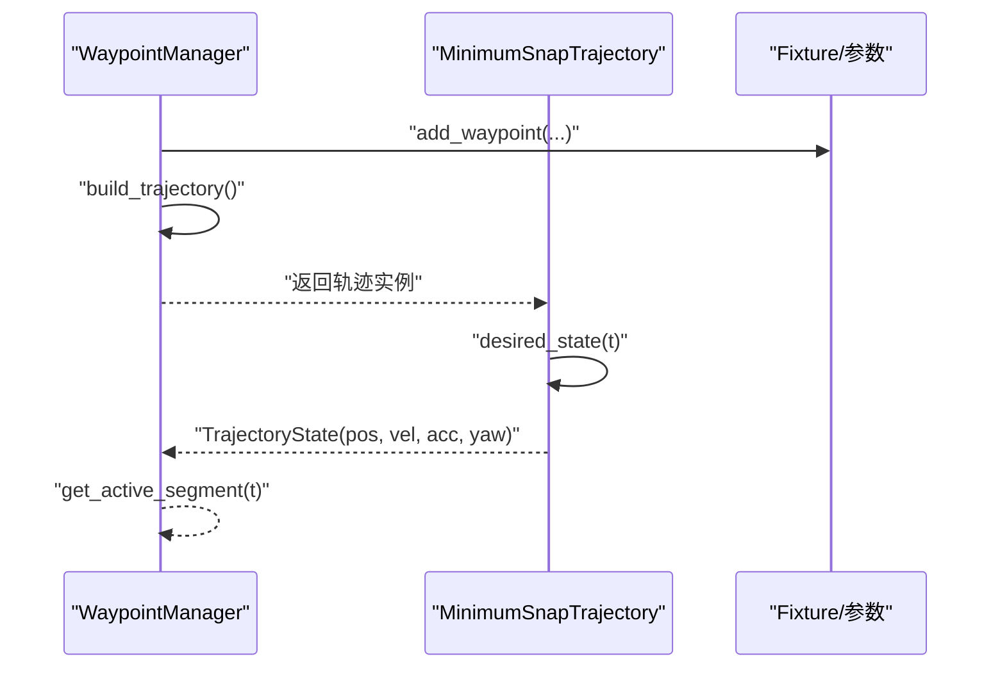
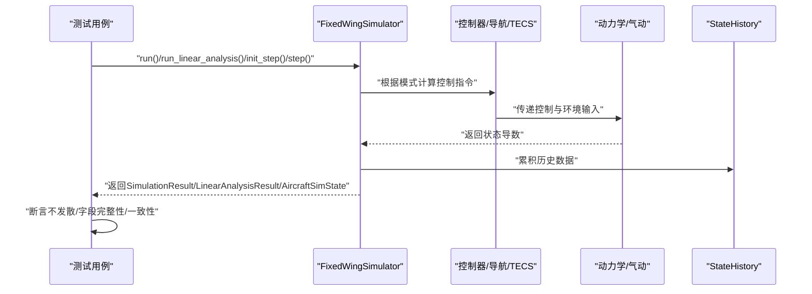
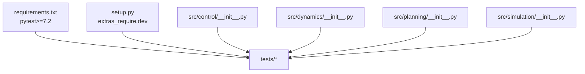

# 测试框架使用

<cite>
**本文引用的文件**
- [tests/test_control.py](file://tests/test_control.py)
- [tests/test_dynamics.py](file://tests/test_dynamics.py)
- [tests/test_integration.py](file://tests/test_integration.py)
- [tests/test_planning.py](file://tests/test_planning.py)
- [src/control/__init__.py](file://src/control/__init__.py)
- [src/dynamics/__init__.py](file://src/dynamics/__init__.py)
- [src/planning/__init__.py](file://src/planning/__init__.py)
- [src/simulation/__init__.py](file://src/simulation/__init__.py)
- [requirements.txt](file://requirements.txt)
- [setup.py](file://setup.py)
</cite>

## 目录
1. [简介](#简介)
2. [项目结构](#项目结构)
3. [核心组件](#核心组件)
4. [架构总览](#架构总览)
5. [详细组件分析](#详细组件分析)
6. [依赖分析](#依赖分析)
7. [性能考虑](#性能考虑)
8. [故障排查指南](#故障排查指南)
9. [结论](#结论)
10. [附录](#附录)

## 简介
本指南面向FixedWingSimulator项目的测试框架使用，系统讲解PyTest在项目中的应用方式与最佳实践，覆盖测试文件组织、命名规范、夹具（fixture）设计、断言策略、参数化与异常测试、覆盖率与报告生成、单测运行方式、测试数据与模拟对象准备、以及在持续集成中的自动化执行流程。

## 项目结构
测试相关文件位于tests目录下，按模块划分：
- 控制系统：tests/test_control.py
- 动力学与数学工具：tests/test_dynamics.py
- 规划与轨迹：tests/test_planning.py
- 集成测试（端到端仿真验证）：tests/test_integration.py

各模块测试文件均通过sys.path插入src路径以导入被测模块，并采用pytest标准约定进行组织。

图表来源
- [tests/test_control.py](file://tests/test_control.py#L1-L50)
- [tests/test_dynamics.py](file://tests/test_dynamics.py#L1-L50)
- [tests/test_planning.py](file://tests/test_planning.py#L1-L50)
- [tests/test_integration.py](file://tests/test_integration.py#L1-L50)

章节来源
- [tests/test_control.py](file://tests/test_control.py#L1-L50)
- [tests/test_dynamics.py](file://tests/test_dynamics.py#L1-L50)
- [tests/test_planning.py](file://tests/test_planning.py#L1-L50)
- [tests/test_integration.py](file://tests/test_integration.py#L1-L50)

## 核心组件
- 测试文件组织
  - 每个测试文件对应一个src子包或功能域，便于职责清晰与定位问题。
  - 文件内使用pytest类分组（class TestXxx）承载相关测试用例，每个测试方法以test_前缀命名。
- 夹具（fixture）
  - 在测试文件顶部定义共享资源，如ArduPilot参数、控制器实例、线性/非线性模型等，减少重复初始化成本。
  - 典型夹具：default_ap、attitude_ctrl、rate_ctrl、mixer、tb2_params、tb2_linear等。
- 断言策略
  - 使用pytest.approx进行浮点近似比较；使用numpy.testing.assert_allclose进行数组级断言。
  - 对状态机/边界条件使用严格相等或范围断言，确保数值稳定性与物理合理性。
- 参数化与异常
  - 使用pytest.mark.parametrize进行参数化测试（示例见规划模块中对轨迹类型的测试）。
  - 使用pytest.raises断言异常抛出，验证输入非法时的行为。
- 运行方式
  - 支持运行整个测试目录、指定文件、或单个测试类/方法，便于快速定位问题。

章节来源
- [tests/test_control.py](file://tests/test_control.py#L37-L55)
- [tests/test_dynamics.py](file://tests/test_dynamics.py#L51-L61)
- [tests/test_planning.py](file://tests/test_planning.py#L124-L127)
- [tests/test_integration.py](file://tests/test_integration.py#L41-L58)

## 架构总览
测试体系围绕“单元测试+集成测试”的双层结构展开：
- 单元测试：针对具体函数/类的独立行为验证，强调可重复性与确定性。
- 集成测试：端到端运行仿真器，验证模块间协作与数值稳定性。

图表来源
- [tests/test_control.py](file://tests/test_control.py#L58-L371)
- [tests/test_dynamics.py](file://tests/test_dynamics.py#L64-L336)
- [tests/test_planning.py](file://tests/test_planning.py#L48-L328)
- [tests/test_integration.py](file://tests/test_integration.py#L66-L391)

## 详细组件分析

### 控制模块测试（PID/Attitude/Rate/ServoMixer）
- 测试目标
  - PIDController：比例/积分/微分、抗积分饱和、重置、增益设置、前馈。
  - ArdupilotParams：默认值、字典转换、校验、属性映射。
  - AttitudeController：输出类型、零误差零率、限幅、符号约定。
  - RateController：零误差零输出、限幅、积分器重置。
  - ServoMixer：输出类型、节流限幅、升降舵幅限、角度换算、协调转弯。
- 夹具设计
  - default_ap：提供ArduPilot默认参数。
  - attitude_ctrl/rate_ctrl/mixer：基于default_ap构建控制器实例，统一dt=0.01。
- 断言要点
  - 使用pytest.approx与numpy.testing.assert_allclose处理浮点误差。
  - 对输出类型进行isinstance断言，确保接口一致性。
  - 对限幅与边界条件进行范围断言，保证物理合理。
- 异常与边界
  - 通过构造极端输入（极大误差、饱和状态）验证抗饱和与重置逻辑。

图表来源
- [tests/test_control.py](file://tests/test_control.py#L27-L31)
- [tests/test_control.py](file://tests/test_control.py#L37-L55)

章节来源
- [tests/test_control.py](file://tests/test_control.py#L58-L371)

### 动力学与数学工具测试（坐标变换/气动/线性/非线性模型）
- 测试目标
  - 坐标变换：DCM正交性、NED/Body互转、欧拉角速率关系、角度归一化。
  - 气动：力矩符号、零风一致性、对称性、风影响、动态压强计算。
  - 线性模型：矩阵维度、有限性、模态分析、脉冲激励响应。
  - 非线性模型：配平收敛、状态导数维度、短时仿真、全机数据库配平。
- 夹具设计
  - tb2_params：从数据库获取TB2参数。
  - tb2_linear：构建并返回线性模型与参数，复用build()结果。
- 断言要点
  - 使用assert_allclose验证矩阵/向量一致性。
  - 使用数学不等式断言稳定性与物理合理性（如阻尼比、模态实部小于0）。
- 异常与边界
  - 验证极小空速下的数值稳定处理（动态压强钳位）。

图表来源
- [tests/test_dynamics.py](file://tests/test_dynamics.py#L201-L255)

章节来源
- [tests/test_dynamics.py](file://tests/test_dynamics.py#L64-L336)

### 规划模块测试（最小拍/最小 jerk/航路点管理）
- 测试目标
  - 最小拍系数：输出形状、边界满足、连续性、数值稳定性。
  - 最小拍/最小 jerk轨迹：起终点满足、速度连续、状态有限、模式选择（跟随偏航）。
  - 航路点管理：添加/清空、NED存储、轨迹构建、YAML往返、活动段查询。
- 夹具与参数化
  - 使用pytest.fixture定义轨迹实例，结合参数化（deriv_order、yaw_mode）覆盖多场景。
  - 使用临时文件进行YAML序列化/反序列化测试。
- 断言要点
  - 形状断言与位置/速度/加速度的连续性断言。
  - 使用assert_allclose与数学断言相结合，确保轨迹质量。

图表来源
- [tests/test_planning.py](file://tests/test_planning.py#L252-L328)

章节来源
- [tests/test_planning.py](file://tests/test_planning.py#L48-L328)

### 集成测试（端到端仿真）
- 测试目标
  - 开环/闭环模式、不同机型（TB2/Anka）、轨迹跟踪、线性分析、步进API一致性、历史数据结构。
- 关键断言
  - 使用自定义检查器断言高度、空速、姿态不发散，时间向量单调递增，历史字段完整。
- 数据与环境
  - 使用项目config目录作为配置来源，确保与主程序一致的运行环境。

图表来源
- [tests/test_integration.py](file://tests/test_integration.py#L41-L58)
- [tests/test_integration.py](file://tests/test_integration.py#L70-L106)
- [tests/test_integration.py](file://tests/test_integration.py#L112-L158)
- [tests/test_integration.py](file://tests/test_integration.py#L164-L218)
- [tests/test_integration.py](file://tests/test_integration.py#L224-L261)
- [tests/test_integration.py](file://tests/test_integration.py#L267-L343)
- [tests/test_integration.py](file://tests/test_integration.py#L349-L391)

章节来源
- [tests/test_integration.py](file://tests/test_integration.py#L1-L391)

## 依赖分析
- 测试依赖
  - pytest>=7.2（开发依赖），用于运行测试与夹具管理。
  - numpy/scipy/matplotlib/plotly/pyyaml/pandas用于数值计算、绘图与配置读写。
- 包导出
  - 各模块的__init__.py集中导出对外API，测试通过这些入口导入被测对象，确保接口一致性。

图表来源
- [requirements.txt](file://requirements.txt#L1-L8)
- [setup.py](file://setup.py#L19-L21)
- [src/control/__init__.py](file://src/control/__init__.py#L1-L24)
- [src/dynamics/__init__.py](file://src/dynamics/__init__.py#L1-L22)
- [src/planning/__init__.py](file://src/planning/__init__.py#L1-L14)
- [src/simulation/__init__.py](file://src/simulation/__init__.py#L1-L12)

章节来源
- [requirements.txt](file://requirements.txt#L1-L8)
- [setup.py](file://setup.py#L19-L21)
- [src/control/__init__.py](file://src/control/__init__.py#L1-L24)
- [src/dynamics/__init__.py](file://src/dynamics/__init__.py#L1-L22)
- [src/planning/__init__.py](file://src/planning/__init__.py#L1-L14)
- [src/simulation/__init__.py](file://src/simulation/__init__.py#L1-L12)

## 性能考虑
- 夹具复用
  - 将昂贵的初始化（如模型构建、参数加载）放入fixture，避免在每个测试中重复创建。
- 断言粒度
  - 对大规模数组使用局部断言与采样断言，减少断言开销。
- 集成测试批量化
  - 将多个相似场景合并为循环测试，降低测试启动成本。
- 临时数据与文件
  - 使用临时文件进行I/O测试，结束后清理，避免磁盘污染。

## 故障排查指南
- 常见问题
  - 导入错误：确认测试文件头部已将src加入sys.path。
  - 数值不稳定：检查积分步长、限幅与抗饱和逻辑是否生效。
  - 断言失败：优先缩小输入范围，使用更宽松的容差或分步断言定位。
- 定位手段
  - 使用pytest -v/-s输出详细信息与调试打印。
  - 对复杂路径增加中间变量断言，逐步缩小范围。
- 配套工具
  - 使用pytest.approx与numpy.testing.assert_allclose处理浮点误差。
  - 对异常场景使用pytest.raises捕获预期异常。

章节来源
- [tests/test_integration.py](file://tests/test_integration.py#L41-L58)
- [tests/test_dynamics.py](file://tests/test_dynamics.py#L153-L164)

## 结论
本项目采用PyTest组织测试，通过模块化测试文件与共享夹具实现高内聚低耦合的测试结构。单元测试与集成测试协同工作，既保证了模块内部正确性，也验证了端到端稳定性。建议在新增功能时遵循现有命名与组织规范，优先使用夹具与参数化，配合严格的断言策略与异常测试，确保测试的可维护性与可靠性。

## 附录

### 测试运行与覆盖率
- 运行方式
  - 运行全部测试：pytest tests/
  - 运行单个文件：pytest tests/test_control.py
  - 运行单个类：pytest tests/test_control.py::TestPIDController
  - 运行单个方法：pytest tests/test_control.py::TestPIDController::test_pure_proportional
- 覆盖率与报告
  - 可使用pytest-cov生成覆盖率报告，命令示例：pytest --cov=src --cov-report=html tests/
  - 报告生成后可在浏览器打开htmlcov/index.html查看详细覆盖情况。

章节来源
- [requirements.txt](file://requirements.txt#L7-L8)

### 测试数据与模拟对象准备
- 测试数据
  - 使用numpy数组构造航路点与时间段，确保维度与单位一致。
  - 使用临时文件进行YAML序列化/反序列化测试。
- 模拟对象
  - 使用夹具统一创建ArduPilot参数与控制器实例，避免重复初始化。
  - 对需要外部配置的模块（如仿真器）使用项目config目录作为配置来源。

章节来源
- [tests/test_planning.py](file://tests/test_planning.py#L37-L45)
- [tests/test_integration.py](file://tests/test_integration.py#L63-L64)

### 持续集成中的测试执行
- 自动化流程建议
  - 安装依赖：pip install -e .
  - 运行测试：pytest tests/ -v
  - 生成覆盖率：pytest --cov=src --cov-report=term-missing tests/
- 配置要点
  - 在CI中固定Python版本与依赖范围，确保测试环境一致。
  - 将覆盖率阈值纳入CI检查，防止覆盖率下降。

章节来源
- [setup.py](file://setup.py#L1-L23)
- [requirements.txt](file://requirements.txt#L1-L8)