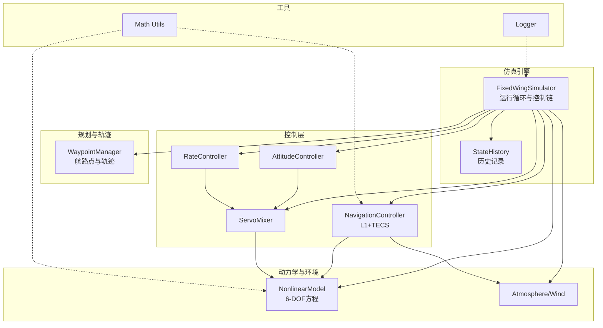
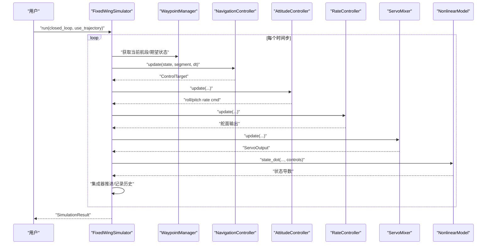
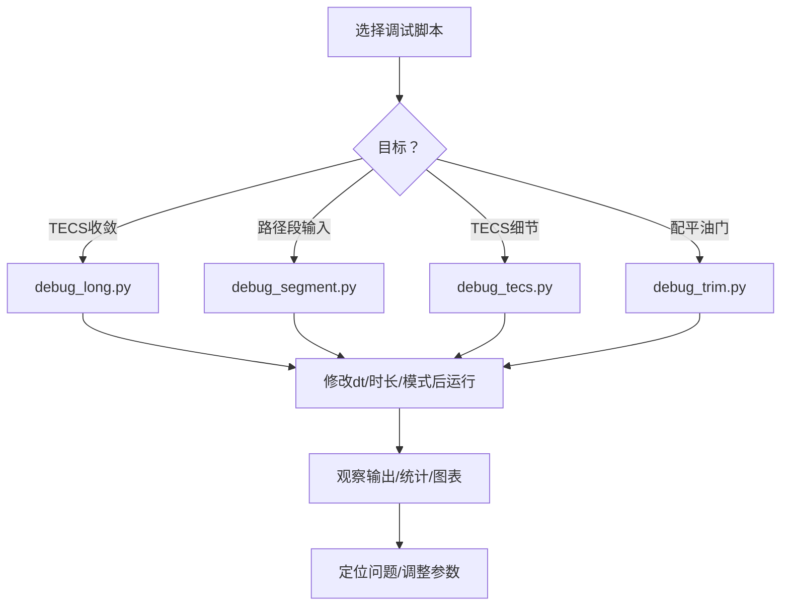
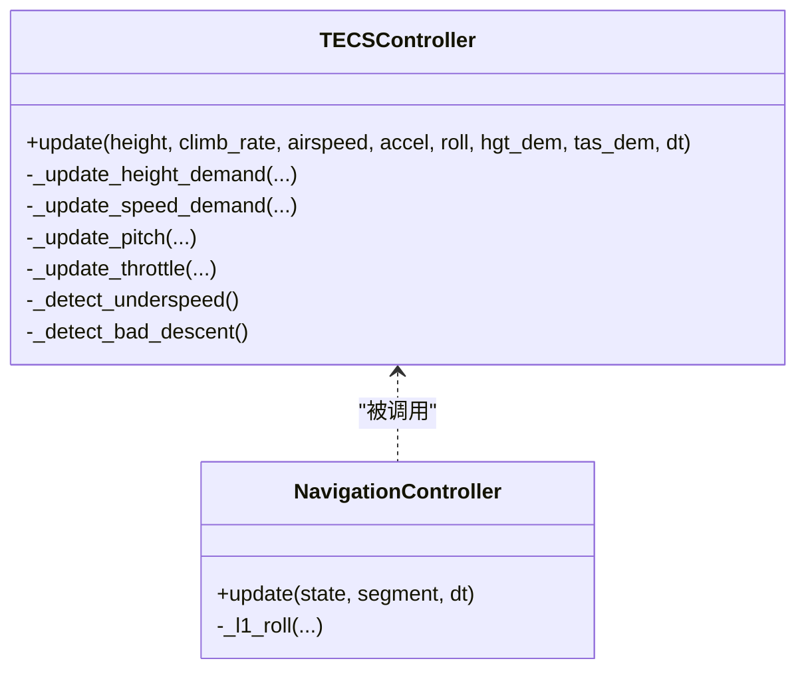
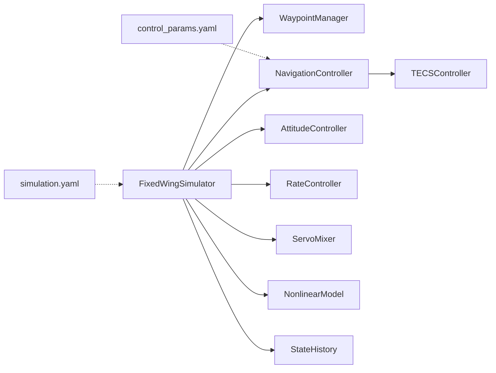

# 调试与性能优化

<cite>
**本文引用的文件**
- [debug_long.py](file://debug_long.py)
- [debug_segment.py](file://debug_segment.py)
- [debug_tecs.py](file://debug_tecs.py)
- [debug_trim.py](file://debug_trim.py)
- [logger.py](file://src/utils/logger.py)
- [simulator.py](file://src/simulation/simulator.py)
- [navigation_controller.py](file://src/control/navigation_controller.py)
- [tecs_controller.py](file://src/control/tecs_controller.py)
- [state_manager.py](file://src/simulation/state_manager.py)
- [waypoint_manager.py](file://src/planning/waypoint_manager.py)
- [nonlinear_model.py](file://src/dynamics/nonlinear_model.py)
- [simulation.yaml](file://config/simulation.yaml)
- [control_params.yaml](file://config/control_params.yaml)
</cite>

## 目录
1. [简介](#简介)
2. [项目结构](#项目结构)
3. [核心组件](#核心组件)
4. [架构总览](#架构总览)
5. [详细组件分析](#详细组件分析)
6. [依赖关系分析](#依赖关系分析)
7. [性能考虑](#性能考虑)
8. [故障排查指南](#故障排查指南)
9. [结论](#结论)
10. [附录](#附录)

## 简介
本指南面向FixedWingSimulator项目的调试与性能优化，聚焦以下目标：
- 使用专用调试脚本定位控制链路与轨迹问题，如长时间收敛性、路径段输入、TECS行为、配平油门等。
- 使用logger模块进行日志记录与问题追踪，规范日志级别与格式。
- 采用历史数据与可视化手段进行性能分析，包括时间复杂度、内存使用、仿真速度优化。
- 提供常见问题的诊断流程与解决方案，涵盖仿真不稳定、控制失效、轨迹偏差等。
- 给出断点设置、调试器使用、堆栈跟踪分析等实用技巧，并总结性能瓶颈识别与优化策略。

## 项目结构
项目采用模块化分层设计，核心模块包括：
- 动力学与环境：非线性6自由度模型、气动与风场模型
- 规划与轨迹：航路点管理、最小Snap/最小Jerk轨迹生成
- 控制系统：L1导航 + TECS高度/空速控制、姿态/角速率控制、舵面混合
- 仿真引擎：集成器、状态容器、历史记录、结果封装
- 工具与可视化：数学工具、绘图与动画、日志

图表来源
- [simulator.py](file://src/simulation/simulator.py#L115-L642)
- [navigation_controller.py](file://src/control/navigation_controller.py#L45-L293)
- [tecs_controller.py](file://src/control/tecs_controller.py#L50-L647)
- [state_manager.py](file://src/simulation/state_manager.py#L95-L193)
- [waypoint_manager.py](file://src/planning/waypoint_manager.py#L20-L208)
- [nonlinear_model.py](file://src/dynamics/nonlinear_model.py#L104-L386)
- [logger.py](file://src/utils/logger.py#L10-L44)

章节来源
- [simulator.py](file://src/simulation/simulator.py#L1-L642)
- [waypoint_manager.py](file://src/planning/waypoint_manager.py#L1-L208)
- [navigation_controller.py](file://src/control/navigation_controller.py#L1-L293)
- [tecs_controller.py](file://src/control/tecs_controller.py#L1-L647)
- [state_manager.py](file://src/simulation/state_manager.py#L1-L193)
- [nonlinear_model.py](file://src/dynamics/nonlinear_model.py#L1-L386)
- [logger.py](file://src/utils/logger.py#L1-L44)

## 核心组件
- 仿真主引擎：负责控制链路、轨迹/航路点、集成器、状态记录与结果封装。
- 导航控制器：实现L1横向导航与TECS纵向控制，处理高度/空速耦合。
- TECS控制器：总比能量控制，油门与俯仰联合调节，具备欠速/不可达下沉保护。
- 状态历史：预分配数组高效记录仿真过程数据，支持导出CSV与可视化。
- 航路点管理：构建轨迹对象，提供当前活动航段与期望状态查询。
- 非线性动力学：6自由度方程，包含气动、推力、重力与惯性耦合。
- 日志工具：统一日志接口，支持控制台与文件输出，便于问题追踪。

章节来源
- [simulator.py](file://src/simulation/simulator.py#L115-L642)
- [navigation_controller.py](file://src/control/navigation_controller.py#L45-L293)
- [tecs_controller.py](file://src/control/tecs_controller.py#L50-L647)
- [state_manager.py](file://src/simulation/state_manager.py#L95-L193)
- [waypoint_manager.py](file://src/planning/waypoint_manager.py#L20-L208)
- [nonlinear_model.py](file://src/dynamics/nonlinear_model.py#L104-L386)
- [logger.py](file://src/utils/logger.py#L10-L44)

## 架构总览
仿真主循环按时间步推进，依次完成：
- 获取当前状态与期望轨迹/航路点
- 导航控制器计算控制目标（滚转/俯仰/油门/空速）
- 姿态/角速率控制器与舵面混合器生成舵面输出
- 动力学模型计算状态导数并由集成器推进
- 记录历史数据

图表来源
- [simulator.py](file://src/simulation/simulator.py#L239-L567)
- [navigation_controller.py](file://src/control/navigation_controller.py#L134-L202)
- [nonlinear_model.py](file://src/dynamics/nonlinear_model.py#L160-L255)

## 详细组件分析

### 调试脚本使用指南
- debug_long.py：长时间TECS收敛性测试，记录高度、速度、油门、俯仰等关键变量，统计最终阶段稳定性。
- debug_segment.py：诊断路径段终点高度输入，检查航路点与轨迹期望位置一致性。
- debug_tecs.py：深入分析TECS高度需求、滤波、油门与俯仰命令，辅助理解高度控制行为。
- debug_trim.py：计算配平状态下的巡航油门，验证气动与重力平衡。

章节来源
- [debug_long.py](file://debug_long.py#L1-L55)
- [debug_segment.py](file://debug_segment.py#L1-L55)
- [debug_tecs.py](file://debug_tecs.py#L1-L67)
- [debug_trim.py](file://debug_trim.py#L1-L43)

### 日志记录与追踪（logger模块）
- get_logger(name, log_dir, level)：返回命名logger，自动配置控制台与文件处理器，格式包含时间、模块名、级别与消息。
- 建议在关键模块（仿真引擎、控制器、轨迹管理）中按需启用INFO/WARNING/ERROR级别，必要时开启DEBUG。
- 日志目录可通过配置文件控制，便于批量问题复现与对比。

章节来源
- [logger.py](file://src/utils/logger.py#L10-L44)
- [simulation.yaml](file://config/simulation.yaml#L27-L30)

### TECS控制链路与调试要点
- TECS通过“总比能量”与“比能量分配比”实现高度与空速的耦合控制，油门主导能量注入，俯仰主导能量分配。
- 关键调试点：高度需求滤波、速度需求速率限制、欠速保护、不可达下沉检测、坡度油门补偿。
- 建议结合debug_tecs.py输出的STE误差、高度需求原始值与滤波值，判断是否存在需求跳变或滤波过慢导致的超调。

图表来源
- [tecs_controller.py](file://src/control/tecs_controller.py#L247-L315)
- [navigation_controller.py](file://src/control/navigation_controller.py#L134-L202)

章节来源
- [tecs_controller.py](file://src/control/tecs_controller.py#L50-L647)
- [navigation_controller.py](file://src/control/navigation_controller.py#L45-L293)

### 航路点与轨迹管理
- WaypointManager维护NED航路点列表，按类型构建轨迹对象，提供当前活动航段与期望状态查询。
- 调试建议：打印航路点序列、期望位置、活动航段端点，核对是否与segment输入一致。

章节来源
- [waypoint_manager.py](file://src/planning/waypoint_manager.py#L20-L208)
- [debug_segment.py](file://debug_segment.py#L38-L55)

### 仿真主循环与历史记录
- FixedWingSimulator.run()是主控制循环，负责轨迹/航路点、控制链路、集成器推进与历史记录。
- StateHistory预分配数组，高效记录状态与控制量，支持trim裁剪与CSV导出。

章节来源
- [simulator.py](file://src/simulation/simulator.py#L239-L567)
- [state_manager.py](file://src/simulation/state_manager.py#L95-L193)

### 非线性动力学与数值积分
- NonlinearModel.state_dot()实现6自由度方程，包含气动、推力、重力与惯性耦合项。
- 集成器在主循环中按dt推进，出现积分错误时会中断并提示时间戳。

章节来源
- [nonlinear_model.py](file://src/dynamics/nonlinear_model.py#L160-L255)
- [simulator.py](file://src/simulation/simulator.py#L558-L563)

## 依赖关系分析
- 控制链路：NavigationController依赖TECSController；姿态/角速率控制器与舵面混合器依赖控制目标。
- 仿真引擎：WaypointManager提供期望状态；NonlinearModel提供状态导数；StateHistory记录数据。
- 配置：simulation.yaml与control_params.yaml分别影响仿真步长、风场、TECS参数等。

图表来源
- [simulator.py](file://src/simulation/simulator.py#L148-L233)
- [navigation_controller.py](file://src/control/navigation_controller.py#L94-L116)
- [tecs_controller.py](file://src/control/tecs_controller.py#L80-L127)
- [simulation.yaml](file://config/simulation.yaml#L1-L30)
- [control_params.yaml](file://config/control_params.yaml#L1-L45)

章节来源
- [simulator.py](file://src/simulation/simulator.py#L148-L233)
- [navigation_controller.py](file://src/control/navigation_controller.py#L94-L116)
- [tecs_controller.py](file://src/control/tecs_controller.py#L80-L127)
- [simulation.yaml](file://config/simulation.yaml#L1-L30)
- [control_params.yaml](file://config/control_params.yaml#L1-L45)

## 性能考虑
- 时间复杂度
  - 控制层：每步O(1)，包含三角函数、滤波与饱和处理。
  - 动力学：state_dot每步O(1)，涉及气动力计算与矩阵运算。
  - 轨迹/航路点：构建轨迹O(N^2)（视具体插值），查询当前航段O(log N)。
- 内存使用
  - StateHistory预分配固定大小数组，记录全部状态与控制量，注意n_steps设置避免过大。
  - 轨迹缓存按需构建，清空缓存可释放内存。
- 仿真速度优化
  - 降低dt可提升精度但增加计算量；在稳定场景适当增大dt。
  - 减少不必要的可视化与文件IO（如关闭非必要的图像保存）。
  - 使用高效的数值库（NumPy）与合理的数据结构（预分配数组）。
- 数值稳定性
  - 注意角度归一化（wrap_angle）、饱和（saturate）与低通滤波参数。
  - TECS中的STE误差限幅与积分抗饱和策略有助于避免发散。

[本节为通用性能讨论，无需列出章节来源]

## 故障排查指南
- 仿真不稳定
  - 检查dt与积分器设置，确认rtol/atol合理。
  - 观察历史数据中的加速度、角速率、油门是否异常饱和或震荡。
  - 关注Integration error提示，定位时间戳附近的输入或参数问题。
- 控制失效
  - TECS欠速保护：当空速过低且油门饱和时触发，应提高目标空速或检查气动参数。
  - 不可达下沉：STE误差大且油门饱和时触发，需检查高度需求与速度权重。
  - 舵面饱和：检查roll/pitch限制与servo输出是否受限。
- 轨迹偏差
  - 确认航路点NED坐标与期望位置一致，检查活动航段端点。
  - 核对轨迹类型（minimum_snap/minimum_jerk）与平均速度设置。
- 配平问题
  - 使用debug_trim.py验证配平油门与气动/重力平衡，必要时调整TECS_thr_cruise。

章节来源
- [simulator.py](file://src/simulation/simulator.py#L558-L563)
- [tecs_controller.py](file://src/control/tecs_controller.py#L432-L441)
- [tecs_controller.py](file://src/control/tecs_controller.py#L635-L646)
- [debug_segment.py](file://debug_segment.py#L38-L55)
- [debug_trim.py](file://debug_trim.py#L1-L43)

## 结论
通过专用调试脚本、完善的日志体系与历史数据记录，可以快速定位TECS收敛、路径段输入、轨迹偏差与配平油门等问题。结合TECS控制机理与仿真主循环流程，能够有效识别数值不稳定与控制失效的根因。在保证精度的前提下，通过合理设置dt、减少IO与优化控制参数，可显著提升仿真效率与稳定性。

[本节为总结性内容，无需列出章节来源]

## 附录

### 调试脚本使用清单
- debug_long.py：长时间TECS收敛性分析，关注最终阶段均值/标准差/范围。
- debug_segment.py：路径段终点高度与当前高度对比，核对航路点与轨迹期望。
- debug_tecs.py：TECS高度需求原始值与滤波值、油门/俯仰命令、STE误差。
- debug_trim.py：配平油门计算，验证气动与重力平衡。

章节来源
- [debug_long.py](file://debug_long.py#L1-L55)
- [debug_segment.py](file://debug_segment.py#L1-L55)
- [debug_tecs.py](file://debug_tecs.py#L1-L67)
- [debug_trim.py](file://debug_trim.py#L1-L43)

### 日志配置与最佳实践
- 使用get_logger(name, log_dir, level)创建模块级logger。
- 建议在仿真引擎、控制器、轨迹管理处分别设置INFO/WARNING/ERROR级别。
- 文件日志自动按日期命名，便于问题复盘与对比。

章节来源
- [logger.py](file://src/utils/logger.py#L10-L44)
- [simulation.yaml](file://config/simulation.yaml#L27-L30)

### 性能分析与优化建议
- 复杂度：控制层与动力学为O(1)/步；轨迹构建为O(N^2)，查询O(log N)。
- 内存：StateHistory预分配，注意n_steps；轨迹缓存按需清理。
- 速度：合理设置dt与rtol/atol；减少可视化与文件IO；使用高效数据结构。
- 稳定性：注意TECS限幅与抗饱和策略，避免积分饱和与超调。

章节来源
- [state_manager.py](file://src/simulation/state_manager.py#L95-L193)
- [simulation.yaml](file://config/simulation.yaml#L1-L30)
- [tecs_controller.py](file://src/control/tecs_controller.py#L553-L624)