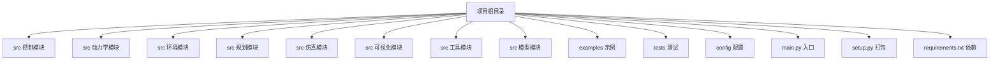
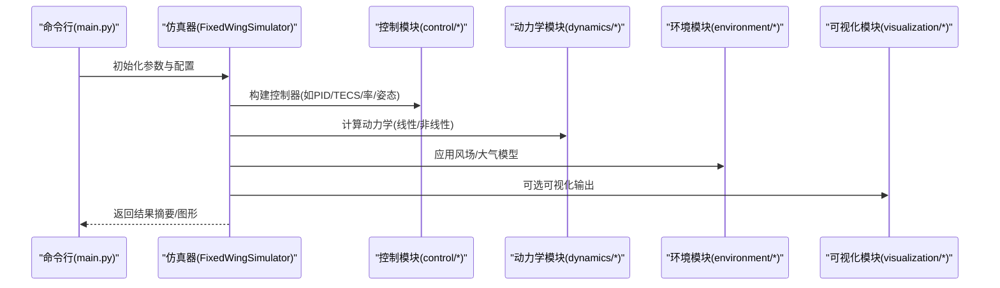
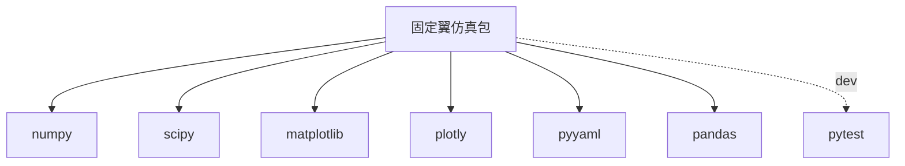

# 贡献与发布流程

<cite>
**本文引用的文件**
- [setup.py](file://setup.py)
- [requirements.txt](file://requirements.txt)
- [main.py](file://main.py)
- [tests/test_control.py](file://tests/test_control.py)
- [tests/test_dynamics.py](file://tests/test_dynamics.py)
- [config/aircraft.yaml](file://config/aircraft.yaml)
- [config/control_params.yaml](file://config/control_params.yaml)
- [config/simulation.yaml](file://config/simulation.yaml)
- [config/trajectory.yaml](file://config/trajectory.yaml)
</cite>

## 目录
1. [简介](#简介)
2. [项目结构](#项目结构)
3. [核心组件](#核心组件)
4. [架构总览](#架构总览)
5. [详细组件分析](#详细组件分析)
6. [依赖关系分析](#依赖关系分析)
7. [性能考虑](#性能考虑)
8. [故障排查指南](#故障排查指南)
9. [结论](#结论)
10. [附录](#附录)

## 简介
本文件面向希望参与 FixedWingSimulator 项目的开发者，系统化说明从 Fork 到提交、从代码规范到测试与发布、从版本管理到持续集成的完整流程。同时给出打包与发布新版本的操作指引，以及社区协作与法律合规要点（许可证、版权、贡献者协议等）。

## 项目结构
项目采用按领域分层的模块化组织方式：控制、动力学、环境、规划、仿真、可视化、工具与模型等子包清晰划分职责；示例与测试分别位于 examples 与 tests 目录；入口脚本 main.py 提供命令行运行能力；配置文件集中于 config 目录；setup.py 定义安装与依赖；requirements.txt 统一约束开发与运行时依赖。

图表来源
- [main.py](file://main.py#L1-L145)
- [setup.py](file://setup.py#L1-L23)
- [requirements.txt](file://requirements.txt#L1-L8)

章节来源
- [main.py](file://main.py#L1-L145)
- [setup.py](file://setup.py#L1-L23)
- [requirements.txt](file://requirements.txt#L1-L8)

## 核心组件
- 命令行入口与运行模式
  - 通过 main.py 提供统一入口，支持多参数控制飞行器类型、模式、风场、轨迹类型、是否绘图、是否仅线性/开环分析等。
  - 运行时会自动将 src 加入 Python 路径，确保模块导入可用。
- 包与依赖
  - setup.py 定义包名、版本、Python 版本要求与安装依赖；extras_require 提供 dev 分组以启用 pytest。
  - requirements.txt 统一列出运行与开发所需依赖范围，便于本地与 CI 环境复现。
- 配置体系
  - config 目录下包含飞机参数、控制参数、仿真参数与轨迹参数等 YAML 文件，用于驱动仿真与控制逻辑。

章节来源
- [main.py](file://main.py#L21-L95)
- [main.py](file://main.py#L98-L144)
- [setup.py](file://setup.py#L3-L22)
- [requirements.txt](file://requirements.txt#L1-L8)
- [config/aircraft.yaml](file://config/aircraft.yaml)
- [config/control_params.yaml](file://config/control_params.yaml)
- [config/simulation.yaml](file://config/simulation.yaml)
- [config/trajectory.yaml](file://config/trajectory.yaml)

## 架构总览
下图展示从命令行入口到仿真执行的关键调用链，体现模块间的职责边界与交互关系。

图表来源
- [main.py](file://main.py#L114-L140)
- [src/simulation/simulator.py](file://src/simulation/simulator.py)
- [src/control/pid_controller.py](file://src/control/pid_controller.py)
- [src/control/tecs_controller.py](file://src/control/tecs_controller.py)
- [src/dynamics/linear_model.py](file://src/dynamics/linear_model.py)
- [src/dynamics/nonlinear_model.py](file://src/dynamics/nonlinear_model.py)
- [src/environment/wind_model.py](file://src/environment/wind_model.py)
- [src/visualization/animator.py](file://src/visualization/animator.py)

## 详细组件分析

### Git 工作流与贡献规范
- Fork 与分支
  - 在上游仓库页面 Fork 项目至个人空间。
  - 创建功能分支，建议使用语义化的命名，例如 feature/xxx、fix/xxx、docs/xxx。
- 提交信息规范
  - 建议采用“类型: 内容”的格式，如 feat: 新增某控制器单元测试；fix: 修正坐标变换测试断言；docs: 补充README示例。
  - 对于破坏性变更，应在正文或 footer 中标注 BREAKING CHANGE。
- 代码审查与测试
  - 提交 Pull Request 前，请在本地运行测试并通过所有用例。
  - PR 描述应包含变更动机、改动范围、影响评估与验证方法。
- 本地测试与覆盖率
  - 使用 pytest 运行 tests 目录下的单元测试，确保控制、动力学、规划等模块测试通过。
  - 建议在 PR 中附上测试日志与关键断言通过截图。

章节来源
- [tests/test_control.py](file://tests/test_control.py#L1-L371)
- [tests/test_dynamics.py](file://tests/test_dynamics.py#L1-L336)

### 版本管理策略
- 版本号规则
  - 当前版本由 setup.py 中 version 字段定义，遵循语义化版本（主.次.补丁）。建议在发布前更新该字段。
- 发布周期
  - 建议采用“按需发布”策略：修复紧急问题可快速小版本发布；新增稳定功能合并后发布次版本；破坏性变更发布主版本。
- 向后兼容性
  - 保持公共 API 的稳定性，避免无故删除或重命名公开类与方法；对必须变更的接口，提供过渡期并在文档中标注弃用信息。

章节来源
- [setup.py](file://setup.py#L5-L5)

### 打包与发布新版本
- 安装与依赖
  - 运行时依赖在 setup.py 中声明，开发依赖通过 extras_require(dev) 指定。
  - 本地开发建议使用虚拟环境安装 requirements.txt 或直接 pip install -e .[dev]。
- 构建与分发
  - 使用标准流程构建源码包与轮子包，确保 Python 版本与依赖满足 setup.py 要求。
  - 发布前核对版本号、依赖范围与平台支持。
- 文档与示例
  - 发布说明中建议包含主要变更、已知限制、升级注意事项与示例更新。

章节来源
- [setup.py](file://setup.py#L10-L21)
- [requirements.txt](file://requirements.txt#L1-L8)

### 持续集成与自动化部署
- 测试自动化
  - 建议在 CI 中执行 pytest，覆盖控制、动力学、规划等模块的核心用例。
- 文档生成与质量检查
  - 可选：在 CI 中加入静态检查（如 lint）、类型检查与覆盖率统计。
- 自动化部署
  - 可将构建产物上传至 PyPI 或内部制品库；发布前进行版本校验与签名。

（本节为通用实践说明，不直接对应具体文件）

### 社区参与与法律事项
- 报告 Bug
  - 通过 Issue 模板描述环境、重现步骤、期望行为与实际行为。
- 提出功能请求
  - 明确需求背景、预期 API 或行为、影响范围与风险评估。
- 社区讨论
  - 使用 Discussions 或 Issue 讨论设计思路与实现方案。
- 许可证与版权
  - 请在项目根目录补充 LICENSE 文件；在 README 中声明许可证类型。
- 贡献者协议
  - 如需签署 CLA/贡献者许可协议，请在 CONTRIBUTING 中明确条款与签署流程。

（本节为通用实践说明，不直接对应具体文件）

## 依赖关系分析
下图展示 setup.py 中声明的安装依赖与其版本范围，帮助理解运行时环境要求。

图表来源
- [setup.py](file://setup.py#L11-L21)

章节来源
- [setup.py](file://setup.py#L11-L21)
- [requirements.txt](file://requirements.txt#L1-L8)

## 性能考虑
- 仿真步长与时长
  - 较小的 dt 与较长的时长会显著增加计算量；建议在保证精度的前提下适度调整。
- 可视化开销
  - 关闭绘图（命令行参数）可减少 I/O 与渲染开销，适合批量运行。
- 数据规模
  - 大规模轨迹或长时间仿真时，注意内存占用与中间结果保存策略。

（本节提供一般性指导，不直接对应具体文件）

## 故障排查指南
- 命令行参数错误
  - 确认参数组合有效（如飞机名称、模式、风场、轨迹类型），参考入口脚本中的帮助信息与默认值。
- 依赖冲突
  - 使用 requirements.txt 或 setup.py 的依赖范围进行环境隔离，避免不同版本导致的导入失败。
- 测试失败
  - 针对控制与动力学模块的测试用例，逐项定位失败原因并修复；必要时更新断言阈值或输入条件。

章节来源
- [main.py](file://main.py#L32-L95)
- [tests/test_control.py](file://tests/test_control.py#L61-L148)
- [tests/test_dynamics.py](file://tests/test_dynamics.py#L67-L121)

## 结论
通过规范的 Git 工作流、严格的测试与版本管理、完善的打包与发布流程，以及清晰的社区协作与法律合规机制，FixedWingSimulator 可以持续高质量演进。建议团队在 CI 中固化测试与质量门禁，确保每次变更的稳定性与可追溯性。

## 附录
- 快速开始（本地运行）
  - 安装依赖：pip install -r requirements.txt
  - 运行示例：python main.py
  - 运行测试：pytest tests/

章节来源
- [requirements.txt](file://requirements.txt#L1-L8)
- [main.py](file://main.py#L98-L144)
- [tests/test_control.py](file://tests/test_control.py#L1-L30)
- [tests/test_dynamics.py](file://tests/test_dynamics.py#L1-L46)