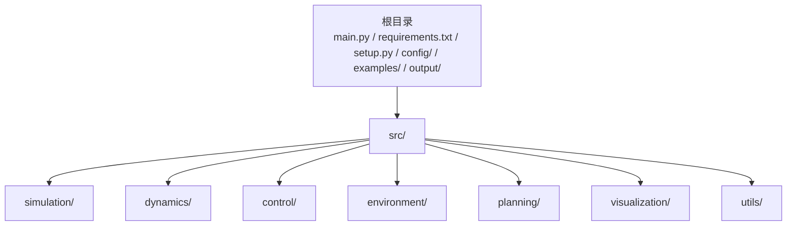
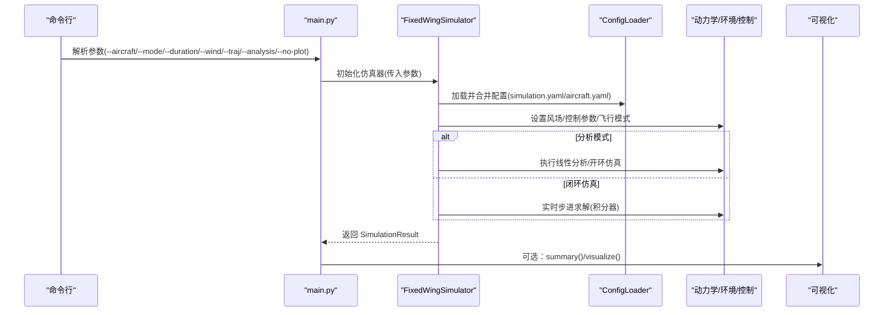
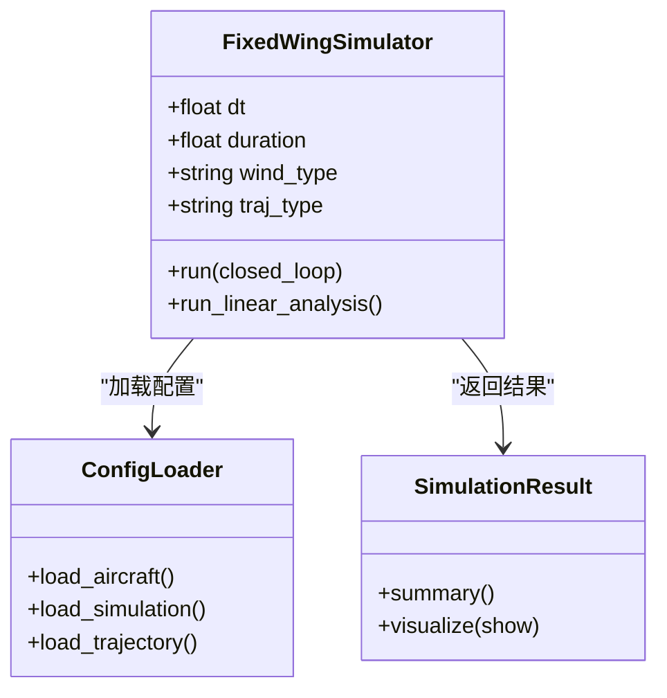
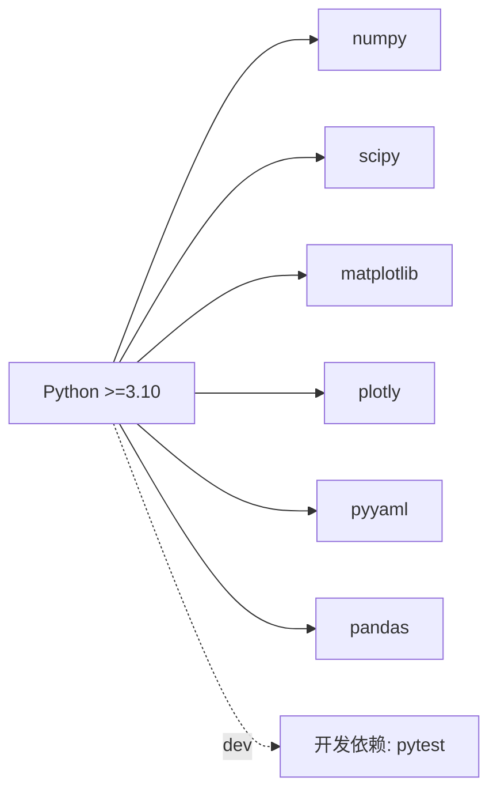

# 快速开始

<cite>
**本文引用的文件**
- [requirements.txt](file://requirements.txt)
- [setup.py](file://setup.py)
- [main.py](file://main.py)
- [src/simulation/simulator.py](file://src/simulation/simulator.py)
- [src/utils/config_loader.py](file://src/utils/config_loader.py)
- [config/simulation.yaml](file://config/simulation.yaml)
- [config/aircraft.yaml](file://config/aircraft.yaml)
- [examples/example_1_linear_response.py](file://examples/example_1_linear_response.py)
- [src/visualization/plotter.py](file://src/visualization/plotter.py)
</cite>

## 目录
1. [简介](#简介)
2. [项目结构](#项目结构)
3. [核心组件](#核心组件)
4. [架构总览](#架构总览)
5. [详细组件分析](#详细组件分析)
6. [依赖关系分析](#依赖关系分析)
7. [性能注意事项](#性能注意事项)
8. [故障排查指南](#故障排查指南)
9. [结论](#结论)
10. [附录](#附录)

## 简介
本指南面向首次接触 FixedWingSimulator 的用户，帮助你在最短时间内完成环境准备、安装与验证，并运行第一个仿真示例。你将学会：
- 使用 pip 安装或从源码安装项目
- 配置 Python 环境与依赖
- 使用命令行接口进行基础仿真运行
- 查看并解读仿真结果（CSV 数据与图表）
- 运行内置示例脚本并定位输出位置

## 项目结构
项目采用“根目录 + 源码包 src/”的组织方式，主要模块职责如下：
- 根目录：入口脚本 main.py、示例脚本 examples/、配置 config/、输出 output/、依赖清单 requirements.txt、打包脚本 setup.py
- src/：按功能域划分的子包，如 simulation（仿真引擎）、dynamics（动力学模型）、control（控制链路）、environment（环境建模）、planning（轨迹规划）、visualization（绘图与动画）、utils（工具）

**章节来源**
- [main.py](file://main.py#L1-L145)
- [requirements.txt](file://requirements.txt#L1-L8)
- [setup.py](file://setup.py#L1-L23)

## 核心组件
- 命令行入口：通过 main.py 提供统一的命令行接口，支持选择机型、飞行模式、仿真时长、时间步长、风场类型、轨迹类型、线性/开环分析、禁用可视化等。
- 仿真引擎：FixedWingSimulator 负责加载配置、构建飞机参数、设置环境风场、初始化控制参数与飞行模式管理器、集成求解与历史记录。
- 配置系统：ConfigLoader 统一加载与合并 aircraft.yaml、simulation.yaml、trajectory.yaml 等配置文件。
- 可视化与输出：SimulationResult 提供 summary 与 visualize；plotter.py 支持 Matplotlib/Plotly 图表输出。

**章节来源**
- [main.py](file://main.py#L32-L95)
- [src/simulation/simulator.py](file://src/simulation/simulator.py#L115-L200)
- [src/utils/config_loader.py](file://src/utils/config_loader.py#L59-L82)
- [src/visualization/plotter.py](file://src/visualization/plotter.py#L19-L111)

## 架构总览
下图展示了从命令行到仿真执行的关键流程与模块交互：

**图表来源**
- [main.py](file://main.py#L98-L141)
- [src/simulation/simulator.py](file://src/simulation/simulator.py#L130-L200)
- [src/utils/config_loader.py](file://src/utils/config_loader.py#L62-L81)
- [src/visualization/plotter.py](file://src/visualization/plotter.py#L92-L111)

## 详细组件分析

### 命令行接口（CLI）使用指南
- 基本运行
  - 默认：TB2 在 AUTO 模式下运行 30 秒，使用 minimum_snap 轨迹
  - 示例：指定机型、模式、风场、时长
- 关键参数
  - --aircraft：可选机型列表可通过 --list-aircraft 查看
  - --mode：飞行模式（MANUAL、STABILIZE、FBW_A、FBW_B、AUTO、LOITER、RTH）
  - --duration：总时长（秒）
  - --dt：时间步长（秒）
  - --wind：风场类型（NONE、FIXED、SINE、RANDOMSINE）
  - --traj：轨迹类型（minimum_snap、minimum_jerk、minimum_accel、minimum_vel、hover）
  - --analysis：分析模式（4dof 或 6dof），用于开环分析
  - --no-plot：禁用可视化（适合批量运行）
  - --list-aircraft：列出可用机型
  - --config-dir：配置目录路径（默认 ./config）
- 输出
  - 控制台打印摘要
  - 可视化窗口（Matplotlib/Plotly）
  - 结果保存在 output/figures 与 output/data 下

**章节来源**
- [main.py](file://main.py#L6-L19)
- [main.py](file://main.py#L32-L95)
- [main.py](file://main.py#L98-L141)

### 仿真引擎与配置系统
- 固定翼仿真器（FixedWingSimulator）
  - 职责：整合模型、环境、控制、规划、仿真器与可视化；提供 run 与 run_linear_analysis 接口
  - 关键点：构造时加载配置、创建飞机参数、初始化风场与控制参数、建立飞行模式管理器
- 配置加载（ConfigLoader）
  - 合并策略：默认值与用户 YAML 文件逐层合并
  - 子系统：aircraft、simulation、trajectory
- 风场与初始条件
  - 风场类型与速度方向由 simulation.yaml 或命令行覆盖
  - 初始位置与航向来自 simulation.yaml

**图表来源**
- [src/simulation/simulator.py](file://src/simulation/simulator.py#L115-L200)
- [src/utils/config_loader.py](file://src/utils/config_loader.py#L59-L82)
- [src/simulation/simulator.py](file://src/simulation/simulator.py#L59-L110)

**章节来源**
- [src/simulation/simulator.py](file://src/simulation/simulator.py#L130-L200)
- [src/utils/config_loader.py](file://src/utils/config_loader.py#L59-L82)
- [config/simulation.yaml](file://config/simulation.yaml#L1-L30)
- [config/aircraft.yaml](file://config/aircraft.yaml#L1-L13)

### 可视化与结果输出
- 可视化
  - Matplotlib/Plotly 双通道：静态图与交互图
  - 支持 6-DOF 时间序列、3D 轨迹等
- 结果容器（SimulationResult）
  - summary：打印关键指标（修剪速度、最终高度、最终空速、轨迹终点等）
  - visualize：调用 plotter 与 animator 展示图形

**章节来源**
- [src/visualization/plotter.py](file://src/visualization/plotter.py#L19-L111)
- [src/simulation/simulator.py](file://src/simulation/simulator.py#L59-L110)

## 依赖关系分析
- Python 版本要求：>=3.10
- 核心依赖：numpy、scipy、matplotlib、plotly、pyyaml、pandas
- 开发依赖：pytest（可选）

**图表来源**
- [requirements.txt](file://requirements.txt#L1-L8)
- [setup.py](file://setup.py#L10-L21)

**章节来源**
- [requirements.txt](file://requirements.txt#L1-L8)
- [setup.py](file://setup.py#L10-L21)

## 性能注意事项
- 时间步长（dt）与总时长（duration）直接影响计算量与内存占用
- 风场与轨迹类型会影响仿真复杂度
- 可视化会引入额外开销，批量运行建议使用 --no-plot 并使用 Matplotlib Agg 后端

## 故障排查指南
- 安装失败（依赖版本冲突）
  - 确认 Python 版本满足要求（>=3.10）
  - 使用虚拟环境隔离依赖
  - 若使用 pip 安装，请确保网络可达并重试
- 无法导入 src 包
  - 确保从项目根目录运行 main.py，或在运行前将 src 插入 sys.path
- 缺少可视化库
  - 若未安装 plotly/matplotlib，将无法显示交互图或静态图；可使用 --no-plot 进行纯数据输出
- 配置文件缺失或格式错误
  - 确认 config/ 下存在 aircraft.yaml、simulation.yaml、trajectory.yaml
  - 修改后请检查 YAML 语法（缩进与冒号）
- 输出目录无文件
  - 确认脚本有写权限，或手动创建 output/figures 与 output/data

**章节来源**
- [main.py](file://main.py#L25-L26)
- [src/visualization/plotter.py](file://src/visualization/plotter.py#L92-L101)
- [src/utils/config_loader.py](file://src/utils/config_loader.py#L40-L45)

## 结论
通过本指南，你已掌握：
- 环境与依赖准备
- 两种安装方式（pip 与源码）
- 命令行接口的基本使用
- 第一个仿真实例的运行与结果查看
- 常见问题的排查思路

## 附录

### 安装方式一：pip 安装（推荐）
- 步骤
  - 准备 Python >=3.10 的虚拟环境
  - 在项目根目录执行安装命令（可选带 dev 依赖）
- 验证
  - 运行命令行帮助，确认参数列表正常显示
  - 使用 --list-aircraft 查看可用机型

**章节来源**
- [setup.py](file://setup.py#L10-L21)
- [main.py](file://main.py#L86-L105)

### 安装方式二：源码安装
- 步骤
  - 克隆仓库至本地
  - 在项目根目录执行安装命令
  - 安装完成后即可使用 main.py 与 examples/ 中的脚本
- 验证
  - 运行 main.py 的帮助信息与 --list-aircraft

**章节来源**
- [setup.py](file://setup.py#L1-L23)
- [main.py](file://main.py#L86-L105)

### 第一个简单仿真（5 分钟上手）
- 目标：在 5 分钟内看到一次闭环仿真的结果（控制台摘要 + 图表）
- 步骤
  - 在项目根目录运行默认命令（无需参数）
  - 观察控制台输出的摘要信息
  - 查看 output/figures 与 output/data 中生成的图表与 CSV
- 可选：切换风场或轨迹类型，观察不同场景下的响应

**章节来源**
- [main.py](file://main.py#L6-L19)
- [main.py](file://main.py#L114-L141)
- [examples/example_1_linear_response.py](file://examples/example_1_linear_response.py#L1-L206)

### 常用命令与参数速查
- 默认运行：直接执行 main.py
- 指定机型与模式：--aircraft --mode
- 指定时长与步长：--duration --dt
- 风场与轨迹：--wind --traj
- 分析模式：--analysis 4dof 或 6dof
- 禁用可视化：--no-plot
- 查看机型列表：--list-aircraft
- 自定义配置目录：--config-dir

**章节来源**
- [main.py](file://main.py#L32-L95)

### 内置示例脚本说明
- examples/example_1_linear_response.py：线性开环分析 + 闭环 PID 对比，自动保存 CSV 与图片至 output/
- 其他示例：包含非线性动力学、轨迹跟踪、环形飞行、风阻影响、不同机型、ArduPilot 参数等主题

**章节来源**
- [examples/example_1_linear_response.py](file://examples/example_1_linear_response.py#L1-L206)