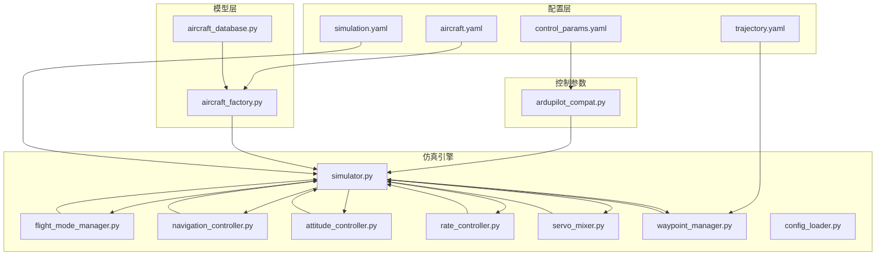
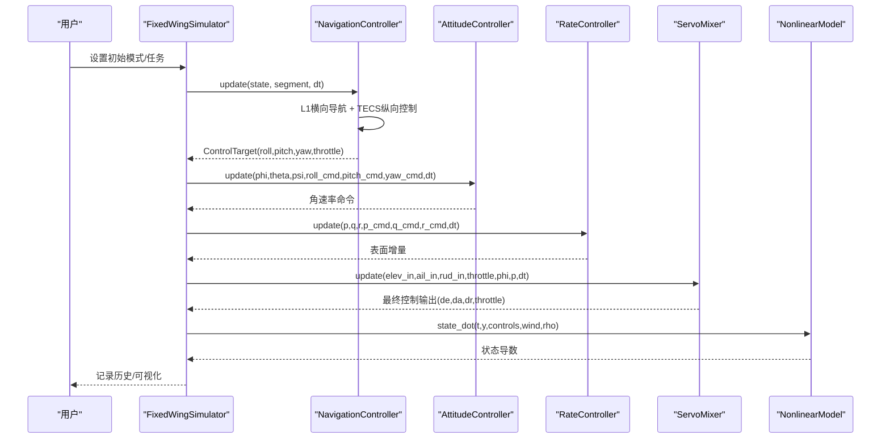
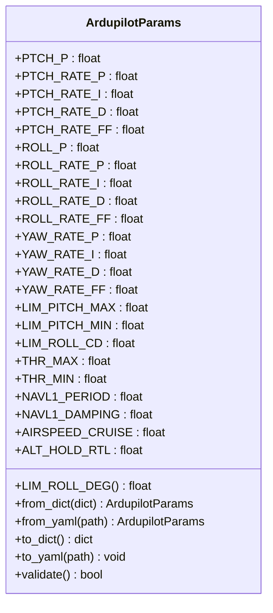
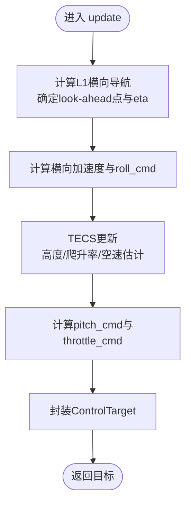
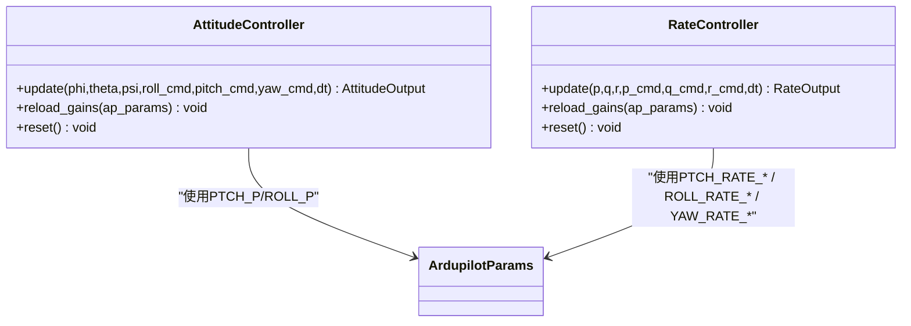
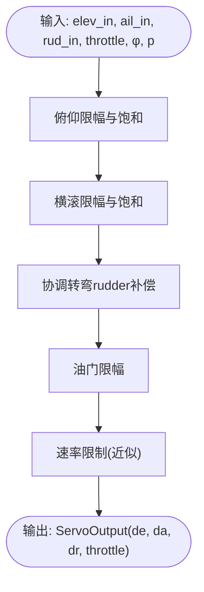
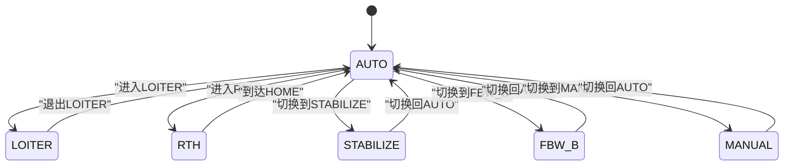
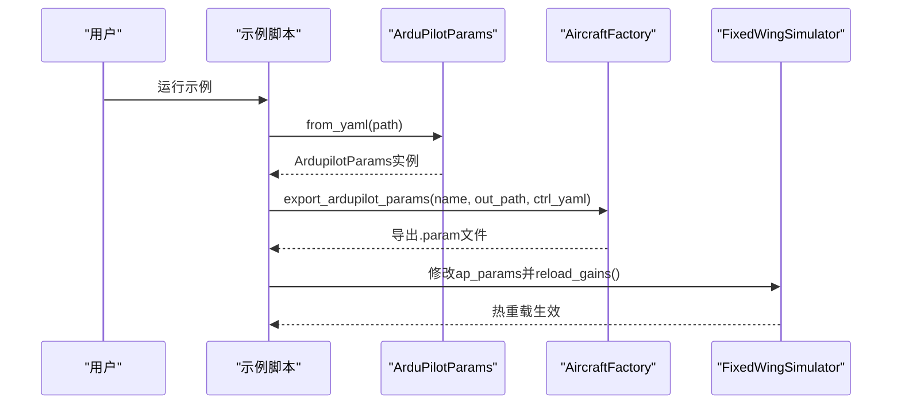
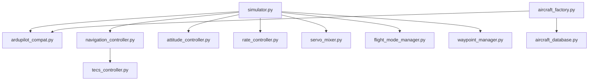

# ArduPilot兼容性

<cite>
**本文档引用的文件**
- [ardupilot_compat.py](file://src/control/ardupilot_compat.py)
- [example_6_ardupilot_parameters.py](file://examples/example_6_ardupilot_parameters.py)
- [aircraft_factory.py](file://src/models/aircraft_factory.py)
- [aircraft_database.py](file://src/models/aircraft_database.py)
- [simulator.py](file://src/simulation/simulator.py)
- [attitude_controller.py](file://src/control/attitude_controller.py)
- [rate_controller.py](file://src/control/rate_controller.py)
- [servo_mixer.py](file://src/control/servo_mixer.py)
- [flight_mode_manager.py](file://src/control/flight_mode_manager.py)
- [navigation_controller.py](file://src/control/navigation_controller.py)
- [tecs_controller.py](file://src/control/tecs_controller.py)
- [waypoint_manager.py](file://src/planning/waypoint_manager.py)
- [config_loader.py](file://src/utils/config_loader.py)
- [aircraft.yaml](file://config/aircraft.yaml)
- [control_params.yaml](file://config/control_params.yaml)
</cite>

## 目录
1. [引言](#引言)
2. [项目结构](#项目结构)
3. [核心组件](#核心组件)
4. [架构概览](#架构概览)
5. [详细组件分析](#详细组件分析)
6. [依赖分析](#依赖分析)
7. [性能考虑](#性能考虑)
8. [故障排除指南](#故障排除指南)
9. [结论](#结论)
10. [附录](#附录)

## 引言
本文件面向ArduPilot兼容性模块，系统性阐述FixedWingSimulator与ArduPilot系统的兼容性设计与实现细节。文档聚焦于以下目标：
- 解释ArduPilot参数容器与参数命名规范的映射关系
- 详述控制链路（导航、TECS、姿态、角速率、执行器）如何适配ArduPilot参数
- 说明参数导入/导出机制与双向同步策略
- 提供参数验证、热重载与兼容性测试方法
- 给出常见问题定位与解决方案

## 项目结构
FixedWingSimulator采用模块化分层架构，控制链路严格遵循ArduPilot五层控制层级（导航/L1→TECS→姿态→角速率→执行器），并通过ArduPilot参数容器统一参数来源与命名。

**图表来源**
- [simulator.py](file://src/simulation/simulator.py#L115-L234)
- [aircraft_factory.py](file://src/models/aircraft_factory.py#L39-L93)
- [aircraft_database.py](file://src/models/aircraft_database.py#L143-L166)
- [ardupilot_compat.py](file://src/control/ardupilot_compat.py#L17-L99)
- [config_loader.py](file://src/utils/config_loader.py#L59-L82)

**章节来源**
- [simulator.py](file://src/simulation/simulator.py#L115-L234)
- [aircraft_factory.py](file://src/models/aircraft_factory.py#L39-L93)
- [aircraft_database.py](file://src/models/aircraft_database.py#L143-L166)
- [ardupilot_compat.py](file://src/control/ardupilot_compat.py#L17-L99)
- [config_loader.py](file://src/utils/config_loader.py#L59-L82)

## 核心组件
- ArduPilot参数容器：提供与ArduPilot Plane完全一致的参数命名与默认值，支持YAML导入/导出与基础范围校验。
- 五层控制链路：导航控制器（L1+TECS）、姿态控制器、角速率控制器、执行器混合器，完整复刻ArduPilot控制层级。
- 飞行模式管理：支持MANUAL、STABILIZE、FBW_A、FBW_B、AUTO、LOITER、RTH等模式，与ArduPilot一致。
- 参数导入/导出：支持从ArduPilot .param文件导入，以及将仿真参数导出为ArduPilot .param格式。
- 热重载与验证：支持运行时热更新参数并进行范围校验，保障稳定性。

**章节来源**
- [ardupilot_compat.py](file://src/control/ardupilot_compat.py#L17-L130)
- [attitude_controller.py](file://src/control/attitude_controller.py#L33-L134)
- [rate_controller.py](file://src/control/rate_controller.py#L32-L109)
- [servo_mixer.py](file://src/control/servo_mixer.py#L54-L153)
- [flight_mode_manager.py](file://src/control/flight_mode_manager.py#L115-L298)
- [navigation_controller.py](file://src/control/navigation_controller.py#L45-L293)
- [tecs_controller.py](file://src/control/tecs_controller.py#L50-L647)
- [aircraft_factory.py](file://src/models/aircraft_factory.py#L94-L136)

## 架构概览
ArduPilot兼容性架构以ArduPilot参数容器为核心，贯穿仿真引擎各模块。控制链路自外向内依次为：导航控制器（L1+TECS）→姿态控制器→角速率控制器→执行器混合器。飞行模式管理器根据当前模式生成控制目标，驱动控制链路完成闭环控制。

**图表来源**
- [simulator.py](file://src/simulation/simulator.py#L419-L567)
- [navigation_controller.py](file://src/control/navigation_controller.py#L134-L202)
- [attitude_controller.py](file://src/control/attitude_controller.py#L81-L122)
- [rate_controller.py](file://src/control/rate_controller.py#L68-L98)
- [servo_mixer.py](file://src/control/servo_mixer.py#L80-L149)

## 详细组件分析

### ArduPilot参数容器与参数映射
- 参数命名与ArduPilot Plane完全一致，覆盖横滚/俯仰/偏航控制回路、限幅、导航L1、空速/高度设定、TECS参数等。
- 支持从YAML加载（扁平键值）、导出为YAML，以及基础范围校验。
- 提供便捷属性（如LIM_ROLL_DEG）将内部单位转换为仿真使用单位。

**图表来源**
- [ardupilot_compat.py](file://src/control/ardupilot_compat.py#L17-L130)

**章节来源**
- [ardupilot_compat.py](file://src/control/ardupilot_compat.py#L17-L130)
- [control_params.yaml](file://config/control_params.yaml#L1-L45)

### 导航控制器与L1+TECS
- L1横向导航：基于ArduPilot L1算法，结合地面速度投影确定期望航迹，计算横向加速度并转换为横滚角命令。
- TECS纵向控制：总比能量控制，协调油门与俯仰控制高度与空速，具备欠速保护、不可达下沉检测与自适应缩放。
- 导航控制器接收路径段与当前状态，输出ControlTarget（roll_cmd, pitch_cmd, throttle_cmd等）。

**图表来源**
- [navigation_controller.py](file://src/control/navigation_controller.py#L134-L202)
- [tecs_controller.py](file://src/control/tecs_controller.py#L247-L315)

**章节来源**
- [navigation_controller.py](file://src/control/navigation_controller.py#L45-L293)
- [tecs_controller.py](file://src/control/tecs_controller.py#L50-L647)

### 姿态控制器与角速率控制器
- 姿态控制器：独立的三轴PID（Roll P仅、Pitch P仅、Yaw无外环），输出角速率命令。
- 角速率控制器：独立的三轴PID（含P/I/D），作为SAS内环，提供阻尼与稳定。

**图表来源**
- [attitude_controller.py](file://src/control/attitude_controller.py#L33-L134)
- [rate_controller.py](file://src/control/rate_controller.py#L32-L109)

**章节来源**
- [attitude_controller.py](file://src/control/attitude_controller.py#L33-L134)
- [rate_controller.py](file://src/control/rate_controller.py#L32-L109)

### 执行器混合器与限幅
- 将表面增量转换为最终控制输出，应用限幅（俯仰/横滚/油门）、速率限制、协调转弯补偿，并输出归一化控制信号。

**图表来源**
- [servo_mixer.py](file://src/control/servo_mixer.py#L80-L149)

**章节来源**
- [servo_mixer.py](file://src/control/servo_mixer.py#L54-L153)

### 飞行模式管理
- 支持MANUAL、STABILIZE、FBW_A、FBW_B、AUTO、LOITER、RTH等模式，模式切换时进行过渡处理，生成ControlTarget供控制链路使用。

**图表来源**
- [flight_mode_manager.py](file://src/control/flight_mode_manager.py#L115-L298)

**章节来源**
- [flight_mode_manager.py](file://src/control/flight_mode_manager.py#L115-L298)

### 参数导入/导出与双向同步
- 导入：ArduPilotParams.from_yaml()从YAML加载参数；AircraftFactory.export_ardupilot_params()将飞机参数与控制参数打包为ArduPilot .param文件。
- 导出：ArduPilotParams.to_yaml()导出参数；示例脚本展示热重载与对比实验。
- 双向同步：仿真运行时可通过修改ap_params并调用控制器reload_gains()实现热重载；同时保留ArduPilot参数命名与范围约束。

**图表来源**
- [example_6_ardupilot_parameters.py](file://examples/example_6_ardupilot_parameters.py#L20-L84)
- [aircraft_factory.py](file://src/models/aircraft_factory.py#L94-L136)
- [ardupilot_compat.py](file://src/control/ardupilot_compat.py#L74-L99)

**章节来源**
- [example_6_ardupilot_parameters.py](file://examples/example_6_ardupilot_parameters.py#L1-L85)
- [aircraft_factory.py](file://src/models/aircraft_factory.py#L94-L136)
- [ardupilot_compat.py](file://src/control/ardupilot_compat.py#L74-L99)

## 依赖分析
- 模块耦合：仿真引擎通过ArduPilot参数容器统一控制参数来源；控制链路之间存在清晰的输入/输出契约。
- 外部依赖：YAML解析、数值计算库（numpy）、数据类（dataclasses）。
- 参数依赖：导航控制器依赖L1与TECS参数；姿态/角速率控制器依赖对应PID参数；执行器混合器依赖限幅与速率参数。

**图表来源**
- [simulator.py](file://src/simulation/simulator.py#L33-L52)
- [navigation_controller.py](file://src/control/navigation_controller.py#L20-L22)
- [aircraft_factory.py](file://src/models/aircraft_factory.py#L12-L12)

**章节来源**
- [simulator.py](file://src/simulation/simulator.py#L33-L52)
- [navigation_controller.py](file://src/control/navigation_controller.py#L20-L22)
- [aircraft_factory.py](file://src/models/aircraft_factory.py#L12-L12)

## 性能考虑
- 控制链路采样：默认dt=0.01s，保证控制响应与数值积分稳定性。
- 速率限制：执行器混合器对表面增量施加速率限制，避免瞬态过冲。
- TECS自适应：根据爬升/下沉需求动态缩放，提升鲁棒性。
- 热重载：支持运行时参数热更新，便于在线调参与快速验证。

[本节为通用指导，无需列出具体文件来源]

## 故障排除指南
- 参数越界：使用ArduPilotParams.validate()进行范围检查，出现警告时调整参数至合理区间。
- 控制不稳定：检查L1周期与阻尼、TECS时间常数与阻尼系数，逐步调整以改善响应。
- 油门饱和/积分饱和：确认TECS积分增益与油门限幅设置，必要时降低积分增益或增加阻尼。
- 模式切换异常：检查FlightModeManager模式切换逻辑与过渡处理，确保切换时正确重置控制器积分器。

**章节来源**
- [ardupilot_compat.py](file://src/control/ardupilot_compat.py#L104-L130)
- [tecs_controller.py](file://src/control/tecs_controller.py#L507-L534)
- [flight_mode_manager.py](file://src/control/flight_mode_manager.py#L152-L168)

## 结论
ArduPilot兼容性模块通过标准化参数容器与严格的控制链路实现，成功将ArduPilot的控制理念与参数体系移植到仿真环境中。模块支持参数导入/导出、热重载与范围校验，满足从参数迁移、在线调参到闭环仿真的完整需求。建议在实际工程中结合示例脚本与参数验证流程，建立规范化的参数管理与测试流程。

[本节为总结性内容，无需列出具体文件来源]

## 附录

### 支持的ArduPilot参数类型与映射
- 控制回路参数
  - 横滚：ROLL_P、ROLL_RATE_P、ROLL_RATE_I、ROLL_RATE_D、ROLL_RATE_FF
  - 俯仰：PTCH_P、PTCH_RATE_P、PTCH_RATE_I、PTCH_RATE_D、PTCH_RATE_FF
  - 偏航：YAW_RATE_P、YAW_RATE_I、YAW_RATE_D、YAW_RATE_FF
- 限幅参数：LIM_PITCH_MAX、LIM_PITCH_MIN、LIM_ROLL_CD、THR_MAX、THR_MIN
- 导航参数：NAVL1_PERIOD、NAVL1_DAMPING、AIRSPEED_CRUISE、ALT_HOLD_RTL
- TECS参数：TECS_CLMB_MAX、TECS_SINK_MIN、TECS_SINK_MAX、TECS_TIME_CONST、TECS_THR_DAMP、TECS_PTCH_DAMP、TECS_INTEG_GAIN、TECS_SPDWEIGHT、TECS_RLL2THR、TECS_PITCH_MAX、TECS_PITCH_MIN、TECS_THR_CRUISE、TECS_HDEM_TCONST

**章节来源**
- [ardupilot_compat.py](file://src/control/ardupilot_compat.py#L26-L60)
- [control_params.yaml](file://config/control_params.yaml#L1-L45)

### 参数导入/导出方法
- 导入：ArduPilotParams.from_yaml(path)、AircraftFactory.from_yaml(path)
- 导出：ArduPilotParams.to_yaml(path)、AircraftFactory.export_ardupilot_params(name, output_path, control_yaml)
- 示例：examples/example_6_ardupilot_parameters.py 展示了参数加载、验证、导出与热重载流程

**章节来源**
- [ardupilot_compat.py](file://src/control/ardupilot_compat.py#L74-L99)
- [aircraft_factory.py](file://src/models/aircraft_factory.py#L77-L136)
- [example_6_ardupilot_parameters.py](file://examples/example_6_ardupilot_parameters.py#L20-L84)

### 兼容性测试与验证流程
- 参数验证：调用ArduPilotParams.validate()检查参数范围
- 热重载验证：修改ap_params后调用控制器reload_gains()，观察控制响应变化
- 性能对比：示例脚本通过不同PTCH_P增益比较跟踪性能
- 模式切换：在AUTO/LOITER/RTH等模式间切换，验证TECS与L1响应

**章节来源**
- [ardupilot_compat.py](file://src/control/ardupilot_compat.py#L104-L130)
- [example_6_ardupilot_parameters.py](file://examples/example_6_ardupilot_parameters.py#L47-L84)
- [flight_mode_manager.py](file://src/control/flight_mode_manager.py#L152-L168)