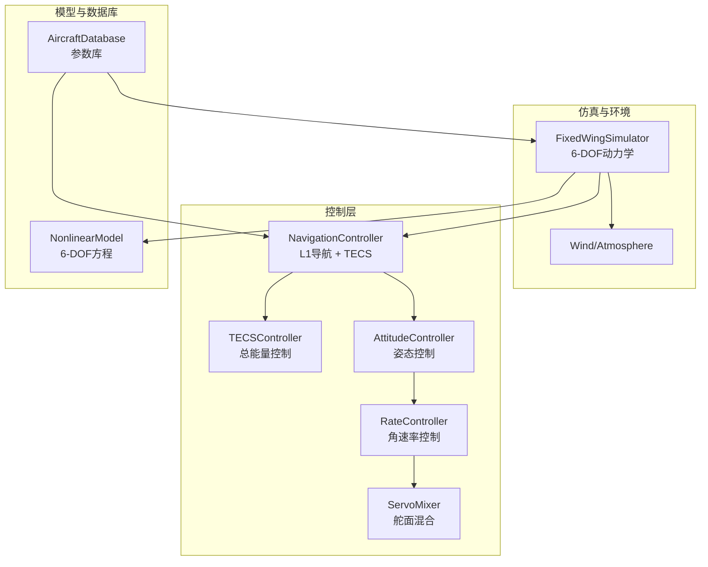
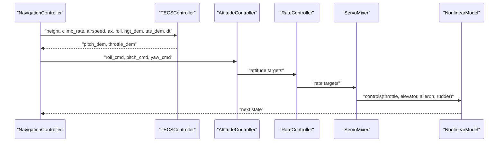
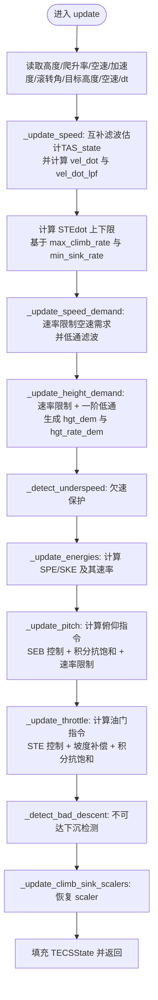
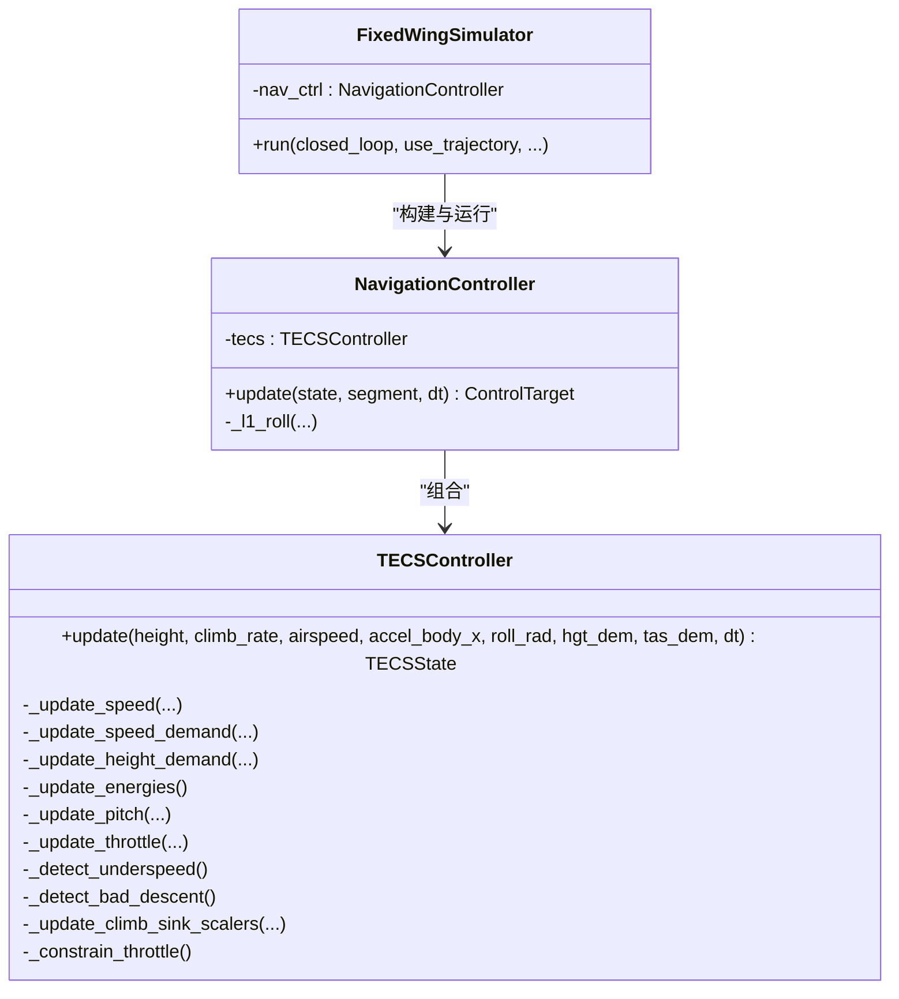

# TECS总能量控制

<cite>
**本文引用的文件**
- [tecs_controller.py](file://src/control/tecs_controller.py)
- [navigation_controller.py](file://src/control/navigation_controller.py)
- [simulator.py](file://src/simulation/simulator.py)
- [aircraft_database.py](file://src/models/aircraft_database.py)
- [nonlinear_model.py](file://src/dynamics/nonlinear_model.py)
- [control_params.yaml](file://config/control_params.yaml)
- [aircraft.yaml](file://config/aircraft.yaml)
- [debug_tecs.py](file://debug_tecs.py)
- [example_1_linear_response.py](file://examples/example_1_linear_response.py)
</cite>

## 目录
1. [简介](#简介)
2. [项目结构](#项目结构)
3. [核心组件](#核心组件)
4. [架构总览](#架构总览)
5. [详细组件分析](#详细组件分析)
6. [依赖关系分析](#依赖关系分析)
7. [性能考量](#性能考量)
8. [故障排查指南](#故障排查指南)
9. [结论](#结论)
10. [附录](#附录)

## 简介
本技术文档围绕TECS（Total Energy Control System，总能量控制系统）展开，系统性阐述其在固定翼飞机控制中的原理、数学模型、实现细节、参数配置与调优方法，并结合本项目的代码实现进行深入解析。TECS通过同时管理比能量（单位质量的势能SPE与动能SKE之和），实现高度与空速的协调控制，天然耦合高度与速度控制回路，有效避免传统解耦PID中常见的油门饱和与积分饱和问题。本文还提供性能分析、不同飞行条件下的应用示例与调试技巧，并与ArduPilot的AP_TECS实现进行对照。

## 项目结构
TECS位于控制层，与导航控制器、姿态/角速率控制器、舵面混合器共同构成ArduPilot风格的五层控制链路。TECS接收来自导航控制器的高度与空速需求，结合当前高度、爬升率、空速与沿速度方向的加速度估计，输出油门与俯仰指令，驱动后续的姿态与角速率控制层完成闭环控制。

图表来源
- [simulator.py](file://src/simulation/simulator.py#L115-L230)
- [navigation_controller.py](file://src/control/navigation_controller.py#L45-L118)
- [tecs_controller.py](file://src/control/tecs_controller.py#L50-L130)
- [aircraft_database.py](file://src/models/aircraft_database.py#L29-L133)
- [nonlinear_model.py](file://src/dynamics/nonlinear_model.py#L104-L160)

章节来源
- [simulator.py](file://src/simulation/simulator.py#L115-L230)
- [navigation_controller.py](file://src/control/navigation_controller.py#L45-L118)
- [tecs_controller.py](file://src/control/tecs_controller.py#L50-L130)
- [aircraft_database.py](file://src/models/aircraft_database.py#L29-L133)
- [nonlinear_model.py](file://src/dynamics/nonlinear_model.py#L104-L160)

## 核心组件
- TECSController：总能量控制器，负责计算油门与俯仰指令，实现高度与空速的协调控制。
- NavigationController：组合L1横向导航与TECS纵向控制，生成控制目标并传递给后续控制层。
- FixedWingSimulator：主仿真引擎，加载参数、构建控制链路、集成6-DOF动力学与环境模型。
- AircraftDatabase：固定翼飞机参数库，提供几何、气动、惯性等参数。
- NonlinearModel：6-DOF非线性方程组，提供状态导数与仿真能力。

章节来源
- [tecs_controller.py](file://src/control/tecs_controller.py#L50-L130)
- [navigation_controller.py](file://src/control/navigation_controller.py#L45-L118)
- [simulator.py](file://src/simulation/simulator.py#L115-L230)
- [aircraft_database.py](file://src/models/aircraft_database.py#L29-L133)
- [nonlinear_model.py](file://src/dynamics/nonlinear_model.py#L104-L160)

## 架构总览
TECS在ArduPilot风格的控制链路中承担纵向控制职责，与横向L1导航协同工作。其输入为当前高度、爬升率、空速、沿速度方向的加速度估计、滚转角与目标高度/空速；输出为油门与俯仰指令，由姿态/角速率控制器与舵面混合器执行。

图表来源
- [navigation_controller.py](file://src/control/navigation_controller.py#L134-L202)
- [tecs_controller.py](file://src/control/tecs_controller.py#L247-L315)
- [simulator.py](file://src/simulation/simulator.py#L499-L541)
- [nonlinear_model.py](file://src/dynamics/nonlinear_model.py#L160-L255)

## 详细组件分析

### TECSController 数学模型与实现
TECS的核心思想是将比能量（单位质量的能量）分解为势能（SPE）与动能（SKE），通过油门控制总比能量（STE= SPE+SKE），通过俯仰控制比能量分配比（SEB= SPE·w_spe - SKE·w_ske），其中w_spe与w_ske为权重，0~2之间，0表示纯高度控制，2表示纯速度控制，1为均衡。

- 比能量与速率
  - SPE = h × g，SKE = 0.5 × V^2
  - SPEdot = climb_rate × g，SKEdot = V × (ax - ax_lpf)
  - STEdot = SPEdot + SKEdot

- 能量需求与估计
  - SPE_dem = hgt_dem × g，SPE_dem_raw用于油门STE误差计算
  - SKE_dem = 0.5 × TAS_dem_adj^2
  - SPE_est = height × g，SKE_est = 0.5 × TAS_state^2

- 比能量分配比（SEB）与误差
  - SEB_dem = w_spe × SPE_dem - w_ske × SKE_dem
  - SEB_est = w_spe × SPE_est - w_ske × SKE_est
  - SEB_error = SEB_dem - SEB_est

- 俯仰指令计算
  - SEBdot_dem = hgt_rate_dem × g × w_spe + SEB_error / time_const
  - SEBdot_dem限幅于±(max_climb_rate × g, -max_sink_rate × g)
  - SEBdot_est = w_spe × SPEdot - w_ske × SKEdot
  - SEBdot_error = SEBdot_dem - SEBdot_est
  - SEBdot_dem_total = SEBdot_dem + SEBdot_error × ptch_damp
  - 积分项：integSEBdot与integKE，采用抗饱和逻辑
  - pitch_dem_unc = (SEBdot_dem_total + integSEBdot + integKE) / (V × g)
  - 速率限制：max_rate = vert_acc_lim / V，对pitch_dem进行限幅

- 油门指令计算
  - STE_error = STEdot_dem - STEdot_est，限幅于±4 × STEdot_max × time_const
  - SPE_err = saturate(SPE_dem_raw - SPE_est, SPE_err_min, SPE_err_max)
  - STE_error_raw = SPE_err + SKE_dem - SKE_est
  - STE_error = saturate(STE_error_raw, -STE_limit, STE_limit)
  - STEdot_ff = STEdot_dem + roll_comp_term（坡度补偿）
  - throttle_pd = K_STE2Thr × (STE_error + STEdot_error × thr_damp) + ff_throttle
  - 积分抗饱和：当输出饱和且积分方向会加剧饱和时，阻止积分更新
  - throttle_dem = throttle_pd + integTHR

- 保护逻辑
  - 欠速保护：当TAS_state过低且throttle接近上限时，强制提高空速需求
  - 不可达下沉检测：当STE_error过大且STEdot<0且throttle饱和时，标记不可达下沉

图表来源
- [tecs_controller.py](file://src/control/tecs_controller.py#L247-L315)
- [tecs_controller.py](file://src/control/tecs_controller.py#L321-L372)
- [tecs_controller.py](file://src/control/tecs_controller.py#L373-L431)
- [tecs_controller.py](file://src/control/tecs_controller.py#L445-L464)
- [tecs_controller.py](file://src/control/tecs_controller.py#L465-L552)
- [tecs_controller.py](file://src/control/tecs_controller.py#L553-L647)

章节来源
- [tecs_controller.py](file://src/control/tecs_controller.py#L247-L647)

### TECS 参数与调优
- 性能参数
  - TECS_CLMB_MAX：最大爬升率（m/s）
  - TECS_SINK_MIN/TECS_SINK_MAX：最小/最大下沉率（m/s）
  - TECS_TIME_CONST：控制时间常数（s），影响响应平滑度与超调
- 控制参数
  - TECS_THR_DAMP：油门阻尼，抑制油门波动
  - TECS_PTCH_DAMP：俯仰阻尼，抑制俯仰振荡
  - TECS_INTEG_GAIN：积分增益，降低积分振荡
  - TECS_VERT_ACC：最大竖向加速度限制（m/s²）
  - TECS_SPDWEIGHT：速度权重（0~2），0=高度优先，2=速度优先
  - TECS_RLL2THR：坡度转油门补偿增益，转弯时补偿诱导阻力增加
- 限幅与前馈
  - THR_MIN/THR_MAX/THR_CRUISE：油门限幅与巡航前馈
  - TECS_PITCH_MIN/TECS_PITCH_MAX：俯仰角限幅
  - TECS_HDEM_TCONST：高度需求低通时间常数

调优建议
- 响应平滑：增大TECS_TIME_CONST可降低振荡，但会增加上升时间
- 抑制振荡：提高TECS_THR_DAMP与TECS_PTCH_DAMP，降低TECS_INTEG_GAIN
- 速度优先：增大TECS_SPDWEIGHT；高度优先：减小
- 坡度补偿：根据最大坡度与最大cos^(-2)(φ)-1估算TECS_RLL2THR
- 限幅匹配：THR_CRUISE与THR_MAX/THR_MIN应与动力学与气动特性匹配

章节来源
- [control_params.yaml](file://config/control_params.yaml#L30-L45)
- [tecs_controller.py](file://src/control/tecs_controller.py#L80-L127)

### 与ArduPilot AP_TECS 的一致性
- 代码结构与命名与AP_TECS保持一致，确保行为可比对
- 能量模型、SEB控制、STE控制、欠速/不可达下沉保护等均与AP_TECS一致
- 互补滤波、速率限制、积分抗饱和等实现细节与AP_TECS一致

章节来源
- [tecs_controller.py](file://src/control/tecs_controller.py#L1-L25)

### 在仿真中的集成
- FixedWingSimulator加载控制参数，构建NavigationController与TECSController
- 导航控制器从轨迹规划器获取目标高度与空速，估计爬升率与体轴加速度，调用TECS
- TECS输出油门与俯仰指令，经姿态/角速率控制器与舵面混合器作用于6-DOF动力学

章节来源
- [simulator.py](file://src/simulation/simulator.py#L180-L230)
- [navigation_controller.py](file://src/control/navigation_controller.py#L134-L202)

## 依赖关系分析
TECSController依赖于以下模块与数据：
- 输入：高度、爬升率、空速、沿速度方向加速度、滚转角、目标高度、目标空速、dt
- 参数：最大爬升/下沉率、时间常数、阻尼、积分增益、速度权重、坡度补偿、限幅、巡航油门等
- 内部状态：空速互补滤波状态、高度需求滤波状态、能量估计与需求、积分器状态、保护标志等

图表来源
- [tecs_controller.py](file://src/control/tecs_controller.py#L247-L315)
- [navigation_controller.py](file://src/control/navigation_controller.py#L134-L202)
- [simulator.py](file://src/simulation/simulator.py#L190-L230)

章节来源
- [tecs_controller.py](file://src/control/tecs_controller.py#L247-L315)
- [navigation_controller.py](file://src/control/navigation_controller.py#L134-L202)
- [simulator.py](file://src/simulation/simulator.py#L190-L230)

## 性能考量
- 稳态精度
  - TECS通过SEB与STE双通道控制，避免传统解耦PID的积分饱和，提升稳态精度
  - 速度权重与时间常数直接影响稳态误差与收敛速度
- 动态响应特性
  - 时间常数TECS_TIME_CONST决定响应平滑度；过小易振荡，过大则响应迟缓
  - 阻尼参数TECS_THR_DAMP与TECS_PTCH_DAMP抑制油门与俯仰振荡
- 稳定性边界
  - 速率限制（VERT_ACC）与积分抗饱和逻辑确保系统在极限工况下稳定
  - 欠速与不可达下沉保护避免系统进入不稳定区域
- 计算复杂度
  - TECS单次update包含能量估计、SEB/STE控制律计算与多处限幅，计算量适中，适合实时控制

[本节为通用性能讨论，无需特定文件来源]

## 故障排查指南
- 油门饱和与积分饱和
  - 现象：油门达到THR_MAX/THR_MIN且持续，俯仰指令饱和
  - 排查：检查TECS_THR_DAMP、TECS_INTEG_GAIN、TECS_TIME_CONST是否过大；确认速度权重与目标空速是否合理
- 低空速抖动
  - 现象：空速低于阈值附近反复抖动
  - 排查：开启欠速保护（TECS自动将空速需求提升到最小值），检查TECS_SPDWEIGHT与速度包线
- 不可达下沉
  - 现象：STE误差过大且下降，油门饱和
  - 排查：检查目标高度与空速需求是否超出动力学能力；适当降低TECS_TIME_CONST或调整速度权重
- 坡度补偿不足
  - 现象：转弯时爬升能力下降明显
  - 排查：增大TECS_RLL2THR，确保转弯时有足够的油门前馈补偿

章节来源
- [tecs_controller.py](file://src/control/tecs_controller.py#L553-L647)
- [tecs_controller.py](file://src/control/tecs_controller.py#L432-L444)

## 结论
TECS通过总能量与比能量分配比的双通道控制，实现了高度与空速的自然耦合，显著降低了传统解耦控制中的饱和与积分饱和问题。本项目在ArduPilot AP_TECS基础上提供了完整的Python实现，参数与调优方法清晰明确，适用于TB2等固定翼无人机的纵向控制。通过合理的参数整定与保护机制，TECS可在多种飞行条件下实现稳定、平滑的控制性能。

[本节为总结性内容，无需特定文件来源]

## 附录

### 参数配置参考
- 控制参数（来自control_params.yaml）
  - TECS_CLMB_MAX：最大爬升率（m/s）
  - TECS_SINK_MIN/TECS_SINK_MAX：最小/最大下沉率（m/s）
  - TECS_TIME_CONST：控制时间常数（s）
  - TECS_THR_DAMP：油门阻尼
  - TECS_PTCH_DAMP：俯仰阻尼
  - TECS_INTEG_GAIN：积分增益
  - TECS_SPDWEIGHT：速度权重（0~2）
  - TECS_RLL2THR：坡度转油门补偿增益
  - TECS_PITCH_MIN/TECS_PITCH_MAX：俯仰角限幅
  - TECS_THR_CRUISE：巡航油门前馈
  - TECS_HDEM_TCONST：高度需求低通时间常数

- 飞机配置（来自aircraft.yaml）
  - aircraft_name：TB2

章节来源
- [control_params.yaml](file://config/control_params.yaml#L30-L45)
- [aircraft.yaml](file://config/aircraft.yaml#L5-L13)

### 应用示例与调试技巧
- 示例脚本
  - debug_tecs.py：用于分析高度控制行为，记录hgt_raw、hgt_lpf、altitude、throttle、pitch、speed、STE_error等变量，便于观察TECS内部状态
  - example_1_linear_response.py：展示线性模型开环分析与闭环PID对比，有助于理解TECS在不同控制策略下的表现差异

- 调试技巧
  - 使用debug_tecs.py进行长时间运行测试，观察STE误差、油门与俯仰的变化趋势
  - 逐步调整TECS_TIME_CONST与阻尼参数，观察超调与振荡情况
  - 在不同风场与载荷条件下验证TECS的鲁棒性

章节来源
- [debug_tecs.py](file://debug_tecs.py#L1-L67)
- [example_1_linear_response.py](file://examples/example_1_linear_response.py#L1-L206)

### 与其他控制策略的对比
- 传统解耦PID
  - 优点：实现简单，易于理解
  - 缺点：高度与空速控制相互解耦，易出现油门/积分饱和，超调较大
- TECS（总能量控制）
  - 优点：高度与速度天然耦合，避免解耦带来的饱和问题；通过SEB与STE双通道控制，稳态精度高，动态响应平滑
  - 缺点：需要准确的爬升率与加速度估计，参数整定相对复杂

[本节为概念性对比，无需特定文件来源]