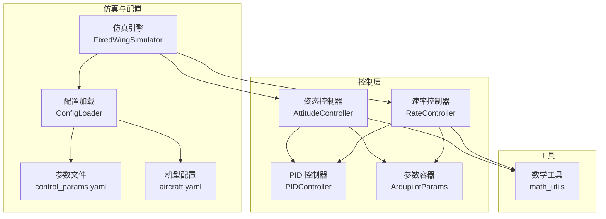
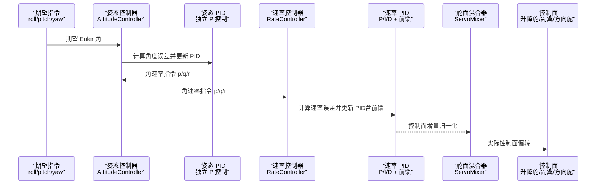
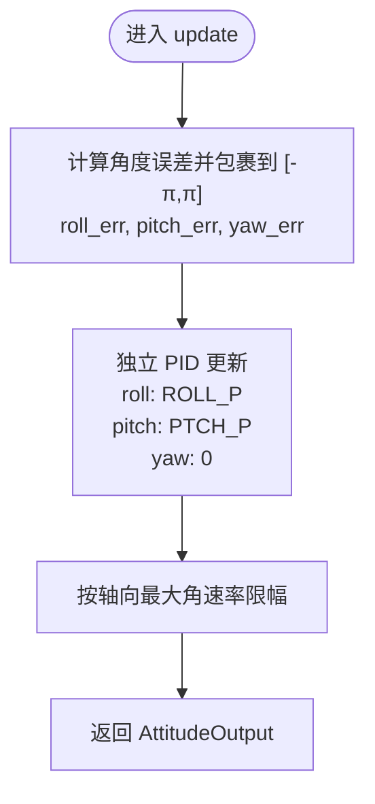
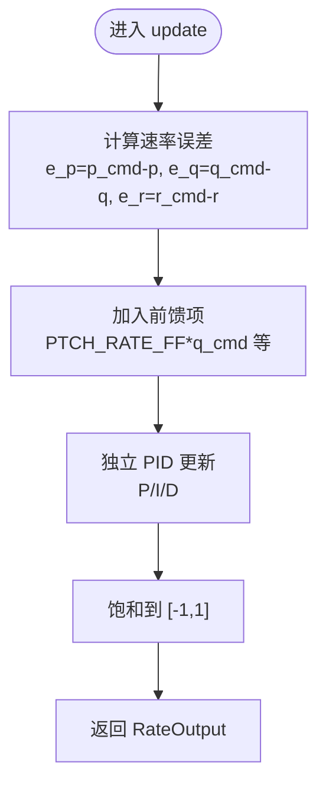
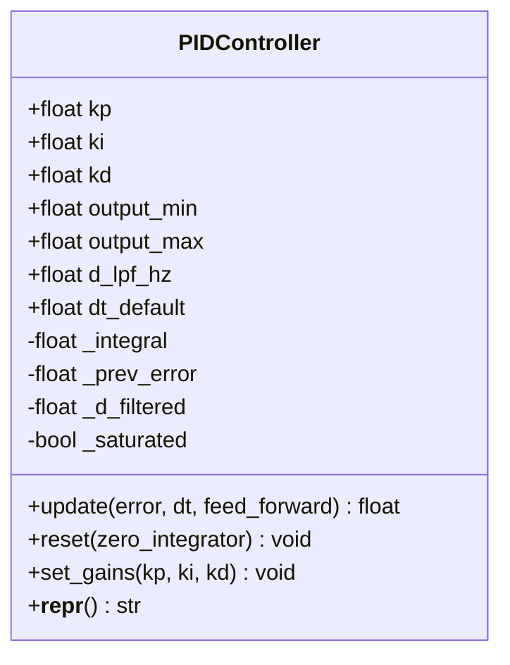
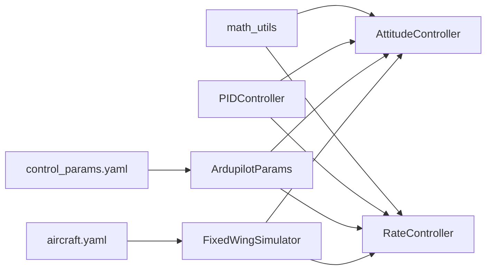

# 姿态与速率控制

<cite>
**本文引用的文件**
- [attitude_controller.py](file://src/control/attitude_controller.py)
- [rate_controller.py](file://src/control/rate_controller.py)
- [pid_controller.py](file://src/control/pid_controller.py)
- [ardupilot_compat.py](file://src/control/ardupilot_compat.py)
- [math_utils.py](file://src/utils/math_utils.py)
- [control_params.yaml](file://config/control_params.yaml)
- [aircraft.yaml](file://config/aircraft.yaml)
- [simulator.py](file://src/simulation/simulator.py)
- [test_control.py](file://tests/test_control.py)
- [example_3_trajectory_tracking.py](file://examples/example_3_trajectory_tracking.py)
</cite>

## 目录
1. [简介](#简介)
2. [项目结构](#项目结构)
3. [核心组件](#核心组件)
4. [架构总览](#架构总览)
5. [详细组件分析](#详细组件分析)
6. [依赖关系分析](#依赖关系分析)
7. [性能考量](#性能考量)
8. [故障排查指南](#故障排查指南)
9. [结论](#结论)
10. [附录](#附录)

## 简介
本技术文档围绕固定翼飞机的姿态与速率控制系统展开，系统采用双层控制结构：外层姿态控制器将期望角度指令转换为角速率指令；内层速率控制器实现精确的角速率跟踪，并通过稳定性增强系统（SAS）形成稳定的内环回路。PID控制器作为核心执行器贯穿两层控制，承担比例、积分、微分以及抗饱和等关键功能。本文将从架构、数据流、处理逻辑、参数配置、调试与优化等方面进行深入解析，并提供典型场景下的参数配置建议与常见问题解决方案。

## 项目结构
本项目采用模块化组织，控制相关代码集中在 src/control 下，参数配置位于 config，仿真主入口在 main.py，示例脚本位于 examples。姿态与速率控制涉及以下关键模块：
- 姿态控制器：将期望 Euler 角转换为角速率命令
- 速率控制器：基于 PID 的内环控制，输出控制面增量
- PID 控制器：通用 PID 实现，支持抗饱和与微分低通滤波
- 参数容器：ArduPilot 兼容参数集，支持 YAML 加载与校验
- 数学工具：角度包裹、饱和、旋转矩阵等基础运算
- 示例与测试：验证控制链路与参数有效性

图表来源
- [attitude_controller.py](file://src/control/attitude_controller.py#L33-L134)
- [rate_controller.py](file://src/control/rate_controller.py#L32-L109)
- [pid_controller.py](file://src/control/pid_controller.py#L17-L117)
- [ardupilot_compat.py](file://src/control/ardupilot_compat.py#L17-L130)
- [math_utils.py](file://src/utils/math_utils.py#L13-L36)
- [simulator.py](file://src/simulation/simulator.py#L165-L200)
- [control_params.yaml](file://config/control_params.yaml#L1-L45)
- [aircraft.yaml](file://config/aircraft.yaml#L1-L13)

章节来源
- [simulator.py](file://src/simulation/simulator.py#L165-L200)
- [control_params.yaml](file://config/control_params.yaml#L1-L45)
- [aircraft.yaml](file://config/aircraft.yaml#L1-L13)

## 核心组件
- 姿态控制器（AttitudeController）
  - 功能：将期望 Euler 角（roll、pitch、yaw）转换为角速率指令（p、q、r），采用独立 PID 控制，roll 与 pitch 使用 P 控制，yaw 采用零增益（直接传递）。
  - 输出限幅：roll、pitch、yaw 各自最大角速率限制，防止过度饱和。
  - 角度误差计算：使用角度包裹函数确保误差在 [-π, π] 范围内。
- 速率控制器（RateController）
  - 功能：内环控制，基于 PID 将角速率误差转换为控制面增量（升降舵、副翼、方向舵），并支持前馈项。
  - 输出限幅：控制面增量归一到 [-1, 1] 区间，满足作动器物理限制。
  - 稳定性增强：SAS 内环始终激活，提供短周期与长周期模态阻尼。
- PID 控制器（PIDController）
  - 功能：标准离散 PID，包含比例、积分、微分项，支持可选微分低通滤波与抗饱和（积分仅在未饱和时累积）。
  - 接口：update(error, dt, feed_forward)，reset()，set_gains()。
- 参数容器（ArdupilotParams）
  - 功能：ArduPilot 兼容参数命名，支持 YAML 加载、保存与基本范围校验，提供常用属性如 LIM_ROLL_DEG。
- 数学工具（math_utils）
  - 功能：角度包裹、饱和、角度与旋转矩阵转换、攻角与侧滑角计算等。

章节来源
- [attitude_controller.py](file://src/control/attitude_controller.py#L33-L134)
- [rate_controller.py](file://src/control/rate_controller.py#L32-L109)
- [pid_controller.py](file://src/control/pid_controller.py#L17-L117)
- [ardupilot_compat.py](file://src/control/ardupilot_compat.py#L17-L130)
- [math_utils.py](file://src/utils/math_utils.py#L13-L36)

## 架构总览
姿态与速率控制采用五层 ArduPilot 控制链中的“外层姿态 + 内层速率 + SAS”结构。外层姿态控制器负责将期望角度转换为角速率指令；内层速率控制器以测量角速率为反馈，结合前馈与 PID 输出控制面增量；SAS 作为最内层回路，持续提供阻尼，保证系统稳定。

图表来源
- [attitude_controller.py](file://src/control/attitude_controller.py#L81-L122)
- [rate_controller.py](file://src/control/rate_controller.py#L68-L98)
- [pid_controller.py](file://src/control/pid_controller.py#L55-L98)

## 详细组件分析

### 姿态控制器（AttitudeController）
- 结构与职责
  - 三轴独立 PID：roll 使用 ROLL_P，pitch 使用 PTCH_P，yaw 采用零增益（pass-through）。
  - 输出限幅：roll、pitch、yaw 最大角速率分别限制，避免过饱和。
  - 角度误差：使用 wrap_angle 将误差包裹到 [-π, π]，提高控制稳定性。
- 数据流
  - 输入：当前 Euler 角 φ、θ、ψ 与期望角 φ_cmd、θ_cmd、ψ_cmd。
  - 处理：计算角度误差，经 PID 更新得到角速率指令。
  - 输出：AttitudeOutput（roll_rate_cmd、pitch_rate_cmd、yaw_rate_cmd）。
- 关键接口
  - update：计算并返回角速率指令。
  - reload_gains：热重载 ArdupilotParams 中的增益。
  - reset：模式切换时重置各 PID 积分器与状态。

图表来源
- [attitude_controller.py](file://src/control/attitude_controller.py#L107-L122)
- [math_utils.py](file://src/utils/math_utils.py#L13-L15)

章节来源
- [attitude_controller.py](file://src/control/attitude_controller.py#L33-L134)
- [math_utils.py](file://src/utils/math_utils.py#L13-L15)

### 速率控制器（RateController）
- 结构与职责
  - 三轴独立 PID：pitch 使用 PTCH_RATE_P/I/D，roll 使用 ROLL_RATE_P/I，yaw 使用 YAW_RATE_P/I。
  - 前馈项：在 ArduPilot 约定中，前馈在饱和之前加入，提升动态响应。
  - 输出限幅：控制面增量归一到 [-1, 1]，满足作动器物理限制。
- 数据流
  - 输入：测量角速率 p、q、r 与姿态控制器输出的角速率指令 p_cmd、q_cmd、r_cmd。
  - 处理：计算速率误差，更新 PID（含前馈），饱和输出。
  - 输出：RateOutput（elevator、aileron、rudder）。
- 关键接口
  - update：计算并返回控制面增量。
  - reload_gains：热重载 ArdupilotParams 中的速率增益。
  - reset：重置各轴速率 PID 积分器与状态。

图表来源
- [rate_controller.py](file://src/control/rate_controller.py#L68-L98)

章节来源
- [rate_controller.py](file://src/control/rate_controller.py#L32-L109)

### PID 控制器（PIDController）
- 结构与职责
  - 标准离散 PID：比例、积分、微分三项，支持可选微分低通滤波。
  - 抗饱和：仅在未饱和时积分累加，并对积分本身进行限幅。
  - 接口：update、reset、set_gains。
- 数学实现要点
  - 微分项：(error - prev_error) / dt，可选低通滤波。
  - 积分项：仅在未饱和时累加，且积分自身限幅。
  - 总输出：比例 + 积分 + 微分 + 前馈，再饱和到输出限幅。
- 性能与稳定性
  - d_lpf_hz 控制微分噪声；output_min/output_max 限制输出范围。
  - reset 在模式切换时清空积分与导数状态，避免突变。

图表来源
- [pid_controller.py](file://src/control/pid_controller.py#L17-L117)

章节来源
- [pid_controller.py](file://src/control/pid_controller.py#L17-L117)

### 参数容器（ArdupilotParams）
- 结构与职责
  - 提供与 ArduPilot Plane 完全一致的参数命名，便于移植与对比。
  - 支持 from_yaml、to_yaml、from_dict、validate 等操作。
  - 提供 LIM_ROLL_DEG 属性，将 centidegrees 转换为度。
- 参数范围校验
  - 对关键参数进行范围检查，越界打印警告并返回 False。

章节来源
- [ardupilot_compat.py](file://src/control/ardupilot_compat.py#L17-L130)

### 数学工具（math_utils）
- 角度处理：wrap_angle、wrap_angle_deg、deg2rad、rad2deg。
- 矩阵与变换：3-2-1 欧拉旋转矩阵、体坐标与 NED 坐标变换、欧拉角速率映射。
- 空气动力学辅助：攻角、侧滑角、动压计算。

章节来源
- [math_utils.py](file://src/utils/math_utils.py#L13-L36)
- [math_utils.py](file://src/utils/math_utils.py#L43-L100)
- [math_utils.py](file://src/utils/math_utils.py#L107-L124)

## 依赖关系分析
- 组件耦合
  - 姿态控制器与速率控制器均依赖 PID 控制器与 ArdupilotParams。
  - 二者共享数学工具库中的角度包裹与饱和函数。
- 外部依赖
  - NumPy 用于数值计算与矩阵运算。
  - YAML 用于参数文件加载与保存。
- 潜在循环依赖
  - 控制器之间无直接循环导入，通过参数容器与工具库间接耦合，结构清晰。

图表来源
- [attitude_controller.py](file://src/control/attitude_controller.py#L20-L22)
- [rate_controller.py](file://src/control/rate_controller.py#L20-L21)
- [pid_controller.py](file://src/control/pid_controller.py#L13-L14)
- [ardupilot_compat.py](file://src/control/ardupilot_compat.py#L74-L98)
- [aircraft.yaml](file://config/aircraft.yaml#L1-L13)
- [simulator.py](file://src/simulation/simulator.py#L165-L171)

章节来源
- [attitude_controller.py](file://src/control/attitude_controller.py#L20-L22)
- [rate_controller.py](file://src/control/rate_controller.py#L20-L21)
- [pid_controller.py](file://src/control/pid_controller.py#L13-L14)
- [ardupilot_compat.py](file://src/control/ardupilot_compat.py#L74-L98)
- [aircraft.yaml](file://config/aircraft.yaml#L1-L13)
- [simulator.py](file://src/simulation/simulator.py#L165-L171)

## 性能考量
- 采样与稳定性
  - dt 影响 PID 的积分与微分项，过大的 dt 会导致不稳定或积分饱和。
  - 建议在仿真与飞行中保持一致的 dt，并根据系统带宽选择合适的采样周期。
- 抗饱和与积分限幅
  - PID 的抗饱和机制仅在未饱和时积分，且对积分自身进行限幅，有效避免积分风车。
- 微分低通滤波
  - d_lpf_hz 可抑制高频噪声，但会引入相位延迟，需权衡。
- 前馈与跟踪性能
  - 速率控制器的前馈项可显著改善阶跃响应，减少稳态误差。
- 输出限幅与物理约束
  - 姿态控制器与速率控制器均对输出进行限幅，避免超出实际控制器能力。
- 参数范围校验
  - ArdupilotParams.validate 提供基本范围检查，有助于规避不合理的参数组合。

[本节为通用性能讨论，无需特定文件来源]

## 故障排查指南
- 稳态误差分析
  - 若存在稳态误差，优先检查积分项是否被抗饱和机制抑制（输出饱和导致积分停止累加）。
  - 可尝试降低目标指令幅度或调整 Ki，观察是否缓解。
- 动态响应优化
  - 提高 Kp 可加快响应，但可能增加超调与振荡；适当提高 Kd 可抑制振荡。
  - 引入或调整前馈项（PTCH_RATE_FF、ROLL_RATE_FF、YAW_RATE_FF）可改善阶跃跟踪。
- 抗干扰能力提升
  - 增大 Kd 或启用微分低通滤波可抑制噪声放大。
  - 速率控制器输出限幅应与作动器能力匹配，避免饱和引发积分风车。
- 参数校验与热重载
  - 使用 ArdupilotParams.validate 检查参数范围；通过 reload_gains 在线更新增益。
- 单元测试参考
  - 测试覆盖了 PID 的比例、积分、微分、抗饱和、reset、set_gains、feed_forward 等行为，可对照验证实现正确性。

章节来源
- [test_control.py](file://tests/test_control.py#L61-L148)
- [test_control.py](file://tests/test_control.py#L259-L305)
- [ardupilot_compat.py](file://src/control/ardupilot_compat.py#L104-L129)

## 结论
本姿态与速率控制系统以双层 PID 结构为核心，外层姿态控制器负责将期望角度转换为角速率指令，内层速率控制器实现精确的角速率跟踪并提供稳定性增强。PID 控制器具备抗饱和与微分低通等特性，参数容器提供 ArduPilot 兼容的参数命名与校验。通过合理的参数配置与调试策略，可在多种典型场景下实现稳定、快速、低稳态误差的控制性能。

[本节为总结性内容，无需特定文件来源]

## 附录

### 典型控制场景与参数配置建议
- 平飞保持
  - 姿态层：ROLL_P、PTCH_P 设为适中值，确保对角度扰动有足够响应。
  - 速率层：PTCH_RATE_P、ROLL_RATE_P、YAW_RATE_P 适度提高；PTCH_RATE_I、ROLL_RATE_I 可按需开启以消除稳态误差。
  - 前馈：PTCH_RATE_FF、ROLL_RATE_FF 可根据阶跃响应调整。
- 转弯协调
  - 速率层：ROLL_RATE_I 与 YAW_RATE_P 配合，保证协调转弯时的稳定性。
  - 输出限幅：确保控制面增量不超过作动器能力。
- 轨迹跟踪（示例）
  - 示例脚本展示了自动模式下的轨迹跟踪，可据此评估姿态与速率控制在复杂路径下的表现。

章节来源
- [control_params.yaml](file://config/control_params.yaml#L7-L23)
- [example_3_trajectory_tracking.py](file://examples/example_3_trajectory_tracking.py#L70-L98)

### 常见问题与解决方案
- 角速率指令过大导致饱和
  - 解决：降低姿态层增益或增大最大角速率限幅；检查输入期望角是否合理。
- 控制面输出饱和引发积分风车
  - 解决：启用抗饱和机制；必要时降低 Ki 或增加输出限幅。
- 响应过慢或过快
  - 解决：调整 Kp；若过快，适当提高 Kd 或启用微分低通滤波。
- 前馈不足导致阶跃响应滞后
  - 解决：引入或增大前馈项（PTCH_RATE_FF、ROLL_RATE_FF、YAW_RATE_FF）。

[本节为通用指导，无需特定文件来源]