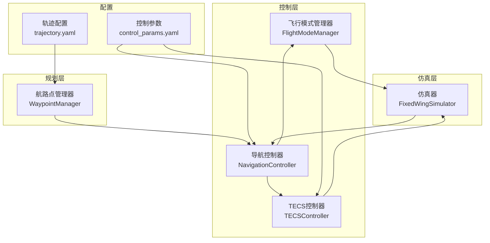
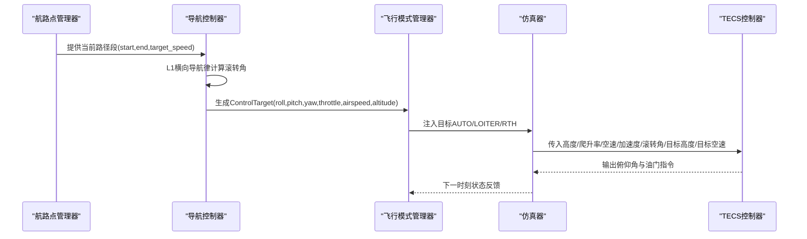
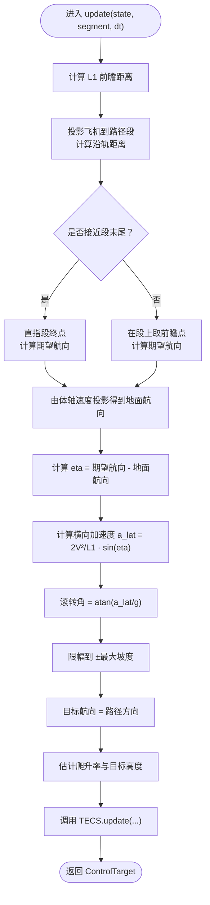
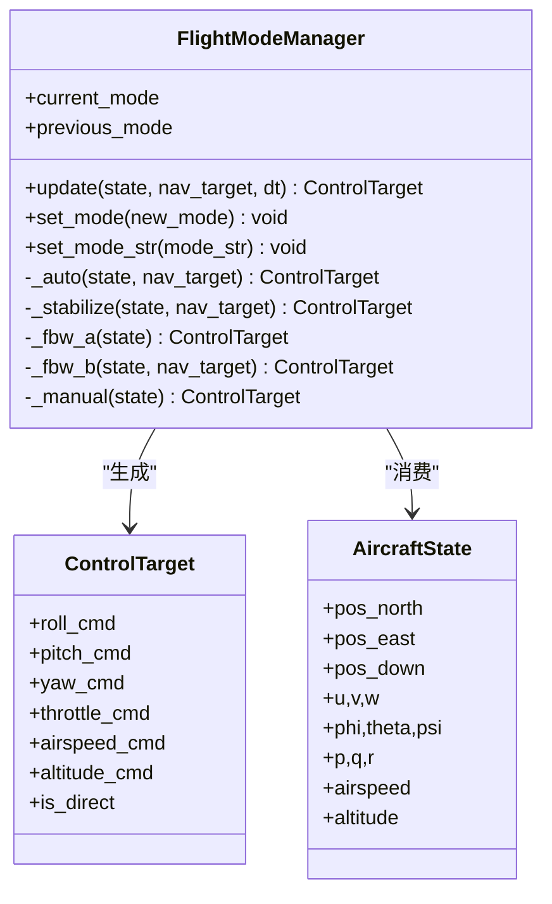
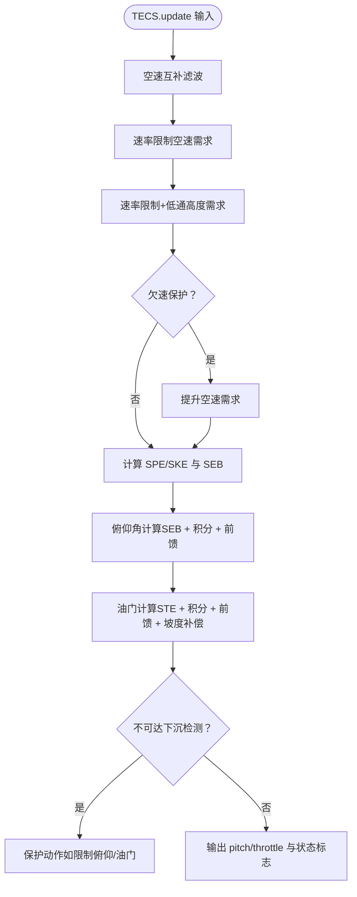
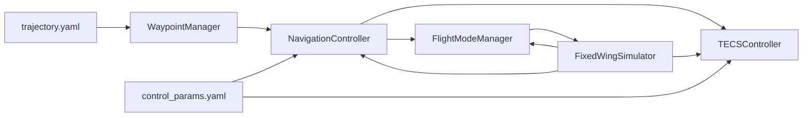

# 导航控制器

<cite>
**本文引用的文件列表**
- [navigation_controller.py](file://src/control/navigation_controller.py)
- [flight_mode_manager.py](file://src/control/flight_mode_manager.py)
- [tecs_controller.py](file://src/control/tecs_controller.py)
- [waypoint_manager.py](file://src/planning/waypoint_manager.py)
- [control_params.yaml](file://config/control_params.yaml)
- [trajectory.yaml](file://config/trajectory.yaml)
- [example_3_trajectory_tracking.py](file://examples/example_3_trajectory_tracking.py)
- [math_utils.py](file://src/utils/math_utils.py)
- [simulator.py](file://src/simulation/simulator.py)
- [main.py](file://main.py)
</cite>

## 目录
1. [简介](#简介)
2. [项目结构](#项目结构)
3. [核心组件](#核心组件)
4. [架构总览](#架构总览)
5. [详细组件分析](#详细组件分析)
6. [依赖关系分析](#依赖关系分析)
7. [性能考量](#性能考量)
8. [故障排查指南](#故障排查指南)
9. [结论](#结论)
10. [附录](#附录)

## 简介
本技术文档围绕固定翼导航控制器展开，系统阐述其在路径跟踪与轨迹跟随中的作用与实现原理，涵盖以下要点：
- 导航控制器在固定翼飞行中的职责：基于L1横向导航律生成滚转指令，结合TECS进行高度与空速协同控制，向姿态/速率控制层提供目标状态指令。
- 路径跟踪与轨迹跟随基本原理：直线段路径段的投影、前瞻点选择、航向角计算与滚转角命令生成；高度需求经低通滤波与速率限制后进入TECS。
- 导航控制算法实现细节：位置误差与航向角计算、速度控制策略（TECS）、航向角计算方法（基于地面速度方向）。
- 与飞行模式管理器的协作：在AUTO/LOITER/RTH等模式下，由导航控制器生成ControlTarget，飞行模式管理器将其注入到姿态/速率控制链路。
- 导航参数设置与调优：L1周期/阻尼、TECS参数、速度/高度目标、油门/俯仰限幅等；提供调参建议与调试技巧。
- 性能评估与调试：轨迹跟踪精度、响应时间、稳定性分析；典型场景配置示例与常见问题诊断。

## 项目结构
导航控制器位于控制层，与飞行模式管理器、TECS控制器、航路点管理器共同构成ArduPilot风格的五层控制链路（手动/稳定/导航/姿态/速率/舵面混控），并通过仿真器驱动闭环运行。

图表来源
- [simulator.py](file://src/simulation/simulator.py#L115-L200)
- [navigation_controller.py](file://src/control/navigation_controller.py#L45-L202)
- [flight_mode_manager.py](file://src/control/flight_mode_manager.py#L115-L298)
- [tecs_controller.py](file://src/control/tecs_controller.py#L50-L315)
- [waypoint_manager.py](file://src/planning/waypoint_manager.py#L20-L208)
- [control_params.yaml](file://config/control_params.yaml#L1-L45)
- [trajectory.yaml](file://config/trajectory.yaml#L1-L23)

章节来源
- [simulator.py](file://src/simulation/simulator.py#L115-L200)
- [navigation_controller.py](file://src/control/navigation_controller.py#L45-L202)
- [flight_mode_manager.py](file://src/control/flight_mode_manager.py#L115-L298)
- [tecs_controller.py](file://src/control/tecs_controller.py#L50-L315)
- [waypoint_manager.py](file://src/planning/waypoint_manager.py#L20-L208)
- [control_params.yaml](file://config/control_params.yaml#L1-L45)
- [trajectory.yaml](file://config/trajectory.yaml#L1-L23)

## 核心组件
- 导航控制器（NavigationController）
  - 基于L1横向导航律生成滚转角命令，计算航向角（沿路径方向），并将目标高度与目标空速传递给TECS。
  - 内部封装TECS控制器，负责高度与空速的协同控制。
- 飞行模式管理器（FlightModeManager）
  - 维护飞行模式（MANUAL、STABILIZE、FBW_A、FBW_B、AUTO、LOITER、RTH），在AUTO/LOITER/RTH模式下接收导航控制器的目标并注入到姿态/速率控制链。
- TECS控制器（TECSController）
  - 以总比能量（SPE+SKE）和比能量分配比（SEB）为核心，实现油门与俯仰的解耦控制，具备欠速保护、不可达下沉检测与自适应爬升/下沉缩放。
- 航路点管理器（WaypointManager）
  - 管理NED坐标系下的航路点，构建轨迹对象，提供当前活动路径段与剩余时间，支持最小摇摆/最小急动等轨迹类型。
- 配置文件
  - control_params.yaml：ArduPilot风格控制参数（L1、TECS、PID等）。
  - trajectory.yaml：轨迹类型、航路点、航向控制模式与循环设置。

章节来源
- [navigation_controller.py](file://src/control/navigation_controller.py#L45-L202)
- [flight_mode_manager.py](file://src/control/flight_mode_manager.py#L115-L298)
- [tecs_controller.py](file://src/control/tecs_controller.py#L50-L315)
- [waypoint_manager.py](file://src/planning/waypoint_manager.py#L20-L208)
- [control_params.yaml](file://config/control_params.yaml#L1-L45)
- [trajectory.yaml](file://config/trajectory.yaml#L1-L23)

## 架构总览
导航控制器在AUTO模式下作为“目标生成器”，将路径几何与状态估计转换为姿态/速率控制所需的指令。整体控制链路如下：

图表来源
- [navigation_controller.py](file://src/control/navigation_controller.py#L134-L202)
- [flight_mode_manager.py](file://src/control/flight_mode_manager.py#L271-L298)
- [tecs_controller.py](file://src/control/tecs_controller.py#L247-L315)
- [waypoint_manager.py](file://src/planning/waypoint_manager.py#L178-L208)

## 详细组件分析

### 导航控制器（NavigationController）
- 角色定位
  - 在固定翼飞行中承担“路径跟踪”与“高度/空速协调”的双重职责。
  - 通过L1横向导航律生成滚转角命令，计算航向角（沿路径方向），并将目标高度与目标空速交给TECS。
- 关键算法
  - L1横向导航律
    - 计算L1前瞻距离：L1 = max(V * T / (2π), 5.0)，其中T为L1周期。
    - 投影飞机到路径段，确定沿轨距离；在段末尾采用“直指终点”的策略以避免“机头高”过冲。
    - 使用体轴速度u/v在NED平面投影得到地面速度方向，计算期望航向与滚转角命令。
  - 航向角计算
    - 依据路径段方向向量计算目标航向角（yaw_cmd），确保在侧风/侧滑条件下仍能准确跟踪。
  - 目标高度与爬升率估计
    - 从NED垂直速度估计爬升率：V·sin(γ) ≈ u·sin(θ) − w·cos(θ)。
    - 目标高度来自路径段终点（正上方为NED负方向），并经过低通滤波与速率限制后送入TECS。
  - TECS集成
    - 将目标高度与目标空速输入TECS，得到俯仰角与油门指令，并写入ControlTarget。
- 数据结构与复杂度
  - PathSegment：存储起点、终点与目标速度，提供方向向量与长度属性，O(1)访问。
  - NavigationController.update：对每个控制步执行一次，涉及向量运算与三角函数，整体O(1)。
- 错误处理与边界条件
  - 路径段长度过短时返回零滚转角，避免数值不稳定。
  - 滚转角限幅，防止超出最大允许坡度。
  - 爬升率估计使用最小空速阈值，避免低速时估计误差过大。

图表来源
- [navigation_controller.py](file://src/control/navigation_controller.py#L134-L202)
- [navigation_controller.py](file://src/control/navigation_controller.py#L206-L292)

章节来源
- [navigation_controller.py](file://src/control/navigation_controller.py#L45-L202)
- [navigation_controller.py](file://src/control/navigation_controller.py#L206-L292)
- [math_utils.py](file://src/utils/math_utils.py#L13-L25)

### 飞行模式管理器（FlightModeManager）
- 角色定位
  - 统一管理飞行模式切换与目标生成，将导航控制器提供的ControlTarget按模式规则注入到姿态/速率控制链。
- 关键流程
  - AUTO/LOITER/RTH：优先使用导航控制器提供的目标；LOITER首次进入时捕获当前位置作为环场中心；RTH时若无导航目标则默认保持巡航高度与速度。
  - STABILIZE：保持机翼水平，使用导航提供的俯仰/油门命令；ALT HOLD + AIRSPEED HOLD。
  - FBW_A/B：模拟飞控手柄输入，保持当前姿态或高度/速度。
  - MANUAL：直接透传操纵输入，绕过姿态/速率回路。
- 与导航控制器协作
  - 在AUTO/LOITER/RTH模式下，直接采用导航控制器输出的ControlTarget；在其他模式下生成替代目标。

图表来源
- [flight_mode_manager.py](file://src/control/flight_mode_manager.py#L115-L298)

章节来源
- [flight_mode_manager.py](file://src/control/flight_mode_manager.py#L115-L298)

### TECS控制器（TECSController）
- 核心思想
  - 以总比能量（SPE+SKE）和比能量分配比（SEB）为核心，实现油门与俯仰的协同控制，避免传统解耦PID的油门饱和与积分饱和问题。
- 主要模块
  - 空速互补滤波：融合传感器测量与沿速度方向加速度估计，获得更稳定的空速估计。
  - 空速/高度需求更新：速率限制与低通滤波，防止目标指令突变导致超调。
  - 欠速保护：当空速低于阈值且油门饱和时，强制提升空速需求。
  - 不可达下沉检测：当油门饱和且能量下降时，判定为不可达下沉并触发保护。
  - 俯仰角与油门计算：基于SEB误差与STE误差，采用PD+积分+前馈，结合坡度补偿与限幅。
- 参数与调优
  - TECS_CLMB_MAX/SINK_MIN/SINK_MAX：爬升/下沉速率上限与下限。
  - TECS_TIME_CONST：控制时间常数，影响响应平滑度与振荡倾向。
  - TECS_THR_DAMP/TECS_PTCH_DAMP：油门/俯仰阻尼，抑制振荡。
  - TECS_INTEG_GAIN：积分增益，降低稳态误差但易引发振荡。
  - TECS_SPDWEIGHT：速度权重（0~2），0为高度优先，2为速度优先。
  - TECS_RLL2THR：坡度转油门补偿，转弯时增加油门以抵消诱导阻力。
  - TECS_PITCH_MIN/TECS_PITCH_MAX：俯仰角限幅。
  - TECS_THR_CRUISE：巡航油门前馈。
  - TECS_HDEM_TCONST：高度需求低通时间常数，平滑高度指令跳变。

图表来源
- [tecs_controller.py](file://src/control/tecs_controller.py#L247-L315)
- [tecs_controller.py](file://src/control/tecs_controller.py#L465-L551)
- [tecs_controller.py](file://src/control/tecs_controller.py#L553-L624)

章节来源
- [tecs_controller.py](file://src/control/tecs_controller.py#L50-L315)
- [tecs_controller.py](file://src/control/tecs_controller.py#L465-L551)
- [tecs_controller.py](file://src/control/tecs_controller.py#L553-L624)

### 航路点管理器（WaypointManager）
- 角色定位
  - 管理NED坐标系下的航路点，构建轨迹对象，提供当前活动路径段与剩余时间。
- 关键功能
  - 航路点加载/保存：支持从YAML配置文件读取航路点与轨迹参数。
  - 轨迹构建：支持最小摇摆（minimum_snap）与最小急动（minimum_jerk）等类型。
  - 活动段查询：根据当前时间t返回当前段起点、终点与剩余时间。
- 与导航控制器协作
  - 导航控制器仅关注当前路径段与目标速度，航路点管理器负责轨迹生成与段切换。

章节来源
- [waypoint_manager.py](file://src/planning/waypoint_manager.py#L20-L208)

## 依赖关系分析
- 模块耦合
  - NavigationController依赖FlightModeManager提供的AircraftState与ControlTarget，以及TECSController。
  - FlightModeManager在AUTO/LOITER/RTH模式下直接消费NavigationController输出。
  - WaypointManager为NavigationController提供路径段与目标速度。
  - Simulator将各层串联，形成闭环控制。
- 外部依赖
  - NumPy用于向量与矩阵运算。
  - math_utils提供角度包裹、饱和等通用数学工具。
- 潜在循环依赖
  - 代码组织清晰，未发现循环导入；各层职责明确，耦合度适中。

图表来源
- [navigation_controller.py](file://src/control/navigation_controller.py#L45-L202)
- [flight_mode_manager.py](file://src/control/flight_mode_manager.py#L115-L298)
- [tecs_controller.py](file://src/control/tecs_controller.py#L50-L315)
- [waypoint_manager.py](file://src/planning/waypoint_manager.py#L20-L208)
- [simulator.py](file://src/simulation/simulator.py#L115-L200)
- [control_params.yaml](file://config/control_params.yaml#L1-L45)
- [trajectory.yaml](file://config/trajectory.yaml#L1-L23)

章节来源
- [navigation_controller.py](file://src/control/navigation_controller.py#L45-L202)
- [flight_mode_manager.py](file://src/control/flight_mode_manager.py#L115-L298)
- [tecs_controller.py](file://src/control/tecs_controller.py#L50-L315)
- [waypoint_manager.py](file://src/planning/waypoint_manager.py#L20-L208)
- [simulator.py](file://src/simulation/simulator.py#L115-L200)

## 性能考量
- 响应时间与稳定性
  - L1周期（NAVL1_PERIOD）影响横向响应速度与过冲；周期过短易振荡，过长响应迟缓。
  - TECS_TIME_CONST影响高度/空速响应平滑度；增大可减振但会延缓响应。
  - TECS_THR_DAMP与TECS_PTCH_DAMP用于抑制振荡，需与系统惯性匹配。
- 轨迹跟踪精度
  - L1前瞻距离与路径段长度成比例，过小会导致频繁转向；过大则响应滞后。
  - 路径段目标速度（segment.target_speed）应与飞机性能匹配，避免超速/失速。
- 稳定性与安全
  - TECS_SPDWEIGHT在不同任务中权衡高度与速度优先级；低空/强风环境建议提高速度权重。
  - TECS_PITCH_MIN/MAX与THR_MIN/MAX限制应与飞机极限一致，避免过度饱和。
- 能耗与效率
  - TECS_RLL2THR补偿转弯阻力，避免不必要的油门增大；合理设置可降低能耗。
  - TECS_THR_CRUISE作为前馈基准，应结合实测配平值设定。

## 故障排查指南
- 轨迹跟踪偏差大
  - 检查L1周期与目标速度是否匹配；适当增大L1周期或降低目标速度。
  - 确认航向角计算使用地面速度投影而非航向角，避免侧风影响。
- 高度/空速振荡
  - 减小TECS_THR_DAMP与TECS_PTCH_DAMP，或增大TECS_TIME_CONST。
  - 检查TECS_INTEG_GAIN是否过高，必要时降低以抑制积分振荡。
- 低空速抖动或失速风险
  - 启用TECS欠速保护（自动提升空速需求），检查TECS_SPDWEIGHT与空速包线。
- 不可达下沉
  - 观察TECS输出的“不可达下沉”标志，检查目标高度与空速需求是否矛盾。
- 模式切换异常
  - 在模式切换时调用TECS与导航控制器的reset，确保积分器与滤波器清零或同步。

章节来源
- [tecs_controller.py](file://src/control/tecs_controller.py#L432-L444)
- [tecs_controller.py](file://src/control/tecs_controller.py#L635-L646)
- [navigation_controller.py](file://src/control/navigation_controller.py#L120-L131)
- [flight_mode_manager.py](file://src/control/flight_mode_manager.py#L194-L211)

## 结论
导航控制器通过L1横向导航律与TECS高度/空速协同控制，实现了固定翼飞行器在AUTO模式下的高效、稳定轨迹跟踪。其与飞行模式管理器的紧密协作，使得系统能够在多种飞行模式下提供一致的目标状态指令。合理的参数配置与调优策略，能够显著提升轨迹跟踪精度、响应速度与系统稳定性。建议在实际应用中结合具体机型与任务场景，逐步调整L1与TECS参数，并建立完善的性能评估与调试流程。

## 附录

### 典型应用场景与配置示例
- 方形航路跟踪（AUTO模式）
  - 使用minimum_snap轨迹与航路点管理器，设置航向跟随模式（yaw_follow）。
  - 示例脚本展示了完整的60秒仿真与结果保存。
- 参数配置参考
  - L1周期与阻尼：NAVL1_PERIOD、NAVL1_DAMPING。
  - TECS参数：TECS_CLMB_MAX、TECS_SINK_MIN、TECS_SINK_MAX、TECS_TIME_CONST、TECS_THR_DAMP、TECS_PTCH_DAMP、TECS_INTEG_GAIN、TECS_SPDWEIGHT、TECS_RLL2THR、TECS_PITCH_MIN/MAX、TECS_THR_CRUISE、TECS_HDEM_TCONST。
  - 速度/高度目标：AIRSPEED_CRUISE、AIRSPEED_MIN、AIRSPEED_MAX、ALT_HOLD_RTL。

章节来源
- [example_3_trajectory_tracking.py](file://examples/example_3_trajectory_tracking.py#L72-L98)
- [trajectory.yaml](file://config/trajectory.yaml#L1-L23)
- [control_params.yaml](file://config/control_params.yaml#L1-L45)