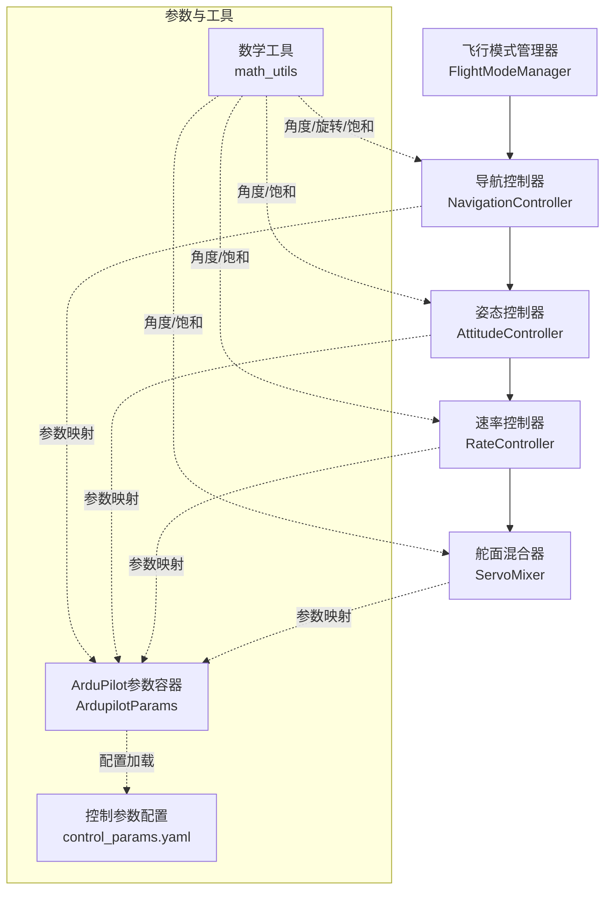
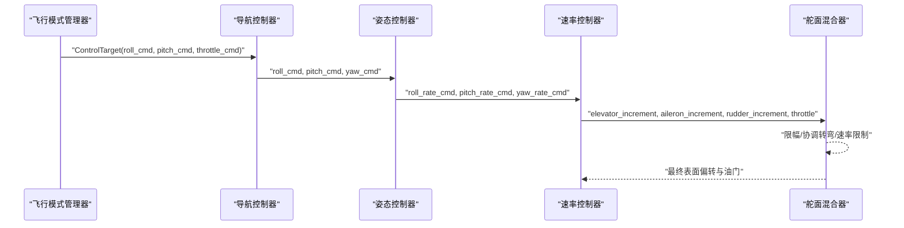
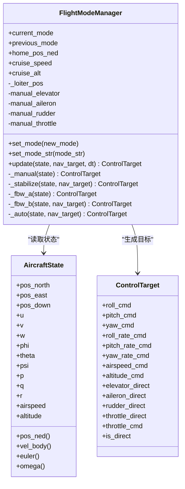
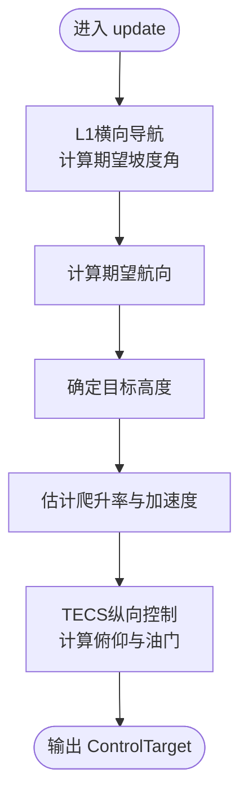
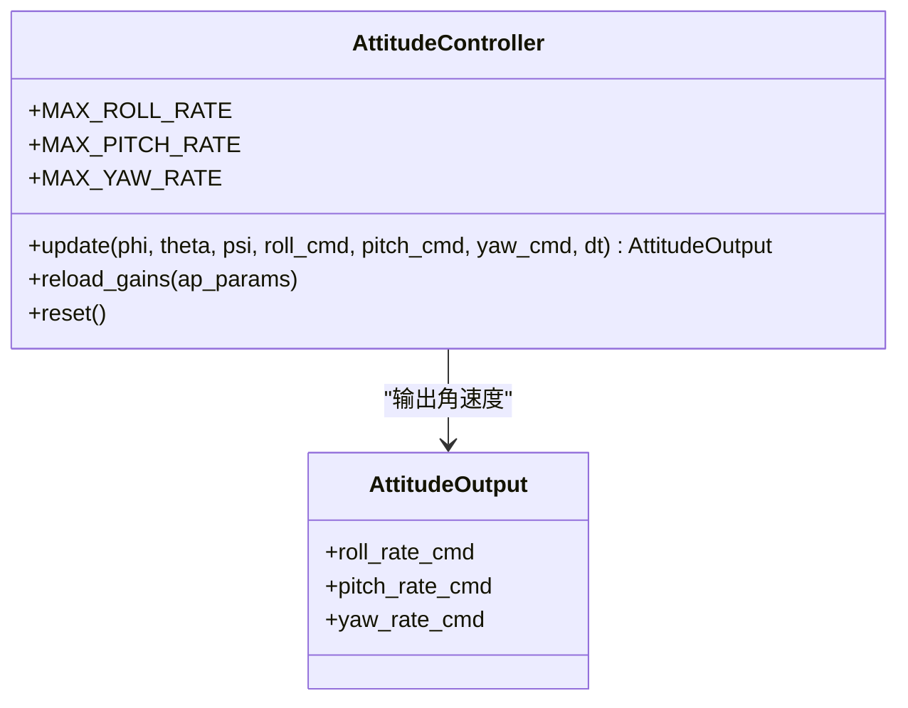
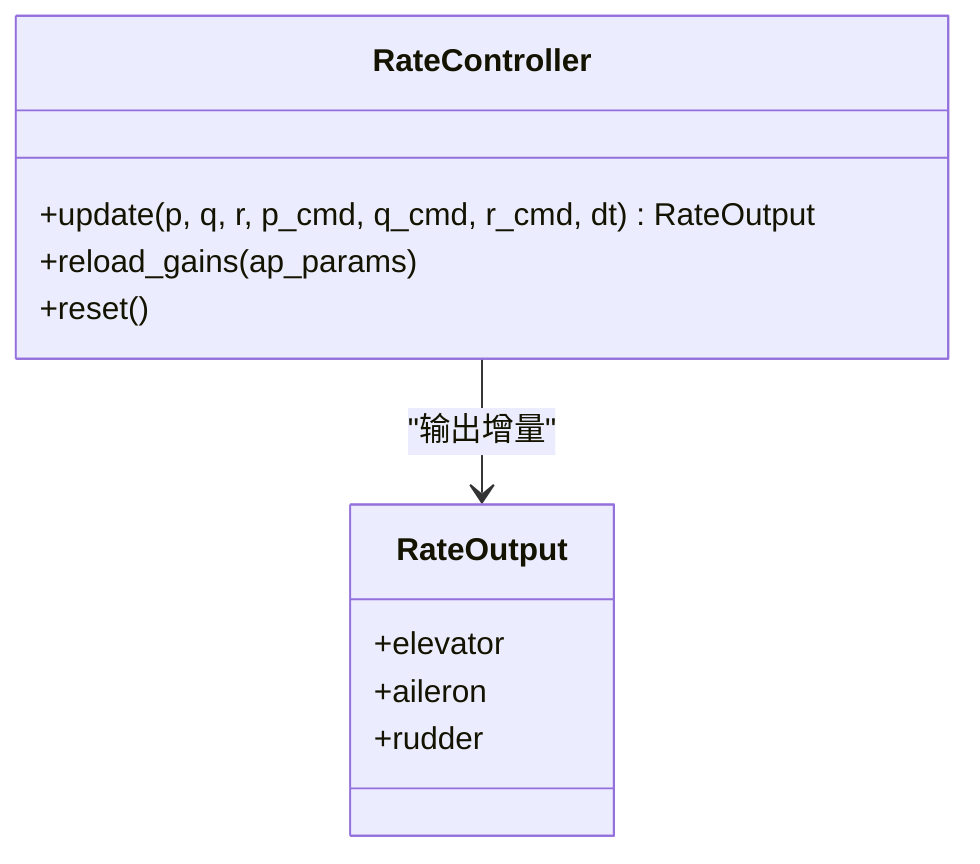
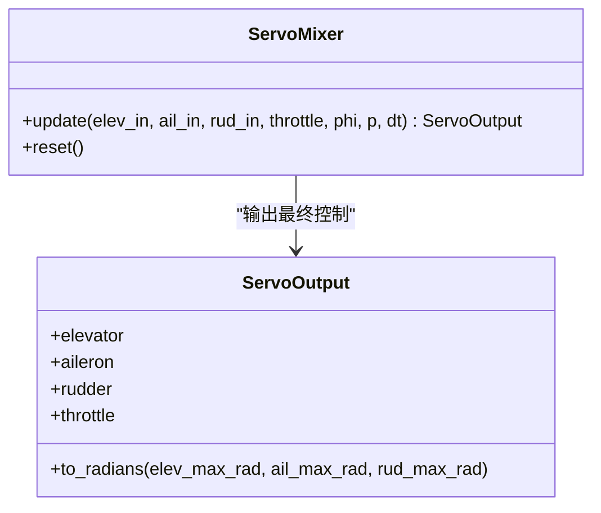
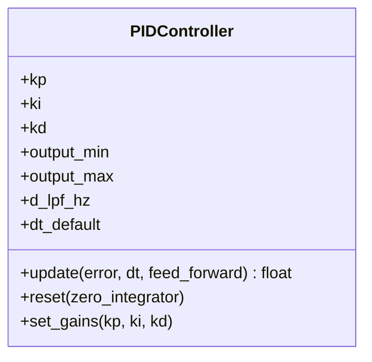
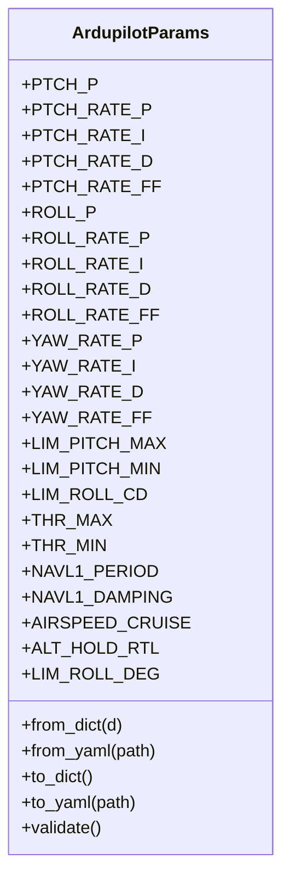
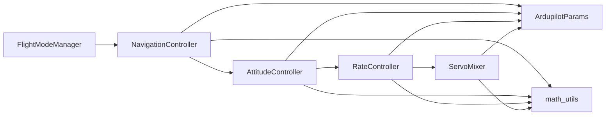

# 控制系统

<cite>
**本文引用的文件列表**
- [flight_mode_manager.py](file://src/control/flight_mode_manager.py)
- [navigation_controller.py](file://src/control/navigation_controller.py)
- [attitude_controller.py](file://src/control/attitude_controller.py)
- [rate_controller.py](file://src/control/rate_controller.py)
- [pid_controller.py](file://src/control/pid_controller.py)
- [tecs_controller.py](file://src/control/tecs_controller.py)
- [servo_mixer.py](file://src/control/servo_mixer.py)
- [ardupilot_compat.py](file://src/control/ardupilot_compat.py)
- [math_utils.py](file://src/utils/math_utils.py)
- [control_params.yaml](file://config/control_params.yaml)
- [__init__.py](file://src/control/__init__.py)
- [test_control.py](file://tests/test_control.py)
- [example_6_ardupilot_parameters.py](file://examples/example_6_ardupilot_parameters.py)
- [main.py](file://main.py)
</cite>

## 目录
1. [简介](#简介)
2. [项目结构](#项目结构)
3. [核心组件](#核心组件)
4. [架构总览](#架构总览)
5. [详细组件分析](#详细组件分析)
6. [依赖关系分析](#依赖关系分析)
7. [性能考量](#性能考量)
8. [故障排查指南](#故障排查指南)
9. [结论](#结论)
10. [附录](#附录)

## 简介
本文件面向FixedWingSimulator的控制系统模块，系统性梳理飞行模式管理、导航与路径跟踪、姿态与速率控制、TECS总能量控制以及舵面混合器的实现与交互关系。文档同时覆盖ArduPilot兼容性设计、参数映射与调优建议，并提供可视化与故障诊断方法，帮助用户快速理解与高效使用该控制栈。

## 项目结构
控制子系统采用五层控制架构，自外向内依次为：飞行模式管理、导航控制器（含L1横向导航与TECS纵向/能量控制）、姿态控制器、速率控制器（SAS）、舵面混合器。各层之间通过数据类进行清晰的输入输出传递，参数通过ArduPilot兼容的数据容器统一管理。

图表来源
- [flight_mode_manager.py](file://src/control/flight_mode_manager.py#L115-L298)
- [navigation_controller.py](file://src/control/navigation_controller.py#L45-L202)
- [attitude_controller.py](file://src/control/attitude_controller.py#L33-L134)
- [rate_controller.py](file://src/control/rate_controller.py#L32-L109)
- [servo_mixer.py](file://src/control/servo_mixer.py#L54-L153)
- [ardupilot_compat.py](file://src/control/ardupilot_compat.py#L17-L130)
- [math_utils.py](file://src/utils/math_utils.py#L13-L124)
- [control_params.yaml](file://config/control_params.yaml#L1-L45)

章节来源
- [__init__.py](file://src/control/__init__.py#L1-L24)

## 核心组件
- 飞行模式管理器：负责模式切换与目标生成，输出ControlTarget供上层使用。
- 导航控制器：实现L1横向导航与TECS纵向/能量控制，生成roll_cmd、pitch_cmd、throttle_cmd。
- 姿态控制器：将期望角度转换为期望角速度命令。
- 速率控制器：实现SAS，将角速度误差转换为舵面增量。
- 舵面混合器：对舵面增量与油门进行限幅、协调转弯补偿与速率限制，输出最终执行信号。
- ArduPilot参数容器：提供与ArduPilot一致的参数命名与默认值，支持YAML导入导出与校验。
- 数学工具：提供角度包裹、饱和、欧拉角变换等基础运算。

章节来源
- [flight_mode_manager.py](file://src/control/flight_mode_manager.py#L28-L114)
- [navigation_controller.py](file://src/control/navigation_controller.py#L45-L202)
- [attitude_controller.py](file://src/control/attitude_controller.py#L33-L134)
- [rate_controller.py](file://src/control/rate_controller.py#L32-L109)
- [servo_mixer.py](file://src/control/servo_mixer.py#L54-L153)
- [ardupilot_compat.py](file://src/control/ardupilot_compat.py#L17-L130)
- [math_utils.py](file://src/utils/math_utils.py#L13-L124)

## 架构总览
控制链路自外而内遵循“模式→导航→姿态→速率→混合器”的层级结构，每层职责明确、边界清晰。导航层负责路径跟踪与能量管理，姿态层负责将期望角度转化为角速度，速率层作为SAS提供阻尼与稳定，混合器完成物理约束与最终输出。

图表来源
- [flight_mode_manager.py](file://src/control/flight_mode_manager.py#L173-L212)
- [navigation_controller.py](file://src/control/navigation_controller.py#L134-L202)
- [attitude_controller.py](file://src/control/attitude_controller.py#L81-L122)
- [rate_controller.py](file://src/control/rate_controller.py#L68-L98)
- [servo_mixer.py](file://src/control/servo_mixer.py#L80-L149)

## 详细组件分析

### 飞行模式管理器
- 功能特性
  - 支持模式：MANUAL、STABILIZE、FBW_A、FBW_B、AUTO、LOITER、RTH。
  - 模式切换与过渡：记录当前/历史模式，进入LOITER时捕获盘旋中心。
  - 目标生成：根据模式返回ControlTarget，包含期望角度、角速度前馈、空速/高度目标及直接控制通道。
- 关键点
  - MANUAL：直通手动输入，is_direct=True，绕过姿态/速率回路。
  - STABILIZE：机翼水平保持，使用导航层提供的pitch/throttle命令。
  - FBW_A：保持当前滚转/俯仰，维持高度，适合仿真中的稳态观察。
  - FBW_B：高度与空速保持，使用导航层提供的pitch/throttle命令。
  - AUTO/LOITER/RTH：优先使用导航层目标，否则回退到保持当前状态。
- 数据结构
  - AircraftState：NED位置、体轴速度、欧拉角、角速度、空速/高度派生。
  - ControlTarget：期望角度、角速度前馈、空速/高度、直接控制通道、油门命令与直通标记。

图表来源
- [flight_mode_manager.py](file://src/control/flight_mode_manager.py#L28-L298)

章节来源
- [flight_mode_manager.py](file://src/control/flight_mode_manager.py#L115-L298)

### 导航控制器（L1横向+TECS纵向）
- L1横向导航
  - 基于ArduPilot风格的L1引导律，利用体轴u/v投影得到地面航迹角，结合期望航向与侧向加速度，计算所需坡度角。
  - L1距离随空速按比例增长，避免低速时过度灵敏。
- TECS纵向/能量控制
  - 将高度与空速解耦为总比能量（SPE+SKE）与比能量分配（SEB），通过油门与俯仰协同控制。
  - 包含欠速保护、不可达下沉检测、坡度油门补偿、速率限制与积分抗饱和等机制。
- 输出
  - roll_cmd、yaw_cmd、pitch_cmd、throttle_cmd、airspeed_cmd。

图表来源
- [navigation_controller.py](file://src/control/navigation_controller.py#L134-L202)
- [tecs_controller.py](file://src/control/tecs_controller.py#L247-L315)

章节来源
- [navigation_controller.py](file://src/control/navigation_controller.py#L45-L202)
- [tecs_controller.py](file://src/control/tecs_controller.py#L50-L647)

### 姿态控制器（角度→角速度）
- 结构
  - 三轴独立PID：ROLL轴仅P，PITCH轴仅P，YAW无外环（ArduPlane风格）。
  - 输出为期望角速度命令，受最大角速度限幅。
- 参数映射
  - PTCH_P、ROLL_P来自ArduPilot参数容器，用于姿态外环比例增益。

图表来源
- [attitude_controller.py](file://src/control/attitude_controller.py#L33-L134)

章节来源
- [attitude_controller.py](file://src/control/attitude_controller.py#L33-L134)

### 速率控制器（SAS）
- 结构
  - 三轴独立PID：PTCH_RATE_P/I/D、ROLL_RATE_P/I、YAW_RATE_P/I，输出为表面增量（[-1,1]）。
  - 提供前馈项（FF）以改善跟踪性能。
- 参数映射
  - PTCH_RATE_*、ROLL_RATE_*、YAW_RATE_*来自ArduPilot参数容器。

图表来源
- [rate_controller.py](file://src/control/rate_controller.py#L32-L109)

章节来源
- [rate_controller.py](file://src/control/rate_controller.py#L32-L109)

### 舵面混合器
- 功能
  - 将速率控制器输出与油门命令合并，施加幅度限幅、协调转弯补偿、速率限制，输出最终执行信号。
- 关键处理
  - 升降舵/副翼/方向舵限幅：基于LIM_PITCH_*与LIM_ROLL_CD转换为[-1,1]范围。
  - 协调转弯：rudder += k * p。
  - 速率限制：按最大速率（deg/s）对输出进行差分限幅。
- 输出
  - ServoOutput：elevator/aileron/rudder∈[-1,1]，throttle∈[0,1]。

图表来源
- [servo_mixer.py](file://src/control/servo_mixer.py#L54-L153)

章节来源
- [servo_mixer.py](file://src/control/servo_mixer.py#L54-L153)

### PID控制器（通用）
- 特性
  - P/I/D三段式，带抗饱和积分（夹断法）。
  - 可选微分低通滤波，支持前馈项。
  - 提供reset与运行时增益修改。
- 应用
  - 姿态控制器（ROLL/PTCH P-only）。
  - 速率控制器（PTCH/ROLL/YAW P/I/D）。

图表来源
- [pid_controller.py](file://src/control/pid_controller.py#L17-L117)

章节来源
- [pid_controller.py](file://src/control/pid_controller.py#L17-L117)

### ArduPilot兼容性与参数映射
- 参数容器
  - 字段名与ArduPilot Plane完全一致，支持from_yaml/to_yaml、validate、属性转换（如LIM_ROLL_DEG）。
- 参数来源
  - control_params.yaml提供默认参数，覆盖导航、姿态、速率、限幅与TECS等关键参数。
- 示例
  - example_6_ardupilot_parameters.py演示了参数加载、验证、热重载与导出。

图表来源
- [ardupilot_compat.py](file://src/control/ardupilot_compat.py#L17-L130)
- [control_params.yaml](file://config/control_params.yaml#L1-L45)
- [example_6_ardupilot_parameters.py](file://examples/example_6_ardupilot_parameters.py#L23-L43)

章节来源
- [ardupilot_compat.py](file://src/control/ardupilot_compat.py#L17-L130)
- [control_params.yaml](file://config/control_params.yaml#L1-L45)
- [example_6_ardupilot_parameters.py](file://examples/example_6_ardupilot_parameters.py#L23-L43)

## 依赖关系分析
- 组件耦合
  - 导航控制器依赖ArduPilot参数容器与数学工具；TECS内部自包含但依赖外部估计的爬升率与加速度。
  - 姿态/速率控制器均依赖ArduPilot参数容器；混合器依赖参数容器与数学工具。
  - 飞行模式管理器输出ControlTarget，被导航控制器消费；导航控制器输出ControlTarget，被姿态控制器消费。
- 外部依赖
  - NumPy广泛用于数值计算与矩阵运算。
  - YAML用于参数配置文件读取与导出。

图表来源
- [__init__.py](file://src/control/__init__.py#L3-L23)
- [flight_mode_manager.py](file://src/control/flight_mode_manager.py#L19-L25)
- [navigation_controller.py](file://src/control/navigation_controller.py#L16-L22)
- [attitude_controller.py](file://src/control/attitude_controller.py#L17-L22)
- [rate_controller.py](file://src/control/rate_controller.py#L17-L22)
- [servo_mixer.py](file://src/control/servo_mixer.py#L16-L21)
- [ardupilot_compat.py](file://src/control/ardupilot_compat.py#L11-L14)
- [math_utils.py](file://src/utils/math_utils.py#L6-L7)

章节来源
- [__init__.py](file://src/control/__init__.py#L1-L24)

## 性能考量
- 控制层时间步长
  - 各控制器默认dt=0.01s，建议根据仿真需求与模型稳定性调整。
- TECS参数
  - TECS_TIME_CONST增大可提升平滑性，但可能增加响应迟滞；TECS_THR_DAMP与TECS_PTCH_DAMP影响油门与俯仰振荡抑制。
  - TECS_INTEG_GAIN过大会导致积分振荡，建议保守设置。
- L1参数
  - NAVL1_PERIOD与NAVL1_DAMPING影响横向响应与稳定性，需结合空速与轨迹曲率调优。
- 速率限制
  - ServoMixer的rate_limit影响舵面响应平滑性与瞬态性能，需与气动模型匹配。

[本节为通用指导，无需特定文件引用]

## 故障排查指南
- 常见问题与定位
  - 模式切换抖动：检查FlightModeManager的模式切换日志与过渡逻辑，确认是否正确捕获LOITER中心。
  - 导航层不稳定：核查L1横向参数与TECS纵向参数，关注TECS的欠速保护与不可达下沉检测标志位。
  - 姿态/速率层饱和：检查PID输出是否频繁饱和，必要时降低增益或增加积分抗饱和策略。
  - 混合器输出异常：检查限幅与协调转弯补偿，确认速率限制是否过严。
- 单元测试参考
  - 测试覆盖PID抗饱和、零误差输出、限幅、to_radians转换、协调转弯补偿等关键行为，可作为回归与集成测试基线。

章节来源
- [test_control.py](file://tests/test_control.py#L61-L371)

## 结论
该控制系统以ArduPilot参数体系为基础，实现了从模式管理到舵面执行的完整闭环控制链。导航层采用L1横向与TECS纵向的组合，既保证路径跟踪精度又兼顾能量管理；姿态与速率层分别承担角度到角速度与角速度到舵面增量的任务；混合器完成物理约束与最终输出。通过参数容器与配置文件，用户可以便捷地进行参数映射、热重载与导出，满足不同机型与任务场景的需求。

[本节为总结性内容，无需特定文件引用]

## 附录

### 控制参数调优指南（基于ArduPilot兼容参数）
- 导航层
  - NAVL1_PERIOD：根据空速与轨迹曲率设定，空速越高应增大以避免过度灵敏。
  - NAVL1_DAMPING：提高阻尼可抑制振荡，但过大会增加响应迟滞。
- TECS
  - TECS_TIME_CONST：增大平滑性，减小振荡倾向。
  - TECS_THR_DAMP/TECS_PTCH_DAMP：抑制油门与俯仰振荡，提高稳定性。
  - TECS_INTEG_GAIN：降低以避免积分振荡。
  - TECS_RLL2THR：转弯时补偿诱导阻力，避免失速。
- 姿态/速率
  - PTCH_P/ROLL_P：姿态外环增益，过大易振荡，过小响应慢。
  - PTCH_RATE_* / ROLL_RATE_* / YAW_RATE_*：速率回路增益，注意I项可能引发极限环，建议PD为主。
- 混合器
  - LIM_PITCH_MAX/LIM_PITCH_MIN/LIM_ROLL_CD：根据气动包线与安全裕度设定。
  - rate_limit：与舵机/作动器能力匹配，避免过快响应导致过冲。

章节来源
- [control_params.yaml](file://config/control_params.yaml#L1-L45)
- [ardupilot_compat.py](file://src/control/ardupilot_compat.py#L26-L60)

### ArduPilot参数加载与导出示例
- 加载：ArdupilotParams.from_yaml()从YAML文件读取参数。
- 导出：ArdupilotParams.to_yaml()导出为YAML；示例脚本展示导出为.ArduPilot .param格式。
- 热重载：通过reload_gains动态更新控制器增益。

章节来源
- [example_6_ardupilot_parameters.py](file://examples/example_6_ardupilot_parameters.py#L23-L43)
- [ardupilot_compat.py](file://src/control/ardupilot_compat.py#L74-L99)

### 主程序入口与运行方式
- 支持多种运行模式：默认闭合回路仿真、4-DOF线性分析、6-DOF开环仿真。
- 可指定机型、初始模式、风场类型、轨迹类型与可视化开关。

章节来源
- [main.py](file://main.py#L98-L141)