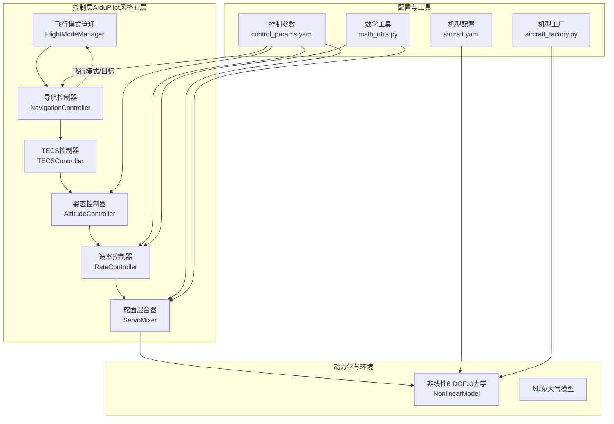
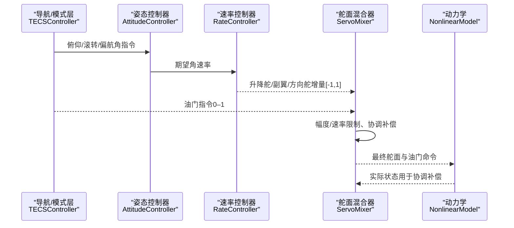
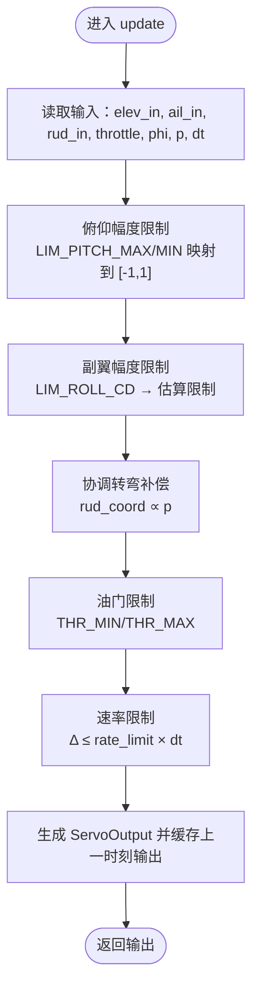
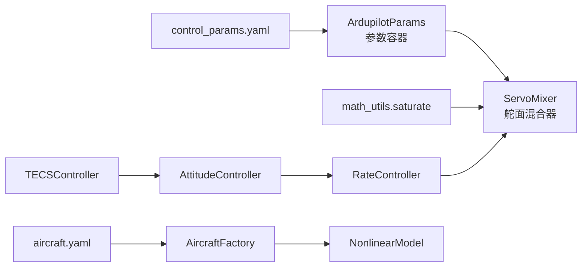

# 舵面混合器

<cite>
**本文引用的文件**   
- [servo_mixer.py](file://src/control/servo_mixer.py)
- [ardupilot_compat.py](file://src/control/ardupilot_compat.py)
- [rate_controller.py](file://src/control/rate_controller.py)
- [attitude_controller.py](file://src/control/attitude_controller.py)
- [tecs_controller.py](file://src/control/tecs_controller.py)
- [simulator.py](file://src/simulation/simulator.py)
- [control_params.yaml](file://config/control_params.yaml)
- [aircraft.yaml](file://config/aircraft.yaml)
- [math_utils.py](file://src/utils/math_utils.py)
- [aircraft_factory.py](file://src/models/aircraft_factory.py)
- [main.py](file://main.py)
</cite>

## 目录
1. [引言](#引言)
2. [项目结构](#项目结构)
3. [核心组件](#核心组件)
4. [架构总览](#架构总览)
5. [详细组件分析](#详细组件分析)
6. [依赖关系分析](#依赖关系分析)
7. [性能考量](#性能考量)
8. [故障排查指南](#故障排查指南)
9. [结论](#结论)
10. [附录](#附录)

## 引言
本技术文档围绕“舵面混合器”展开，系统阐述其在飞行控制链路中的关键作用：将来自上层控制器的增量指令（升降舵、副翼、方向舵）与油门指令整合为最终可执行的舵面偏转与推进力信号。文档涵盖混合矩阵设计原理、不同飞行器构型的混合策略差异、参数配置方法（混合系数、饱和限制、速率限制与协调转弯补偿）、校准与验证流程，以及与硬件控制系统的接口规范建议。

## 项目结构
舵面混合器位于控制层的最内环，紧邻姿态/速率控制器与导航/模式管理模块，负责将控制增量转换为归一化的舵面命令，并进行物理极限、速率限制与协调补偿等处理，最终输出到动力学仿真或硬件接口。

图示来源
- [simulator.py](file://src/simulation/simulator.py#L214-L216)
- [rate_controller.py](file://src/control/rate_controller.py#L32-L98)
- [attitude_controller.py](file://src/control/attitude_controller.py#L33-L122)
- [tecs_controller.py](file://src/control/tecs_controller.py#L50-L75)
- [servo_mixer.py](file://src/control/servo_mixer.py#L54-L149)
- [control_params.yaml](file://config/control_params.yaml#L1-L45)
- [aircraft.yaml](file://config/aircraft.yaml#L1-L13)
- [math_utils.py](file://src/utils/math_utils.py#L23-L25)
- [aircraft_factory.py](file://src/models/aircraft_factory.py#L39-L74)

章节来源
- [simulator.py](file://src/simulation/simulator.py#L115-L233)
- [control_params.yaml](file://config/control_params.yaml#L1-L45)
- [aircraft.yaml](file://config/aircraft.yaml#L1-L13)

## 核心组件
- 舵面混合器（ServoMixer）：接收速率控制器输出的增量与导航/模式层的油门指令，应用幅度限制、速率限制、协调转弯补偿，生成最终归一化舵面与油门命令。
- 速率控制器（RateController）：独立三轴速率PID，产生升降舵、副翼、方向舵的归一化增量。
- 姿态控制器（AttitudeController）：三轴角度控制器，输出期望角速率（Yaw无外环）。
- TECS控制器（TECSController）：总能量控制，生成俯仰角指令与油门指令。
- ArduPilot兼容参数容器（ArdupilotParams）：统一的参数命名与默认值，支持从YAML加载与校验。
- 数学工具（math_utils）：饱和、角度包裹、单位换算等通用函数。

章节来源
- [servo_mixer.py](file://src/control/servo_mixer.py#L54-L149)
- [rate_controller.py](file://src/control/rate_controller.py#L32-L98)
- [attitude_controller.py](file://src/control/attitude_controller.py#L33-L122)
- [tecs_controller.py](file://src/control/tecs_controller.py#L50-L75)
- [ardupilot_compat.py](file://src/control/ardupilot_compat.py#L17-L129)
- [math_utils.py](file://src/utils/math_utils.py#L23-L25)

## 架构总览
舵面混合器处于ArduPilot风格控制链的最内环，上游由导航/模式层（TECS）与姿态/速率层提供增量与目标，下游驱动非线性6-DOF动力学。混合器的关键职责是：
- 将控制增量映射为物理可实现的舵面偏转范围；
- 应用幅度限制（俯仰/滚转/油门）；
- 应用速率限制（避免执行器瞬态过载）；
- 协调转弯补偿（抵消副翼引起的负侧滑）；
- 输出归一化命令（升降舵/副翼/方向舵[-1,1]，油门[0,1]），并在接口处转换为弧度。

图示来源
- [tecs_controller.py](file://src/control/tecs_controller.py#L247-L315)
- [attitude_controller.py](file://src/control/attitude_controller.py#L81-L122)
- [rate_controller.py](file://src/control/rate_controller.py#L68-L98)
- [servo_mixer.py](file://src/control/servo_mixer.py#L80-L149)

## 详细组件分析

### 舵面混合器（ServoMixer）
- 输入：速率控制器增量（elev_in, ail_in, rud_in）、油门（throttle）、当前滚转角（phi）与滚转速率（p），用于协调转弯补偿。
- 处理流程：
  - 幅度限制：俯仰角限制来自LIM_PITCH_MAX/MIN（度），滚转限制来自LIM_ROLL_CD（中心单位，转换为度），分别映射到[-1,1]范围。
  - 协调转弯补偿：基于滚转速率施加方向舵增量，经验系数可调。
  - 油门限制：按THR_MIN/THR_MAX裁剪。
  - 速率限制：对每个舵面/油门计算允许的最大变化量，避免瞬态过冲。
- 输出：归一化舵面与油门（ServoOutput），可进一步转换为弧度输出。

图示来源
- [servo_mixer.py](file://src/control/servo_mixer.py#L80-L149)

章节来源
- [servo_mixer.py](file://src/control/servo_mixer.py#L54-L149)

### 速率控制器（RateController）
- 三个独立的速率PID，分别产生升降舵、副翼、方向舵增量（[-1,1]）。
- 支持前馈项，增强动态响应。
- 输出作为ServoMixer的输入增量。

章节来源
- [rate_controller.py](file://src/control/rate_controller.py#L32-L98)

### 姿态控制器（AttitudeController）
- 三轴角度控制器，输出期望角速率（Roll/Pitch使用P控制，Yaw无外环）。
- 输出作为速率控制器的目标。

章节来源
- [attitude_controller.py](file://src/control/attitude_controller.py#L33-L122)

### TECS控制器（TECSController）
- 通过油门控制总比能量，通过俯仰角控制比能分配，实现高度与速度的耦合控制。
- 生成俯仰角指令与油门指令，作为ServoMixer的输入。

章节来源
- [tecs_controller.py](file://src/control/tecs_controller.py#L50-L315)

### ArduPilot兼容参数容器（ArdupilotParams）
- 统一参数命名，便于与ArduPilot生态对接。
- 提供从YAML加载、导出与基本范围校验功能。

章节来源
- [ardupilot_compat.py](file://src/control/ardupilot_compat.py#L17-L129)

### 数学工具（math_utils）
- 提供饱和、角度包裹、单位换算等基础函数，混合器与控制器广泛使用。

章节来源
- [math_utils.py](file://src/utils/math_utils.py#L23-L25)

## 依赖关系分析
- ServoMixer依赖ArduPilot参数容器（ArdupilotParams）获取限制参数，依赖数学工具（saturate）进行裁剪。
- 控制链路自上而下：TECS → 姿态 → 速率 → 混合器 → 动力学。
- 配置来源：control_params.yaml提供控制参数；aircraft.yaml指定机型；aircraft_factory.py合并机型参数并导出ArduPilot参数文件。

图示来源
- [servo_mixer.py](file://src/control/servo_mixer.py#L19-L20)
- [math_utils.py](file://src/utils/math_utils.py#L23-L25)
- [tecs_controller.py](file://src/control/tecs_controller.py#L50-L75)
- [attitude_controller.py](file://src/control/attitude_controller.py#L33-L53)
- [rate_controller.py](file://src/control/rate_controller.py#L32-L50)
- [control_params.yaml](file://config/control_params.yaml#L1-L45)
- [aircraft.yaml](file://config/aircraft.yaml#L1-L13)
- [aircraft_factory.py](file://src/models/aircraft_factory.py#L39-L74)

章节来源
- [simulator.py](file://src/simulation/simulator.py#L214-L216)
- [control_params.yaml](file://config/control_params.yaml#L1-L45)
- [aircraft.yaml](file://config/aircraft.yaml#L1-L13)

## 性能考量
- 速率限制：通过每步允许的最大变化量抑制执行器瞬态，提升稳定性与硬件寿命。
- 协调转弯补偿：在滚转过程中增加方向舵，降低侧滑与负侧滑扭矩，改善操控品质。
- 幅度限制：基于机型参数（LIM_PITCH/LIM_ROLL/THR）进行安全边界约束，避免飞参越界。
- 计算复杂度：混合器为O(1)，实时性良好；协调补偿与速率限制均为标量运算，适合嵌入式部署。

## 故障排查指南
- 混合后舵面命令异常抖动
  - 检查速率限制是否过小，导致每步变化受限过度。
  - 核对协调转弯补偿系数是否过大。
- 油门饱和或响应迟滞
  - 检查THR_MIN/THR_MAX设置与TECS输出是否匹配。
  - 关注TECS积分器抗饱和逻辑与油门限幅状态。
- 俯仰/滚转响应受限
  - 检查LIM_PITCH_MAX/MIN与LIM_ROLL_CD设置是否合理。
  - 确认速率限制与采样周期匹配。
- 角度/速率控制器输出异常
  - 检查姿态/速率控制器的P参数与输出限幅。
- 参数加载与导出
  - 使用AircraftFactory导出ArduPilot参数文件，核对字段一致性。

章节来源
- [servo_mixer.py](file://src/control/servo_mixer.py#L134-L144)
- [tecs_controller.py](file://src/control/tecs_controller.py#L553-L624)
- [ardupilot_compat.py](file://src/control/ardupilot_compat.py#L104-L129)
- [aircraft_factory.py](file://src/models/aircraft_factory.py#L95-L135)

## 结论
舵面混合器在ArduPilot风格控制链中承担“最后执行器”的关键角色，通过幅度限制、速率限制与协调补偿，将上层控制指令安全、稳定地转换为实际的舵面偏转与推进力。结合ArduPilot兼容参数与工程化配置，可在多种固定翼构型与任务场景下实现可靠的闭环控制。

## 附录

### 混合矩阵设计原理与算法要点
- 设计原则
  - 线性叠加：将速率控制器增量与油门指令线性组合，形成最终命令。
  - 物理约束：严格遵守幅度与速率限制，避免执行器饱和与机械损伤。
  - 动力学匹配：协调转弯补偿与实际滚转状态耦合，提升操控稳定性。
- 算法步骤
  - 将控制增量映射到[-1,1]范围；
  - 应用幅度限制（俯仰/滚转/油门）；
  - 基于滚转速率施加方向舵补偿；
  - 应用速率限制；
  - 生成归一化输出并缓存上一时刻结果。

章节来源
- [servo_mixer.py](file://src/control/servo_mixer.py#L80-L149)

### 不同飞行器构型的混合策略差异
- 传统固定翼
  - 使用协调转弯补偿抵消副翼引起的负侧滑；
  - 幅度限制依据机型气动特性设置。
- 三角翼/特殊构型
  - 副翼效率可能下降，需提高协调补偿增益；
  - 幅度限制应更保守，速率限制适当放宽以补偿气动迟滞。
- 参数适配
  - 通过control_params.yaml调整LIM_PITCH/LIM_ROLL/THR与TECS参数；
  - 使用aircraft_factory导出ArduPilot参数文件，便于地面站/飞控加载。

章节来源
- [control_params.yaml](file://config/control_params.yaml#L24-L44)
- [aircraft_factory.py](file://src/models/aircraft_factory.py#L95-L135)

### 参数配置方法
- 控制参数（control_params.yaml）
  - 惯性/阻尼参数：PTCH_*、ROLL_*、YAW_RATE_*；
  - 限制参数：LIM_PITCH_MAX/MIN、LIM_ROLL_CD、THR_MIN/THR_MAX；
  - TECS参数：TECS_*系列，影响油门与俯仰角指令。
- 机型参数（aircraft.yaml）
  - 指定aircraft_name，必要时通过overrides覆盖数据库默认值。
- 导出与加载
  - 使用aircraft_factory.export_ardupilot_params导出ArduPilot参数文件；
  - 使用ArdupilotParams.from_yaml加载控制参数。

章节来源
- [control_params.yaml](file://config/control_params.yaml#L1-L45)
- [aircraft.yaml](file://config/aircraft.yaml#L1-L13)
- [aircraft_factory.py](file://src/models/aircraft_factory.py#L95-L135)
- [ardupilot_compat.py](file://src/control/ardupilot_compat.py#L82-L98)

### 校准与验证流程
- 校准步骤
  - 初始化：清零混合器历史状态，确保_prev为零；
  - 油门校准：在平飞状态下检查THR_MIN/THR_MAX与TECS输出一致性；
  - 协调补偿：在坡转测试中观察方向舵补偿是否有效；
  - 速率限制：逐步提高速率限制，观察响应与抖动变化。
- 验证方法
  - 开环阶跃响应：验证混合器输出与期望一致；
  - 闭环跟踪：在轨迹跟踪或航点任务中评估稳定性与精度；
  - 数据记录：保存舵面命令、油门、姿态与速率数据，绘制对比图。

章节来源
- [servo_mixer.py](file://src/control/servo_mixer.py#L151-L153)
- [tecs_controller.py](file://src/control/tecs_controller.py#L247-L315)
- [examples/example_1_linear_response.py](file://examples/example_1_linear_response.py#L126-L164)

### 典型混合配置示例
- 固定翼常规配置
  - LIM_PITCH_MAX/MIN：±15°左右；
  - LIM_ROLL_CD：约3500（对应45°）；
  - THR_MIN/THR_MAX：0/1；
  - TECS参数：根据机型调整爬升/下沉率与阻尼。
- 参数来源
  - control_params.yaml中定义；
  - aircraft.yaml选择机型并可覆盖参数。

章节来源
- [control_params.yaml](file://config/control_params.yaml#L24-L44)
- [aircraft.yaml](file://config/aircraft.yaml#L1-L13)

### 与硬件控制系统的接口规范
- 接口建议
  - 输入：四通道归一化命令（elevator, aileron, rudder, throttle）；
  - 输出：舵面偏转弧度与推进力百分比；
  - 通信协议：建议采用标准飞控接口（如Serial/MAVLink），并保留参数热加载能力。
- 参数同步
  - 使用aircraft_factory.export_ardupilot_params导出参数文件；
  - 在地面站/飞控中加载control_params.yaml与导出的参数文件，确保一致性。

章节来源
- [servo_mixer.py](file://src/control/servo_mixer.py#L31-L51)
- [aircraft_factory.py](file://src/models/aircraft_factory.py#L95-L135)