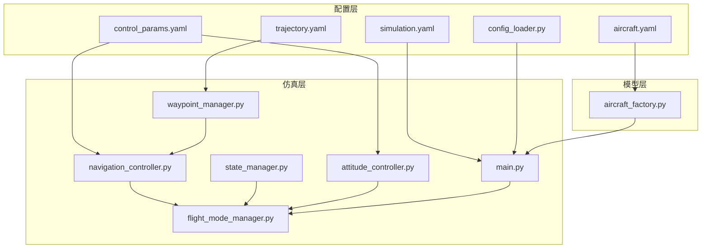
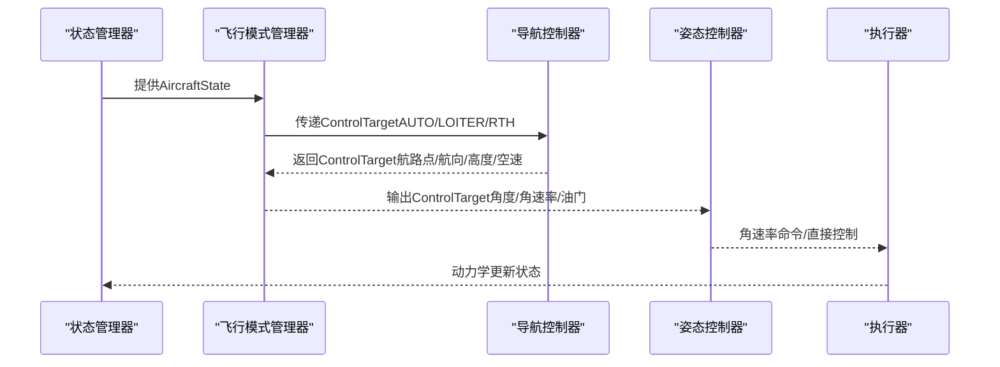
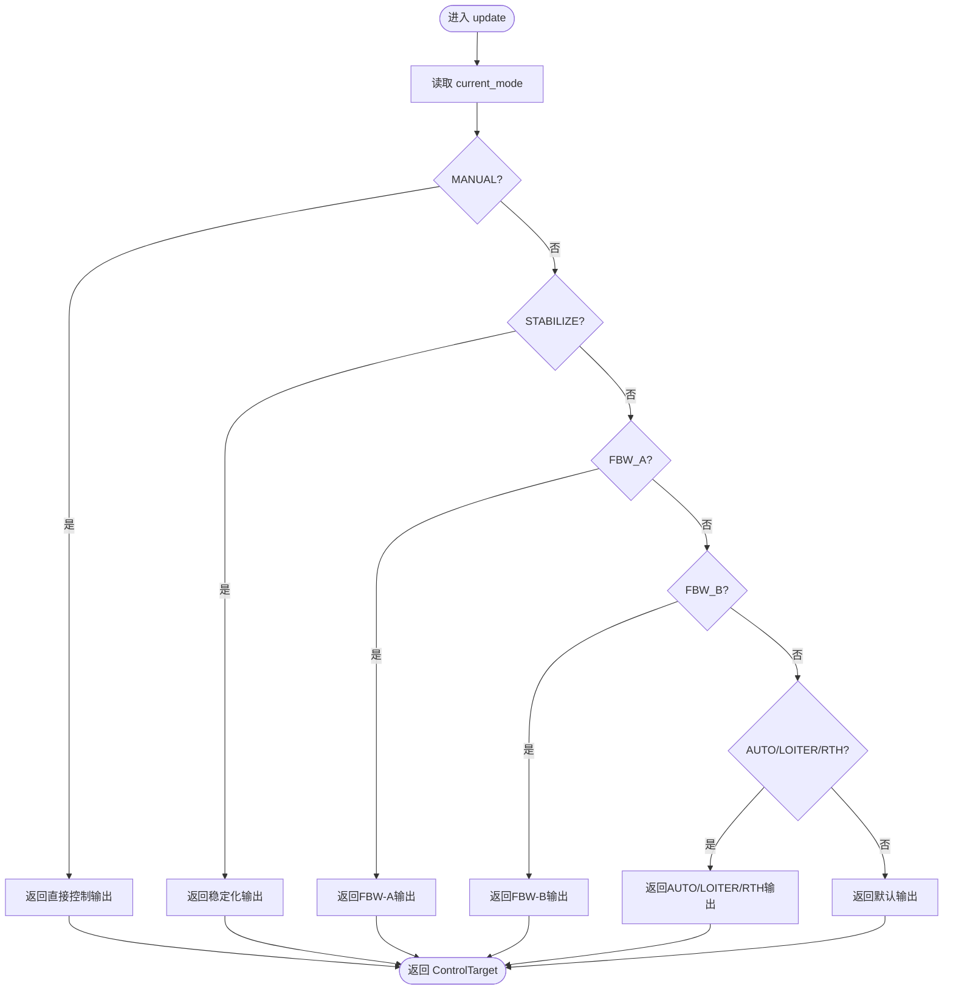
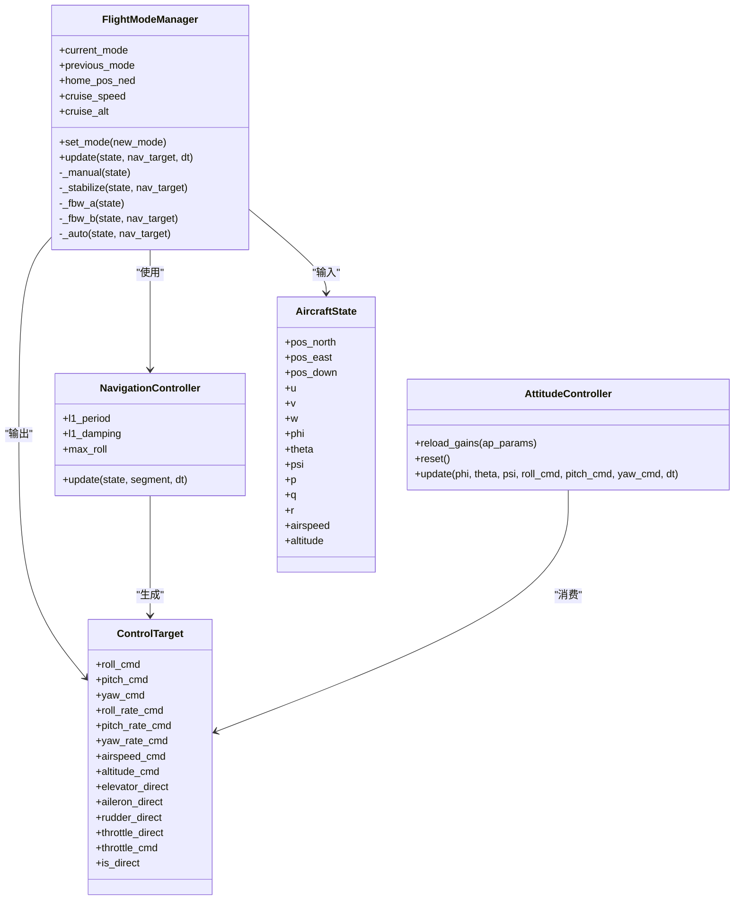

# 飞行模式管理器

<cite>
**本文档引用的文件**
- [flight_mode_manager.py](file://src/control/flight_mode_manager.py)
- [ardupilot_compat.py](file://src/control/ardupilot_compat.py)
- [navigation_controller.py](file://src/control/navigation_controller.py)
- [attitude_controller.py](file://src/control/attitude_controller.py)
- [state_manager.py](file://src/simulation/state_manager.py)
- [aircraft_factory.py](file://src/models/aircraft_factory.py)
- [control_params.yaml](file://config/control_params.yaml)
- [simulation.yaml](file://config/simulation.yaml)
- [aircraft.yaml](file://config/aircraft.yaml)
- [trajectory.yaml](file://config/trajectory.yaml)
- [config_loader.py](file://src/utils/config_loader.py)
- [waypoint_manager.py](file://src/planning/waypoint_manager.py)
- [main.py](file://main.py)
</cite>

## 目录
1. [简介](#简介)
2. [项目结构](#项目结构)
3. [核心组件](#核心组件)
4. [架构总览](#架构总览)
5. [详细组件分析](#详细组件分析)
6. [依赖关系分析](#依赖关系分析)
7. [性能考虑](#性能考虑)
8. [故障排除指南](#故障排除指南)
9. [结论](#结论)
10. [附录](#附录)

## 简介
本文件为飞行模式管理器的技术文档，聚焦于ArduPilot兼容的固定翼无人机飞行模式管理。文档深入解释飞行模式管理器的核心架构与设计原理，涵盖以下内容：
- 七种ArduPilot兼容飞行模式（MANUAL、STABILIZE、FBW_A、FBW_B、AUTO、LOITER、RTH）的功能特性与实现细节
- AircraftState数据结构的设计，包括位置、速度、姿态、角速率等状态参数的定义与用途
- ControlTarget控制目标的数据结构，包括角度指令、角速率指令、空速和高度指令等参数
- 飞行模式切换机制，包括模式状态跟踪、平滑过渡逻辑与模式间切换的实现
- 每种飞行模式的具体行为描述、适用场景与参数配置方法
- 模式切换的调试技巧与常见问题解决方案

## 项目结构
该模拟器采用模块化设计，飞行模式管理器位于控制层，与导航控制器、姿态控制器、状态管理器协同工作。配置通过YAML文件集中管理，支持飞机参数、控制参数、仿真参数与轨迹参数的加载与合并。

图表来源
- [flight_mode_manager.py](file://src/control/flight_mode_manager.py#L1-L298)
- [navigation_controller.py](file://src/control/navigation_controller.py#L1-L293)
- [attitude_controller.py](file://src/control/attitude_controller.py#L1-L134)
- [state_manager.py](file://src/simulation/state_manager.py#L1-L193)
- [aircraft_factory.py](file://src/models/aircraft_factory.py#L1-L136)
- [config_loader.py](file://src/utils/config_loader.py#L1-L82)
- [waypoint_manager.py](file://src/planning/waypoint_manager.py#L1-L208)
- [aircraft.yaml](file://config/aircraft.yaml#L1-L13)
- [control_params.yaml](file://config/control_params.yaml#L1-L45)
- [simulation.yaml](file://config/simulation.yaml#L1-L30)
- [trajectory.yaml](file://config/trajectory.yaml#L1-L23)
- [main.py](file://main.py#L1-L145)

章节来源
- [flight_mode_manager.py](file://src/control/flight_mode_manager.py#L1-L298)
- [navigation_controller.py](file://src/control/navigation_controller.py#L1-L293)
- [attitude_controller.py](file://src/control/attitude_controller.py#L1-L134)
- [state_manager.py](file://src/simulation/state_manager.py#L1-L193)
- [aircraft_factory.py](file://src/models/aircraft_factory.py#L1-L136)
- [config_loader.py](file://src/utils/config_loader.py#L1-L82)
- [waypoint_manager.py](file://src/planning/waypoint_manager.py#L1-L208)
- [aircraft.yaml](file://config/aircraft.yaml#L1-L13)
- [control_params.yaml](file://config/control_params.yaml#L1-L45)
- [simulation.yaml](file://config/simulation.yaml#L1-L30)
- [trajectory.yaml](file://config/trajectory.yaml#L1-L23)
- [main.py](file://main.py#L1-L145)

## 核心组件
本节概述飞行模式管理器的关键数据结构与接口，以及与其他组件的交互方式。

- 飞行模式枚举：定义七种ArduPilot兼容模式，用于统一模式选择与切换。
- AircraftState：封装飞行器当前状态快照，供模式管理器与导航控制器使用。
- ControlTarget：描述模式输出的控制目标，包括角度、角速率、空速、高度与直接控制输入。
- FlightModeManager：负责模式切换、状态跟踪与各模式逻辑的调度。

章节来源
- [flight_mode_manager.py](file://src/control/flight_mode_manager.py#L28-L113)

## 架构总览
飞行模式管理器在控制回路中的位置如下：状态管理器提供当前飞行器状态，导航控制器根据轨迹生成ControlTarget，姿态控制器将角度指令转换为角速率指令，最终由执行器（如舵面）驱动飞机运动。飞行模式管理器贯穿整个流程，决定每个控制步的输出策略。

图表来源
- [flight_mode_manager.py](file://src/control/flight_mode_manager.py#L173-L212)
- [navigation_controller.py](file://src/control/navigation_controller.py#L134-L202)
- [attitude_controller.py](file://src/control/attitude_controller.py#L81-L122)
- [state_manager.py](file://src/simulation/state_manager.py#L16-L93)

## 详细组件分析

### 飞行模式管理器（FlightModeManager）
- 职责
  - 维护当前与上一模式状态，记录模式切换事件
  - 在每个控制步调用对应模式的update逻辑，生成ControlTarget
  - 在模式切换时进行必要的初始化与状态捕获（如LOITER的中心点）

- 关键接口
  - set_mode(new_mode)：切换到新模式，并记录历史模式
  - update(state, nav_target, dt)：根据当前模式计算ControlTarget
  - 各模式私有方法：_manual、_stabilize、_fbw_a、_fbw_b、_auto

- 模式切换与过渡
  - 切换时打印模式变更日志，便于调试
  - LOITER进入时延迟捕获中心点，确保首次更新时确定轨道中心
  - AUTO/LOITER/RTH共享_auto逻辑，若无导航建议则保持当前状态

图表来源
- [flight_mode_manager.py](file://src/control/flight_mode_manager.py#L173-L212)
- [flight_mode_manager.py](file://src/control/flight_mode_manager.py#L217-L297)

章节来源
- [flight_mode_manager.py](file://src/control/flight_mode_manager.py#L115-L297)

### 数据结构：AircraftState
- 定义
  - 位置（NED，米）：pos_north、pos_east、pos_down
  - 速度（体坐标，米/秒）：u、v、w
  - 姿态（弧度）：phi（滚转）、theta（俯仰）、psi（偏航）
  - 角速率（弧度/秒）：p、q、r
  - 衍生参数：airspeed、altitude（正向上）
  - 属性访问器：pos_ned、vel_body、euler、omega

- 用途
  - 作为飞行模式管理器与导航控制器的输入状态
  - 与仿真状态AircraftSimState保持一致的字段布局，便于转换

章节来源
- [flight_mode_manager.py](file://src/control/flight_mode_manager.py#L38-L80)
- [state_manager.py](file://src/simulation/state_manager.py#L16-L93)

### 数据结构：ControlTarget
- 定义
  - 角度指令：roll_cmd、pitch_cmd、yaw_cmd
  - 角速率指令（可选前馈）：roll_rate_cmd、pitch_rate_cmd、yaw_rate_cmd
  - 速度/高度：airspeed_cmd、altitude_cmd
  - 直接控制输入（MANUAL模式）：elevator_direct、aileron_direct、rudder_direct、throttle_direct
  - 油门命令：throttle_cmd（0–1）
  - 直通标志：is_direct（为真时绕过姿态控制器）

- 用途
  - 由飞行模式管理器生成，供姿态控制器消费
  - 在MANUAL模式下直接驱动执行器

章节来源
- [flight_mode_manager.py](file://src/control/flight_mode_manager.py#L82-L113)

### 导航控制器（NavigationController）
- 职责
  - 使用L1横向导航律生成横滚角指令
  - 使用TECS控制系统的高度与空速，生成俯仰角与油门指令
  - 通过ControlTarget输出给姿态控制器

- 关键参数
  - L1周期与阻尼：NAVL1_PERIOD、NAVL1_DAMPING
  - 最大横滚角：max_roll
  - TECS参数：爬升/下沉速率、时间常数、阻尼、积分增益、速度权重、坡度转油门补偿等

- 与飞行模式管理器的关系
  - AUTO/LOITER/RTH模式下，飞行模式管理器将导航控制器提供的ControlTarget直接下发
  - LOITER模式下，首次进入时捕获当前位置作为轨道中心

章节来源
- [navigation_controller.py](file://src/control/navigation_controller.py#L45-L202)
- [control_params.yaml](file://config/control_params.yaml#L5-L6)
- [control_params.yaml](file://config/control_params.yaml#L30-L44)

### 姿态控制器（AttitudeController）
- 职责
  - 将期望角度（roll/pitch/yaw）转换为期望角速率（roll_rate_cmd、pitch_rate_cmd、yaw_rate_cmd）
  - 使用ArduPilot命名的PID参数（PTCH_P、ROLL_P等），实现三轴独立控制

- 关键参数
  - PTCH_P、ROLL_P：姿态外环比例增益（无积分/微分）
  - YAW_RATE_P：偏航率环增益（ArduPlane无姿态外环）
  - 输出限幅：最大角速率（120 deg/s、60 deg/s、45 deg/s）

- 与飞行模式管理器的关系
  - 飞行模式管理器输出ControlTarget后，姿态控制器将其转换为角速率指令
  - 模式切换时重置控制器积分器，避免突变

章节来源
- [attitude_controller.py](file://src/control/attitude_controller.py#L33-L133)
- [ardupilot_compat.py](file://src/control/ardupilot_compat.py#L17-L60)

### 飞行模式详解

#### MANUAL（手动直通）
- 行为
  - 直接透传手动输入（elevator、aileron、rudder、throttle）
  - is_direct=True，绕过姿态/速率控制回路
- 适用场景
  - 地面站遥控、驾驶员接管、测试执行器响应
- 参数配置
  - 手动输入由外部设置：manual_elevator、manual_aileron、manual_rudder、manual_throttle

章节来源
- [flight_mode_manager.py](file://src/control/flight_mode_manager.py#L217-L225)

#### STABILIZE（姿态稳定）
- 行为
  - 保持机翼水平（roll_cmd=0），使用导航建议的pitch_cmd与throttle_cmd
  - yaw_cmd=当前偏航角，airspeed_cmd=巡航空速，altitude_cmd来自导航或当前高度
- 适用场景
  - 稳定飞行、训练、简单航路点跟踪
- 参数配置
  - 巡航空速：cruise_speed（来自飞行模式管理器初始化）

章节来源
- [flight_mode_manager.py](file://src/control/flight_mode_manager.py#L227-L240)

#### FBW_A（飞控A：空速参考的横滚/俯仰限制）
- 行为
  - 横滚角指令=当前滚转角，俯仰角指令=0，偏航角=当前偏航角
  - 保持当前横滚角，利用俯仰维持高度
- 适用场景
  - 空速敏感的飞控逻辑验证、仿真环境下的稳定保持
- 参数配置
  - 巡航空速与高度：cruise_speed、cruise_alt

章节来源
- [flight_mode_manager.py](file://src/control/flight_mode_manager.py#L242-L254)

#### FBW_B（飞控B：高度保持+空速保持）
- 行为
  - 使用导航建议的pitch_cmd与throttle_cmd
  - 横滚角=0，偏航角=当前偏航角
  - altitude_cmd来自导航或巡航高度
- 适用场景
  - 简单的高度与空速保持任务
- 参数配置
  - 巡航空速与高度：cruise_speed、cruise_alt

章节来源
- [flight_mode_manager.py](file://src/control/flight_mode_manager.py#L256-L269)

#### AUTO（自动导航）
- 行为
  - 使用导航控制器提供的ControlTarget
  - 若无导航建议，则保持当前状态（横滚=当前滚转角，俯仰=0，偏航=当前偏航角，空速=巡航空速，高度=巡航高度，油门=0.5）
- 适用场景
  - 航路点跟踪、轨迹跟随
- 参数配置
  - 巡航空速与高度：cruise_speed、cruise_alt
  - 导航参数：NAVL1_PERIOD、NAVL1_DAMPING（来自控制参数）

章节来源
- [flight_mode_manager.py](file://src/control/flight_mode_manager.py#L271-L297)
- [navigation_controller.py](file://src/control/navigation_controller.py#L57-L82)

#### LOITER（盘旋）
- 行为
  - 首次进入时捕获当前位置作为轨道中心
  - 保持固定高度与空速，围绕中心点做圆周运动
- 适用场景
  - 等待、监视、等待指令
- 参数配置
  - 巡航空速与高度：cruise_speed、cruise_alt
  - 导航参数：NAVL1_PERIOD、NAVL1_DAMPING

章节来源
- [flight_mode_manager.py](file://src/control/flight_mode_manager.py#L159-L161)
- [flight_mode_manager.py](file://src/control/flight_mode_manager.py#L274-L276)

#### RTH（返航）
- 行为
  - 飞向home位置（由飞行模式管理器维护），保持巡航高度
  - 若无导航建议，使用默认高度与空速
- 适用场景
  - 自动返航、安全着陆
- 参数配置
  - 巡航空速与高度：cruise_speed、cruise_alt
  - 返航高度：ALT_HOLD_RTL（来自控制参数）

章节来源
- [flight_mode_manager.py](file://src/control/flight_mode_manager.py#L278-L284)
- [control_params.yaml](file://config/control_params.yaml#L1)

### 模式切换机制
- 状态跟踪
  - current_mode与previous_mode分别记录当前与上一模式
  - set_mode(new_mode)更新状态并打印切换日志
- 平滑过渡
  - LOITER进入时延迟捕获中心点，避免瞬时错误
  - AUTO/LOITER/RTH在无导航建议时保持当前状态，避免突变
- 模式间切换
  - 通过update函数分派到各模式逻辑
  - 导航控制器与姿态控制器在AUTO/LOITER/RTH模式下参与控制

章节来源
- [flight_mode_manager.py](file://src/control/flight_mode_manager.py#L152-L212)

## 依赖关系分析

图表来源
- [flight_mode_manager.py](file://src/control/flight_mode_manager.py#L115-L297)
- [navigation_controller.py](file://src/control/navigation_controller.py#L45-L202)
- [attitude_controller.py](file://src/control/attitude_controller.py#L33-L133)

章节来源
- [flight_mode_manager.py](file://src/control/flight_mode_manager.py#L115-L297)
- [navigation_controller.py](file://src/control/navigation_controller.py#L45-L202)
- [attitude_controller.py](file://src/control/attitude_controller.py#L33-L133)

## 性能考虑
- 时间步长与稳定性
  - 控制回路的时间步长影响姿态/导航控制器的稳定性，需与仿真步长匹配
- 计算复杂度
  - 模式切换与状态转换开销较小，主要瓶颈在导航与姿态控制的数值计算
- 参数调优
  - PTCH_P、ROLL_P等增益直接影响响应速度与超调；过高可能导致振荡
  - L1周期与阻尼影响航路点跟踪精度与穿越误差
- 内存与历史记录
  - StateHistory预分配数组，避免频繁内存分配，适合批量记录

[本节为通用指导，不直接分析具体文件]

## 故障排除指南
- 模式切换抖动或不稳定
  - 检查姿态控制器增益是否过大，适当降低PTCH_P、ROLL_P
  - 确认模式切换时调用姿态控制器reset，避免积分器突变
- LOITER轨道半径异常
  - 检查L1周期与阻尼参数，确保NAVL1_PERIOD与NAVL1_DAMPING合理
  - 确认首次进入LOITER时已正确捕获中心点
- AUTO航路点穿越误差大
  - 调整航路点间距与平均速度，提高段内时间分辨率
  - 检查TECS参数（爬升/下沉速率、时间常数、阻尼）以改善高度与空速跟随
- MANUAL直通无效
  - 确认manual_elevator/aileron/rudder/throttle已正确设置
  - 检查is_direct标志是否为True
- 参数有效性
  - 使用ArdupilotParams.validate()检查参数范围，避免超出限制

章节来源
- [attitude_controller.py](file://src/control/attitude_controller.py#L124-L133)
- [navigation_controller.py](file://src/control/navigation_controller.py#L120-L131)
- [ardupilot_compat.py](file://src/control/ardupilot_compat.py#L104-L129)

## 结论
飞行模式管理器通过清晰的状态机与数据流设计，实现了与ArduPilot兼容的七种飞行模式。结合导航控制器与姿态控制器，系统能够稳定地完成航路点跟踪、盘旋与返航等任务。合理的参数配置与模式切换策略是保证性能与安全的关键。

[本节为总结性内容，不直接分析具体文件]

## 附录

### 配置文件与参数映射
- 飞机参数
  - aircraft.yaml：选择飞机类型与可选覆盖项
  - aircraft_factory.py：合并数据库参数与用户覆盖，导出ArduPilot参数文件
- 控制参数
  - control_params.yaml：包含ArduPilot命名的PID增益、限制与TECS参数
  - ardupilot_compat.py：参数容器与校验工具
- 仿真参数
  - simulation.yaml：仿真步长、持续时间、初始条件、风场与日志
- 轨迹参数
  - trajectory.yaml：轨迹类型、航路点列表、循环模式

章节来源
- [aircraft.yaml](file://config/aircraft.yaml#L1-L13)
- [aircraft_factory.py](file://src/models/aircraft_factory.py#L76-L135)
- [control_params.yaml](file://config/control_params.yaml#L1-L45)
- [ardupilot_compat.py](file://src/control/ardupilot_compat.py#L17-L129)
- [simulation.yaml](file://config/simulation.yaml#L1-L30)
- [trajectory.yaml](file://config/trajectory.yaml#L1-L23)

### 主程序入口与运行流程
- main.py：解析命令行参数，构建FixedWingSimulator实例，运行仿真或分析
- config_loader.py：加载并合并各子系统配置文件

章节来源
- [main.py](file://main.py#L98-L141)
- [config_loader.py](file://src/utils/config_loader.py#L59-L81)