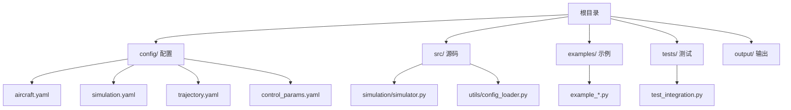
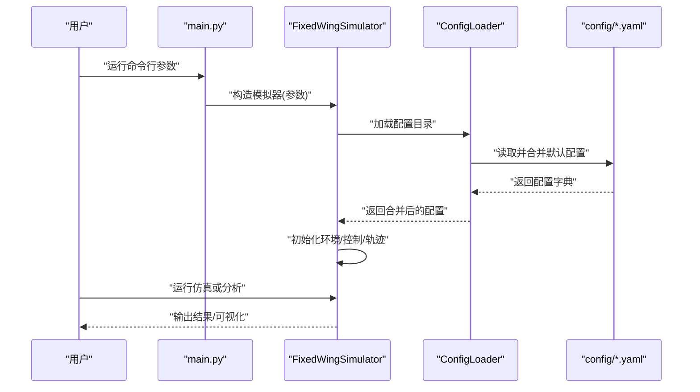
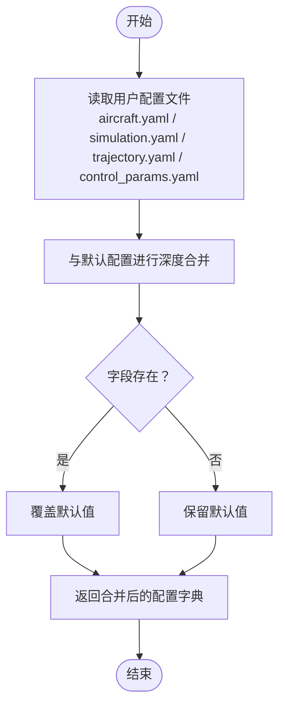
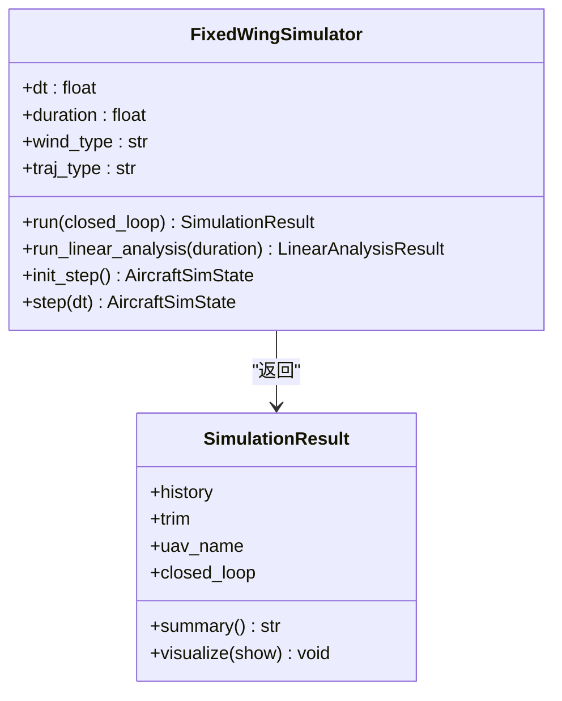
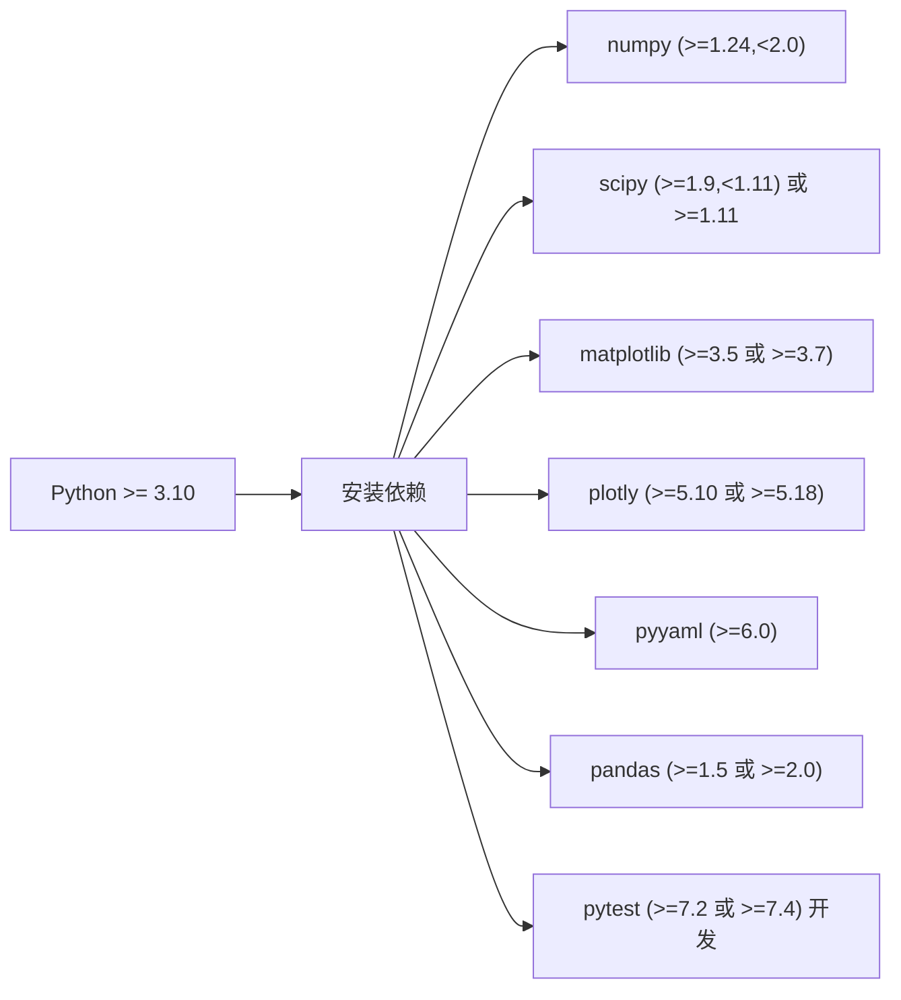

# 常见问题解答

<cite>
**本文引用的文件**
- [requirements.txt](file://requirements.txt)
- [setup.py](file://setup.py)
- [main.py](file://main.py)
- [config/aircraft.yaml](file://config/aircraft.yaml)
- [config/simulation.yaml](file://config/simulation.yaml)
- [config/trajectory.yaml](file://config/trajectory.yaml)
- [config/control_params.yaml](file://config/control_params.yaml)
- [src/utils/config_loader.py](file://src/utils/config_loader.py)
- [src/simulation/simulator.py](file://src/simulation/simulator.py)
- [examples/example_1_linear_response.py](file://examples/example_1_linear_response.py)
- [tests/test_integration.py](file://tests/test_integration.py)
- [debug_long.py](file://debug_long.py)
</cite>

## 目录
1. [简介](#简介)
2. [项目结构](#项目结构)
3. [核心组件](#核心组件)
4. [架构总览](#架构总览)
5. [详细组件分析](#详细组件分析)
6. [依赖关系分析](#依赖关系分析)
7. [性能考虑](#性能考虑)
8. [故障排查指南](#故障排查指南)
9. [结论](#结论)
10. [附录](#附录)

## 简介
本FAQ面向FixedWingSimulator用户，聚焦安装、配置与使用中的典型问题，涵盖环境依赖（如Python版本、NumPy版本冲突）、安装失败、配置文件错误、权限问题等，并提供跨平台（Linux、Windows、macOS）注意事项、自检清单与预防措施。内容基于仓库中实际代码与配置文件进行归纳总结，帮助您快速定位并解决问题。

## 项目结构
- 根目录包含入口脚本、依赖声明、配置目录与示例/输出目录。
- 配置文件位于config/，按功能划分为飞机参数、仿真参数、轨迹规划与控制参数。
- 示例脚本演示如何运行线性分析、轨迹跟踪等场景；测试用例验证数值稳定性与接口一致性。

图表来源
- [main.py](file://main.py#L1-L145)
- [config/aircraft.yaml](file://config/aircraft.yaml#L1-L13)
- [config/simulation.yaml](file://config/simulation.yaml#L1-L30)
- [config/trajectory.yaml](file://config/trajectory.yaml#L1-L23)
- [config/control_params.yaml](file://config/control_params.yaml#L1-L45)
- [src/simulation/simulator.py](file://src/simulation/simulator.py#L1-L200)
- [src/utils/config_loader.py](file://src/utils/config_loader.py#L1-L82)
- [examples/example_1_linear_response.py](file://examples/example_1_linear_response.py#L1-L206)
- [tests/test_integration.py](file://tests/test_integration.py#L1-L391)

章节来源
- [main.py](file://main.py#L1-L145)
- [config/aircraft.yaml](file://config/aircraft.yaml#L1-L13)
- [config/simulation.yaml](file://config/simulation.yaml#L1-L30)
- [config/trajectory.yaml](file://config/trajectory.yaml#L1-L23)
- [config/control_params.yaml](file://config/control_params.yaml#L1-L45)
- [src/simulation/simulator.py](file://src/simulation/simulator.py#L1-L200)
- [src/utils/config_loader.py](file://src/utils/config_loader.py#L1-L82)
- [examples/example_1_linear_response.py](file://examples/example_1_linear_response.py#L1-L206)
- [tests/test_integration.py](file://tests/test_integration.py#L1-L391)

## 核心组件
- 入口与参数解析：命令行入口负责解析参数并初始化模拟器，支持多种飞行模式、风场类型、轨迹类型与分析模式。
- 配置加载：统一从config/读取并合并默认配置，支持覆盖与深度合并。
- 仿真引擎：封装6自由度非线性动力学、环境建模、控制链路与轨迹管理。
- 示例与测试：提供线性分析、轨迹跟踪等示例，以及集成测试保障数值稳定与接口正确性。

章节来源
- [main.py](file://main.py#L32-L95)
- [src/utils/config_loader.py](file://src/utils/config_loader.py#L59-L82)
- [src/simulation/simulator.py](file://src/simulation/simulator.py#L115-L200)
- [examples/example_1_linear_response.py](file://examples/example_1_linear_response.py#L1-L206)
- [tests/test_integration.py](file://tests/test_integration.py#L1-L391)

## 架构总览
下图展示从命令行到配置加载再到仿真执行的关键流程。

图表来源
- [main.py](file://main.py#L98-L141)
- [src/simulation/simulator.py](file://src/simulation/simulator.py#L130-L200)
- [src/utils/config_loader.py](file://src/utils/config_loader.py#L59-L82)
- [config/aircraft.yaml](file://config/aircraft.yaml#L1-L13)
- [config/simulation.yaml](file://config/simulation.yaml#L1-L30)
- [config/trajectory.yaml](file://config/trajectory.yaml#L1-L23)
- [config/control_params.yaml](file://config/control_params.yaml#L1-L45)

## 详细组件分析

### 组件A：配置加载与合并
- 功能要点
  - 默认配置集中于ConfigLoader，包含飞机、仿真、轨迹三类默认值。
  - 通过深度合并策略将用户配置覆盖默认配置，避免遗漏字段。
  - 支持从指定config_dir加载各子系统配置文件。
- 关键路径
  - 加载飞机配置：load_aircraft()
  - 加载仿真配置：load_simulation()
  - 加载轨迹配置：load_trajectory()
  - 加载控制参数：load_control()

图表来源
- [src/utils/config_loader.py](file://src/utils/config_loader.py#L48-L82)
- [config/aircraft.yaml](file://config/aircraft.yaml#L1-L13)
- [config/simulation.yaml](file://config/simulation.yaml#L1-L30)
- [config/trajectory.yaml](file://config/trajectory.yaml#L1-L23)
- [config/control_params.yaml](file://config/control_params.yaml#L1-L45)

章节来源
- [src/utils/config_loader.py](file://src/utils/config_loader.py#L10-L82)
- [config/aircraft.yaml](file://config/aircraft.yaml#L1-L13)
- [config/simulation.yaml](file://config/simulation.yaml#L1-L30)
- [config/trajectory.yaml](file://config/trajectory.yaml#L1-L23)
- [config/control_params.yaml](file://config/control_params.yaml#L1-L45)

### 组件B：仿真引擎与控制链路
- 功能要点
  - 支持闭合回路实时步进与开环线性分析两种模式。
  - 初始化风场、控制参数（ArduPilot兼容）、飞行模式管理器与导航控制器。
  - 提供summary()与visualize()用于结果汇总与可视化。
- 关键路径
  - run()：完整闭环仿真循环
  - run_linear_analysis()：4自由度线性开环分析
  - init_step()/step()：逐帧步进接口（用于外部UI）

图表来源
- [src/simulation/simulator.py](file://src/simulation/simulator.py#L59-L110)
- [src/simulation/simulator.py](file://src/simulation/simulator.py#L115-L200)

章节来源
- [src/simulation/simulator.py](file://src/simulation/simulator.py#L59-L110)
- [src/simulation/simulator.py](file://src/simulation/simulator.py#L115-L200)

### 组件C：示例与调试脚本
- 示例脚本展示了如何进行线性分析、轨迹跟踪与批量保存数据/图像。
- 调试脚本用于长时运行与TECS收敛性观测，便于定位控制参数与数值稳定性问题。

章节来源
- [examples/example_1_linear_response.py](file://examples/example_1_linear_response.py#L1-L206)
- [debug_long.py](file://debug_long.py#L1-L55)

## 依赖关系分析
- Python版本要求：setup.py声明最低版本为3.10。
- 第三方库版本范围：requirements.txt与setup.py对NumPy、SciPy、Matplotlib、Plotly、PyYAML、Pandas给出范围约束。
- 安装方式：推荐使用pip安装，确保满足版本范围；开发依赖可通过extras_require安装。

图表来源
- [setup.py](file://setup.py#L10-L22)
- [requirements.txt](file://requirements.txt#L1-L8)

章节来源
- [setup.py](file://setup.py#L10-L22)
- [requirements.txt](file://requirements.txt#L1-L8)

## 性能考虑
- 时间步长与积分器：simulation.yaml中的dt与integrator影响计算耗时与数值稳定性；建议根据任务需求调整。
- 可视化与I/O：示例脚本使用非交互式后端保存图像，避免GUI开销；批量运行可禁用可视化以提升吞吐。
- 控制参数：TECS与PID参数直接影响动态响应与能耗，需结合具体机型与任务进行调优。

章节来源
- [config/simulation.yaml](file://config/simulation.yaml#L4-L8)
- [examples/example_1_linear_response.py](file://examples/example_1_linear_response.py#L25-L28)
- [config/control_params.yaml](file://config/control_params.yaml#L30-L45)

## 故障排查指南

### 一、环境依赖问题
- 症状
  - 安装时报错：依赖版本不匹配或冲突。
  - 运行时报错：模块导入失败或版本不兼容。
- 原因分析
  - Python版本低于3.10。
  - NumPy/SciPy/Matplotlib/Plotly/Pandas/PyYAML版本不在允许范围内。
- 解决步骤
  - 使用Python 3.10及以上版本。
  - 清理现有虚拟环境，重新创建并安装依赖，确保版本满足setup.py与requirements.txt的要求。
  - 若使用conda，请先创建隔离环境，再安装所需版本。
- 跨平台注意事项
  - Linux/macOS：优先使用系统包管理器或pip安装，注意二进制兼容性。
  - Windows：建议使用Anaconda或Miniconda，避免编译型依赖的缺失。

章节来源
- [setup.py](file://setup.py#L10-L22)
- [requirements.txt](file://requirements.txt#L1-L8)

### 二、安装失败
- 症状
  - pip安装中断、报错或提示无法找到匹配版本。
- 原因分析
  - 网络问题或镜像源不稳定。
  - 本地缓存损坏或代理设置异常。
- 解决步骤
  - 切换到稳定镜像源（如清华、阿里）重试。
  - 清理pip缓存后重试安装。
  - 如需离线安装，下载对应whl/tar.gz后使用pip install <package-file>。
- 预防措施
  - 在CI或自动化环境中固定依赖版本与索引源。
  - 使用requirements.txt或setup.py的install_requires进行一次性安装。

章节来源
- [setup.py](file://setup.py#L10-L22)
- [requirements.txt](file://requirements.txt#L1-L8)

### 三、配置文件错误
- 症状
  - 读取配置失败、字段缺失或类型不匹配导致初始化异常。
- 原因分析
  - YAML语法错误（缩进、冒号、引号）。
  - 字段名拼写错误或超出允许范围。
  - 风场/轨迹/控制参数取值不合理。
- 解决步骤
  - 使用文本编辑器检查YAML缩进与格式，确保键值对正确。
  - 参考默认配置与注释，核对字段名称与取值范围。
  - 将自定义配置与默认配置逐项比对，确认无遗漏。
- 预防措施
  - 使用IDE的YAML校验插件。
  - 在提交前运行轻量级单元测试或lint工具。

章节来源
- [src/utils/config_loader.py](file://src/utils/config_loader.py#L40-L82)
- [config/aircraft.yaml](file://config/aircraft.yaml#L1-L13)
- [config/simulation.yaml](file://config/simulation.yaml#L1-L30)
- [config/trajectory.yaml](file://config/trajectory.yaml#L1-L23)
- [config/control_params.yaml](file://config/control_params.yaml#L1-L45)

### 四、权限问题
- 症状
  - 写入输出目录失败、保存图像/CSV失败。
- 原因分析
  - 当前用户对output/目录无写权限。
  - 权限被安全策略限制（如沙箱容器）。
- 解决步骤
  - 确认output/目录存在且当前用户具备写权限。
  - 在示例脚本中将输出目录指向有权限的位置。
  - 在容器或受限环境中使用--no-plot参数避免图形输出。
- 预防措施
  - 在项目根目录预先创建output/并赋予写权限。
  - 批处理脚本中显式设置输出路径与权限。

章节来源
- [examples/example_1_linear_response.py](file://examples/example_1_linear_response.py#L53-L81)
- [main.py](file://main.py#L81-L84)

### 五、运行时异常与数值不稳定
- 症状
  - 仿真过程中出现发散、NaN或异常姿态角。
- 原因分析
  - dt过大或积分器选择不当。
  - 风场/轨迹/控制参数设置不合理。
  - 飞机数据库中参数与实际不符。
- 解决步骤
  - 减小dt或更换积分器，观察稳定性变化。
  - 检查风场类型与强度、轨迹点与航路点设置。
  - 校验控制参数（如TECS、PID）是否合理。
  - 使用集成测试场景复现问题，定位模块边界。
- 预防措施
  - 从短时稳定的场景开始，逐步增加复杂度。
  - 使用调试脚本长期观测（如debug_long.py）。

章节来源
- [tests/test_integration.py](file://tests/test_integration.py#L41-L58)
- [config/simulation.yaml](file://config/simulation.yaml#L4-L12)
- [config/control_params.yaml](file://config/control_params.yaml#L30-L45)
- [debug_long.py](file://debug_long.py#L1-L55)

### 六、跨平台差异
- Linux/macOS
  - 注意matplotlib后端与显示环境差异，必要时使用Agg后端。
  - 文件路径分隔符与大小写敏感性。
- Windows
  - 避免路径包含空格与特殊字符。
  - 注意cmd/powershell中的转义与大小写敏感性。
- 通用建议
  - 使用相对路径与绝对路径规范化（os.path.abspath）。
  - 在CI中统一使用Linux runner以减少差异。

章节来源
- [examples/example_1_linear_response.py](file://examples/example_1_linear_response.py#L25-L28)
- [src/simulation/simulator.py](file://src/simulation/simulator.py#L149-L152)

### 七、命令行参数与入口问题
- 症状
  - 参数无效、默认值不符合预期。
- 原因分析
  - 传入参数不在允许集合内。
  - config_dir未指向有效目录。
- 解决步骤
  - 使用--help查看可用选项与默认值。
  - 使用--list-aircraft确认可用机型列表。
  - 显式指定--config-dir为config/所在目录。
- 预防措施
  - 在自动化脚本中固定参数组合，避免遗漏关键参数。

章节来源
- [main.py](file://main.py#L32-L95)
- [main.py](file://main.py#L101-L105)
- [main.py](file://main.py#L91-L94)

## 结论
通过规范依赖版本、正确配置文件、合理参数设置与跨平台注意事项，大多数安装与使用问题均可快速解决。建议在首次使用前完成自检清单，并在复杂场景中借助示例与调试脚本进行验证。

## 附录

### 自检清单
- 环境
  - Python版本≥3.10
  - 依赖版本满足setup.py与requirements.txt
- 配置
  - config/目录存在且可读
  - aircraft.yaml/simulation.yaml/trajectory.yaml/control_params.yaml语法正确
  - 字段名与取值在允许范围内
- 权限
  - output/目录存在且可写
- 运行
  - 使用--list-aircraft确认机型可用
  - 使用--no-plot进行批处理
  - 长时运行使用Agg后端避免显示问题

### 常见问题对照表
- 问：安装时报NumPy/SciPy版本冲突怎么办？
  - 答：升级/降级到允许范围内版本，或使用隔离虚拟环境。
- 问：运行时报YAML解析错误？
  - 答：检查缩进与键值对，确保无拼写错误。
- 问：保存图像失败？
  - 答：确认输出目录权限，或使用--no-plot关闭可视化。
- 问：仿真发散或异常？
  - 答：减小dt、检查控制参数、使用集成测试场景复现。