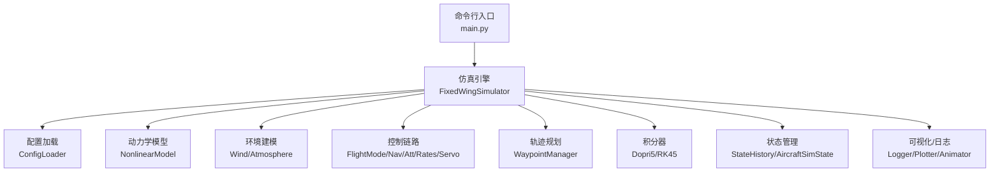
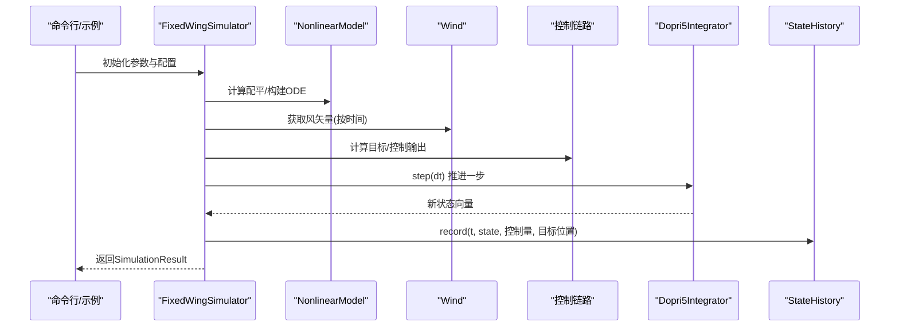
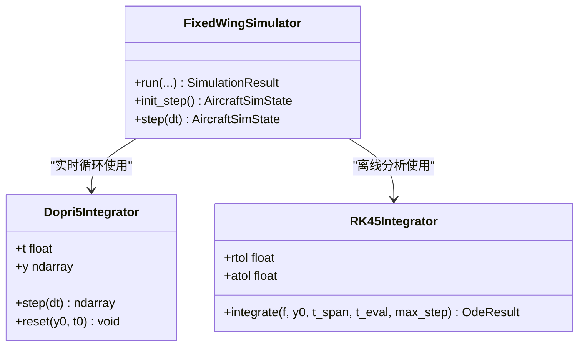
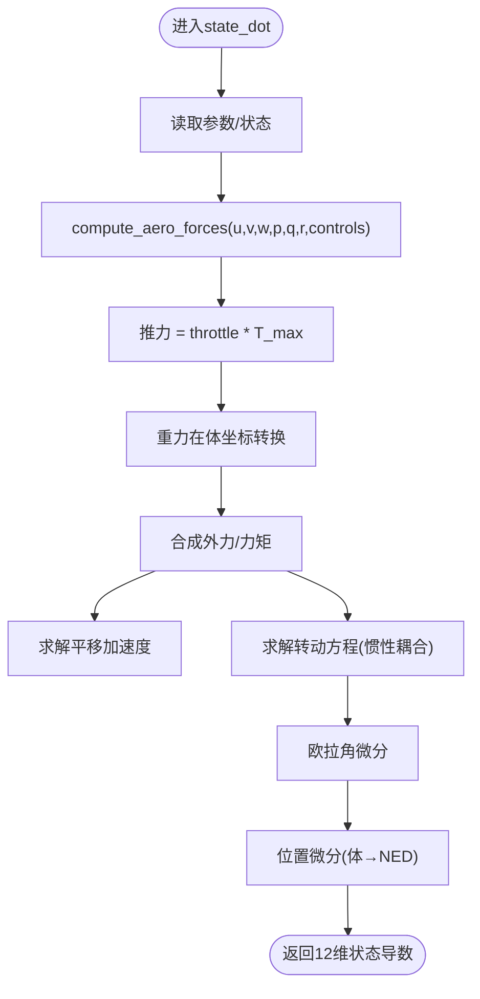
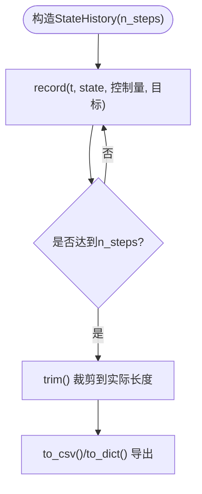
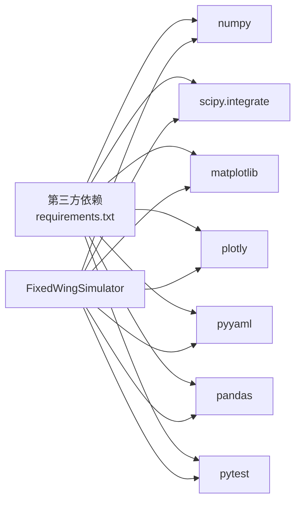

# 性能问题处理

<cite>
**本文引用的文件**   
- [config/simulation.yaml](file://config/simulation.yaml)
- [src/simulation/integrator.py](file://src/simulation/integrator.py)
- [src/simulation/simulator.py](file://src/simulation/simulator.py)
- [src/simulation/state_manager.py](file://src/simulation/state_manager.py)
- [src/dynamics/nonlinear_model.py](file://src/dynamics/nonlinear_model.py)
- [src/environment/wind_model.py](file://src/environment/wind_model.py)
- [src/utils/config_loader.py](file://src/utils/config_loader.py)
- [src/utils/logger.py](file://src/utils/logger.py)
- [tests/test_integration.py](file://tests/test_integration.py)
- [examples/example_1_linear_response.py](file://examples/example_1_linear_response.py)
- [main.py](file://main.py)
- [requirements.txt](file://requirements.txt)
</cite>

## 目录
1. [简介](#简介)
2. [项目结构](#项目结构)
3. [核心组件](#核心组件)
4. [架构总览](#架构总览)
5. [详细组件分析](#详细组件分析)
6. [依赖关系分析](#依赖关系分析)
7. [性能考量与优化策略](#性能考量与优化策略)
8. [故障排查指南](#故障排查指南)
9. [结论](#结论)
10. [附录：基准测试与参数建议](#附录基准测试与参数建议)

## 简介
本指南聚焦于FixedWingSimulator在实际运行中的性能问题处理，围绕仿真速度慢、内存占用大、CPU负载高等问题，系统梳理仿真步长、积分器选择、数值精度、风场模型、状态记录与可视化等关键路径，并给出可操作的优化策略、监控手段与参数建议。文档同时覆盖大规模仿真场景下的并行化思路、内存管理与数据缓存策略，以及硬件配置与瓶颈识别方法。

## 项目结构
项目采用模块化分层设计：配置加载、飞机参数数据库、动力学（线性/非线性）、环境建模（风场/大气）、控制链路（飞行模式管理、导航/姿态/率控制器、舵面混合）、轨迹规划、仿真引擎（积分器与状态管理）、可视化与日志等。主入口通过命令行脚本或示例脚本驱动完整闭环仿真流程。

图表来源
- [main.py](file://main.py#L98-L145)
- [src/simulation/simulator.py](file://src/simulation/simulator.py#L115-L642)
- [src/utils/config_loader.py](file://src/utils/config_loader.py#L59-L82)
- [src/dynamics/nonlinear_model.py](file://src/dynamics/nonlinear_model.py#L104-L386)
- [src/environment/wind_model.py](file://src/environment/wind_model.py#L18-L113)
- [src/simulation/integrator.py](file://src/simulation/integrator.py#L17-L108)
- [src/simulation/state_manager.py](file://src/simulation/state_manager.py#L16-L193)
- [src/utils/logger.py](file://src/utils/logger.py#L10-L44)

章节来源
- [main.py](file://main.py#L1-L145)
- [src/simulation/simulator.py](file://src/simulation/simulator.py#L1-L642)
- [src/utils/config_loader.py](file://src/utils/config_loader.py#L1-L82)

## 核心组件
- 仿真引擎与控制链路：负责构建ODE函数、执行实时步进、组织控制回路与轨迹跟踪，是性能敏感的关键路径。
- 积分器：提供dopri5（单步、自适应步长）与RK45（批量求解）两种实现，直接影响步进效率与稳定性。
- 状态管理：预分配历史缓冲区，避免频繁扩容；导出CSV时按需写盘，减少峰值内存。
- 风场与大气：风模型支持常值/正弦/随机正弦，风扰动会增加每步计算量与控制调节频率。
- 配置与默认：仿真步长、积分容差、初始条件、风类型、日志开关等均来自配置文件与默认值合并。

章节来源
- [src/simulation/simulator.py](file://src/simulation/simulator.py#L239-L567)
- [src/simulation/integrator.py](file://src/simulation/integrator.py#L17-L108)
- [src/simulation/state_manager.py](file://src/simulation/state_manager.py#L95-L193)
- [src/environment/wind_model.py](file://src/environment/wind_model.py#L18-L113)
- [src/utils/config_loader.py](file://src/utils/config_loader.py#L59-L82)
- [config/simulation.yaml](file://config/simulation.yaml#L1-L30)

## 架构总览
下图展示一次典型闭环仿真循环中各模块的交互顺序与数据流。

图表来源
- [src/simulation/simulator.py](file://src/simulation/simulator.py#L329-L567)
- [src/dynamics/nonlinear_model.py](file://src/dynamics/nonlinear_model.py#L160-L281)
- [src/environment/wind_model.py](file://src/environment/wind_model.py#L76-L108)
- [src/simulation/integrator.py](file://src/simulation/integrator.py#L50-L71)
- [src/simulation/state_manager.py](file://src/simulation/state_manager.py#L124-L169)

## 详细组件分析

### 积分器与步进性能
- Dopri5（单步自适应）：适合实时循环，支持nsteps与verbosity等参数，步进稳定但每次调用仍需内部自适应迭代。
- RK45（批量solve_ivp）：适合离线分析，一次性求解整个时间窗，便于批处理但不适合实时循环。
- 步长与容差：dt决定每步开销；rtol/atol影响收敛步数与稳定性，过小会增加步进次数与CPU时间。

图表来源
- [src/simulation/integrator.py](file://src/simulation/integrator.py#L17-L108)
- [src/simulation/simulator.py](file://src/simulation/simulator.py#L239-L642)

章节来源
- [src/simulation/integrator.py](file://src/simulation/integrator.py#L17-L108)
- [src/simulation/simulator.py](file://src/simulation/simulator.py#L339-L567)
- [config/simulation.yaml](file://config/simulation.yaml#L4-L12)

### 动力学与风场计算
- 非线性6-DOF方程：每步计算气动力/力矩、重力、推力、欧拉角微分与位置微分，涉及三角函数、矩阵乘法与密度随高度变化。
- 风场模型：NONE/FIXED/SINE/RANDOMSINE，风扰动越大，控制回路越活跃，积分器步进越频繁，CPU占用越高。
- 大气密度：随海拔变化，影响气动力计算，但当前实现多处使用常数密度以简化计算。

图表来源
- [src/dynamics/nonlinear_model.py](file://src/dynamics/nonlinear_model.py#L160-L255)
- [src/environment/wind_model.py](file://src/environment/wind_model.py#L76-L108)

章节来源
- [src/dynamics/nonlinear_model.py](file://src/dynamics/nonlinear_model.py#L104-L386)
- [src/environment/wind_model.py](file://src/environment/wind_model.py#L18-L113)

### 状态记录与内存管理
- 预分配历史缓冲区：按预期步数初始化固定长度数组，避免动态扩容带来的拷贝与碎片。
- trim裁剪：仿真结束后按实际记录长度裁剪数组，释放多余内存。
- CSV导出：按需写盘，避免在内存中堆积大量中间结果。

图表来源
- [src/simulation/state_manager.py](file://src/simulation/state_manager.py#L95-L193)

章节来源
- [src/simulation/state_manager.py](file://src/simulation/state_manager.py#L95-L193)

### 风场与环境对性能的影响
- 风类型选择：NONE/FIXED对CPU影响较小；SINE/RANDOMSINE引入额外三角函数与随机数生成，增加每步计算量。
- 风速与方向：风速越大，控制回路调节幅度越大，导致积分器更频繁地进行自适应步长调整。
- 建议：在性能敏感场景优先使用NONE或FIXED；需要真实风扰动时，可降低采样频率或简化风模型。

章节来源
- [src/environment/wind_model.py](file://src/environment/wind_model.py#L18-L113)
- [config/simulation.yaml](file://config/simulation.yaml#L22-L25)

## 依赖关系分析
- 固定依赖：NumPy/SciPy/Matplotlib/PyYAML/Pandas/Plotly/pytest。
- 运行时耦合：仿真引擎与积分器、动力学、控制链路紧密耦合；状态管理与可视化相对独立，可通过配置禁用以降低开销。
- 可视化与日志：Matplotlib/Plotly用于绘图，日志模块可选文件落盘，二者在大批量运行时应谨慎开启。

图表来源
- [requirements.txt](file://requirements.txt#L1-L8)
- [src/simulation/simulator.py](file://src/simulation/simulator.py#L33-L51)

章节来源
- [requirements.txt](file://requirements.txt#L1-L8)
- [src/simulation/simulator.py](file://src/simulation/simulator.py#L17-L51)

## 性能考量与优化策略

### 仿真步长与积分器选择
- 步长dt：越小精度越高但步数越多，CPU时间线性增长。建议从0.01~0.05秒起步，结合稳定性测试调整。
- 积分器：
  - 实时循环：使用Dopri5（单步），适合交互式或在线仿真。
  - 批处理/离线分析：使用RK45（solve_ivp），适合快速批量生成结果。
- 容差rtol/atol：过小会增加步进次数，建议在保证稳定的前提下适度放宽。

章节来源
- [config/simulation.yaml](file://config/simulation.yaml#L4-L12)
- [src/simulation/integrator.py](file://src/simulation/integrator.py#L17-L108)
- [src/simulation/simulator.py](file://src/simulation/simulator.py#L339-L567)

### 数值精度与稳定性
- 非线性方程复杂度高，建议保持默认容差；若出现发散或震荡，先检查风场与控制参数，再考虑放宽容差。
- 风扰动与控制回路相互作用可能引发高频振荡，适当增大dt或放宽控制增益有助于稳定。

章节来源
- [src/dynamics/nonlinear_model.py](file://src/dynamics/nonlinear_model.py#L160-L255)
- [tests/test_integration.py](file://tests/test_integration.py#L41-L58)

### 内存管理与数据缓存
- 预分配StateHistory，避免动态扩容；仿真结束调用trim裁剪数组，释放未使用空间。
- CSV导出按需写盘，避免在内存中堆积大量中间数据；关闭可视化可显著降低峰值内存。
- 对于大规模批量任务，建议分批运行并异步写入磁盘。

章节来源
- [src/simulation/state_manager.py](file://src/simulation/state_manager.py#L117-L174)

### 并行化与大规模仿真
- 单机并行：将多个独立仿真实例拆分为进程池，分别运行不同配置或批次，最后合并结果。
- 分布式：使用队列/消息中间件调度任务，按节点负载动态分配。
- 缓存策略：对相同风型/轨迹/参数组合的结果进行缓存，避免重复计算。

说明：上述为通用优化建议，具体实现需结合业务场景扩展。

### 硬件配置与瓶颈识别
- CPU：多核利用率高时，优先优化控制链路与积分器；若GPU无关，重点关注CPU主频与核心数。
- 内存：关注StateHistory与可视化缓冲；必要时降低采样密度或关闭图形输出。
- 存储：CSV/图像输出建议使用SSD；批处理时注意IO吞吐。

### 性能监控与基准测试
- 日志：启用日志模块记录关键阶段耗时与错误信息，便于定位瓶颈。
- 基准脚本：参考示例脚本与命令行入口，统一dt、风型、轨迹类型与持续时间，比较不同配置下的运行时长与内存峰值。
- 可视化：在性能测试中可临时开启，但大批量运行时建议关闭以节省资源。

章节来源
- [src/utils/logger.py](file://src/utils/logger.py#L10-L44)
- [examples/example_1_linear_response.py](file://examples/example_1_linear_response.py#L1-L206)
- [main.py](file://main.py#L98-L145)

## 故障排查指南
- 发散/不稳定：检查dt与容差设置，确认风场与控制参数合理；逐步减小dt验证稳定性。
- CPU过高：降低dt、关闭可视化、简化风模型、减少轨迹点数；评估控制回路增益。
- 内存飙升：确认StateHistory未被意外扩大；确保仿真结束后调用trim；避免在内存中保留中间结果。
- 集成失败：Dopri5在step中抛出异常时，打印当前时间与状态，检查控制输入与风扰动是否突变。

章节来源
- [src/simulation/simulator.py](file://src/simulation/simulator.py#L558-L562)
- [tests/test_integration.py](file://tests/test_integration.py#L41-L58)

## 结论
FixedWingSimulator的性能受步长、积分器、风场与控制回路共同影响。通过合理的步长与容差设置、选择合适的积分器、优化状态记录与可视化策略，可在保证精度的前提下显著提升运行效率。对于大规模仿真，建议采用并行化与缓存策略，并结合日志与基准测试持续监控与调优。

## 附录：基准测试与参数建议
- 基准配置建议
  - 步长：0.01~0.02秒（实时循环）
  - 容差：rtol=1e-6, atol=1e-6（默认）
  - 风场：NONE或FIXED（SINE/RANDOMSINE仅在需要时启用）
  - 可视化：大批量运行时关闭
- 不同配置下的性能对比
  - 小步长+精细风场：CPU高、内存略增
  - 大步长+简化风场：CPU低、内存稳定
  - 关闭可视化：显著降低峰值内存与IO压力
- 参数建议
  - 实时仿真：dt=0.01，积分器=dopri5
  - 批处理：dt=0.02~0.05，积分器=RK45
  - 风扰动：优先NONE/FIXED；需要真实风场时，降低风扰动强度或频率

章节来源
- [config/simulation.yaml](file://config/simulation.yaml#L4-L12)
- [src/simulation/integrator.py](file://src/simulation/integrator.py#L17-L108)
- [src/simulation/simulator.py](file://src/simulation/simulator.py#L339-L567)
- [examples/example_1_linear_response.py](file://examples/example_1_linear_response.py#L132-L144)