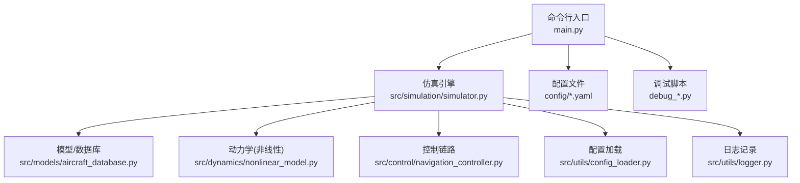
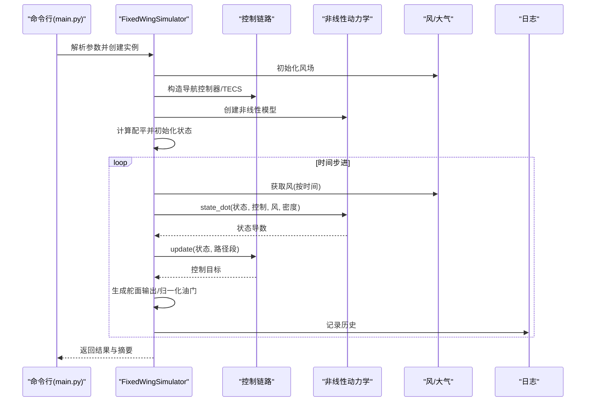
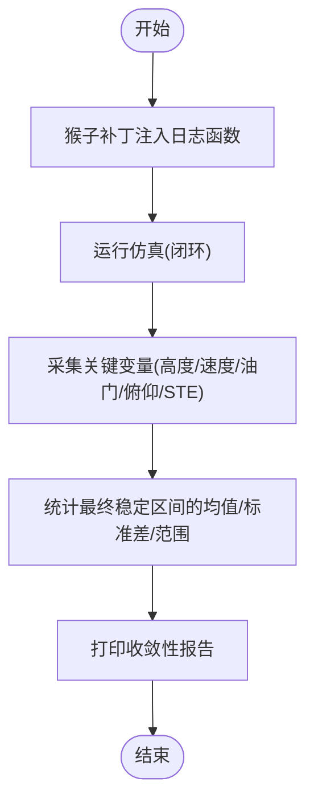
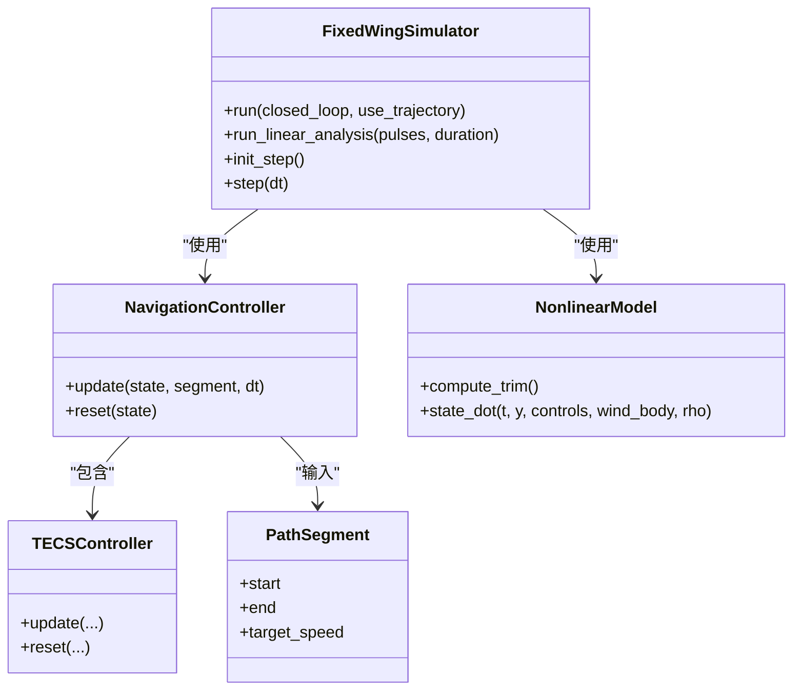
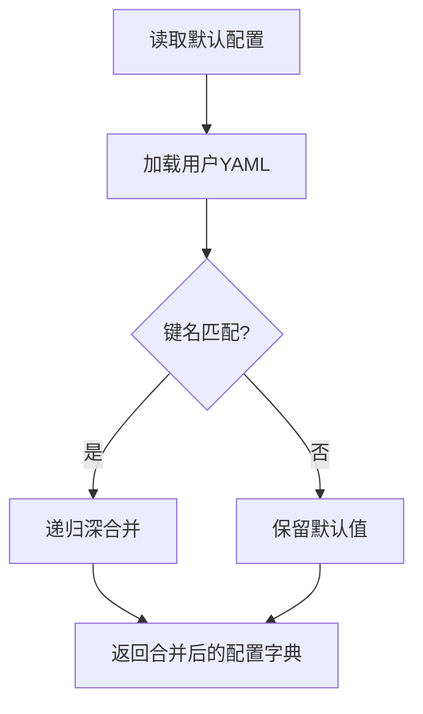
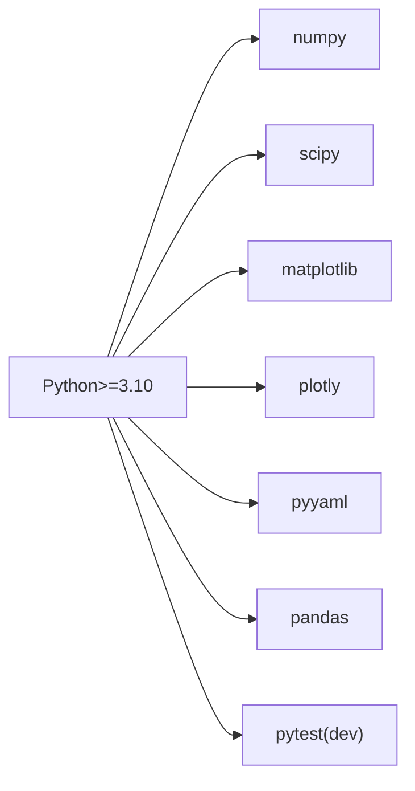

# 故障排除

<cite>
**本文引用的文件**
- [main.py](file://main.py)
- [debug_long.py](file://debug_long.py)
- [debug_segment.py](file://debug_segment.py)
- [debug_tecs.py](file://debug_tecs.py)
- [debug_trim.py](file://debug_trim.py)
- [requirements.txt](file://requirements.txt)
- [setup.py](file://setup.py)
- [src/utils/logger.py](file://src/utils/logger.py)
- [src/utils/config_loader.py](file://src/utils/config_loader.py)
- [config/aircraft.yaml](file://config/aircraft.yaml)
- [config/control_params.yaml](file://config/control_params.yaml)
- [config/simulation.yaml](file://config/simulation.yaml)
- [src/simulation/simulator.py](file://src/simulation/simulator.py)
- [src/models/aircraft_database.py](file://src/models/aircraft_database.py)
- [src/control/navigation_controller.py](file://src/control/navigation_controller.py)
- [src/dynamics/nonlinear_model.py](file://src/dynamics/nonlinear_model.py)
</cite>

## 目录
1. [简介](#简介)
2. [项目结构](#项目结构)
3. [核心组件](#核心组件)
4. [架构总览](#架构总览)
5. [详细组件分析](#详细组件分析)
6. [依赖关系分析](#依赖关系分析)
7. [性能考虑](#性能考虑)
8. [故障排除指南](#故障排除指南)
9. [结论](#结论)
10. [附录](#附录)

## 简介
本指南面向FixedWingSimulator用户，提供系统化的问题排查与修复方法，覆盖安装与环境、配置错误、仿真异常、性能问题、日志分析与调试工具使用，并给出已知问题与临时方案。文档同时提供可视化流程图与序列图，帮助快速定位问题根因。

## 项目结构
项目采用模块化分层设计：入口程序负责参数解析与运行调度；仿真引擎组织动力学、环境、控制、规划、可视化等子系统；配置通过YAML加载与合并；调试脚本用于专项诊断。

图表来源
- [main.py](file://main.py#L98-L145)
- [src/simulation/simulator.py](file://src/simulation/simulator.py#L115-L235)
- [src/utils/config_loader.py](file://src/utils/config_loader.py#L59-L82)
- [src/utils/logger.py](file://src/utils/logger.py#L10-L44)
- [config/aircraft.yaml](file://config/aircraft.yaml#L1-L13)
- [config/control_params.yaml](file://config/control_params.yaml#L1-L45)
- [config/simulation.yaml](file://config/simulation.yaml#L1-L30)
- [debug_long.py](file://debug_long.py#L1-L55)
- [debug_segment.py](file://debug_segment.py#L1-L55)
- [debug_tecs.py](file://debug_tecs.py#L1-L67)
- [debug_trim.py](file://debug_trim.py#L1-L43)

章节来源
- [main.py](file://main.py#L1-L145)
- [src/simulation/simulator.py](file://src/simulation/simulator.py#L1-L110)

## 核心组件
- 命令行入口：解析参数、实例化仿真器、执行闭环/开环仿真、输出结果与可视化。
- 仿真引擎：封装控制-动力学-环境-规划-历史记录，提供run/run_linear_analysis等接口。
- 控制链路：L1横向导航 + TECS纵向能量控制，生成控制目标。
- 动力学模型：6-DOF非线性方程，支持配平求解与O.D.E.求导。
- 配置系统：默认配置与用户YAML合并，支持飞机、仿真、轨迹、控制参数。
- 日志系统：统一格式化日志，支持控制台与文件输出。

章节来源
- [main.py](file://main.py#L32-L145)
- [src/simulation/simulator.py](file://src/simulation/simulator.py#L115-L235)
- [src/control/navigation_controller.py](file://src/control/navigation_controller.py#L45-L202)
- [src/dynamics/nonlinear_model.py](file://src/dynamics/nonlinear_model.py#L104-L155)
- [src/utils/config_loader.py](file://src/utils/config_loader.py#L59-L82)
- [src/utils/logger.py](file://src/utils/logger.py#L10-L44)

## 架构总览
下图展示从命令行到仿真执行的关键交互路径，以及调试脚本如何通过“猴子补丁”注入日志。

图表来源
- [main.py](file://main.py#L98-L145)
- [src/simulation/simulator.py](file://src/simulation/simulator.py#L239-L567)
- [src/control/navigation_controller.py](file://src/control/navigation_controller.py#L134-L202)
- [src/dynamics/nonlinear_model.py](file://src/dynamics/nonlinear_model.py#L160-L255)
- [src/utils/logger.py](file://src/utils/logger.py#L10-L44)

## 详细组件分析

### 组件A：调试脚本与诊断流程
- debug_long.py：长时间TECS收敛性测试，记录高度、速度、油门、俯仰，统计最终稳定区间均值与范围。
- debug_segment.py：记录segment.end传入值与当前高度，检查轨迹des_pos是否被正确裁剪。
- debug_tecs.py：深度记录TECS内部变量（原始/低通高度设定、油门、俯仰、速度、STE误差），对比仿真历史与TECS日志。
- debug_trim.py：基于配平计算巡航油门，验证X/Z力平衡，辅助校准TECS_thr_cruise。

图表来源
- [debug_long.py](file://debug_long.py#L16-L54)
- [debug_segment.py](file://debug_segment.py#L16-L54)
- [debug_tecs.py](file://debug_tecs.py#L17-L66)
- [debug_trim.py](file://debug_trim.py#L10-L42)

章节来源
- [debug_long.py](file://debug_long.py#L1-L55)
- [debug_segment.py](file://debug_segment.py#L1-L55)
- [debug_tecs.py](file://debug_tecs.py#L1-L67)
- [debug_trim.py](file://debug_trim.py#L1-L43)

### 组件B：仿真引擎与控制链路
- 固定翼仿真器：负责配置加载、风场、控制参数、航路点管理、积分器、历史记录与结果汇总。
- 导航控制器：L1横向导航 + TECS纵向控制，支持高度需求低通、爬升/下降速率限制、速度权重、坡度油门补偿等。
- 非线性动力学：6-DOF状态导数，包含气动、推力、重力、欧拉角运动学与位置更新。

图表来源
- [src/simulation/simulator.py](file://src/simulation/simulator.py#L115-L235)
- [src/control/navigation_controller.py](file://src/control/navigation_controller.py#L45-L202)
- [src/dynamics/nonlinear_model.py](file://src/dynamics/nonlinear_model.py#L104-L155)

章节来源
- [src/simulation/simulator.py](file://src/simulation/simulator.py#L239-L567)
- [src/control/navigation_controller.py](file://src/control/navigation_navigation_controller.py#L134-L202)
- [src/dynamics/nonlinear_model.py](file://src/dynamics/nonlinear_model.py#L160-L255)

### 组件C：配置与参数加载
- ConfigLoader：默认配置与用户YAML深合并，分别加载飞机、仿真、轨迹、控制参数。
- aircraft.yaml：选择飞机与可选参数覆盖。
- control_params.yaml：ArduPilot风格控制参数，含TECS关键参数。
- simulation.yaml：仿真时间步长、持续时间、积分器、初始条件、风场与日志开关。

图表来源
- [src/utils/config_loader.py](file://src/utils/config_loader.py#L48-L56)
- [src/utils/config_loader.py](file://src/utils/config_loader.py#L68-L81)
- [config/aircraft.yaml](file://config/aircraft.yaml#L1-L13)
- [config/control_params.yaml](file://config/control_params.yaml#L1-L45)
- [config/simulation.yaml](file://config/simulation.yaml#L1-L30)

章节来源
- [src/utils/config_loader.py](file://src/utils/config_loader.py#L59-L82)
- [config/aircraft.yaml](file://config/aircraft.yaml#L1-L13)
- [config/control_params.yaml](file://config/control_params.yaml#L1-L45)
- [config/simulation.yaml](file://config/simulation.yaml#L1-L30)

## 依赖关系分析
- Python版本要求：>=3.10（setup.py声明）。
- 关键库：numpy、scipy、matplotlib、plotly、pyyaml、pandas、pytest。
- 依赖冲突风险：requirements.txt与setup.py对某些库版本范围不一致，建议统一遵循setup.py以满足最低兼容性。

图表来源
- [requirements.txt](file://requirements.txt#L1-L8)
- [setup.py](file://setup.py#L10-L21)

章节来源
- [requirements.txt](file://requirements.txt#L1-L8)
- [setup.py](file://setup.py#L1-L23)

## 性能考虑
- 仿真速度慢
  - 检查仿真步长与积分器：dt过小或积分器rtol/atol过严会显著增加计算量。参考仿真配置中的dt与tolerances。
  - 减少可视化开销：命令行参数--no-plot可禁用绘图，适合批量运行。
  - 降低轨迹复杂度：轨迹类型与航路点数量影响插值与跟踪计算。
- 内存占用大
  - 历史记录随时间步增长，适当缩短duration或减少记录频率。
  - 使用开环分析替代闭环循环，或仅在必要时启用可视化。
- 数值稳定性
  - 风场与密度随海拔变化：确保密度模型与风模型正确传递给动力学。
  - TECS参数：过高的积分增益或过小的时间常数可能导致振荡与数值不稳定。

章节来源
- [config/simulation.yaml](file://config/simulation.yaml#L1-L30)
- [src/simulation/simulator.py](file://src/simulation/simulator.py#L239-L567)
- [main.py](file://main.py#L80-L84)

## 故障排除指南

### 安装与环境问题
- 症状：导入失败或找不到模块
  - 检查Python版本是否满足>=3.10。
  - 确认项目根目录在sys.path中，或使用正确的相对导入路径。
  - 建议使用虚拟环境安装依赖，避免系统包冲突。
- 症状：matplotlib后端报错
  - 脚本中显式设置Agg后端，确保无GUI依赖；若需交互界面，请改用默认后端或在本地环境中安装GUI支持。

章节来源
- [setup.py](file://setup.py#L10-L10)
- [debug_long.py](file://debug_long.py#L5-L6)
- [debug_segment.py](file://debug_segment.py#L5-L6)

### 配置错误
- 症状：未知飞机名称
  - 确认aircraft.yaml中的aircraft_name在数据库中存在；可通过命令行--list-aircraft查看可用机型。
- 症状：控制参数未生效
  - 检查control_params.yaml路径与键名是否正确；确认未被默认值覆盖。
- 症状：仿真步长或积分精度异常
  - 检查simulation.yaml中的dt、rtol、atol与积分器设置；过小的dt或过严的容差会显著增加计算成本。

章节来源
- [src/simulation/simulator.py](file://src/simulation/simulator.py#L140-L141)
- [config/aircraft.yaml](file://config/aircraft.yaml#L5-L5)
- [config/control_params.yaml](file://config/control_params.yaml#L1-L45)
- [config/simulation.yaml](file://config/simulation.yaml#L4-L12)

### 仿真异常
- 症状：积分器报错或提前终止
  - 查看日志输出中的“Integration error at t=...”提示，定位时间点并检查该时刻的状态与控制输入。
  - 建议降低dt或调整风场/密度模型，避免极端工况。
- 症状：TECS震荡或超调
  - 使用debug_tecs.py观察高度设定、STE误差与油门/俯仰曲线，逐步调整TECS参数（如积分增益、时间常数、坡度油门补偿）。
- 症状：航路点高度不匹配
  - 使用debug_segment.py检查segment.end与des_pos裁剪逻辑，确保起始航路点高度与初始高度一致。

章节来源
- [src/simulation/simulator.py](file://src/simulation/simulator.py#L558-L562)
- [debug_tecs.py](file://debug_tecs.py#L17-L27)
- [debug_segment.py](file://debug_segment.py#L16-L18)

### 调试工具使用指南
- debug_long.py
  - 场景：长时间飞行的TECS收敛性评估。
  - 方法：运行脚本后观察最终高度/速度统计，判断是否存在稳态漂移或持续振荡。
- debug_segment.py
  - 场景：检查路径段终点高度与期望目标的关系，验证des_pos裁剪逻辑。
  - 方法：对比segment.end与当前高度，确认目标高度是否被合理限制。
- debug_tecs.py
  - 场景：深入分析TECS内部变量与外部空速/高度响应。
  - 方法：结合历史数据与TECS日志，定位高度设定、速度权重与积分项的影响。
- debug_trim.py
  - 场景：计算配平状态下的巡航油门，验证X/Z力平衡。
  - 方法：根据配平结果校准TECS_thr_cruise，避免怠速或过载。

章节来源
- [debug_long.py](file://debug_long.py#L1-L55)
- [debug_segment.py](file://debug_segment.py#L1-L55)
- [debug_tecs.py](file://debug_tecs.py#L1-L67)
- [debug_trim.py](file://debug_trim.py#L1-L43)

### 日志分析与关键错误解读
- 日志格式：包含时间戳、模块名、级别与消息。
- 常见错误信号
  - “Integration error at t=...”：数值积分失败，检查dt、风/密度模型与控制输入边界。
  - “Unknown aircraft ...”：aircraft.yaml中的机型不在数据库中。
  - 可视化不可用：导入可视化模块失败，确认plotly/matplotlib安装。
- 日志位置：默认保存在logs目录，文件名包含日期。

章节来源
- [src/utils/logger.py](file://src/utils/logger.py#L10-L44)
- [src/simulation/simulator.py](file://src/simulation/simulator.py#L99-L101)
- [config/simulation.yaml](file://config/simulation.yaml#L28-L29)

### 社区支持与问题反馈
- 当前仓库未提供官方社区链接或问题反馈渠道。建议：
  - 在GitHub上提交Issue（若仓库公开）。
  - 自建讨论区或邮件列表进行交流。
  - 提交PR时附带最小可复现示例与日志文件。

[本节为通用建议，不直接分析具体文件]

### 已知问题与临时方案
- 版本依赖差异
  - 现象：requirements.txt与setup.py对部分库版本范围不一致。
  - 临时方案：以setup.py为准安装依赖，确保最低兼容性。
- 可视化依赖缺失
  - 现象：导入可视化模块失败。
  - 临时方案：安装plotly与matplotlib；或使用--no-plot参数禁用可视化。
- TECS参数敏感
  - 现象：参数微小变化导致显著响应差异。
  - 临时方案：使用debug_tecs.py进行参数扫描，逐步逼近稳定区域。

章节来源
- [requirements.txt](file://requirements.txt#L1-L8)
- [setup.py](file://setup.py#L10-L21)
- [main.py](file://main.py#L80-L84)
- [debug_tecs.py](file://debug_tecs.py#L1-L67)

## 结论
通过系统化的配置检查、调试脚本诊断与日志分析，大多数安装、配置与仿真异常问题均可快速定位与修复。建议在批量运行前先用短时调试脚本验证参数与模型稳定性，并根据性能瓶颈调整仿真步长与可视化策略。

## 附录

### 常用命令与参数速查
- 列出可用飞机：--list-aircraft
- 设置飞机/模式/时长/步长/风场/轨迹：--aircraft/--mode/--duration/--dt/--wind/--traj
- 禁用可视化：--no-plot
- 开启线性分析：--analysis 4dof 或 6dof

章节来源
- [main.py](file://main.py#L32-L95)