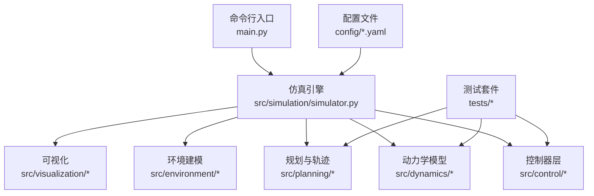
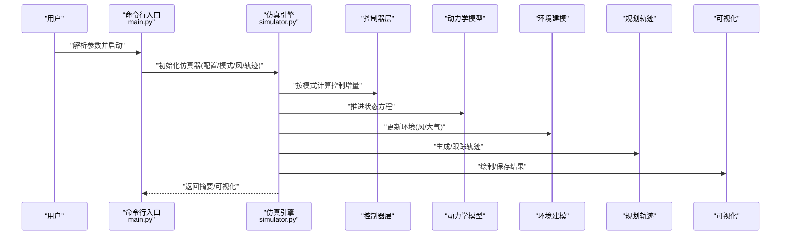
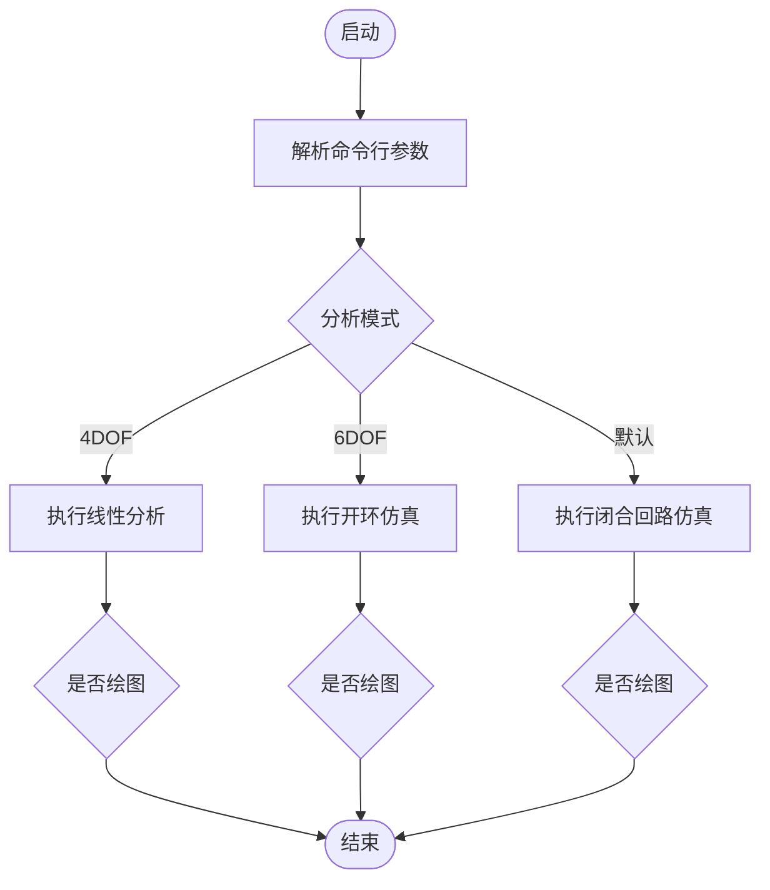
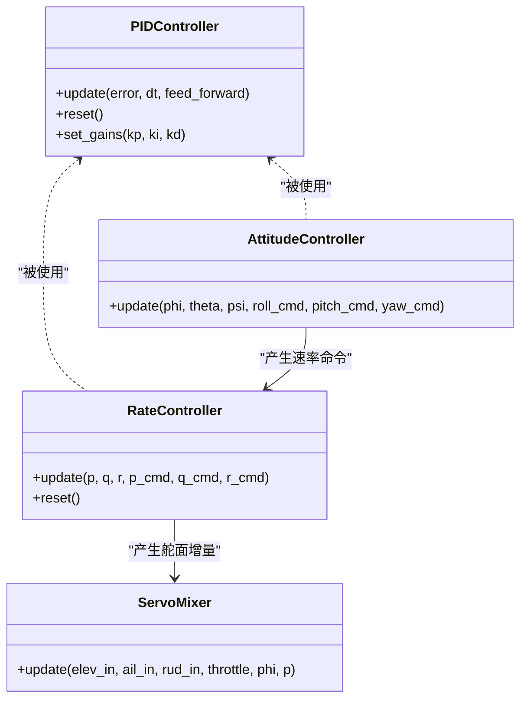
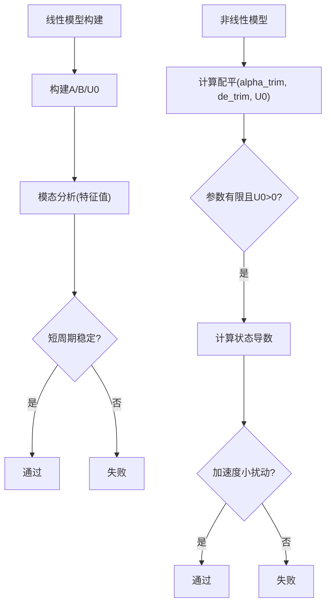
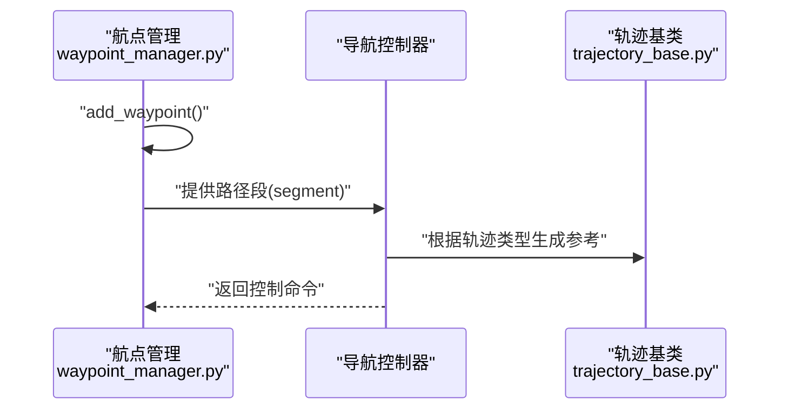
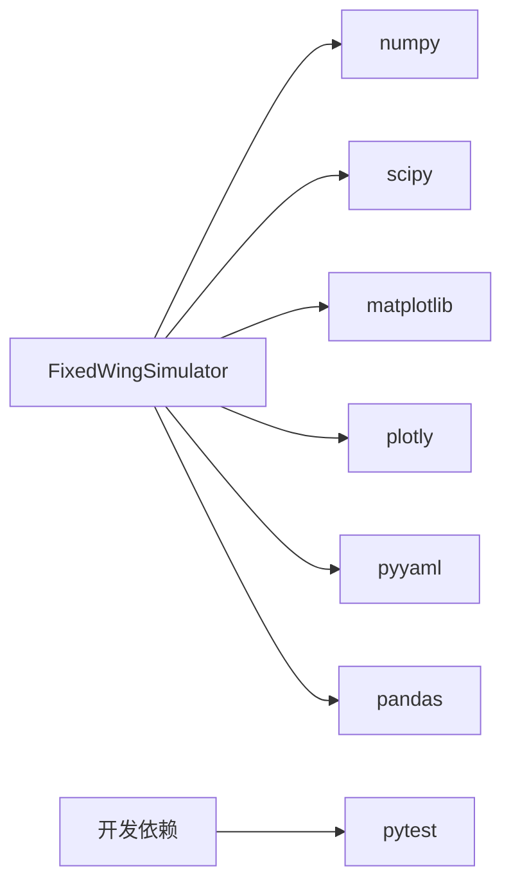

# 社区支持

<cite>
**本文引用的文件**
- [README.md](file://README.md)
- [setup.py](file://setup.py)
- [requirements.txt](file://requirements.txt)
- [main.py](file://main.py)
- [config/aircraft.yaml](file://config/aircraft.yaml)
- [config/simulation.yaml](file://config/simulation.yaml)
- [config/control_params.yaml](file://config/control_params.yaml)
- [src/models/aircraft_database.py](file://src/models/aircraft_database.py)
- [src/simulation/simulator.py](file://src/simulation/simulator.py)
- [src/simulation/integrator.py](file://src/simulation/integrator.py)
- [src/dynamics/linear_model.py](file://src/dynamics/linear_model.py)
- [src/dynamics/nonlinear_model.py](file://src/dynamics/nonlinear_model.py)
- [src/control/pid_controller.py](file://src/control/pid_controller.py)
- [src/control/attitude_controller.py](file://src/control/attitude_controller.py)
- [src/control/rate_controller.py](file://src/control/rate_controller.py)
- [src/control/servo_mixer.py](file://src/control/servo_mixer.py)
- [src/planning/waypoint_manager.py](file://src/planning/waypoint_manager.py)
- [src/planning/trajectory_base.py](file://src/planning/trajectory_base.py)
- [src/environment/atmosphere_model.py](file://src/environment/atmosphere_model.py)
- [src/environment/wind_model.py](file://src/environment/wind_model.py)
- [src/visualization/animator.py](file://src/visualization/animator.py)
- [src/visualization/dashboard.py](file://src/visualization/dashboard.py)
- [src/visualization/plotter.py](file://src/visualization/plotter.py)
- [tests/test_control.py](file://tests/test_control.py)
- [tests/test_dynamics.py](file://tests/test_dynamics.py)
- [tests/test_integration.py](file://tests/test_integration.py)
- [tests/test_planning.py](file://tests/test_planning.py)
- [.gitignore](file://.gitignore)
</cite>

## 目录
1. [简介](#简介)
2. [项目结构](#项目结构)
3. [核心组件](#核心组件)
4. [架构总览](#架构总览)
5. [详细组件分析](#详细组件分析)
6. [依赖关系分析](#依赖关系分析)
7. [性能考虑](#性能考虑)
8. [故障排查指南](#故障排查指南)
9. [结论](#结论)
10. [附录](#附录)

## 简介
本指南面向FixedWingSimulator用户与贡献者，提供社区支持与问题反馈流程、有效报告Bug与功能请求的方法、社区贡献路径、学习资源与相关项目推荐、许可证与使用条款说明、版本发布与变更日志获取方式，以及紧急问题的联系方式与响应预期。请在提交问题前先阅读“故障排查指南”，以提高问题定位效率。

## 项目结构
FixedWingSimulator采用模块化设计，围绕“仿真引擎 + 控制器 + 动力学模型 + 规划与环境 + 可视化”的分层组织。命令行入口负责参数解析与运行调度；配置目录提供飞机、仿真与控制参数；tests目录覆盖控制、动力学、积分与规划模块的单元测试；examples展示典型用法与输出管理。

图表来源
- [main.py](file://main.py#L98-L145)
- [src/simulation/simulator.py](file://src/simulation/simulator.py)
- [src/control/pid_controller.py](file://src/control/pid_controller.py)
- [src/dynamics/linear_model.py](file://src/dynamics/linear_model.py)
- [src/planning/waypoint_manager.py](file://src/planning/waypoint_manager.py)
- [src/visualization/plotter.py](file://src/visualization/plotter.py)
- [config/simulation.yaml](file://config/simulation.yaml#L1-L30)

章节来源
- [main.py](file://main.py#L1-L145)
- [config/aircraft.yaml](file://config/aircraft.yaml#L1-L13)
- [config/simulation.yaml](file://config/simulation.yaml#L1-L30)
- [config/control_params.yaml](file://config/control_params.yaml#L39-L44)

## 核心组件
- 仿真引擎：封装状态推进、模式切换、数据记录与可视化接口，支持闭合回路与开环分析。
- 控制器：包含PID、姿态/速率控制、舵面混合与ArduPilot参数兼容层。
- 动力学模型：线性4自由度与非线性6自由度模型，支持模态分析与稳态计算。
- 规划与轨迹：轨迹基类、航点管理与最小加加加加/加加速度/速度等轨迹生成。
- 环境建模：大气模型与风场模型，支持多种风类型。
- 可视化：动画器、仪表盘与绘图工具，支持结果保存与批量运行。

章节来源
- [src/simulation/simulator.py](file://src/simulation/simulator.py)
- [src/control/attitude_controller.py](file://src/control/attitude_controller.py)
- [src/control/rate_controller.py](file://src/control/rate_controller.py)
- [src/control/servo_mixer.py](file://src/control/servo_mixer.py)
- [src/dynamics/linear_model.py](file://src/dynamics/linear_model.py)
- [src/dynamics/nonlinear_model.py](file://src/dynamics/nonlinear_model.py)
- [src/planning/waypoint_manager.py](file://src/planning/waypoint_manager.py)
- [src/planning/trajectory_base.py](file://src/planning/trajectory_base.py)
- [src/environment/atmosphere_model.py](file://src/environment/atmosphere_model.py)
- [src/environment/wind_model.py](file://src/environment/wind_model.py)
- [src/visualization/animator.py](file://src/visualization/animator.py)
- [src/visualization/dashboard.py](file://src/visualization/dashboard.py)
- [src/visualization/plotter.py](file://src/visualization/plotter.py)

## 架构总览
下图展示了从命令行到仿真引擎、再到各子系统的调用链与数据流。

图表来源
- [main.py](file://main.py#L98-L145)
- [src/simulation/simulator.py](file://src/simulation/simulator.py)
- [src/simulation/integrator.py](file://src/simulation/integrator.py#L20-L20)
- [src/control/attitude_controller.py](file://src/control/attitude_controller.py)
- [src/dynamics/nonlinear_model.py](file://src/dynamics/nonlinear_model.py)
- [src/environment/wind_model.py](file://src/environment/wind_model.py)
- [src/planning/waypoint_manager.py](file://src/planning/waypoint_manager.py)
- [src/visualization/plotter.py](file://src/visualization/plotter.py)

## 详细组件分析

### 命令行与运行流程
- 支持的参数包括飞机选择、初始模式、时长、步长、风模型、轨迹类型、是否绘图、列出可用飞机、配置目录等。
- 运行模式：闭合回路仿真、4自由度线性分析、6自由度开环仿真。
- 输出：摘要信息与可视化（可禁用）。

图表来源
- [main.py](file://main.py#L32-L95)
- [main.py](file://main.py#L98-L145)

章节来源
- [main.py](file://main.py#L1-L145)

### 控制系统组件
- PID控制器：比例、积分、微分、抗积分饱和、复位、前馈与增益设置。
- 姿态控制器：输出类型、零误差时角速度命令为零、限幅与符号约定。
- 速率控制器：零误差时舵面增量为零、限幅与积分器复位。
- 舵面混合器：输出类型、节流限制、升降舵幅限、坐标转弯方向舵补偿、归一化输出范围。

图表来源
- [src/control/pid_controller.py](file://src/control/pid_controller.py)
- [src/control/attitude_controller.py](file://src/control/attitude_controller.py)
- [src/control/rate_controller.py](file://src/control/rate_controller.py)
- [src/control/servo_mixer.py](file://src/control/servo_mixer.py)

章节来源
- [tests/test_control.py](file://tests/test_control.py#L1-L371)

### 动力学模型与稳定性分析
- 线性模型：构建状态矩阵与输入矩阵，进行模态分析（短周期、滑翔），验证稳定性与数值稳定性。
- 非线性模型：计算配平、状态导数维度与收敛性，短期仿真验证高度正性与加速度小扰动。

图表来源
- [src/dynamics/linear_model.py](file://src/dynamics/linear_model.py#L210-L235)
- [tests/test_dynamics.py](file://tests/test_dynamics.py#L200-L255)
- [tests/test_dynamics.py](file://tests/test_dynamics.py#L261-L335)

章节来源
- [tests/test_dynamics.py](file://tests/test_dynamics.py#L1-L336)

### 规划与轨迹
- 航点管理：添加航点、路径段更新与调试辅助。
- 轨迹基类：定义轨迹接口与通用行为。
- 示例：电路飞行、轨迹跟踪等。

图表来源
- [src/planning/waypoint_manager.py](file://src/planning/waypoint_manager.py)
- [src/planning/trajectory_base.py](file://src/planning/trajectory_base.py)
- [debug_segment.py](file://debug_segment.py#L1-L36)

章节来源
- [debug_segment.py](file://debug_segment.py#L1-L36)

### 环境与可视化
- 大气模型与风模型：支持固定风、正弦风、随机正弦风等。
- 可视化：动画器、仪表盘与绘图工具，支持批量保存图像与数据。

章节来源
- [src/environment/atmosphere_model.py](file://src/environment/atmosphere_model.py)
- [src/environment/wind_model.py](file://src/environment/wind_model.py)
- [src/visualization/animator.py](file://src/visualization/animator.py)
- [src/visualization/dashboard.py](file://src/visualization/dashboard.py)
- [src/visualization/plotter.py](file://src/visualization/plotter.py)

## 依赖关系分析
- Python版本要求与安装依赖在打包脚本与依赖清单中明确。
- 测试依赖仅用于开发环境，便于本地验证。

图表来源
- [setup.py](file://setup.py#L11-L21)
- [requirements.txt](file://requirements.txt#L1-L7)

章节来源
- [setup.py](file://setup.py#L1-L23)
- [requirements.txt](file://requirements.txt#L1-L8)

## 性能考虑
- 积分器：默认使用支持刚性问题的求解器，适合实时闭环循环。
- 时间步长与积分容差：可根据仿真精度与性能权衡调整。
- 可视化与日志：批量运行建议关闭绘图以减少IO开销。

章节来源
- [src/simulation/integrator.py](file://src/simulation/integrator.py#L20-L20)
- [config/simulation.yaml](file://config/simulation.yaml#L7-L12)
- [main.py](file://main.py#L81-L84)

## 故障排查指南
- 环境与依赖
  - 确认Python版本满足要求，安装依赖后重试。
  - 若出现绘图异常，尝试关闭绘图或更换后端。
- 参数与配置
  - 检查配置文件中的飞机参数、仿真步长、风类型与轨迹类型。
  - 使用“列出可用飞机”选项确认数据库中的机型名称。
- 控制与稳定性
  - 若出现振荡或发散，检查PID增益、速率控制器限幅与舵面混合器幅限。
  - 对于特定机型，核对数据库参数是否正确加载。
- 动力学与积分
  - 若非线性仿真不收敛，尝试减小步长或调整积分容差。
  - 线性分析用于稳定性判据，若不稳定需重新校准控制器。
- 规划与轨迹
  - 航点顺序与高度变化过大可能导致控制困难，适当降低航路高度变化率。
- 日志与输出
  - 关注日志目录与输出目录，确保权限与磁盘空间充足。

章节来源
- [requirements.txt](file://requirements.txt#L1-L7)
- [setup.py](file://setup.py#L10-L10)
- [config/aircraft.yaml](file://config/aircraft.yaml#L1-L13)
- [config/simulation.yaml](file://config/simulation.yaml#L1-L30)
- [src/models/aircraft_database.py](file://src/models/aircraft_database.py#L29-L104)
- [tests/test_control.py](file://tests/test_control.py#L1-L371)
- [tests/test_dynamics.py](file://tests/test_dynamics.py#L1-L336)
- [main.py](file://main.py#L81-L89)

## 结论
通过遵循本指南，您可以高效地获得社区支持、准确地报告问题、参与贡献，并利用现有资源提升仿真体验。遇到紧急问题时，请优先使用GitHub Issues并按模板提供信息，以便维护团队快速响应。

## 附录

### 官方支持渠道
- GitHub Issues：用于报告Bug、功能请求与技术问题。请在提交前搜索历史Issue，避免重复。
- 邮件列表/论坛：暂未在仓库中发现公开的邮件列表或论坛链接。建议关注项目主页或README中的相关链接。

章节来源
- [README.md](file://README.md)

### 如何有效报告Bug与功能请求
- Bug报告模板要点
  - 环境信息：操作系统、Python版本、依赖版本、硬件配置。
  - 复现步骤：最小可复现实例、命令行参数、配置文件内容。
  - 预期行为与实际行为：清晰对比。
  - 日志与截图：附上关键日志片段与可视化输出。
  - 补充信息：是否在不同风/轨迹/模式下复现。
- 功能请求
  - 描述背景与目标场景。
  - 提供期望API或行为的简要说明。
  - 说明对现有功能的影响与兼容性考虑。

### 社区贡献方式
- 代码贡献
  - 提交PR前运行测试，确保新增/修改代码通过单元测试。
  - 遵循现有代码风格与模块职责划分。
- 文档改进
  - 修正错别字、补充缺失说明、完善示例。
- 测试反馈
  - 提供边界条件与异常场景的测试用例与结果。
- 讨论与交流
  - 在Issues中参与讨论，提供复现信息与建议。

章节来源
- [tests/test_control.py](file://tests/test_control.py#L1-L371)
- [tests/test_dynamics.py](file://tests/test_dynamics.py#L1-L336)
- [tests/test_integration.py](file://tests/test_integration.py)
- [tests/test_planning.py](file://tests/test_planning.py)

### 学习资源与相关项目推荐
- 相关项目
  - ArduPilot：与ArduPilot参数兼容，便于对比与迁移。
  - 数值积分与控制系统：SciPy、NumPy、Matplotlib等。
- 推荐实践
  - 从简单线性模型入手理解稳定性，再过渡到非线性仿真。
  - 使用示例脚本作为起点，逐步调整参数与配置。

章节来源
- [src/control/ardupilot_compat.py](file://src/control/ardupilot_compat.py)
- [requirements.txt](file://requirements.txt#L1-L7)
- [examples/example_1_linear_response.py](file://examples/example_1_linear_response.py#L38-L68)

### 许可证与使用条款
- 许可证信息：请在项目根目录查找LICENSE或COPYING文件以获取完整许可文本。
- 使用条款：遵循许可证要求，注明来源与修改情况；商业用途请遵守相应条款。

章节来源
- [README.md](file://README.md)

### 版本发布周期与变更日志
- 版本号：当前包版本在打包脚本中声明。
- 发布周期：仓库未提供明确的发布周期说明。
- 变更日志：建议关注Git提交历史与标签，或在README中查找变更记录链接。

章节来源
- [setup.py](file://setup.py#L5-L5)

### 紧急问题联系方式与响应预期
- 紧急问题：优先通过GitHub Issues提交，使用“紧急”标签或在标题中注明。
- 响应预期：仓库未提供SLA或响应时间承诺。建议在工作日提交并在Issues中持续跟进。