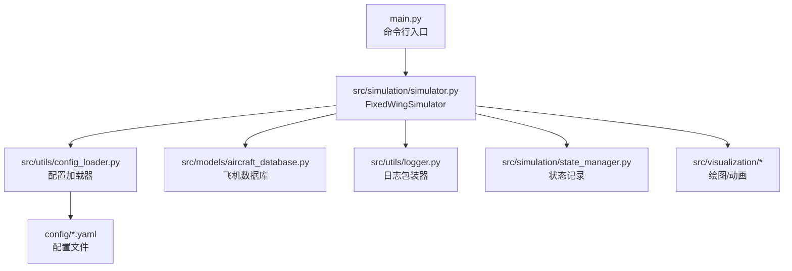
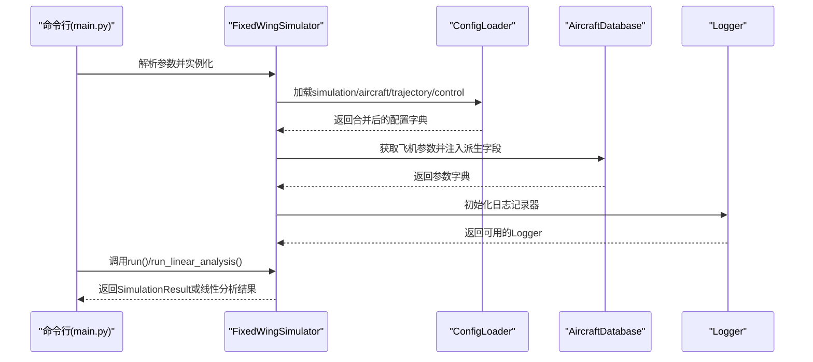
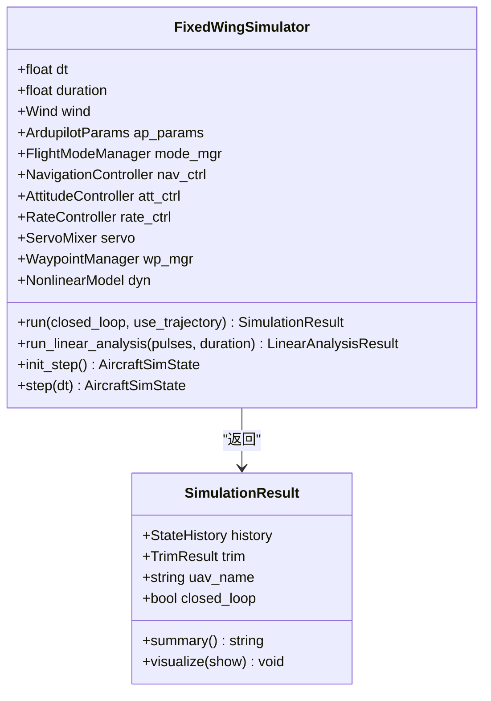
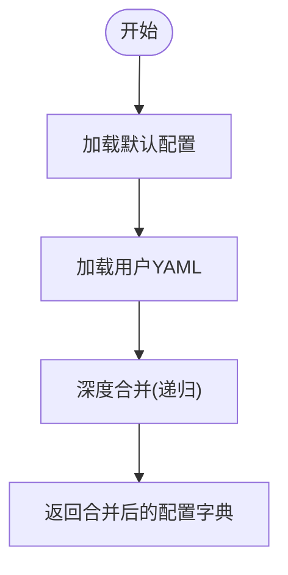
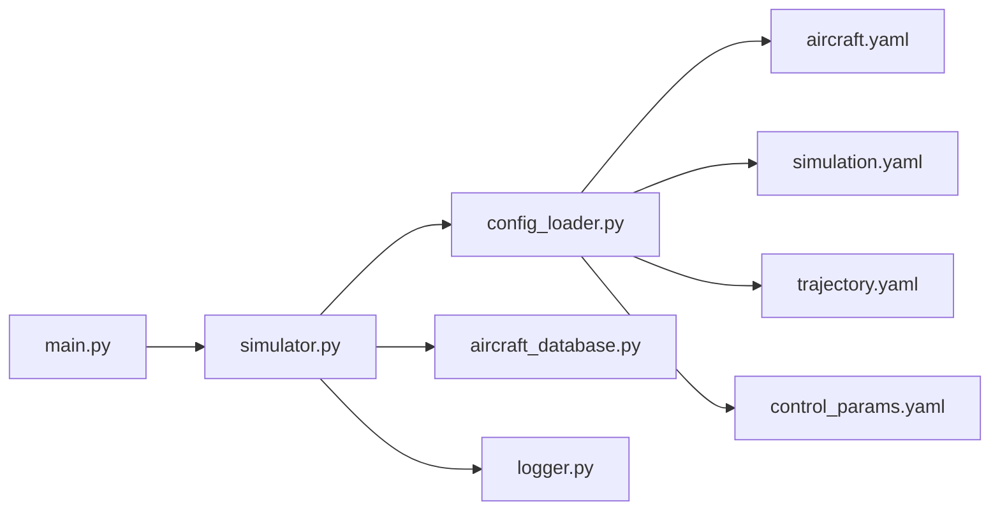
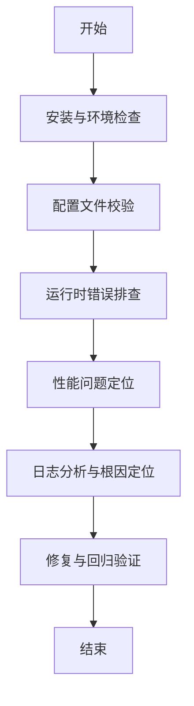

# 系统诊断流程

<cite>
**本文引用的文件**
- [main.py](file://main.py)
- [src/simulation/simulator.py](file://src/simulation/simulator.py)
- [src/utils/logger.py](file://src/utils/logger.py)
- [src/utils/config_loader.py](file://src/utils/config_loader.py)
- [config/simulation.yaml](file://config/simulation.yaml)
- [config/aircraft.yaml](file://config/aircraft.yaml)
- [config/control_params.yaml](file://config/control_params.yaml)
- [config/trajectory.yaml](file://config/trajectory.yaml)
- [src/models/aircraft_database.py](file://src/models/aircraft_database.py)
- [debug_long.py](file://debug_long.py)
- [debug_segment.py](file://debug_segment.py)
- [debug_tecs.py](file://debug_tecs.py)
- [debug_trim.py](file://debug_trim.py)
</cite>

## 目录
1. [简介](#简介)
2. [项目结构](#项目结构)
3. [核心组件](#核心组件)
4. [架构总览](#架构总览)
5. [详细组件分析](#详细组件分析)
6. [依赖关系分析](#依赖关系分析)
7. [性能考量](#性能考量)
8. [故障诊断流程](#故障诊断流程)
9. [日志与追踪指南](#日志与追踪指南)
10. [仿真状态与参数检查清单](#仿真状态与参数检查清单)
11. [自动化诊断与自定义工具](#自动化诊断与自定义工具)
12. [常见问题分类与定位](#常见问题分类与定位)
13. [结论](#结论)

## 简介
本文件面向FixedWingSimulator用户与维护者，提供一套系统化、可操作的故障诊断流程。内容覆盖问题分类（安装问题、配置问题、运行时错误、性能问题）、诊断优先级、检查清单、日志追踪方法、仿真状态与参数验证步骤，并给出自动化诊断脚本使用与自定义诊断工具开发指导，帮助快速区分软件缺陷与用户配置错误。

## 项目结构
项目采用模块化分层设计：入口程序负责参数解析与调度；仿真引擎组织动力学、环境、控制、规划、可视化等子系统；配置加载器统一管理各子系统的YAML配置；日志包装器提供统一的日志输出与文件落盘能力。

图表来源
- [main.py](file://main.py#L98-L145)
- [src/simulation/simulator.py](file://src/simulation/simulator.py#L115-L235)
- [src/utils/config_loader.py](file://src/utils/config_loader.py#L59-L82)
- [src/utils/logger.py](file://src/utils/logger.py#L10-L44)
- [config/simulation.yaml](file://config/simulation.yaml#L1-L30)

章节来源
- [main.py](file://main.py#L1-L145)
- [src/simulation/simulator.py](file://src/simulation/simulator.py#L1-L120)
- [src/utils/config_loader.py](file://src/utils/config_loader.py#L1-L82)
- [src/utils/logger.py](file://src/utils/logger.py#L1-L44)
- [config/simulation.yaml](file://config/simulation.yaml#L1-L30)

## 核心组件
- 固定翼仿真器：负责装配控制链路、轨迹规划、数值积分与状态记录，提供闭环/开环两种运行模式。
- 配置加载器：合并默认配置与用户YAML，支持多子系统配置加载。
- 日志包装器：统一控制台与文件日志输出，按日期生成日志文件。
- 飞机数据库：内置多型飞机参数，提供派生字段供动力学模块使用。
- 调试脚本：提供TECS收敛、轨迹段目标、配平等专项诊断能力。

章节来源
- [src/simulation/simulator.py](file://src/simulation/simulator.py#L115-L235)
- [src/utils/config_loader.py](file://src/utils/config_loader.py#L59-L82)
- [src/utils/logger.py](file://src/utils/logger.py#L10-L44)
- [src/models/aircraft_database.py](file://src/models/aircraft_database.py#L29-L136)
- [debug_tecs.py](file://debug_tecs.py#L1-L67)

## 架构总览
下图展示从命令行到仿真执行的关键交互路径，以及配置与日志在其中的作用。

图表来源
- [main.py](file://main.py#L98-L145)
- [src/simulation/simulator.py](file://src/simulation/simulator.py#L130-L235)
- [src/utils/config_loader.py](file://src/utils/config_loader.py#L59-L82)
- [src/utils/logger.py](file://src/utils/logger.py#L10-L44)
- [src/models/aircraft_database.py](file://src/models/aircraft_database.py#L143-L166)

## 详细组件分析

### 固定翼仿真器（FixedWingSimulator）
- 职责：装配控制链（导航、姿态、角速率、舵面混合）、环境风场、轨迹管理、非线性动力学、数值积分与状态历史记录。
- 关键点：
  - 支持闭环（ArduPilot兼容控制链）与开环（仅动力学）两种模式。
  - 自动根据配平计算巡航油门，避免不合理的初始油门导致不稳定。
  - 轨迹模式与航路点序列模式切换逻辑清晰，便于定位轨迹跟踪问题。
  - 集成可视化接口，异常时会提示“可视化不可用”。

图表来源
- [src/simulation/simulator.py](file://src/simulation/simulator.py#L115-L235)
- [src/simulation/simulator.py](file://src/simulation/simulator.py#L59-L110)

章节来源
- [src/simulation/simulator.py](file://src/simulation/simulator.py#L239-L568)

### 配置加载器（ConfigLoader）
- 职责：加载并合并默认配置与用户YAML，支持飞机、控制、仿真、轨迹四类配置。
- 关键点：
  - 默认配置集中于单处，便于统一维护与审计。
  - 深度合并策略确保用户覆盖项生效且不影响未指定字段。

图表来源
- [src/utils/config_loader.py](file://src/utils/config_loader.py#L48-L57)
- [src/utils/config_loader.py](file://src/utils/config_loader.py#L68-L81)

章节来源
- [src/utils/config_loader.py](file://src/utils/config_loader.py#L1-L82)

### 日志包装器（Logger）
- 职责：统一格式化输出，同时输出到控制台与按日期命名的日志文件。
- 关键点：
  - 可通过配置开关启用/禁用日志文件写入。
  - 日志格式包含时间戳、模块名、级别与消息体，便于检索。

章节来源
- [src/utils/logger.py](file://src/utils/logger.py#L10-L44)

### 飞机数据库（AircraftDatabase）
- 职责：提供内置飞机参数与派生字段（如动态压力、静压等），供动力学与控制模块使用。
- 关键点：
  - 提供列表查询与信息摘要，便于诊断阶段确认机型是否正确加载。

章节来源
- [src/models/aircraft_database.py](file://src/models/aircraft_database.py#L29-L136)
- [src/models/aircraft_database.py](file://src/models/aircraft_database.py#L143-L182)

## 依赖关系分析
- 入口依赖仿真器；仿真器依赖配置加载器、飞机数据库、日志包装器与各子系统模块。
- 配置文件位于config目录，仿真器通过ConfigLoader统一加载。
- 可视化模块在导入失败时会降级提示，不影响核心仿真流程。

图表来源
- [main.py](file://main.py#L98-L145)
- [src/simulation/simulator.py](file://src/simulation/simulator.py#L130-L235)
- [src/utils/config_loader.py](file://src/utils/config_loader.py#L59-L82)
- [src/utils/logger.py](file://src/utils/logger.py#L10-L44)
- [config/aircraft.yaml](file://config/aircraft.yaml#L1-L13)
- [config/simulation.yaml](file://config/simulation.yaml#L1-L30)
- [config/trajectory.yaml](file://config/trajectory.yaml#L1-L23)
- [config/control_params.yaml](file://config/control_params.yaml#L1-L45)

章节来源
- [main.py](file://main.py#L98-L145)
- [src/simulation/simulator.py](file://src/simulation/simulator.py#L130-L235)
- [src/utils/config_loader.py](file://src/utils/config_loader.py#L59-L82)

## 性能考量
- 时间步长与积分器选择：dt与integrator直接影响稳定性与性能。建议先用较粗步长验证功能，再精细化。
- 风场与轨迹复杂度：风模型与轨迹类型增加计算开销，应按需启用。
- 可视化：批量运行建议关闭可视化以减少IO与渲染开销。

## 故障诊断流程
以下为标准化诊断步骤，按优先级推进，结合检查清单与日志追踪定位问题。

### 安装与环境检查
- Python版本与依赖：确认Python版本满足要求，依赖已安装。
- 工作目录与路径：确保从项目根目录运行，避免相对路径问题。
- 可视化依赖：若无GUI环境，建议使用批处理模式关闭可视化。

章节来源
- [main.py](file://main.py#L25-L27)

### 配置文件校验
- 机型选择：确认aircraft.yaml中的aircraft_name有效。
- 仿真参数：dt、duration、integrator、rtol/atol、初始条件、风场类型与日志开关。
- 轨迹参数：type、average_speed、yaw_mode、waypoints与loop。
- 控制参数：ArduPilot兼容参数与TECS参数是否合理。

章节来源
- [config/aircraft.yaml](file://config/aircraft.yaml#L1-L13)
- [config/simulation.yaml](file://config/simulation.yaml#L1-L30)
- [config/trajectory.yaml](file://config/trajectory.yaml#L1-L23)
- [config/control_params.yaml](file://config/control_params.yaml#L1-L45)

### 运行时错误排查
- 未知机型：构造函数会校验机型名称，若无效则抛出异常。
- 数值积分错误：仿真主循环中捕获积分器异常并打印时间戳，便于定位。
- 可视化不可用：导入失败时会提示，不影响仿真继续执行。

章节来源
- [src/simulation/simulator.py](file://src/simulation/simulator.py#L140-L141)
- [src/simulation/simulator.py](file://src/simulation/simulator.py#L558-L562)
- [src/simulation/simulator.py](file://src/simulation/simulator.py#L99-L101)

### 性能问题定位
- 步长时间步长过大：可能导致发散或轨迹偏差。
- 轨迹复杂度：轨迹点过多或类型复杂会增加计算负担。
- 风场扰动：强风或随机风会增加控制难度与仿真抖动。

章节来源
- [config/simulation.yaml](file://config/simulation.yaml#L4-L8)
- [config/trajectory.yaml](file://config/trajectory.yaml#L3-L4)

### 日志分析与根因定位
- 日志级别：默认INFO级别，可在代码中调整。
- 文件落盘：按日期生成日志文件，便于离线分析。
- 关键信息：关注集成器报错、航路点切换、轨迹目标裁剪等关键节点。

章节来源
- [src/utils/logger.py](file://src/utils/logger.py#L10-L44)
- [src/simulation/simulator.py](file://src/simulation/simulator.py#L558-L562)

## 日志与追踪指南
- 日志初始化：通过日志包装器获取命名Logger，自动配置控制台与文件处理器。
- 日志级别：可通过参数调整，建议在问题复现时临时提升级别以捕获更多细节。
- 关键错误识别：关注“Integration error”、“Visualisation not available”、“Unknown aircraft”等信息。
- 日志文件分析：按时间顺序定位异常发生点，结合仿真时间戳与状态历史进行交叉验证。

章节来源
- [src/utils/logger.py](file://src/utils/logger.py#L10-L44)
- [src/simulation/simulator.py](file://src/simulation/simulator.py#L558-L562)

## 仿真状态与参数检查清单
- 机型确认：核对aircraft.yaml与命令行参数一致。
- 初始条件：检查initial_position、initial_heading_deg与initial_mode。
- 风场设置：wind_type、wind_speed、wind_direction_deg。
- 控制参数：TECS与PID参数是否与机型匹配。
- 轨迹与航路点：waypoints数量与高度是否合理，loop设置是否符合预期。
- 可视化：在无GUI环境时关闭可视化以避免导入异常。

章节来源
- [config/aircraft.yaml](file://config/aircraft.yaml#L5-L12)
- [config/simulation.yaml](file://config/simulation.yaml#L14-L29)
- [config/control_params.yaml](file://config/control_params.yaml#L30-L44)
- [config/trajectory.yaml](file://config/trajectory.yaml#L12-L22)
- [main.py](file://main.py#L32-L95)

## 自动化诊断与自定义工具
- 使用现有调试脚本：
  - 长时间TECS收敛：用于观察高度、速度、油门、俯仰随时间变化趋势。
  - 轨迹段目标诊断：记录目标高度与当前高度，辅助判断轨迹裁剪逻辑。
  - TECS详细日志：记录原始/滤波高度需求、STE误差等内部信号。
  - 配平油门计算：基于动力学配平结果反推合理巡航油门。
- 自定义诊断工具开发建议：
  - 通过monkey-patch方式注入观测点，记录关键中间变量。
  - 将观测数据导出为CSV/JSON，配合可视化工具进行对比分析。
  - 将诊断逻辑封装为独立脚本，便于重复执行与回归验证。

章节来源
- [debug_long.py](file://debug_long.py#L1-L55)
- [debug_segment.py](file://debug_segment.py#L1-L55)
- [debug_tecs.py](file://debug_tecs.py#L1-L67)
- [debug_trim.py](file://debug_trim.py#L1-L43)

## 常见问题分类与定位
- 安装问题
  - 症状：无法导入模块、找不到包。
  - 排查：确认工作目录、PYTHONPATH与依赖安装。
- 配置问题
  - 症状：机型未知、参数越界、轨迹点无效。
  - 排查：对照默认配置与用户覆盖项，逐项核对。
- 运行时错误
  - 症状：积分器报错、可视化导入失败。
  - 排查：查看日志时间戳，缩小到具体时间窗口；检查控制命令与状态边界。
- 性能问题
  - 症状：仿真过慢、轨迹抖动、控制不稳。
  - 排查：降低dt、简化轨迹、关闭可视化、检查风场强度。

章节来源
- [src/simulation/simulator.py](file://src/simulation/simulator.py#L140-L141)
- [src/simulation/simulator.py](file://src/simulation/simulator.py#L558-L562)
- [src/simulation/simulator.py](file://src/simulation/simulator.py#L99-L101)

## 结论
通过上述系统化流程，可高效地从问题发现到解决闭环推进。建议在每次变更后保留日志与状态历史，形成可追溯的诊断证据链；对关键参数建立基线值，便于快速识别异常。对于反复出现的问题，沉淀为自动化诊断脚本与回归用例，持续提升系统稳定性与可维护性。