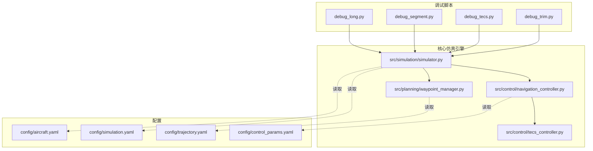
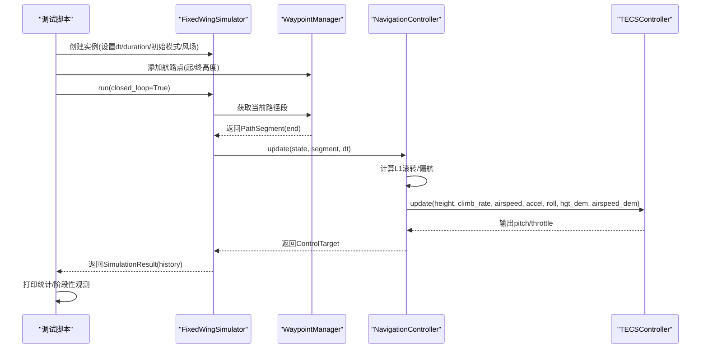
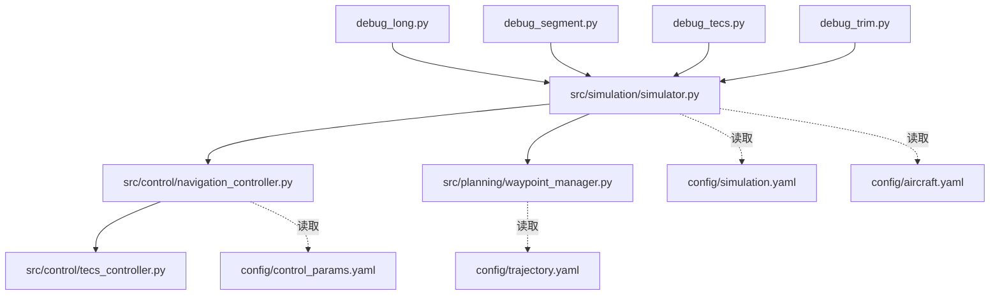

# 调试工具使用

<cite>
**本文引用的文件**
- [debug_long.py](file://debug_long.py)
- [debug_segment.py](file://debug_segment.py)
- [debug_tecs.py](file://debug_tecs.py)
- [debug_trim.py](file://debug_trim.py)
- [simulation.yaml](file://config/simulation.yaml)
- [control_params.yaml](file://config/control_params.yaml)
- [trajectory.yaml](file://config/trajectory.yaml)
- [aircraft.yaml](file://config/aircraft.yaml)
- [simulator.py](file://src/simulation/simulator.py)
- [navigation_controller.py](file://src/control/navigation_controller.py)
- [tecs_controller.py](file://src/control/tecs_controller.py)
- [waypoint_manager.py](file://src/planning/waypoint_manager.py)
- [logger.py](file://src/utils/logger.py)
</cite>

## 目录
1. [简介](#简介)
2. [项目结构](#项目结构)
3. [核心组件](#核心组件)
4. [架构总览](#架构总览)
5. [详细组件分析](#详细组件分析)
6. [依赖关系分析](#依赖关系分析)
7. [性能考量](#性能考量)
8. [故障排查指南](#故障排查指南)
9. [结论](#结论)
10. [附录](#附录)

## 简介
本指南面向FixedWingSimulator的调试与验证工作，系统讲解四个专用调试脚本的用途、参数设置、运行方法、输出解读与可视化技巧，并提供结合日志系统的定位策略、常见陷阱与最佳实践。四个脚本分别聚焦：
- debug_long.py：长时仿真调试，评估TECS在持续爬升过程中的收敛与稳态表现
- debug_segment.py：轨迹段调试，检查路径段终点高度传入是否正确
- debug_tecs.py：TECS控制调试，深入分析高度需求、滤波与油门/俯仰响应
- debug_trim.py：静态平衡调试，计算配平状态下的巡航油门与气动/重力平衡

## 项目结构
调试脚本位于仓库根目录，直接导入src子模块进行仿真与观测。关键配置文件位于config目录，控制仿真步长、风场、飞行模式、TECS参数与轨迹规划等。

图表来源
- [debug_long.py](file://debug_long.py#L1-L55)
- [debug_segment.py](file://debug_segment.py#L1-L55)
- [debug_tecs.py](file://debug_tecs.py#L1-L67)
- [debug_trim.py](file://debug_trim.py#L1-L43)
- [simulator.py](file://src/simulation/simulator.py#L115-L200)
- [navigation_controller.py](file://src/control/navigation_controller.py#L45-L200)
- [tecs_controller.py](file://src/control/tecs_controller.py#L50-L200)
- [waypoint_manager.py](file://src/planning/waypoint_manager.py#L20-L200)
- [simulation.yaml](file://config/simulation.yaml#L1-L30)
- [control_params.yaml](file://config/control_params.yaml#L1-L45)
- [trajectory.yaml](file://config/trajectory.yaml#L1-L23)
- [aircraft.yaml](file://config/aircraft.yaml#L1-L13)

章节来源
- [debug_long.py](file://debug_long.py#L1-L55)
- [debug_segment.py](file://debug_segment.py#L1-L55)
- [debug_tecs.py](file://debug_tecs.py#L1-L67)
- [debug_trim.py](file://debug_trim.py#L1-L43)
- [simulation.yaml](file://config/simulation.yaml#L1-L30)
- [control_params.yaml](file://config/control_params.yaml#L1-L45)
- [trajectory.yaml](file://config/trajectory.yaml#L1-L23)
- [aircraft.yaml](file://config/aircraft.yaml#L1-L13)

## 核心组件
- 固定翼仿真器：负责加载配置、构建环境、控制链路与轨迹管理，执行闭环/开环仿真并记录历史
- 导航控制器：实现L1横向导航与TECS纵向控制，将路径段与期望空速/高度映射为控制指令
- TECS控制器：基于总比能量与比能分配比的纵向控制算法，输出油门与俯仰指令
- 航路点管理器：维护NED航路点、生成轨迹并提供当前活动段
- 日志系统：统一的日志记录器，支持控制台与文件输出

章节来源
- [simulator.py](file://src/simulation/simulator.py#L115-L200)
- [navigation_controller.py](file://src/control/navigation_controller.py#L45-L200)
- [tecs_controller.py](file://src/control/tecs_controller.py#L50-L200)
- [waypoint_manager.py](file://src/planning/waypoint_manager.py#L20-L200)
- [logger.py](file://src/utils/logger.py#L10-L44)

## 架构总览
调试脚本通过monkey-patch方式在关键控制环节注入观测逻辑，同时构造固定翼仿真器并运行闭环仿真，最终打印统计指标与阶段性观测值，便于快速定位问题。

图表来源
- [debug_long.py](file://debug_long.py#L27-L33)
- [debug_segment.py](file://debug_segment.py#L22-L28)
- [debug_tecs.py](file://debug_tecs.py#L31-L37)
- [simulator.py](file://src/simulation/simulator.py#L115-L200)
- [navigation_controller.py](file://src/control/navigation_controller.py#L134-L200)
- [tecs_controller.py](file://src/control/tecs_controller.py#L50-L200)

## 详细组件分析

### debug_long.py：长时仿真调试
- 目标：评估TECS在长时间爬升过程中的收敛性与稳态波动
- 关键机制
  - monkey-patch导航控制器更新函数，记录高度、空速、油门、俯仰角
  - 使用较短步长与较长时长进行闭环仿真
  - 统计最终时刻与最后10秒的均值、标准差与范围
- 参数设置
  - 仿真器：飞机型号、步长、总时长、初始模式、风场类型
  - 航路点：起止高度差异形成爬升任务
- 运行方法
  - 直接执行脚本，观察终端输出的阶段性观测与统计
- 输出结果解读
  - 最高/最低高度及其对应时刻
  - 最终高度与目标高度对比
  - 最终空速与巡航空速对比
  - 最后10秒高度与空速的稳定性指标
- 调试场景建议
  - 验证不同初始高度与目标高度组合下的TECS响应
  - 切换风场类型观察扰动影响
  - 调整TECS时间常数与阻尼参数观察超调与稳态误差
- 可视化与分析
  - 结合历史数据绘制高度/空速/油门/俯仰随时间变化曲线
  - 关注最后阶段的波动幅度与持续时间
- 常见问题
  - 步长过大导致数值发散或TECS积分饱和
  - 目标高度突变引发超调与振荡
- 最佳实践
  - 逐步增加目标高度，观察过渡过程
  - 保持风场为无风，排除外部干扰
  - 记录并比较不同TECS参数下的响应

章节来源
- [debug_long.py](file://debug_long.py#L1-L55)
- [simulation.yaml](file://config/simulation.yaml#L4-L6)
- [control_params.yaml](file://config/control_params.yaml#L30-L45)

### debug_segment.py：轨迹段调试
- 目标：诊断路径段终点高度传入是否正确，检查des_pos在轨迹生成前后的变化
- 关键机制
  - monkey-patch导航控制器更新函数，记录segment.end与当前高度
  - 构造两组仿真：一组仅记录segment.end，另一组检查轨迹生成前的des_pos
- 参数设置
  - 仿真器：飞机型号、步长、总时长、初始模式、风场类型
  - 航路点：起止高度差异形成爬升段
- 运行方法
  - 直接执行脚本，观察终端输出的阶段性观测与统计
- 输出结果解读
  - 记录的segment.end与当前高度的对应关系
  - des_pos在轨迹生成前的最小/最大高度
  - 指定时刻的期望位置与高度
- 调试场景建议
  - 验证航路点高度定义与NED坐标系转换一致性
  - 检查轨迹类型对目标高度的影响
- 可视化与分析
  - 绘制目标高度与实际高度的时间序列对比
  - 检查是否存在不合理的高度跳变
- 常见问题
  - 航路点高度单位与正负号不一致
  - 轨迹生成过程中对目标高度进行了额外约束或裁剪
- 最佳实践
  - 明确高度正方向与坐标系约定
  - 在轨迹生成前后分别打印关键状态，确保一致性

章节来源
- [debug_segment.py](file://debug_segment.py#L1-L55)
- [waypoint_manager.py](file://src/planning/waypoint_manager.py#L127-L173)

### debug_tecs.py：TECS控制调试
- 目标：深入分析TECS的高度需求、滤波与油门/俯仰响应，定位纵向控制问题
- 关键机制
  - monkey-patch导航控制器更新函数，记录原始高度需求、滤波后高度需求、高度、油门、俯仰、空速与STE误差
  - 同时读取仿真历史数据进行交叉验证
- 参数设置
  - 仿真器：飞机型号、步长、总时长、初始模式、风场类型
  - 航路点：起止高度差异形成爬升任务
- 运行方法
  - 直接执行脚本，观察终端输出的阶段性观测与统计
- 输出结果解读
  - 原始高度需求与滤波后高度需求的对比
  - 高度、空速、油门、俯仰随时间变化
  - 首次达到目标高度的时间点
- 调试场景建议
  - 验证高度需求低通滤波是否过度平滑导致响应迟滞
  - 检查油门阻尼与俯仰阻尼对振荡的影响
  - 调整速度权重与坡度转油门补偿
- 可视化与分析
  - 绘制高度需求与实际高度的跟踪误差
  - 观察油门与俯仰的耦合关系
  - 分析STE误差的变化趋势
- 常见问题
  - 高度需求跳变引发TECS过冲
  - 积分项过大导致油门饱和与振荡
- 最佳实践
  - 逐步调整TECS参数，观察对超调与稳态误差的影响
  - 在无风条件下进行基准测试

章节来源
- [debug_tecs.py](file://debug_tecs.py#L1-L67)
- [navigation_controller.py](file://src/control/navigation_controller.py#L134-L200)
- [tecs_controller.py](file://src/control/tecs_controller.py#L50-L200)
- [control_params.yaml](file://config/control_params.yaml#L30-L45)

### debug_trim.py：静态平衡调试
- 目标：计算配平状态下的巡航油门，验证气动与重力在平衡点处的合力关系
- 关键机制
  - 读取飞机参数，构建非线性模型并求解配平
  - 计算气动力与重力在体轴方向的分量，推导所需油门
  - 验证垂向力平衡（Z方向）
- 参数设置
  - 通过数据库获取飞机质量、气动参数
  - 使用非线性模型计算配平空速与攻角
- 运行方法
  - 直接执行脚本，观察终端输出的质量、配平空速、攻角与所需油门
- 输出结果解读
  - 飞机质量与配平空速
  - 攻角与最大推力（推重比0.20）
  - 气动力X分量、重力X分量与所需推力
  - 垂向力平衡校验
- 调试场景建议
  - 对比不同质量假设下的配平油门
  - 检查气动模型参数对配平结果的影响
- 可视化与分析
  - 绘制不同攻角下的X力平衡曲线
  - 分析推重比与配平油门的关系
- 常见问题
  - 忽略重力在体轴方向的投影导致平衡错误
  - 气动模型简化与实测参数不一致
- 最佳实践
  - 使用实测参数进行校准
  - 多工况下验证平衡点的鲁棒性

章节来源
- [debug_trim.py](file://debug_trim.py#L1-L43)

## 依赖关系分析
调试脚本与核心模块之间的依赖关系如下：

图表来源
- [debug_long.py](file://debug_long.py#L1-L55)
- [debug_segment.py](file://debug_segment.py#L1-L55)
- [debug_tecs.py](file://debug_tecs.py#L1-L67)
- [debug_trim.py](file://debug_trim.py#L1-L43)
- [simulator.py](file://src/simulation/simulator.py#L115-L200)
- [navigation_controller.py](file://src/control/navigation_controller.py#L45-L200)
- [tecs_controller.py](file://src/control/tecs_controller.py#L50-L200)
- [waypoint_manager.py](file://src/planning/waypoint_manager.py#L20-L200)
- [simulation.yaml](file://config/simulation.yaml#L1-L30)
- [control_params.yaml](file://config/control_params.yaml#L1-L45)
- [trajectory.yaml](file://config/trajectory.yaml#L1-L23)
- [aircraft.yaml](file://config/aircraft.yaml#L1-L13)

章节来源
- [debug_long.py](file://debug_long.py#L1-L55)
- [debug_segment.py](file://debug_segment.py#L1-L55)
- [debug_tecs.py](file://debug_tecs.py#L1-L67)
- [debug_trim.py](file://debug_trim.py#L1-L43)
- [simulator.py](file://src/simulation/simulator.py#L115-L200)
- [navigation_controller.py](file://src/control/navigation_controller.py#L45-L200)
- [tecs_controller.py](file://src/control/tecs_controller.py#L50-L200)
- [waypoint_manager.py](file://src/planning/waypoint_manager.py#L20-L200)
- [simulation.yaml](file://config/simulation.yaml#L1-L30)
- [control_params.yaml](file://config/control_params.yaml#L1-L45)
- [trajectory.yaml](file://config/trajectory.yaml#L1-L23)
- [aircraft.yaml](file://config/aircraft.yaml#L1-L13)

## 性能考量
- 时间步长与积分稳定性：步长过大会导致TECS积分饱和与数值发散，建议从默认步长开始，逐步缩小验证稳定性
- 仿真时长与采样密度：长时仿真的统计指标需要覆盖足够长的时间窗口，同时保证采样密度足以捕捉瞬态过程
- 参数搜索策略：建议采用“单变量+固定其他”的方式逐项调整TECS参数，避免多参数耦合导致的复杂性
- 可视化成本：批量生成图像会增加I/O开销，建议在关键节点保存图像，其余阶段仅输出文本统计

## 故障排查指南
- TECS超调与振荡
  - 现象：高度/空速出现明显超调或持续振荡
  - 排查：检查高度需求跳变、TECS时间常数与阻尼参数、速度权重与坡度补偿
  - 处理：降低TECS时间常数与阻尼，适度提高积分增益，调整速度权重
- 油门饱和与抖动
  - 现象：油门接近上下限且波动较大
  - 排查：检查TECS积分增益、油门阻尼与俯仰阻尼
  - 处理：降低积分增益，提高油门/俯仰阻尼，必要时引入防积分饱和策略
- 高度跟踪偏差
  - 现象：长期存在高度偏差
  - 排查：检查航路点高度定义、轨迹生成前后的目标高度、TECS积分器复位
  - 处理：修正航路点高度，确保轨迹生成前后一致，必要时在模式切换时重置TECS
- 配平油门异常
  - 现象：计算得到的配平油门与实测不符
  - 排查：检查气动模型参数、重力投影、最大推力设定
  - 处理：使用实测参数校准，验证垂向力平衡

章节来源
- [debug_tecs.py](file://debug_tecs.py#L1-L67)
- [debug_long.py](file://debug_long.py#L1-L55)
- [debug_trim.py](file://debug_trim.py#L1-L43)
- [navigation_controller.py](file://src/control/navigation_controller.py#L134-L200)
- [tecs_controller.py](file://src/control/tecs_controller.py#L50-L200)

## 结论
四个调试脚本分别从“长时稳定性”“轨迹段输入”“TECS控制细节”“静态平衡”四个维度提供了快速定位与验证手段。配合配置文件与日志系统，可在不打开图形界面的前提下高效完成问题定位与参数优化。建议在标准化的无风条件下进行基准测试，逐步引入扰动与复杂场景，确保控制策略的鲁棒性。

## 附录
- 调试脚本运行命令
  - python debug_long.py
  - python debug_segment.py
  - python debug_tecs.py
  - python debug_trim.py
- 配置文件位置
  - config/simulation.yaml：仿真步长、时长、风场、初始模式、日志开关与目录
  - config/control_params.yaml：TECS与PID参数、限幅与权重
  - config/trajectory.yaml：轨迹类型、平均速度、航向模式与航路点
  - config/aircraft.yaml：飞机名称与可选参数覆盖
- 日志系统
  - 日志级别与输出：控制台与文件（按日期命名），便于离线分析
  - 使用建议：在长时仿真中开启日志，保留完整历史以便回溯

章节来源
- [logger.py](file://src/utils/logger.py#L10-L44)
- [simulation.yaml](file://config/simulation.yaml#L27-L30)
- [control_params.yaml](file://config/control_params.yaml#L1-L45)
- [trajectory.yaml](file://config/trajectory.yaml#L1-L23)
- [aircraft.yaml](file://config/aircraft.yaml#L1-L13)