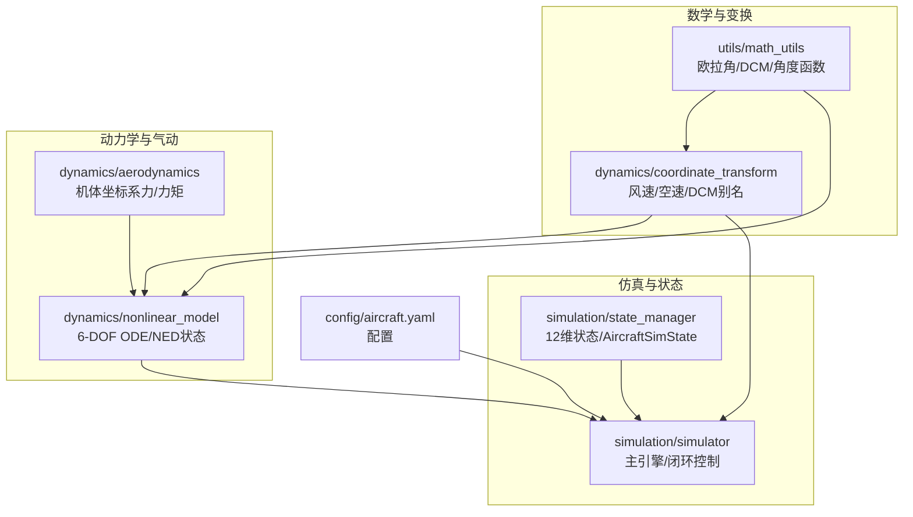
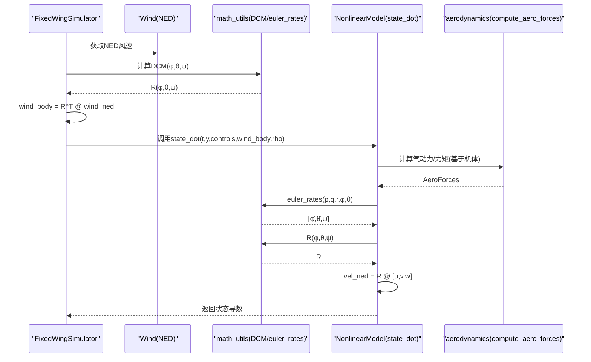
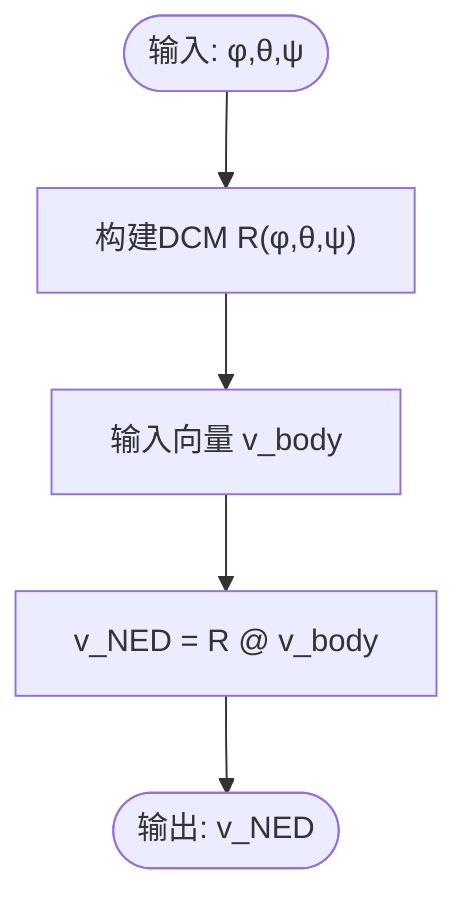
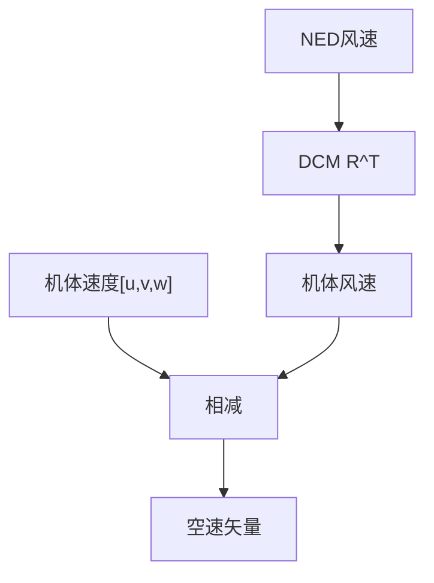
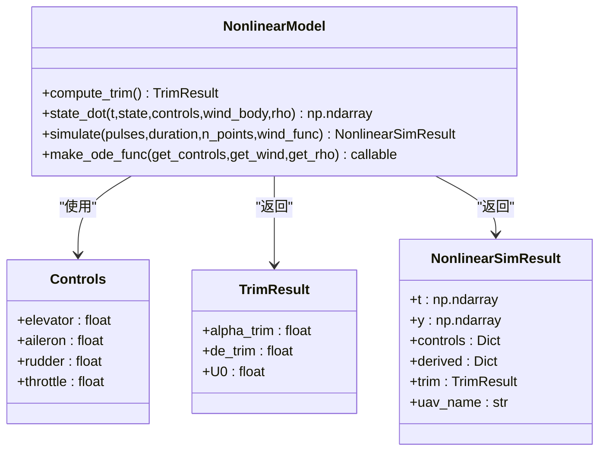
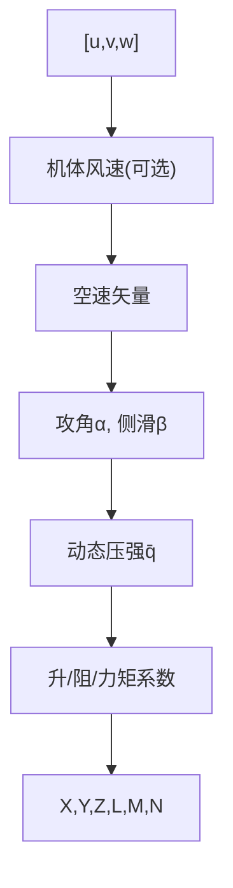
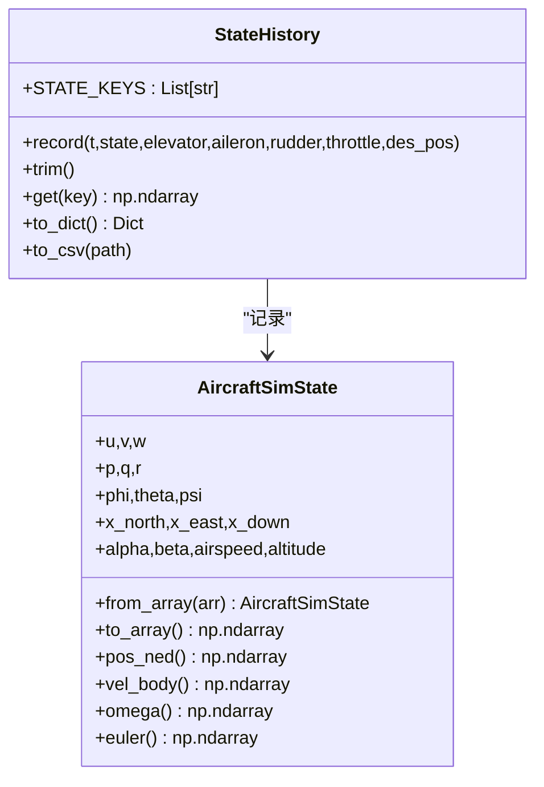
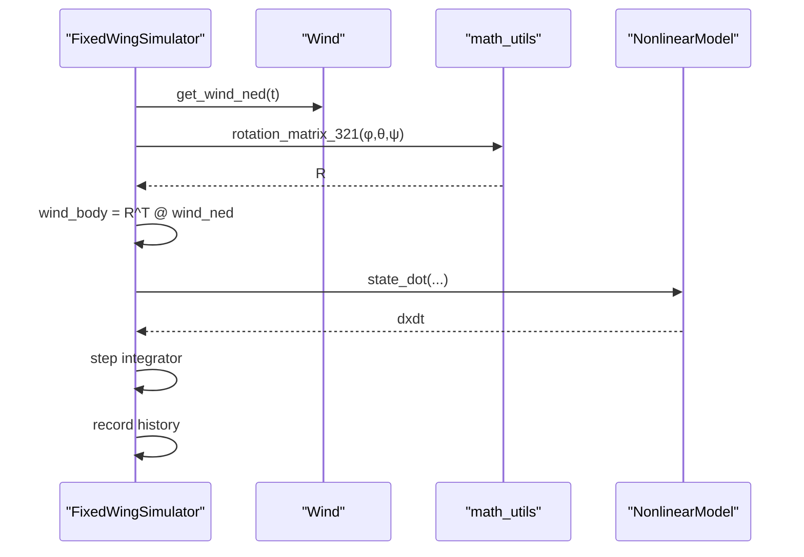
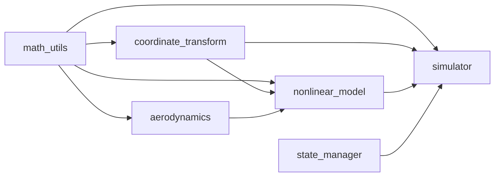

# 坐标系与变换

<cite>
**本文档引用的文件**
- [coordinate_transform.py](file://src/dynamics/coordinate_transform.py)
- [math_utils.py](file://src/utils/math_utils.py)
- [state_manager.py](file://src/simulation/state_manager.py)
- [nonlinear_model.py](file://src/dynamics/nonlinear_model.py)
- [aerodynamics.py](file://src/dynamics/aerodynamics.py)
- [simulator.py](file://src/simulation/simulator.py)
- [aircraft.yaml](file://config/aircraft.yaml)
- [test_dynamics.py](file://tests/test_dynamics.py)
</cite>

## 目录
1. [引言](#引言)
2. [项目结构](#项目结构)
3. [核心组件](#核心组件)
4. [架构总览](#架构总览)
5. [详细组件分析](#详细组件分析)
6. [依赖关系分析](#依赖关系分析)
7. [性能考虑](#性能考虑)
8. [故障排除指南](#故障排除指南)
9. [结论](#结论)

## 引言
本文件系统性阐述FixedWingSimulator中固定翼飞行器所用的坐标系与变换概念，覆盖以下主题：
- 坐标系定义与用途：地理坐标系（NED）、机体坐标系（body frame）、速度坐标系（velocity frame）、稳定性坐标系（stability frame）
- 坐标系间变换矩阵与变换规则：欧拉角旋转、方向余弦矩阵（DCM）
- 状态向量在不同坐标系下的表示：位置、速度、姿态、角速率
- 仿真中的应用：传感器数据处理、控制律计算、可视化显示
- 具体变换公式与代码实现示例路径

## 项目结构
FixedWingSimulator采用模块化设计，坐标系与变换主要集中在以下模块：
- utils/math_utils：通用数学工具，包含欧拉角到DCM、向量变换、角度/饱和函数等
- dynamics/coordinate_transform：坐标变换封装，提供风速与空速转换等接口
- dynamics/nonlinear_model：6-DOF非线性动力学，使用NED位置与3-2-1欧拉角
- dynamics/aerodynamics：气动计算，基于机体坐标系的力与力矩
- simulation/state_manager：仿真状态容器，统一管理12维状态（含NED位置）
- simulation/simulator：主仿真引擎，串联各模块并进行坐标变换

图表来源
- [math_utils.py](file://src/utils/math_utils.py#L43-L76)
- [coordinate_transform.py](file://src/dynamics/coordinate_transform.py#L29-L36)
- [nonlinear_model.py](file://src/dynamics/nonlinear_model.py#L160-L255)
- [aerodynamics.py](file://src/dynamics/aerodynamics.py#L35-L147)
- [state_manager.py](file://src/simulation/state_manager.py#L16-L93)
- [simulator.py](file://src/simulation/simulator.py#L33-L52)
- [aircraft.yaml](file://config/aircraft.yaml#L1-L13)

章节来源
- [math_utils.py](file://src/utils/math_utils.py#L1-L124)
- [coordinate_transform.py](file://src/dynamics/coordinate_transform.py#L1-L70)
- [nonlinear_model.py](file://src/dynamics/nonlinear_model.py#L1-L386)
- [aerodynamics.py](file://src/dynamics/aerodynamics.py#L1-L148)
- [state_manager.py](file://src/simulation/state_manager.py#L1-L193)
- [simulator.py](file://src/simulation/simulator.py#L1-L642)
- [aircraft.yaml](file://config/aircraft.yaml#L1-L13)

## 核心组件
- 欧拉角与方向余弦矩阵（DCM）：提供从机体坐标系到NED地理坐标系的旋转矩阵，以及反向变换
- 向量变换函数：支持任意三维向量在机体与NED之间的变换
- 欧拉角率映射：将机体角速率映射到欧拉角时间导数，注意奇异点保护
- 风速与空速转换：将NED风速转换至机体坐标系，计算真实空速矢量
- 6-DOF非线性模型：以NED位置与3-2-1欧拉角作为状态，结合气动与重力计算加速度与角加速度
- 状态容器：统一管理12维状态（u,v,w,p,q,r,φ,θ,ψ,x_N,x_E,x_D），并派生空速、攻角、侧滑角、高度等

章节来源
- [math_utils.py](file://src/utils/math_utils.py#L43-L100)
- [coordinate_transform.py](file://src/dynamics/coordinate_transform.py#L29-L69)
- [nonlinear_model.py](file://src/dynamics/nonlinear_model.py#L160-L255)
- [state_manager.py](file://src/simulation/state_manager.py#L16-L93)

## 架构总览
下图展示仿真主循环中坐标变换的关键节点：风速从NED变换到机体，空速由机体速度减去风速得到，位置由机体速度经DCM变换到NED，欧拉角率由机体角速率映射。

图表来源
- [simulator.py](file://src/simulation/simulator.py#L329-L337)
- [nonlinear_model.py](file://src/dynamics/nonlinear_model.py#L246-L248)
- [math_utils.py](file://src/utils/math_utils.py#L79-L100)

## 详细组件分析

### 数学与变换基础（utils/math_utils）
- 欧拉角到DCM（3-2-1顺序，NED约定）：提供R(φ,θ,ψ)，满足v_NED = R @ v_body
- 向量变换：body_to_ned与ned_to_body分别实现从机体到NED与反向变换
- 欧拉角率映射：euler_rates将(p,q,r)映射到[φ̇,θ̇,ψ̇]，在θ接近±90°时采用小ε数值保护避免奇异
- 角度与饱和函数：wrap_angle、deg2rad、saturate等辅助函数

图表来源
- [math_utils.py](file://src/utils/math_utils.py#L43-L76)

章节来源
- [math_utils.py](file://src/utils/math_utils.py#L43-L100)

### 坐标变换封装（dynamics/coordinate_transform）
- DCM别名：dcm_from_euler等价于rotation_matrix_321
- 风速到机体：wind_to_body_frame将NED风速转换到机体坐标系
- 空速矢量：airspeed_vector = [u,v,w] - [u_w,v_w,w_w]

图表来源
- [coordinate_transform.py](file://src/dynamics/coordinate_transform.py#L39-L69)

章节来源
- [coordinate_transform.py](file://src/dynamics/coordinate_transform.py#L29-L69)

### 6-DOF非线性模型（dynamics/nonlinear_model）
- 状态向量（12维，NED）：[u,v,w,p,q,r,φ,θ,ψ,x_N,x_E,x_D]
- 位置动力学：vel_ned = R @ [u,v,w]，其中R来自DCM
- 欧拉角动力学：通过euler_rates将(p,q,r)映射到[φ̇,θ̇,ψ̇]
- 控制输入：elevator、aileron、rudder、throttle
- 风模型：可选NED风速，转换为机体风速后参与空速计算

图表来源
- [nonlinear_model.py](file://src/dynamics/nonlinear_model.py#L37-L61)
- [nonlinear_model.py](file://src/dynamics/nonlinear_model.py#L104-L127)

章节来源
- [nonlinear_model.py](file://src/dynamics/nonlinear_model.py#L160-L255)

### 气动模型（dynamics/aerodynamics）
- 输入：机体速度(u,v,w)、角速率(p,q,r)、控制面偏转(de,da,dr)、参数字典、可选机体风速、密度ρ
- 输出：AeroForces（X,Y,Z,L,M,N及无量纲系数）
- 关键步骤：计算真实空速矢量（减去风），求攻角与侧滑角，计算动态压强，查表式升阻与力矩系数，最终转换为力与力矩

图表来源
- [aerodynamics.py](file://src/dynamics/aerodynamics.py#L35-L147)

章节来源
- [aerodynamics.py](file://src/dynamics/aerodynamics.py#L35-L147)

### 仿真状态容器（simulation/state_manager）
- AircraftSimState：12维状态（u,v,w,p,q,r,φ,θ,ψ,x_N,x_E,x_D），并派生alpha、beta、airspeed、altitude
- StateHistory：高效历史记录缓冲区，支持CSV导出

图表来源
- [state_manager.py](file://src/simulation/state_manager.py#L16-L93)
- [state_manager.py](file://src/simulation/state_manager.py#L95-L193)

章节来源
- [state_manager.py](file://src/simulation/state_manager.py#L16-L93)
- [state_manager.py](file://src/simulation/state_manager.py#L95-L193)

### 主仿真引擎（simulation/simulator）
- 连接各模块：模型、环境、控制、规划、仿真
- 在每步中：获取NED风速→DCM→wind_body→state_dot→积分→记录历史
- 支持闭环控制链路（导航→姿态→速率→舵面混合）

图表来源
- [simulator.py](file://src/simulation/simulator.py#L329-L337)

章节来源
- [simulator.py](file://src/simulation/simulator.py#L239-L567)

## 依赖关系分析
- math_utils被coordinate_transform与nonlinear_model直接依赖
- aerodynamics依赖math_utils中的角度与动态压强函数
- simulator依赖nonlinear_model、coordinate_transform、math_utils等
- state_manager为仿真结果提供统一存储格式

图表来源
- [math_utils.py](file://src/utils/math_utils.py#L10-L16)
- [coordinate_transform.py](file://src/dynamics/coordinate_transform.py#L10-L16)
- [nonlinear_model.py](file://src/dynamics/nonlinear_model.py#L27-L28)
- [aerodynamics.py](file://src/dynamics/aerodynamics.py#L12-L13)
- [simulator.py](file://src/simulation/simulator.py#L33-L52)

章节来源
- [math_utils.py](file://src/utils/math_utils.py#L1-L124)
- [coordinate_transform.py](file://src/dynamics/coordinate_transform.py#L1-L70)
- [nonlinear_model.py](file://src/dynamics/nonlinear_model.py#L1-L386)
- [aerodynamics.py](file://src/dynamics/aerodynamics.py#L1-L148)
- [simulator.py](file://src/simulation/simulator.py#L1-L642)

## 性能考虑
- DCM与向量变换均为纯numpy操作，复杂度O(1)；在仿真主循环中频繁调用，需确保批量化与避免重复计算
- euler_rates在θ接近±90°时采用小ε保护，避免数值不稳定
- wind_to_body_frame与airspeed_vector在每步仅做常数次矩阵/向量运算，开销较小
- 状态容器StateHistory使用预分配数组，减少内存分配开销

## 故障排除指南
- 验证向量变换正确性：测试用例验证了body→NED→body的往返一致性、零欧拉角时风速不变、无风时空速等于机体速度、零攻角时欧拉率等于机体角速率
- 奇异点问题：当θ接近±90°时，euler_rates内部采用小ε保护，若仍出现异常，检查输入角度范围
- 配置一致性：aircraft.yaml中选择的机型应与仿真初始化一致，避免参数不匹配导致的仿真异常

章节来源
- [test_dynamics.py](file://tests/test_dynamics.py#L86-L113)
- [math_utils.py](file://src/utils/math_utils.py#L79-L100)
- [aircraft.yaml](file://config/aircraft.yaml#L1-L13)

## 结论
FixedWingSimulator以NED地理坐标系与3-2-1欧拉角为核心，通过方向余弦矩阵实现机体与地理坐标系间的精确变换；在6-DOF非线性模型中，位置与姿态演化均基于此框架，配合气动模型与闭环控制链路，形成完整的固定翼飞行器仿真流程。坐标变换贯穿仿真全过程，是传感器数据处理、控制律计算与可视化显示的基础。