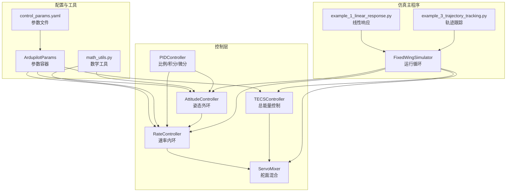
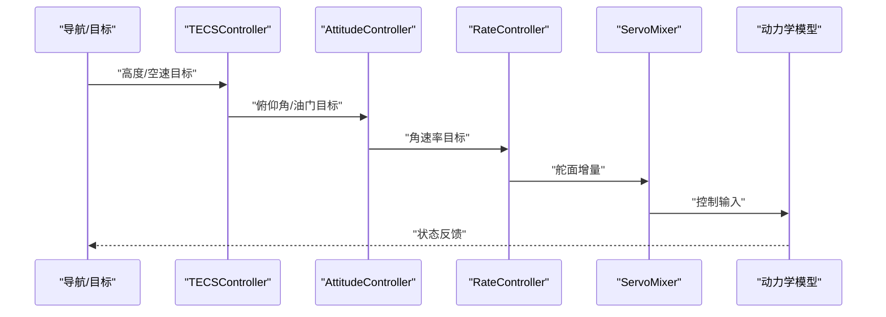
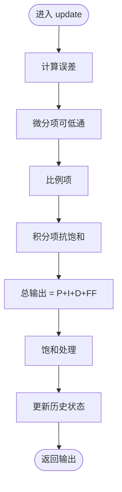
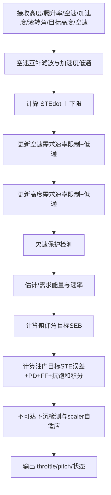
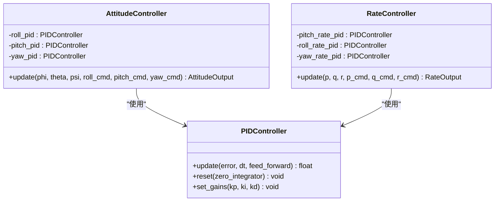
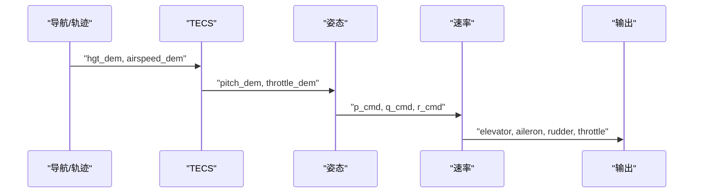
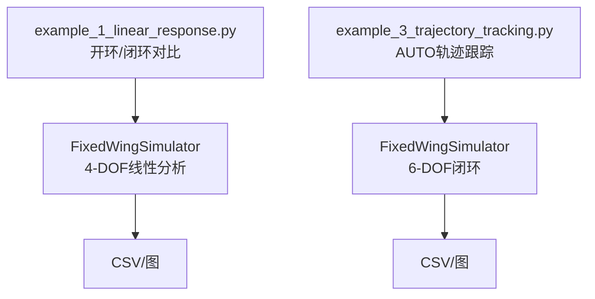
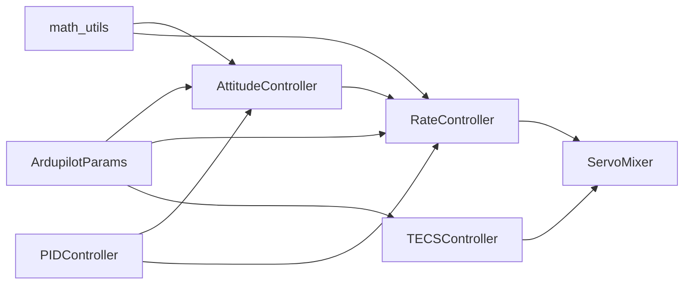

# 控制理论基础

<cite>
**本文引用的文件**
- [pid_controller.py](file://src/control/pid_controller.py)
- [tecs_controller.py](file://src/control/tecs_controller.py)
- [attitude_controller.py](file://src/control/attitude_controller.py)
- [rate_controller.py](file://src/control/rate_controller.py)
- [ardupilot_compat.py](file://src/control/ardupilot_compat.py)
- [control_params.yaml](file://config/control_params.yaml)
- [math_utils.py](file://src/utils/math_utils.py)
- [simulator.py](file://src/simulation/simulator.py)
- [example_1_linear_response.py](file://examples/example_1_linear_response.py)
- [example_3_trajectory_tracking.py](file://examples/example_3_trajectory_tracking.py)
- [test_control.py](file://tests/test_control.py)
- [main.py](file://main.py)
</cite>

## 目录
1. [引言](#引言)
2. [项目结构](#项目结构)
3. [核心组件](#核心组件)
4. [架构总览](#架构总览)
5. [详细组件分析](#详细组件分析)
6. [依赖关系分析](#依赖关系分析)
7. [性能考量](#性能考量)
8. [故障排查指南](#故障排查指南)
9. [结论](#结论)
10. [附录](#附录)

## 引言
本文件面向固定翼飞行器控制理论基础，结合FixedWingSimulator项目中的实际实现，系统讲解以下内容：
- PID控制器的工作原理与参数调节方法
- TECS总能量控制系统（高度与空速联合控制）
- 姿态控制与速率控制的区别与联系
- 控制目标的设定流程（参考信号、误差、控制输出）
- 从理论到代码实现的完整映射与应用实例

## 项目结构
FixedWingSimulator采用模块化设计，控制层位于src/control目录，包含PID、TECS、姿态与速率控制器等。配置参数来自config目录的YAML文件，仿真主程序位于src/simulation/simulator.py，examples提供典型场景演示。

图表来源
- [simulator.py](file://src/simulation/simulator.py#L115-L200)
- [pid_controller.py](file://src/control/pid_controller.py#L17-L117)
- [tecs_controller.py](file://src/control/tecs_controller.py#L50-L647)
- [attitude_controller.py](file://src/control/attitude_controller.py#L33-L134)
- [rate_controller.py](file://src/control/rate_controller.py#L32-L109)
- [ardupilot_compat.py](file://src/control/ardupilot_compat.py#L17-L130)
- [control_params.yaml](file://config/control_params.yaml#L1-L45)

章节来源
- [simulator.py](file://src/simulation/simulator.py#L115-L200)
- [main.py](file://main.py#L98-L145)

## 核心组件
- PIDController：通用离散PID控制器，支持抗饱和、微分低通、前馈与动态增益更新。
- TECSController：总能量控制，协调高度与空速，避免传统解耦PID的油门/积分饱和问题。
- AttitudeController：姿态外环（角度误差→角速率命令），ArduPilot风格。
- RateController：速率内环（角速率误差→舵面增量），稳定性增强（SAS）。
- ArdupilotParams：参数容器，支持从YAML加载、校验与导出。
- math_utils：角度包裹、饱和、旋转矩阵、攻角/侧滑角等工具函数。

章节来源
- [pid_controller.py](file://src/control/pid_controller.py#L17-L117)
- [tecs_controller.py](file://src/control/tecs_controller.py#L50-L647)
- [attitude_controller.py](file://src/control/attitude_controller.py#L33-L134)
- [rate_controller.py](file://src/control/rate_controller.py#L32-L109)
- [ardupilot_compat.py](file://src/control/ardupilot_compat.py#L17-L130)
- [math_utils.py](file://src/utils/math_utils.py#L13-L124)

## 架构总览
ArduPilot风格五层控制链路（外到内）：
1) 导航/目标生成（Waypoint/轨迹管理）
2) TECS（总能量控制：高度+空速）
3) 姿态控制器（角度误差→角速率命令）
4) 速率控制器（角速率误差→舵面增量）
5) 舵面混合器（物理限制与限幅）

图表来源
- [tecs_controller.py](file://src/control/tecs_controller.py#L247-L315)
- [attitude_controller.py](file://src/control/attitude_controller.py#L81-L122)
- [rate_controller.py](file://src/control/rate_controller.py#L68-L98)
- [simulator.py](file://src/simulation/simulator.py#L173-L200)

## 详细组件分析

### PID控制器工作原理与参数调节
- 结构组成：比例P、积分I、微分D三项，可选微分低通滤波，支持前馈项。
- 抗饱和策略：采用“夹钳式”抗饱和（clamping），仅在未饱和时积分，饱和时冻结积分增长。
- 更新流程：计算误差→微分项（可低通）→比例项→积分项（抗饱和）→总输出→饱和处理→更新历史。
- 参数调节要点：
  - P主导响应速度，过大易振荡；I消除稳态误差；D抑制超调，但对噪声敏感。
  - 微分低通频率越高，抗噪越差；应结合系统带宽与采样率选择。
  - 前馈项可补偿已知扰动或静态误差，提升跟踪精度。

图表来源
- [pid_controller.py](file://src/control/pid_controller.py#L55-L98)

章节来源
- [pid_controller.py](file://src/control/pid_controller.py#L17-L117)
- [test_control.py](file://tests/test_control.py#L61-L148)

### TECS总能量控制系统（高度与空速联合控制）
- 核心思想：以油门控制总比能量（SPE+SKE），以俯仰角控制比能量分配（SPE与SKE的权衡），天然耦合高度与速度。
- 主要特性：
  - 空速互补滤波估计TAS，结合加速度观测器去偏。
  - 速度与高度需求分别限幅与低通，避免过度响应。
  - 欠速保护：当空速过低且油门饱和时，强制提高空速目标。
  - 不可达下沉检测：当油门满且能量下降时，判定不可达下沉并保持安全策略。
  - 坡度补偿：转弯时增加油门前馈以抵消诱导阻力增加。
- 参数意义（节选）：
  - TECS_CLMB_MAX/TECS_SINK_MIN/TECS_SINK_MAX：爬升/下沉速率上限
  - TECS_TIME_CONST：控制时间常数，影响响应平滑度
  - TECS_THR_DAMP/TECS_PTCH_DAMP：油门/俯仰阻尼，抑制振荡
  - TECS_INTEG_GAIN：积分增益，抑制静差
  - TECS_SPDWEIGHT：速度权重（0~2），0纯高度控制，2纯速度控制
  - TECS_RLL2THR：坡度转油门补偿

图表来源
- [tecs_controller.py](file://src/control/tecs_controller.py#L247-L315)
- [tecs_controller.py](file://src/control/tecs_controller.py#L321-L431)
- [tecs_controller.py](file://src/control/tecs_controller.py#L445-L551)
- [tecs_controller.py](file://src/control/tecs_controller.py#L553-L647)

章节来源
- [tecs_controller.py](file://src/control/tecs_controller.py#L50-L647)
- [control_params.yaml](file://config/control_params.yaml#L30-L44)

### 姿态控制与速率控制：区别与联系
- 姿态控制（AttitudeController）：
  - 外环：角度误差→角速率命令（ArduPilot Plane风格，无D）
  - 三轴独立PID，输出限幅对应物理角速率极限
- 速率控制（RateController）：
  - 内环：角速率误差→舵面增量（SAS始终激活）
  - 三轴独立PID，支持前馈（如PTCH_RATE_FF等）
- 联系：姿态控制器输出作为速率控制器的目标，形成双环结构，提高鲁棒性与稳定性。

图表来源
- [attitude_controller.py](file://src/control/attitude_controller.py#L33-L134)
- [rate_controller.py](file://src/control/rate_controller.py#L32-L109)
- [pid_controller.py](file://src/control/pid_controller.py#L17-L117)

章节来源
- [attitude_controller.py](file://src/control/attitude_controller.py#L33-L134)
- [rate_controller.py](file://src/control/rate_controller.py#L32-L109)
- [test_control.py](file://tests/test_control.py#L197-L305)

### 控制目标设定：参考信号、误差与输出生成
- 参考信号来源：
  - 导航/轨迹管理生成高度与空速目标（示例：轨迹跟踪）
  - TECS将目标转换为俯仰角与油门目标
  - 姿态控制器将角度目标转换为角速率目标
  - 速率控制器将角速率目标转换为舵面增量
- 误差定义与计算：
  - 角度误差经wrap_angle包裹到[-π, π]
  - 角速率误差为目标减测量
- 输出生成：
  - PID输出经饱和处理与抗饱和逻辑
  - TECS油门与俯仰均进行限幅与自适应缩放
  - 舵面增量经混合器限幅与物理约束

图表来源
- [example_3_trajectory_tracking.py](file://examples/example_3_trajectory_tracking.py#L72-L98)
- [tecs_controller.py](file://src/control/tecs_controller.py#L247-L315)
- [attitude_controller.py](file://src/control/attitude_controller.py#L81-L122)
- [rate_controller.py](file://src/control/rate_controller.py#L68-L98)

章节来源
- [example_3_trajectory_tracking.py](file://examples/example_3_trajectory_tracking.py#L72-L98)
- [math_utils.py](file://src/utils/math_utils.py#L13-L25)

### 控制理论在固定翼飞行器中的应用实例
- 线性响应对比（开环vs闭环）：展示短周期与阻尼模态，以及PID闭环抑制振荡的效果。
- 轨迹跟踪（AUTO模式）：最小Snap轨迹跟踪，验证五层控制链路在复杂三维路径上的稳定性与精度。

图表来源
- [example_1_linear_response.py](file://examples/example_1_linear_response.py#L83-L206)
- [example_3_trajectory_tracking.py](file://examples/example_3_trajectory_tracking.py#L67-L194)
- [simulator.py](file://src/simulation/simulator.py#L115-L200)

章节来源
- [example_1_linear_response.py](file://examples/example_1_linear_response.py#L83-L206)
- [example_3_trajectory_tracking.py](file://examples/example_3_trajectory_tracking.py#L67-L194)

## 依赖关系分析
- 控制层依赖关系清晰：PID被姿态与速率控制器复用；TECS独立于姿态/速率，但共同驱动混合器。
- 参数容器ArdupilotParams贯穿各控制器，支持从YAML热加载与校验。
- 数学工具提供角度包裹、饱和、坐标变换等基础能力。

图表来源
- [ardupilot_compat.py](file://src/control/ardupilot_compat.py#L17-L130)
- [attitude_controller.py](file://src/control/attitude_controller.py#L50-L77)
- [rate_controller.py](file://src/control/rate_controller.py#L46-L64)
- [tecs_controller.py](file://src/control/tecs_controller.py#L80-L127)
- [math_utils.py](file://src/utils/math_utils.py#L13-L36)

章节来源
- [ardupilot_compat.py](file://src/control/ardupilot_compat.py#L17-L130)
- [math_utils.py](file://src/utils/math_utils.py#L13-L124)

## 性能考量
- 采样与滤波：PID微分低通与TECS速率限制共同抑制高频噪声与积分饱和。
- 参数匹配：TECS_TIME_CONST与TECS_THR_DAMP/TECS_PTCH_DAMP需与飞机气动与动力学匹配，避免过调或欠调。
- 限幅与抗饱和：TECS油门积分抗饱和与姿态/速率输出限幅保证系统稳定。
- 转弯补偿：TECS_RLL2THR补偿坡度引起的额外阻力，提升燃油经济性与稳定性。

## 故障排查指南
- PID饱和与积分风车：检查输出饱和标志与积分更新条件，确认抗饱和逻辑生效。
- 角度误差过大：确认wrap_angle是否正确，避免跨±π产生大误差。
- TECS欠速/不可达下沉：关注underspeed与bad_descent标志，适当提高空速目标或降低爬升率。
- 舵面饱和：速率控制器输出限幅与混合器物理限制需协同考虑。

章节来源
- [pid_controller.py](file://src/control/pid_controller.py#L84-L98)
- [attitude_controller.py](file://src/control/attitude_controller.py#L107-L122)
- [tecs_controller.py](file://src/control/tecs_controller.py#L432-L441)
- [tecs_controller.py](file://src/control/tecs_controller.py#L635-L647)
- [rate_controller.py](file://src/control/rate_controller.py#L87-L98)

## 结论
FixedWingSimulator以ArduPilot风格实现了完整的五层控制链路，将经典控制理论（PID、双环结构）与现代参数化配置（ArdupilotParams/YAML）相结合。TECS通过总能量视角自然耦合高度与空速，显著提升了控制品质与鲁棒性；姿态与速率控制器则提供了稳定的内环反馈回路。配合严格的限幅与抗饱和策略，系统在复杂飞行场景中具备良好的稳定性与可调性。

## 附录
- 参数文件位置与用途：config/control_params.yaml提供TECS与各轴PID参数，支持从YAML加载与导出。
- 示例脚本：examples目录包含线性响应与轨迹跟踪两类典型应用，便于对照学习与验证。

章节来源
- [control_params.yaml](file://config/control_params.yaml#L1-L45)
- [ardupilot_compat.py](file://src/control/ardupilot_compat.py#L82-L98)