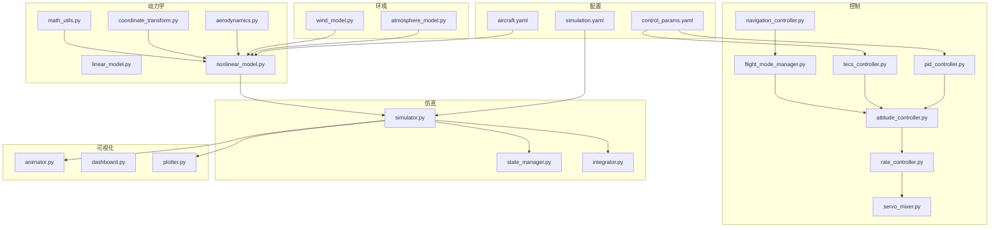
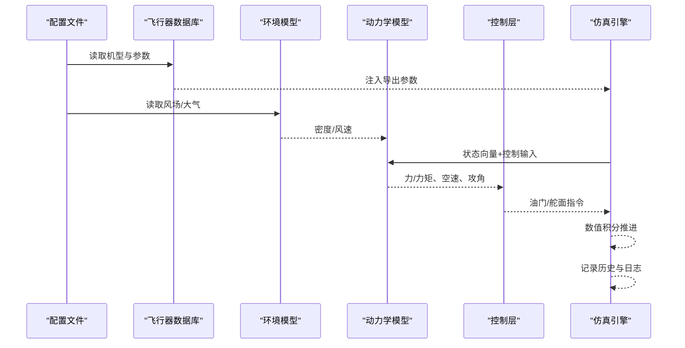
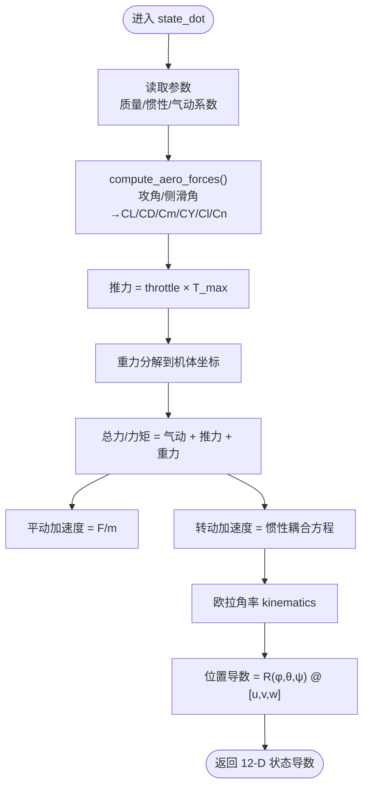
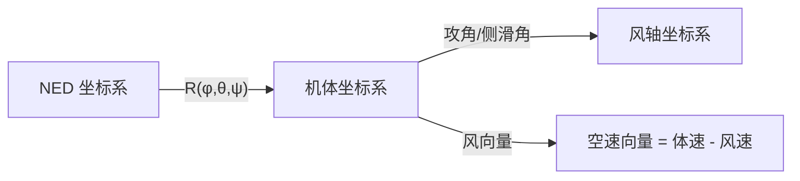
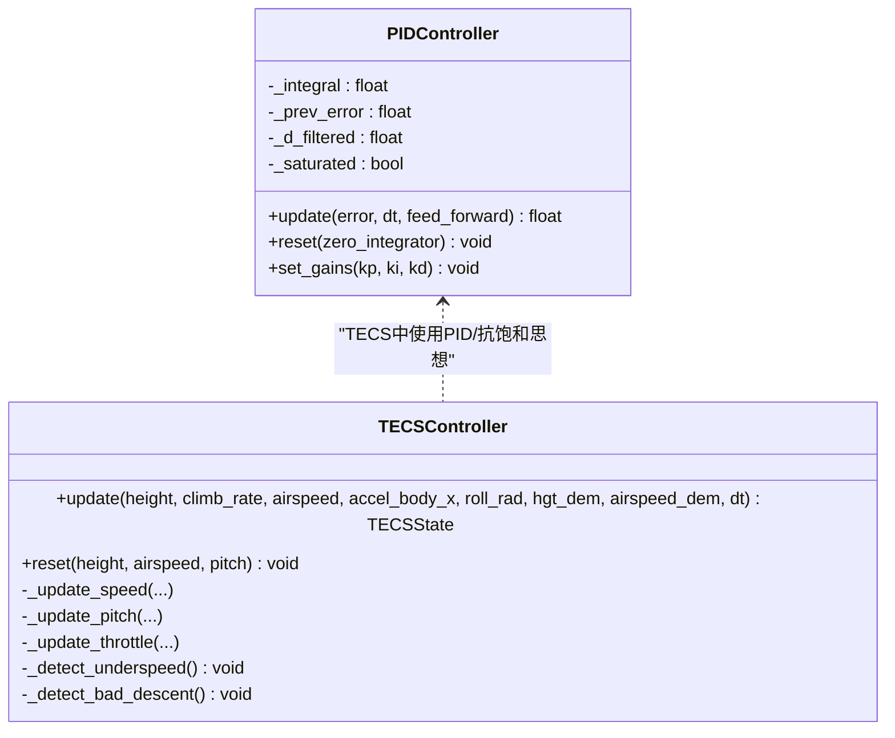
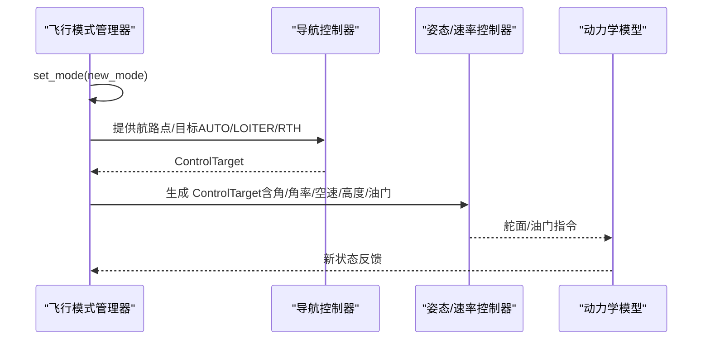
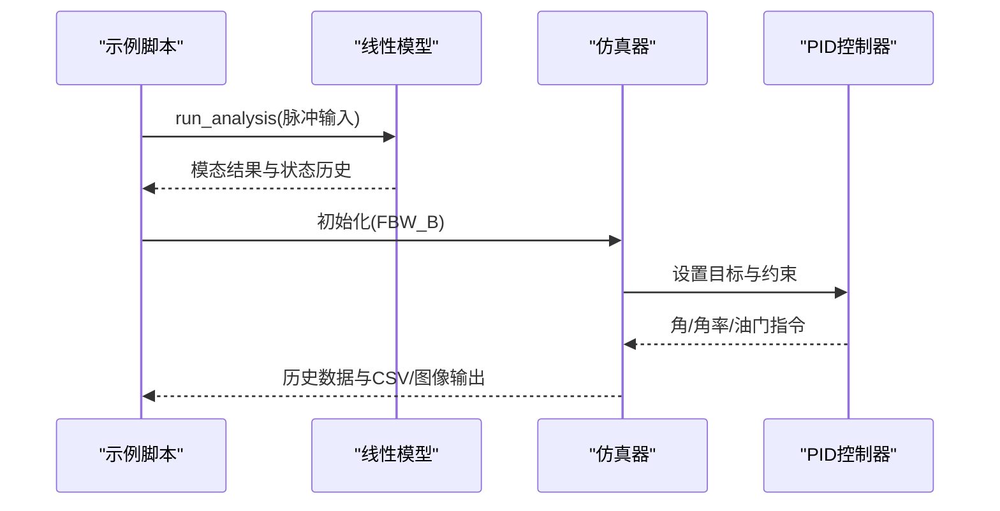
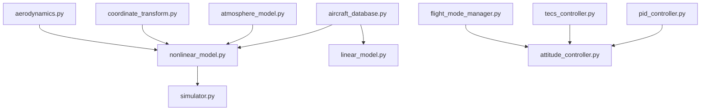

# 核心概念

<cite>
**本文引用的文件**
- [aircraft_database.py](file://src/models/aircraft_database.py)
- [aerodynamics.py](file://src/dynamics/aerodynamics.py)
- [coordinate_transform.py](file://src/dynamics/coordinate_transform.py)
- [nonlinear_model.py](file://src/dynamics/nonlinear_model.py)
- [linear_model.py](file://src/dynamics/linear_model.py)
- [pid_controller.py](file://src/control/pid_controller.py)
- [tecs_controller.py](file://src/control/tecs_controller.py)
- [flight_mode_manager.py](file://src/control/flight_mode_manager.py)
- [math_utils.py](file://src/utils/math_utils.py)
- [atmosphere_model.py](file://src/environment/atmosphere_model.py)
- [simulation.yaml](file://config/simulation.yaml)
- [control_params.yaml](file://config/control_params.yaml)
- [aircraft.yaml](file://config/aircraft.yaml)
- [example_1_linear_response.py](file://examples/example_1_linear_response.py)
</cite>

## 目录
1. [引言](#引言)
2. [项目结构](#项目结构)
3. [核心组件](#核心组件)
4. [架构总览](#架构总览)
5. [详细组件分析](#详细组件分析)
6. [依赖分析](#依赖分析)
7. [性能考虑](#性能考虑)
8. [故障排查指南](#故障排查指南)
9. [结论](#结论)
10. [附录](#附录)

## 引言
本文件面向初学者与工程实践者，系统梳理固定翼无人机仿真的核心概念与实现要点。内容覆盖飞行动力学基础（升力、阻力、推力、重力）、坐标系体系（地理/机体/速度坐标系及其转换）、飞行控制理论（PID、TECS总能量控制）、飞行模式与切换机制，以及仿真关键参数（质量、惯性矩、气动系数等）。文中通过图示与路径引用将理论与代码实现紧密结合，帮助读者建立从物理直觉到程序实现的完整知识链路。

## 项目结构
项目采用模块化组织，围绕“环境建模—动力学—控制—仿真—可视化”主线展开，核心目录与职责如下：
- config：配置文件（飞行器参数、控制参数、仿真参数、轨迹规划）
- src/dynamics：飞行动力学与动力学模型（非线性6-DOF、线性4-DOF、气动与坐标变换）
- src/control：控制层（PID、TECS、姿态/速率控制、飞行模式管理、导航控制器）
- src/environment：大气模型与风模型
- src/utils：数学工具（旋转矩阵、角度运算、动态压力等）
- src/simulation：仿真引擎与状态管理
- src/planning：轨迹规划（最小 Jerk/Snap 等）
- src/visualization：动画、仪表盘与绘图
- examples：端到端示例脚本
- output：仿真结果数据与图表

**图表来源**
- [simulation.yaml](file://config/simulation.yaml#L1-L30)
- [control_params.yaml](file://config/control_params.yaml#L1-L45)
- [aircraft.yaml](file://config/aircraft.yaml#L1-L13)
- [nonlinear_model.py](file://src/dynamics/nonlinear_model.py#L1-L386)
- [linear_model.py](file://src/dynamics/linear_model.py#L1-L319)
- [aerodynamics.py](file://src/dynamics/aerodynamics.py#L1-L148)
- [coordinate_transform.py](file://src/dynamics/coordinate_transform.py#L1-L70)
- [math_utils.py](file://src/utils/math_utils.py#L1-L124)
- [pid_controller.py](file://src/control/pid_controller.py#L1-L117)
- [tecs_controller.py](file://src/control/tecs_controller.py#L1-L647)
- [flight_mode_manager.py](file://src/control/flight_mode_manager.py#L1-L298)

**章节来源**
- [simulation.yaml](file://config/simulation.yaml#L1-L30)
- [control_params.yaml](file://config/control_params.yaml#L1-L45)
- [aircraft.yaml](file://config/aircraft.yaml#L1-L13)

## 核心组件
- 飞行器数据库与参数注入：提供多型无人机的几何、气动与惯性参数，并注入导出参数（真速、密度、动态压强）供动力学模块使用。
- 非线性6-DOF模型：包含气动力/力矩计算、简单推进模型、重力项与欧拉角运动学，支持数值积分求解。
- 线性4-DOF纵向模型：在trim点线性化，便于模态分析与控制器设计。
- 气动模型：基于风轴角定义升阻与力矩系数，考虑攻角、侧滑角、非维角速率与操纵面偏角。
- 坐标变换：NED与机体坐标系转换、欧拉角率、风速与空速向量换算。
- 控制层：PID控制器（含抗积分饱和）、TECS总能量控制、飞行模式管理（MANUAL、STABILIZE、FBW_A/B、AUTO、LOITER、RTH）。
- 环境模型：标准大气（ISA）密度/压强/温度/声速计算，风模型（静稳、正弦、随机正弦等）。
- 仿真引擎：可选rk45/dopri5积分器，支持批量与实时循环两种模式。

**章节来源**
- [aircraft_database.py](file://src/models/aircraft_database.py#L143-L166)
- [nonlinear_model.py](file://src/dynamics/nonlinear_model.py#L104-L255)
- [linear_model.py](file://src/dynamics/linear_model.py#L107-L200)
- [aerodynamics.py](file://src/dynamics/aerodynamics.py#L35-L147)
- [coordinate_transform.py](file://src/dynamics/coordinate_transform.py#L29-L69)
- [pid_controller.py](file://src/control/pid_controller.py#L17-L116)
- [tecs_controller.py](file://src/control/tecs_controller.py#L50-L315)
- [flight_mode_manager.py](file://src/control/flight_mode_manager.py#L115-L297)
- [atmosphere_model.py](file://src/environment/atmosphere_model.py#L24-L76)

## 架构总览
下图展示了从输入到输出的端到端流程：配置加载→参数注入→环境建模→动力学求解→控制决策→执行与记录。

**图表来源**
- [aircraft_database.py](file://src/models/aircraft_database.py#L143-L166)
- [atmosphere_model.py](file://src/environment/atmosphere_model.py#L61-L76)
- [nonlinear_model.py](file://src/dynamics/nonlinear_model.py#L160-L281)
- [flight_mode_manager.py](file://src/control/flight_mode_manager.py#L173-L211)

## 详细组件分析

### 飞行动力学基础与数学模型
- 升力与阻力：气动模型以风轴为基准，通过攻角与侧滑角计算升/阻系数，再由动态压强与参考面积得到力。升力垂直于相对气流，阻力与相对气流反向。
- 推力与重力：推进采用简单比例模型，重力按NED坐标系分解到机体坐标。
- 动力学方程：平动由牛顿第二定律，转动由欧拉方程（考虑惯性耦合），欧拉角率由角速度与欧拉角关系给出。
- 线性化模型：在trim点对纵向状态进行线性化，得到A、B阵，便于模态分析与控制器设计。

**图表来源**
- [nonlinear_model.py](file://src/dynamics/nonlinear_model.py#L160-L255)
- [aerodynamics.py](file://src/dynamics/aerodynamics.py#L35-L147)
- [math_utils.py](file://src/utils/math_utils.py#L43-L100)

**章节来源**
- [nonlinear_model.py](file://src/dynamics/nonlinear_model.py#L104-L255)
- [aerodynamics.py](file://src/dynamics/aerodynamics.py#L35-L147)
- [linear_model.py](file://src/dynamics/linear_model.py#L107-L200)

### 坐标系系统与转换
- 地理坐标系（NED）：北/东/下右手系，姿态角为3-2-1欧拉角（roll-pitch-yaw）。
- 机体坐标系（body）：x向前、y向右、z向下，与NED通过方向余弦矩阵（DCM）转换。
- 速度坐标系（风轴）：以相对气流为基准，攻角与侧滑角用于气动系数计算。
- 关键函数：DCM构造、NED↔body变换、欧拉角率、风速与空速向量换算。

**图表来源**
- [coordinate_transform.py](file://src/dynamics/coordinate_transform.py#L29-L69)
- [math_utils.py](file://src/utils/math_utils.py#L43-L100)

**章节来源**
- [coordinate_transform.py](file://src/dynamics/coordinate_transform.py#L29-L69)
- [math_utils.py](file://src/utils/math_utils.py#L43-L100)

### 飞行控制理论：PID与TECS
- PID控制器：P/I/D三段式，带抗积分饱和（限幅积分累积），可选微分低通滤波，支持运行时调参与复位。
- TECS总能量控制：以油门控制总比能量（SPE+SKE），以俯仰角控制比能量分配比（SEB），耦合高度与速度控制，避免传统解耦PID的油门/积分饱和问题；包含欠速保护、不可达下沉检测与坡度油门补偿。

**图表来源**
- [pid_controller.py](file://src/control/pid_controller.py#L17-L116)
- [tecs_controller.py](file://src/control/tecs_controller.py#L50-L315)

**章节来源**
- [pid_controller.py](file://src/control/pid_controller.py#L17-L116)
- [tecs_controller.py](file://src/control/tecs_controller.py#L50-L315)

### 飞行模式与切换机制
- 支持模式：MANUAL、STABILIZE、FBW_A、FBW_B、AUTO、LOITER、RTH。
- 模式管理器负责当前/历史模式跟踪、目标生成（ControlTarget）、平滑过渡与直接通道（MANUAL）。
- 不同模式下，目标由导航控制器或手动输入生成，经姿态/速率控制层转化为舵面与油门指令。

**图表来源**
- [flight_mode_manager.py](file://src/control/flight_mode_manager.py#L115-L297)

**章节来源**
- [flight_mode_manager.py](file://src/control/flight_mode_manager.py#L115-L297)

### 仿真关键参数与物理意义
- 几何与惯性：质量m、机翼面积S、平均气动弦长c、翼展b、惯性矩Ixxyyzz/xz，决定升阻特性与转动惯量。
- 气动系数：CL_0/α/q/de、CD_0/α/q/de、Cm_0/α/q/de，CYb/p/r/da/dr，Clb/p/r/da/dr，Cnb/p/r/da/dr，描述攻角与操纵面对力/力矩的影响。
- 真速与密度：U0 = Mach × 声速；ρ按ISA模型随高度变化；动态压强q_bar = 0.5ρV²。
- 控制参数：PID增益、TECS时间常数/阻尼/积分增益、速度权重、坡度补偿、油门/俯仰限幅等。

**章节来源**
- [aircraft_database.py](file://src/models/aircraft_database.py#L29-L133)
- [aircraft_database.py](file://src/models/aircraft_database.py#L143-L166)
- [atmosphere_model.py](file://src/environment/atmosphere_model.py#L24-L76)
- [aerodynamics.py](file://src/dynamics/aerodynamics.py#L63-L127)
- [control_params.yaml](file://config/control_params.yaml#L1-L45)

### 示例：线性模型与闭环对比
示例脚本演示了线性4-DOF模型的模态分析与FBW_B模式下的闭环响应对比，验证控制器在阶跃高度指令下的稳定性与收敛性。

**图表来源**
- [linear_model.py](file://src/dynamics/linear_model.py#L312-L318)
- [example_1_linear_response.py](file://examples/example_1_linear_response.py#L83-L205)

**章节来源**
- [example_1_linear_response.py](file://examples/example_1_linear_response.py#L83-L205)
- [linear_model.py](file://src/dynamics/linear_model.py#L107-L200)

## 依赖分析
- 数据依赖：飞行器参数来自数据库，经参数注入后传递给动力学与气动模块。
- 计算依赖：非线性模型依赖气动与坐标变换；线性模型依赖气动系数与几何参数；控制层依赖状态反馈与目标生成。
- 外部接口：仿真引擎封装数值积分器，环境模型提供密度/风速；可视化模块读取历史数据。

**图表来源**
- [aircraft_database.py](file://src/models/aircraft_database.py#L143-L166)
- [nonlinear_model.py](file://src/dynamics/nonlinear_model.py#L104-L127)
- [linear_model.py](file://src/dynamics/linear_model.py#L114-L123)
- [atmosphere_model.py](file://src/environment/atmosphere_model.py#L61-L76)
- [aerodynamics.py](file://src/dynamics/aerodynamics.py#L35-L60)
- [coordinate_transform.py](file://src/dynamics/coordinate_transform.py#L29-L36)
- [pid_controller.py](file://src/control/pid_controller.py#L17-L30)
- [tecs_controller.py](file://src/control/tecs_controller.py#L50-L80)
- [flight_mode_manager.py](file://src/control/flight_mode_manager.py#L115-L132)
- [nonlinear_model.py](file://src/dynamics/nonlinear_model.py#L261-L281)

**章节来源**
- [aircraft_database.py](file://src/models/aircraft_database.py#L143-L166)
- [nonlinear_model.py](file://src/dynamics/nonlinear_model.py#L104-L127)
- [linear_model.py](file://src/dynamics/linear_model.py#L114-L123)

## 性能考虑
- 数值积分：仿真步长与容差影响精度与效率；dopri5适合实时循环，rk45适合批处理分析。
- 控制器滤波：PID微分低通与TECS滤波器有助于抑制高频噪声与改善稳定性。
- 模态分析：线性模型用于快速评估稳定性与设计控制器，非线性模型用于验证闭环性能。
- 风场建模：风速/方向随时间变化会显著影响闭环响应，应结合真实气象条件进行评估。

[本节为通用指导，无需特定文件引用]

## 故障排查指南
- 油门饱和与积分饱和：检查TECS积分抗饱和逻辑与限幅设置；确认速度权重与坡度补偿参数。
- 欠速/不可达下沉：关注TECS欠速保护与不可达下沉检测标志，必要时提升油门前馈或调整速度权重。
- 模态不稳定：通过线性模型模态分析识别主导模式，调整PID增益或引入阻尼。
- 坐标系错误：核对DCM构造与角度范围，确保NED↔body转换正确。
- 参数不匹配：确认aircraft_database中的导出参数（U0、rho、q_bar）与仿真配置一致。

**章节来源**
- [tecs_controller.py](file://src/control/tecs_controller.py#L432-L444)
- [tecs_controller.py](file://src/control/tecs_controller.py#L635-L646)
- [pid_controller.py](file://src/control/pid_controller.py#L84-L98)
- [math_utils.py](file://src/utils/math_utils.py#L13-L25)
- [aircraft_database.py](file://src/models/aircraft_database.py#L159-L166)

## 结论
本项目以清晰的模块划分实现了从标准大气与风场建模到非线性/线性飞行动力学，再到PID与TECS控制与飞行模式管理的完整仿真链路。通过参数化数据库与配置文件，用户可以便捷地切换机型、调节控制参数并开展性能评估。建议在实际应用中结合线性模态分析与非线性闭环仿真，逐步完善控制器设计与参数整定。

[本节为总结性内容，无需特定文件引用]

## 附录
- 配置文件要点
  - 仿真配置：时间步长、总时长、积分器、初始条件、初始模式、风类型与强度、日志开关与目录。
  - 控制参数：PID增益、TECS参数（时间常数、阻尼、积分增益、速度权重、坡度补偿、油门/俯仰限幅、巡航油门等）。
  - 飞行器选择：支持TB2、Anka、Aksungur、Karayel、Predator、Heron MK1/2等机型。
- 示例脚本：提供线性模态分析与闭环对比的完整流程，便于快速上手与结果复现。

**章节来源**
- [simulation.yaml](file://config/simulation.yaml#L1-L30)
- [control_params.yaml](file://config/control_params.yaml#L1-L45)
- [aircraft.yaml](file://config/aircraft.yaml#L1-L13)
- [example_1_linear_response.py](file://examples/example_1_linear_response.py#L83-L205)