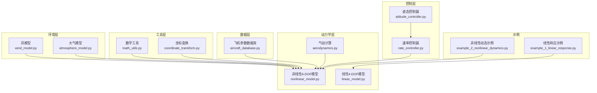
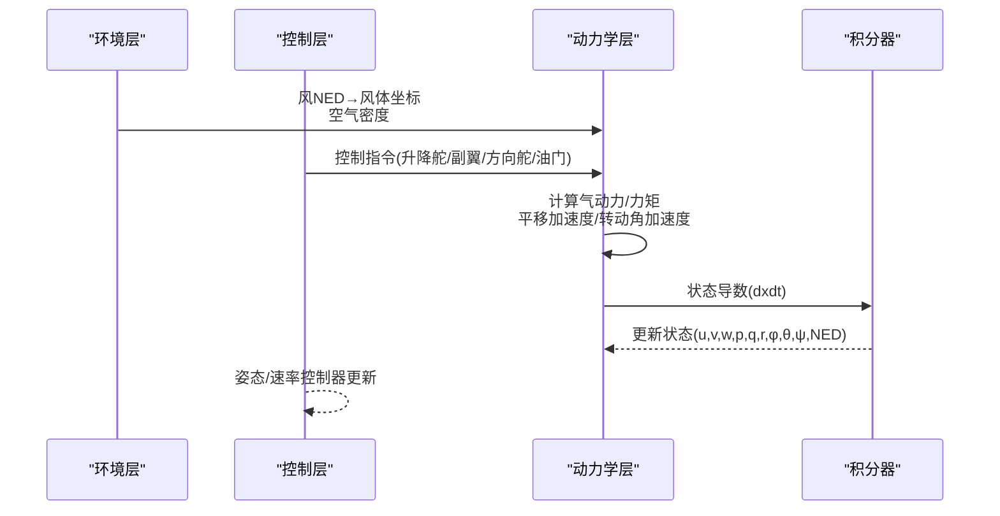
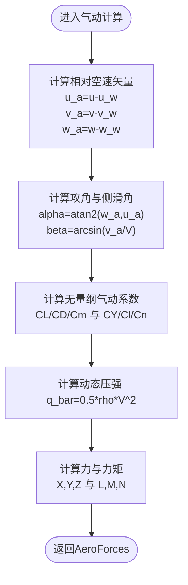
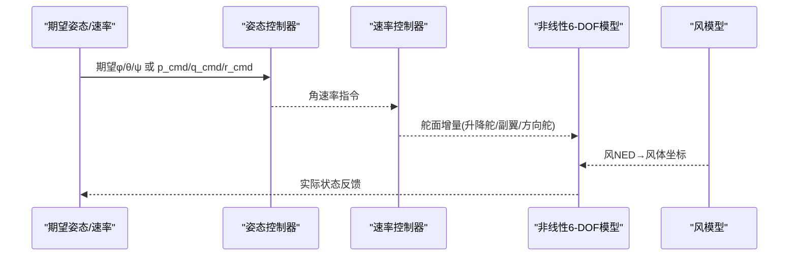
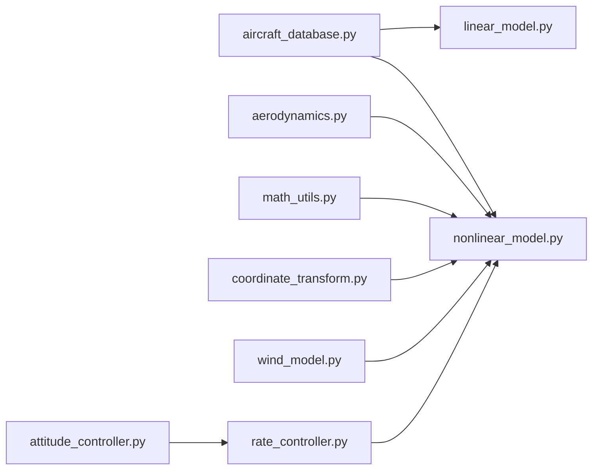

# 飞行动力学基础

<cite>
**本文引用的文件**   
- [aerodynamics.py](file://src/dynamics/aerodynamics.py)
- [linear_model.py](file://src/dynamics/linear_model.py)
- [nonlinear_model.py](file://src/dynamics/nonlinear_model.py)
- [math_utils.py](file://src/utils/math_utils.py)
- [coordinate_transform.py](file://src/dynamics/coordinate_transform.py)
- [aircraft_database.py](file://src/models/aircraft_database.py)
- [wind_model.py](file://src/environment/wind_model.py)
- [aerodynamic_forces.py](file://src/environment/aerodynamic_forces.py)
- [attitude_controller.py](file://src/control/attitude_controller.py)
- [rate_controller.py](file://src/control/rate_controller.py)
- [example_1_linear_response.py](file://examples/example_1_linear_response.py)
- [example_2_nonlinear_dynamics.py](file://examples/example_2_nonlinear_dynamics.py)
</cite>

## 目录
1. [引言](#引言)
2. [项目结构](#项目结构)
3. [核心组件](#核心组件)
4. [架构总览](#架构总览)
5. [详细组件分析](#详细组件分析)
6. [依赖关系分析](#依赖关系分析)
7. [性能考量](#性能考量)
8. [故障排查指南](#故障排查指南)
9. [结论](#结论)
10. [附录](#附录)

## 引言
本文件面向FixedWingSimulator项目，系统化梳理固定翼飞机的飞行动力学基础，围绕四大基本力（升力、阻力、推力、重力）的产生机制与数学模型展开；阐述纵向与横向运动的基本原理，明确迎角、侧滑角、俯仰角、滚转角、偏航角等关键角度的定义与物理意义；解释气动系数（升力系数、阻力系数、俯仰力矩系数等）的含义与作用机制；对比线性与非线性动力学模型的差异及其适用场景；最后通过代码实现路径展示理论与实践的映射关系。

## 项目结构
项目采用模块化分层设计，核心模块包括：
- 动力学层：线性与非线性模型，负责状态空间建模与常微分方程求解
- 环境层：风场与大气密度模型，提供风速与空气密度输入
- 控制层：基于ArduPilot参数体系的姿态与速率控制器
- 工具层：数学工具函数（旋转矩阵、欧拉角率、攻角与侧滑角计算）
- 数据层：飞机参数数据库与示例脚本

**图示来源**
- [nonlinear_model.py](file://src/dynamics/nonlinear_model.py#L104-L386)
- [linear_model.py](file://src/dynamics/linear_model.py#L107-L319)
- [aerodynamics.py](file://src/dynamics/aerodynamics.py#L35-L148)
- [math_utils.py](file://src/utils/math_utils.py#L43-L124)
- [coordinate_transform.py](file://src/dynamics/coordinate_transform.py#L29-L70)
- [wind_model.py](file://src/environment/wind_model.py#L18-L113)
- [aircraft_database.py](file://src/models/aircraft_database.py#L143-L166)
- [attitude_controller.py](file://src/control/attitude_controller.py#L33-L134)
- [rate_controller.py](file://src/control/rate_controller.py#L32-L109)
- [example_1_linear_response.py](file://examples/example_1_linear_response.py#L84-L206)
- [example_2_nonlinear_dynamics.py](file://examples/example_2_nonlinear_dynamics.py#L77-L215)

**章节来源**
- [nonlinear_model.py](file://src/dynamics/nonlinear_model.py#L104-L386)
- [linear_model.py](file://src/dynamics/linear_model.py#L107-L319)
- [aerodynamics.py](file://src/dynamics/aerodynamics.py#L35-L148)
- [math_utils.py](file://src/utils/math_utils.py#L43-L124)
- [coordinate_transform.py](file://src/dynamics/coordinate_transform.py#L29-L70)
- [wind_model.py](file://src/environment/wind_model.py#L18-L113)
- [aircraft_database.py](file://src/models/aircraft_database.py#L143-L166)
- [attitude_controller.py](file://src/control/attitude_controller.py#L33-L134)
- [rate_controller.py](file://src/control/rate_controller.py#L32-L109)
- [example_1_linear_response.py](file://examples/example_1_linear_response.py#L84-L206)
- [example_2_nonlinear_dynamics.py](file://examples/example_2_nonlinear_dynamics.py#L77-L215)

## 核心组件
- 气动计算模块：在机体坐标系下计算升阻与侧向力、滚转/俯仰/方向力矩，输出无量纲气动系数与对应力/力矩
- 线性模型：纵向四自由度状态空间模型，用于模态分析与开环脉冲响应
- 非线性模型：完整六自由度非线性方程，包含平移与转动动力学、欧拉角速率关系、NED位置更新
- 数学工具：攻角与侧滑角计算、动态压强、3-2-1欧拉角旋转矩阵与欧拉角率
- 坐标变换：NED与机体坐标系转换、风速矢量转换
- 风模型：支持静止、定常、正弦叠加、随机正弦风场
- 控制器：姿态外环（角误差到角速率命令）、速率内环（角速率误差到舵面增量）

**章节来源**
- [aerodynamics.py](file://src/dynamics/aerodynamics.py#L19-L148)
- [linear_model.py](file://src/dynamics/linear_model.py#L107-L319)
- [nonlinear_model.py](file://src/dynamics/nonlinear_model.py#L104-L386)
- [math_utils.py](file://src/utils/math_utils.py#L107-L124)
- [coordinate_transform.py](file://src/dynamics/coordinate_transform.py#L29-L70)
- [wind_model.py](file://src/environment/wind_model.py#L18-L113)
- [attitude_controller.py](file://src/control/attitude_controller.py#L33-L134)
- [rate_controller.py](file://src/control/rate_controller.py#L32-L109)

## 架构总览
下图展示了从环境输入到控制输出再到动力学积分的闭环流程，体现飞行动力学与控制的耦合关系。

**图示来源**
- [nonlinear_model.py](file://src/dynamics/nonlinear_model.py#L160-L281)
- [wind_model.py](file://src/environment/wind_model.py#L76-L108)
- [attitude_controller.py](file://src/control/attitude_controller.py#L81-L122)
- [rate_controller.py](file://src/control/rate_controller.py#L68-L98)

## 详细组件分析

### 四大基本力与气动模型
- 升力(Lift)：垂直于相对气流方向，近似沿负Z体轴方向，大小与动态压强、机翼面积、升力系数成正比
- 阻力(Drag)：与相对气流方向相反，近似沿负X体轴方向，大小与动态压强、机翼面积、阻力系数成正比
- 推力(Thrust)：由油门指令按经验比例设定，平衡或补充阻力以维持或改变飞行速度
- 重力(Gravity)：恒定向下的力，分解至机体坐标系参与受力合成

气动计算流程要点：
- 相对空速矢量：机体速度减去风在机体坐标系中的分量
- 攻角与侧滑角：分别定义为空速在XZ平面投影与X轴夹角、空速在XY平面投影与Y轴夹角
- 无量纲系数：纵向（升力、阻力、俯仰力矩）与横向（侧力、滚转、方向力矩）均以线性函数形式表达，包含迎角、非维角速率与操纵面偏角
- 力与力矩：由动态压强、机翼面积与气动系数计算，并转换至机体坐标系

**图示来源**
- [aerodynamics.py](file://src/dynamics/aerodynamics.py#L35-L148)
- [math_utils.py](file://src/utils/math_utils.py#L107-L124)

**章节来源**
- [aerodynamics.py](file://src/dynamics/aerodynamics.py#L35-L148)
- [math_utils.py](file://src/utils/math_utils.py#L107-L124)

### 角度定义与物理意义
- 迎角(alpha)：相对气流在XZ平面投影与X轴夹角，决定升阻特性
- 侧滑角(beta)：相对气流在XY平面投影与Y轴夹角，反映偏流影响
- 俯仰角(theta)：绕Y轴的旋转角，决定飞行轨迹倾角
- 滚转角(phi)：绕X轴的旋转角，决定机翼滚转姿态
- 偏航角(psi)：绕Z轴的旋转角，决定航向

这些角度通过3-2-1欧拉角序列描述，角速度与欧拉角变化率之间存在非线性关系，需注意奇异情况的数值保护。

**章节来源**
- [coordinate_transform.py](file://src/dynamics/coordinate_transform.py#L29-L70)
- [math_utils.py](file://src/utils/math_utils.py#L79-L101)

### 气动系数与作用机制
- 升力系数CL：随迎角线性增加，包含纵向稳定导数项与升降舵偏角贡献
- 阻力系数CD：包含零升阻力与迎角相关项，通常随迎角增大而上升
- 俯仰力矩系数Cm：主导来源于机翼弯矩与升降舵配平
- 侧力系数CY：受侧滑角与非维角速率影响，包含副翼与方向舵偏角贡献
- 滚转力矩系数Cl与方向力矩系数Cn：主要来自副翼与方向舵偏角及非维角速率耦合

这些系数用于将气动效应线性化，便于建立状态空间模型与控制器设计。

**章节来源**
- [aerodynamics.py](file://src/dynamics/aerodynamics.py#L90-L126)

### 线性与非线性动力学模型对比
- 线性模型（4-DOF纵向）：状态向量包含纵向速度扰动、攻角、俯仰速率与俯仰角扰动；输入为节风门与升降舵；适合小扰动分析与模态识别
- 非线性模型（6-DOF）：状态向量包含三维速度、三维角速率、三轴欧拉角与NED位置；输入为四类控制面与油门；适合全包线仿真与闭环控制验证

两模型共享相同的气动计算接口，非线性模型在每个时间步调用气动计算模块以获得实时气动力/力矩。

**章节来源**
- [linear_model.py](file://src/dynamics/linear_model.py#L107-L319)
- [nonlinear_model.py](file://src/dynamics/nonlinear_model.py#L104-L386)

### 控制器与闭环流程
- 姿态控制器：将期望欧拉角与实际欧拉角的差值进行包裹归一化后，经比例控制得到角速率指令
- 速率控制器：将角速率指令与实测角速率的差值经PID控制，输出舵面增量（归一化），并可加入前馈补偿
- 风模型：提供NED风速，必要时转换至机体坐标系参与相对空速计算

**图示来源**
- [attitude_controller.py](file://src/control/attitude_controller.py#L81-L122)
- [rate_controller.py](file://src/control/rate_controller.py#L68-L98)
- [nonlinear_model.py](file://src/dynamics/nonlinear_model.py#L160-L281)
- [wind_model.py](file://src/environment/wind_model.py#L76-L108)

**章节来源**
- [attitude_controller.py](file://src/control/attitude_controller.py#L33-L134)
- [rate_controller.py](file://src/control/rate_controller.py#L32-L109)
- [nonlinear_model.py](file://src/dynamics/nonlinear_model.py#L160-L281)
- [wind_model.py](file://src/environment/wind_model.py#L76-L108)

### 示例脚本与使用说明
- 线性响应示例：构建4-DOF线性模型，施加阶跃脉冲，输出开环响应与闭环对比（FBW_B模式）
- 非线性动态示例：计算平飞配平，施加副翼脉冲，输出开环响应与闭环对比（STABILIZE模式）

**章节来源**
- [example_1_linear_response.py](file://examples/example_1_linear_response.py#L84-L206)
- [example_2_nonlinear_dynamics.py](file://examples/example_2_nonlinear_dynamics.py#L77-L215)

## 依赖关系分析
- 非线性模型依赖气动计算模块以获取实时气动力/力矩
- 控制器依赖数学工具与ArduPilot参数，生成控制指令
- 风模型提供环境输入，必要时转换坐标系参与相对空速计算
- 飞机参数数据库提供几何、惯性与气动导数，供动力学与控制模块使用

**图示来源**
- [aircraft_database.py](file://src/models/aircraft_database.py#L143-L166)
- [nonlinear_model.py](file://src/dynamics/nonlinear_model.py#L104-L386)
- [linear_model.py](file://src/dynamics/linear_model.py#L107-L319)
- [aerodynamics.py](file://src/dynamics/aerodynamics.py#L35-L148)
- [math_utils.py](file://src/utils/math_utils.py#L43-L124)
- [coordinate_transform.py](file://src/dynamics/coordinate_transform.py#L29-L70)
- [wind_model.py](file://src/environment/wind_model.py#L18-L113)
- [attitude_controller.py](file://src/control/attitude_controller.py#L33-L134)
- [rate_controller.py](file://src/control/rate_controller.py#L32-L109)

**章节来源**
- [aircraft_database.py](file://src/models/aircraft_database.py#L143-L166)
- [nonlinear_model.py](file://src/dynamics/nonlinear_model.py#L104-L386)
- [linear_model.py](file://src/dynamics/linear_model.py#L107-L319)
- [aerodynamics.py](file://src/dynamics/aerodynamics.py#L35-L148)
- [math_utils.py](file://src/utils/math_utils.py#L43-L124)
- [coordinate_transform.py](file://src/dynamics/coordinate_transform.py#L29-L70)
- [wind_model.py](file://src/environment/wind_model.py#L18-L113)
- [attitude_controller.py](file://src/control/attitude_controller.py#L33-L134)
- [rate_controller.py](file://src/control/rate_controller.py#L32-L109)

## 性能考量
- 数值稳定性：欧拉角率在θ接近±90°时存在奇异性，代码中引入小量ε进行数值保护
- 空速阈值：避免相对空速过小导致的除零或不稳定，动态压强计算与风阻增量计算均设置最小阈值
- 积分步长：非线性仿真采用自适应步长求解器，建议根据任务需求调整最大步长与容差
- 控制带宽：速率控制器输出饱和限制与前馈增益直接影响系统响应与稳定性

[本节为通用指导，不直接分析具体文件]

## 故障排查指南
- 飞行器发散或振荡
  - 检查气动系数与导数是否合理（如Cm随alpha的负斜率应保证纵向稳定）
  - 校核控制增益（姿态/速率控制器的比例增益过大易引发过冲与振荡）
- 无法维持水平平飞
  - 使用配平功能计算并检查配平攻角与升降舵偏角
  - 核对推力模型与重力分解是否一致
- 角度饱和或抖动
  - 检查速率控制器输出饱和上下限与积分项重置
  - 检查风模型切换是否导致空速突变
- 坐标系转换错误
  - 确认风NED→体坐标转换与欧拉角序列一致（3-2-1）

**章节来源**
- [nonlinear_model.py](file://src/dynamics/nonlinear_model.py#L132-L154)
- [rate_controller.py](file://src/control/rate_controller.py#L68-L98)
- [wind_model.py](file://src/environment/wind_model.py#L76-L108)
- [math_utils.py](file://src/utils/math_utils.py#L79-L101)

## 结论
本项目以清晰的模块划分实现了固定翼飞行动力学的线性与非线性建模，配合风环境与ArduPilot兼容的控制链路，既可用于理论教学（模态分析、气动系数解读），也可用于工程仿真（开环脉冲响应与闭环跟踪）。通过统一的气动计算接口与参数数据库，用户可在不同飞行条件下快速评估与优化控制系统。

[本节为总结性内容，不直接分析具体文件]

## 附录
- 关键参数来源：飞机几何与气动导数来自参数数据库，派生参数（如参考速度、密度、动态压强）在动力学模块中注入
- 示例脚本：提供线性与非线性的典型使用范式，便于对照学习与扩展

**章节来源**
- [aircraft_database.py](file://src/models/aircraft_database.py#L143-L166)
- [example_1_linear_response.py](file://examples/example_1_linear_response.py#L84-L206)
- [example_2_nonlinear_dynamics.py](file://examples/example_2_nonlinear_dynamics.py#L77-L215)