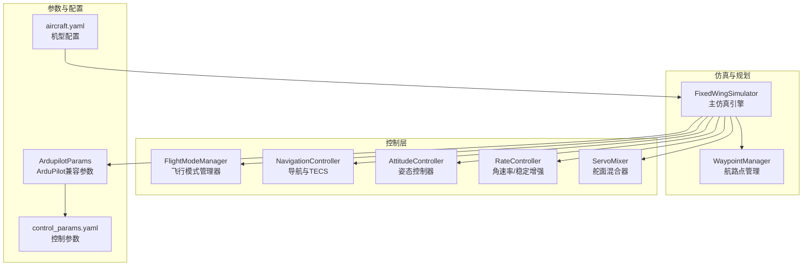
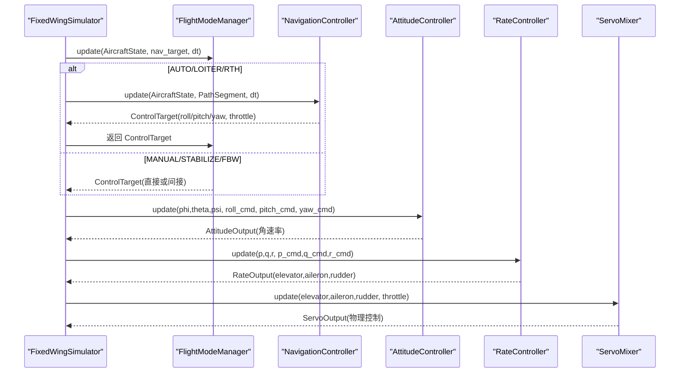
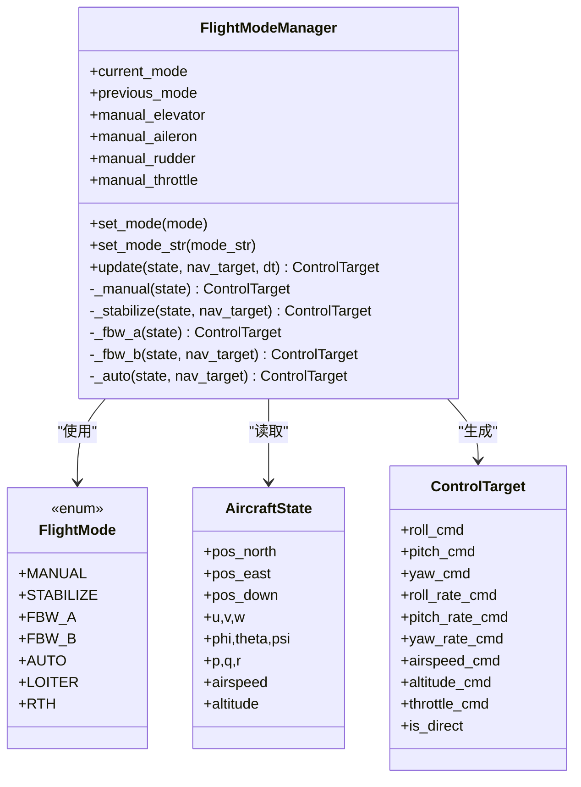
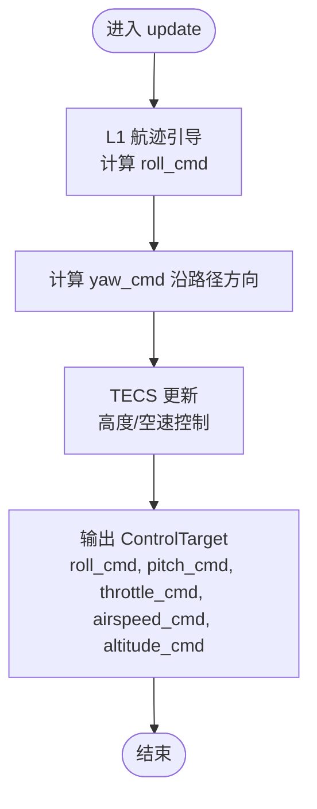
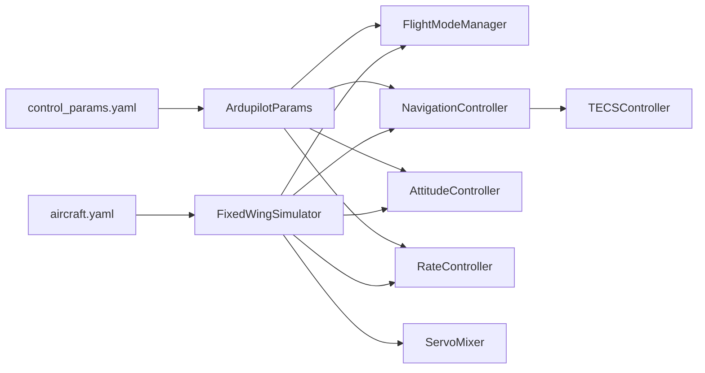

# 飞行模式管理

<cite>
**本文引用的文件**
- [src/control/flight_mode_manager.py](file://src/control/flight_mode_manager.py)
- [src/control/navigation_controller.py](file://src/control/navigation_controller.py)
- [src/control/attitude_controller.py](file://src/control/attitude_controller.py)
- [src/control/rate_controller.py](file://src/control/rate_controller.py)
- [src/control/tecs_controller.py](file://src/control/tecs_controller.py)
- [src/control/pid_controller.py](file://src/control/pid_controller.py)
- [src/control/ardupilot_compat.py](file://src/control/ardupilot_compat.py)
- [src/simulation/simulator.py](file://src/simulation/simulator.py)
- [src/planning/waypoint_manager.py](file://src/planning/waypoint_manager.py)
- [examples/example_3_trajectory_tracking.py](file://examples/example_3_trajectory_tracking.py)
- [config/control_params.yaml](file://config/control_params.yaml)
- [config/aircraft.yaml](file://config/aircraft.yaml)
</cite>

## 目录
1. [简介](#简介)
2. [项目结构](#项目结构)
3. [核心组件](#核心组件)
4. [架构总览](#架构总览)
5. [详细组件分析](#详细组件分析)
6. [依赖关系分析](#依赖关系分析)
7. [性能考量](#性能考量)
8. [故障排查指南](#故障排查指南)
9. [结论](#结论)
10. [附录](#附录)

## 简介
本文件围绕 FixedWingSimulator 的飞行模式管理进行系统化概念说明，重点覆盖以下内容：
- 典型飞行模式的定义与特点：手动模式、稳定模式、飞控模式（FBW-A/B）、自动模式、盘旋模式、返航模式。
- 模式切换机制与触发条件：当前/历史模式跟踪、进入/退出时的行为与过渡策略。
- 导航控制器在不同模式下的角色与行为差异：路径跟踪、高度/速度控制、航向控制。
- 飞行模式管理器的状态机设计与事件驱动机制：状态转换、目标生成、安全保护。
- 决策逻辑与应用场景：如何依据任务需求选择合适模式，并结合仿真示例展示 AUTO 模式的闭环轨迹跟踪。

## 项目结构
FixedWingSimulator 采用模块化分层架构，飞行模式管理位于控制层核心，与导航控制器、姿态/角速率控制器以及舵面混合器协同工作。整体结构如下：

图表来源
- [src/simulation/simulator.py](file://src/simulation/simulator.py#L115-L230)
- [src/planning/waypoint_manager.py](file://src/planning/waypoint_manager.py#L20-L50)
- [src/control/flight_mode_manager.py](file://src/control/flight_mode_manager.py#L115-L147)
- [src/control/navigation_controller.py](file://src/control/navigation_controller.py#L45-L82)
- [src/control/attitude_controller.py](file://src/control/attitude_controller.py#L33-L53)
- [src/control/rate_controller.py](file://src/control/rate_controller.py#L32-L49)
- [src/control/ardupilot_compat.py](file://src/control/ardupilot_compat.py#L17-L60)
- [config/control_params.yaml](file://config/control_params.yaml#L1-L45)
- [config/aircraft.yaml](file://config/aircraft.yaml#L1-L13)

章节来源
- [src/simulation/simulator.py](file://src/simulation/simulator.py#L115-L230)
- [src/planning/waypoint_manager.py](file://src/planning/waypoint_manager.py#L20-L50)
- [config/control_params.yaml](file://config/control_params.yaml#L1-L45)
- [config/aircraft.yaml](file://config/aircraft.yaml#L1-L13)

## 核心组件
- 飞行模式管理器（FlightModeManager）
  - 维护当前/历史模式、航路点目标、手动输入等状态。
  - 在每个控制步根据当前模式生成 ControlTarget，支持平滑过渡与回退策略。
- 导航控制器（NavigationController）
  - L1 航迹引导 + TECS 高度/空速控制，输出姿态/油门目标。
- 姿态控制器（AttitudeController）
  - 角度外环 PID，生成角速率目标。
- 角速率/稳定增强（RateController）
  - 角速率内环 PID + 稳定增强（SAS），输出舵面增量。
- 舵面混合器（ServoMixer）
  - 将控制输出映射到物理舵面与油门。
- 参数容器（ArdupilotParams）
  - 提供与 ArduPilot 平台一致的参数命名与默认值，支持 YAML 加载/校验。

章节来源
- [src/control/flight_mode_manager.py](file://src/control/flight_mode_manager.py#L115-L298)
- [src/control/navigation_controller.py](file://src/control/navigation_controller.py#L45-L202)
- [src/control/attitude_controller.py](file://src/control/attitude_controller.py#L33-L134)
- [src/control/rate_controller.py](file://src/control/rate_controller.py#L32-L109)
- [src/control/ardupilot_compat.py](file://src/control/ardupilot_compat.py#L17-L130)

## 架构总览
飞行模式管理贯穿 ArduPilot 风格的五层控制链路：导航控制器（L1+TECS）→ 姿态控制器（角度→角速率）→ 角速率控制器（SAS）→ 舵面混合器 → 动力学仿真。模式管理器负责在 AUTO/LOITER/RTH 等模式下注入导航目标，在 MANUAL/STABILIZE/FBW 等模式下直接或间接生成控制目标。

图表来源
- [src/simulation/simulator.py](file://src/simulation/simulator.py#L499-L521)
- [src/control/flight_mode_manager.py](file://src/control/flight_mode_manager.py#L173-L212)
- [src/control/navigation_controller.py](file://src/control/navigation_controller.py#L134-L202)
- [src/control/attitude_controller.py](file://src/control/attitude_controller.py#L81-L122)
- [src/control/rate_controller.py](file://src/control/rate_controller.py#L68-L98)

章节来源
- [src/simulation/simulator.py](file://src/simulation/simulator.py#L499-L521)
- [src/control/flight_mode_manager.py](file://src/control/flight_mode_manager.py#L173-L212)
- [src/control/navigation_controller.py](file://src/control/navigation_controller.py#L134-L202)
- [src/control/attitude_controller.py](file://src/control/attitude_controller.py#L81-L122)
- [src/control/rate_controller.py](file://src/control/rate_controller.py#L68-L98)

## 详细组件分析

### 飞行模式管理器（FlightModeManager）
- 支持模式
  - MANUAL：直接透传手动输入，绕过姿态/角速率控制环。
  - STABILIZE：保持机翼水平，使用导航提供的俯仰/油门命令，航向保持当前。
  - FBW_A：滚转保持当前值，俯仰维持水平，高度由导航或默认保持。
  - FBW_B：高度与空速保持，使用导航提供的俯仰/油门命令。
  - AUTO/LOITER/RTH：使用导航控制器提供的目标；LOITER 记录盘旋中心；RTH 使用默认高度与速度。
- 关键行为
  - 模式切换：记录历史模式，打印切换日志；LOITER 入口捕获盘旋中心。
  - 目标生成：按模式返回 ControlTarget；无导航目标时提供回退（如保持当前姿态/速度/高度）。
  - 手动输入：通过外部设置的 elevator/aileron/rudder/throttle 注入。

图表来源
- [src/control/flight_mode_manager.py](file://src/control/flight_mode_manager.py#L28-L147)
- [src/control/flight_mode_manager.py](file://src/control/flight_mode_manager.py#L152-L298)

章节来源
- [src/control/flight_mode_manager.py](file://src/control/flight_mode_manager.py#L115-L298)

### 导航控制器（NavigationController）
- L1 航迹引导：基于当前地速投影与期望航迹夹角计算横向加速度，进而得到所需坡度角。
- TECS 高度/空速控制：综合爬升率估计、空速互补滤波与能量平衡，输出俯仰角与油门目标。
- 航向控制：沿路径方向设定目标航向。
- 模式差异
  - AUTO/LOITER/RTH：接收来自模式管理器的导航目标；LOITER 首次进入记录中心；RTH 使用默认高度与速度。
  - STABILIZE/FBW：导航目标可选，若无则回落到默认目标。

图表来源
- [src/control/navigation_controller.py](file://src/control/navigation_controller.py#L134-L202)
- [src/control/tecs_controller.py](file://src/control/tecs_controller.py#L247-L315)

章节来源
- [src/control/navigation_controller.py](file://src/control/navigation_controller.py#L45-L202)
- [src/control/tecs_controller.py](file://src/control/tecs_controller.py#L50-L315)

### 姿态控制器（AttitudeController）
- 角度误差经 PID（仅 P，无 D）转化为角速率目标。
- 输出限幅，防止过度饱和。
- 模式切换时重置积分器，避免模式间切换引发的积分冲击。

章节来源
- [src/control/attitude_controller.py](file://src/control/attitude_controller.py#L33-L134)
- [src/control/pid_controller.py](file://src/control/pid_controller.py#L17-L117)

### 角速率/稳定增强（RateController）
- 角速率误差经 PID（含比例/积分/微分与前馈）生成舵面增量。
- 稳定增强（SAS）作为最内环，提供阻尼抑制自然模态。
- 模式切换时重置积分器。

章节来源
- [src/control/rate_controller.py](file://src/control/rate_controller.py#L32-L109)
- [src/control/pid_controller.py](file://src/control/pid_controller.py#L17-L117)

### 参数容器（ArdupilotParams）
- 提供与 ArduPilot 平台一致的参数命名（如 PTCH_P、ROLL_RATE_P 等）。
- 支持从 YAML 文件加载、导出与基本范围校验。

章节来源
- [src/control/ardupilot_compat.py](file://src/control/ardupilot_compat.py#L17-L130)
- [config/control_params.yaml](file://config/control_params.yaml#L1-L45)

### WaypointManager 与 AUTO 模式闭环
- WaypointManager 管理航路点、构建轨迹对象、提供活动航段。
- AUTO 模式下，仿真引擎根据轨迹生成 PathSegment，交由导航控制器计算 ControlTarget，再由模式管理器统一调度。

章节来源
- [src/planning/waypoint_manager.py](file://src/planning/waypoint_manager.py#L20-L208)
- [examples/example_3_trajectory_tracking.py](file://examples/example_3_trajectory_tracking.py#L72-L98)
- [src/simulation/simulator.py](file://src/simulation/simulator.py#L478-L497)

## 依赖关系分析
- 模式管理器依赖参数容器与配置文件，以确定默认速度/高度与 L1/TECS 参数。
- 导航控制器依赖 TECS 控制器与数学工具，实现路径跟踪与能量管理。
- 控制链路自外向内：导航目标 → 姿态目标 → 角速率目标 → 舵面增量 → 物理控制。
- 仿真引擎协调各模块，按控制步长推进仿真并记录历史。

图表来源
- [src/simulation/simulator.py](file://src/simulation/simulator.py#L165-L216)
- [src/control/ardupilot_compat.py](file://src/control/ardupilot_compat.py#L74-L98)
- [config/control_params.yaml](file://config/control_params.yaml#L1-L45)
- [config/aircraft.yaml](file://config/aircraft.yaml#L1-L13)

章节来源
- [src/simulation/simulator.py](file://src/simulation/simulator.py#L165-L216)
- [src/control/ardupilot_compat.py](file://src/control/ardupilot_compat.py#L74-L98)
- [config/control_params.yaml](file://config/control_params.yaml#L1-L45)
- [config/aircraft.yaml](file://config/aircraft.yaml#L1-L13)

## 性能考量
- 控制链路稳定性
  - PID 控制器采用积分抗饱和策略，模式切换时重置积分器，避免累积误差导致超调。
  - TECS 通过能量平衡与比能分配比实现高度/速度耦合控制，避免传统解耦 PID 的油门饱和与积分饱和问题。
- 数值稳定性
  - L1 引导在接近航段末端时转向终点，避免“机头过高”过冲。
  - TECS 对爬升/下沉速率进行限幅与低通滤波，防止需求突变导致的不稳定。
- 实时性与精度
  - 控制步长 dt 应与仿真步长匹配；参数容器提供默认 dt，可在构造时指定。
  - 舵面混合器输出归一化增量，再叠加配平偏移，确保动力学仿真正确感知总偏角。

## 故障排查指南
- 模式切换抖动或超调
  - 检查姿态/角速率控制器的 PID 参数是否过激；必要时降低 P 增益或增加阻尼。
  - 确认模式切换时已调用控制器 reset() 重置积分器。
- AUTO 模式跟踪偏差
  - 校验 WaypointManager 是否正确构建轨迹；检查 PathSegment 的起点/终点与目标速度。
  - 确认 TECS 的空速/高度边界与权重设置合理。
- MANUAL 模式失控
  - 确认手动输入已正确注入到模式管理器；检查 is_direct 标志是否生效。
- 参数加载错误
  - 使用参数容器的 validate() 方法检查参数范围；确认 YAML 文件路径与字段名正确。

章节来源
- [src/control/attitude_controller.py](file://src/control/attitude_controller.py#L124-L134)
- [src/control/rate_controller.py](file://src/control/rate_controller.py#L100-L109)
- [src/control/tecs_controller.py](file://src/control/tecs_controller.py#L197-L246)
- [src/control/ardupilot_compat.py](file://src/control/ardupilot_compat.py#L104-L130)

## 结论
FixedWingSimulator 的飞行模式管理以 ArduPilot 风格的五层控制链路为核心，通过 FlightModeManager 将不同模式的目标生成与过渡策略统一起来。AUTO/LOITER/RTH 模式下，导航控制器提供精确的路径与能量目标；MANUAL/STABILIZE/FBW 模式下，模式管理器直接或间接注入控制目标，满足不同场景的操控需求。配合参数容器与配置文件，系统具备良好的可调性与可移植性，适合开展飞行控制算法验证与任务场景仿真。

## 附录
- 示例：AUTO 模式闭环轨迹跟踪
  - 使用 WaypointManager 定义方形航路点，运行仿真后输出位置、速度、姿态与控制输入的历史数据与 3D 轨迹图。
- 配置参考
  - control_params.yaml：包含 ArduPilot 参数族与 TECS 参数族，支持按机型调整。
  - aircraft.yaml：选择仿真机型并可覆盖数据库默认参数。

章节来源
- [examples/example_3_trajectory_tracking.py](file://examples/example_3_trajectory_tracking.py#L72-L98)
- [config/control_params.yaml](file://config/control_params.yaml#L1-L45)
- [config/aircraft.yaml](file://config/aircraft.yaml#L1-L13)