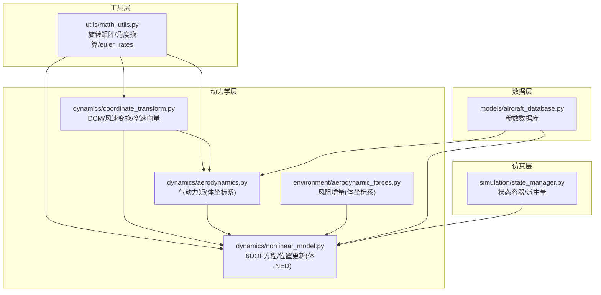
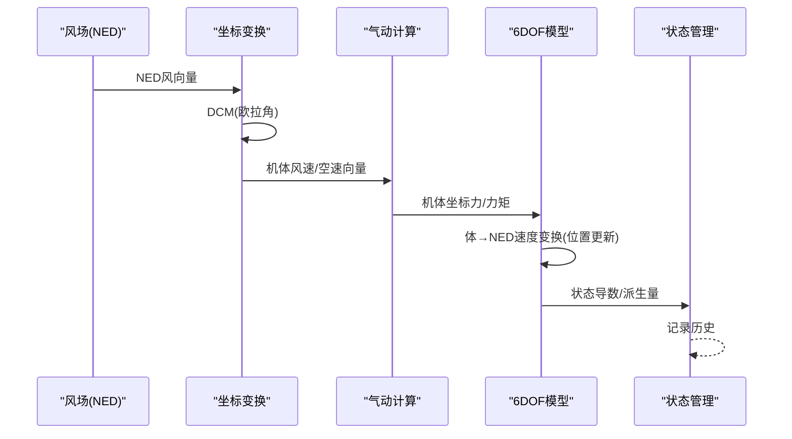
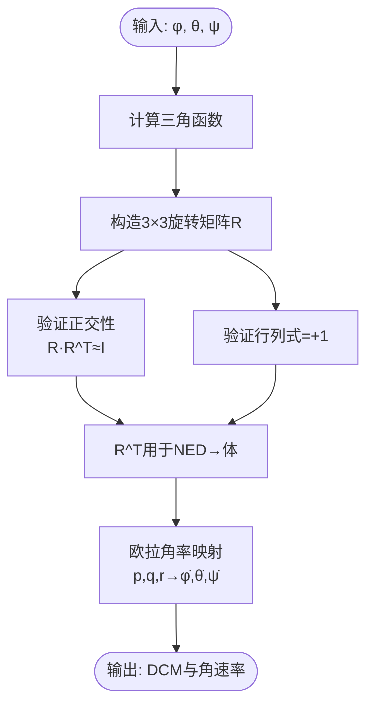
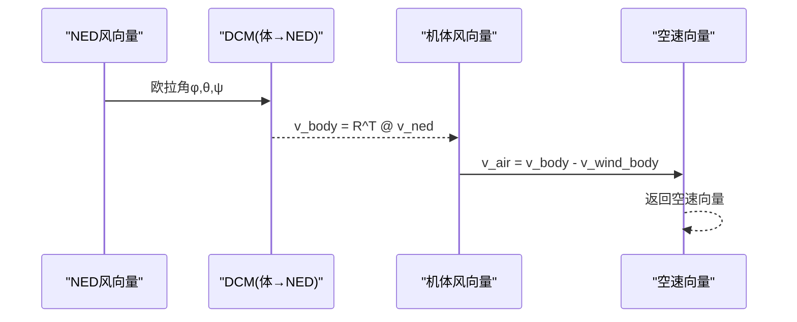
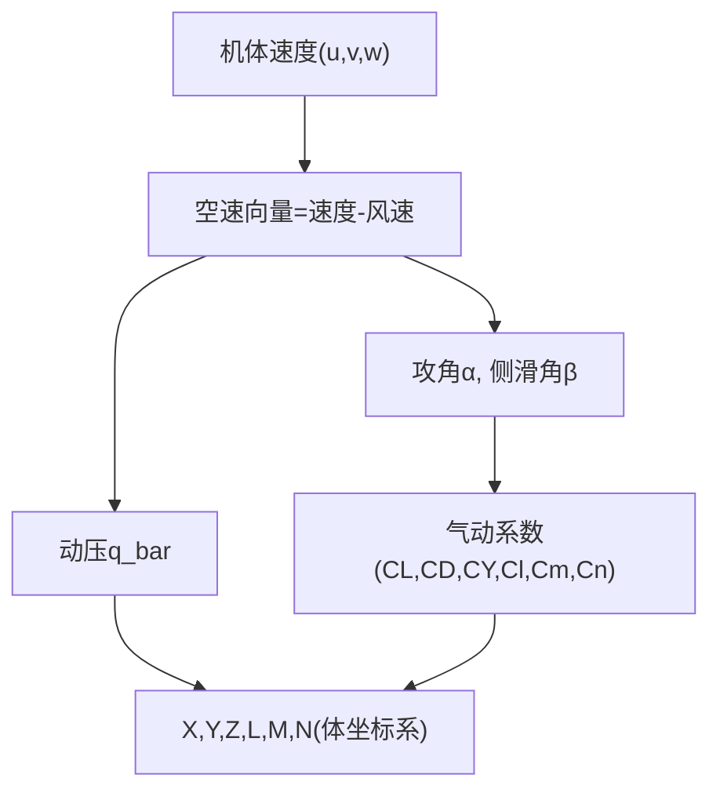
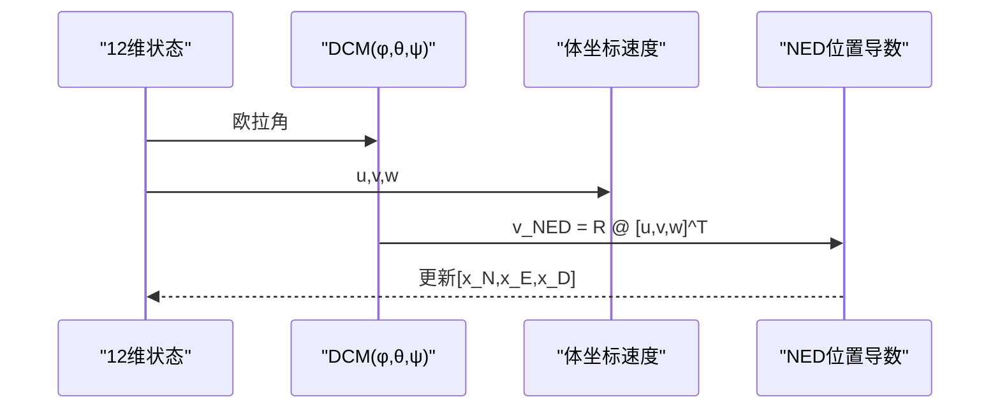
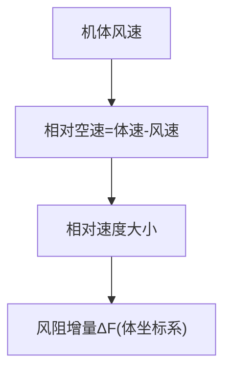
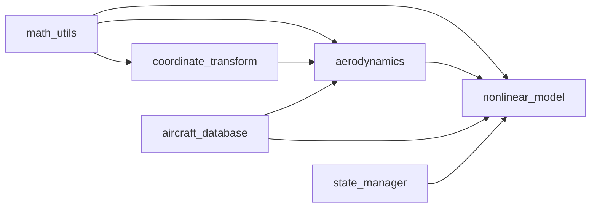

# 坐标变换系统

<cite>
**本文档引用的文件**
- [coordinate_transform.py](file://src/dynamics/coordinate_transform.py)
- [math_utils.py](file://src/utils/math_utils.py)
- [aerodynamics.py](file://src/dynamics/aerodynamics.py)
- [aerodynamic_forces.py](file://src/environment/aerodynamic_forces.py)
- [nonlinear_model.py](file://src/dynamics/nonlinear_model.py)
- [state_manager.py](file://src/simulation/state_manager.py)
- [aircraft_database.py](file://src/models/aircraft_database.py)
- [test_dynamics.py](file://tests/test_dynamics.py)
- [example_4_wind_resistance.py](file://examples/example_4_wind_resistance.py)
</cite>

## 目录
1. [简介](#简介)
2. [项目结构](#项目结构)
3. [核心组件](#核心组件)
4. [架构总览](#架构总览)
5. [详细组件分析](#详细组件分析)
6. [依赖关系分析](#依赖关系分析)
7. [性能考虑](#性能考虑)
8. [故障排除指南](#故障排除指南)
9. [结论](#结论)
10. [附录](#附录)

## 简介
本文件面向FixedWingSimulator的坐标变换系统，系统性阐述飞行器坐标系的定义与分类（地理坐标系、导航坐标系、速度坐标系、机体坐标系），并深入解析坐标变换矩阵的数学推导与实现方法（欧拉角旋转、方向余弦矩阵）。文档重点说明不同坐标系之间的变换关系、旋转角度的计算公式，并强调坐标变换在气动计算中的关键作用（速度矢量、力矢量、力矩矢量在不同坐标系间的转换）。最后提供实际应用示例与数值精度分析，帮助读者理解从理论到工程实践的完整闭环。

## 项目结构
坐标变换系统主要分布在以下模块：
- utils/math_utils：提供基础旋转矩阵、角度换算、欧拉角率等通用数学工具
- dynamics/coordinate_transform：面向飞行器动力学的坐标变换封装
- dynamics/aerodynamics：气动计算在机体坐标系下的实现
- dynamics/nonlinear_model：6自由度非线性模型中涉及坐标变换的环节
- environment/aerodynamic_forces：风阻增量计算，体现坐标变换在环境扰动中的应用
- simulation/state_manager：状态容器与历史记录，承载坐标变换产生的中间结果
- models/aircraft_database：参数数据库，提供气动系数与几何参数，支撑坐标变换后的物理意义

图表来源
- [math_utils.py](file://src/utils/math_utils.py#L43-L100)
- [coordinate_transform.py](file://src/dynamics/coordinate_transform.py#L29-L69)
- [aerodynamics.py](file://src/dynamics/aerodynamics.py#L35-L147)
- [nonlinear_model.py](file://src/dynamics/nonlinear_model.py#L160-L281)
- [aerodynamic_forces.py](file://src/environment/aerodynamic_forces.py#L13-L53)
- [state_manager.py](file://src/simulation/state_manager.py#L16-L93)
- [aircraft_database.py](file://src/models/aircraft_database.py#L143-L166)

章节来源
- [coordinate_transform.py](file://src/dynamics/coordinate_transform.py#L1-L70)
- [math_utils.py](file://src/utils/math_utils.py#L1-L124)
- [aerodynamics.py](file://src/dynamics/aerodynamics.py#L1-L148)
- [nonlinear_model.py](file://src/dynamics/nonlinear_model.py#L1-L386)
- [aerodynamic_forces.py](file://src/environment/aerodynamic_forces.py#L1-L54)
- [state_manager.py](file://src/simulation/state_manager.py#L1-L193)
- [aircraft_database.py](file://src/models/aircraft_database.py#L1-L183)

## 核心组件
- 方向余弦矩阵（DCM）：基于3-2-1欧拉角（roll-pitch-yaw）构建，满足正交性与行列式为+1的旋转矩阵特性
- 欧拉角率映射：从机体角速率到欧拉角时间导数的非线性映射，包含奇点保护
- 风速与空速变换：NED风速到机体风速的变换，以及空速向量的计算（速度-风）
- 气动计算：所有气动力与力矩均在机体坐标系下计算，符合固定翼标准符号约定
- 非线性6自由度模型：位置更新采用体坐标速度经DCM变换到NED，体现坐标变换在运动学中的作用

章节来源
- [math_utils.py](file://src/utils/math_utils.py#L43-L100)
- [coordinate_transform.py](file://src/dynamics/coordinate_transform.py#L29-L69)
- [aerodynamics.py](file://src/dynamics/aerodynamics.py#L35-L147)
- [nonlinear_model.py](file://src/dynamics/nonlinear_model.py#L160-L281)

## 架构总览
坐标变换贯穿从输入到输出的全链路：
- 输入阶段：NED风场与控制指令
- 中间阶段：DCM进行体-地坐标变换；空速向量与气动系数计算
- 输出阶段：6DOF状态导数（含位置更新）与派生量（空速、攻角、侧滑角）

图表来源
- [coordinate_transform.py](file://src/dynamics/coordinate_transform.py#L39-L69)
- [aerodynamics.py](file://src/dynamics/aerodynamics.py#L35-L147)
- [nonlinear_model.py](file://src/dynamics/nonlinear_model.py#L160-L281)
- [state_manager.py](file://src/simulation/state_manager.py#L95-L193)

## 详细组件分析

### 数学基础：方向余弦矩阵与欧拉角
- 定义与约定：采用NED地理坐标系与3-2-1欧拉角序列（φ=roll，θ=pitch，ψ=yaw），满足v_NED = R @ v_body
- 正交性与行列式：R满足R·R^T=I且det(R)=+1，保证旋转矩阵性质
- 反变换：R^T用于NED→体坐标变换
- 欧拉角率：从p,q,r到φ̇,θ̇,ψ̇的非线性映射，包含θ接近±90°时的数值保护

图表来源
- [math_utils.py](file://src/utils/math_utils.py#L43-L100)

章节来源
- [math_utils.py](file://src/utils/math_utils.py#L43-L100)

### 坐标变换封装：风速与空速
- NED→体风速：通过R^T对NED风向量进行变换，得到机体风速
- 空速向量：空速=机体速度-机体风速，体现相对运动概念
- 单元测试验证：零欧拉角时NED风等于体风；无风时空速等于机体速度；体→NED→体轮换保持原向量

图表来源
- [coordinate_transform.py](file://src/dynamics/coordinate_transform.py#L39-L69)
- [math_utils.py](file://src/utils/math_utils.py#L69-L76)

章节来源
- [coordinate_transform.py](file://src/dynamics/coordinate_transform.py#L1-L70)
- [test_dynamics.py](file://tests/test_dynamics.py#L86-L113)

### 气动计算中的坐标变换
- 坐标系约定：所有气动力与力矩均在机体坐标系下计算，符合固定翼标准符号（升力向上、俯仰正向为机头上抬）
- 攻角与侧滑角：基于空速在机体坐标系下的分量计算，确保在不同姿态下的一致性
- 动压计算：q_bar=0.5·ρ·V^2，随空速变化而变化
- 力与力矩：通过气动系数（CL,CD,CY,Cl,Cm,Cn）与动压、参考面积等参数合成，最终得到机体坐标系下的X,Y,Z,L,M,N

图表来源
- [aerodynamics.py](file://src/dynamics/aerodynamics.py#L35-L147)
- [math_utils.py](file://src/utils/math_utils.py#L107-L123)

章节来源
- [aerodynamics.py](file://src/dynamics/aerodynamics.py#L1-L148)
- [math_utils.py](file://src/utils/math_utils.py#L107-L123)

### 非线性6自由度模型中的坐标变换
- 位置更新：将体坐标速度经DCM变换到NED，得到位置导数[ẋ_N, ẋ_E, ẋ_D]^T
- 重力项：在体坐标系下表达，随后通过DCM变换到NED参与受力平衡
- 风场处理：若存在NED风场，则先将其变换到体坐标系，再参与空速与气动计算

图表来源
- [nonlinear_model.py](file://src/dynamics/nonlinear_model.py#L246-L248)
- [math_utils.py](file://src/utils/math_utils.py#L43-L66)

章节来源
- [nonlinear_model.py](file://src/dynamics/nonlinear_model.py#L160-L281)

### 环境风阻增量的坐标变换
- 风阻增量：基于相对速度在机体坐标系下的大小与方向，估算额外阻力
- 应用场景：用于扰动/敏感性分析，补充基础气动模型未覆盖的风场影响

图表来源
- [aerodynamic_forces.py](file://src/environment/aerodynamic_forces.py#L13-L53)

章节来源
- [aerodynamic_forces.py](file://src/environment/aerodynamic_forces.py#L1-L54)

### 状态管理与派生量
- 状态容器：包含体坐标速度、角速率、欧拉角与NED位置，以及派生量（空速、攻角、侧滑角、海拔）
- 历史记录：高效预分配数组，支持批量导出CSV与绘图

章节来源
- [state_manager.py](file://src/simulation/state_manager.py#L16-L193)

## 依赖关系分析
- 工具层依赖：coordinate_transform与aerodynamics均依赖math_utils提供的DCM与角度函数
- 动力学层依赖：nonlinear_model依赖aerodynamics与math_utils；同时在make_ode_func中将NED风变换到体坐标
- 数据层依赖：aircraft_database提供参数，被nonlinear_model与aerodynamics使用

图表来源
- [math_utils.py](file://src/utils/math_utils.py#L1-L124)
- [coordinate_transform.py](file://src/dynamics/coordinate_transform.py#L1-L70)
- [aerodynamics.py](file://src/dynamics/aerodynamics.py#L1-L148)
- [nonlinear_model.py](file://src/dynamics/nonlinear_model.py#L1-L386)
- [aircraft_database.py](file://src/models/aircraft_database.py#L1-L183)
- [state_manager.py](file://src/simulation/state_manager.py#L1-L193)

章节来源
- [nonlinear_model.py](file://src/dynamics/nonlinear_model.py#L261-L281)
- [coordinate_transform.py](file://src/dynamics/coordinate_transform.py#L1-L70)
- [aerodynamics.py](file://src/dynamics/aerodynamics.py#L1-L148)
- [math_utils.py](file://src/utils/math_utils.py#L1-L124)

## 性能考虑
- 矩阵运算开销：DCM构造与矩阵乘法为O(1)次操作，但在高频积分中仍需关注累积误差
- 角速率映射：当θ接近±90°时引入数值保护，避免分母趋近于零导致的不稳定
- 浮点精度：建议在派生量计算（如arctan2、arcsin）中保留足够的数值稳定性
- 批量处理：状态历史记录采用预分配数组，减少内存分配开销

## 故障排除指南
- DCM正交性破坏：检查欧拉角范围与三角函数计算，确保R·R^T≈I且det(R)=+1
- 欧拉角奇异：当θ接近±90°时，角速率映射可能出现数值异常，应使用小ε保护
- 空速为零或过小：气动计算对极小空速有数值夹紧，避免除零或NaN传播
- 风场不一致：确保NED风先变换到体坐标系后再参与空速与气动计算

章节来源
- [test_dynamics.py](file://tests/test_dynamics.py#L67-L121)
- [math_utils.py](file://src/utils/math_utils.py#L79-L100)
- [aerodynamics.py](file://src/dynamics/aerodynamics.py#L76-L77)

## 结论
FixedWingSimulator的坐标变换系统以数学严谨的DCM为核心，结合欧拉角率映射与风速/空速变换，实现了从NED到体坐标系的可靠转换。该系统在气动计算中发挥关键作用，确保力与力矩在正确坐标系下合成，并通过6DOF模型完成位置与姿态演化。单元测试覆盖了DCM正交性、轮换一致性与角速率映射等重要性质，为工程应用提供了可信赖的实现基础。

## 附录

### 坐标系定义与用途
- 地理坐标系（NED）：北-东-下，用于描述飞行器在地球上的位置与运动
- 导航坐标系（NED）：与地理坐标系一致，便于路径规划与GPS数据融合
- 速度坐标系（风轴）：以空速为基准，攻角与侧滑角在此坐标系下直接定义
- 机体坐标系（体坐标系）：固定于飞机，气动力与力矩在此坐标系下计算，符合固定翼符号约定

### 实际应用示例
- 空速矢量到机体坐标系的转换：先将NED风向量通过R^T变换到体坐标，再与体速度相减得到空速
- 重力加速度在各坐标系间的表示：在体坐标系下表达重力分量，随后通过DCM变换到NED参与受力平衡
- 风扰动下的气动修正：利用风阻增量模型在体坐标系下估算额外阻力，提升仿真精度

章节来源
- [coordinate_transform.py](file://src/dynamics/coordinate_transform.py#L39-L69)
- [nonlinear_model.py](file://src/dynamics/nonlinear_model.py#L212-L222)
- [aerodynamic_forces.py](file://src/environment/aerodynamic_forces.py#L13-L53)
- [example_4_wind_resistance.py](file://examples/example_4_wind_resistance.py#L1-L52)