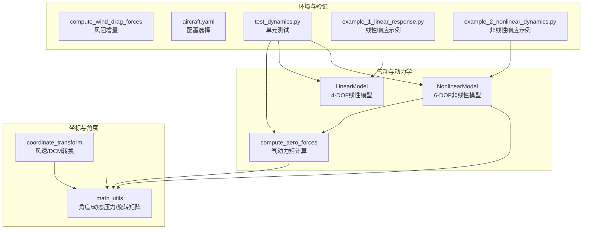
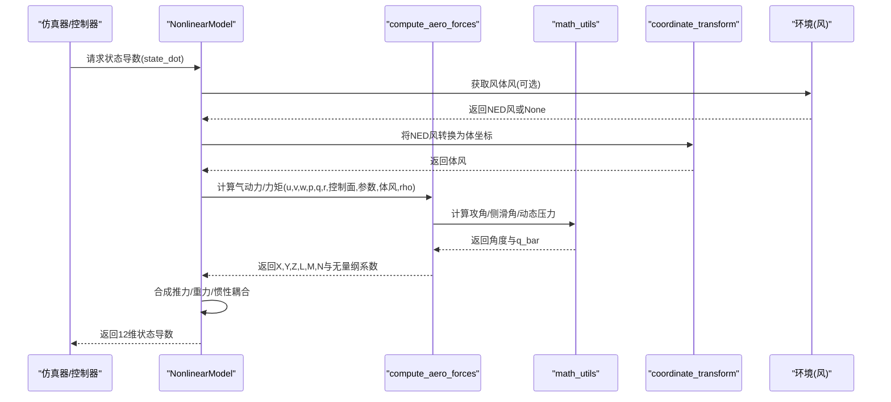
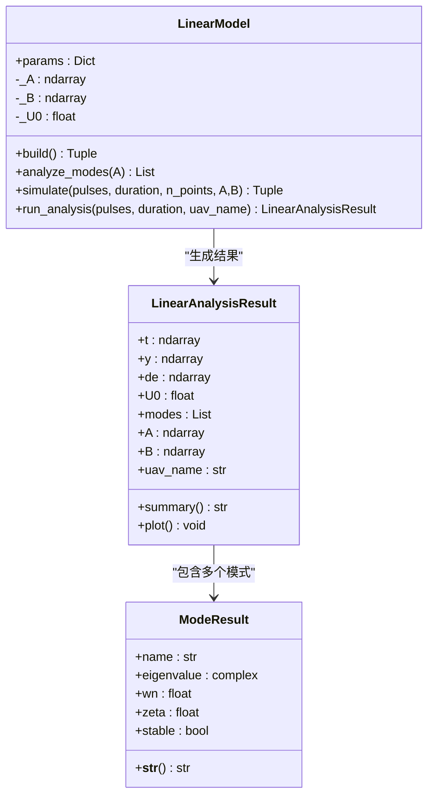
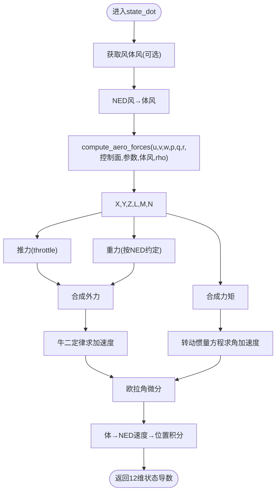
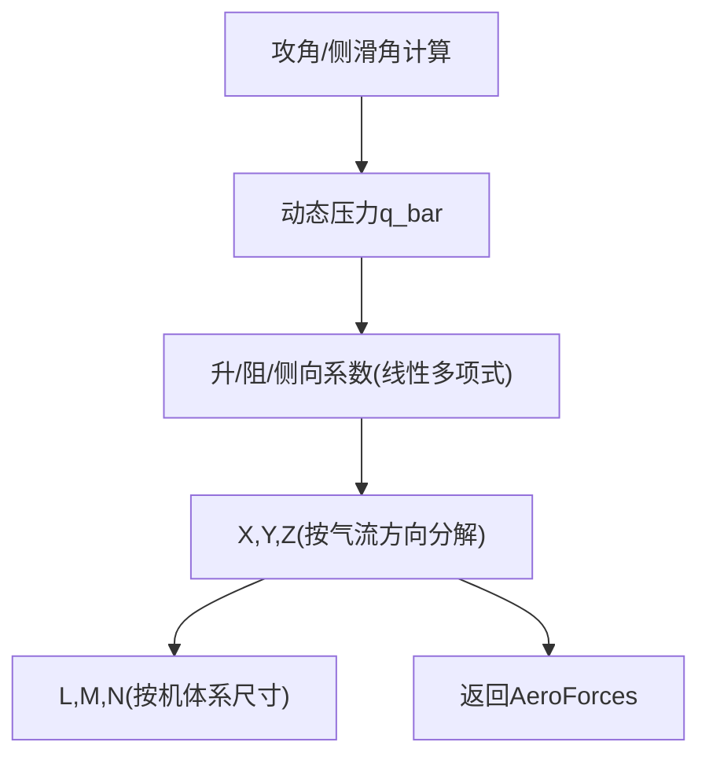
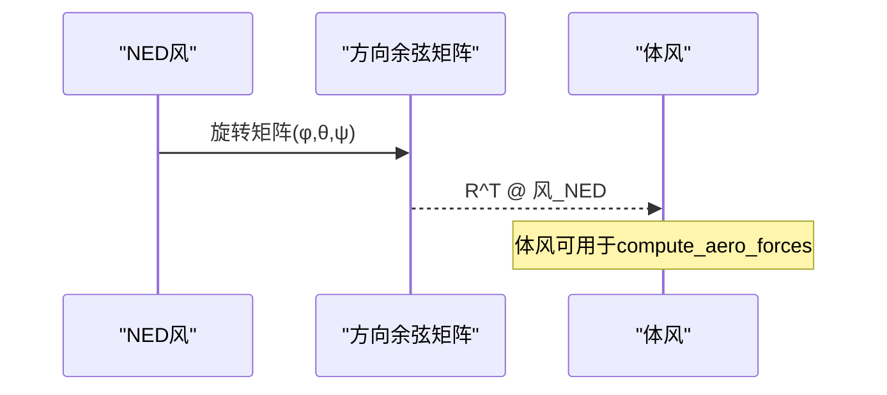
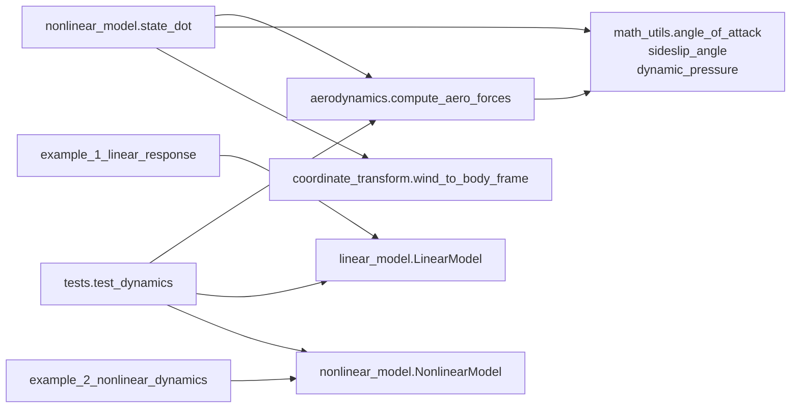

# 气动模型

<cite>
**本文引用的文件**
- [aerodynamics.py](file://src/dynamics/aerodynamics.py)
- [linear_model.py](file://src/dynamics/linear_model.py)
- [nonlinear_model.py](file://src/dynamics/nonlinear_model.py)
- [coordinate_transform.py](file://src/dynamics/coordinate_transform.py)
- [math_utils.py](file://src/utils/math_utils.py)
- [aerodynamic_forces.py](file://src/environment/aerodynamic_forces.py)
- [aircraft.yaml](file://config/aircraft.yaml)
- [test_dynamics.py](file://tests/test_dynamics.py)
- [example_1_linear_response.py](file://examples/example_1_linear_response.py)
- [example_2_nonlinear_dynamics.py](file://examples/example_2_nonlinear_dynamics.py)
</cite>

## 目录
1. [简介](#简介)
2. [项目结构](#项目结构)
3. [核心组件](#核心组件)
4. [架构总览](#架构总览)
5. [详细组件分析](#详细组件分析)
6. [依赖关系分析](#依赖关系分析)
7. [性能考量](#性能考量)
8. [故障排查指南](#故障排查指南)
9. [结论](#结论)
10. [附录](#附录)

## 简介
本技术文档聚焦于FixedWingSimulator的气动模型模块，系统阐述线性气动模型与非线性气动模型的区别、适用场景与实现细节；解释气动系数（升力、阻力、侧向力等）的计算方法与数学表达；说明攻角/迎角对气动力的影响机制及其在模型中的体现；解析坐标变换在气动计算中的作用（速度坐标系到机体坐标系）；描述不同飞行状态下的气动行为变化（低速、高速、失速等）；给出模型参数的物理意义与典型取值范围，并提供模型验证方法与误差分析建议。

## 项目结构
气动模型相关代码主要分布在以下模块：
- 动力学与气动：aerodynamics.py、linear_model.py、nonlinear_model.py
- 坐标变换：coordinate_transform.py、math_utils.py
- 风阻增量：aerodynamic_forces.py
- 配置与示例：aircraft.yaml、examples/*、tests/*

图表来源
- [aerodynamics.py](file://src/dynamics/aerodynamics.py#L35-L147)
- [linear_model.py](file://src/dynamics/linear_model.py#L107-L319)
- [nonlinear_model.py](file://src/dynamics/nonlinear_model.py#L104-L386)
- [coordinate_transform.py](file://src/dynamics/coordinate_transform.py#L29-L70)
- [math_utils.py](file://src/utils/math_utils.py#L107-L123)
- [aerodynamic_forces.py](file://src/environment/aerodynamic_forces.py#L13-L53)
- [aircraft.yaml](file://config/aircraft.yaml#L1-L13)
- [test_dynamics.py](file://tests/test_dynamics.py#L127-L195)
- [example_1_linear_response.py](file://examples/example_1_linear_response.py#L95-L123)
- [example_2_nonlinear_dynamics.py](file://examples/example_2_nonlinear_dynamics.py#L90-L120)

章节来源
- [aerodynamics.py](file://src/dynamics/aerodynamics.py#L1-L148)
- [linear_model.py](file://src/dynamics/linear_model.py#L1-L319)
- [nonlinear_model.py](file://src/dynamics/nonlinear_model.py#L1-L386)
- [coordinate_transform.py](file://src/dynamics/coordinate_transform.py#L1-L70)
- [math_utils.py](file://src/utils/math_utils.py#L1-L124)
- [aerodynamic_forces.py](file://src/environment/aerodynamic_forces.py#L1-L54)
- [aircraft.yaml](file://config/aircraft.yaml#L1-L13)

## 核心组件
- 气动力矩计算器：基于机体坐标系的非线性气动模型，输出X/Y/Z与L/M/N及无量纲系数CL/CD/CY/Cl/Cm/Cn，支持风速修正。
- 线性模型：4-DOF纵向线性化状态空间模型，用于模态分析与开环脉冲响应。
- 非线性模型：6-DOF全非线性方程，包含气动、推进、重力与坐标变换，支持配平与轨迹仿真。
- 角度与坐标工具：攻角/侧滑角、动态压力、方向余弦矩阵、欧拉角率转换。
- 风阻增量：相对风速引起的附加阻力估算，便于敏感性分析。

章节来源
- [aerodynamics.py](file://src/dynamics/aerodynamics.py#L19-L147)
- [linear_model.py](file://src/dynamics/linear_model.py#L107-L319)
- [nonlinear_model.py](file://src/dynamics/nonlinear_model.py#L104-L386)
- [math_utils.py](file://src/utils/math_utils.py#L107-L123)
- [coordinate_transform.py](file://src/dynamics/coordinate_transform.py#L29-L70)
- [aerodynamic_forces.py](file://src/environment/aerodynamic_forces.py#L13-L53)

## 架构总览
气动模型在系统中的位置与交互如下：

图表来源
- [nonlinear_model.py](file://src/dynamics/nonlinear_model.py#L160-L255)
- [aerodynamics.py](file://src/dynamics/aerodynamics.py#L35-L147)
- [math_utils.py](file://src/utils/math_utils.py#L107-L123)
- [coordinate_transform.py](file://src/dynamics/coordinate_transform.py#L39-L53)

## 详细组件分析

### 线性气动模型（4-DOF纵向）
- 状态向量：纵向扰动速度归一化偏差、攻角、俯仰速率、俯仰角扰动。
- 控制输入：节流归一化增量与升降舵偏角。
- 特点：通过稳定性导数构建A/B矩阵，进行特征值分析识别短周期与长周期模态；适合频域/模态分析与控制器设计。
- 适用场景：小扰动线性化、模态稳定性评估、PID参数整定。

图表来源
- [linear_model.py](file://src/dynamics/linear_model.py#L107-L319)

章节来源
- [linear_model.py](file://src/dynamics/linear_model.py#L107-L319)
- [example_1_linear_response.py](file://examples/example_1_linear_response.py#L95-L123)

### 非线性气动模型（6-DOF全非线性）
- 状态向量：机体速度(u/v/w)、角速度(p/q/r)、欧拉角(φ/θ/ψ)、NED位置(xN/xE/xD)。
- 方程构成：牛顿第二定律（含推力与重力）、欧拉角微分（含奇异保护）、刚体转动惯量方程、坐标变换（体→NED）。
- 特点：支持配平求解、开环脉冲响应、闭环PID跟踪；能反映大角度/强非线性效应。
- 适用场景：轨迹跟踪、闭环控制、真实飞行行为仿真。

图表来源
- [nonlinear_model.py](file://src/dynamics/nonlinear_model.py#L160-L255)
- [aerodynamics.py](file://src/dynamics/aerodynamics.py#L35-L147)
- [math_utils.py](file://src/utils/math_utils.py#L61-L100)

章节来源
- [nonlinear_model.py](file://src/dynamics/nonlinear_model.py#L104-L386)
- [example_2_nonlinear_dynamics.py](file://examples/example_2_nonlinear_dynamics.py#L90-L120)

### 气动系数与数学模型
- 攻角与侧滑角：使用arctan2与arcsin定义，保证数值稳定与角度范围正确。
- 动态压力：q_bar = 0.5·ρ·V^2，是所有气动力的基础。
- 升/阻/侧向力与力矩：
  - 升力与阻力：沿气流方向分解，考虑攻角影响；在小攻角下近似X≈-CD，Z≈-CL。
  - 侧向力：与β相关，受p/r与副翼/方向舵偏转影响。
  - 滚转/俯仰/偏航力矩：分别与β、p/r及副翼/升降舵/方向舵偏转相关。
- 非维度系数：CL、CD、CY、Cl、Cm、Cn均为线性函数，包含常数项、α、q̂、控制面偏转项。

图表来源
- [aerodynamics.py](file://src/dynamics/aerodynamics.py#L35-L147)
- [math_utils.py](file://src/utils/math_utils.py#L107-L123)

章节来源
- [aerodynamics.py](file://src/dynamics/aerodynamics.py#L35-L147)
- [math_utils.py](file://src/utils/math_utils.py#L107-L123)

### 坐标变换与风速处理
- 方向余弦矩阵：3-2-1欧拉角（φ/θ/ψ），体→NED与NED→体互逆。
- 欧拉角率：从体角速率到欧拉角时间导数，避免θ=±90°时的奇异性。
- 风速处理：将NED风转换为体风，再从体速度减去体风得到“真实空速”参与气动计算；另有独立的风阻增量计算函数用于相对风速引起的附加阻力。

图表来源
- [coordinate_transform.py](file://src/dynamics/coordinate_transform.py#L39-L53)
- [math_utils.py](file://src/utils/math_utils.py#L43-L100)

章节来源
- [coordinate_transform.py](file://src/dynamics/coordinate_transform.py#L29-L70)
- [math_utils.py](file://src/utils/math_utils.py#L43-L100)

### 不同飞行状态下的气动行为
- 低速：q_bar较小，升力不足易导致失速；模型通过最小空速夹紧保证数值稳定，但真实飞行中可能触发非线性与分离流动。
- 高速：q_bar增大，气动力显著上升；需关注结构载荷与控制面效率变化。
- 失速：非线性模型可捕捉到升力下降与力矩反向等现象；线性模型在失速附近不适用。
- 侧风：风阻增量模型提供相对风速引起的附加阻力估算，有助于理解侧风对轨迹与能耗的影响。

章节来源
- [aerodynamic_forces.py](file://src/environment/aerodynamic_forces.py#L13-L53)
- [test_dynamics.py](file://tests/test_dynamics.py#L153-L163)

### 参数物理意义与典型取值范围
- 几何参数：机翼面积S、平均气动弦c、翼展b；典型值见aircraft数据库。
- 稳定性导数：CL_0、CL_α、CL_q、CL_δe；CD_0、CD_α、CD_q、CD_δe；Cm_0、Cm_α、Cm_q、Cm_δe；CY_β、CY_p、CY_r、CY_δa、CY_δr；Cl_β、Cl_p、Cl_r、Cl_δa、Cl_δr；Cn_β、Cn_p、Cn_r、Cn_δa、Cn_δr。
- 典型范围参考：
  - CL_α：约[5~10]/rad（亚声速）
  - CD_α：通常很小或为负（随α增加而上升）
  - Cm_α：通常为负（静稳定性）
  - CY_β：通常为负（负侧力随β增加）
  - Cl_β、Cn_β：通常为负（负滚转/偏航力矩随β增加）

章节来源
- [aircraft.yaml](file://config/aircraft.yaml#L1-L13)
- [aerodynamics.py](file://src/dynamics/aerodynamics.py#L90-L123)

## 依赖关系分析

图表来源
- [aerodynamics.py](file://src/dynamics/aerodynamics.py#L11-L13)
- [nonlinear_model.py](file://src/dynamics/nonlinear_model.py#L27-L28)
- [coordinate_transform.py](file://src/dynamics/coordinate_transform.py#L11-L16)
- [example_1_linear_response.py](file://examples/example_1_linear_response.py#L34-L36)
- [example_2_nonlinear_dynamics.py](file://examples/example_2_nonlinear_dynamics.py#L34-L36)
- [test_dynamics.py](file://tests/test_dynamics.py#L42-L44)

章节来源
- [aerodynamics.py](file://src/dynamics/aerodynamics.py#L11-L13)
- [nonlinear_model.py](file://src/dynamics/nonlinear_model.py#L27-L28)
- [coordinate_transform.py](file://src/dynamics/coordinate_transform.py#L11-L16)
- [test_dynamics.py](file://tests/test_dynamics.py#L29-L45)

## 性能考量
- 数值稳定性：当空速接近零时，动态压力被夹紧以避免除零与数值不稳定；测试覆盖了极低速情形。
- 计算复杂度：非线性模型每步调用一次气动计算与多次三角函数/矩阵运算；线性模型仅进行矩阵乘法。
- 实时性：非线性模型采用高阶积分器；若需更高实时性，可考虑线性模型或降阶模型。

章节来源
- [test_dynamics.py](file://tests/test_dynamics.py#L153-L163)
- [nonlinear_model.py](file://src/dynamics/nonlinear_model.py#L287-L351)

## 故障排查指南
- 力的方向与符号：正升力应使Z为负（向上），测试验证了该符号约定。
- 零速度与极低速：确保q_bar被合理夹紧，避免异常大的力。
- 对称性检查：副翼偏转应产生非零滚转力矩，且左右对称性应满足预期。
- 风影响：加入头风应提高q_bar与气动力，测试已覆盖此情形。
- 线性模型稳定性：短周期模态应稳定，否则需检查参数或控制策略。

章节来源
- [test_dynamics.py](file://tests/test_dynamics.py#L139-L189)

## 结论
本气动模型模块在FixedWingSimulator中提供了从线性到非线性的完整覆盖：线性模型适用于模态分析与控制器设计，非线性模型则能准确反映真实飞行中的强非线性与大角度行为。通过明确的攻角/侧滑角定义、动态压力基础、稳定的坐标变换与风速处理，系统实现了可靠的气动计算与仿真。建议在实际应用中结合线性模型进行初步设计，在闭环控制与轨迹仿真中使用非线性模型进行验证。

## 附录

### 模型验证方法与误差分析
- 单元测试覆盖：
  - 坐标变换：DCM正交性、往返一致性、零角情形。
  - 气动：升力方向、阻力正性、零速夹紧、侧向力对称性、风影响。
  - 线性：A/B矩阵形状、有限性、模态数量与稳定性、脉冲激励有效性。
  - 非线性：配平收敛、状态导数维度、配平点附近导数接近零、短仿真运行。
- 示例脚本：
  - 线性响应：开环脉冲响应与闭环PID对比。
  - 非线性响应：开环脉冲与闭环姿态保持对比。
- 建议的误差分析：
  - 与风阻增量模型对比，量化相对风速对气动的影响。
  - 在不同空速段比较线性与非线性模型的差异，评估线性化误差。
  - 使用不同风场条件进行敏感性分析，评估控制鲁棒性。

章节来源
- [test_dynamics.py](file://tests/test_dynamics.py#L67-L195)
- [example_1_linear_response.py](file://examples/example_1_linear_response.py#L95-L123)
- [example_2_nonlinear_dynamics.py](file://examples/example_2_nonlinear_dynamics.py#L90-L120)
- [aerodynamic_forces.py](file://src/environment/aerodynamic_forces.py#L13-L53)