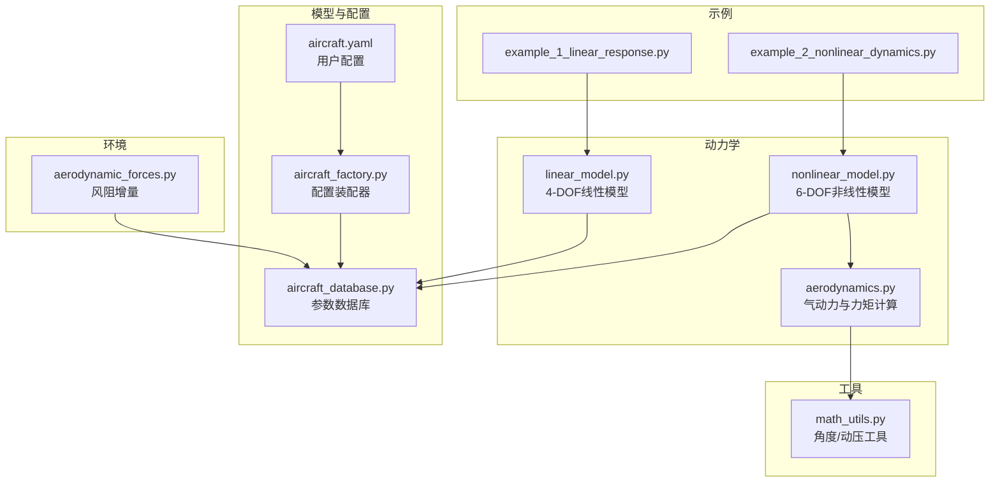
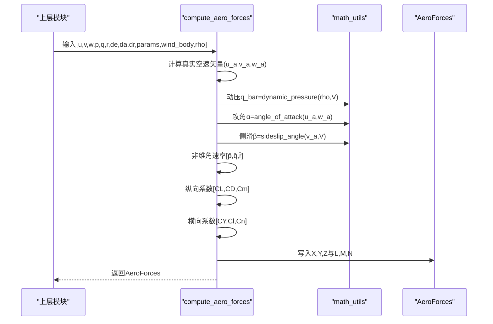
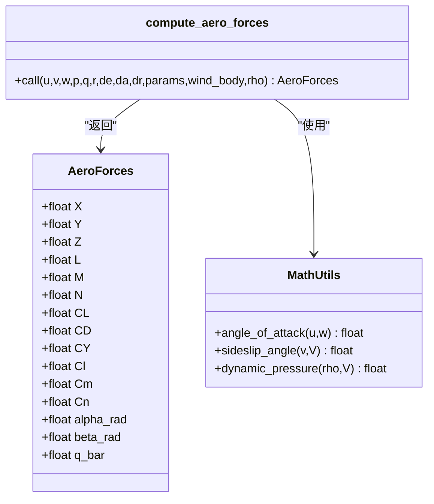
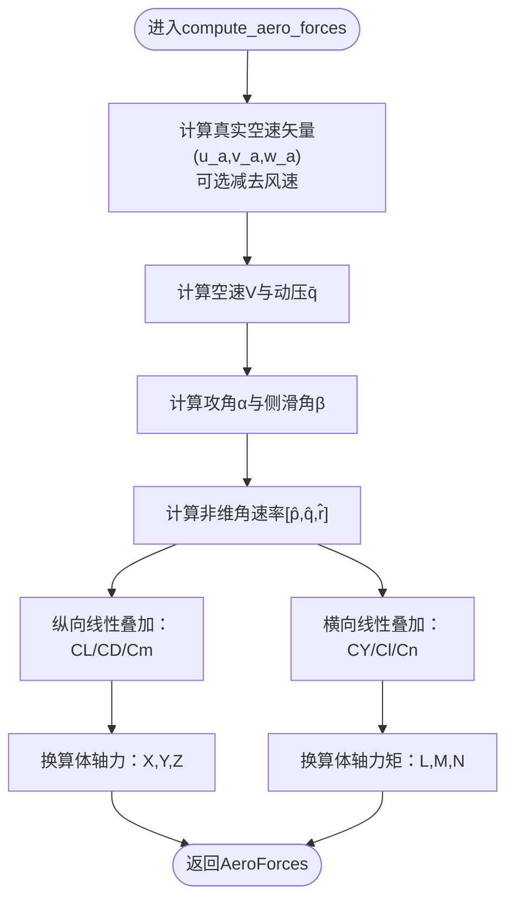
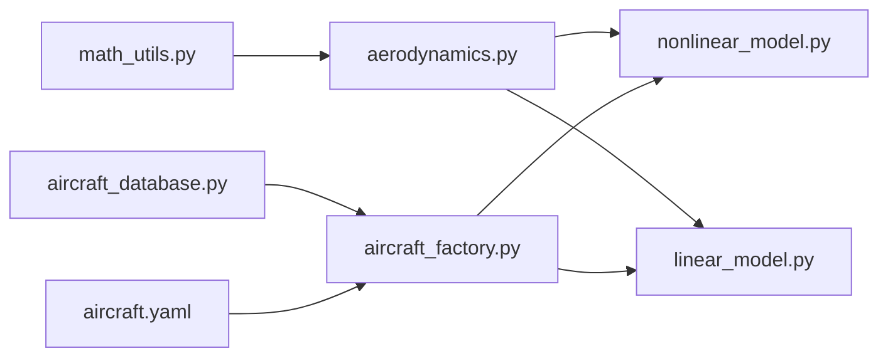

# 气动系数计算

<cite>
**本文引用的文件**
- [aerodynamics.py](file://src/dynamics/aerodynamics.py)
- [aerodynamic_forces.py](file://src/environment/aerodynamic_forces.py)
- [math_utils.py](file://src/utils/math_utils.py)
- [aircraft_database.py](file://src/models/aircraft_database.py)
- [aircraft_factory.py](file://src/models/aircraft_factory.py)
- [linear_model.py](file://src/dynamics/linear_model.py)
- [nonlinear_model.py](file://src/dynamics/nonlinear_model.py)
- [aircraft.yaml](file://config/aircraft.yaml)
- [example_1_linear_response.py](file://examples/example_1_linear_response.py)
- [example_2_nonlinear_dynamics.py](file://examples/example_2_nonlinear_dynamics.py)
- [setup.py](file://setup.py)
- [requirements.txt](file://requirements.txt)
</cite>

## 目录
1. [引言](#引言)
2. [项目结构](#项目结构)
3. [核心组件](#核心组件)
4. [架构总览](#架构总览)
5. [详细组件分析](#详细组件分析)
6. [依赖关系分析](#依赖关系分析)
7. [性能考量](#性能考量)
8. [故障排查指南](#故障排查指南)
9. [结论](#结论)
10. [附录](#附录)

## 引言
本文件聚焦于FixedWingSimulator中“气动系数计算模块”的技术实现与使用说明，系统阐述升力系数（CL）、阻力系数（CD）、俯仰力矩系数（Cm）、侧向力系数（CY）、滚转力矩系数（Cl）、偏航力矩系数（Cn）的物理意义、数学模型、计算流程与工程假设。文档同时解释攻角（α）与侧滑角（β）对气动系数的影响，给出线性区、过渡区、失速区的行为特征；说明风阻修正、非维角速率、参考参数（面积、弦长、翼展）的作用；并结合数据库中的典型机型参数，给出可复用的气动建模方法与实验/拟合建议。

## 项目结构
本项目采用按功能域分层的组织方式：动力学与控制位于src/dynamics与src/control，环境模型位于src/environment，模型与配置位于src/models，工具函数位于src/utils，示例与输出位于examples与output。气动计算主要集中在src/dynamics/aerodynamics.py，配合src/utils/math_utils.py提供的角度与动压计算，以及src/models/aircraft_database.py提供的气动参数库。

图表来源
- [aerodynamics.py](file://src/dynamics/aerodynamics.py#L1-L148)
- [linear_model.py](file://src/dynamics/linear_model.py#L1-L200)
- [nonlinear_model.py](file://src/dynamics/nonlinear_model.py#L1-L200)
- [aerodynamic_forces.py](file://src/environment/aerodynamic_forces.py#L1-L54)
- [aircraft_database.py](file://src/models/aircraft_database.py#L1-L183)
- [aircraft_factory.py](file://src/models/aircraft_factory.py#L1-L136)
- [aircraft.yaml](file://config/aircraft.yaml#L1-L13)
- [math_utils.py](file://src/utils/math_utils.py#L1-L124)
- [example_1_linear_response.py](file://examples/example_1_linear_response.py#L1-L206)
- [example_2_nonlinear_dynamics.py](file://examples/example_2_nonlinear_dynamics.py#L1-L215)

章节来源
- [aerodynamics.py](file://src/dynamics/aerodynamics.py#L1-L148)
- [aircraft_database.py](file://src/models/aircraft_database.py#L1-L183)
- [aircraft_factory.py](file://src/models/aircraft_factory.py#L1-L136)
- [aircraft.yaml](file://config/aircraft.yaml#L1-L13)
- [math_utils.py](file://src/utils/math_utils.py#L1-L124)
- [linear_model.py](file://src/dynamics/linear_model.py#L1-L200)
- [nonlinear_model.py](file://src/dynamics/nonlinear_model.py#L1-L200)
- [aerodynamic_forces.py](file://src/environment/aerodynamic_forces.py#L1-L54)
- [example_1_linear_response.py](file://examples/example_1_linear_response.py#L1-L206)
- [example_2_nonlinear_dynamics.py](file://examples/example_2_nonlinear_dynamics.py#L1-L215)

## 核心组件
- 气动容器与计算入口
  - AeroForces：封装气动六分量（X/Y/Z, L/M/N）与无量纲系数（CL/CD/CY/Cl/Cm/Cn），以及攻角、侧滑角、动压。
  - compute_aero_forces：输入速度/角速率与控制面偏角，输出气动力与力矩。
- 角度与动压工具
  - angle_of_attack、sideslip_angle、dynamic_pressure：用于从速度矢量计算α、β与动压q̄。
- 参数数据库与装配
  - aircraft_database：内置多型机气动参数（含纵向与横向/方向系数），并注入导出参数（U0、ρ、q̄）。
  - aircraft_factory：从数据库合并用户覆盖项生成最终配置。
- 线性与非线性模型
  - linear_model：基于纵向四自由度线性化模型，便于模态分析。
  - nonlinear_model：完整六自由度非线性方程，调用compute_aero_forces进行气动计算。

章节来源
- [aerodynamics.py](file://src/dynamics/aerodynamics.py#L19-L148)
- [math_utils.py](file://src/utils/math_utils.py#L107-L123)
- [aircraft_database.py](file://src/models/aircraft_database.py#L29-L166)
- [aircraft_factory.py](file://src/models/aircraft_factory.py#L39-L136)
- [linear_model.py](file://src/dynamics/linear_model.py#L107-L200)
- [nonlinear_model.py](file://src/dynamics/nonlinear_model.py#L104-L200)

## 架构总览
气动计算在“非维+参考参数”框架下完成，先计算真实空速与动压，再求取攻角与侧滑角，随后以线性叠加形式组合各稳定性导数与控制面效应，最后换算为体轴力与力矩。

图表来源
- [aerodynamics.py](file://src/dynamics/aerodynamics.py#L35-L148)
- [math_utils.py](file://src/utils/math_utils.py#L107-L123)

## 详细组件分析

### 升力、阻力与俯仰力矩系数（纵向）
- 物理意义
  - CL：垂直于相对风的速度分量方向的升力无量纲化系数，正负与约定一致。
  - CD：与相对风方向相反的阻力无量纲化系数。
  - Cm：绕y体轴的俯仰力矩无量纲化系数。
- 计算模型
  - 线性叠加形式：
    - CL = CL₀ + CL_α · α + CL_q · q̂ + CL_δe · δe
    - CD = CD₀ + CD_α · α + CD_q · q̂ + CD_δe · δe
    - Cm = Cm₀ + Cm_α · α + Cm_q · q̂ + Cm_δe · δe
  - 其中q̂ = q · c / (2·U₀)，c为平均气动弦长，U₀为巡航真速。
- 影响因素
  - 攻角α主导CL与Cm的线性增长；CD受α的二次以上效应（此处以线性项为主）。
  - 副翼/升降舵偏角通过对应导数耦合到纵向气动。
- 工程假设
  - 小攻角近似；非定常效应以q̂线性项近似；忽略高阶项与非线性失速。
- 参考参数
  - S：机翼平面面积；c：平均气动弦长；b：翼展；U₀：巡航速度。

章节来源
- [aerodynamics.py](file://src/dynamics/aerodynamics.py#L90-L104)
- [aircraft_database.py](file://src/models/aircraft_database.py#L40-L47)

### 侧向力与横滚/偏航力矩系数（横向/方向）
- 物理意义
  - CY：沿y体轴的侧向力无量纲化系数。
  - Cl：绕x体轴的滚转力矩无量纲化系数。
  - Cn：绕z体轴的偏航力矩无量纲化系数。
- 计算模型
  - 线性叠加形式：
    - CY = CY_β · β + CY_p · p̂ + CY_r · r̂ + CY_δa · δa + CY_δr · δr
    - Cl = Cl_β · β + Cl_p · p̂ + Cl_r · r̂ + Cl_δa · δa + Cl_δr · δr
    - Cn = Cn_β · β + Cn_p · p̂ + Cn_r · r̂ + Cn_δa · δa + Cn_δr · δr
  - 其中p̂ = p · b / (2·U₀)，r̂ = r · b / (2·U₀)，b为翼展。
- 影响因素
  - 侧滑角β主导CY；横向角速率p、r与副翼/方向舵偏角共同影响Cl、Cn。
- 工程假设
  - β较小；p、r线性耦合；忽略非线性与高阶项。

章节来源
- [aerodynamics.py](file://src/dynamics/aerodynamics.py#L106-L123)
- [aircraft_database.py](file://src/models/aircraft_database.py#L44-L47)

### 攻角与侧滑角的定义与计算
- 攻角α：相对风在xw平面的投影夹角，由arctan2(w, u)定义，避免符号歧义。
- 侧滑角β：相对风在y方向的投影与总速的关系，由arcsin(v / V)定义，数值上限制在[-π/2, π/2]。
- 动压q̄：0.5·ρ·V²，作为升力/阻力/力矩的基准。

章节来源
- [math_utils.py](file://src/utils/math_utils.py#L107-L123)

### 风阻增量计算（环境模型）
- 目的：估算相对于当前速度的风引起的额外阻力（增量）。
- 方法：ΔF = 0.5·ρ·S·CD₀·|v_rel|·(−v_rel/|v_rel|)，其中v_rel = [u,v,w] − [u_w,v_w,w_w]。
- 适用场景：扰动/灵敏度分析，补充基础气动模型未覆盖的风阻。

章节来源
- [aerodynamic_forces.py](file://src/environment/aerodynamic_forces.py#L13-L54)

### 参数来源与装配
- 数据库：aircraft_database提供多型机的气动参数（纵向/横向/方向导数、几何与惯性参数、Mach数等），并自动注入U0、ρ、q̄。
- 装配器：aircraft_factory支持从aircraft.yaml读取名称与可选覆盖项，合并后生成AircraftConfig供仿真使用。
- 用户配置：aircraft.yaml允许选择机型并覆盖部分参数。

章节来源
- [aircraft_database.py](file://src/models/aircraft_database.py#L29-L166)
- [aircraft_factory.py](file://src/models/aircraft_factory.py#L42-L93)
- [aircraft.yaml](file://config/aircraft.yaml#L5-L12)

### 线性与非线性模型中的气动使用
- 线性模型（4-DOF纵向）：用于短周期与长周期模态分析，状态含α、q、θ及扰动速度，便于理解纵向动态特性。
- 非线性模型（6-DOF）：完整方程，调用compute_aero_forces获得气动力/力矩，适合开环脉冲响应与闭环控制验证。

章节来源
- [linear_model.py](file://src/dynamics/linear_model.py#L107-L200)
- [nonlinear_model.py](file://src/dynamics/nonlinear_model.py#L104-L200)

### 类关系图（代码级）

图表来源
- [aerodynamics.py](file://src/dynamics/aerodynamics.py#L19-L148)
- [math_utils.py](file://src/utils/math_utils.py#L107-L123)

### 流程图（纵向气动系数计算）

图表来源
- [aerodynamics.py](file://src/dynamics/aerodynamics.py#L68-L147)

## 依赖关系分析
- 模块内聚与耦合
  - aerodynamics依赖math_utils（角度/动压）；nonlinear_model依赖aerodynamics；linear_model独立于气动细节但使用数据库参数。
  - aircraft_factory与aircraft_database耦合紧密，前者负责合并用户覆盖项。
- 外部依赖
  - numpy、scipy、matplotlib、plotly、pyyaml、pandas等，详见setup.py与requirements.txt。

图表来源
- [aerodynamics.py](file://src/dynamics/aerodynamics.py#L11-L13)
- [nonlinear_model.py](file://src/dynamics/nonlinear_model.py#L27-L28)
- [linear_model.py](file://src/dynamics/linear_model.py#L18-L27)
- [aircraft_database.py](file://src/models/aircraft_database.py#L14-L21)
- [aircraft_factory.py](file://src/models/aircraft_factory.py#L12-L12)
- [aircraft.yaml](file://config/aircraft.yaml#L1-L13)

章节来源
- [setup.py](file://setup.py#L11-L18)
- [requirements.txt](file://requirements.txt#L1-L8)

## 性能考量
- 计算复杂度
  - compute_aero_forces为纯标量/数组运算，时间复杂度O(1)，空间复杂度O(1)，适合实时仿真。
- 数值稳定性
  - 采用arctan2与arcsin的数值稳定版本；对小速度/侧风进行阈值保护；非维角速率避免大数值漂移。
- 参考参数选择
  - 使用U0、S、c或b进行非维化，确保不同机型间系数可比；Mach数决定U0与q̄。

章节来源
- [aerodynamics.py](file://src/dynamics/aerodynamics.py#L76-L88)
- [math_utils.py](file://src/utils/math_utils.py#L107-L123)
- [aircraft_database.py](file://src/models/aircraft_database.py#L159-L166)

## 故障排查指南
- 现象：气动力/力矩异常或发散
  - 排查点：检查输入速度/角速率是否合理；确认风速与密度设置；核对控制面偏角范围。
  - 参考路径：compute_aero_forces的输入校验与非维角速率计算。
- 现象：纵向/横向响应与预期不符
  - 排查点：确认所选机型参数是否匹配；检查是否正确覆盖了所需参数；核对U0与q̄是否被正确注入。
  - 参考路径：aircraft_database的参数注入逻辑；aircraft_factory的覆盖合并。
- 现象：风阻增量导致不必要震荡
  - 排查点：v_rel过小会返回零增量；确认风速与当前速度接近时的数值行为。
  - 参考路径：aerodynamic_forces的阈值处理。

章节来源
- [aerodynamics.py](file://src/dynamics/aerodynamics.py#L35-L148)
- [aerodynamic_forces.py](file://src/environment/aerodynamic_forces.py#L39-L53)
- [aircraft_database.py](file://src/models/aircraft_database.py#L159-L166)
- [aircraft_factory.py](file://src/models/aircraft_factory.py#L61-L74)

## 结论
本模块以“非维+参考参数”的线性叠加模型为核心，实现了对固定翼飞机纵向与横向/方向气动特性的高效计算。通过数据库与装配器，用户可便捷地切换与定制机型参数；结合线性/非线性模型，既能开展模态分析，也能进行高保真的6-DOF仿真。工程上，该模型适用于小攻角与低侧滑场景，若需扩展至失速/非线性区域，可在保持主干框架不变的前提下引入非线性修正项与查表法。

## 附录

### 攻角与侧滑角对气动系数的影响（概念性说明）
- 线性区：α与β均较小，CL、Cm随α线性增加；CY、Cl、Cn随β与p、r线性耦合。
- 过渡区：α接近临界值，CD与Cm出现非线性增长，升阻比下降。
- 失速区：α进一步增大，CL峰值下降，CD快速上升，Cm出现反向，操纵效率降低。
- 马赫数与雷诺数：在本实现中，U0由Mach×声速确定，ρ为常数；实际工程中，需考虑压缩性修正与Re修正（本仓库未内置，可外接查表/修正函数）。

### 实验测量与数值拟合建议（概念性说明）
- 实验测量：风洞试验获取不同α、β、p、q、r、控制面偏角下的CL、CD、CY、Cl、Cm、Cn；记录风速、温度、湿度以确定ρ与μ。
- 数值拟合：以线性叠加为基础，采用最小二乘法拟合各导数；对非线性区引入分段拟合或多项式修正；对高Ma数引入压缩性修正因子。

### 典型机型参数与使用示例
- 示例脚本展示了如何加载参数并运行线性/非线性仿真，便于对比不同机型的纵向与横向特性。
- 可直接使用aircraft.yaml选择机型并进行参数覆盖，随后在仿真中调用compute_aero_forces获取气动力。

章节来源
- [example_1_linear_response.py](file://examples/example_1_linear_response.py#L95-L123)
- [example_2_nonlinear_dynamics.py](file://examples/example_2_nonlinear_dynamics.py#L89-L120)
- [aircraft.yaml](file://config/aircraft.yaml#L5-L12)