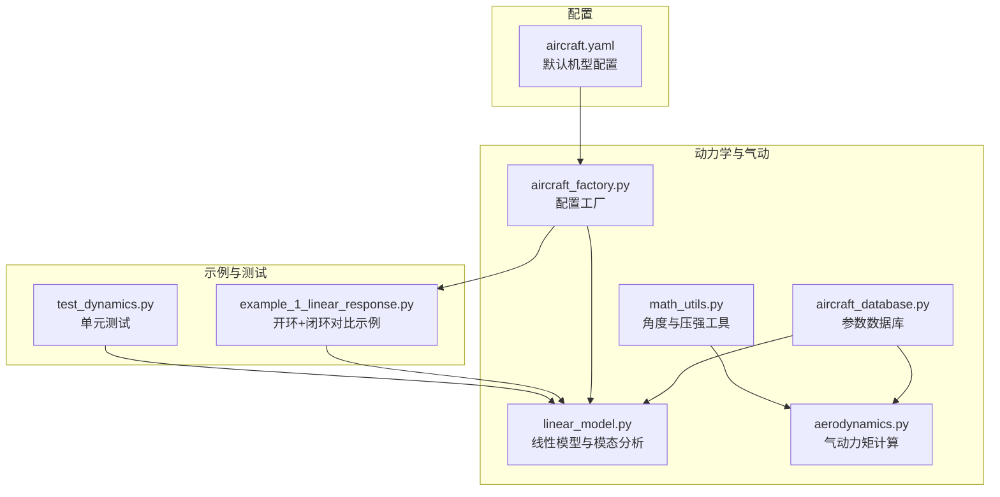
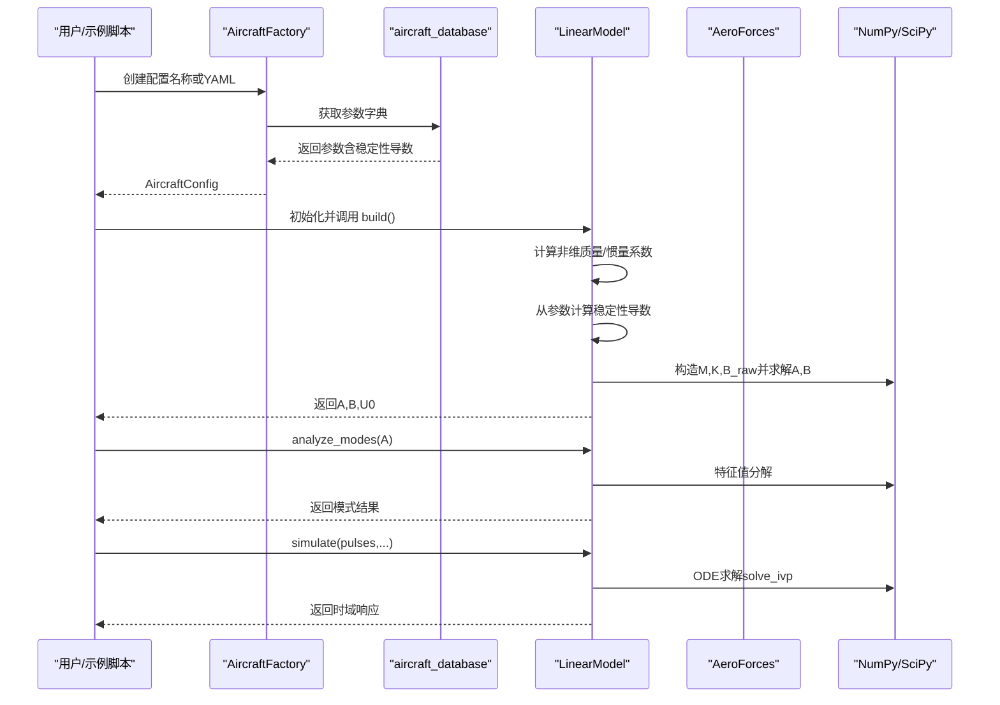
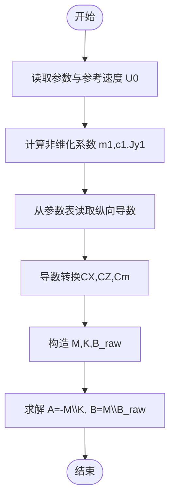
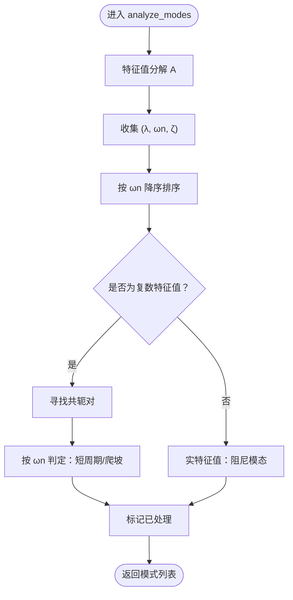
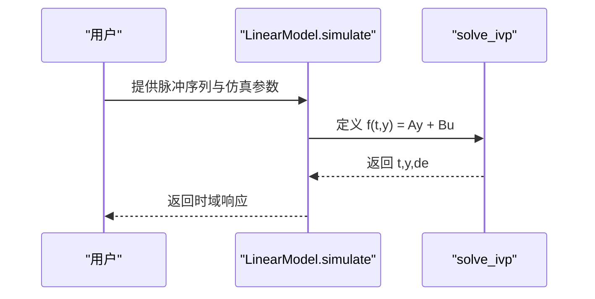
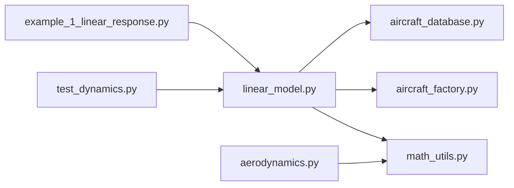

# 线性气动模型

<cite>
**本文引用的文件**
- [linear_model.py](file://src/dynamics/linear_model.py)
- [aerodynamics.py](file://src/dynamics/aerodynamics.py)
- [aircraft_database.py](file://src/models/aircraft_database.py)
- [aircraft_factory.py](file://src/models/aircraft_factory.py)
- [math_utils.py](file://src/utils/math_utils.py)
- [example_1_linear_response.py](file://examples/example_1_linear_response.py)
- [test_dynamics.py](file://tests/test_dynamics.py)
- [aircraft.yaml](file://config/aircraft.yaml)
</cite>

## 目录
1. [简介](#简介)
2. [项目结构](#项目结构)
3. [核心组件](#核心组件)
4. [架构总览](#架构总览)
5. [详细组件分析](#详细组件分析)
6. [依赖关系分析](#依赖关系分析)
7. [性能考量](#性能考量)
8. [故障排查指南](#故障排查指南)
9. [结论](#结论)
10. [附录](#附录)

## 简介
本技术文档围绕 FixedWingSimulator 的线性气动模型展开，系统阐述 4 自由度（4-DOF）纵向线性化状态空间模型的数学原理与实现细节。重点包括：
- 状态向量与控制输入的物理意义与作用机制
- 稳定性导数的来源与构建流程
- 状态矩阵 A 与输入矩阵 B 的构造方法
- 模态分析（短周期、爬坡模态、阻尼模态）的原理与稳定性判定
- 完整的数学推导与代码实现路径指引

该模型基于纵向平面假设，采用非维化处理与稳定性导数线性化，适用于开环脉冲响应分析与闭环控制器设计对比。

## 项目结构
与线性气动模型直接相关的模块与文件如下：
- 动力学与气动：linear_model.py、aerodynamics.py、aircraft_database.py、aircraft_factory.py、math_utils.py
- 示例与测试：example_1_linear_response.py、test_dynamics.py
- 配置：aircraft.yaml

图表来源
- [linear_model.py](file://src/dynamics/linear_model.py#L107-L319)
- [aerodynamics.py](file://src/dynamics/aerodynamics.py#L35-L148)
- [aircraft_database.py](file://src/models/aircraft_database.py#L143-L166)
- [aircraft_factory.py](file://src/models/aircraft_factory.py#L39-L75)
- [math_utils.py](file://src/utils/math_utils.py#L107-L124)
- [example_1_linear_response.py](file://examples/example_1_linear_response.py#L83-L206)
- [test_dynamics.py](file://tests/test_dynamics.py#L201-L255)
- [aircraft.yaml](file://config/aircraft.yaml#L1-L13)

章节来源
- [linear_model.py](file://src/dynamics/linear_model.py#L1-L319)
- [aerodynamics.py](file://src/dynamics/aerodynamics.py#L1-L148)
- [aircraft_database.py](file://src/models/aircraft_database.py#L1-L183)
- [aircraft_factory.py](file://src/models/aircraft_factory.py#L1-L136)
- [math_utils.py](file://src/utils/math_utils.py#L1-L124)
- [example_1_linear_response.py](file://examples/example_1_linear_response.py#L1-L206)
- [test_dynamics.py](file://tests/test_dynamics.py#L201-L255)
- [aircraft.yaml](file://config/aircraft.yaml#L1-L13)

## 核心组件
- 线性模型类 LinearModel：负责构建 A、B 矩阵，执行模态分析与时间域仿真。
- 气动力计算 AeroForces：提供升阻侧力与力矩系数的计算接口，用于验证与理解稳定性导数来源。
- 参数数据库与工厂：提供标准飞机参数（含纵向稳定性导数），支持 YAML 覆盖与 ArduPilot 导出。
- 数学工具：角度换算、动态压强等基础运算。

章节来源
- [linear_model.py](file://src/dynamics/linear_model.py#L107-L319)
- [aerodynamics.py](file://src/dynamics/aerodynamics.py#L19-L148)
- [aircraft_database.py](file://src/models/aircraft_database.py#L29-L166)
- [aircraft_factory.py](file://src/models/aircraft_factory.py#L39-L136)
- [math_utils.py](file://src/utils/math_utils.py#L107-L124)

## 架构总览
线性模型以纵向平面为研究对象，通过非维化处理与稳定性导数线性化，得到状态空间形式：
- 状态方程：ẏ = Ay + Bu
- 输出可由 y 或变换后的 y 表示（此处关注纵向状态）

图表来源
- [aircraft_factory.py](file://src/models/aircraft_factory.py#L39-L75)
- [aircraft_database.py](file://src/models/aircraft_database.py#L143-L166)
- [linear_model.py](file://src/dynamics/linear_model.py#L129-L200)
- [linear_model.py](file://src/dynamics/linear_model.py#L206-L252)
- [linear_model.py](file://src/dynamics/linear_model.py#L258-L306)

## 详细组件分析

### 状态空间模型与物理意义
- 状态向量 x = [u_p, α, q, θ]^T
  - u_p：前进速度扰动的归一化变量，u_p = Δu / U0
  - α：攻角扰动（弧度）
  - q：俯仰角速度扰动（rad/s）
  - θ：俯仰角扰动（弧度）
- 控制输入向量 u_c = [δ_T, δ_e]^T
  - δ_T：推力扰动（无量纲，通常与节风门开度相关）
  - δ_e：升降舵偏转（弧度，正向尾缘下偏）

这些变量均在纵向平面内考虑，且采用非维化处理，便于不同飞行条件下的比较与统一建模。

章节来源
- [linear_model.py](file://src/dynamics/linear_model.py#L4-L12)

### 稳定性导数与非维化
- 基础参数：质量 m、机翼面积 S、平均气动弦 c、转动惯量 I_y、马赫数 Mach
- 参考速度：U0 = Mach × 声速
- 非维化系数：
  - m1 = m / (0.5 · ρ · U0 · S)
  - c1 = c / (2 · U0)
  - Jy1 = Iy / (0.5 · ρ · U0^2 · S · c)
- 纵向稳定性导数（来自参数库）：
  - CL_0, CL_α, CL_q, CL_δe, CL_u
  - CD_0, CD_α, CD_q, CD_δe, CD_u
  - Cm_0, Cm_α, Cm_q, Cm_δe, Cm_u
- 导数转换：
  - CXu, CXa, CXq
  - CZu, CZa, CZq
  - Cmα, Cmq, Cmδe（含 Cm0 的修正项）
- 输入导数：
  - CXde, CZde, Cmde

章节来源
- [linear_model.py](file://src/dynamics/linear_model.py#L140-L174)
- [aircraft_database.py](file://src/models/aircraft_database.py#L29-L48)

### 状态矩阵 A 与输入矩阵 B 的构建
- 构造中间矩阵 M、K 与 B_raw
- 解线性系统得到 A、B：
  - A = -M^{-1} · K
  - B = M^{-1} · B_raw
- 这一步将非维化的运动微分方程转化为标准状态空间形式

图表来源
- [linear_model.py](file://src/dynamics/linear_model.py#L129-L200)

章节来源
- [linear_model.py](file://src/dynamics/linear_model.py#L129-L200)

### 模态分析：短周期、爬坡模态与阻尼模态
- 特征值分解：对 A 进行特征值分解，得到 λ
- 定义自然频率与阻尼比：
  - ωn = |λ|
  - ζ = -Re(λ) / ωn
- 分类规则：
  - 复数特征值：成对出现（共轭），按 ωn 排序
    - 若 ωn 较大：短周期模态；若 ωn 较小：爬坡模态（Phugoid）
  - 实数特征值：阻尼模态（通常为负实部，表示稳定衰减）
- 稳定性判定：所有特征值实部 < 0 时系统稳定

图表来源
- [linear_model.py](file://src/dynamics/linear_model.py#L206-L252)

章节来源
- [linear_model.py](file://src/dynamics/linear_model.py#L206-L252)

### 时间域仿真与脉冲响应
- 使用 solve_ivp 对线性系统进行积分：ẏ = Ay + Bu
- 升降舵输入为分段常数脉冲序列（角度转换为弧度）
- 输出包含状态历史与输入历史，可用于绘制时域响应图

图表来源
- [linear_model.py](file://src/dynamics/linear_model.py#L258-L306)

章节来源
- [linear_model.py](file://src/dynamics/linear_model.py#L258-L306)

### 示例与对比：开环线性 vs 闭环 PID
- 开环：使用 LinearModel.run_analysis 执行脉冲响应与模态分析
- 闭环：使用 FixedWingSimulator 在 FBW_B 模式下运行 PID 控制器
- 输出保存为 CSV 与图像，便于对比分析

章节来源
- [example_1_linear_response.py](file://examples/example_1_linear_response.py#L83-L206)

## 依赖关系分析
- LinearModel 依赖参数字典（来自 aircraft_database 与 aircraft_factory），并通过 math_utils 提供的角度与压强工具间接参与 aerodynamics 的理解
- aerodynamics 模块提供系数计算与力矩表达，是理解稳定性导数来源的重要参考
- 测试用例验证了 A/B 维度、有限性、模态数量与稳定性等关键属性

图表来源
- [linear_model.py](file://src/dynamics/linear_model.py#L18-L20)
- [aircraft_database.py](file://src/models/aircraft_database.py#L143-L166)
- [aircraft_factory.py](file://src/models/aircraft_factory.py#L39-L75)
- [math_utils.py](file://src/utils/math_utils.py#L107-L124)
- [aerodynamics.py](file://src/dynamics/aerodynamics.py#L13-L13)
- [example_1_linear_response.py](file://examples/example_1_linear_response.py#L34-L36)
- [test_dynamics.py](file://tests/test_dynamics.py#L201-L255)

章节来源
- [linear_model.py](file://src/dynamics/linear_model.py#L18-L20)
- [aircraft_database.py](file://src/models/aircraft_database.py#L143-L166)
- [aircraft_factory.py](file://src/models/aircraft_factory.py#L39-L75)
- [math_utils.py](file://src/utils/math_utils.py#L107-L124)
- [aerodynamics.py](file://src/dynamics/aerodynamics.py#L13-L13)
- [example_1_linear_response.py](file://examples/example_1_linear_response.py#L34-L36)
- [test_dynamics.py](file://tests/test_dynamics.py#L201-L255)

## 性能考量
- 线性模型的数值稳定性主要取决于参数的合理性与非维化尺度的一致性
- 特征值分解与 ODE 求解的精度可通过绝对/相对容差参数调节
- 对于多机型对比，建议统一 Mach/U0 与网格密度，确保模态比较的可比性

## 故障排查指南
- 矩阵维度错误：确认 A 为 4×4，B 为 4×2
- 非有限值：检查参数是否合理（如 S、c、Iyy、Mach），避免除零或数值溢出
- 模态数量异常：确保仅纵向模态被识别（应为 2 个模式）
- 稳定性问题：若短周期模态不稳定（Re(λ) ≥ 0），需检查导数符号与参数一致性

章节来源
- [test_dynamics.py](file://tests/test_dynamics.py#L201-L255)

## 结论
本线性气动模型以纵向平面为基础，通过非维化与稳定性导数线性化，实现了对固定翼飞机纵向动态的高效建模。其优势在于：
- 易于进行模态分析与控制器设计
- 与非线性模型形成互补，便于工程验证
- 支持多机型参数与对比分析

建议在实际应用中结合非线性模型进行校验，并在不同飞行条件下评估模态特性与控制性能。

## 附录

### 数学推导要点（概念性说明）
- 纵向线性化基于小扰动假设，将非线性气动方程在平衡点附近展开至一阶项
- 稳定性导数来源于升力、阻力与俯仰力矩对攻角、俯仰角速度、推力与升降舵的偏导
- 非维化处理消除了速度与尺寸的影响，使模型具备跨工况的通用性
- 特征值的实部决定稳定性，虚部决定振荡频率，阻尼比反映衰减快慢

### 关键实现路径（代码级）
- 状态矩阵与输入矩阵构建：[linear_model.py](file://src/dynamics/linear_model.py#L129-L200)
- 模态分析与分类：[linear_model.py](file://src/dynamics/linear_model.py#L206-L252)
- 时间域仿真：[linear_model.py](file://src/dynamics/linear_model.py#L258-L306)
- 参数来源与覆盖：[aircraft_database.py](file://src/models/aircraft_database.py#L143-L166)、[aircraft_factory.py](file://src/models/aircraft_factory.py#L39-L75)
- 示例与对比：[example_1_linear_response.py](file://examples/example_1_linear_response.py#L83-L206)
- 测试断言：[test_dynamics.py](file://tests/test_dynamics.py#L201-L255)