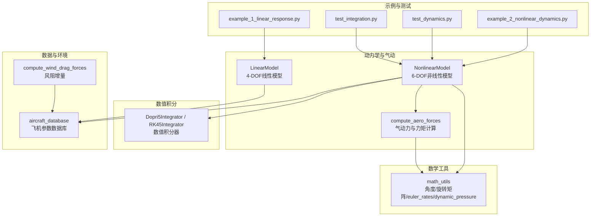
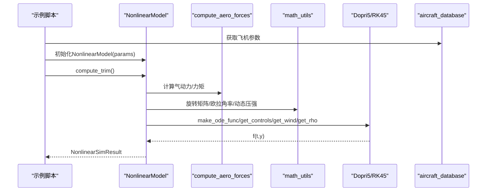
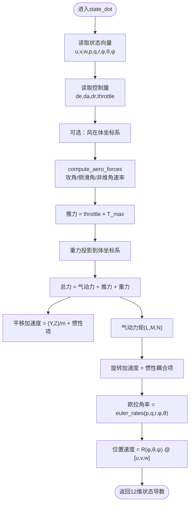
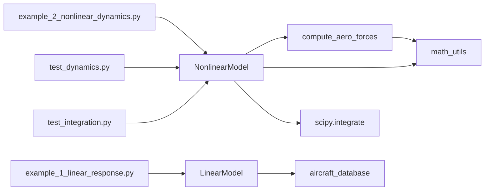

# 非线性气动模型

<cite>
**本文引用的文件**
- [nonlinear_model.py](file://src/dynamics/nonlinear_model.py)
- [aerodynamics.py](file://src/dynamics/aerodynamics.py)
- [linear_model.py](file://src/dynamics/linear_model.py)
- [integrator.py](file://src/simulation/integrator.py)
- [math_utils.py](file://src/utils/math_utils.py)
- [aircraft_database.py](file://src/models/aircraft_database.py)
- [aerodynamic_forces.py](file://src/environment/aerodynamic_forces.py)
- [example_2_nonlinear_dynamics.py](file://examples/example_2_nonlinear_dynamics.py)
- [example_1_linear_response.py](file://examples/example_1_linear_response.py)
- [test_dynamics.py](file://tests/test_dynamics.py)
- [test_integration.py](file://tests/test_integration.py)
</cite>

## 目录
1. [引言](#引言)
2. [项目结构](#项目结构)
3. [核心组件](#核心组件)
4. [架构总览](#架构总览)
5. [详细组件分析](#详细组件分析)
6. [依赖关系分析](#依赖关系分析)
7. [性能考量](#性能考量)
8. [故障排查指南](#故障排查指南)
9. [结论](#结论)
10. [附录](#附录)

## 引言
本技术文档围绕FixedWingSimulator中的6自由度（6-DOF）非线性气动模型展开，系统阐述其数学基础、数值求解方法、状态向量构成、气动计算流程、旋转与平移运动方程、风阻增量计算以及与线性模型的对比验证。文档同时给出数值积分器选择与实现要点，并提供仿真结果可视化与性能评估建议，帮助读者从理论到实践全面掌握该非线性动力学引擎。

## 项目结构
本项目采用模块化设计，非线性气动模型位于dynamics子包中，配合数学工具、集成器、数据库与示例脚本形成完整仿真链路：
- 动力学与气动：nonlinear_model.py、aerodynamics.py、linear_model.py
- 数值积分：integrator.py
- 数学工具：math_utils.py
- 飞机参数数据库：aircraft_database.py
- 环境风阻增量：aerodynamic_forces.py
- 示例与测试：examples/*、tests/*

图表来源
- [nonlinear_model.py](file://src/dynamics/nonlinear_model.py#L104-L386)
- [aerodynamics.py](file://src/dynamics/aerodynamics.py#L35-L148)
- [linear_model.py](file://src/dynamics/linear_model.py#L107-L319)
- [integrator.py](file://src/simulation/integrator.py#L17-L108)
- [math_utils.py](file://src/utils/math_utils.py#L43-L124)
- [aircraft_database.py](file://src/models/aircraft_database.py#L143-L166)
- [aerodynamic_forces.py](file://src/environment/aerodynamic_forces.py#L13-L54)
- [example_1_linear_response.py](file://examples/example_1_linear_response.py#L1-L206)
- [example_2_nonlinear_dynamics.py](file://examples/example_2_nonlinear_dynamics.py#L1-L215)
- [test_dynamics.py](file://tests/test_dynamics.py#L1-L336)
- [test_integration.py](file://tests/test_integration.py#L1-L391)

章节来源
- [nonlinear_model.py](file://src/dynamics/nonlinear_model.py#L1-L386)
- [aerodynamics.py](file://src/dynamics/aerodynamics.py#L1-L148)
- [linear_model.py](file://src/dynamics/linear_model.py#L1-L319)
- [integrator.py](file://src/simulation/integrator.py#L1-L108)
- [math_utils.py](file://src/utils/math_utils.py#L1-L124)
- [aircraft_database.py](file://src/models/aircraft_database.py#L1-L183)
- [aerodynamic_forces.py](file://src/environment/aerodynamic_forces.py#L1-L54)
- [example_1_linear_response.py](file://examples/example_1_linear_response.py#L1-L206)
- [example_2_nonlinear_dynamics.py](file://examples/example_2_nonlinear_dynamics.py#L1-L215)
- [test_dynamics.py](file://tests/test_dynamics.py#L1-L336)
- [test_integration.py](file://tests/test_integration.py#L1-L391)

## 核心组件
- 6-DOF非线性模型（NonlinearModel）
  - 提供三类能力：计算配平（compute_trim）、状态导数（state_dot）、批量仿真（simulate）
  - 状态向量维度为12维，包含机体速度、角速度、欧拉角、NED位置
  - 气动力与力矩通过compute_aero_forces计算，结合推进力与重力，求解平移与旋转加速度
- 气动计算（compute_aero_forces）
  - 基于攻角、侧滑角、非维角速率，计算升力、阻力、俯仰力矩及侧向力、滚转力矩、偏航力矩
  - 支持风速输入（风在体坐标系），动态压强q_bar用于归一化
- 线性模型（LinearModel）
  - 4-DOF纵向线性化模型，便于模态分析与开环脉冲响应
- 数值积分器（Dopri5Integrator / RK45Integrator）
  - 提供自适应步长的单步与批处理积分接口，满足实时与离线需求
- 数学工具（math_utils）
  - 包含旋转矩阵、欧拉角率转换、攻角/侧滑角计算、动态压强等
- 飞机参数数据库（aircraft_database）
  - 提供7种无人机的标准几何、气动与惯性参数，支持派生参数注入
- 风阻增量（compute_wind_drag_forces）
  - 计算相对风引起的附加阻力，用于扰动/敏感性分析

章节来源
- [nonlinear_model.py](file://src/dynamics/nonlinear_model.py#L104-L386)
- [aerodynamics.py](file://src/dynamics/aerodynamics.py#L35-L148)
- [linear_model.py](file://src/dynamics/linear_model.py#L107-L319)
- [integrator.py](file://src/simulation/integrator.py#L17-L108)
- [math_utils.py](file://src/utils/math_utils.py#L43-L124)
- [aircraft_database.py](file://src/models/aircraft_database.py#L143-L166)
- [aerodynamic_forces.py](file://src/environment/aerodynamic_forces.py#L13-L54)

## 架构总览
下图展示6-DOF非线性模型在仿真管线中的位置与交互关系。

图表来源
- [example_2_nonlinear_dynamics.py](file://examples/example_2_nonlinear_dynamics.py#L89-L103)
- [nonlinear_model.py](file://src/dynamics/nonlinear_model.py#L132-L154)
- [nonlinear_model.py](file://src/dynamics/nonlinear_model.py#L261-L281)
- [nonlinear_model.py](file://src/dynamics/nonlinear_model.py#L287-L385)
- [aerodynamics.py](file://src/dynamics/aerodynamics.py#L35-L148)
- [math_utils.py](file://src/utils/math_utils.py#L43-L124)
- [aircraft_database.py](file://src/models/aircraft_database.py#L143-L166)

## 详细组件分析

### 6-DOF非线性动力学模型（数学基础与实现）
- 状态向量（12维，NED框架）
  - 机体速度：u, v, w（m/s）
  - 角速度：p, q, r（rad/s）
  - 欧拉角：φ, θ, ψ（rad）
  - NED位置：x_N, x_E, x_D（m，正向下）
- 平移运动方程
  - 由牛顿第二定律在体坐标系给出：加速度 = 控制力/质量 + 惯性项
  - 本实现采用非线性形式，未做小角度近似
- 旋转运动方程
  - 使用欧拉角与惯性张量耦合关系，考虑Ixz耦合项
  - 分母为惯性张量行列式，避免奇异
- 气动力与力矩
  - 通过compute_aero_forces计算，包含纵向与横向方向系数
  - 支持风速输入（风在体坐标系），动态压强q_bar随空速变化
- 推进力与重力
  - 推力按油门比例线性分配，基于质量与重力加速度设定推重比
  - 重力投影至体坐标系，方向与NED一致
- 位置与姿态演化
  - 欧拉角率由euler_rates计算，避免θ接近±90°时的奇异性
  - 位置由体速度经旋转矩阵映射到NED

图表来源
- [nonlinear_model.py](file://src/dynamics/nonlinear_model.py#L160-L255)
- [aerodynamics.py](file://src/dynamics/aerodynamics.py#L35-L148)
- [math_utils.py](file://src/utils/math_utils.py#L43-L100)

章节来源
- [nonlinear_model.py](file://src/dynamics/nonlinear_model.py#L104-L386)
- [aerodynamics.py](file://src/dynamics/aerodynamics.py#L35-L148)
- [math_utils.py](file://src/utils/math_utils.py#L43-L124)

### 非线性状态向量与物理意义
- 速度与角速度：描述机体在自身坐标系内的运动
- 欧拉角：描述机体相对于NED的取向
- NED位置：描述飞行器在地理坐标系中的位置
- 12维状态向量确保了平移与旋转的完全耦合，适合大角度/非线性仿真

章节来源
- [nonlinear_model.py](file://src/dynamics/nonlinear_model.py#L4-L16)

### 非线性微分方程组的建立过程
- 平移运动方程
  - 在体坐标系中，加速度表达式包含惯性项（交叉乘积项）与外力
  - 本实现直接使用非线性形式，不进行小角度近似
- 旋转运动方程
  - 使用欧拉角与惯性张量的耦合关系，考虑Ixz耦合
  - 通过惯性张量行列式保证数值稳定性
- 气动系数与参数
  - 升力、阻力、俯仰力矩：纵向系数（CL、CD、Cm）与非维角速率q̂
  - 侧向力、滚转力矩、偏航力矩：横向系数（CY、Cl、Cn）与非维角速率p̂, r̂
  - 攻角与侧滑角：通过角度函数计算，避免除零与越界

章节来源
- [nonlinear_model.py](file://src/dynamics/nonlinear_model.py#L160-L255)
- [aerodynamics.py](file://src/dynamics/aerodynamics.py#L90-L126)

### 气动力与力矩的非线性计算
- 攻角与侧滑角
  - 攻角：arctan2(w, u)，侧滑角：arcsin(v / V)，均具备数值保护
- 非维角速率
  - p̂ = p·b / (2·U0)，q̂ = q·c / (2·U0)，r̂ = r·b / (2·U0)
- 气动系数
  - 纵向：CL、CD、Cm为α、q̂、de的线性组合
  - 横向：CY、Cl、Cn为β、p̂、r̂、da、dr的线性组合
- 力与力矩
  - X、Y、Z：基于q_bar与S的非线性组合
  - L、M、N：基于q_bar、S、b、c的非线性组合

章节来源
- [aerodynamics.py](file://src/dynamics/aerodynamics.py#L35-L148)
- [math_utils.py](file://src/utils/math_utils.py#L107-L124)

### 数值积分方法的选择与实现
- 单步积分（实时）
  - Dopri5Integrator：基于scipy.integrate.ode的dopri5，支持自适应步长与单步推进
  - 适用于需要逐步推进的实时场景（如UI或嵌入式）
- 批处理积分（离线）
  - RK45Integrator：基于scipy.integrate.solve_ivp（RK45），适合批量仿真与后处理
  - 本项目在NonlinearModel.simulate中使用solve_ivp进行批量求解
- 优缺点比较
  - Dopri5：自适应步长，内存占用低，适合实时；但需注意失败抛错
  - RK45：精度可控，适合离线分析；对长时间积分更稳定

章节来源
- [integrator.py](file://src/simulation/integrator.py#L17-L108)
- [nonlinear_model.py](file://src/dynamics/nonlinear_model.py#L287-L351)

### 非线性模型的验证与与线性模型对比
- 验证方法
  - 配平收敛性：compute_trim返回有限值且在合理范围内
  - 状态导数：在配平点附近导数应接近零
  - 短时仿真：3秒内不发散，高度保持为正值
  - 全部7种机型均可成功配平
- 与线性模型对比
  - 线性模型（4-DOF纵向）：提供A、B矩阵与模态分析（短周期、长周期）
  - 非线性模型：覆盖全6自由度，适合大角度/强非线性场景
  - 示例脚本对比：非线性开环与闭环（PID）对比，线性开环与闭环对比

章节来源
- [test_dynamics.py](file://tests/test_dynamics.py#L261-L336)
- [test_integration.py](file://tests/test_integration.py#L70-L218)
- [linear_model.py](file://src/dynamics/linear_model.py#L107-L319)
- [example_1_linear_response.py](file://examples/example_1_linear_response.py#L1-L206)
- [example_2_nonlinear_dynamics.py](file://examples/example_2_nonlinear_dynamics.py#L1-L215)

### 风阻增量计算（附加气动影响）
- compute_wind_drag_forces
  - 计算相对风引起的附加阻力，采用简单阻力模型
  - 适用于扰动/敏感性分析，辅助理解风对气动的影响

章节来源
- [aerodynamic_forces.py](file://src/environment/aerodynamic_forces.py#L13-L54)

## 依赖关系分析
- NonlinearModel依赖
  - aerodynamics.compute_aero_forces：气动计算
  - utils.math_utils：旋转矩阵、欧拉角率、攻角/侧滑角、动态压强
  - scipy.integrate：solve_ivp（批量）与ode（单步）
- aerodynamics依赖
  - utils.math_utils.angle_of_attack、sideslip_angle、dynamic_pressure
- LinearModel依赖
  - aircraft_database参数注入（U0、ρ、q_bar）
- 示例与测试
  - 示例脚本调用NonlinearModel与LinearModel进行对比
  - 测试覆盖坐标变换、气动一致性、线性模型矩阵形状与模态、非线性模型配平与仿真

图表来源
- [nonlinear_model.py](file://src/dynamics/nonlinear_model.py#L27-L28)
- [aerodynamics.py](file://src/dynamics/aerodynamics.py#L13)
- [linear_model.py](file://src/dynamics/linear_model.py#L114-L123)
- [aircraft_database.py](file://src/models/aircraft_database.py#L143-L166)
- [example_1_linear_response.py](file://examples/example_1_linear_response.py#L34-L36)
- [example_2_nonlinear_dynamics.py](file://examples/example_2_nonlinear_dynamics.py#L34-L36)
- [test_dynamics.py](file://tests/test_dynamics.py#L43-L44)
- [test_integration.py](file://tests/test_integration.py#L32-L34)

章节来源
- [nonlinear_model.py](file://src/dynamics/nonlinear_model.py#L27-L28)
- [aerodynamics.py](file://src/dynamics/aerodynamics.py#L13)
- [linear_model.py](file://src/dynamics/linear_model.py#L114-L123)
- [aircraft_database.py](file://src/models/aircraft_database.py#L143-L166)
- [example_1_linear_response.py](file://examples/example_1_linear_response.py#L34-L36)
- [example_2_nonlinear_dynamics.py](file://examples/example_2_nonlinear_dynamics.py#L34-L36)
- [test_dynamics.py](file://tests/test_dynamics.py#L43-L44)
- [test_integration.py](file://tests/test_integration.py#L32-L34)

## 性能考量
- 数值稳定性
  - euler_rates在θ接近±90°时采用小ε保护，避免分母趋零
  - dynamic_pressure对极小空速进行数值夹紧，防止q_bar过小导致不稳定
- 计算复杂度
  - state_dot每步包含三角函数、矩阵乘法与系数查表，整体为O(1)
  - solve_ivp默认rtol/atol较高，保证精度；可通过max_step调节步长
- 实时性
  - Dopri5Integrator适合实时单步推进，内存占用低
  - 对于高采样率或长时程，建议使用RK45Integrator并适当放宽容差

[本节为通用指导，无需特定文件来源]

## 故障排查指南
- 非线性模型
  - 配平失败：检查参数是否合理（质量、面积、惯性），确认线性求解器异常分支
  - 导数发散：检查风速输入、控制量范围、初始条件是否过大
  - 角度奇异性：当θ接近±90°时，euler_rates采用ε保护；若仍异常，检查姿态初始化
- 线性模型
  - A/B矩阵非有限：检查参数是否缺失或异常
  - 模态不稳定：核对稳定性判据（实部<0），必要时调整参数
- 积分器
  - Dopri5失败：查看错误信息，尝试减小步长或检查f(t,y)连续性
  - RK45耗时：适当增大max_step或降低n_points

章节来源
- [nonlinear_model.py](file://src/dynamics/nonlinear_model.py#L132-L154)
- [nonlinear_model.py](file://src/dynamics/nonlinear_model.py#L240-L243)
- [math_utils.py](file://src/utils/math_utils.py#L87-L100)
- [linear_model.py](file://src/dynamics/linear_model.py#L206-L252)
- [integrator.py](file://src/simulation/integrator.py#L54-L56)

## 结论
本非线性气动模型以严谨的6-DOF方程为基础，结合精确的气动系数计算与数值积分策略，在保证精度的同时兼顾实时性与稳定性。通过与线性模型的对比与多机型验证，证明了其在不同飞行条件下的可靠性。建议在实际应用中根据任务需求选择合适的积分器，并结合风阻增量与模态分析进行深入验证。

[本节为总结性内容，无需特定文件来源]

## 附录
- 仿真结果可视化与性能评估
  - 示例脚本输出CSV与PNG，便于对比开环与闭环响应
  - 可基于输出数据计算最大偏差、稳态误差、超调量等指标
- 参数来源与扩展
  - 飞机参数来自aircraft_database，支持7种机型
  - 可通过overrides扩展参数，验证不同配置对稳定性与响应的影响

章节来源
- [example_1_linear_response.py](file://examples/example_1_linear_response.py#L112-L123)
- [example_2_nonlinear_dynamics.py#L110-L121)
- [aircraft_database.py](file://src/models/aircraft_database.py#L143-L166)