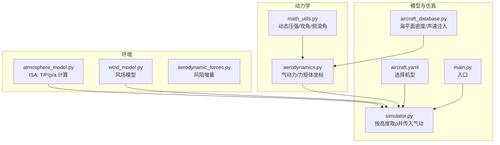
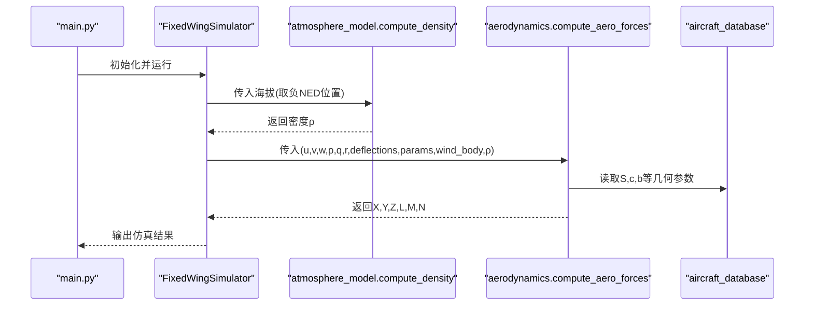
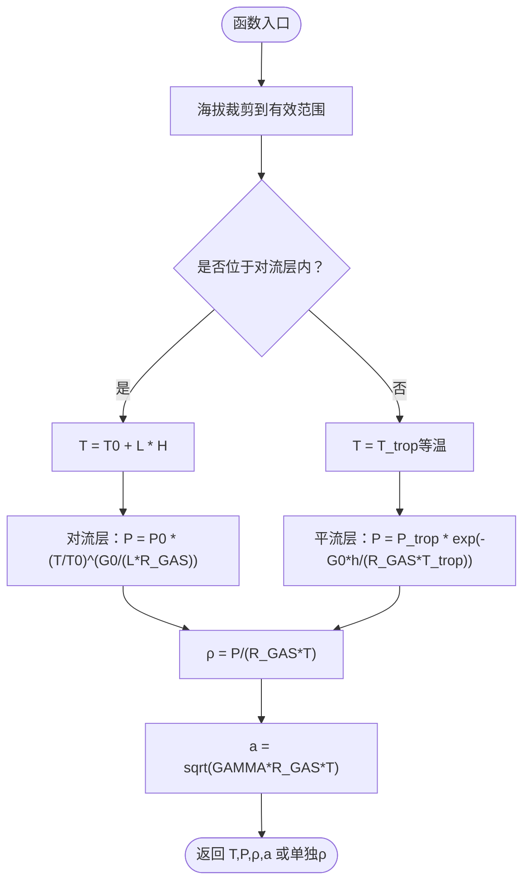
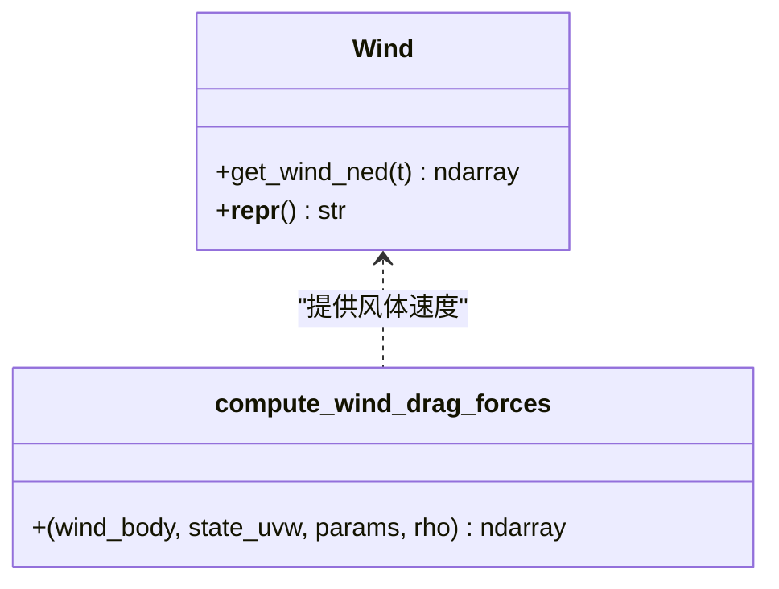
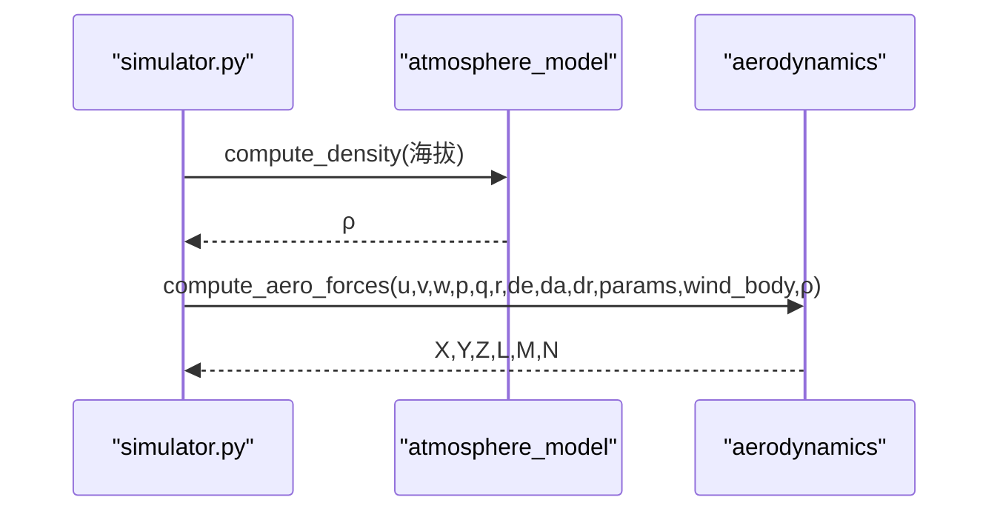
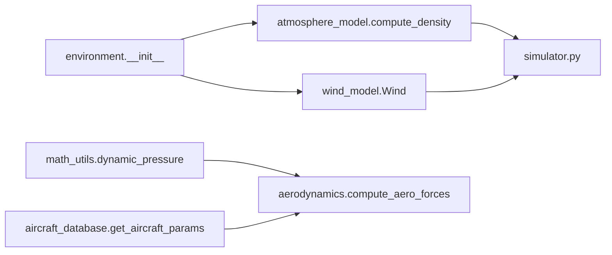

# 大气模型

<cite>
**本文引用的文件**   
- [src/environment/atmosphere_model.py](file://src/environment/atmosphere_model.py)
- [src/environment/__init__.py](file://src/environment/__init__.py)
- [src/dynamics/aerodynamics.py](file://src/dynamics/aerodynamics.py)
- [src/environment/aerodynamic_forces.py](file://src/environment/aerodynamic_forces.py)
- [src/utils/math_utils.py](file://src/utils/math_utils.py)
- [src/models/aircraft_database.py](file://src/models/aircraft_database.py)
- [src/simulation/simulator.py](file://src/simulation/simulator.py)
- [config/aircraft.yaml](file://config/aircraft.yaml)
- [main.py](file://main.py)
</cite>

## 目录
1. [引言](#引言)
2. [项目结构](#项目结构)
3. [核心组件](#核心组件)
4. [架构总览](#架构总览)
5. [详细组件分析](#详细组件分析)
6. [依赖关系分析](#依赖关系分析)
7. [性能考量](#性能考量)
8. [故障排查指南](#故障排查指南)
9. [结论](#结论)
10. [附录](#附录)

## 引言
本文件面向FixedWingSimulator中的大气模型，系统化阐述国际标准大气（ISA）的实现细节与工程应用。内容覆盖：
- 标准海平面条件与递减率定义
- 温度、压力、密度随海拔变化的分段函数与适用高度范围
- 空气粘性系数与音速的计算路径
- 大气模型在不同高度范围内的适用性与精度边界
- 实时计算函数与插值方法（当前实现为解析公式）
- 与气动计算的耦合关系（对升力、阻力与力矩的影响）
- 典型高度层的大气参数表与可视化建议
- 参数验证方法与误差分析思路

## 项目结构
与“大气模型”直接相关的核心模块与文件如下：
- 环境模块：atmosphere_model（ISA实现）、wind_model（风场）、aerodynamic_forces（风阻增量）
- 动力学模块：aerodynamics（气动力与力矩计算）
- 工具模块：math_utils（动态压强、攻角、侧滑角等）
- 飞机数据库：aircraft_database（注入海平面密度与声速）
- 模拟器：simulator（在积分循环中按高度调用密度计算）
- 配置：aircraft.yaml（选择飞机类型）

**图示来源**
- [src/environment/atmosphere_model.py](file://src/environment/atmosphere_model.py#L1-L77)
- [src/environment/wind_model.py](file://src/environment/wind_model.py#L1-L113)
- [src/environment/aerodynamic_forces.py](file://src/environment/aerodynamic_forces.py#L1-L54)
- [src/dynamics/aerodynamics.py](file://src/dynamics/aerodynamics.py#L1-L148)
- [src/utils/math_utils.py](file://src/utils/math_utils.py#L1-L124)
- [src/models/aircraft_database.py](file://src/models/aircraft_database.py#L1-L183)
- [src/simulation/simulator.py](file://src/simulation/simulator.py#L1-L642)
- [config/aircraft.yaml](file://config/aircraft.yaml#L1-L13)
- [main.py](file://main.py#L1-L145)

**章节来源**
- [src/environment/atmosphere_model.py](file://src/environment/atmosphere_model.py#L1-L77)
- [src/environment/__init__.py](file://src/environment/__init__.py#L1-L16)
- [src/simulation/simulator.py](file://src/simulation/simulator.py#L329-L338)

## 核心组件
- 国际标准大气（ISA）实现：提供温度、压力、密度与音速的解析计算，覆盖对流层至下平流层。
- 风场模型：支持静风、常值风、正弦叠加与随机正弦叠加风场，用于相对速度合成。
- 气动计算：基于体坐标下的动态压强与攻角/侧滑角，计算升力、阻力与力矩。
- 飞机参数注入：从数据库注入海平面密度与声速，供气动模型使用。

**章节来源**
- [src/environment/atmosphere_model.py](file://src/environment/atmosphere_model.py#L10-L21)
- [src/environment/wind_model.py](file://src/environment/wind_model.py#L18-L113)
- [src/dynamics/aerodynamics.py](file://src/dynamics/aerodynamics.py#L35-L148)
- [src/models/aircraft_database.py](file://src/models/aircraft_database.py#L14-L21)

## 架构总览
ISA模型在仿真主循环中被调用以获取当前高度处的空气密度，并作为输入传递给气动计算模块。风场模型提供相对速度修正，最终由非线性动力学模型求解状态微分方程。

**图示来源**
- [src/simulation/simulator.py](file://src/simulation/simulator.py#L329-L338)
- [src/environment/atmosphere_model.py](file://src/environment/atmosphere_model.py#L48-L52)
- [src/dynamics/aerodynamics.py](file://src/dynamics/aerodynamics.py#L35-L148)
- [src/models/aircraft_database.py](file://src/models/aircraft_database.py#L143-L166)
- [main.py](file://main.py#L114-L141)

## 详细组件分析

### 组件A：国际标准大气（ISA）模型
- 覆盖范围：对流层（0–11 km）与下平流层（11–20 km），超出此范围的行为未在代码中显式约束。
- 物理常数：重力加速度、气体常数、绝热指数、海平面温度、压力、密度、对流层递减率与对流层顶高度。
- 温度函数：对流层线性递减，平流层等温。
- 压力函数：对流层采用温度代入幂律，平流层采用指数衰减。
- 密度与音速：通过理想气体状态方程与绝热关系推导。

**图示来源**
- [src/environment/atmosphere_model.py](file://src/environment/atmosphere_model.py#L24-L76)

**章节来源**
- [src/environment/atmosphere_model.py](file://src/environment/atmosphere_model.py#L10-L21)
- [src/environment/atmosphere_model.py](file://src/environment/atmosphere_model.py#L24-L58)
- [src/environment/atmosphere_model.py](file://src/environment/atmosphere_model.py#L61-L76)

### 组件B：风场与相对速度
- 风场类型：静风、固定风、正弦叠加风、随机正弦叠加风。
- 相对速度：在气动计算前，从NED风向体坐标变换，得到风体坐标，再与机体速度合成，得到相对空速。
- 风阻增量：提供一个简化的风阻估算，用于扰动/灵敏度分析。

**图示来源**
- [src/environment/wind_model.py](file://src/environment/wind_model.py#L18-L113)
- [src/environment/aerodynamic_forces.py](file://src/environment/aerodynamic_forces.py#L13-L54)

**章节来源**
- [src/environment/wind_model.py](file://src/environment/wind_model.py#L18-L113)
- [src/environment/aerodynamic_forces.py](file://src/environment/aerodynamic_forces.py#L13-L54)

### 组件C：气动计算与ISA耦合
- 输入：体速度(u,v,w)、角速度(p,q,r)、舵面偏角(de,da,dr)、风体速度、密度ρ、飞机参数(S,c,b等)。
- 关键步骤：计算相对空速、攻角与侧滑角、动态压强、无量纲力系数、有量纲力与力矩。
- ISA耦合点：密度ρ来自atmosphere_model.compute_density；声速a用于特征速度U0的推导（数据库）。

**图示来源**
- [src/simulation/simulator.py](file://src/simulation/simulator.py#L329-L338)
- [src/environment/atmosphere_model.py](file://src/environment/atmosphere_model.py#L48-L52)
- [src/dynamics/aerodynamics.py](file://src/dynamics/aerodynamics.py#L35-L148)

**章节来源**
- [src/dynamics/aerodynamics.py](file://src/dynamics/aerodynamics.py#L35-L148)
- [src/utils/math_utils.py](file://src/utils/math_utils.py#L107-L124)
- [src/models/aircraft_database.py](file://src/models/aircraft_database.py#L143-L166)

### 组件D：飞机参数注入与声速
- 数据库在注入阶段计算海平面密度与声速，并将特征速度U0与动态压强q_bar注入参数字典，供气动模型使用。
- 这保证了不同飞机在相同无量纲参数下的可比性。

**章节来源**
- [src/models/aircraft_database.py](file://src/models/aircraft_database.py#L14-L21)
- [src/models/aircraft_database.py](file://src/models/aircraft_database.py#L143-L166)

## 依赖关系分析
- atmosphere_model被simulator在每一步积分中调用，以海拔为输入获取ρ。
- aerodynamics依赖math_utils提供的动态压强、攻角与侧滑角，同时依赖aircraft_database提供的几何参数。
- environment包导出atmosphere_model与wind_model接口，便于上层模块统一导入。

**图示来源**
- [src/environment/atmosphere_model.py](file://src/environment/atmosphere_model.py#L48-L52)
- [src/simulation/simulator.py](file://src/simulation/simulator.py#L329-L338)
- [src/dynamics/aerodynamics.py](file://src/dynamics/aerodynamics.py#L76-L77)
- [src/utils/math_utils.py](file://src/utils/math_utils.py#L121-L124)
- [src/models/aircraft_database.py](file://src/models/aircraft_database.py#L143-L166)
- [src/environment/__init__.py](file://src/environment/__init__.py#L3-L8)

**章节来源**
- [src/environment/__init__.py](file://src/environment/__init__.py#L3-L8)
- [src/simulation/simulator.py](file://src/simulation/simulator.py#L329-L338)

## 性能考量
- 计算复杂度：ISA各函数均为常数时间复杂度，开销极低，适合高频调用。
- 数值稳定性：温度函数对海拔进行裁剪，避免极端输入；动态压强对小速度进行数值夹紧，防止高马赫或接近零速度时的不稳定。
- 并行与批量：ISA函数可向量化处理多个高度，便于批量渲染或离线查表。

[本节为通用指导，不直接分析具体文件]

## 故障排查指南
- 高度越界：若海拔远超ISA覆盖范围（如>20 km），pressure/temperature/density可能不再符合实际，需在上层逻辑中限制或切换模型。
- 零速度与小速度：当相对空速过小，动态压强会夹紧，导致气动力很小，注意检查风体速度与相对空速合成。
- 风场类型错误：Wind构造参数大小写与枚举不符会导致异常，应检查输入字符串。
- 单位一致性：确保海拔单位为米，速度单位为m/s，密度单位为kg/m³，压力为Pa。

**章节来源**
- [src/environment/atmosphere_model.py](file://src/environment/atmosphere_model.py#L30-L34)
- [src/utils/math_utils.py](file://src/utils/math_utils.py#L121-L124)
- [src/environment/wind_model.py](file://src/environment/wind_model.py#L39-L41)

## 结论
本项目采用简洁高效的ISA解析模型，覆盖主流飞行高度区间，与气动计算紧密耦合。通过在仿真主循环中按高度取密度并传入气动模型，实现了稳定的6自由度仿真基础。对于更高空域或更复杂大气条件，可在现有接口基础上扩展。

[本节为总结，不直接分析具体文件]

## 附录

### A. ISA物理参数与适用范围
- 海平面条件：温度、压力、密度、重力加速度、气体常数、绝热指数。
- 对流层：线性递减率，顶高约11 km；平流层：等温。
- 适用高度：对流层至下平流层；超出范围需另行建模。

**章节来源**
- [src/environment/atmosphere_model.py](file://src/environment/atmosphere_model.py#L10-L21)

### B. 实时计算函数与调用路径
- compute_temperature/pressure/density/speed_of_sound/atmosphere
- 在simulator每步积分中调用compute_density(海拔)，并将ρ传入compute_aero_forces

**章节来源**
- [src/environment/atmosphere_model.py](file://src/environment/atmosphere_model.py#L24-L76)
- [src/simulation/simulator.py](file://src/simulation/simulator.py#L329-L338)

### C. 与气动计算的关系
- 密度ρ直接影响动态压强与气动力/力矩大小；音速影响特征速度U0与马赫数估计。
- 攻角与侧滑角决定升阻分布与方向力；舵面偏角引入控制力矩。

**章节来源**
- [src/dynamics/aerodynamics.py](file://src/dynamics/aerodynamics.py#L76-L126)
- [src/utils/math_utils.py](file://src/utils/math_utils.py#L107-L118)

### D. 典型高度层参数表（示意）
以下为典型高度层的参数示意（来源于ISA模型与调用方式）。实际数值请以atmosphere_model实现为准。

- 海平面（0 m）：温度、压力、密度、音速
- 对流层顶（11 km）：温度、压力、密度、音速
- 平流层（15 km）：温度、压力、密度、音速
- 平流层顶（20 km）：温度、压力、密度、音速

注：此处为概念性表格，不直接对应具体数值，建议通过atmosphere函数或单个函数调用生成。

[本节为概念性内容，不直接分析具体文件]

### E. 参数验证与误差分析
- 验证方法：与标准ISA手册或权威库对比关键高度层数值；检查温度、压力、密度的连续性与单调性。
- 误差来源：高度截断（>20 km）、数值舍入误差、风场建模近似。
- 建议：在关键任务中增加边界检查与输出日志；必要时引入插值表或更高阶模型。

[本节为通用指导，不直接分析具体文件]