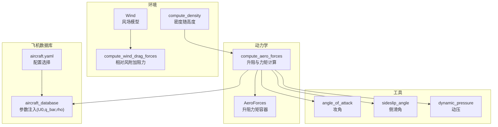
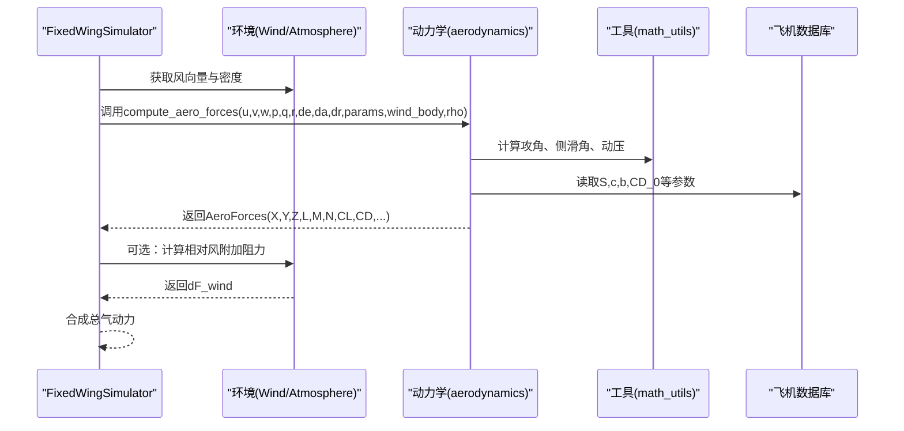
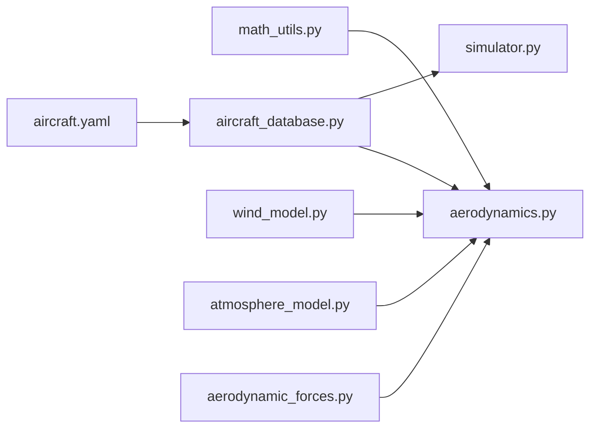

# 气动阻力计算

<cite>
**本文引用的文件**
- [aerodynamics.py](file://src/dynamics/aerodynamics.py)
- [aerodynamic_forces.py](file://src/environment/aerodynamic_forces.py)
- [aircraft_database.py](file://src/models/aircraft_database.py)
- [aircraft.yaml](file://config/aircraft.yaml)
- [math_utils.py](file://src/utils/math_utils.py)
- [wind_model.py](file://src/environment/wind_model.py)
- [atmosphere_model.py](file://src/environment/atmosphere_model.py)
- [simulator.py](file://src/simulation/simulator.py)
- [test_dynamics.py](file://tests/test_dynamics.py)
- [example_4_wind_resistance.py](file://examples/example_4_wind_resistance.py)
</cite>

## 目录
1. [简介](#简介)
2. [项目结构](#项目结构)
3. [核心组件](#核心组件)
4. [架构总览](#架构总览)
5. [详细组件分析](#详细组件分析)
6. [依赖关系分析](#依赖关系分析)
7. [性能考量](#性能考量)
8. [故障排查指南](#故障排查指南)
9. [结论](#结论)
10. [附录](#附录)

## 简介
本技术文档聚焦于FixedWingSimulator中固定翼飞机的气动阻力计算模块，系统阐述气动阻力的物理原理、数学模型与实现细节，覆盖摩擦阻力、压差阻力与诱导阻力的组成与计算方法；解释阻力系数与迎角、马赫数的关系；说明压缩性与粘性效应对不同飞行条件的影响；阐述气动阻力与飞行速度、高度、飞机配置的关系；提供典型飞行状态下的阻力计算示例与参数表；解释模型的简化假设与适用范围；给出数值验证方法与实验数据对比思路；说明仿真中的计算开销与优化策略；并提供模型扩展与定制方法。

## 项目结构
气动阻力计算涉及以下关键模块：
- 动力学层：计算升阻力与力矩（升力系数、阻力系数、侧力系数及滚转、俯仰、偏航力矩系数）
- 环境层：风场与大气模型（风速向量、密度随高度变化）
- 工具层：几何与角度计算（攻角、侧滑角、动压）
- 飞机数据库：几何与气动参数（机翼面积、弦长、翼展、零升阻力系数等）

图表来源
- [aerodynamics.py](file://src/dynamics/aerodynamics.py#L35-L147)
- [aerodynamic_forces.py](file://src/environment/aerodynamic_forces.py#L13-L53)
- [aircraft_database.py](file://src/models/aircraft_database.py#L143-L166)
- [aircraft.yaml](file://config/aircraft.yaml#L1-L13)
- [math_utils.py](file://src/utils/math_utils.py#L107-L123)
- [wind_model.py](file://src/environment/wind_model.py#L18-L112)
- [atmosphere_model.py](file://src/environment/atmosphere_model.py#L48-L58)

章节来源
- [aerodynamics.py](file://src/dynamics/aerodynamics.py#L1-L148)
- [aircraft_database.py](file://src/models/aircraft_database.py#L1-L183)
- [aircraft.yaml](file://config/aircraft.yaml#L1-L13)

## 核心组件
- 升阻力与力矩计算函数：根据速度、角速率、控制面偏角与飞机参数，计算非维升阻系数与力矩系数，并转换为体轴力与力矩。
- 风附加阻力：基于相对风速估算额外的体轴阻力增量，用于扰动/敏感性分析。
- 角度与动压工具：攻角、侧滑角与动压的数值实现。
- 大气与风场：密度随高度变化；风场类型支持无风、定常、正弦叠加与随机正弦扰动。
- 飞机参数：从数据库读取几何与气动参数，并注入基准空速、密度与动压。

章节来源
- [aerodynamics.py](file://src/dynamics/aerodynamics.py#L35-L147)
- [aerodynamic_forces.py](file://src/environment/aerodynamic_forces.py#L13-L53)
- [math_utils.py](file://src/utils/math_utils.py#L107-L123)
- [aircraft_database.py](file://src/models/aircraft_database.py#L143-L166)
- [wind_model.py](file://src/environment/wind_model.py#L18-L112)
- [atmosphere_model.py](file://src/environment/atmosphere_model.py#L48-L58)

## 架构总览
气动阻力计算在仿真中的调用流程如下：

图表来源
- [simulator.py](file://src/simulation/simulator.py#L130-L200)
- [aerodynamics.py](file://src/dynamics/aerodynamics.py#L35-L147)
- [math_utils.py](file://src/utils/math_utils.py#L107-L123)
- [aircraft_database.py](file://src/models/aircraft_database.py#L143-L166)
- [aerodynamic_forces.py](file://src/environment/aerodynamic_forces.py#L13-L53)

## 详细组件分析

### 数学模型与物理原理
- 动压定义：q̄ = ½ρV²，是升阻与力矩的基础。
- 攻角与侧滑角：α = arctan2(w, u)，β = arcsin(v/V)，用于确定气流方向。
- 非维系数线性组合：
  - 纵向：CL = f(α, q̂, δe)，CD = f(α, q̂, δe)
  - 侧向：CY = f(β, p̂, r̂, δa, δr)，Cl = f(β, p̂, r̂, δa, δr)，Cn = f(β, p̂, r̂, δa, δr)
  - 其中 q̂ = qc/(2U₀)，p̂ = pb/(2U₀)，r̂ = rb/(2U₀)，U₀为基准空速。
- 体轴力与力矩：
  - X = q̄S(-CD cos α + CL sin α)
  - Y = q̄S · CY
  - Z = q̄S(-CL cos α - CD sin α)
  - L = q̄Sb · Cl，M = q̄Sc · Cm，N = q̄Sb · Cn

该模型将摩擦阻力与压差阻力统一在CD中，诱导阻力通过纵向气动导纳项（如CL_q）体现，侧向/方向性则通过CY、Cl、Cn建模。

章节来源
- [aerodynamics.py](file://src/dynamics/aerodynamics.py#L35-L147)
- [math_utils.py](file://src/utils/math_utils.py#L107-L123)

### 阻力系数与迎角、马赫数的关系
- 迎角相关性：CD通常随α线性增加，且在失速前保持近似线性；CL随α线性增加。
- 控制面影响：升降舵偏角对CD与CL有直接贡献，模型中体现为CD_deltae与CL_deltae项。
- 马赫数与压缩性：基准空速U₀由Mach × a(T)决定，其中a为音速；U₀参与无量纲化（q̂、p̂、r̂），间接反映压缩性对气动导纳的影响。
- 粘性效应：通过CD_0与CD_alpha体现，随攻角与流动状态变化。

章节来源
- [aircraft_database.py](file://src/models/aircraft_database.py#L143-L166)
- [aerodynamics.py](file://src/dynamics/aerodynamics.py#L96-L99)

### 压缩性与粘性效应
- 压缩性：通过U₀与q̄间接建模，无量纲角速率项反映高Ma时的气动导纳变化。
- 粘性：通过CD_0与CD_alpha体现，随攻角与速度变化；在低速小攻角下主导摩擦阻力。

章节来源
- [aircraft_database.py](file://src/models/aircraft_database.py#L143-L166)
- [aerodynamics.py](file://src/dynamics/aerodynamics.py#L85-L89)

### 飞行速度、高度与飞机配置的影响
- 速度：q̄ ∝ V²，阻力与升力随速度平方增长；风场会改变有效空速，从而改变q̄。
- 高度：密度ρ随高度变化，导致q̄下降；音速a也随温度变化，影响U₀与Ma。
- 配置：机翼面积S、弦长c、翼展b直接影响升阻力大小；控制面偏角改变气动导纳项。

章节来源
- [atmosphere_model.py](file://src/environment/atmosphere_model.py#L48-L58)
- [aircraft_database.py](file://src/models/aircraft_database.py#L143-L166)
- [aerodynamics.py](file://src/dynamics/aerodynamics.py#L63-L66)

### 典型飞行状态下的阻力计算示例与参数表
- 示例场景：平飞、爬升、盘旋、侧风飞行。
- 参数表（以TB2为例）：
  - 几何：S=9.34 m²，c=0.78 m，b=12.0 m
  - 气动：CL_0=0.3，CD_0=0.05，CL_alpha=5.5，CD_alpha=0.3，Cm_0=0.0，Cm_alpha=-0.6
  - 导纳：CL_q=5.0，CD_q=0.0，Cm_q=-5.0
  - 控制面：CL_deltae=0.4，Cm_deltae=-1.0
- 计算步骤：
  1) 计算风修正后的有效空速与q̄
  2) 计算α、β
  3) 计算无量纲系数CL、CD、CY、Cl、Cm、Cn
  4) 转换为体轴力与力矩

章节来源
- [aircraft_database.py](file://src/models/aircraft_database.py#L31-L48)
- [aerodynamics.py](file://src/dynamics/aerodynamics.py#L68-L147)

### 模型简化假设与适用范围
- 线性气动模型：纵向与侧向气动导纳为线性函数，适用于中小攻角与小角速率范围。
- 二维/一阶近似：升力与阻力方向与气流方向存在近似关系，高攻角时采用精确风轴到体轴变换。
- 不考虑分离与非定常效应：未引入失速、涡脱落等复杂现象。
- 风场为定常或随机正弦叠加：不包含强湍流脉动的精细建模。

章节来源
- [aerodynamics.py](file://src/dynamics/aerodynamics.py#L130-L147)
- [wind_model.py](file://src/environment/wind_model.py#L18-L112)

### 数值验证与实验数据对比
- 动压一致性：动态压力在标准海平面30 m/s应为约551 Pa。
- 零速稳定性：近零空速时q̄被限制在极小值，保证数值稳定。
- 风效验证：加入头风应增大q̄与相应力。
- 测试用例参考：单元测试覆盖升力符号、阻力系数正性、对称性、风效等。

章节来源
- [test_dynamics.py](file://tests/test_dynamics.py#L139-L195)

### 仿真中的计算开销与优化策略
- 计算开销：主要来自三角函数、向量运算与参数访问；每步计算复杂度为O(1)。
- 优化建议：
  - 预计算与缓存：U₀、ρ、q̄可按高度预计算；无量纲角速率p̂、q̂、r̂可复用。
  - 向量化：批量处理多架次或多次仿真。
  - 条件短路：当V_rel过小时跳过相对风附加阻力计算。
  - 参数注入：在初始化阶段完成参数注入，避免重复计算。

章节来源
- [aerodynamics.py](file://src/dynamics/aerodynamics.py#L68-L77)
- [aerodynamic_forces.py](file://src/environment/aerodynamic_forces.py#L39-L51)

### 扩展与定制方法
- 新增气动模型：
  - 引入非线性项（如α²、|α|项）或多项式拟合
  - 添加失速模型（分段CL、CD）
  - 引入非定常导纳（如α的导数项）
- 风场扩展：
  - 引入更复杂的湍流谱或Kolmogorov谱
  - 支持时间延迟与空间相关性
- 参数标定：
  - 使用风洞或飞行试验数据拟合CD_0、CD_alpha等
  - 基于实飞数据校准导纳项

章节来源
- [aerodynamics.py](file://src/dynamics/aerodynamics.py#L90-L123)

## 依赖关系分析

图表来源
- [aerodynamics.py](file://src/dynamics/aerodynamics.py#L13-L13)
- [math_utils.py](file://src/utils/math_utils.py#L107-L123)
- [aircraft_database.py](file://src/models/aircraft_database.py#L143-L166)
- [aircraft.yaml](file://config/aircraft.yaml#L1-L13)
- [wind_model.py](file://src/environment/wind_model.py#L18-L112)
- [atmosphere_model.py](file://src/environment/atmosphere_model.py#L48-L58)
- [aerodynamic_forces.py](file://src/environment/aerodynamic_forces.py#L13-L53)
- [simulator.py](file://src/simulation/simulator.py#L130-L200)

章节来源
- [aerodynamics.py](file://src/dynamics/aerodynamics.py#L1-L148)
- [simulator.py](file://src/simulation/simulator.py#L130-L200)

## 性能考量
- 时间复杂度：每步O(1)，适合实时仿真。
- 内存占用：主要为参数数组与中间变量，可复用。
- 数值稳定性：对极小空速进行夹紧，避免q̄为零导致除零或NaN。
- 并行化：多架次独立仿真可并行执行。

## 故障排查指南
- 症状：阻力系数为负或异常大
  - 排查：确认α、β计算正确；检查风向量是否合理；核对参数是否越界。
- 症状：近零空速时力为零或不稳定
  - 排查：确认q̄夹紧逻辑；检查风修正是否导致相对速度为零。
- 症状：风扰动后力不变化
  - 排查：确认相对风附加阻力计算路径；检查V_rel阈值设置。
- 症状：不同高度下阻力差异异常
  - 排查：确认密度随高度计算；检查U₀与Ma是否一致。

章节来源
- [test_dynamics.py](file://tests/test_dynamics.py#L153-L195)
- [aerodynamic_forces.py](file://src/environment/aerodynamic_forces.py#L42-L43)

## 结论
本模块以线性气动模型为基础，结合风场与大气模型，实现了固定翼飞机的气动阻力与升力计算。其优点在于实现简洁、数值稳定、易于扩展；局限在于未考虑非定常与分离效应。通过参数标定与风场建模，可满足大多数仿真需求；在更高精度要求下，可引入非线性与非定常模型。

## 附录

### 关键参数一览（TB2）
- 几何：S=9.34 m²，c=0.78 m，b=12.0 m
- 气动：CL_0=0.3，CD_0=0.05，CL_alpha=5.5，CD_alpha=0.3，Cm_0=0.0，Cm_alpha=-0.6
- 导纳：CL_q=5.0，CD_q=0.0，Cm_q=-5.0
- 控制面：CL_deltae=0.4，Cm_deltae=-1.0

章节来源
- [aircraft_database.py](file://src/models/aircraft_database.py#L31-L48)